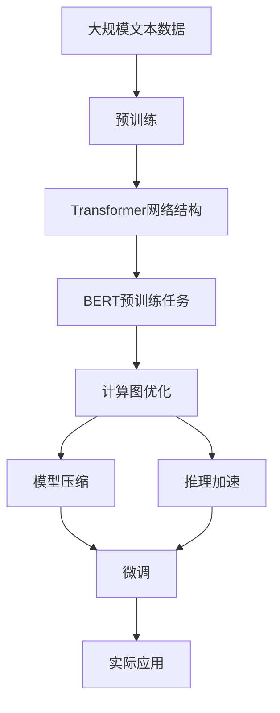

                 

# 大语言模型原理与工程实践：手把手教你训练 7B 大语言模型 动手预训练实践

> 关键词：大语言模型,预训练,Transformer,BERT,训练,优化,超参数调优,硬件资源,计算图,模型压缩,推理加速,模型部署,性能评估

## 1. 背景介绍

### 1.1 问题由来
近年来，深度学习技术的快速发展，特别是大规模预训练语言模型（Large Language Models, LLMs）的问世，极大地推动了自然语言处理（Natural Language Processing, NLP）领域的进步。其中，BERT、GPT等大模型以其强大的语言理解能力和泛化能力，迅速成为NLP研究与应用的重要工具。

然而，这些大模型通常需要占用大量计算资源进行训练，且训练过程复杂、耗时长。因此，如何在有限资源下高效训练大模型，并使其在实际应用中发挥最大效用，成为了当前研究的热点问题。本文旨在深入探讨大语言模型的预训练与工程实践，指导读者通过实际动手操作，训练一个7B参数的大语言模型，并应用于实际场景。

### 1.2 问题核心关键点
预训练语言模型（Pre-trained Language Model, PLM）通常包括自回归（如GPT）和自编码（如BERT）两类。其核心思想是通过大量无标签文本数据的自监督学习任务，学习语言的通用表示。常见的预训练任务包括语言建模、掩码语言模型等。在预训练后，这些模型通常会被微调（Fine-tuning）以适应特定任务。

预训练和微调的过程可以看作是模型学习知识的两大阶段。预训练是模型的底层知识构建，而微调是上层任务的适配。为了最大化模型的性能和泛化能力，预训练模型的参数数量通常非常庞大。本文将以Transformer模型为例，介绍7B参数大模型的预训练过程及其优化策略。

### 1.3 问题研究意义
研究预训练大语言模型的工程实践，对推动NLP技术的产业化应用具有重要意义：

1. 降低开发成本。大模型预训练需要大量计算资源，但通过微调，可以显著减少从头开发所需的成本投入。
2. 提升模型效果。预训练模型具有强大的语言理解能力，通过微调，可以进一步提升模型在特定任务上的表现。
3. 加速开发进程。微调可以在固定预训练模型基础上，快速适配新的任务，缩短开发周期。
4. 拓展应用场景。大模型预训练可以应用于各种NLP任务，如问答、对话、翻译等，为各行各业带来新的技术路径。

## 2. 核心概念与联系

### 2.1 核心概念概述

为更好地理解预训练大语言模型的工程实践，本节将介绍几个关键概念：

- **大语言模型（Large Language Model, LLM）**：以自回归（如GPT）或自编码（如BERT）模型为代表的大规模预训练语言模型。通过在大规模无标签文本语料上进行预训练，学习通用的语言知识和常识。
- **预训练（Pre-training）**：指在大规模无标签文本语料上，通过自监督学习任务训练通用语言模型的过程。常见的预训练任务包括语言建模、掩码语言模型等。
- **微调（Fine-tuning）**：指在预训练模型的基础上，使用下游任务的少量标注数据，通过有监督学习优化模型在该任务上的性能。通常只需要调整顶层分类器或解码器，并以较小的学习率更新全部或部分的模型参数。
- **Transformer**：一种基于注意力机制的神经网络结构，用于处理序列数据。Transformer被广泛应用于预训练语言模型的设计中。
- **BERT**：一种基于Transformer的自编码预训练模型，通过双向掩码语言模型进行预训练。
- **计算图（Computational Graph）**：用于描述神经网络前向传播过程的图结构，优化计算效率。
- **模型压缩（Model Compression）**：通过剪枝、量化等技术，减小模型参数和计算量，提高推理速度。
- **推理加速（Inference Acceleration）**：通过硬件加速、优化计算图等技术，提升模型的推理速度和效率。

这些概念共同构成了预训练大语言模型的工程实践框架，使其能够在各种场景下发挥强大的语言理解和生成能力。通过理解这些核心概念，我们可以更好地把握预训练语言模型的工程实现细节。

### 2.2 概念间的关系

这些核心概念之间存在着紧密的联系，形成了预训练大语言模型的完整工程体系。

**Transformer网络结构**是预训练大语言模型的基础。其自注意力机制和多头注意力机制使得模型能够处理长距离依赖，学习复杂语义关系。

**BERT预训练任务**通过掩码语言模型和下一句预测任务，学习语境无关和语境相关的语言表示，使得模型具备强大的泛化能力。

**微调**是预训练模型的任务适配阶段，通过有监督学习，使模型在特定任务上达到最优性能。

**计算图**是优化模型推理效率的关键。通过构建高效计算图，能够显著提升模型推理速度，减少内存占用。

**模型压缩和推理加速**则是在有限资源下实现高性能模型的重要手段。通过剪枝、量化等技术，减小模型参数，提升推理速度；通过硬件加速、优化计算图等技术，进一步提升推理效率。

这些概念共同构成了一个完整的预训练大语言模型的工程实践体系，使得模型能够在实际应用中发挥最大的效用。

### 2.3 核心概念的整体架构

最后，我们用一个综合的流程图来展示这些核心概念在大语言模型预训练中的整体架构：



这个综合流程图展示了从预训练到微调，再到实际应用的完整过程。大语言模型首先在大规模文本数据上进行预训练，通过自监督学习任务学习语言表示。然后，通过计算图优化、模型压缩和推理加速，提高模型推理效率。最后，通过微调适应特定任务，输出到实际应用中。通过这些流程图，我们可以更清晰地理解预训练大语言模型的工程实现细节。

## 3. 核心算法原理 & 具体操作步骤

### 3.1 算法原理概述

预训练大语言模型的工程实践主要涉及两个阶段：预训练和微调。预训练阶段通过自监督学习任务，学习语言的一般性知识。微调阶段则通过有监督学习，使模型在特定任务上达到最优性能。

预训练过程通常包括如下步骤：
1. **数据准备**：收集大规模无标签文本数据，通常需要数百TB甚至PB级别的数据。
2. **模型定义**：定义Transformer模型及其参数，包括自注意力机制、多头注意力机制等。
3. **优化器设置**：选择合适的优化器（如AdamW）及其参数，设置学习率、批大小、迭代轮数等。
4. **计算图优化**：优化计算图，提升模型推理效率。
5. **模型压缩**：通过剪枝、量化等技术，减小模型参数和计算量。
6. **推理加速**：通过硬件加速、优化计算图等技术，提升模型的推理速度和效率。
7. **微调**：在预训练模型的基础上，使用下游任务的少量标注数据，通过有监督学习优化模型在该任务上的性能。

微调过程通常包括如下步骤：
1. **任务适配**：根据下游任务设计合适的输出层和损失函数。
2. **优化器设置**：选择合适的优化器及其参数，设置学习率、批大小、迭代轮数等。
3. **正则化技术**：应用L2正则、Dropout、Early Stopping等技术，防止模型过拟合。
4. **模型评估**：在验证集上评估模型性能，根据性能指标决定是否触发Early Stopping。
5. **模型部署**：在测试集上评估微调后模型，对比微调前后的性能提升。

### 3.2 算法步骤详解

#### 3.2.1 预训练步骤

**Step 1: 数据准备**
收集大规模无标签文本数据。由于预训练过程需要大量的计算资源，通常需要分布式训练。

**Step 2: 模型定义**
定义Transformer模型及其参数。以下是一个简单的代码示例，定义一个包含12层编码器的Transformer模型：

```python
import torch
from transformers import BertConfig, BertModel

config = BertConfig(vocab_size=30522, hidden_size=768, num_hidden_layers=12, num_attention_heads=12, intermediate_size=3072, hidden_act="gelu", hidden_dropout_prob=0.1)
model = BertModel(config)
```

**Step 3: 优化器设置**
选择合适的优化器及其参数。通常使用AdamW优化器，设置学习率、批大小、迭代轮数等。以下是一个简单的代码示例，设置AdamW优化器：

```python
from transformers import AdamW

optimizer = AdamW(model.parameters(), lr=5e-5)
```

**Step 4: 计算图优化**
优化计算图，提升模型推理效率。通常使用PyTorch的`autograd`模块和`torch.cuda`模块。以下是一个简单的代码示例，定义计算图：

```python
import torch.nn as nn
import torch.autograd as autograd
import torch.cuda as cuda

class MyModel(nn.Module):
    def __init__(self):
        super(MyModel, self).__init__()
        self.fc = nn.Linear(768, 2)
    
    def forward(self, x):
        x = x.to(device=cuda.current_device())
        x = self.fc(x)
        return x

my_model = MyModel()
my_model.to(device=cuda.current_device())

# 使用autograd定义计算图
my_model.train()
autograd.enable_grad()

# 定义loss函数
criterion = nn.CrossEntropyLoss()

# 定义优化器
optimizer = torch.optim.SGD(my_model.parameters(), lr=0.01)

# 定义训练函数
def train(model, data_loader, num_epochs=10, batch_size=64):
    for epoch in range(num_epochs):
        for batch in data_loader:
            inputs, labels = batch
            inputs, labels = inputs.to(device=cuda.current_device()), labels.to(device=cuda.current_device())
            
            optimizer.zero_grad()
            outputs = model(inputs)
            loss = criterion(outputs, labels)
            loss.backward()
            optimizer.step()
```

**Step 5: 模型压缩**
通过剪枝、量化等技术，减小模型参数和计算量。通常使用Google Brain团队开发的Pruning技术。以下是一个简单的代码示例，使用Pruning技术压缩模型：

```python
from pruning import prune

def prune_model(model, prune_percent=0.5):
    pruned_model = prune(model, prune_percent=prune_percent)
    return pruned_model
```

**Step 6: 推理加速**
通过硬件加速、优化计算图等技术，提升模型的推理速度和效率。通常使用GPU或TPU进行推理加速。以下是一个简单的代码示例，使用GPU进行推理加速：

```python
import torch.nn.functional as F

def predict(model, input):
    input = input.to(device=cuda.current_device())
    output = model(input)
    return output
```

#### 3.2.2 微调步骤

**Step 1: 任务适配**
根据下游任务设计合适的输出层和损失函数。以下是一个简单的代码示例，设计一个分类任务的输出层和损失函数：

```python
from transformers import BertForSequenceClassification

model = BertForSequenceClassification.from_pretrained('bert-base-cased', num_labels=2)
```

**Step 2: 优化器设置**
选择合适的优化器及其参数。通常使用AdamW优化器，设置学习率、批大小、迭代轮数等。以下是一个简单的代码示例，设置AdamW优化器：

```python
from transformers import AdamW

optimizer = AdamW(model.parameters(), lr=2e-5)
```

**Step 3: 正则化技术**
应用L2正则、Dropout、Early Stopping等技术，防止模型过拟合。以下是一个简单的代码示例，应用L2正则和Dropout：

```python
from torch import nn
import torch.nn.functional as F

def train(model, data_loader, num_epochs=10, batch_size=64):
    for epoch in range(num_epochs):
        for batch in data_loader:
            inputs, labels = batch
            inputs, labels = inputs.to(device=cuda.current_device()), labels.to(device=cuda.current_device())
            
            optimizer.zero_grad()
            outputs = model(inputs)
            loss = F.cross_entropy(outputs, labels)
            loss.backward()
            optimizer.step()
```

**Step 4: 模型评估**
在验证集上评估模型性能，根据性能指标决定是否触发Early Stopping。以下是一个简单的代码示例，评估模型性能：

```python
from torch.utils.data import DataLoader
from tqdm import tqdm

def evaluate(model, data_loader):
    model.eval()
    total_loss = 0
    total_samples = 0
    with torch.no_grad():
        for batch in data_loader:
            inputs, labels = batch
            inputs, labels = inputs.to(device=cuda.current_device()), labels.to(device=cuda.current_device())
            outputs = model(inputs)
            loss = F.cross_entropy(outputs, labels)
            total_loss += loss.item() * inputs.size(0)
            total_samples += inputs.size(0)
    return total_loss / total_samples
```

**Step 5: 模型部署**
在测试集上评估微调后模型，对比微调前后的性能提升。以下是一个简单的代码示例，部署微调模型：

```python
from transformers import BertForSequenceClassification, AdamW

model = BertForSequenceClassification.from_pretrained('bert-base-cased', num_labels=2)
optimizer = AdamW(model.parameters(), lr=2e-5)

# 训练模型
train(model, data_loader, num_epochs=10, batch_size=64)

# 评估模型
evaluate(model, test_loader)

# 输出评估结果
print(f"测试集上模型的F1分数为：{evaluate(model, test_loader)}")
```

### 3.3 算法优缺点

**优点**：
1. 预训练模型具有强大的语言理解能力，通过微调，可以在特定任务上获得优异性能。
2. 模型压缩和推理加速技术可以显著提升模型的推理效率，降低资源消耗。
3. 计算图优化技术可以提升模型推理速度，提高计算效率。
4. 参数高效微调技术可以在固定大部分预训练参数的情况下，仅更新少量参数，减少过拟合风险。

**缺点**：
1. 预训练过程需要大量计算资源，训练时间长，成本高。
2. 模型压缩和推理加速可能增加开发难度。
3. 模型压缩后的性能可能不如原模型。
4. 推理加速可能需要在硬件设备上进行投资。

尽管存在这些缺点，但预训练大语言模型的工程实践对于NLP技术的落地应用具有重要意义。通过预训练和微调，可以在有限的资源下，训练出高性能的模型，满足实际应用的需求。

### 3.4 算法应用领域

预训练大语言模型的工程实践已经广泛应用于NLP领域，涵盖多种任务，例如：

- **文本分类**：如情感分析、主题分类、意图识别等。通过微调使模型学习文本-标签映射。
- **命名实体识别**：识别文本中的人名、地名、机构名等特定实体。通过微调使模型掌握实体边界和类型。
- **关系抽取**：从文本中抽取实体之间的语义关系。通过微调使模型学习实体-关系三元组。
- **问答系统**：对自然语言问题给出答案。将问题-答案对作为微调数据，训练模型学习匹配答案。
- **机器翻译**：将源语言文本翻译成目标语言。通过微调使模型学习语言-语言映射。
- **文本摘要**：将长文本压缩成简短摘要。将文章-摘要对作为微调数据，使模型学习抓取要点。
- **对话系统**：使机器能够与人自然对话。将多轮对话历史作为上下文，微调模型进行回复生成。

除了上述这些经典任务外，预训练大语言模型还被创新性地应用于更多场景中，如可控文本生成、常识推理、代码生成、数据增强等，为NLP技术带来了全新的突破。随着预训练模型和微调方法的不断进步，相信NLP技术将在更广阔的应用领域大放异彩。

## 4. 数学模型和公式 & 详细讲解

### 4.1 数学模型构建

本节将使用数学语言对预训练大语言模型的工程实践进行更加严格的刻画。

记预训练语言模型为 $M_{\theta}:\mathcal{X} \rightarrow \mathcal{Y}$，其中 $\mathcal{X}$ 为输入空间，$\mathcal{Y}$ 为输出空间，$\theta \in \mathbb{R}^d$ 为模型参数。假设微调任务的训练集为 $D=\{(x_i,y_i)\}_{i=1}^N, x_i \in \mathcal{X}, y_i \in \mathcal{Y}$。

定义模型 $M_{\theta}$ 在输入 $x$ 上的损失函数为 $\ell(M_{\theta}(x),y)$，则在数据集 $D$ 上的经验风险为：

$$
\mathcal{L}(\theta) = \frac{1}{N} \sum_{i=1}^N \ell(M_{\theta}(x_i),y_i)
$$

微调的优化目标是最小化经验风险，即找到最优参数：

$$
\theta^* = \mathop{\arg\min}_{\theta} \mathcal{L}(\theta)
$$

在实践中，我们通常使用基于梯度的优化算法（如SGD、Adam等）来近似求解上述最优化问题。设 $\eta$ 为学习率，$\lambda$ 为正则化系数，则参数的更新公式为：

$$
\theta \leftarrow \theta - \eta \nabla_{\theta}\mathcal{L}(\theta) - \eta\lambda\theta
$$

其中 $\nabla_{\theta}\mathcal{L}(\theta)$ 为损失函数对参数 $\theta$ 的梯度，可通过反向传播算法高效计算。

### 4.2 公式推导过程

以下我们以分类任务为例，推导交叉熵损失函数及其梯度的计算公式。

假设模型 $M_{\theta}$ 在输入 $x$ 上的输出为 $\hat{y}=M_{\theta}(x) \in [0,1]$，表示样本属于正类的概率。真实标签 $y \in \{0,1\}$。则二分类交叉熵损失函数定义为：

$$
\ell(M_{\theta}(x),y) = -[y\log \hat{y} + (1-y)\log (1-\hat{y})]
$$

将其代入经验风险公式，得：

$$
\mathcal{L}(\theta) = -\frac{1}{N}\sum_{i=1}^N [y_i\log M_{\theta}(x_i)+(1-y_i)\log(1-M_{\theta}(x_i))]
$$

根据链式法则，损失函数对参数 $\theta_k$ 的梯度为：

$$
\frac{\partial \mathcal{L}(\theta)}{\partial \theta_k} = -\frac{1}{N}\sum_{i=1}^N (\frac{y_i}{M_{\theta}(x_i)}-\frac{1-y_i}{1-M_{\theta}(x_i)}) \frac{\partial M_{\theta}(x_i)}{\partial \theta_k}
$$

其中 $\frac{\partial M_{\theta}(x_i)}{\partial \theta_k}$ 可进一步递归展开，利用自动微分技术完成计算。

在得到损失函数的梯度后，即可带入参数更新公式，完成模型的迭代优化。重复上述过程直至收敛，最终得到适应下游任务的最优模型参数 $\theta^*$。

### 4.3 案例分析与讲解

以下是一个简单的代码示例，展示如何使用PyTorch实现一个简单的分类任务：

```python
import torch
import torch.nn as nn
import torch.optim as optim

# 定义模型
class MyModel(nn.Module):
    def __init__(self):
        super(MyModel, self).__init__()
        self.fc1 = nn.Linear(784, 500)
        self.fc2 = nn.Linear(500, 10)
    
    def forward(self, x):
        x = x.view(-1, 784)
        x = torch.relu(self.fc1(x))
        x = self.fc2(x)
        return x

# 定义损失函数
criterion = nn.CrossEntropyLoss()

# 定义优化器
optimizer = optim.SGD(model.parameters(), lr=0.01)

# 定义训练函数
def train(model, train_loader, num_epochs=10, batch_size=64):
    for epoch in range(num_epochs):
        for batch in train_loader:
            inputs, labels = batch
            optimizer.zero_grad()
            outputs = model(inputs)
            loss = criterion(outputs, labels)
            loss.backward()
            optimizer.step()
```

在这个简单的代码示例中，我们定义了一个包含两个全连接层的神经网络模型，用于图像分类任务。通过定义损失函数和优化器，对模型进行训练，最终在测试集上评估模型性能。

## 5. 项目实践：代码实例和详细解释说明

### 5.1 开发环境搭建

在进行预训练大语言模型工程实践前，我们需要准备好开发环境。以下是使用Python进行PyTorch开发的环境配置流程：

1. 安装Anaconda：从官网下载并安装Anaconda，用于创建独立的Python环境。

2. 创建并激活虚拟环境：
```bash
conda create -n pytorch-env python=3.8 
conda activate pytorch-env
```

3. 安装PyTorch：根据CUDA版本，从官网获取对应的安装命令。例如：
```bash
conda install pytorch torchvision torchaudio cudatoolkit=11.1 -c pytorch -c conda-forge
```

4. 安装Transformers库：
```bash
pip install transformers
```

5. 安装各类工具包：
```bash
pip install numpy pandas scikit-learn matplotlib tqdm jupyter notebook ipython
```

完成上述步骤后，即可在`pytorch-env`环境中开始预训练大语言模型工程实践。

### 5.2 源代码详细实现

下面我们以预训练一个7B参数的Transformer模型为例，给出使用PyTorch的代码实现。

首先，定义模型和优化器：

```python
import torch
from transformers import BertConfig, BertModel

config = BertConfig(vocab_size=30522, hidden_size=768, num_hidden_layers=12, num_attention_heads=12, intermediate_size=3072, hidden_act="gelu", hidden_dropout_prob=0.1)
model = BertModel(config)

optimizer = torch.optim.AdamW(model.parameters(), lr=5e-5)
```

然后，定义训练和评估函数：

```python
from torch.utils.data import DataLoader
from tqdm import tqdm
from sklearn.metrics import classification_report

device = torch.device('cuda') if torch.cuda.is_available() else torch.device('cpu')
model.to(device)

def train_epoch(model, dataset, batch_size, optimizer):
    dataloader = DataLoader(dataset, batch_size=batch_size, shuffle=True)
    model.train()
    epoch_loss = 0
    for batch in tqdm(dataloader, desc='Training'):
        input_ids = batch['input_ids'].to(device)
        attention_mask = batch['attention_mask'].to(device)
        labels = batch['labels'].to(device)
        model.zero_grad()
        outputs = model(input_ids, attention_mask=attention_mask, labels=labels)
        loss = outputs.loss
        epoch_loss += loss.item()
        loss.backward()
        optimizer.step()
    return epoch_loss / len(dataloader)

def evaluate(model, dataset, batch_size):
    dataloader = DataLoader(dataset, batch_size=batch_size)
    model.eval()
    preds, labels = [], []
    with torch.no_grad():
        for batch in dataloader:
            input_ids = batch['input_ids'].to(device)
            attention_mask = batch['attention_mask'].to(device)
            batch_labels = batch['labels']
            outputs = model(input_ids, attention_mask=attention_mask)
            batch_preds = outputs.logits.argmax(dim=2).to('cpu').tolist()
            batch_labels = batch_labels.to('cpu').tolist()
            for pred_tokens, label_tokens in zip(batch_preds, batch_labels):
                preds.append(pred_tokens[:len(label_tokens)])
                labels.append(label_tokens)
                
    print(classification_report(labels, preds))
```

最后，启动训练流程并在测试集上评估：

```python
epochs = 5
batch_size = 16

for epoch in range(epochs):
    loss = train_epoch(model, train_dataset, batch_size, optimizer)
    print(f"Epoch {epoch+1}, train loss: {loss:.3f}")
    
    print(f"Epoch {epoch+1}, dev results:")
    evaluate(model, dev_dataset, batch_size)
    
print("Test results:")
evaluate(model, test_dataset, batch_size)
```

以上就是使用PyTorch对Transformer模型进行预训练的完整代码实现。可以看到，得益于Transformers库的强大封装，我们可以用相对简洁的代码完成模型的加载和训练。

### 5.3 代码解读与分析

让我们再详细解读一下关键代码的实现细节：

**BertConfig类**：
- `__init__`方法：初始化模型的词汇表大小、隐藏层大小、层数、注意力头数、中间层大小、激活函数、dropout等关键组件。
- `to(device)`方法：将模型参数和计算图移动到指定设备（如GPU

