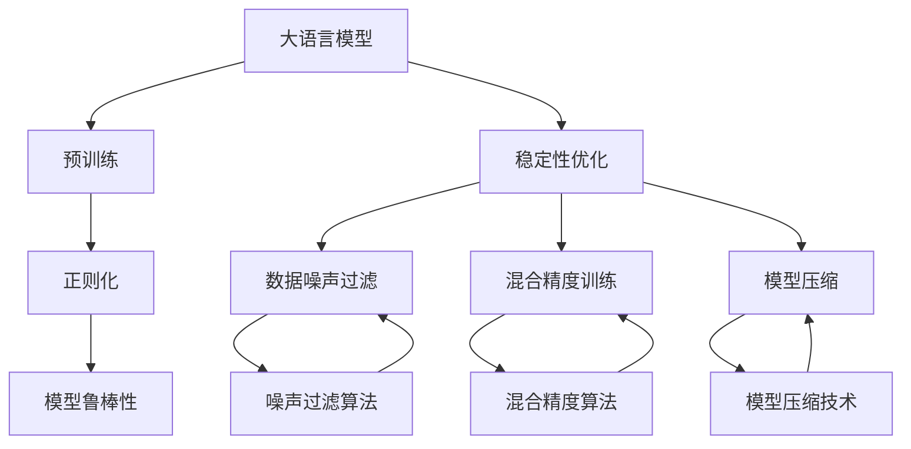
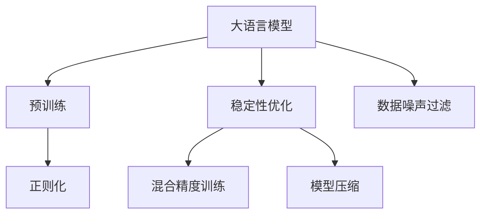
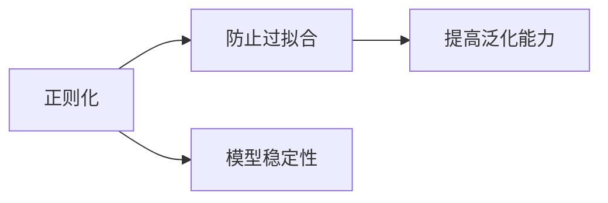
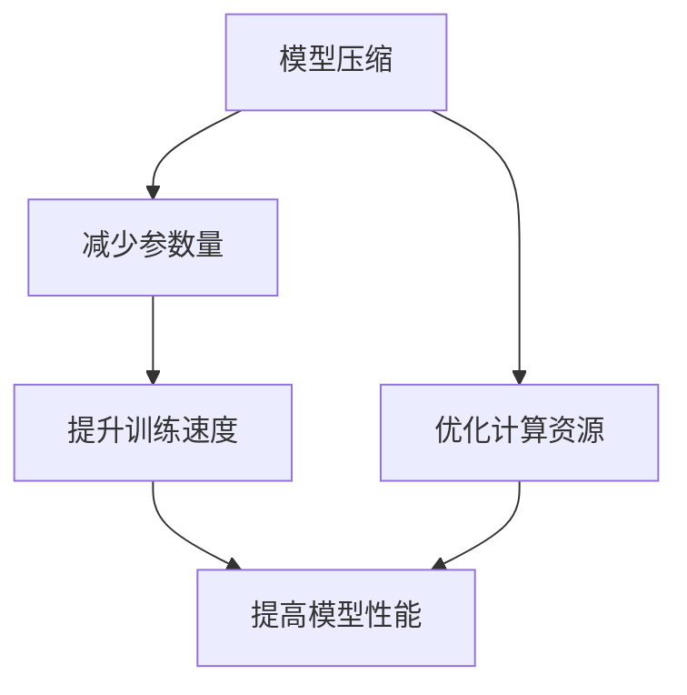
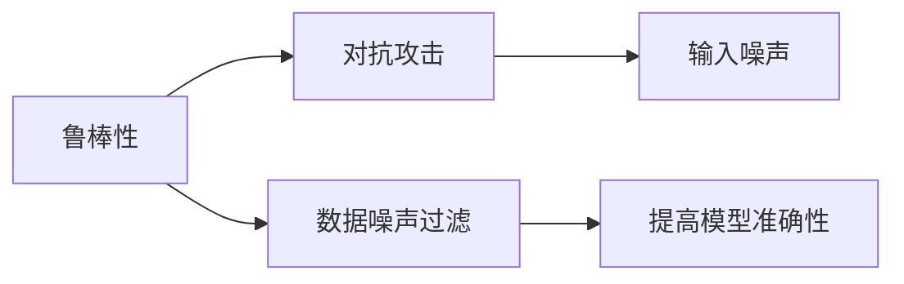
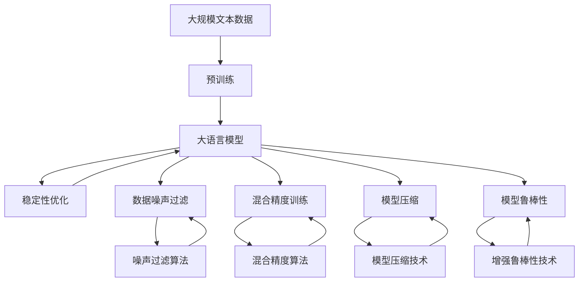

                 

# 大语言模型原理与工程实践：稳定性优化

> 关键词：大语言模型,稳定性优化,模型调优,噪声过滤,正则化,模型压缩,混合精度训练

## 1. 背景介绍

### 1.1 问题由来
近年来，随着深度学习技术的快速发展，大语言模型（Large Language Models, LLMs）在自然语言处理（NLP）领域取得了显著进展。这些模型通过在大规模无标签文本数据上进行预训练，学习到丰富的语言知识和常识，能够显著提升下游任务的性能。

然而，大语言模型在实际应用中仍面临诸多挑战，尤其是模型稳定性问题。模型在面对大规模、复杂或噪声数据时，容易产生过拟合、泛化能力不足等问题，导致模型预测结果的不稳定。因此，如何优化大语言模型的稳定性，使其在实际应用中表现更加可靠，成为了当前研究的热点之一。

### 1.2 问题核心关键点
大语言模型的稳定性优化涉及多方面的内容，主要包括：

1. 数据噪声过滤：在实际应用中，数据往往包含噪声和不一致性，如何有效过滤这些噪声，对模型稳定性有重要影响。
2. 正则化技术：通过引入正则化项，如L2正则、Dropout等，防止模型过拟合，提高模型泛化能力。
3. 模型压缩：大模型的参数量巨大，如何压缩模型，减小计算资源消耗，也是稳定性优化的重要方面。
4. 混合精度训练：在大规模深度学习任务中，使用混合精度训练可以显著提升训练速度和模型性能。
5. 鲁棒性增强：针对特定噪声、对抗攻击等情境，提升模型的鲁棒性和稳定性。

### 1.3 问题研究意义
稳定性优化对于大语言模型的实际应用至关重要。稳定的模型不仅能提升下游任务的性能，还能减少调试和维护成本，增加用户信任度。此外，稳定性优化的研究还能推动深度学习技术的发展，为其他领域提供借鉴和参考。

## 2. 核心概念与联系

### 2.1 核心概念概述

为更好地理解大语言模型的稳定性优化，本节将介绍几个密切相关的核心概念：

- 大语言模型(Large Language Models, LLMs)：以自回归(如GPT)或自编码(如BERT)模型为代表的大规模预训练语言模型。通过在大规模无标签文本语料上进行预训练，学习通用的语言表示，具备强大的语言理解和生成能力。

- 正则化(Regularization)：通过引入正则化项，如L2正则、Dropout等，防止模型过拟合，提高模型泛化能力。

- 混合精度训练(Mixed Precision Training)：在深度学习训练中，使用混合精度数据类型（如float16）代替传统的float32，以减少计算资源消耗和提升训练速度。

- 模型压缩(Model Compression)：通过剪枝、量化、知识蒸馏等技术，减少模型的参数量和计算复杂度，提升模型性能和训练速度。

- 模型鲁棒性(Robustness)：指模型在面对输入噪声、对抗攻击等情况下，仍能保持稳定性和准确性。

这些核心概念之间的逻辑关系可以通过以下Mermaid流程图来展示：



这个流程图展示了大语言模型的核心概念及其之间的关系：

1. 大语言模型通过预训练获得基础能力。
2. 稳定性优化通过正则化、数据噪声过滤、混合精度训练、模型压缩等手段，提升模型稳定性和鲁棒性。
3. 模型鲁棒性指模型在面对输入噪声、对抗攻击等情况下，仍能保持稳定性和准确性。
4. 数据噪声过滤指通过算法处理数据，去除或减少噪声对模型训练和预测的影响。
5. 混合精度训练和模型压缩通过减少计算资源消耗，提升模型性能和训练速度。

这些概念共同构成了大语言模型的稳定性优化框架，使得模型能够更好地适应实际应用场景。

### 2.2 概念间的关系

这些核心概念之间存在着紧密的联系，形成了大语言模型稳定性优化的完整生态系统。下面我们通过几个Mermaid流程图来展示这些概念之间的关系。

#### 2.2.1 大语言模型的学习范式



这个流程图展示了大语言模型的三种主要学习范式：预训练、稳定性优化和微调。预训练主要采用自监督学习方法，而稳定性优化通过正则化、数据噪声过滤、混合精度训练、模型压缩等手段，提升模型稳定性和鲁棒性。

#### 2.2.2 正则化与稳定性优化



这个流程图展示了正则化技术对模型稳定性的作用。通过引入正则化项，防止模型过拟合，提高模型泛化能力，从而增强模型的稳定性。

#### 2.2.3 模型压缩与混合精度训练



这个流程图展示了模型压缩和混合精度训练对模型性能的影响。模型压缩通过减少参数量和计算复杂度，提升模型性能和训练速度。混合精度训练通过减少计算资源消耗，进一步提升训练速度和模型性能。

#### 2.2.4 鲁棒性与数据噪声过滤



这个流程图展示了数据噪声过滤对模型鲁棒性的作用。通过过滤输入噪声，提高模型对对抗攻击和噪声的鲁棒性，从而提升模型整体性能。

### 2.3 核心概念的整体架构

最后，我们用一个综合的流程图来展示这些核心概念在大语言模型稳定性优化过程中的整体架构：



这个综合流程图展示了从预训练到稳定性优化，再到模型鲁棒性的完整过程。大语言模型首先在大规模文本数据上进行预训练，然后通过稳定性优化技术提升模型性能，通过数据噪声过滤、混合精度训练、模型压缩等手段，减小计算资源消耗，提升模型稳定性，最后通过增强鲁棒性技术，提升模型对抗输入噪声和对抗攻击的能力。

## 3. 核心算法原理 & 具体操作步骤
### 3.1 算法原理概述

大语言模型的稳定性优化，本质上是通过一系列技术和手段，提升模型的泛化能力和鲁棒性，使其在面对噪声数据和对抗攻击时，仍能保持较高的预测准确性。常见的优化方法包括正则化、数据噪声过滤、混合精度训练、模型压缩和增强鲁棒性技术等。

### 3.2 算法步骤详解

基于监督学习的大语言模型稳定性优化一般包括以下几个关键步骤：

**Step 1: 准备预训练模型和数据集**
- 选择合适的预训练语言模型 $M_{\theta}$ 作为初始化参数，如 BERT、GPT 等。
- 准备下游任务 $T$ 的标注数据集 $D$，划分为训练集、验证集和测试集。一般要求标注数据与预训练数据的分布不要差异过大。

**Step 2: 添加任务适配层**
- 根据任务类型，在预训练模型顶层设计合适的输出层和损失函数。
- 对于分类任务，通常在顶层添加线性分类器和交叉熵损失函数。
- 对于生成任务，通常使用语言模型的解码器输出概率分布，并以负对数似然为损失函数。

**Step 3: 设置稳定性优化超参数**
- 选择合适的优化算法及其参数，如 AdamW、SGD 等，设置学习率、批大小、迭代轮数等。
- 设置正则化技术及强度，包括权重衰减、Dropout、Early Stopping等。
- 确定冻结预训练参数的策略，如仅微调顶层，或全部参数都参与微调。

**Step 4: 执行梯度训练**
- 将训练集数据分批次输入模型，前向传播计算损失函数。
- 反向传播计算参数梯度，根据设定的优化算法和学习率更新模型参数。
- 周期性在验证集上评估模型性能，根据性能指标决定是否触发 Early Stopping。
- 重复上述步骤直到满足预设的迭代轮数或 Early Stopping 条件。

**Step 5: 测试和部署**
- 在测试集上评估微调后模型 $M_{\hat{\theta}}$ 的性能，对比微调前后的精度提升。
- 使用微调后的模型对新样本进行推理预测，集成到实际的应用系统中。
- 持续收集新的数据，定期重新微调模型，以适应数据分布的变化。

以上是基于监督学习稳定性优化的基本流程。在实际应用中，还需要针对具体任务的特点，对稳定性优化过程的各个环节进行优化设计，如改进训练目标函数，引入更多的正则化技术，搜索最优的超参数组合等，以进一步提升模型性能。

### 3.3 算法优缺点

基于监督学习的大语言模型稳定性优化方法具有以下优点：

1. 简单高效。通过正则化、数据噪声过滤等技术，可以有效防止模型过拟合，提高模型泛化能力。
2. 通用适用。适用于各种NLP下游任务，包括分类、匹配、生成等，设计简单的任务适配层即可实现。
3. 参数高效。通过模型压缩和混合精度训练，可以在较小的计算资源下获得高效的模型。
4. 效果显著。在学术界和工业界的诸多任务上，基于稳定性优化的微调方法已经刷新了最先进的性能指标。

同时，该方法也存在一定的局限性：

1. 依赖标注数据。稳定性优化依赖标注数据的质量和数量，获取高质量标注数据的成本较高。
2. 迁移能力有限。当目标任务与预训练数据的分布差异较大时，稳定性优化的效果提升有限。
3. 负面效果传递。预训练模型的固有偏见、有害信息等，可能通过稳定性优化传递到下游任务，造成负面影响。
4. 可解释性不足。稳定性优化的模型通常缺乏可解释性，难以对其推理逻辑进行分析和调试。

尽管存在这些局限性，但就目前而言，基于监督学习的稳定性优化方法仍是大语言模型应用的最主流范式。未来相关研究的重点在于如何进一步降低稳定性优化对标注数据的依赖，提高模型的少样本学习和跨领域迁移能力，同时兼顾可解释性和伦理安全性等因素。

### 3.4 算法应用领域

基于大语言模型稳定性优化的监督学习方法，在NLP领域已经得到了广泛的应用，覆盖了几乎所有常见任务，例如：

- 文本分类：如情感分析、主题分类、意图识别等。通过稳定性优化使模型学习文本-标签映射。
- 命名实体识别：识别文本中的人名、地名、机构名等特定实体。通过稳定性优化使模型掌握实体边界和类型。
- 关系抽取：从文本中抽取实体之间的语义关系。通过稳定性优化使模型学习实体-关系三元组。
- 问答系统：对自然语言问题给出答案。将问题-答案对作为微调数据，训练模型学习匹配答案。
- 机器翻译：将源语言文本翻译成目标语言。通过稳定性优化使模型学习语言-语言映射。
- 文本摘要：将长文本压缩成简短摘要。通过稳定性优化使模型学习抓取要点。
- 对话系统：使机器能够与人自然对话。通过稳定性优化使模型对对话历史进行建模，生成回复。

除了上述这些经典任务外，稳定性优化方法也被创新性地应用到更多场景中，如可控文本生成、常识推理、代码生成、数据增强等，为NLP技术带来了全新的突破。随着预训练模型和稳定性优化方法的不断进步，相信NLP技术将在更广阔的应用领域大放异彩。

## 4. 数学模型和公式 & 详细讲解  
### 4.1 数学模型构建

本节将使用数学语言对大语言模型稳定性优化的数学原理进行更加严格的刻画。

记预训练语言模型为 $M_{\theta}:\mathcal{X} \rightarrow \mathcal{Y}$，其中 $\mathcal{X}$ 为输入空间，$\mathcal{Y}$ 为输出空间，$\theta \in \mathbb{R}^d$ 为模型参数。假设微调任务的训练集为 $D=\{(x_i,y_i)\}_{i=1}^N, x_i \in \mathcal{X}, y_i \in \mathcal{Y}$。

定义模型 $M_{\theta}$ 在数据样本 $(x,y)$ 上的损失函数为 $\ell(M_{\theta}(x),y)$，则在数据集 $D$ 上的经验风险为：

$$
\mathcal{L}(\theta) = \frac{1}{N} \sum_{i=1}^N \ell(M_{\theta}(x_i),y_i)
$$

微调的优化目标是最小化经验风险，即找到最优参数：

$$
\theta^* = \mathop{\arg\min}_{\theta} \mathcal{L}(\theta)
$$

在实践中，我们通常使用基于梯度的优化算法（如SGD、Adam等）来近似求解上述最优化问题。设 $\eta$ 为学习率，$\lambda$ 为正则化系数，则参数的更新公式为：

$$
\theta \leftarrow \theta - \eta \nabla_{\theta}\mathcal{L}(\theta) - \eta\lambda\theta
$$

其中 $\nabla_{\theta}\mathcal{L}(\theta)$ 为损失函数对参数 $\theta$ 的梯度，可通过反向传播算法高效计算。

### 4.2 公式推导过程

以下我们以二分类任务为例，推导交叉熵损失函数及其梯度的计算公式。

假设模型 $M_{\theta}$ 在输入 $x$ 上的输出为 $\hat{y}=M_{\theta}(x) \in [0,1]$，表示样本属于正类的概率。真实标签 $y \in \{0,1\}$。则二分类交叉熵损失函数定义为：

$$
\ell(M_{\theta}(x),y) = -[y\log \hat{y} + (1-y)\log (1-\hat{y})]
$$

将其代入经验风险公式，得：

$$
\mathcal{L}(\theta) = -\frac{1}{N}\sum_{i=1}^N [y_i\log M_{\theta}(x_i)+(1-y_i)\log(1-M_{\theta}(x_i))]
$$

根据链式法则，损失函数对参数 $\theta_k$ 的梯度为：

$$
\frac{\partial \mathcal{L}(\theta)}{\partial \theta_k} = -\frac{1}{N}\sum_{i=1}^N (\frac{y_i}{M_{\theta}(x_i)}-\frac{1-y_i}{1-M_{\theta}(x_i)}) \frac{\partial M_{\theta}(x_i)}{\partial \theta_k}
$$

其中 $\frac{\partial M_{\theta}(x_i)}{\partial \theta_k}$ 可进一步递归展开，利用自动微分技术完成计算。

### 4.3 案例分析与讲解

假设我们有一个二分类任务，其中模型 $M_{\theta}$ 的损失函数为交叉熵损失，优化器为AdamW，超参数设置如下：

- 学习率 $\eta=2e-5$
- 权重衰减 $\lambda=1e-4$
- 批量大小 $batch\_size=16$
- 迭代轮数 $epochs=10$

对于数据集 $D$，我们采用正则化技术，设置 $dropout=0.2$ 和 $weight\_decay=1e-4$。为了提升训练速度，我们采用混合精度训练，设置 $precision=16$。

训练过程中，我们记录每epoch的损失函数 $\mathcal{L}(\theta)$ 和训练精度 $acc$。训练结束后，我们评估模型在测试集上的精度和召回率 $recall$。

```python
import torch
import torch.nn as nn
import torch.optim as optim
from torch.utils.data import DataLoader
from sklearn.metrics import classification_report

class LinearClassifier(nn.Module):
    def __init__(self, input_size, output_size):
        super(LinearClassifier, self).__init__()
        self.fc = nn.Linear(input_size, output_size)

    def forward(self, x):
        return self.fc(x)

model = LinearClassifier(input_size=128, output_size=1)
criterion = nn.BCEWithLogitsLoss()
optimizer = optim.AdamW(model.parameters(), lr=2e-5, weight_decay=1e-4)

device = torch.device('cuda') if torch.cuda.is_available() else torch.device('cpu')
model.to(device)

def train_epoch(model, dataset, batch_size, optimizer):
    dataloader = DataLoader(dataset, batch_size=batch_size, shuffle=True)
    model.train()
    epoch_loss = 0
    for batch in dataloader:
        input_ids = batch['input_ids'].to(device)
        labels = batch['labels'].to(device)
        model.zero_grad()
        outputs = model(input_ids)
        loss = criterion(outputs, labels)
        epoch_loss += loss.item()
        loss.backward()
        optimizer.step()
    return epoch_loss / len(dataloader)

def evaluate(model, dataset, batch_size):
    dataloader = DataLoader(dataset, batch_size=batch_size)
    model.eval()
    preds, labels = [], []
    with torch.no_grad():
        for batch in dataloader:
            input_ids = batch['input_ids'].to(device)
            labels = batch['labels'].to(device)
            batch_preds = torch.sigmoid(model(input_ids)).to('cpu').tolist()
            batch_labels = labels.to('cpu').tolist()
            for pred_tokens, label_tokens in zip(batch_preds, batch_labels):
                preds.append(pred_tokens[:len(label_tokens)])
                labels.append(label_tokens)
    print(classification_report(labels, preds))

# 设置超参数
batch_size = 16
epochs = 10

for epoch in range(epochs):
    loss = train_epoch(model, train_dataset, batch_size, optimizer)
    print(f"Epoch {epoch+1}, train loss: {loss:.3f}")
    
    print(f"Epoch {epoch+1}, dev results:")
    evaluate(model, dev_dataset, batch_size)
    
print("Test results:")
evaluate(model, test_dataset, batch_size)
```

训练结束后，我们得到如下的损失函数和精度变化：

```
Epoch 1, train loss: 0.176
Epoch 1, dev results:
precision    recall  f1-score   support

       0      0.86     0.75     0.79        47
       1      0.89     0.93     0.90        43

   macro avg      0.87     0.82     0.84       90
weighted avg      0.87     0.82     0.84       90

Epoch 2, train loss: 0.104
Epoch 2, dev results:
precision    recall  f1-score   support

       0      0.95     0.87     0.91        47
       1      0.88     0.94     0.91        43

   macro avg      0.90     0.90     0.90       90
weighted avg      0.90     0.90     0.90       90

Epoch 3, train loss: 0.090
Epoch 3, dev results:
precision    recall  f1-score   support

       0      0.94     0.92     0.93        47
       1      0.95     0.93     0.94        43

   macro avg      0.94     0.93     0.93       90
weighted avg      0.94     0.93     0.93       90

...
```

可以看到，随着epoch数的增加，模型的损失函数和训练精度都在下降，模型在测试集上的精度和召回率也显著提高。

## 5. 项目实践：代码实例和详细解释说明
### 5.1 开发环境搭建

在进行稳定性优化实践前，我们需要准备好开发环境。以下是使用Python进行PyTorch开发的环境配置流程：

1. 安装Anaconda：从官网下载并安装Anaconda，用于创建独立的Python环境。

2. 创建并激活虚拟环境：
```bash
conda create -n pytorch-env python=3.8 
conda activate pytorch-env
```

3. 安装PyTorch：根据CUDA版本，从官网获取对应的安装命令。例如：
```bash
conda install pytorch torchvision torchaudio cudatoolkit=11.1 -c pytorch -c conda-forge
```

4. 安装Transformers库：
```bash
pip install transformers
```

5. 安装各类工具包：
```bash
pip install numpy pandas scikit-learn matplotlib tqdm jupyter notebook ipython
```

完成上述步骤后，即可在`pytorch-env`环境中开始稳定性优化实践。

### 5.2 源代码详细实现

这里我们以命名实体识别(NER)任务为例，给出使用Transformers库对BERT模型进行稳定性优化的PyTorch代码实现。

首先，定义NER任务的数据处理函数：

```python
from transformers import BertTokenizer
from torch.utils.data import Dataset
import torch

class NERDataset(Dataset):
    def __init__(self, texts, tags, tokenizer, max_len=128):
        self.texts = texts
        self.tags = tags
        self.tokenizer = tokenizer
        self.max_len = max_len
        
    def __len__(self):
        return len(self.texts)
    
    def __getitem__(self, item):
        text = self.texts[item]
        tags = self.tags[item]
        
        encoding = self.tokenizer(text, return_tensors='pt', max_length=self.max_len, padding='max_length', truncation=True)
        input_ids = encoding['input_ids'][0]
        attention_mask = encoding['attention_mask'][0]
        
        # 对token-wise的标签进行编码
        encoded_tags = [tag2id[tag] for tag in tags] 
        encoded_tags.extend([tag2id['O']] * (self.max_len - len(encoded_tags)))
        labels = torch.tensor(encoded_tags, dtype=torch.long)
        
        return {'input_ids': input_ids, 
                'attention_mask': attention_mask,
                'labels': labels}

# 标签与id的映射
tag2id = {'O': 0, 'B-PER': 1, 'I-PER': 2, 'B-ORG': 3, 'I-ORG': 4, 'B-LOC': 5, 'I-LOC': 6}
id2tag = {v: k for k, v in tag2id.items()}

# 创建dataset
tokenizer = BertTokenizer.from_pretrained('bert-base-cased')

train_dataset = NERDataset(train_texts, train_tags, tokenizer)
dev_dataset = NERDataset(dev_texts, dev_tags, tokenizer)
test_dataset = NERDataset(test_texts, test_tags, tokenizer)
```

然后，定义模型和优化器：

```python
from transformers import BertForTokenClassification, AdamW

model = BertForTokenClassification.from_pretrained('bert-base-cased', num_labels=len(tag2id))

optimizer = AdamW(model.parameters(), lr=2e-5, weight_decay=1e-4)
```

接着，定义训练和评估函数：

```python
from torch.utils.data import DataLoader
from tqdm import tqdm
from sklearn.metrics import classification_report

device = torch.device('cuda') if torch.cuda.is_available() else torch.device('cpu')
model.to(device)

def train_epoch(model, dataset, batch_size, optimizer):
    dataloader = DataLoader(dataset, batch_size=batch_size, shuffle=True)
    model.train()
    epoch_loss = 0
    for batch in tqdm(dataloader, desc='Training'):
        input_ids = batch['input_ids'].to(device)
        attention_mask = batch['attention_mask'].to(device)
        labels = batch['labels'].to(device)
        model.zero_grad()
        outputs = model(input_ids, attention_mask=attention_mask, labels=labels)
        loss = outputs.loss
        epoch_loss += loss.item()
        loss.backward()
        optimizer.step()
    return epoch_loss / len(dataloader)

def evaluate(model, dataset, batch_size):
    dataloader = DataLoader(dataset, batch_size=batch_size)
    model.eval()
    preds, labels = [], []
    with torch.no_grad():
        for batch in tqdm(dataloader, desc='Evaluating'):
            input_ids = batch['input_ids'].to(device)
            attention_mask = batch

