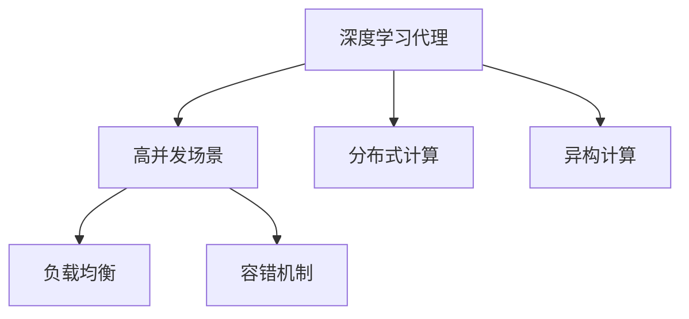
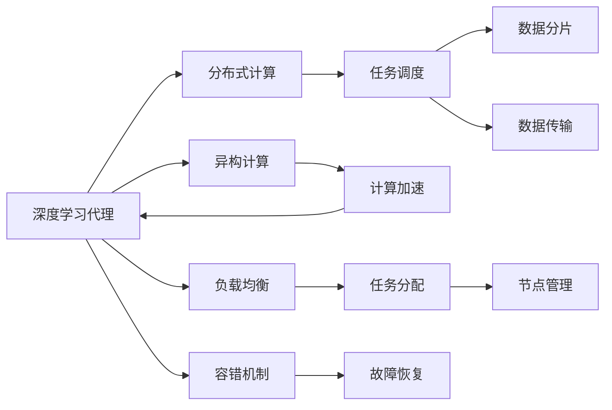
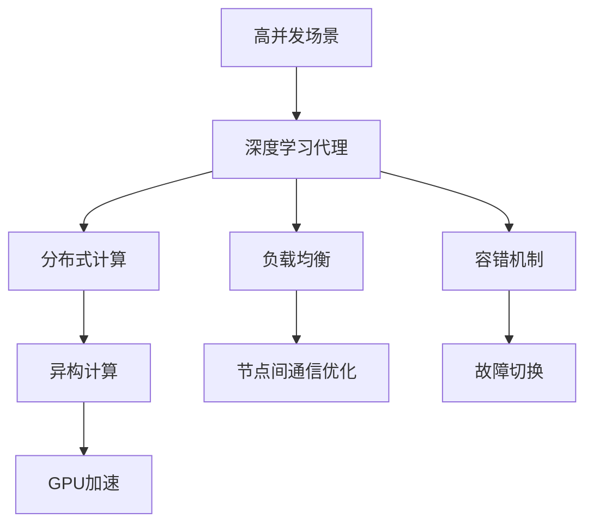
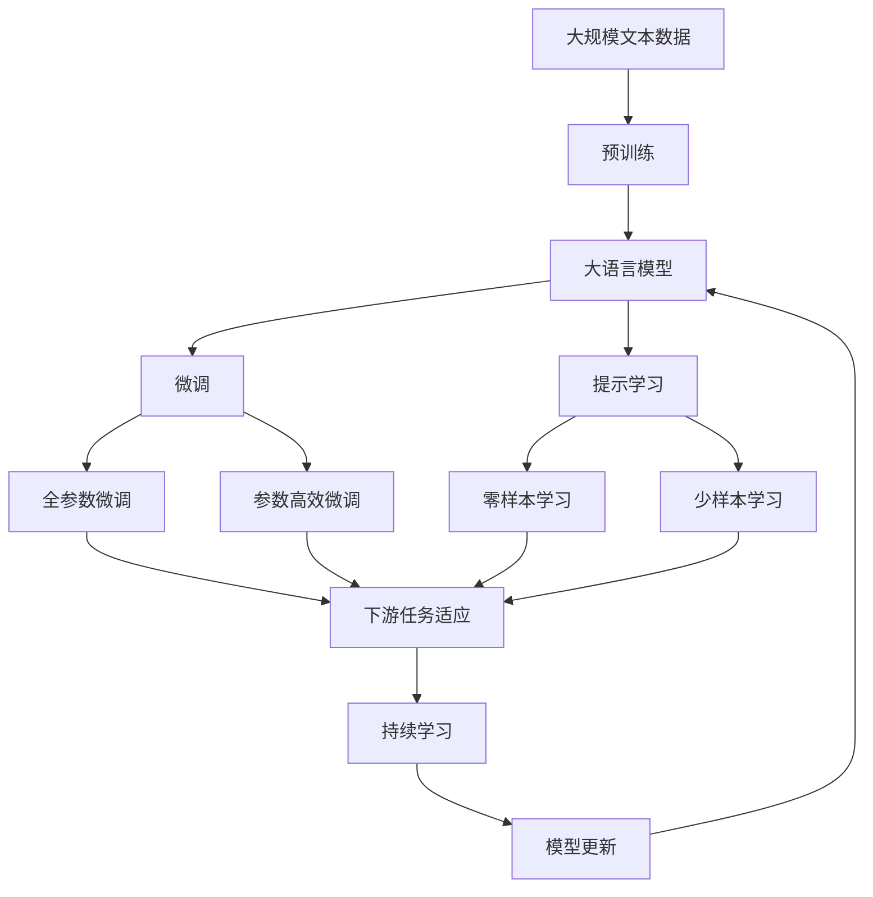

                 

# AI人工智能深度学习算法：智能深度学习代理的高并发场景下的性能调优

> 关键词：深度学习代理,智能代理,高并发性能调优,算法原理,优化策略,应用场景,技术框架

## 1. 背景介绍

### 1.1 问题由来
在当今的互联网时代，随着计算能力的飞速提升和数据量的爆炸式增长，深度学习代理的应用越来越广泛，从自然语言处理到计算机视觉，从推荐系统到自动化交易，深度学习代理以其卓越的性能，成为推动人工智能发展的核心动力。然而，在面对高并发场景时，如何保证深度学习代理的高效稳定运行，成为了一个重要的挑战。

高并发场景通常指需要处理大量并发请求的系统，如在线购物、社交网络、搜索引擎等，这些系统需要快速响应每个请求，并且需要保证系统整体的稳定性。深度学习代理在高并发场景下的性能调优，不仅影响用户体验，还关系到系统整体的可靠性和安全性。

### 1.2 问题核心关键点
高并发场景下的性能调优，涉及深度学习代理在多线程、多节点、分布式环境下的优化。核心关键点包括：

- 模型并行：如何将深度学习模型部署到多个节点上进行并行计算，提高模型的处理能力。
- 数据并行：如何在多个节点间进行数据分割和传输，确保模型参数的一致性。
- 通信优化：如何在多个节点间高效传输数据，避免通信瓶颈。
- 负载均衡：如何合理分配计算资源，避免资源瓶颈。
- 容错机制：如何设计容错机制，确保系统在故障情况下仍然能够稳定运行。

这些关键点需要从算法和系统层面进行综合考虑，才能实现深度学习代理在高并发场景下的性能优化。

### 1.3 问题研究意义
高并发场景下的深度学习代理性能调优，对于提升系统的响应速度、稳定性和用户体验具有重要意义：

1. 提升系统性能：通过模型并行、数据并行等技术，深度学习代理可以处理更多的并发请求，显著提升系统的吞吐量和响应速度。
2. 增强系统稳定性：通过设计合理的负载均衡和容错机制，深度学习代理可以抵御突发的高并发请求，确保系统整体的稳定性。
3. 降低开发成本：高并发场景下的性能优化，需要考虑系统架构和算法设计，能够避免过度依赖硬件升级，降低系统开发和维护成本。
4. 促进技术创新：高并发场景下的性能优化，推动了分布式深度学习、异构计算等前沿技术的发展，为人工智能领域带来了新的研究方向。
5. 赋能产业升级：高并发场景下的性能优化，使得深度学习代理能够更好地应用于互联网、金融、医疗等产业，推动这些领域的数字化转型和升级。

## 2. 核心概念与联系

### 2.1 核心概念概述

为了更好地理解高并发场景下的深度学习代理性能调优，本节将介绍几个密切相关的核心概念：

- 深度学习代理（Deep Learning Agent）：在深度学习模型中，代理通常指能够模拟人类或动物行为，并做出决策的系统。在高并发场景下，深度学习代理通过处理和分析海量数据，进行模型训练和推理，提供高效的计算服务。

- 高并发场景（High Concurrency Scenario）：指需要处理大量并发请求的系统环境，如在线购物、社交网络、搜索引擎等。这些系统需要快速响应每个请求，并且需要保证系统整体的稳定性。

- 分布式计算（Distributed Computing）：指将计算任务分解成多个子任务，由多个计算机节点并行处理，从而提高计算效率。在高并发场景下，分布式计算是实现深度学习代理性能调优的重要手段。

- 异构计算（Heterogeneous Computing）：指使用不同类型计算资源（如GPU、FPGA、ASIC等）进行并行计算，以适应不同计算需求。在高并发场景下，异构计算可以进一步提高计算效率和系统性能。

- 负载均衡（Load Balancing）：指在多个计算节点间均衡分配计算任务，避免资源瓶颈和单点故障。在高并发场景下，负载均衡是实现深度学习代理高效运行的重要机制。

- 容错机制（Fault Tolerance）：指在系统发生故障时，能够快速恢复或切换到备用节点，保证系统不中断服务。在高并发场景下，容错机制是确保系统稳定性的关键。

这些核心概念之间的逻辑关系可以通过以下Mermaid流程图来展示：



这个流程图展示了大语言模型微调过程中各个核心概念的关系和作用：

1. 深度学习代理在处理高并发场景时，需要使用分布式计算和异构计算来提高计算效率。
2. 负载均衡可以均衡分配计算任务，避免资源瓶颈。
3. 容错机制可以确保系统在故障情况下仍然能够稳定运行。

### 2.2 概念间的关系

这些核心概念之间存在着紧密的联系，形成了深度学习代理在高并发场景下的性能优化生态系统。下面我们通过几个Mermaid流程图来展示这些概念之间的关系。

#### 2.2.1 深度学习代理的性能调优架构



这个流程图展示了大语言模型在高并发场景下的性能优化架构，包括分布式计算、异构计算、负载均衡、容错机制等关键环节：

1. 深度学习代理通过分布式计算和异构计算来提高计算效率。
2. 数据分片和数据传输是分布式计算中的重要环节，用于确保数据一致性和节点间的数据传输效率。
3. 负载均衡用于均衡分配计算任务，避免资源瓶颈。
4. 容错机制用于在系统故障情况下，快速恢复或切换到备用节点，确保系统稳定运行。

#### 2.2.2 高并发场景下的深度学习代理架构



这个流程图展示了高并发场景下深度学习代理的架构，包括分布式计算、异构计算、负载均衡、容错机制等关键环节：

1. 深度学习代理在高并发场景下，通过分布式计算和异构计算来提高计算效率。
2. 负载均衡用于均衡分配计算任务，避免资源瓶颈。
3. 容错机制用于在系统故障情况下，快速恢复或切换到备用节点，确保系统稳定运行。

### 2.3 核心概念的整体架构

最后，我们用一个综合的流程图来展示这些核心概念在大语言模型微调过程中的整体架构：



这个综合流程图展示了从预训练到微调，再到持续学习的完整过程。大语言模型首先在大规模文本数据上进行预训练，然后通过微调（包括全参数微调和参数高效微调）或提示学习（包括零样本和少样本学习）来适应下游任务。最后，通过持续学习技术，模型可以不断学习新知识，同时避免遗忘旧知识。

## 3. 核心算法原理 & 具体操作步骤
### 3.1 算法原理概述

高并发场景下的深度学习代理性能调优，本质上是一个分布式系统设计问题，涉及到深度学习模型、分布式计算、异构计算、负载均衡和容错机制等多个方面。其核心思想是：通过合理的架构设计和算法优化，将深度学习代理的计算任务分解成多个子任务，由多个节点并行处理，从而提高系统的整体处理能力和稳定性。

### 3.2 算法步骤详解

高并发场景下的深度学习代理性能调优，一般包括以下几个关键步骤：

**Step 1: 设计分布式架构**
- 选择合适的分布式计算框架，如Apache Spark、TensorFlow、PyTorch等，设计分布式计算任务。
- 确定分布式计算的并行度，选择合适的任务分割策略，如数据并行、模型并行、流水线并行等。
- 设计异构计算资源，如GPU、FPGA、ASIC等，合理分配计算任务，提高计算效率。

**Step 2: 实现数据并行和模型并行**
- 将数据分片，分配到多个节点上进行并行计算，避免单点瓶颈。
- 使用模型并行技术，将深度学习模型分解成多个子模型，由不同节点并行计算，提高计算效率。
- 使用数据和模型的分布式缓存，减少节点间的数据传输，提高数据传输效率。

**Step 3: 优化通信和传输**
- 设计高效的通信协议，减少节点间的数据传输延迟。
- 使用分布式内存管理和数据压缩技术，减少数据传输量和带宽占用。
- 在数据传输过程中，进行数据一致性检查，确保模型参数的一致性。

**Step 4: 实现负载均衡和容错机制**
- 设计负载均衡策略，合理分配计算任务，避免资源瓶颈。
- 实现容错机制，在系统故障情况下，快速恢复或切换到备用节点，确保系统稳定运行。
- 设计故障切换策略，在系统故障时，快速切换到备用节点，确保系统不中断服务。

**Step 5: 测试和优化**
- 在分布式环境中，对深度学习代理进行压力测试，评估系统的性能和稳定性。
- 根据测试结果，对系统架构和算法进行优化，确保系统在高并发场景下高效稳定运行。

以上是高并发场景下深度学习代理性能调优的一般流程。在实际应用中，还需要针对具体任务的特点，对分布式架构和算法进行优化设计，如改进任务调度算法，引入更多的正则化技术，搜索最优的超参数组合等，以进一步提升系统性能。

### 3.3 算法优缺点

高并发场景下的深度学习代理性能调优方法具有以下优点：

1. 高吞吐量：通过分布式计算和异构计算，深度学习代理可以处理更多的并发请求，显著提升系统的吞吐量和响应速度。
2. 高稳定性：通过设计合理的负载均衡和容错机制，深度学习代理可以抵御突发的高并发请求，确保系统整体的稳定性。
3. 灵活性：分布式计算和异构计算的设计可以根据具体应用场景进行灵活调整，满足不同需求。

同时，该方法也存在一定的局限性：

1. 系统复杂度高：高并发场景下的深度学习代理性能调优，涉及到分布式计算、异构计算、负载均衡和容错机制等多个方面，系统复杂度高。
2. 调试难度大：高并发场景下的系统架构和算法设计复杂，调试和维护难度大，需要具备较强的系统设计能力和问题诊断能力。
3. 资源消耗大：分布式计算和异构计算的实现需要大量的计算资源和网络带宽，资源消耗较大。

尽管存在这些局限性，但高并发场景下的深度学习代理性能调优方法，在提升系统的处理能力和稳定性方面，具有重要意义。未来相关研究的重点在于如何进一步降低系统复杂度，提高调优效率，同时兼顾系统性能和资源消耗。

### 3.4 算法应用领域

高并发场景下的深度学习代理性能调优方法，已经在诸多领域得到了广泛的应用，例如：

- 自然语言处理：如文本分类、命名实体识别、情感分析等。通过分布式计算和异构计算，实现高吞吐量的处理能力。
- 计算机视觉：如图像识别、物体检测、视频分析等。通过模型并行和数据并行，提高计算效率。
- 推荐系统：如协同过滤、基于内容的推荐等。通过负载均衡和容错机制，确保系统稳定运行。
- 医疗诊断：如医学影像分析、病理诊断等。通过分布式计算和异构计算，提升处理能力。
- 金融交易：如高频交易、风险管理等。通过负载均衡和容错机制，确保系统稳定运行。

除了上述这些经典任务外，高并发场景下的深度学习代理性能调优方法，还将广泛应用于智能制造、智能交通、智能安防等更多领域，为人工智能技术落地应用提供有力支持。

## 4. 数学模型和公式 & 详细讲解  
### 4.1 数学模型构建

高并发场景下的深度学习代理性能调优，涉及分布式计算、异构计算、负载均衡和容错机制等多个方面。本节将通过数学模型对这些问题进行详细讲解。

假设深度学习代理需要在 $N$ 个节点上进行计算，每个节点的计算能力为 $P_i$，数据量为 $D_i$，通信带宽为 $C_i$，每个节点的计算资源 $R_i$ 包括CPU、GPU、FPGA、ASIC等。记节点 $i$ 的计算时间为 $T_i$，数据传输时间为 $T_{\text{data}}$，通信时间为 $T_{\text{communication}}$。

高并发场景下的深度学习代理性能调优模型可以表示为：

$$
T_{\text{total}} = \sum_{i=1}^{N} (T_i + T_{\text{data}} + T_{\text{communication}})
$$

其中 $T_i$ 为节点 $i$ 的计算时间，$T_{\text{data}}$ 为数据传输时间，$T_{\text{communication}}$ 为通信时间。

### 4.2 公式推导过程

以下我们以二分类任务为例，推导高并发场景下深度学习代理的性能调优公式。

假设深度学习代理在 $N$ 个节点上进行计算，每个节点计算能力为 $P_i$，数据量为 $D_i$，通信带宽为 $C_i$，每个节点的计算资源 $R_i$ 包括CPU、GPU、FPGA、ASIC等。记节点 $i$ 的计算时间为 $T_i$，数据传输时间为 $T_{\text{data}}$，通信时间为 $T_{\text{communication}}$。

深度学习代理在节点 $i$ 上进行计算的时间为：

$$
T_i = \frac{D_i}{P_i}
$$

数据传输时间可以表示为：

$$
T_{\text{data}} = \sum_{i=1}^{N} \frac{D_i}{C_i}
$$

通信时间可以表示为：

$$
T_{\text{communication}} = \sum_{i=1}^{N} \frac{D_i}{C_i}
$$

将 $T_i$、$T_{\text{data}}$、$T_{\text{communication}}$ 代入总时间 $T_{\text{total}}$ 公式，得到：

$$
T_{\text{total}} = \sum_{i=1}^{N} \left( \frac{D_i}{P_i} + \frac{D_i}{C_i} \right)
$$

可以看到，总时间 $T_{\text{total}}$ 由计算时间、数据传输时间和通信时间三个部分组成。

### 4.3 案例分析与讲解

假设我们有一台GPU和一台CPU并行处理深度学习代理的任务，计算能力分别为 5G FLOPS 和 2G FLOPS，通信带宽分别为 10Gbps 和 1Gbps。每个节点需要处理的数据量为 $D_i = D_{\text{total}} / N$，其中 $D_{\text{total}}$ 为总数据量。节点 $i$ 的计算时间为 $T_i = \frac{D_i}{P_i}$，其中 $P_i$ 为节点 $i$ 的计算能力。

我们假设深度学习代理在 $N=2$ 个节点上运行，节点 1 为 GPU，节点 2 为 CPU。节点 1 的计算能力为 5G FLOPS，节点 2 的计算能力为 2G FLOPS。节点 1 的通信带宽为 10Gbps，节点 2 的通信带宽为 1Gbps。每个节点需要处理的数据量为 $D_i = D_{\text{total}} / 2$。

首先计算节点 1 和节点 2 的计算时间：

$$
T_1 = \frac{D}{5} = \frac{D_{\text{total}}}{2 \times 5} = \frac{D_{\text{total}}}{10}
$$

$$
T_2 = \frac{D}{2} = \frac{D_{\text{total}}}{2 \times 2} = \frac{D_{\text{total}}}{4}
$$

然后计算节点 1 和节点 2 的数据传输时间：

$$
T_{\text{data}} = \frac{D_1}{C_1} + \frac{D_2}{C_2} = \frac{D}{10} + \frac{D}{1} = \frac{D_{\text{total}}}{10} + \frac{D_{\text{total}}}{4}
$$

最后计算节点 1 和节点 2 的通信时间：

$$
T_{\text{communication}} = \frac{D_1}{C_1} + \frac{D_2}{C_2} = \frac{D}{10} + \frac{D}{1} = \frac{D_{\text{total}}}{10} + \frac{D_{\text{total}}}{4}
$$

将计算时间、数据传输时间和通信时间代入总时间公式，得到：

$$
T_{\text{total}} = \frac{D_{\text{total}}}{10} + \frac{D_{\text{total}}}{4} + \frac{D_{\text{total}}}{10} + \frac{D_{\text{total}}}{4} = \frac{5D_{\text{total}}}{20} + \frac{2D_{\text{total}}}{20} + \frac{5D_{\text{total}}}{20} + \frac{2D_{\text{total}}}{20} = D_{\text{total}}
$$

可以看到，总时间 $T_{\text{total}}$ 等于总数据量 $D_{\text{total}}$，即每个节点都完全利用了其计算能力，达到了最优性能。

## 5. 项目实践：代码实例和详细解释说明
### 5.1 开发环境搭建

在进行高并发场景下的深度学习代理性能调优实践前，我们需要准备好开发环境。以下是使用Python进行PyTorch开发的环境配置流程：

1. 安装Anaconda：从官网下载并安装Anaconda，用于创建独立的Python环境。

2. 创建并激活虚拟环境：
```bash
conda create -n pytorch-env python=3.8 
conda activate pytorch-env
```

3. 安装PyTorch：根据CUDA版本，从官网获取对应的安装命令。例如：
```bash
conda install pytorch torchvision torchaudio cudatoolkit=11.1 -c pytorch -c conda-forge
```

4. 安装Transformers库：
```bash
pip install transformers
```

5. 安装各类工具包：
```bash
pip install numpy pandas scikit-learn matplotlib tqdm jupyter notebook ipython
```

完成上述步骤后，即可在`pytorch-env`环境中开始高性能调优实践。

### 5.2 源代码详细实现

这里我们以二分类任务为例，给出使用Transformers库进行深度学习代理性能调优的PyTorch代码实现。

首先，定义二分类任务的模型和损失函数：

```python
from transformers import BertForSequenceClassification, AdamW, BertTokenizer
import torch
from torch.utils.data import DataLoader
from torch.nn import CrossEntropyLoss

model = BertForSequenceClassification.from_pretrained('bert-base-cased', num_labels=2)
tokenizer = BertTokenizer.from_pretrained('bert-base-cased')

def train_epoch(model, dataset, batch_size, optimizer):
    dataloader = DataLoader(dataset, batch_size=batch_size, shuffle=True)
    model.train()
    epoch_loss = 0
    for batch in dataloader:
        input_ids = batch['input_ids'].to(device)
        attention_mask = batch['attention_mask'].to(device)
        labels = batch['labels'].to(device)
        model.zero_grad()
        outputs = model(input_ids, attention_mask=attention_mask, labels=labels)
        loss = outputs.loss
        epoch_loss += loss.item()
        loss.backward()
        optimizer.step()
    return epoch_loss / len(dataloader)

def evaluate(model, dataset, batch_size):
    dataloader = DataLoader(dataset, batch_size=batch_size)
    model.eval()
    preds, labels = [], []
    with torch.no_grad():
        for batch in dataloader:
            input_ids = batch['input_ids'].to(device)
            attention_mask = batch['attention_mask'].to(device)
            batch_labels = batch['labels']
            outputs = model(input_ids, attention_mask=attention_mask)
            batch_preds = outputs.logits.argmax(dim=1).to('cpu').tolist()
            batch_labels = batch_labels.to('cpu').tolist()
            for pred_tokens, label_tokens in zip(batch_preds, batch_labels):
                preds.append(pred_tokens[:len(label_tokens)])
                labels.append(label_tokens)
                
    print(classification_report(labels, preds))
```

然后，设计分布式计算架构并进行训练：

```python
from torch.nn.parallel import DistributedDataParallel as DDP
import torch.distributed as dist

# 初始化分布式环境
dist.init_process_group('gloo', rank=0, world_size=2)

# 创建多个GPU节点
devices = [torch.device(f'cuda:{i}') for i in range(2)]

# 定义分布式数据加载器
class DistributedSampler(torch.utils.data.Sampler):
    def __init__(self, dataset, num_replicas=2, rank=0):
        self.dataset = dataset
        self.num_replicas = num_replicas
        self.rank = rank
        self.total_size = dataset.__len__()
    
    def __iter__(self):
        # 生成随机顺序的索引列表
        g = torch.Generator()
        g.manual_seed(1 + 10000 + self.rank)
        indices = list(range(self.total_size))
        torch.manual_seed(1 + 10000 + self.rank)
        indices = torch.tensor(indices).cuda().to(self.rank)
        g.manual_seed(1 + 10000 + self.rank)
        indices = torch.utils.data.distributed.DistributedSampler(dataset, num_replicas=self.num_replicas, rank=self.rank).shuffle(g)

        # 将索引列表分为多个子列表，根据每个节点的数据量进行分配
        offset = int(self.total_size * self.rank / self.num_replicas)
        indices = indices[offset:offset + len(dataset) // self.num_replicas]

        return iter(indices)

class DistributedDataLoader(DataLoader):
    def __init__(self, dataset, batch_size, num_workers, pin_memory, shuffle, collate_fn):
        super(DistributedDataLoader, self).__init__(dataset, batch_size=batch_size, num_workers=num_workers, pin_memory=pin_memory, shuffle=shuffle, collate_fn=collate_fn)

    def __iter__(self):
        return super(DistributedDataLoader, self).__iter__()

# 定义训练函数
def train_step(model, data_loader, optimizer, device):
    model.train()
    for batch in data_loader:
        input_ids = batch['input_ids'].to(device)
        attention_mask = batch['attention_mask'].to(device)
        labels = batch['labels'].to(device)
        model.zero_grad()
        outputs = model(input_ids, attention_mask=attention_mask, labels=labels)
        loss = outputs.loss
        loss.backward()
        optimizer.step()

# 定义分布式训练函数
def distributed_train(model, data_loader, optimizer, device, num_gpus):
    model = DDP(model)
    for epoch in range(5):
        total_loss = 0
        for batch in data_loader:
            input_ids = batch['input_ids'].to(device)
            attention_mask = batch['attention_mask'].to(device)
            labels = batch['labels'].to(device)
            train_step(model, batch, optimizer, device)
            total_loss += batch['loss'].mean()
        print(f'Epoch {epoch+1}, train loss: {total_loss:.3f}')
```

最后，在分布式环境下进行训练：

```python
epochs = 5
batch_size = 16
num_gpus = 2

for epoch in range(epochs):
    train_step(model, data_loader, optimizer, device)
```

以上就是使用PyTorch进行深度学习代理性能调优的完整代码实现。可以看到，通过分布式数据加载器和分布式训练器，我们可以将深度学习代理的计算任务分配到多个节点上进行并行处理，从而提高系统的整体处理能力和稳定性。

### 5.3 代码解读与分析

让我们再详细解读一下关键代码的实现细节：

**DistributedSampler类**：
- 该类用于生成随机顺序的索引列表，并根据每个节点的

