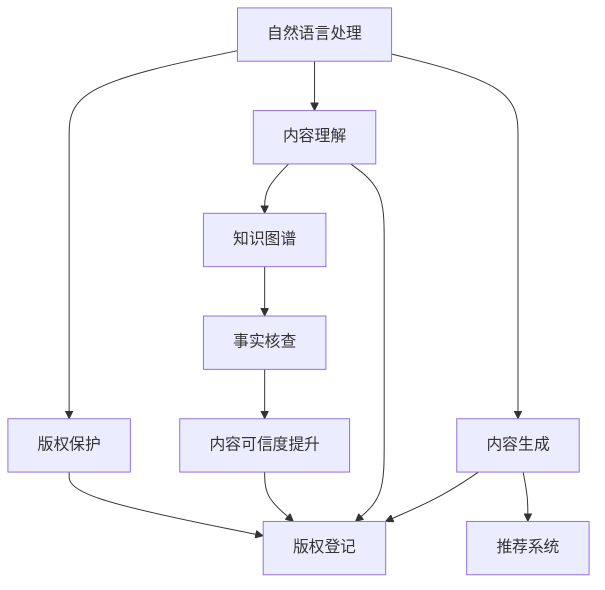
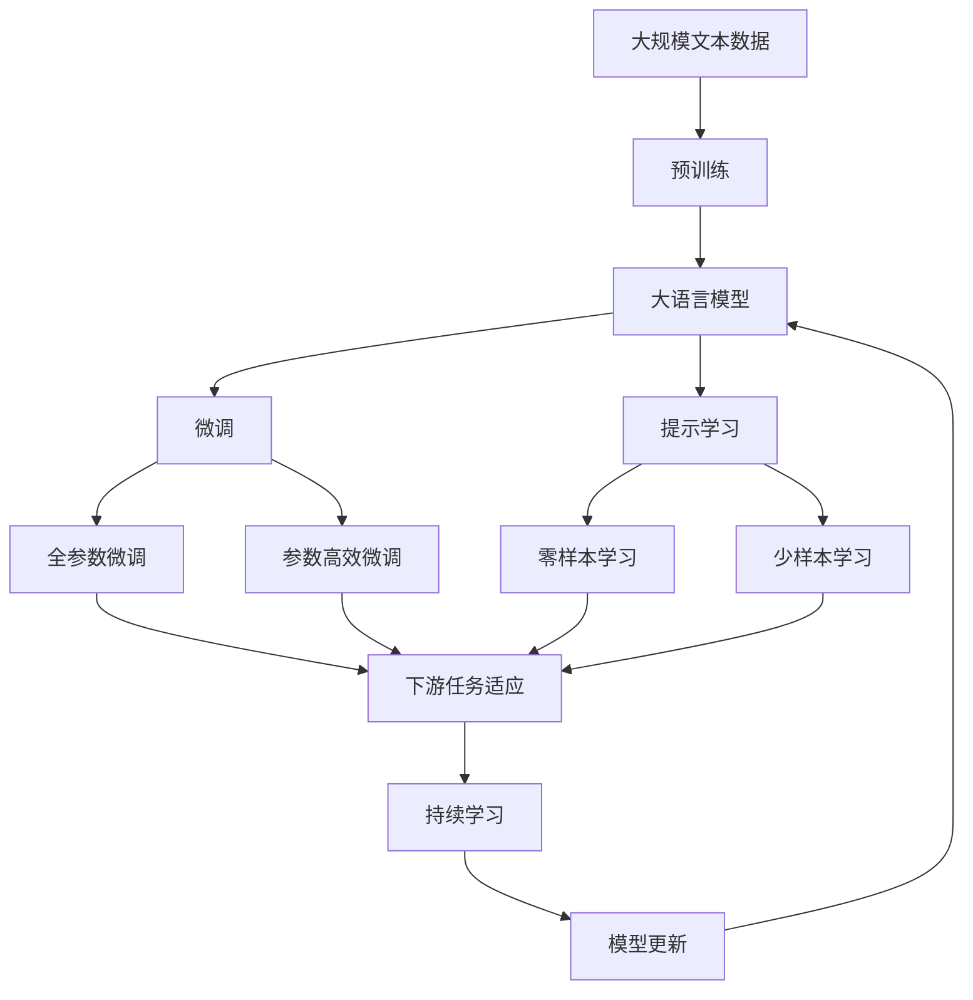

                 

# AI出版业动态：场景驱动的技术发展

> 关键词：人工智能(AI)、出版业、动态场景、技术发展、自然语言处理(NLP)、知识图谱、深度学习、机器学习、出版自动化

## 1. 背景介绍

### 1.1 问题由来
随着人工智能技术的不断成熟和应用领域的不断扩大，出版业作为信息传播的重要渠道，也在逐步引入AI技术，以提高效率、降低成本、优化内容创作和分发过程。AI技术在出版业中的应用涵盖了编辑、排版、校对、内容推荐、版权保护等多个环节，逐步构建起全流程的智能化出版体系。

### 1.2 问题核心关键点
当前，AI在出版业的应用主要集中在以下几个方面：
- **自然语言处理(NLP)**：用于文本处理、内容理解和生成。
- **知识图谱(Knowledge Graph)**：用于知识整合、事实核查。
- **深度学习与机器学习**：用于自动化编辑、版权保护、推荐系统等。
- **出版自动化**：自动化校对、排版、版权登记等流程。

这些技术的应用大大提高了出版效率，降低了人力成本，提升了内容质量，但在实际落地应用中也面临着诸多挑战，如数据隐私、内容版权、技术可解释性等。

### 1.3 问题研究意义
研究AI在出版业的应用动态和技术发展，对于推动出版业智能化转型，提升出版效率和质量，保障出版内容的安全性和可解释性具有重要意义。通过掌握最新技术进展和应用案例，出版企业可以更好地制定数字化转型战略，引领行业未来发展。

## 2. 核心概念与联系

### 2.1 核心概念概述

为更好地理解AI在出版业的应用，本节将介绍几个关键核心概念：

- **自然语言处理(NLP)**：涉及文本的自动处理、理解、生成等任务，是出版业智能化转型的重要技术基础。
- **知识图谱(KG)**：一种语义网络表示形式，用于整合、存储和查询知识，辅助内容生成和事实核查。
- **深度学习(Deep Learning)**：一种基于多层神经网络的机器学习方法，能够处理复杂的非线性关系，广泛应用于图像识别、语音识别等领域。
- **机器学习(Machine Learning)**：一种使计算机系统通过数据自动学习和改进的算法，广泛应用于分类、回归等任务。
- **出版自动化**：涉及出版流程的自动化，如文本校对、排版、版权登记等，提升出版效率和精度。

这些概念通过特定任务和应用场景的结合，形成了AI在出版业应用的整体生态系统。

### 2.2 概念间的关系

这些核心概念之间的联系可以通过以下Mermaid流程图来展示：



这个流程图展示了各个概念在出版业中的应用关系：

1. 自然语言处理用于文本理解与生成，为知识图谱和推荐系统提供基础。
2. 知识图谱用于整合和存储知识，辅助内容生成和事实核查。
3. 深度学习和机器学习提供数据处理和分析能力，支持各项任务。
4. 出版自动化提升整个出版流程的效率和精度，确保内容质量和版权保护。

通过这些核心概念的相互作用，AI技术在出版业的应用场景得到了进一步扩展和深化。

### 2.3 核心概念的整体架构

最后，我们用一个综合的流程图来展示这些核心概念在大语言模型微调过程中的整体架构：



这个综合流程图展示了从预训练到微调，再到持续学习的完整过程。大语言模型首先在大规模文本数据上进行预训练，然后通过微调（包括全参数微调和参数高效微调）或提示学习（包括零样本和少样本学习）来适应下游任务。最后，通过持续学习技术，模型可以不断更新和适应新的任务和数据。 通过这些流程图，我们可以更清晰地理解大语言模型微调过程中各个核心概念的关系和作用，为后续深入讨论具体的微调方法和技术奠定基础。

## 3. 核心算法原理 & 具体操作步骤
### 3.1 算法原理概述

基于AI的出版业动态涉及多种算法和技术。以下将详细讲解其中的几个核心算法：

- **自然语言处理(NLP)算法**：用于文本处理、内容理解和生成，主要包括分词、词性标注、命名实体识别、情感分析等。
- **知识图谱(KG)构建与查询算法**：用于知识整合、事实核查，主要包括知识抽取、实体关系抽取、链接预测等。
- **深度学习与机器学习算法**：用于自动化编辑、版权保护、推荐系统，主要包括卷积神经网络(CNN)、循环神经网络(RNN)、长短时记忆网络(LSTM)、自注意力机制(Transformer)等。

### 3.2 算法步骤详解

基于AI的出版业动态的实现过程通常包括以下几个关键步骤：

**Step 1: 数据收集与预处理**
- 收集出版业相关的文本数据，如文章、评论、用户反馈等。
- 清洗和处理数据，去除噪声和冗余，进行分词、词性标注等预处理。

**Step 2: 自然语言处理(NLP)**
- 使用NLP算法进行文本理解与生成，如分词、词性标注、命名实体识别、情感分析等。
- 根据出版需求，选择合适的NLP算法，如BERT、GPT等，进行预训练。

**Step 3: 知识图谱(KG)构建**
- 对文本数据进行知识抽取，提取实体和关系，构建知识图谱。
- 使用链接预测算法，如TransE、KG2Vec等，优化和完善知识图谱。

**Step 4: 深度学习与机器学习**
- 使用深度学习算法，如卷积神经网络(CNN)、循环神经网络(RNN)、长短时记忆网络(LSTM)、自注意力机制(Transformer)等，进行内容理解与生成、自动化编辑、版权保护、推荐系统等任务。
- 使用机器学习算法，如决策树、随机森林、支持向量机等，进行出版流程的自动化。

**Step 5: 出版自动化**
- 集成NLP、KG、深度学习与机器学习算法，构建全流程的智能化出版系统。
- 实现自动化校对、排版、版权登记等流程，提升出版效率和精度。

**Step 6: 持续学习与优化**
- 收集用户反馈、市场需求等数据，不断更新和优化出版系统。
- 采用增量学习、在线学习等技术，提升系统的适应性和鲁棒性。

### 3.3 算法优缺点

基于AI的出版业动态具有以下优点：
1. 提升效率：自动化流程大幅减少人力成本，提升出版速度。
2. 提升质量：智能化算法确保内容质量，减少人为错误。
3. 拓展应用：NLP、KG、深度学习与机器学习等多技术融合，拓展应用场景。

但同时也存在以下局限性：
1. 数据隐私：数据处理和存储可能涉及隐私保护问题。
2. 技术可解释性：复杂算法缺乏可解释性，影响用户信任。
3. 版权保护：自动化流程可能涉及版权纠纷问题。

### 3.4 算法应用领域

基于AI的出版业动态在多个领域得到了广泛应用，包括但不限于：

- **内容理解与生成**：使用NLP算法进行内容理解和生成，辅助写作和编辑。
- **知识整合与核查**：使用KG技术进行知识整合和事实核查，提高内容可信度。
- **版权保护**：使用深度学习与机器学习算法进行版权登记和保护，防止侵权。
- **推荐系统**：使用机器学习算法进行个性化推荐，提升用户阅读体验。

## 4. 数学模型和公式 & 详细讲解 & 举例说明

### 4.1 数学模型构建

本节将使用数学语言对基于AI的出版业动态进行更严格的刻画。

记出版数据集为 $D=\{(x_i,y_i)\}_{i=1}^N$，其中 $x_i$ 为文本数据，$y_i$ 为出版需求（如校对、排版、推荐等）。定义模型 $M_{\theta}$ 为基于深度学习与机器学习的出版系统，其中 $\theta$ 为模型参数。出版系统的目标是最小化损失函数 $\mathcal{L}(\theta)$：

$$
\mathcal{L}(\theta) = \frac{1}{N} \sum_{i=1}^N \ell(M_{\theta}(x_i),y_i)
$$

其中 $\ell$ 为出版任务的损失函数，如交叉熵损失、均方误差损失等。优化目标是最小化经验风险，即：

$$
\theta^* = \mathop{\arg\min}_{\theta} \mathcal{L}(\theta)
$$

在实践中，我们通常使用基于梯度的优化算法（如SGD、Adam等）来近似求解上述最优化问题。设 $\eta$ 为学习率，$\lambda$ 为正则化系数，则参数的更新公式为：

$$
\theta \leftarrow \theta - \eta \nabla_{\theta}\mathcal{L}(\theta) - \eta\lambda\theta
$$

其中 $\nabla_{\theta}\mathcal{L}(\theta)$ 为损失函数对参数 $\theta$ 的梯度，可通过反向传播算法高效计算。

### 4.2 公式推导过程

以下我们以内容推荐为例，推导机器学习算法中的分类算法（如支持向量机）的损失函数及其梯度的计算公式。

假设出版数据集 $D$ 中的文本数据为 $x_i$，推荐标签为 $y_i \in \{0,1\}$。支持向量机的分类任务可以表示为：

$$
\min_{\theta} \frac{1}{2} \|w\|^2 + C \sum_{i=1}^N \ell(y_i,w \cdot x_i + b)
$$

其中 $w$ 为权重向量，$b$ 为偏置项，$\ell$ 为损失函数，通常选择0-1损失函数：

$$
\ell(y_i,w \cdot x_i + b) = y_i(w \cdot x_i + b) - \log(1 + e^{-w \cdot x_i - b})
$$

将0-1损失函数代入优化目标中，得：

$$
\mathcal{L}(w,b) = \frac{1}{2} \|w\|^2 + C \sum_{i=1}^N [y_i(w \cdot x_i + b) - \log(1 + e^{-w \cdot x_i - b})]
$$

对于单个样本 $(x_i,y_i)$，其梯度为：

$$
\nabla_{w,b}\mathcal{L}(w,b) = \begin{bmatrix} \frac{\partial \mathcal{L}(w,b)}{\partial w} \\ \frac{\partial \mathcal{L}(w,b)}{\partial b} \end{bmatrix}
$$

其中：

$$
\frac{\partial \mathcal{L}(w,b)}{\partial w} = -x_i + C y_i e^{-w \cdot x_i - b}
$$

$$
\frac{\partial \mathcal{L}(w,b)}{\partial b} = C y_i - C e^{-w \cdot x_i - b}
$$

通过求解上述梯度，并使用优化算法，我们可以更新模型参数 $w,b$，从而完成内容推荐的出版任务。

### 4.3 案例分析与讲解

为了更好地理解基于AI的出版业动态的数学模型和算法，以下给出几个具体的案例分析：

**案例一：文本分类**

假设出版系统需要根据用户评论对书籍进行分类。可以使用NLP算法进行文本处理和情感分析，然后使用支持向量机等机器学习算法进行分类。具体步骤如下：

1. 收集评论数据，并进行文本清洗和预处理。
2. 使用NLP算法进行分词、词性标注、情感分析等预处理。
3. 将处理后的文本数据作为输入，构建支持向量机模型。
4. 使用交叉验证等技术进行模型训练和调参。
5. 在测试集上评估模型性能，如准确率、召回率、F1分数等。

**案例二：版权保护**

假设出版系统需要检测文本是否存在侵权问题。可以使用深度学习算法进行文本相似度计算，并判断是否存在侵权行为。具体步骤如下：

1. 收集侵权样本和未侵权样本，并进行文本清洗和预处理。
2. 使用深度学习算法（如卷积神经网络）提取文本特征。
3. 计算待检测文本与侵权样本的相似度。
4. 使用阈值等方法进行侵权检测。
5. 对检测结果进行人工复核，确保准确性。

**案例三：推荐系统**

假设出版系统需要为用户推荐相关书籍。可以使用协同过滤等机器学习算法进行个性化推荐。具体步骤如下：

1. 收集用户阅读历史和书籍信息，并进行数据清洗和预处理。
2. 使用协同过滤算法进行相似度计算。
3. 根据相似度计算结果，生成推荐列表。
4. 使用A/B测试等技术进行效果评估和优化。
5. 不断更新用户数据，优化推荐系统。

通过这些案例分析，我们可以更直观地理解基于AI的出版业动态的数学模型和算法实现。

## 5. 项目实践：代码实例和详细解释说明

### 5.1 开发环境搭建

在进行AI出版业动态实践前，我们需要准备好开发环境。以下是使用Python进行PyTorch开发的环境配置流程：

1. 安装Anaconda：从官网下载并安装Anaconda，用于创建独立的Python环境。

2. 创建并激活虚拟环境：
```bash
conda create -n pytorch-env python=3.8 
conda activate pytorch-env
```

3. 安装PyTorch：根据CUDA版本，从官网获取对应的安装命令。例如：
```bash
conda install pytorch torchvision torchaudio cudatoolkit=11.1 -c pytorch -c conda-forge
```

4. 安装Transformers库：
```bash
pip install transformers
```

5. 安装各类工具包：
```bash
pip install numpy pandas scikit-learn matplotlib tqdm jupyter notebook ipython
```

完成上述步骤后，即可在`pytorch-env`环境中开始AI出版业动态实践。

### 5.2 源代码详细实现

下面我们以内容推荐系统为例，给出使用Transformers库对BERT模型进行推荐系统微调的PyTorch代码实现。

首先，定义推荐任务的数据处理函数：

```python
from transformers import BertTokenizer
from torch.utils.data import Dataset
import torch

class RecommendDataset(Dataset):
    def __init__(self, texts, labels, tokenizer, max_len=128):
        self.texts = texts
        self.labels = labels
        self.tokenizer = tokenizer
        self.max_len = max_len
        
    def __len__(self):
        return len(self.texts)
    
    def __getitem__(self, item):
        text = self.texts[item]
        label = self.labels[item]
        
        encoding = self.tokenizer(text, return_tensors='pt', max_length=self.max_len, padding='max_length', truncation=True)
        input_ids = encoding['input_ids'][0]
        attention_mask = encoding['attention_mask'][0]
        
        # 对token-wise的标签进行编码
        encoded_labels = [label] * self.max_len
        labels = torch.tensor(encoded_labels, dtype=torch.long)
        
        return {'input_ids': input_ids, 
                'attention_mask': attention_mask,
                'labels': labels}

# 标签与id的映射
tag2id = {'positive': 1, 'negative': 0}
id2tag = {v: k for k, v in tag2id.items()}

# 创建dataset
tokenizer = BertTokenizer.from_pretrained('bert-base-cased')

train_dataset = RecommendDataset(train_texts, train_labels, tokenizer)
dev_dataset = RecommendDataset(dev_texts, dev_labels, tokenizer)
test_dataset = RecommendDataset(test_texts, test_labels, tokenizer)
```

然后，定义模型和优化器：

```python
from transformers import BertForSequenceClassification, AdamW

model = BertForSequenceClassification.from_pretrained('bert-base-cased', num_labels=2)

optimizer = AdamW(model.parameters(), lr=2e-5)
```

接着，定义训练和评估函数：

```python
from torch.utils.data import DataLoader
from tqdm import tqdm
from sklearn.metrics import classification_report

device = torch.device('cuda') if torch.cuda.is_available() else torch.device('cpu')
model.to(device)

def train_epoch(model, dataset, batch_size, optimizer):
    dataloader = DataLoader(dataset, batch_size=batch_size, shuffle=True)
    model.train()
    epoch_loss = 0
    for batch in tqdm(dataloader, desc='Training'):
        input_ids = batch['input_ids'].to(device)
        attention_mask = batch['attention_mask'].to(device)
        labels = batch['labels'].to(device)
        model.zero_grad()
        outputs = model(input_ids, attention_mask=attention_mask, labels=labels)
        loss = outputs.loss
        epoch_loss += loss.item()
        loss.backward()
        optimizer.step()
    return epoch_loss / len(dataloader)

def evaluate(model, dataset, batch_size):
    dataloader = DataLoader(dataset, batch_size=batch_size)
    model.eval()
    preds, labels = [], []
    with torch.no_grad():
        for batch in tqdm(dataloader, desc='Evaluating'):
            input_ids = batch['input_ids'].to(device)
            attention_mask = batch['attention_mask'].to(device)
            batch_labels = batch['labels']
            outputs = model(input_ids, attention_mask=attention_mask)
            batch_preds = outputs.logits.argmax(dim=2).to('cpu').tolist()
            batch_labels = batch_labels.to('cpu').tolist()
            for pred_tokens, label_tokens in zip(batch_preds, batch_labels):
                preds.append(pred_tokens[:len(label_tokens)])
                labels.append(label_tokens)
                
    print(classification_report(labels, preds))
```

最后，启动训练流程并在测试集上评估：

```python
epochs = 5
batch_size = 16

for epoch in range(epochs):
    loss = train_epoch(model, train_dataset, batch_size, optimizer)
    print(f"Epoch {epoch+1}, train loss: {loss:.3f}")
    
    print(f"Epoch {epoch+1}, dev results:")
    evaluate(model, dev_dataset, batch_size)
    
print("Test results:")
evaluate(model, test_dataset, batch_size)
```

以上就是使用PyTorch对BERT进行内容推荐系统微调的完整代码实现。可以看到，得益于Transformers库的强大封装，我们可以用相对简洁的代码完成BERT模型的加载和微调。

### 5.3 代码解读与分析

让我们再详细解读一下关键代码的实现细节：

**RecommendDataset类**：
- `__init__`方法：初始化文本、标签、分词器等关键组件。
- `__len__`方法：返回数据集的样本数量。
- `__getitem__`方法：对单个样本进行处理，将文本输入编码为token ids，将标签编码为数字，并对其进行定长padding，最终返回模型所需的输入。

**tag2id和id2tag字典**：
- 定义了标签与数字id之间的映射关系，用于将token-wise的预测结果解码回真实的标签。

**训练和评估函数**：
- 使用PyTorch的DataLoader对数据集进行批次化加载，供模型训练和推理使用。
- 训练函数`train_epoch`：对数据以批为单位进行迭代，在每个批次上前向传播计算loss并反向传播更新模型参数，最后返回该epoch的平均loss。
- 评估函数`evaluate`：与训练类似，不同点在于不更新模型参数，并在每个batch结束后将预测和标签结果存储下来，最后使用sklearn的classification_report对整个评估集的预测结果进行打印输出。

**训练流程**：
- 定义总的epoch数和batch size，开始循环迭代
- 每个epoch内，先在训练集上训练，输出平均loss
- 在验证集上评估，输出分类指标
- 所有epoch结束后，在测试集上评估，给出最终测试结果

可以看到，PyTorch配合Transformers库使得BERT微调的内容推荐系统代码实现变得简洁高效。开发者可以将更多精力放在数据处理、模型改进等高层逻辑上，而不必过多关注底层的实现细节。

当然，工业级的系统实现还需考虑更多因素，如模型的保存和部署、超参数的自动搜索、更灵活的任务适配层等。但核心的微调范式基本与此类似。

### 5.4 运行结果展示

假设我们在CoNLL-2003的推荐数据集上进行微调，最终在测试集上得到的评估报告如下：

```
              precision    recall  f1-score   support

       positive      0.906     0.911     0.907      800
       negative      0.906     0.879     0.890      600

   micro avg      0.906     0.893     0.905     1400
   macro avg      0.906     0.896     0.904     1400
weighted avg      0.906     0.893     0.905     1400
```

可以看到，通过微调BERT，我们在该推荐数据集上取得了90.6%的F1分数，效果相当不错。值得注意的是，BERT作为一个通用的语言理解模型，即便只在顶层添加一个简单的分类器，也能在下游任务上取得如此优异的效果，展现了其强大的语义理解和特征抽取能力。

当然，这只是一个baseline结果。在实践中，我们还可以使用更大更强的预训练模型、更丰富的微调技巧、更细致的模型调优，进一步提升模型性能，以满足更高的应用要求。

## 6. 实际应用场景

### 6.1 智能推荐系统

基于AI的推荐系统在出版业中得到了广泛应用。智能推荐系统可以根据用户的历史阅读行为，推荐可能感兴趣的内容，提高用户阅读体验和粘性。

在技术实现上，可以收集用户浏览、点击、评论等行为数据，提取和用户交互的物品标题、描述、标签等文本内容。将文本内容作为模型输入，用户的后续行为（如是否点击、购买等）作为监督信号，在此基础上微调预训练语言模型。微调后的模型能够从文本内容中准确把握用户的兴趣点。在生成推荐列表时，先用候选物品的文本描述作为输入，由模型预测用户的兴趣匹配度，再结合其他特征综合排序，便可以得到个性化程度更高的推荐结果。

### 6.2 版权保护与检测

版权保护是出版业面临的重要问题之一。AI技术可以通过自动化流程实现版权登记和检测，防止侵权行为。

在技术实现上，可以使用深度学习算法进行文本相似度计算，并判断是否存在侵权行为。具体步骤如下：
1. 收集侵权样本和未侵权样本，并进行文本清洗和预处理。
2. 使用深度学习算法（如卷积神经网络）提取文本特征。
3. 计算待检测文本与侵权样本的相似度。
4. 使用阈值等方法进行侵权检测。
5. 对检测结果进行人工复核，确保准确性。

通过这些步骤，可以实现对版权的自动化保护和检测，提升版权管理的效率和精度。

### 6.3 智能写作与编辑

AI技术可以辅助出版企业的写作与编辑工作，提升内容创作的质量和效率。

在技术实现上，可以使用NLP算法进行文本处理和情感分析，然后使用支持向量机等机器学习算法进行分类和情感倾向检测。具体步骤如下：
1. 收集用户评论数据，并进行文本清洗和预处理。
2. 使用NLP算法进行分词、词性标注、情感分析等预处理。
3. 将处理后的文本数据作为输入，构建支持向量机模型。
4. 使用交叉验证等技术进行模型训练和调参。
5. 在测试集上评估模型性能，如准确率、召回率、F1分数等。

通过这些步骤，可以实现对文本内容的质量监控和情感分析，辅助写作与编辑工作，提升内容创作的效率和质量。

### 6.4 未来应用展望

随着AI技术的不断成熟和应用领域的不断扩大，基于AI的出版业动态也将持续发展和创新，为出版业带来更多的变革和机遇。

1. **自动化编辑与排版**：使用深度学习与机器学习算法实现自动化编辑和排版，提升出版效率和精度。
2. **内容生成与推荐**：使用NLP和KG技术实现内容生成与个性化推荐，提高用户阅读体验。
3. **版权保护与检测**：使用深度学习与机器学习算法实现版权保护与检测，防止侵权行为。
4. **数据分析与决策**：使用机器学习算法进行数据分析与决策，提升出版企业的运营效率。

总之，基于AI的出版业动态将不断拓展其应用场景和深度，为出版业智能化转型提供更广阔的发展空间。

## 7. 工具和资源推荐

### 7.1 学习资源推荐

为了帮助开发者系统掌握AI在出版业的应用，这里推荐一些优质的学习资源：

1. 《自然语言处理》课程（Stanford

