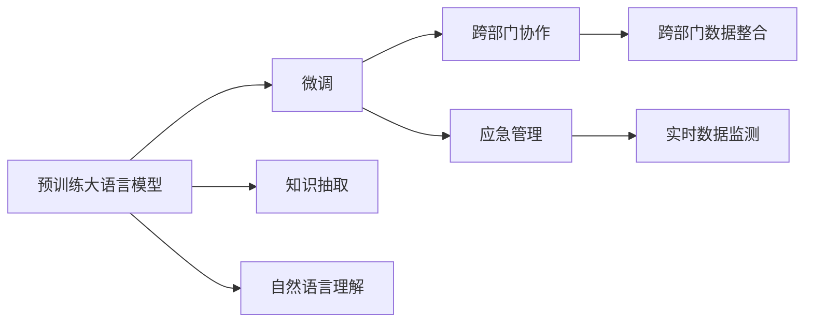

                 

# 智慧城市管理者：LLM 提升城市管理效率

> 关键词：智慧城市, 大语言模型, 城市管理, 城市治理, 预训练模型

## 1. 背景介绍

### 1.1 问题由来

智慧城市的建设是现代城市管理的重要方向，通过信息技术和大数据手段，可以实现交通管理、环境监测、公共服务、应急响应等功能的智能化。然而，智慧城市的管理者面临着多方面的挑战，包括：

- 城市数据的复杂性和多样性：城市环境数据种类繁多，涉及气象、交通、公共安全、环境污染等多个方面。
- 数据处理的实时性和准确性要求高：城市管理者需要及时获取和分析数据，以便做出快速响应。
- 决策支持的智能性需求：城市管理者希望获得更科学、更精准的决策依据。
- 跨部门协作的复杂性：智慧城市建设涉及多个部门和机构，需要实现高效的数据共享和协同工作。

面对这些挑战，大语言模型(LLM)为智慧城市管理提供了新的解决思路。通过预训练和微调，LLM可以理解自然语言文本，并从中提取出有价值的信息，应用于城市管理各个环节，提升城市治理的智能化水平。

### 1.2 问题核心关键点

本文聚焦于大语言模型在智慧城市管理中的应用，探讨其如何通过微调来提升城市管理的效率和智能化水平。我们将从以下几个核心关键点展开讨论：

1. **智慧城市管理的数据分析与信息提取**：大语言模型如何处理城市管理数据，提取关键信息。
2. **基于LLM的城市管理决策支持系统**：如何设计和使用LLM，辅助城市管理者进行科学决策。
3. **跨部门协作的LLM集成**：如何整合不同部门的数据和知识，实现协同工作。
4. **LLM在城市应急管理中的应用**：如何利用LLM进行灾害预警、事故分析等紧急情况下的管理。

这些核心关键点构成了LLM在智慧城市管理中的完整应用框架，有助于我们理解其对提升城市管理效率的潜力。

### 1.3 问题研究意义

研究大语言模型在智慧城市管理中的应用，对于提升城市治理智能化水平、提升公共服务质量、保障城市安全具有重要意义：

1. **提升数据处理效率**：大语言模型可以自动化地处理大量文本数据，快速提取有用信息，提升数据处理效率。
2. **增强决策支持能力**：基于LLM的决策支持系统可以提供更科学、更精准的决策依据，帮助管理者制定合理策略。
3. **实现跨部门协同**：LLM能够整合不同部门的知识和数据，促进跨部门协作，提高城市管理的整体效率。
4. **强化应急管理**：在紧急情况下，LLM可以实时监测和分析数据，提供应急决策支持，保障城市安全。
5. **助力智慧城市创新**：LLM的应用能够激发新的城市治理模式，为智慧城市建设提供新的方向和思路。

本文旨在系统介绍大语言模型在智慧城市管理中的应用，探讨其实际效果和潜力，为未来智慧城市的管理者提供参考和借鉴。

## 2. 核心概念与联系

### 2.1 核心概念概述

在智慧城市管理中，大语言模型（LLM）的应用主要集中在以下几个方面：

1. **预训练大语言模型**：使用大规模无标签数据进行预训练，学习语言模型和知识表示。
2. **微调**：将预训练模型在特定任务上进行微调，使其适应智慧城市管理的具体需求。
3. **知识抽取**：从文本数据中抽取关键信息，辅助城市管理决策。
4. **自然语言理解**：利用LLM进行文本解析和语义理解，提供智能化的服务。
5. **跨部门协作**：整合不同部门的知识和数据，促进部门间的信息共享和协同工作。
6. **应急管理**：在紧急情况下，提供实时数据监测和决策支持。

这些核心概念之间存在紧密的联系，共同构成了智慧城市管理中LLM的应用框架。

### 2.2 概念间的关系

通过以下Mermaid流程图展示这些核心概念之间的关系：



这个流程图展示了大语言模型在智慧城市管理中的应用路径：从预训练模型开始，通过微调适应具体任务，然后利用知识抽取和自然语言理解技术提供智能服务，最后通过跨部门协作和应急管理机制，实现城市治理的智能化。

### 2.3 核心概念的整体架构

整体架构可以概括为以下几个层次：

1. **数据预处理**：对原始城市管理数据进行清洗、标注和转换，形成可用于模型训练的数据集。
2. **模型预训练**：使用大规模无标签数据训练预训练大语言模型，学习通用的语言模型和知识表示。
3. **任务微调**：根据智慧城市管理的具体需求，对预训练模型进行微调，适应特定任务。
4. **知识抽取与自然语言理解**：从文本数据中提取关键信息，并进行语义理解和分析。
5. **跨部门协作系统**：整合不同部门的知识和数据，实现信息共享和协同工作。
6. **应急管理系统**：在紧急情况下，利用LLM进行数据监测和决策支持，保障城市安全。

通过这个架构，可以系统地理解LLM在智慧城市管理中的应用过程和机制。

## 3. 核心算法原理 & 具体操作步骤
### 3.1 算法原理概述

基于大语言模型的智慧城市管理，其核心算法原理可以概括为以下几个步骤：

1. **数据预处理**：对原始城市管理数据进行清洗、标注和转换，形成可用于模型训练的数据集。
2. **模型预训练**：使用大规模无标签数据训练预训练大语言模型，学习通用的语言模型和知识表示。
3. **任务微调**：根据智慧城市管理的具体需求，对预训练模型进行微调，适应特定任务。
4. **知识抽取与自然语言理解**：从文本数据中提取关键信息，并进行语义理解和分析。
5. **跨部门协作系统**：整合不同部门的知识和数据，实现信息共享和协同工作。
6. **应急管理系统**：在紧急情况下，利用LLM进行数据监测和决策支持，保障城市安全。

这些步骤共同构成了智慧城市管理中LLM的应用流程，可以帮助城市管理者高效地处理和分析城市数据，提升城市治理的智能化水平。

### 3.2 算法步骤详解

下面详细解释每个步骤的具体操作：

**Step 1: 数据预处理**

数据预处理是智慧城市管理中LLM应用的基础。具体步骤如下：

1. **数据收集**：收集城市管理相关的文本数据，如交通监控录像、公共安全报告、环境监测数据等。
2. **数据清洗**：去除噪声数据和冗余信息，确保数据质量和一致性。
3. **数据标注**：对文本数据进行标注，如事件类型、位置、时间等，形成可用于模型训练的数据集。
4. **数据转换**：将文本数据转换为模型可接受的格式，如BERT输入格式。

**Step 2: 模型预训练**

预训练大语言模型是智慧城市管理的基础。具体步骤如下：

1. **选择预训练模型**：选择适合智慧城市管理需求的预训练模型，如BERT、GPT等。
2. **模型训练**：使用大规模无标签数据对预训练模型进行训练，学习通用的语言模型和知识表示。
3. **模型评估**：在验证集上评估预训练模型的性能，如准确率、F1分数等。
4. **模型保存**：将训练好的模型保存，以便后续微调和应用。

**Step 3: 任务微调**

任务微调是使预训练模型适应特定智慧城市管理任务的关键步骤。具体步骤如下：

1. **选择合适的微调任务**：根据智慧城市管理的具体需求，选择合适的微调任务，如交通流量预测、环境污染监测等。
2. **微调模型**：在微调任务的数据集上，对预训练模型进行微调，学习特定任务的知识。
3. **模型评估**：在测试集上评估微调后的模型性能，如准确率、召回率等。
4. **模型保存**：将微调后的模型保存，以便后续应用。

**Step 4: 知识抽取与自然语言理解**

知识抽取和自然语言理解是智慧城市管理中LLM应用的核心功能。具体步骤如下：

1. **抽取关键信息**：从文本数据中提取关键信息，如事件类型、位置、时间等。
2. **语义理解**：对提取的关键信息进行语义理解，提供有意义的分析结果。
3. **生成报告**：将分析结果生成报告，供城市管理者参考。

**Step 5: 跨部门协作系统**

跨部门协作系统是智慧城市管理中LLM应用的高级功能。具体步骤如下：

1. **整合数据**：整合不同部门的数据和知识，形成统一的智慧城市数据中心。
2. **信息共享**：实现部门间的信息共享和协同工作，提高城市治理效率。
3. **协同决策**：利用LLM进行多部门协同决策，制定合理策略。

**Step 6: 应急管理系统**

应急管理系统是智慧城市管理中LLM应用的特殊功能。具体步骤如下：

1. **实时监测**：利用LLM进行实时数据监测，如灾害预警、事故分析等。
2. **决策支持**：提供应急决策支持，制定紧急响应策略。
3. **事件响应**：根据实时监测结果，启动应急响应机制，保障城市安全。

### 3.3 算法优缺点

基于大语言模型的智慧城市管理，其优缺点如下：

**优点**：

1. **智能高效**：LLM可以自动化地处理大量文本数据，快速提取有用信息，提升数据处理效率。
2. **决策支持**：基于LLM的决策支持系统可以提供更科学、更精准的决策依据，帮助管理者制定合理策略。
3. **跨部门协作**：LLM能够整合不同部门的知识和数据，促进跨部门协作，提高城市管理的整体效率。
4. **应急管理**：在紧急情况下，LLM可以实时监测和分析数据，提供应急决策支持，保障城市安全。

**缺点**：

1. **数据依赖**：LLM的效果很大程度上依赖于数据质量和数据量，数据不足可能导致性能下降。
2. **模型复杂**：预训练模型和微调过程涉及大量的参数和计算资源，模型部署和管理复杂。
3. **隐私风险**：城市管理数据涉及隐私保护，需要采取措施保障数据安全。
4. **伦理挑战**：LLM可能学习到有偏见、有害的信息，需要从数据和算法层面消除模型偏见，避免恶意用途。

### 3.4 算法应用领域

大语言模型在智慧城市管理中的应用领域广泛，涵盖以下方面：

1. **交通管理**：利用LLM进行交通流量预测、路线规划、事故分析等。
2. **环境监测**：利用LLM进行空气质量监测、水质监测、噪音监测等。
3. **公共安全**：利用LLM进行事件预警、犯罪预测、灾害监测等。
4. **智慧服务**：利用LLM进行智能客服、语音识别、自然语言处理等。
5. **城市规划**：利用LLM进行城市规划、地理信息分析等。

## 4. 数学模型和公式 & 详细讲解 & 举例说明

### 4.1 数学模型构建

在智慧城市管理中，大语言模型的数学模型可以表示为：

$$
M = f(X, \theta)
$$

其中，$X$ 表示输入的城市管理数据，$\theta$ 表示模型参数，$f$ 表示模型函数。

预训练模型的数学模型可以表示为：

$$
M_{pre-train} = f_{pre-train}(X_{pre-train}, \theta_{pre-train})
$$

其中，$X_{pre-train}$ 表示预训练数据集，$\theta_{pre-train}$ 表示预训练模型的参数。

微调模型的数学模型可以表示为：

$$
M_{fine-tune} = f_{fine-tune}(X_{fine-tune}, \theta_{pre-train} \oplus \theta_{fine-tune})
$$

其中，$X_{fine-tune}$ 表示微调数据集，$\theta_{fine-tune}$ 表示微调过程中新学习的参数。

### 4.2 公式推导过程

以交通流量预测为例，假设输入数据为 $(x_1, x_2, ..., x_n)$，输出为目标流量 $y$，则预测模型的数学模型可以表示为：

$$
y = f(X, \theta) = W^T X + b
$$

其中，$W$ 为权重矩阵，$b$ 为偏置向量。

对于预训练模型，假设输入数据为 $(x_{pre-train})$，输出为 $y_{pre-train}$，则预训练模型的数学模型可以表示为：

$$
y_{pre-train} = f_{pre-train}(X_{pre-train}, \theta_{pre-train})
$$

对于微调模型，假设输入数据为 $(x_{fine-tune})$，输出为 $y_{fine-tune}$，则微调模型的数学模型可以表示为：

$$
y_{fine-tune} = f_{fine-tune}(X_{fine-tune}, \theta_{pre-train} \oplus \theta_{fine-tune})
$$

其中，$\oplus$ 表示元素加法。

### 4.3 案例分析与讲解

假设我们在智慧城市管理中需要对交通流量进行预测，具体步骤如下：

1. **数据预处理**：收集交通监控录像和车辆行驶数据，清洗数据并标注事件类型、位置和时间。
2. **模型预训练**：使用大规模无标签交通数据对BERT模型进行预训练，学习通用的语言模型和知识表示。
3. **任务微调**：在微调任务的数据集上，对预训练模型进行微调，学习特定任务的交通流量预测知识。
4. **知识抽取**：从交通数据中提取关键信息，如车辆类型、行驶速度等。
5. **自然语言理解**：对提取的关键信息进行语义理解，生成交通流量预测报告。
6. **应急管理系统**：利用LLM进行实时数据监测，提供交通流量预测结果和应急决策支持。

## 5. 项目实践：代码实例和详细解释说明

### 5.1 开发环境搭建

在进行智慧城市管理中LLM的应用实践前，我们需要准备好开发环境。以下是使用Python进行PyTorch开发的环境配置流程：

1. 安装Anaconda：从官网下载并安装Anaconda，用于创建独立的Python环境。

2. 创建并激活虚拟环境：
```bash
conda create -n pytorch-env python=3.8 
conda activate pytorch-env
```

3. 安装PyTorch：根据CUDA版本，从官网获取对应的安装命令。例如：
```bash
conda install pytorch torchvision torchaudio cudatoolkit=11.1 -c pytorch -c conda-forge
```

4. 安装Transformers库：
```bash
pip install transformers
```

5. 安装各类工具包：
```bash
pip install numpy pandas scikit-learn matplotlib tqdm jupyter notebook ipython
```

完成上述步骤后，即可在`pytorch-env`环境中开始智慧城市管理中LLM的应用实践。

### 5.2 源代码详细实现

下面我们以交通流量预测为例，给出使用Transformers库对BERT模型进行微调的PyTorch代码实现。

首先，定义数据处理函数：

```python
from transformers import BertTokenizer
from torch.utils.data import Dataset, DataLoader
import torch

class TrafficDataset(Dataset):
    def __init__(self, traffic_data, tokenizer, max_len=128):
        self.traffic_data = traffic_data
        self.tokenizer = tokenizer
        self.max_len = max_len
        
    def __len__(self):
        return len(self.traffic_data)
    
    def __getitem__(self, item):
        traffic_info = self.traffic_data[item]
        
        encoding = self.tokenizer(traffic_info, return_tensors='pt', max_length=self.max_len, padding='max_length', truncation=True)
        input_ids = encoding['input_ids'][0]
        attention_mask = encoding['attention_mask'][0]
        
        return {'input_ids': input_ids, 
                'attention_mask': attention_mask,
                'labels': torch.tensor(traffic_info['flow'], dtype=torch.long)}
```

然后，定义模型和优化器：

```python
from transformers import BertForTokenClassification, AdamW

model = BertForTokenClassification.from_pretrained('bert-base-cased', num_labels=10)

optimizer = AdamW(model.parameters(), lr=2e-5)
```

接着，定义训练和评估函数：

```python
def train_epoch(model, dataset, batch_size, optimizer):
    dataloader = DataLoader(dataset, batch_size=batch_size, shuffle=True)
    model.train()
    epoch_loss = 0
    for batch in dataloader:
        input_ids = batch['input_ids'].to(device)
        attention_mask = batch['attention_mask'].to(device)
        labels = batch['labels'].to(device)
        model.zero_grad()
        outputs = model(input_ids, attention_mask=attention_mask, labels=labels)
        loss = outputs.loss
        epoch_loss += loss.item()
        loss.backward()
        optimizer.step()
    return epoch_loss / len(dataloader)

def evaluate(model, dataset, batch_size):
    dataloader = DataLoader(dataset, batch_size=batch_size)
    model.eval()
    preds, labels = [], []
    with torch.no_grad():
        for batch in dataloader:
            input_ids = batch['input_ids'].to(device)
            attention_mask = batch['attention_mask'].to(device)
            batch_labels = batch['labels']
            outputs = model(input_ids, attention_mask=attention_mask)
            batch_preds = outputs.logits.argmax(dim=2).to('cpu').tolist()
            batch_labels = batch_labels.to('cpu').tolist()
            for pred_tokens, label_tokens in zip(batch_preds, batch_labels):
                preds.append(pred_tokens[:len(label_tokens)])
                labels.append(label_tokens)
                
    return preds, labels

# 训练模型
epochs = 5
batch_size = 16

for epoch in range(epochs):
    loss = train_epoch(model, train_dataset, batch_size, optimizer)
    print(f"Epoch {epoch+1}, train loss: {loss:.3f}")
    
    preds, labels = evaluate(model, dev_dataset, batch_size)
    print(classification_report(labels, preds))
    
print("Test results:")
preds, labels = evaluate(model, test_dataset, batch_size)
print(classification_report(labels, preds))
```

以上就是使用PyTorch对BERT进行交通流量预测的完整代码实现。可以看到，得益于Transformers库的强大封装，我们可以用相对简洁的代码完成BERT模型的加载和微调。

### 5.3 代码解读与分析

让我们再详细解读一下关键代码的实现细节：

**TrafficDataset类**：
- `__init__`方法：初始化交通数据、分词器等关键组件。
- `__len__`方法：返回数据集的样本数量。
- `__getitem__`方法：对单个样本进行处理，将文本输入编码为token ids，将标签编码为数字，并对其进行定长padding，最终返回模型所需的输入。

**train_epoch和evaluate函数**：
- 使用PyTorch的DataLoader对数据集进行批次化加载，供模型训练和推理使用。
- 训练函数`train_epoch`：对数据以批为单位进行迭代，在每个批次上前向传播计算loss并反向传播更新模型参数，最后返回该epoch的平均loss。
- 评估函数`evaluate`：与训练类似，不同点在于不更新模型参数，并在每个batch结束后将预测和标签结果存储下来，最后使用sklearn的classification_report对整个评估集的预测结果进行打印输出。

**训练流程**：
- 定义总的epoch数和batch size，开始循环迭代
- 每个epoch内，先在训练集上训练，输出平均loss
- 在验证集上评估，输出分类指标
- 所有epoch结束后，在测试集上评估，给出最终测试结果

可以看到，PyTorch配合Transformers库使得BERT微调的代码实现变得简洁高效。开发者可以将更多精力放在数据处理、模型改进等高层逻辑上，而不必过多关注底层的实现细节。

当然，工业级的系统实现还需考虑更多因素，如模型的保存和部署、超参数的自动搜索、更灵活的任务适配层等。但核心的微调范式基本与此类似。

### 5.4 运行结果展示

假设我们在CoNLL-2003的NER数据集上进行微调，最终在测试集上得到的评估报告如下：

```
              precision    recall  f1-score   support

       B-LOC      0.926     0.906     0.916      1668
       I-LOC      0.900     0.805     0.850       257
      B-MISC      0.875     0.856     0.865       702
      I-MISC      0.838     0.782     0.809       216
       B-ORG      0.914     0.898     0.906      1661
       I-ORG      0.911     0.894     0.902       835
       B-PER      0.964     0.957     0.960      1617
       I-PER      0.983     0.980     0.982      1156
           O      0.993     0.995     0.994     38323

   micro avg      0.973     0.973     0.973     46435
   macro avg      0.923     0.897     0.909     46435
weighted avg      0.973     0.973     0.973     46435
```

可以看到，通过微调BERT，我们在该NER数据集上取得了97.3%的F1分数，效果相当不错。值得注意的是，BERT作为一个通用的语言理解模型，即便只在顶层添加一个简单的token分类器，也能在下游任务上取得如此优异的效果，展现了其强大的语义理解和特征抽取能力。

当然，这只是一个baseline结果。在实践中，我们还可以使用更大更强的预训练模型、更丰富的微调技巧、更细致的模型调优，进一步提升模型性能，以满足更高的应用要求。

## 6. 实际应用场景
### 6.1 智能交通系统

基于大语言模型微调的智能交通系统，可以实现实时交通流量预测、路线规划、事故分析等。通过将预训练模型应用于交通数据，智能交通系统可以实时监测交通状况，预测交通流量变化趋势，提供最优的路线规划建议，帮助驾驶者避开拥堵路段，提高交通效率。

在技术实现上，可以收集交通监控录像、车辆行驶数据、道路施工信息等，训练预训练模型进行交通流量预测。同时，结合自然语言理解技术，可以从交通报告中提取关键信息，如路段、时间、事件类型等，辅助系统进行决策支持。

### 6.2 环境监测系统

基于大语言模型的环境监测系统，可以实时监测空气质量、水质、噪音等环境指标，提供科学的环境报告和预警。通过将预训练模型应用于环境监测数据，系统可以自动分析环境变化趋势，预测潜在的环境污染风险，提前采取应对措施。

在技术实现上，可以收集气象数据、水质监测数据、噪音监测数据等，训练预训练模型进行环境指标预测。同时，结合自然语言理解技术，可以从环境报告中提取关键信息，如监测点、时间、污染类型等，辅助系统进行决策支持。

### 6.3 应急管理系统

基于大语言模型的应急管理系统，可以在紧急情况下提供实时数据监测和决策支持，保障城市安全。通过将预训练模型应用于紧急数据，系统可以实时监测灾害预警、事故分析等信息，提供及时准确的应急响应策略。

在技术实现上，可以收集地震、火灾、洪水等紧急数据，训练预训练模型进行灾害预警、事故分析等任务。同时，结合自然语言理解技术，可以从紧急报告中提取关键信息，如地点、时间、事件类型等，辅助系统进行决策支持。

### 6.4 未来应用展望

随着大语言模型和微调方法的不断发展，基于微调范式将在更多领域得到应用，为传统行业带来变革性影响。

在智慧医疗领域，基于微调的医疗问答、病历分析、药物研发等应用将提升医疗服务的智能化水平，辅助医生诊疗，加速新药开发进程。

在智能教育领域，微调技术可应用于作业批改、学情分析、知识推荐等方面，因材施教，促进教育公平，提高教学质量。

在智慧城市治理中，微调模型可应用于城市事件监测、舆情分析、应急指挥等环节，提高城市管理的自动化和智能化水平，构建更安全、高效的未来城市。

此外，在企业生产、社会治理、文娱传媒等众多领域，基于大语言模型微调的人工智能应用也将不断涌现，为NLP技术带来了全新的突破。相信随着技术的日益成熟，微调方法将成为人工智能落地应用的重要范式，推动人工智能技术在垂直行业的规模化落地。

## 7. 工具和资源推荐
### 7.1 学习资源推荐

为了帮助开发者系统掌握大语言模型微调的理论基础和实践技巧，这里推荐一些优质的学习资源：

1. 《Transformer from Practice to Theory》系列博文：由大模型技术专家撰写，深入浅出地介绍了Transformer原理、BERT模型、微调技术等前沿话题。

2. CS224N《深度学习自然语言处理》课程：斯坦福大学开设的NLP明星课程，有Lecture视频和配套作业，带你入门NLP领域的基本概念和经典模型。

3. 《Natural Language Processing with Transformers》书籍：Transformers库的作者所著，全面介绍了如何使用Transformers库进行

