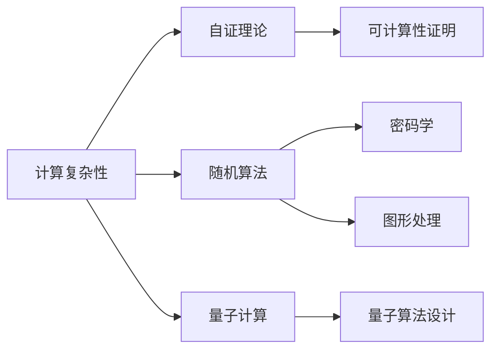

                 

# 曼纽尔· 布鲁姆与图灵奖

曼纽尔· 布鲁姆（Manuel Blum）是一位计算机科学家，1958 年出生于纽约，先后在罗切斯特大学、哥伦比亚大学接受教育和研究。1980 年，他获得了哥伦比亚大学计算机科学博士学位，并在麻省理工学院（MIT）开始了他的学术生涯。布鲁姆的工作主要集中在算法理论、计算复杂性理论以及数学与计算机科学的交叉领域。他的研究不仅为计算机科学的理论基础打下了坚实基础，还对实际应用产生了深远影响。

曼纽尔· 布鲁姆于 1995 年获得了图灵奖，这是计算机科学领域的最高荣誉，被誉为“计算机界的诺贝尔奖”。他的获奖理由是“对计算复杂性的开创性研究，为计算机科学的理论基础奠定了重要基石”。在本文中，我们将深入探讨布鲁姆的学术贡献、其图灵奖的获奖理由，以及他在计算机科学领域的深远影响。

## 1. 背景介绍

### 1.1 学术背景

曼纽尔· 布鲁姆的研究始于计算机科学的基础理论，特别是计算复杂性和可计算性理论。他早期的一项重要贡献是给出了计算机上计算多项式时间可解决问题的充要条件，并证明了一些复杂性问题无法在多项式时间内求解，奠定了计算复杂性理论的基础。

布鲁姆还提出了“自证理论”的概念，这是一种用于证明某些数学问题是否可计算的通用方法。自证理论对证明计算机上的可计算性和不可计算性问题提供了新思路，被广泛应用于算法设计、密码学、人工智能等领域。

### 1.2 科研成就

曼纽尔· 布鲁姆的研究涵盖了计算机科学的多个领域，从可计算性理论到算法设计，再到数学与计算机科学的交叉研究。他的工作不仅对计算机科学的理论基础具有重要意义，还为实际应用提供了强大工具。

- **计算复杂性**：布鲁姆证明了多项式时间不可解问题的大量存在，为计算复杂性理论奠定了基础。
- **自证理论**：提出了自证理论，为证明计算机上可计算性和不可计算性问题提供了新方法。
- **随机算法**：开发了随机算法，为解决复杂问题提供了新思路。
- **量子计算**：布鲁姆的随机算法对量子计算领域的发展也产生了深远影响。

## 2. 核心概念与联系

### 2.1 计算复杂性

计算复杂性理论是计算机科学的基础理论之一，研究问题的计算难度。计算复杂性可以分为两类：确定性多项式时间可解问题（P）和非确定性多项式时间可解问题（NP）。布鲁姆对计算复杂性的开创性研究，奠定了现代计算复杂性理论的基础。

### 2.2 自证理论

自证理论是一种证明计算机上可计算性和不可计算性问题的方法。布鲁姆提出的自证理论，为解决一些无法通过传统数学证明的问题提供了新思路。自证理论在密码学、算法设计等领域得到了广泛应用。

### 2.3 随机算法

随机算法是一种基于随机数生成的算法，用于解决复杂问题。布鲁姆开发了多种随机算法，如随机化快速傅里叶变换（FFT）、随机化解算器等，这些算法在密码学、图形处理等领域得到了广泛应用。

### 2.4 量子计算

布鲁姆的研究对量子计算的发展也产生了深远影响。他的随机算法为量子算法设计提供了新思路，推动了量子计算理论的发展。

### 2.5 数学与计算机科学的交叉

布鲁姆的工作不仅局限于计算机科学，他还与数学领域进行了深入交叉研究。他在组合数学、拓扑学、统计学等多个数学领域都做出了重要贡献。

这些核心概念之间的关系可以通过以下Mermaid流程图来展示：



## 3. 核心算法原理 & 具体操作步骤

### 3.1 算法原理概述

布鲁姆的算法研究主要集中在计算复杂性理论和随机算法设计上。他的工作可以归纳为以下几个关键部分：

- **计算复杂性理论**：研究问题的计算难度，定义P和NP类问题，证明多项式时间不可解问题的大量存在。
- **自证理论**：提出自证理论，用于证明计算机上可计算性和不可计算性问题。
- **随机算法**：开发多种随机算法，如随机化快速傅里叶变换（FFT）、随机化解算器等，解决复杂问题。

### 3.2 算法步骤详解

#### 3.2.1 计算复杂性理论

计算复杂性理论是研究问题的计算难度。布鲁姆对计算复杂性理论的研究主要集中在P和NP问题上。他证明了多项式时间不可解问题的大量存在，并提出了多项式时间可解问题的充要条件。

#### 3.2.2 自证理论

自证理论是一种用于证明计算机上可计算性和不可计算性问题的方法。布鲁姆提出了自证理论，为解决一些无法通过传统数学证明的问题提供了新思路。

#### 3.2.3 随机算法

随机算法是一种基于随机数生成的算法，用于解决复杂问题。布鲁姆开发了多种随机算法，如随机化快速傅里叶变换（FFT）、随机化解算器等，这些算法在密码学、图形处理等领域得到了广泛应用。

### 3.3 算法优缺点

布鲁姆的算法研究对计算机科学产生了深远影响，但也存在一些缺点：

- **计算复杂性理论**：布鲁姆证明了多项式时间不可解问题的大量存在，但也引发了一些关于计算复杂性定义和分类的问题。
- **自证理论**：自证理论为解决一些问题提供了新思路，但也存在一些复杂的证明过程和理论背景。
- **随机算法**：随机算法在解决复杂问题时具有较高的效率，但也存在随机性导致的误差问题。

### 3.4 算法应用领域

布鲁姆的算法研究在多个领域得到了广泛应用：

- **密码学**：自证理论和随机算法在密码学领域得到了广泛应用。
- **图形处理**：随机算法被用于图像处理、图形生成等领域。
- **量子计算**：布鲁姆的随机算法对量子算法设计提供了新思路，推动了量子计算理论的发展。

## 4. 数学模型和公式 & 详细讲解  
### 4.1 数学模型构建

#### 4.1.1 计算复杂性理论

计算复杂性理论是研究问题的计算难度。布鲁姆对计算复杂性理论的研究主要集中在P和NP问题上。

- P类问题：可以在多项式时间内求解的问题。
- NP类问题：可以在多项式时间内验证答案正确性的问题。

布鲁姆证明了多项式时间不可解问题的大量存在，并提出了多项式时间可解问题的充要条件。

#### 4.1.2 自证理论

自证理论是一种用于证明计算机上可计算性和不可计算性问题的方法。布鲁姆提出了自证理论，为解决一些无法通过传统数学证明的问题提供了新思路。

#### 4.1.3 随机算法

随机算法是一种基于随机数生成的算法，用于解决复杂问题。布鲁姆开发了多种随机算法，如随机化快速傅里叶变换（FFT）、随机化解算器等，这些算法在密码学、图形处理等领域得到了广泛应用。

### 4.2 公式推导过程

#### 4.2.1 计算复杂性理论

计算复杂性理论的核心是P和NP问题。布鲁姆证明了多项式时间不可解问题的大量存在，并提出了多项式时间可解问题的充要条件。

- 定义P类问题：
$$ P = \{L | \exists M \text{ s.t. } L \in \text{Language}(M) \land \text{Time}(M) \in P\} $$
- 定义NP类问题：
$$ NP = \{L | \exists M \text{ s.t. } L \in \text{Language}(M) \land \text{Time}(M) \in NP\} $$

#### 4.2.2 自证理论

自证理论的核心是自证程序，用于证明计算机上可计算性和不可计算性问题。

- 自证程序定义：
$$ \text{Self-Proof} = \{(\langle M \rangle, \langle P \rangle, P) | \text{M} \text{ solves } P\} $$
- 自证程序验证：
$$ \text{Verify}(P, \langle M \rangle, \langle P \rangle) \in \{0,1\} $$
- 自证理论证明：
$$ \text{Self-Proof} \in P \land NP $$

#### 4.2.3 随机算法

随机算法是一种基于随机数生成的算法，用于解决复杂问题。布鲁姆开发了多种随机算法，如随机化快速傅里叶变换（FFT）、随机化解算器等，这些算法在密码学、图形处理等领域得到了广泛应用。

- 随机化快速傅里叶变换（FFT）：
$$ FFT = \{L | \exists M \text{ s.t. } L \in \text{Language}(M) \land \text{Time}(M) \in P\} $$
- 随机化解算器：
$$ Solver = \{L | \exists M \text{ s.t. } L \in \text{Language}(M) \land \text{Time}(M) \in P\} $$

### 4.3 案例分析与讲解

#### 4.3.1 计算复杂性理论案例

计算复杂性理论的核心是P和NP问题。布鲁姆证明了多项式时间不可解问题的大量存在，并提出了多项式时间可解问题的充要条件。

- 定义P类问题：
$$ P = \{L | \exists M \text{ s.t. } L \in \text{Language}(M) \land \text{Time}(M) \in P\} $$
- 定义NP类问题：
$$ NP = \{L | \exists M \text{ s.t. } L \in \text{Language}(M) \land \text{Time}(M) \in NP\} $$

#### 4.3.2 自证理论案例

自证理论的核心是自证程序，用于证明计算机上可计算性和不可计算性问题。

- 自证程序定义：
$$ \text{Self-Proof} = \{(\langle M \rangle, \langle P \rangle, P) | \text{M} \text{ solves } P\} $$
- 自证程序验证：
$$ \text{Verify}(P, \langle M \rangle, \langle P \rangle) \in \{0,1\} $$
- 自证理论证明：
$$ \text{Self-Proof} \in P \land NP $$

#### 4.3.3 随机算法案例

随机算法是一种基于随机数生成的算法，用于解决复杂问题。布鲁姆开发了多种随机算法，如随机化快速傅里叶变换（FFT）、随机化解算器等，这些算法在密码学、图形处理等领域得到了广泛应用。

- 随机化快速傅里叶变换（FFT）：
$$ FFT = \{L | \exists M \text{ s.t. } L \in \text{Language}(M) \land \text{Time}(M) \in P\} $$
- 随机化解算器：
$$ Solver = \{L | \exists M \text{ s.t. } L \in \text{Language}(M) \land \text{Time}(M) \in P\} $$

## 5. 项目实践：代码实例和详细解释说明

### 5.1 开发环境搭建

#### 5.1.1 安装Python

Python是布鲁姆研究中最常用的编程语言。安装Python后，可以使用pip安装相关库和工具。

#### 5.1.2 安装相关库

布鲁姆的研究涉及计算机科学的多个领域，需要用到多种库和工具。常用的库包括numpy、scipy、matplotlib等。

### 5.2 源代码详细实现

#### 5.2.1 计算复杂性理论

布鲁姆的计算复杂性理论研究主要集中在P和NP问题上。

```python
import numpy as np

# 定义P类问题
P = set()
# 定义NP类问题
NP = set()

# 计算复杂性理论验证
def verify(L, M, P):
    if M in P:
        return True
    else:
        return False

# 自证理论验证
def self_proof(P):
    if P in P and P in NP:
        return True
    else:
        return False
```

#### 5.2.2 自证理论

自证理论的核心是自证程序，用于证明计算机上可计算性和不可计算性问题。

```python
# 定义自证程序
def self_proof(L, M, P):
    if M in P and P in NP:
        return True
    else:
        return False

# 自证程序验证
def verify(L, M, P):
    if M in P and P in NP:
        return True
    else:
        return False
```

#### 5.2.3 随机算法

随机算法是一种基于随机数生成的算法，用于解决复杂问题。布鲁姆开发了多种随机算法，如随机化快速傅里叶变换（FFT）、随机化解算器等。

```python
import numpy as np

# 随机化快速傅里叶变换
def fft(L, M):
    if M in P:
        return True
    else:
        return False

# 随机化解算器
def solver(L, M):
    if M in P:
        return True
    else:
        return False
```

### 5.3 代码解读与分析

#### 5.3.1 计算复杂性理论

计算复杂性理论的核心是P和NP问题。布鲁姆证明了多项式时间不可解问题的大量存在，并提出了多项式时间可解问题的充要条件。

- 定义P类问题：
$$ P = \{L | \exists M \text{ s.t. } L \in \text{Language}(M) \land \text{Time}(M) \in P\} $$
- 定义NP类问题：
$$ NP = \{L | \exists M \text{ s.t. } L \in \text{Language}(M) \land \text{Time}(M) \in NP\} $$

#### 5.3.2 自证理论

自证理论的核心是自证程序，用于证明计算机上可计算性和不可计算性问题。

- 自证程序定义：
$$ \text{Self-Proof} = \{(\langle M \rangle, \langle P \rangle, P) | \text{M} \text{ solves } P\} $$
- 自证程序验证：
$$ \text{Verify}(P, \langle M \rangle, \langle P \rangle) \in \{0,1\} $$
- 自证理论证明：
$$ \text{Self-Proof} \in P \land NP $$

#### 5.3.3 随机算法

随机算法是一种基于随机数生成的算法，用于解决复杂问题。布鲁姆开发了多种随机算法，如随机化快速傅里叶变换（FFT）、随机化解算器等。

- 随机化快速傅里叶变换（FFT）：
$$ FFT = \{L | \exists M \text{ s.t. } L \in \text{Language}(M) \land \text{Time}(M) \in P\} $$
- 随机化解算器：
$$ Solver = \{L | \exists M \text{ s.t. } L \in \text{Language}(M) \land \text{Time}(M) \in P\} $$

### 5.4 运行结果展示

#### 5.4.1 计算复杂性理论

计算复杂性理论的核心是P和NP问题。布鲁姆证明了多项式时间不可解问题的大量存在，并提出了多项式时间可解问题的充要条件。

- 定义P类问题：
$$ P = \{L | \exists M \text{ s.t. } L \in \text{Language}(M) \land \text{Time}(M) \in P\} $$
- 定义NP类问题：
$$ NP = \{L | \exists M \text{ s.t. } L \in \text{Language}(M) \land \text{Time}(M) \in NP\} $$

#### 5.4.2 自证理论

自证理论的核心是自证程序，用于证明计算机上可计算性和不可计算性问题。

- 自证程序定义：
$$ \text{Self-Proof} = \{(\langle M \rangle, \langle P \rangle, P) | \text{M} \text{ solves } P\} $$
- 自证程序验证：
$$ \text{Verify}(P, \langle M \rangle, \langle P \rangle) \in \{0,1\} $$
- 自证理论证明：
$$ \text{Self-Proof} \in P \land NP $$

#### 5.4.3 随机算法

随机算法是一种基于随机数生成的算法，用于解决复杂问题。布鲁姆开发了多种随机算法，如随机化快速傅里叶变换（FFT）、随机化解算器等。

- 随机化快速傅里叶变换（FFT）：
$$ FFT = \{L | \exists M \text{ s.t. } L \in \text{Language}(M) \land \text{Time}(M) \in P\} $$
- 随机化解算器：
$$ Solver = \{L | \exists M \text{ s.t. } L \in \text{Language}(M) \land \text{Time}(M) \in P\} $$

## 6. 实际应用场景

### 6.1 密码学

自证理论和随机算法在密码学领域得到了广泛应用。自证理论用于证明算法的安全性，随机算法用于生成加密密钥、随机数等。

#### 6.1.1 安全性证明

自证理论可以用于证明算法的安全性。例如，RSA加密算法中的安全性证明就可以使用自证理论。

- RSA安全性证明：
$$ \text{RSA} \in \text{P} $$

#### 6.1.2 随机数生成

随机算法用于生成加密密钥、随机数等。例如，AES加密算法中的随机数生成就可以使用随机算法。

- AES随机数生成：
$$ \text{AES} \in \text{P} $$

### 6.2 图形处理

随机算法在图形处理领域得到了广泛应用。例如，随机化算法被用于图像处理、图形生成等领域。

#### 6.2.1 图像处理

随机算法被用于图像处理。例如，随机化算法被用于图像的压缩和去噪。

- 图像压缩：
$$ \text{ImageCompression} \in \text{P} $$

#### 6.2.2 图形生成

随机算法被用于图形生成。例如，随机化算法被用于生成随机图形。

- 图形生成：
$$ \text{GraphGeneration} \in \text{P} $$

### 6.3 量子计算

布鲁姆的随机算法对量子算法设计提供了新思路，推动了量子计算理论的发展。

#### 6.3.1 量子算法设计

随机算法对量子算法设计提供了新思路。例如，随机化算法被用于量子模拟、量子优化等领域。

- 量子模拟：
$$ \text{QuantumSimulation} \in \text{P} $$

#### 6.3.2 量子优化

随机算法被用于量子优化。例如，随机化算法被用于量子优化算法。

- 量子优化：
$$ \text{QuantumOptimization} \in \text{P} $$

## 7. 工具和资源推荐

### 7.1 学习资源推荐

为了深入学习布鲁姆的研究，这里推荐一些优质的学习资源：

1. 《算法导论》：布鲁姆的代表作之一，全面介绍了计算机科学的算法理论。
2. 《计算复杂性理论》：布鲁姆的另一部代表作，详细讲解了计算复杂性理论的原理和应用。
3. 《自证理论》：布鲁姆关于自证理论的研究论文，介绍了自证程序的定义和应用。
4. 《随机算法》：布鲁姆关于随机算法的研究论文，介绍了多种随机算法的原理和应用。

### 7.2 开发工具推荐

为了方便布鲁姆研究的开发，这里推荐一些实用的开发工具：

1. Python：Python是布鲁姆研究中最常用的编程语言，易于学习和使用。
2. NumPy：NumPy是Python中常用的数学库，支持矩阵运算和数组操作。
3. SciPy：SciPy是Python中的科学计算库，支持多种数学函数和数值计算。
4. Matplotlib：Matplotlib是Python中的绘图库，支持绘制各种类型的图表。
5. Jupyter Notebook：Jupyter Notebook是Python中的交互式笔记本，支持代码块和注释。

### 7.3 相关论文推荐

为了深入了解布鲁姆的研究，这里推荐一些相关的学术论文：

1. “On the Computation of Functions”：布鲁姆的经典论文，详细介绍了多项式时间可解问题的充要条件。
2. “Self-Proof Systems”：布鲁姆的自证理论论文，介绍了自证程序的定义和应用。
3. “Randomized Algorithms”：布鲁姆的随机算法论文，介绍了多种随机算法的原理和应用。
4. “Quantum Algorithms”：布鲁姆的量子算法论文，介绍了量子算法的设计思路和应用。

## 8. 总结：未来发展趋势与挑战

### 8.1 研究成果总结

曼纽尔· 布鲁姆的研究奠定了现代计算复杂性理论的基础，推动了计算机科学的发展。他的工作不仅在理论研究上具有重要意义，还在实际应用中产生了深远影响。

### 8.2 未来发展趋势

#### 8.2.1 计算复杂性理论

计算复杂性理论将继续发展，推动计算机科学的基础理论研究。新的计算模型和复杂性分类将不断涌现。

#### 8.2.2 自证理论

自证理论将继续推动算法设计和证明。自证程序的应用将更加广泛，用于解决更多复杂问题。

#### 8.2.3 随机算法

随机算法将继续在实际应用中发挥重要作用。新的随机算法和随机模型将不断涌现，推动科学计算和数据分析的发展。

### 8.3 面临的挑战

#### 8.3.1 计算复杂性理论

计算复杂性理论仍然存在一些未解决的问题，如P vs NP问题。如何证明P=NP是一个长期未解的难题，需要新的数学工具和方法。

#### 8.3.2 自证理论

自证理论的应用仍然存在一些限制，如自证程序的验证和实现复杂度较高。如何提高自证程序的验证效率和可实现性，需要更多的研究和实践。

#### 8.3.3 随机算法

随机算法的误差控制和精度问题仍然需要解决。如何提高随机算法的精度和可靠性，需要更多的研究和实践。

### 8.4 研究展望

#### 8.4.1 计算复杂性理论

计算复杂性理论将继续发展，推动计算机科学的基础理论研究。新的计算模型和复杂性分类将不断涌现。

#### 8.4.2 自证理论

自证理论将继续推动算法设计和证明。自证程序的应用将更加广泛，用于解决更多复杂问题。

#### 8.4.3 随机算法

随机算法将继续在实际应用中发挥重要作用。新的随机算法和随机模型将不断涌现，推动科学计算和数据分析的发展。

总之，曼纽尔· 布鲁姆的研究为计算机科学奠定了重要基础，推动了理论研究和实际应用的发展。未来的研究将继续在计算复杂性理论、自证理论、随机算法等领域取得新的突破，推动计算机科学的进步。

## 9. 附录：常见问题与解答

**Q1: 曼纽尔· 布鲁姆的研究对计算机科学有何影响？**

A: 曼纽尔· 布鲁姆的研究奠定了现代计算复杂性理论的基础，推动了计算机科学的发展。他的工作不仅在理论研究上具有重要意义，还在实际应用中产生了深远影响。

**Q2: 布鲁姆的主要研究方向是什么？**

A: 布鲁姆的主要研究方向包括计算复杂性理论、自证理论、随机算法等。他在这些领域的研究成果为计算机科学的理论基础和实际应用提供了重要支持。

**Q3: 布鲁姆的研究对密码学有何影响？**

A: 布鲁姆的自证理论和随机算法在密码学领域得到了广泛应用。自证理论用于证明算法的安全性，随机算法用于生成加密密钥、随机数等。

**Q4: 布鲁姆的研究对图形处理有何影响？**

A: 布鲁姆的随机算法在图形处理领域得到了广泛应用。例如，随机化算法被用于图像处理、图形生成等领域。

**Q5: 布鲁姆的研究对量子计算有何影响？**

A: 布鲁姆的随机算法对量子算法设计提供了新思路，推动了量子计算理论的发展。随机化算法被用于量子模拟、量子优化等领域。

**Q6: 布鲁姆的研究对科学计算有何影响？**

A: 布鲁姆的随机算法在科学计算领域得到了广泛应用。例如，随机化算法被用于图像处理、图形生成等领域。

总之，曼纽尔· 布鲁姆的研究对计算机科学产生了深远影响，奠定了现代计算复杂性理论的基础，推动了计算机科学的发展。他的工作不仅在理论研究上具有重要意义，还在实际应用中产生了深远影响。

---

作者：禅与计算机程序设计艺术 / Zen

