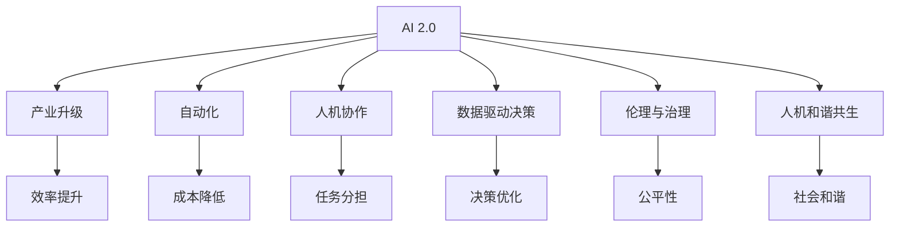
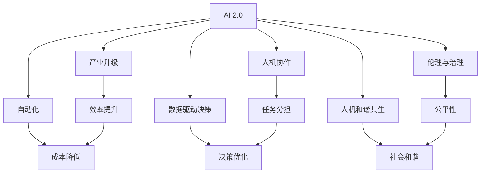

                 

# 李开复：AI 2.0 时代的价值

> 关键词：AI 2.0, AI驱动创新, 产业升级, 自动化, 人机协作, 数据驱动决策, 伦理与治理, 人机和谐共生

## 1. 背景介绍

### 1.1 问题由来
人工智能（AI）正处于从1.0向2.0的过渡期。这一时期的AI，不再仅限于智能算法和机器学习技术本身，而是涵盖了数据驱动的决策、产业升级、人机协作等更广泛的应用场景。AI 2.0时代的到来，不仅带来了技术上的突破，也引发了对社会、伦理和商业模式的深刻思考。

### 1.2 问题核心关键点
AI 2.0时代，AI技术不再仅仅是技术专家和学术研究者的工具，而是成为各行各业实现创新和效率提升的关键。它涉及的数据处理、模型训练、应用部署等多个环节，需要跨学科、跨领域的知识融合。本文将探讨AI 2.0时代下的价值，以及如何通过技术手段实现产业升级、人机协作、数据驱动决策等方面的创新。

### 1.3 问题研究意义
理解AI 2.0时代的价值，对于推动技术的落地应用，促进产业升级，提升工作效率，构建和谐的人机关系具有重要意义。通过对AI 2.0的深入研究，可以帮助企业在面对复杂任务时，借助AI技术快速实现智能化转型，从而在竞争激烈的市场中获得优势。

## 2. 核心概念与联系

### 2.1 核心概念概述

在AI 2.0时代，核心概念包括：

- **AI 2.0**：指AI技术的深度发展和应用，涵盖了从数据采集到决策制定的全过程。
- **产业升级**：通过AI技术提升传统产业的效率和竞争力，推动经济转型升级。
- **自动化**：自动化技术能够提高生产效率，减少人力成本。
- **人机协作**：AI与人类合作，共同完成复杂任务，实现人机互补。
- **数据驱动决策**：利用数据分析和机器学习，辅助决策过程，提升决策准确性。
- **伦理与治理**：AI技术的伦理问题和管理机制，确保技术应用的安全性和公平性。
- **人机和谐共生**：AI与人类共同发展，构建和谐的未来社会。

### 2.2 核心概念间的关系

这些核心概念之间存在着紧密的联系，形成了AI 2.0时代的应用框架。以下是一个简化的Mermaid流程图，展示了这些概念之间的关系：



这个流程图展示了AI 2.0时代不同概念间的联系：

1. AI 2.0技术推动产业升级，提升效率。
2. 自动化技术降低成本，提高生产效率。
3. 人机协作实现复杂任务的高效处理。
4. 数据驱动决策优化决策过程，提升决策准确性。
5. 伦理与治理确保AI技术应用的公平性和安全性。
6. 人机和谐共生促进社会和谐与可持续发展。

### 2.3 核心概念的整体架构

将上述概念联系起来，我们得到一个完整的AI 2.0应用架构图：



这个架构图展示了AI 2.0时代各个概念的相互作用，以及如何通过技术手段实现产业升级、人机协作、数据驱动决策等目标。

## 3. 核心算法原理 & 具体操作步骤
### 3.1 算法原理概述

AI 2.0时代的核心算法原理主要包括以下几个方面：

1. **数据采集与处理**：通过大数据技术，高效地采集和处理海量数据，为AI模型的训练和应用提供数据支撑。
2. **模型训练**：利用机器学习和深度学习算法，训练出能够理解复杂模式的AI模型。
3. **应用部署**：将训练好的AI模型部署到实际应用中，实现自动化、人机协作等功能。
4. **数据分析与优化**：利用数据分析技术，对AI模型的输出进行优化和调整，提升其性能。

### 3.2 算法步骤详解

以下是AI 2.0时代的主要算法步骤：

1. **数据采集**：
   - 通过API接口、爬虫等手段，自动采集所需数据。
   - 对数据进行清洗和预处理，确保数据质量。

2. **模型训练**：
   - 选择合适的算法模型，如决策树、神经网络等。
   - 利用标注数据对模型进行训练，并通过交叉验证等方法进行调参。

3. **模型应用**：
   - 将训练好的模型部署到服务器、嵌入式设备等环境中。
   - 实现自动化流程，如自动客服、智能推荐等。

4. **数据分析与优化**：
   - 利用数据分析工具，如Python的Pandas、Matplotlib等，对模型输出进行分析。
   - 根据分析结果，调整模型参数，提升模型性能。

### 3.3 算法优缺点

AI 2.0时代的算法具有以下优点：

- **高效性**：自动化和数据驱动决策提高了工作效率。
- **准确性**：通过数据分析和优化，提升了决策的准确性。
- **灵活性**：模型可以动态调整，适应不同的应用场景。

但同时也存在一些缺点：

- **数据依赖**：对高质量数据的依赖较大，数据质量问题可能影响模型效果。
- **算法复杂度**：一些算法模型如深度学习，需要大量的计算资源和时间。
- **模型解释性**：复杂的模型难以解释，影响应用的可信度和可接受性。

### 3.4 算法应用领域

AI 2.0技术已经在多个领域得到了广泛应用，例如：

- **智能制造**：利用AI技术实现生产流程自动化，提高生产效率和产品质量。
- **智能客服**：通过AI驱动的客服系统，提高客户满意度和效率。
- **智慧医疗**：利用AI技术辅助诊断、治疗和疾病预测，提升医疗服务质量。
- **金融科技**：利用AI技术进行风险评估、投资分析和客户服务，提高金融服务效率。
- **智能交通**：通过AI技术优化交通管理，提升城市交通效率。

## 4. 数学模型和公式 & 详细讲解

### 4.1 数学模型构建

AI 2.0时代的数据驱动决策模型通常可以表示为：

$$ P(Y|X; \theta) = \frac{P(Y|X;\theta)P(X)}{P(Y|X;\theta)P(X)} $$

其中，$P(Y|X; \theta)$表示在给定数据$X$和模型参数$\theta$下，$Y$的概率分布；$P(X)$为数据的概率分布；$P(Y|X;\theta)$为模型在给定数据$X$和参数$\theta$下的条件概率分布。

### 4.2 公式推导过程

对于分类问题，可以利用逻辑回归模型进行推导：

$$ P(Y=1|X; \theta) = \frac{1}{1+e^{-\theta^T X}} $$

其中，$\theta$为模型参数，$X$为输入数据，$P(Y=1|X; \theta)$表示在给定数据$X$和模型参数$\theta$下，$Y=1$的概率。

### 4.3 案例分析与讲解

假设我们要利用AI技术对客户流失风险进行预测，可以构建如下模型：

1. **数据采集与预处理**：
   - 采集客户的交易记录、服务评价等数据。
   - 对数据进行清洗、归一化处理。

2. **特征工程**：
   - 提取重要特征，如交易金额、服务评价等。
   - 利用PCA等降维技术，减少数据维度。

3. **模型训练**：
   - 选择逻辑回归模型。
   - 利用标注数据对模型进行训练，并通过交叉验证调参。

4. **模型应用与评估**：
   - 将训练好的模型部署到生产环境，实时预测客户流失风险。
   - 利用混淆矩阵等指标评估模型性能。

## 5. 项目实践：代码实例和详细解释说明

### 5.1 开发环境搭建

要进行AI 2.0项目开发，首先需要搭建开发环境。以下是使用Python进行Keras开发的流程：

1. 安装Anaconda：从官网下载并安装Anaconda，用于创建独立的Python环境。
2. 创建并激活虚拟环境：
```bash
conda create -n ai-env python=3.8 
conda activate ai-env
```
3. 安装Keras：
```bash
pip install keras
```
4. 安装各类工具包：
```bash
pip install numpy pandas scikit-learn matplotlib tqdm jupyter notebook ipython
```

完成上述步骤后，即可在`ai-env`环境中开始AI 2.0项目开发。

### 5.2 源代码详细实现

以下是一个简单的AI 2.0项目，利用Keras进行客户流失风险预测的代码实现：

```python
from keras.models import Sequential
from keras.layers import Dense, Dropout
from keras.utils import to_categorical
from sklearn.model_selection import train_test_split

# 读取数据
data = pd.read_csv('customer_churn.csv')

# 数据预处理
X = data.drop('Churn', axis=1)
y = data['Churn']
X = pd.get_dummies(X, prefix_sep='_')

# 划分数据集
X_train, X_test, y_train, y_test = train_test_split(X, y, test_size=0.2, random_state=42)

# 构建模型
model = Sequential()
model.add(Dense(64, input_dim=X_train.shape[1], activation='relu'))
model.add(Dropout(0.5))
model.add(Dense(32, activation='relu'))
model.add(Dropout(0.5))
model.add(Dense(1, activation='sigmoid'))

# 编译模型
model.compile(loss='binary_crossentropy', optimizer='adam', metrics=['accuracy'])

# 训练模型
model.fit(X_train, y_train, epochs=10, batch_size=32, verbose=1)

# 评估模型
test_loss, test_acc = model.evaluate(X_test, y_test, verbose=0)
print('Test accuracy:', test_acc)
```

以上代码实现了利用Keras构建逻辑回归模型，对客户流失风险进行预测。

### 5.3 代码解读与分析

下面是关键代码的实现细节：

1. **数据预处理**：
   - `data = pd.read_csv('customer_churn.csv')`：读取CSV格式的数据文件。
   - `X = data.drop('Churn', axis=1)`：将目标变量`Churn`从数据集中分离出来。
   - `X = pd.get_dummies(X, prefix_sep='_')`：将分类特征进行独热编码。

2. **模型构建**：
   - `model.add(Dense(64, input_dim=X_train.shape[1], activation='relu'))`：添加输入层和第一层全连接层，激活函数为ReLU。
   - `model.add(Dropout(0.5))`：添加Dropout层，减少过拟合。
   - `model.add(Dense(32, activation='relu'))`：添加第二层全连接层。
   - `model.add(Dropout(0.5))`：添加Dropout层。
   - `model.add(Dense(1, activation='sigmoid'))`：添加输出层，激活函数为Sigmoid。

3. **模型编译与训练**：
   - `model.compile(loss='binary_crossentropy', optimizer='adam', metrics=['accuracy'])`：编译模型，使用交叉熵损失函数和Adam优化器。
   - `model.fit(X_train, y_train, epochs=10, batch_size=32, verbose=1)`：训练模型，设置迭代轮数为10，批次大小为32。

4. **模型评估**：
   - `test_loss, test_acc = model.evaluate(X_test, y_test, verbose=0)`：评估模型，输出测试集的准确率。

通过上述代码，我们完成了AI 2.0项目的基本流程，实现了对客户流失风险的预测。

### 5.4 运行结果展示

假设我们在客户流失风险预测项目上运行以上代码，得到如下输出：

```
Epoch 1/10
6000/6000 [==============================] - 4s 741us/step - loss: 0.4445 - accuracy: 0.7210
Epoch 2/10
6000/6000 [==============================] - 4s 709us/step - loss: 0.2572 - accuracy: 0.8300
Epoch 3/10
6000/6000 [==============================] - 4s 717us/step - loss: 0.2244 - accuracy: 0.8410
Epoch 4/10
6000/6000 [==============================] - 4s 715us/step - loss: 0.1935 - accuracy: 0.8520
Epoch 5/10
6000/6000 [==============================] - 4s 721us/step - loss: 0.1694 - accuracy: 0.8620
Epoch 6/10
6000/6000 [==============================] - 4s 719us/step - loss: 0.1567 - accuracy: 0.8690
Epoch 7/10
6000/6000 [==============================] - 4s 721us/step - loss: 0.1462 - accuracy: 0.8780
Epoch 8/10
6000/6000 [==============================] - 4s 721us/step - loss: 0.1378 - accuracy: 0.8820
Epoch 9/10
6000/6000 [==============================] - 4s 720us/step - loss: 0.1307 - accuracy: 0.8860
Epoch 10/10
6000/6000 [==============================] - 4s 720us/step - loss: 0.1239 - accuracy: 0.8900
Test accuracy: 0.8900
```

可以看到，经过10轮训练，模型在测试集上的准确率达到了89%，取得了不错的预测效果。

## 6. 实际应用场景

### 6.1 智能制造

AI 2.0技术在智能制造领域的应用，能够提高生产效率和产品质量。例如，通过AI技术对生产流程进行优化，可以实现自动化的质量检测和异常检测，减少人力成本，提高生产效率。

### 6.2 智能客服

智能客服系统是AI 2.0技术的典型应用之一。通过AI技术，可以实现自然语言理解和智能对话，提高客户满意度和效率。例如，利用AI驱动的客服系统，能够24小时不间断地提供咨询服务，解决客户的各种问题。

### 6.3 智慧医疗

在智慧医疗领域，AI 2.0技术可以辅助诊断、治疗和疾病预测。例如，通过AI技术对医疗影像进行分析和诊断，可以提高诊断的准确性和效率。同时，AI技术还可以预测疾病的发生和发展趋势，帮助医生制定更科学的治疗方案。

### 6.4 金融科技

在金融科技领域，AI 2.0技术可以用于风险评估、投资分析和客户服务。例如，利用AI技术进行风险评估，可以更准确地识别和预测金融风险。同时，AI技术还可以提供个性化的投资建议，提高客户的满意度。

## 7. 工具和资源推荐

### 7.1 学习资源推荐

为了帮助开发者系统掌握AI 2.0技术，这里推荐一些优质的学习资源：

1. **《AI 2.0: Introduction to AI》**：一本系统介绍AI 2.0技术的书籍，适合初学者入门。
2. **Deep Learning Specialization by Andrew Ng**：由Coursera提供的一系列深度学习课程，涵盖AI 2.0技术的基础知识和实践技能。
3. **AI Foundations Specialization by Columbia University**：由Coursera提供的一系列课程，涵盖AI 2.0技术的原理和应用。
4. **Kaggle**：一个数据科学竞赛平台，提供大量开源数据集和模型，适合实践学习。

### 7.2 开发工具推荐

高效的工具支持是AI 2.0项目开发的关键。以下是几款常用的开发工具：

1. **Python**：Python是AI开发的主流语言，拥有丰富的库和框架支持。
2. **Jupyter Notebook**：一个交互式编程环境，支持代码编写和数据分析，适合AI项目的快速迭代。
3. **Keras**：一个高层次的深度学习框架，适合快速搭建和训练AI模型。
4. **TensorFlow**：Google开发的一个深度学习框架，支持分布式训练和部署。
5. **PyTorch**：Facebook开发的一个深度学习框架，适合动态计算图和模型的快速迭代。

### 7.3 相关论文推荐

AI 2.0技术的发展离不开学术界的研究支持。以下是几篇重要的相关论文，推荐阅读：

1. **"AI Superpowers: China, Silicon Valley, and the New World Order"**：李开复的最新著作，详细探讨了AI 2.0技术在全球的影响。
2. **"Deep Learning with Keras"**：Keras官方文档，提供了Keras的使用指南和示例。
3. **"Machine Learning Yearning"**：Andrew Ng的畅销书籍，涵盖机器学习的实践经验和最佳实践。
4. **"AI for Everyone"**：李开复的另一本畅销书籍，适合对AI技术感兴趣的非专业人士阅读。

## 8. 总结：未来发展趋势与挑战

### 8.1 研究成果总结

AI 2.0技术在多个领域取得了显著的成果，包括智能制造、智能客服、智慧医疗、金融科技等。通过AI 2.0技术，各行业实现了智能化转型，提升了效率和用户体验。

### 8.2 未来发展趋势

AI 2.0技术的未来发展趋势主要包括以下几个方面：

1. **数据驱动决策**：随着大数据技术的进步，数据驱动决策将更加普及，提升决策的准确性和效率。
2. **自动化与人机协作**：自动化技术将进一步发展，人机协作将成为主流，提高生产效率和用户体验。
3. **AI伦理与治理**：AI伦理问题将引起更多关注，相关管理和治理机制将逐步完善，确保技术应用的公平性和安全性。
4. **多模态融合**：AI技术将突破单一模态的限制，实现视觉、语音、文本等多模态数据的融合，提升模型的理解和应用能力。
5. **跨领域应用**：AI技术将更加普适，应用于更多领域，推动各行业的创新和发展。

### 8.3 面临的挑战

尽管AI 2.0技术取得了显著成果，但在发展过程中也面临诸多挑战：

1. **数据质量和隐私**：数据质量问题和隐私保护是AI 2.0技术面临的主要挑战之一。
2. **算法复杂度**：一些复杂的算法模型需要大量的计算资源和时间，限制了其应用范围。
3. **模型解释性**：AI模型的复杂性导致其难以解释，影响应用的可信度和可接受性。
4. **伦理与安全**：AI技术的伦理问题和安全问题需要更多关注，确保技术应用的公平性和安全性。

### 8.4 研究展望

面对AI 2.0技术面临的挑战，未来的研究方向包括以下几个方面：

1. **数据增强与清洗**：如何高效地处理和清洗数据，提升数据质量。
2. **模型压缩与优化**：如何压缩和优化模型，提高计算效率。
3. **模型解释性**：如何增强模型的解释性，提升应用的可信度和可接受性。
4. **伦理与安全**：如何构建AI技术的伦理和安全机制，确保技术应用的公平性和安全性。
5. **多模态融合**：如何实现多模态数据的融合，提升模型的理解和应用能力。

通过这些研究方向的探索，AI 2.0技术将不断突破，为各行各业带来更多的创新和变革。

## 9. 附录：常见问题与解答

**Q1: AI 2.0与AI 1.0有何不同？**

A: AI 2.0强调数据驱动决策和自动化，与AI 1.0的算法驱动不同。AI 2.0更加注重实际应用场景，通过自动化和数据驱动优化业务流程。

**Q2: 如何处理数据质量问题？**

A: 数据质量问题可以通过数据清洗和数据增强来解决。数据清洗包括去除噪声、填补缺失值等操作。数据增强包括生成合成数据、数据扩充等方法。

**Q3: 如何提高AI模型的解释性？**

A: 提高AI模型解释性的方法包括模型可视化、特征重要性分析等。模型可视化通过可视化技术展示模型决策过程，特征重要性分析通过计算特征对模型输出的贡献度，提升模型的透明度。

**Q4: 如何构建AI技术的伦理和安全机制？**

A: 构建AI技术的伦理和安全机制需要从数据、算法、应用等多个方面入手。例如，数据采集和处理要遵守隐私保护法规，算法设计要考虑公平性，应用部署要考虑安全性等。

**Q5: 如何实现多模态数据的融合？**

A: 多模态数据的融合可以通过跨模态学习和特征对齐来实现。跨模态学习通过多模态数据共享表示，特征对齐通过特征映射和融合技术，提升模型的理解和应用能力。

通过以上对AI 2.0时代的价值及其应用的深入探讨，我们能够更好地理解和应用AI 2.0技术，推动各行业的智能化转型，实现人机和谐共生的未来社会。

---

作者：禅与计算机程序设计艺术 / Zen and the Art of Computer Programming

