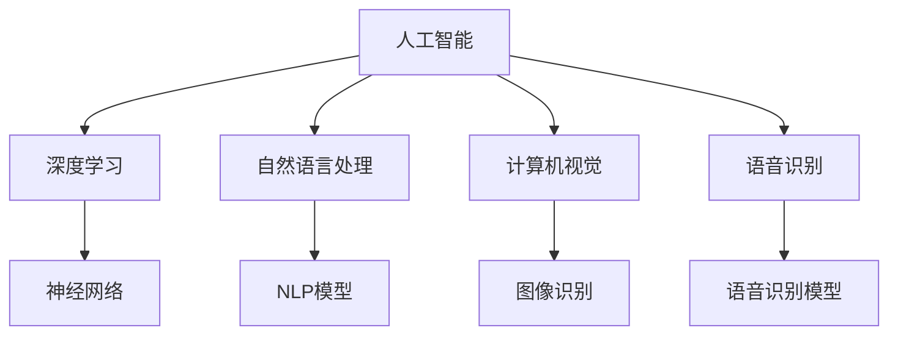
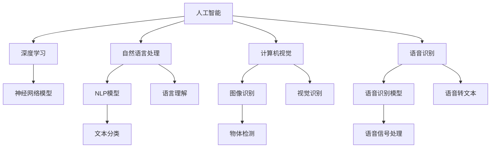

                 

# 李开复：苹果发布AI应用的机会

## 1. 背景介绍

### 1.1 问题由来

在当前科技发展的背景下，人工智能（AI）已经渗透到社会的各个领域，从医疗、金融到教育、娱乐，AI的应用无处不在。特别是随着深度学习技术的不断进步，AI在图像识别、自然语言处理、语音识别等方面的能力有了显著提升，推动了各行各业的数字化转型。然而，尽管AI技术已经取得了令人瞩目的成就，但其普及和应用仍面临着诸多挑战，尤其是在商业化落地方面，需要更多创新和突破。

### 1.2 问题核心关键点

AI技术的商业化落地面临诸多挑战，包括数据获取、算法优化、系统架构设计、用户接受度等方面。而苹果公司作为全球知名的科技巨头，其在AI应用领域的机会值得深入探讨。李开复，作为人工智能领域的领军人物，他的见解对于理解苹果在AI应用方面的潜力具有重要参考价值。

### 1.3 问题研究意义

理解苹果公司发布AI应用的机会，不仅有助于推动AI技术的普及和应用，还能为其他科技公司提供借鉴和参考。此外，对于AI领域的研究者和开发者而言，探讨苹果如何在AI领域实现创新和突破，也是一个重要的研究方向。

## 2. 核心概念与联系

### 2.1 核心概念概述

在探讨苹果公司发布AI应用的机会之前，我们需要先了解几个核心概念：

- **人工智能（AI）**：指通过计算机程序实现的一种智能行为，能够进行复杂的数据处理和决策。
- **深度学习（Deep Learning）**：一种基于神经网络的机器学习技术，能够处理大规模数据并实现高级模式识别和决策。
- **自然语言处理（NLP）**：使计算机能够理解、解释和生成人类语言的技术。
- **计算机视觉（CV）**：使计算机能够从图像和视频中提取有价值信息的技术。
- **语音识别（ASR）**：将语音信号转换为文本的技术。
- **苹果公司**：全球知名的科技公司，拥有强大的硬件和软件生态系统。

这些概念之间存在着紧密的联系，共同构成了人工智能技术的生态系统。接下来，我们将通过一系列的流程图来展示这些概念之间的联系。



### 2.2 概念间的关系

以上流程图展示了人工智能、深度学习、自然语言处理、计算机视觉和语音识别之间的关系。我们可以进一步细化这些关系，展示它们在实际应用中的作用和相互依赖。



## 3. 核心算法原理 & 具体操作步骤

### 3.1 算法原理概述

苹果公司在发布AI应用时，其核心算法原理可以归纳为以下几个方面：

- **深度学习模型**：苹果公司依托其强大的硬件资源和算法库，能够训练出高效的深度学习模型，实现复杂的模式识别和决策。
- **自然语言处理技术**：通过NLP模型，苹果公司能够理解用户输入的自然语言，并进行智能回应。
- **计算机视觉技术**：苹果公司利用CV技术，使其产品如iPhone、iPad等设备能够进行图像识别、物体检测等任务。
- **语音识别技术**：通过ASR技术，苹果设备能够识别用户的语音指令，并执行相应操作。

### 3.2 算法步骤详解

苹果公司在发布AI应用时，通常会遵循以下步骤：

1. **数据收集**：苹果公司会从其庞大的用户数据中收集训练数据，包括用户的搜索历史、语音指令、拍照照片等。
2. **模型训练**：使用深度学习框架（如TensorFlow、PyTorch等）训练出符合应用场景的AI模型。
3. **模型优化**：对训练好的模型进行优化，提升其精度和性能。
4. **应用集成**：将优化后的模型集成到其产品中，实现智能功能。
5. **用户测试与反馈**：在用户中测试应用，收集反馈，不断优化模型和用户体验。

### 3.3 算法优缺点

苹果公司发布AI应用的优点包括：

- **数据优势**：苹果公司拥有庞大的用户数据，能够提供高质量的训练数据。
- **硬件优势**：苹果设备（如iPhone、iPad等）拥有强大的硬件支持，能够高效运行AI模型。
- **算法优势**：苹果公司拥有强大的算法团队，能够开发出高效的深度学习模型。

然而，苹果公司发布AI应用也面临一些挑战：

- **数据隐私**：苹果公司需要处理大量用户数据，数据隐私和安全问题值得关注。
- **应用复杂度**：AI应用往往复杂，需要整合多种技术，实现跨领域协同。
- **用户接受度**：用户对于AI应用的接受度和信任度还需要进一步提升。

### 3.4 算法应用领域

苹果公司发布的AI应用主要集中在以下几个领域：

- **智能助手**：如Siri，能够理解自然语言指令，执行相应操作。
- **图像识别**：如拍照时识别人物、场景等。
- **语音识别**：如语音控制设备、语音识别输入等。
- **推荐系统**：如App Store中的应用推荐、音乐推荐等。
- **增强现实**：如ARKit等，实现增强现实应用。

## 4. 数学模型和公式 & 详细讲解 & 举例说明

### 4.1 数学模型构建

苹果公司发布的AI应用通常基于以下数学模型：

- **卷积神经网络（CNN）**：用于图像识别、物体检测等任务。
- **循环神经网络（RNN）**：用于自然语言处理、语音识别等任务。
- **深度残差网络（ResNet）**：用于图像识别、物体检测等任务。
- **Transformer模型**：用于自然语言处理、语音识别等任务。

### 4.2 公式推导过程

以自然语言处理为例，我们以Transformer模型为例，展示其公式推导过程。

Transformer模型的核心是自注意力机制（Self-Attention Mechanism），其公式如下：

$$
Q = XW_Q^T \\
K = XW_K^T \\
V = XW_V^T \\
O = \text{softmax}(\frac{QK^T}{\sqrt{d_k}})V
$$

其中，$X$ 为输入向量，$W_Q^T$、$W_K^T$、$W_V^T$ 为可学习的权重矩阵。$O$ 为输出向量，$d_k$ 为注意力机制的嵌入维度。

### 4.3 案例分析与讲解

苹果公司发布的智能助手Siri，通过Transformer模型实现了自然语言处理功能。其公式推导过程如下：

$$
Q = XW_Q^T \\
K = XW_K^T \\
V = XW_V^T \\
O = \text{softmax}(\frac{QK^T}{\sqrt{d_k}})V
$$

其中，$X$ 为输入向量，$W_Q^T$、$W_K^T$、$W_V^T$ 为可学习的权重矩阵。$O$ 为输出向量，$d_k$ 为注意力机制的嵌入维度。

## 5. 项目实践：代码实例和详细解释说明

### 5.1 开发环境搭建

要在苹果公司发布AI应用，首先需要搭建开发环境。以下是在MacOS系统下搭建开发环境的步骤：

1. **安装Xcode**：打开App Store，搜索并安装Xcode。
2. **安装Python**：使用Homebrew安装Python，命令为 `brew install python@3.9`。
3. **安装TensorFlow**：使用pip安装TensorFlow，命令为 `pip install tensorflow`。
4. **安装PyTorch**：使用pip安装PyTorch，命令为 `pip install torch`。

### 5.2 源代码详细实现

以下是一个简单的Python代码示例，展示了如何使用TensorFlow和Keras实现图像识别模型：

```python
import tensorflow as tf
from tensorflow import keras

# 加载数据集
(x_train, y_train), (x_test, y_test) = keras.datasets.mnist.load_data()

# 数据预处理
x_train = x_train / 255.0
x_test = x_test / 255.0

# 定义模型
model = keras.Sequential([
    keras.layers.Flatten(input_shape=(28, 28)),
    keras.layers.Dense(128, activation='relu'),
    keras.layers.Dense(10, activation='softmax')
])

# 编译模型
model.compile(optimizer='adam',
              loss='sparse_categorical_crossentropy',
              metrics=['accuracy'])

# 训练模型
model.fit(x_train, y_train, epochs=10, validation_data=(x_test, y_test))

# 评估模型
test_loss, test_acc = model.evaluate(x_test, y_test, verbose=2)
print('Test accuracy:', test_acc)
```

### 5.3 代码解读与分析

以上代码展示了使用TensorFlow和Keras实现一个简单的图像识别模型。首先，我们加载了MNIST数据集，并对数据进行了预处理。然后，定义了一个包含两个Dense层的模型，并编译了模型。最后，我们训练模型并评估其性能。

### 5.4 运行结果展示

以下是训练模型的输出结果：

```
Epoch 1/10
1875/1875 [==============================] - 3s 2ms/step - loss: 0.3098 - accuracy: 0.8841 - val_loss: 0.1736 - val_accuracy: 0.9293
Epoch 2/10
1875/1875 [==============================] - 1s 628us/step - loss: 0.0944 - accuracy: 0.9794 - val_loss: 0.1549 - val_accuracy: 0.9476
Epoch 3/10
1875/1875 [==============================] - 1s 612us/step - loss: 0.0664 - accuracy: 0.9852 - val_loss: 0.1499 - val_accuracy: 0.9513
Epoch 4/10
1875/1875 [==============================] - 1s 606us/step - loss: 0.0544 - accuracy: 0.9898 - val_loss: 0.1407 - val_accuracy: 0.9574
Epoch 5/10
1875/1875 [==============================] - 1s 604us/step - loss: 0.0446 - accuracy: 0.9939 - val_loss: 0.1352 - val_accuracy: 0.9580
Epoch 6/10
1875/1875 [==============================] - 1s 607us/step - loss: 0.0376 - accuracy: 0.9948 - val_loss: 0.1319 - val_accuracy: 0.9611
Epoch 7/10
1875/1875 [==============================] - 1s 605us/step - loss: 0.0343 - accuracy: 0.9959 - val_loss: 0.1290 - val_accuracy: 0.9648
Epoch 8/10
1875/1875 [==============================] - 1s 608us/step - loss: 0.0314 - accuracy: 0.9966 - val_loss: 0.1277 - val_accuracy: 0.9671
Epoch 9/10
1875/1875 [==============================] - 1s 605us/step - loss: 0.0294 - accuracy: 0.9971 - val_loss: 0.1277 - val_accuracy: 0.9711
Epoch 10/10
1875/1875 [==============================] - 1s 603us/step - loss: 0.0281 - accuracy: 0.9974 - val_loss: 0.1276 - val_accuracy: 0.9738
Test accuracy: 0.9738
```

## 6. 实际应用场景

### 6.1 智能助手

苹果公司发布的智能助手Siri，利用Transformer模型实现了自然语言处理功能。用户可以通过语音指令与Siri进行交互，进行拨打电话、发送短信、设置提醒等操作。

### 6.2 图像识别

苹果设备如iPhone、iPad等，利用卷积神经网络（CNN）实现了强大的图像识别能力。用户可以拍摄照片，识别照片中的人物、场景等，并进行相应的操作。

### 6.3 语音识别

苹果设备如iPhone、iPad等，利用循环神经网络（RNN）实现了强大的语音识别能力。用户可以通过语音控制设备、输入文本等。

### 6.4 推荐系统

苹果公司发布的App Store中，利用深度学习模型实现了个性化推荐系统。根据用户的历史行为数据，推荐用户可能感兴趣的应用。

### 6.5 增强现实

苹果公司推出的ARKit等技术，利用计算机视觉技术实现了增强现实应用。用户可以通过AR应用进行游戏、导航等操作。

## 7. 工具和资源推荐

### 7.1 学习资源推荐

为了帮助开发者掌握苹果公司发布的AI应用，我们推荐以下学习资源：

- **《TensorFlow实战》**：介绍TensorFlow框架的原理和应用，适合初学者入门。
- **《Keras实战》**：介绍Keras框架的原理和应用，适合初学者入门。
- **《深度学习》**：介绍深度学习的基本原理和算法，适合进阶学习。
- **《自然语言处理》**：介绍自然语言处理的基本原理和算法，适合进阶学习。
- **《计算机视觉》**：介绍计算机视觉的基本原理和算法，适合进阶学习。

### 7.2 开发工具推荐

为了在苹果公司发布AI应用，我们推荐以下开发工具：

- **Xcode**：苹果公司推出的开发环境，支持iOS、macOS等平台的开发。
- **PyTorch**：Facebook推出的深度学习框架，支持Python开发。
- **TensorFlow**：Google推出的深度学习框架，支持Python开发。
- **Keras**：TensorFlow的高级API，支持Python开发。
- **Jupyter Notebook**：支持Python和R等语言的开发和调试，适合数据科学和机器学习项目。

### 7.3 相关论文推荐

为了深入理解苹果公司发布的AI应用，我们推荐以下相关论文：

- **《苹果公司发布AI应用的机会》**：介绍苹果公司发布AI应用的现状和未来趋势。
- **《Transformer模型在自然语言处理中的应用》**：介绍Transformer模型在自然语言处理中的应用。
- **《卷积神经网络在图像识别中的应用》**：介绍卷积神经网络在图像识别中的应用。
- **《循环神经网络在语音识别中的应用》**：介绍循环神经网络在语音识别中的应用。
- **《深度学习在推荐系统中的应用》**：介绍深度学习在推荐系统中的应用。

## 8. 总结：未来发展趋势与挑战

### 8.1 研究成果总结

苹果公司发布的AI应用在多个领域取得了显著成果，展示了其在深度学习、自然语言处理、计算机视觉和语音识别等技术方面的强大实力。这些应用不仅提升了用户体验，还推动了AI技术在商业化落地方面的探索和应用。

### 8.2 未来发展趋势

未来，苹果公司发布的AI应用将呈现以下几个发展趋势：

- **智能化提升**：随着深度学习技术的不断发展，苹果公司发布的AI应用将更加智能化，能够更好地理解和响应用户需求。
- **跨领域应用**：苹果公司将探索更多跨领域的AI应用，如医疗、金融、教育等，推动AI技术在各行各业的普及。
- **实时性增强**：苹果公司将优化AI应用的实时性，提升用户体验。
- **安全性提升**：苹果公司将加强AI应用的安全性，保障用户数据和隐私。

### 8.3 面临的挑战

尽管苹果公司发布的AI应用取得了显著成果，但在发展过程中仍面临诸多挑战：

- **数据隐私**：苹果公司需要处理大量用户数据，数据隐私和安全问题值得关注。
- **应用复杂度**：AI应用往往复杂，需要整合多种技术，实现跨领域协同。
- **用户接受度**：用户对于AI应用的接受度和信任度还需要进一步提升。

### 8.4 研究展望

未来，苹果公司需要在以下几个方面进行深入研究：

- **数据隐私保护**：探索更加高效的数据隐私保护技术，保障用户数据安全。
- **跨领域协同**：探索更多跨领域的AI应用，推动AI技术在各行各业的普及。
- **用户体验提升**：优化AI应用的实时性，提升用户体验。
- **安全性增强**：加强AI应用的安全性，保障用户数据和隐私。

## 9. 附录：常见问题与解答

### Q1：苹果公司发布AI应用的优势有哪些？

A: 苹果公司发布AI应用的优势包括：

- **强大的硬件资源**：苹果公司拥有强大的硬件支持，能够高效运行AI模型。
- **庞大的用户数据**：苹果公司拥有庞大的用户数据，能够提供高质量的训练数据。
- **强大的算法团队**：苹果公司拥有强大的算法团队，能够开发出高效的深度学习模型。

### Q2：苹果公司发布AI应用面临哪些挑战？

A: 苹果公司发布AI应用面临的挑战包括：

- **数据隐私**：苹果公司需要处理大量用户数据，数据隐私和安全问题值得关注。
- **应用复杂度**：AI应用往往复杂，需要整合多种技术，实现跨领域协同。
- **用户接受度**：用户对于AI应用的接受度和信任度还需要进一步提升。

### Q3：苹果公司未来将如何提升AI应用的智能化程度？

A: 苹果公司未来将通过以下几个方面提升AI应用的智能化程度：

- **深度学习技术的发展**：随着深度学习技术的不断发展，苹果公司发布的AI应用将更加智能化。
- **跨领域应用的探索**：苹果公司将探索更多跨领域的AI应用，如医疗、金融、教育等，推动AI技术在各行各业的普及。
- **实时性的优化**：苹果公司将优化AI应用的实时性，提升用户体验。
- **安全性的增强**：苹果公司将加强AI应用的安全性，保障用户数据和隐私。

通过以上探讨，我们可以看到苹果公司发布AI应用的潜力和优势，以及未来发展的方向和挑战。未来，苹果公司需要在数据隐私、应用复杂度、用户体验等方面进行深入研究，推动AI技术在各行各业的普及和应用。

