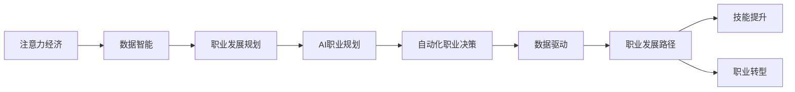
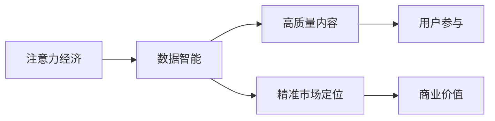
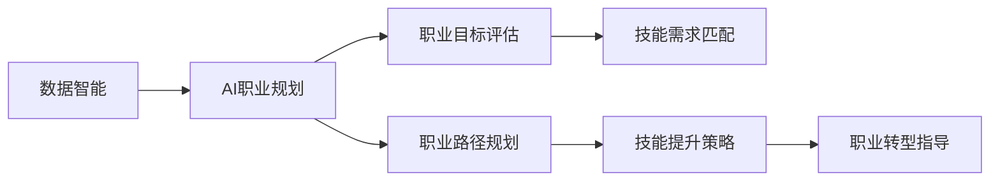
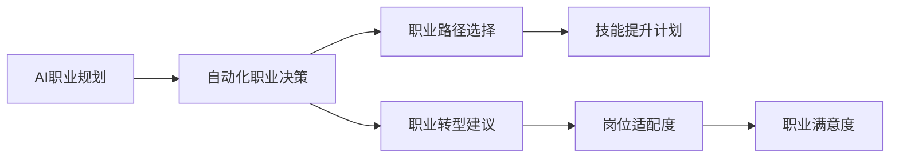
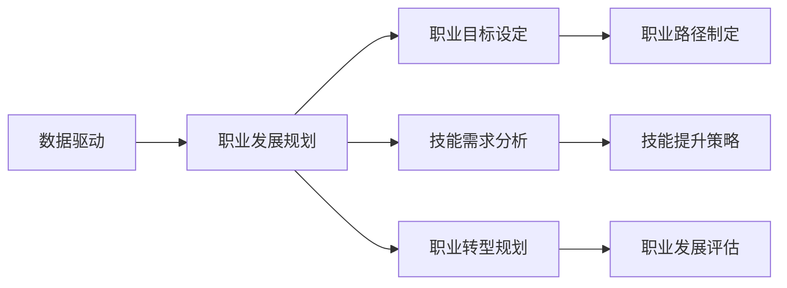
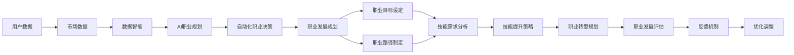

                 

# 注意力经济与个人职业发展规划的变化

> 关键词：注意力经济, 个人职业发展, 数据驱动, AI职业规划, 数据智能, 自动化职业决策

## 1. 背景介绍

### 1.1 问题由来
随着信息技术的飞速发展，全球正步入一个由数据驱动的新经济时代——注意力经济（Attention Economy）。注意力经济是指通过吸引和聚焦用户注意力来获取经济价值的一种新型商业模式。在信息爆炸的时代，如何高效获取和利用用户注意力，成为各大互联网公司竞争的核心。

在注意力经济的大背景下，个人职业发展也随之发生了深刻变化。传统的职业发展路径，多以学历、资历、行业经验为依托，而今天，个人职业发展更多地依赖于数据驱动、智能决策和市场反馈。如何适应这一变化，成为每个职场人士必须面对的新课题。

### 1.2 问题核心关键点
注意力经济的核心在于如何高效利用有限的注意力资源，从而创造出更多的商业价值。这不仅要求企业具备强大的数据获取和分析能力，还要求个人能够敏锐把握市场趋势，精准定位自身价值。

在个人职业发展规划中，注意力经济的引入，使得职业路径的选择、技能提升、职业转型等环节，都需要借助大数据和AI技术，进行科学合理的规划和决策。这无疑是对传统职业发展模式的一次全面挑战和革新。

### 1.3 问题研究意义
研究注意力经济在职业发展中的应用，对于提升个人职业规划的科学性和前瞻性，具有重要意义：

1. **优化职业路径**：借助大数据和AI，可以更科学地评估职业机会和潜在的市场价值，从而制定出更为合理、高效的职业发展路径。
2. **提升技能匹配度**：通过分析市场趋势和技能需求，帮助个人选择更有前景的职业方向，提升技能与市场需求的匹配度。
3. **加速职业转型**：面对职业环境的快速变化，智能决策和数据驱动有助于个人快速识别新的市场机会，加速职业转型和升级。
4. **增强决策依据**：借助数据分析和智能推荐，增强职业发展的数据依据，减少决策的盲目性和不确定性。
5. **提升职场竞争力**：在数据智能驱动的职场中，快速适应变化、精准把握机会的个体，往往更具竞争力，更容易获得成功。

## 2. 核心概念与联系

### 2.1 核心概念概述

为更好地理解注意力经济在个人职业发展规划中的应用，本节将介绍几个密切相关的核心概念：

- **注意力经济**：利用信息时代用户注意力的稀缺性，通过高质量内容的提供和精准的市场定位，实现商业价值最大化的一种商业模式。
- **数据智能**：通过大数据和AI技术，从海量数据中提取有价值的信息，辅助决策的智能化过程。
- **职业发展规划**：个人根据自身的兴趣、能力和市场需求，制定出的职业目标和步骤，以及实现这些目标的策略和方法。
- **AI职业规划**：利用AI技术对个人职业发展进行建模和预测，辅助个人进行科学合理的职业决策。
- **自动化职业决策**：通过智能算法和大数据分析，实现职业路径选择、技能提升、职业转型等环节的自动化决策。
- **数据驱动**：以数据为核心的决策模式，强调在决策过程中利用数据进行分析和推理，从而做出更加客观和科学的决策。

这些核心概念之间的逻辑关系可以通过以下Mermaid流程图来展示：



这个流程图展示了大语言模型微调过程中各个核心概念的关系：

1. 注意力经济为职业发展规划提供了价值创造的视角。
2. 数据智能和AI职业规划为职业决策提供了科学依据。
3. 自动化职业决策是数据智能和AI职业规划的执行层面。
4. 数据驱动是整个职业发展规划的支撑和基础。

这些概念共同构成了注意力经济下个人职业发展规划的完整生态系统，使其能够在新经济环境中获得成功。

### 2.2 概念间的关系

这些核心概念之间存在着紧密的联系，形成了注意力经济下个人职业发展规划的完整生态系统。下面我们通过几个Mermaid流程图来展示这些概念之间的关系。

#### 2.2.1 注意力经济与数据智能



这个流程图展示了注意力经济和数据智能之间的关系：

1. 注意力经济通过提供高质量内容吸引用户注意力，提升用户参与度。
2. 数据智能通过分析用户行为和市场趋势，帮助企业实现精准市场定位。
3. 精准市场定位增加商业价值，形成良性循环。

#### 2.2.2 数据智能与AI职业规划



这个流程图展示了数据智能和AI职业规划之间的关系：

1. 数据智能通过对用户和市场数据的分析，辅助AI职业规划进行职业目标评估和技能需求匹配。
2. AI职业规划结合数据智能提供的分析结果，制定出个性化的职业路径规划和技能提升策略。
3. 个性化的职业转型指导，帮助个人适应市场的快速变化。

#### 2.2.3 AI职业规划与自动化职业决策



这个流程图展示了AI职业规划和自动化职业决策之间的关系：

1. AI职业规划通过数据分析和机器学习，为自动化职业决策提供科学依据。
2. 自动化职业决策利用AI提供的决策依据，辅助个人进行职业路径选择、技能提升和职业转型。
3. 通过实时反馈，持续优化职业决策策略，提升职业满意度和岗位适配度。

#### 2.2.4 数据驱动与职业发展规划



这个流程图展示了数据驱动与职业发展规划之间的关系：

1. 数据驱动通过对市场数据和职业数据的分析，为职业发展规划提供科学依据。
2. 职业发展规划结合数据驱动提供的分析结果，制定出个性化和市场化的职业目标和路径。
3. 技能需求分析和职业转型规划，确保职业路径和市场趋势保持一致。

### 2.3 核心概念的整体架构

最后，我们用一个综合的流程图来展示这些核心概念在注意力经济下个人职业发展规划的整体架构：



这个综合流程图展示了从数据收集到职业发展评估的完整过程。在注意力经济的背景下，个人职业发展规划需要借助数据智能和AI技术，进行科学合理的规划和决策，以适应快速变化的市场环境。

## 3. 核心算法原理 & 具体操作步骤
### 3.1 算法原理概述

基于数据智能的AI职业规划，其核心思想是利用数据分析和机器学习技术，从海量数据中提取有价值的信息，辅助职业决策的智能化过程。其关键在于如何将注意力经济中的数据元素和职业发展规划的要素进行有效映射，从而形成可操作的职业发展路径。

具体而言，AI职业规划可以大致分为以下几个步骤：

1. **数据收集**：收集个人职业数据（如学历、资历、工作经历、技能、兴趣爱好等）、市场数据（如职位需求、薪资水平、行业趋势等）和行为数据（如搜索历史、浏览记录、交互反馈等）。
2. **数据清洗和预处理**：对收集到的数据进行去重、缺失值处理、标准化等操作，确保数据质量和一致性。
3. **特征工程**：利用特征工程技术，提取和构造对职业决策有意义的特征，如技能匹配度、岗位适配度、职业满意度等。
4. **模型训练**：选择合适的机器学习算法和模型，如决策树、随机森林、神经网络等，对数据进行建模和训练，形成职业发展规划模型。
5. **预测和决策**：利用训练好的模型，对个人的职业目标、路径选择、技能提升和职业转型等进行预测和决策，输出科学合理的建议和方案。
6. **评估和反馈**：通过实时反馈和持续优化，不断提升模型的准确性和可靠性，确保职业发展规划的科学性和前瞻性。

### 3.2 算法步骤详解

#### 3.2.1 数据收集

数据收集是AI职业规划的基础，需要涵盖个人职业数据、市场数据和行为数据等多个方面：

1. **个人职业数据**：包括学历、专业、工作经验、技能证书、兴趣爱好等，反映了个人的职业背景和能力水平。
2. **市场数据**：包括职位需求、行业趋势、薪资水平、岗位要求等，反映了市场对人才的需求和变化。
3. **行为数据**：包括求职搜索记录、简历投递记录、职位浏览记录、面试反馈等，反映了个人的求职行为和市场互动。

#### 3.2.2 数据清洗和预处理

数据清洗和预处理是数据智能的重要环节，主要目的是提高数据质量和一致性，便于后续分析：

1. **去重**：去除重复的数据记录，确保数据集的唯一性和准确性。
2. **缺失值处理**：对于缺失值，可以采用插值、均值替代、删除等方式进行填充或处理，确保数据的完整性。
3. **标准化**：对数据进行归一化或标准化操作，确保不同特征之间的可比性和一致性。

#### 3.2.3 特征工程

特征工程是数据分析和机器学习的关键步骤，通过提取和构造有意义的特征，提升模型的预测和决策能力：

1. **技能匹配度**：计算个人技能与岗位要求的匹配度，通过特征提取技术，提取与岗位相关的技能关键词和职业标签。
2. **岗位适配度**：计算个人职业背景与岗位要求的适配度，通过特征工程技术，构造岗位与职业背景之间的匹配关系。
3. **职业满意度**：通过数据分析和模型训练，预测个人在不同岗位上的职业满意度，帮助选择更符合心理预期的职业路径。

#### 3.2.4 模型训练

模型训练是AI职业规划的核心环节，通过选择合适的机器学习算法和模型，对数据进行建模和训练，形成职业发展规划模型：

1. **决策树和随机森林**：用于处理分类和回归问题，通过树形结构进行决策和预测。
2. **神经网络**：用于处理复杂的非线性关系，通过多层神经网络进行特征提取和预测。
3. **集成学习**：通过集成多个模型，提高预测和决策的稳定性和准确性。

#### 3.2.5 预测和决策

预测和决策是AI职业规划的执行环节，通过模型训练和特征分析，对个人的职业目标、路径选择、技能提升和职业转型等进行预测和决策：

1. **职业目标评估**：利用模型对个人的职业目标进行评估，判断其是否符合市场需求和自身能力。
2. **技能需求匹配**：通过模型预测，识别个人当前技能与岗位需求的匹配度，提出相应的技能提升建议。
3. **职业路径规划**：结合市场趋势和个人兴趣，制定个性化的职业发展路径，包括短期和长期目标。
4. **职业转型建议**：根据市场变化和个人职业满意度，提出职业转型的建议和策略，帮助个人快速适应市场环境。

#### 3.2.6 评估和反馈

评估和反馈是AI职业规划的重要组成部分，通过实时反馈和持续优化，不断提升模型的准确性和可靠性：

1. **模型评估**：通过交叉验证和独立测试集，评估模型的预测和决策能力，识别模型的强项和弱点。
2. **实时反馈**：通过用户反馈和市场动态，实时调整和优化模型参数和策略，确保职业发展规划的科学性和前瞻性。
3. **持续优化**：通过迭代更新和模型集成，不断提升AI职业规划的准确性和可靠性，确保职业发展规划的实用性和可操作性。

### 3.3 算法优缺点

基于数据智能的AI职业规划方法具有以下优点：

1. **数据驱动**：以数据为核心的决策模式，使得职业发展规划更具科学性和客观性。
2. **自动化决策**：通过机器学习和数据分析，实现职业路径选择、技能提升和职业转型的自动化决策，提高决策效率和准确性。
3. **个性化定制**：结合个人职业背景和市场数据，提供个性化的职业发展规划和建议，提升职业发展的针对性和有效性。
4. **动态调整**：通过实时反馈和持续优化，确保职业发展规划能够动态适应市场变化，保持前瞻性和灵活性。

同时，该方法也存在一定的局限性：

1. **数据依赖性强**：对数据质量和数量要求较高，数据不足或质量不高会导致模型预测和决策的准确性下降。
2. **模型复杂度高**：高维数据和复杂模型的训练和调优需要较强的计算资源和技术能力。
3. **结果解释性差**：机器学习模型往往缺乏可解释性，难以解释模型的决策逻辑和过程。
4. **数据隐私问题**：个人职业数据和市场数据的收集和存储可能涉及隐私问题，需要严格遵守数据保护法规。

尽管存在这些局限性，但就目前而言，基于数据智能的AI职业规划方法仍是职业发展规划的重要参考，能够为个人职业发展提供科学合理的指导。

### 3.4 算法应用领域

基于数据智能的AI职业规划方法在多个领域得到了广泛应用，以下是几个典型的应用场景：

1. **企业人力资源管理**：通过AI职业规划，帮助企业合理规划人才需求，优化招聘和人才管理流程。
2. **职业培训和发展**：为员工提供个性化的职业发展规划和技能提升建议，帮助其提升职业竞争力。
3. **职业指导和咨询**：为求职者提供科学的职业选择和转型建议，帮助其制定合理的职业发展路径。
4. **创业指导和支持**：为创业者提供市场机会识别和职业规划建议，帮助其选择更具前景的创业方向。
5. **人才流动和移民**：为人才流动和移民提供职业发展规划和市场信息，帮助其快速适应新环境。

这些应用场景展示了AI职业规划方法的多样性和实用性，进一步证明了其在职业发展规划中的重要价值。

## 4. 数学模型和公式 & 详细讲解 & 举例说明

### 4.1 数学模型构建

基于数据智能的AI职业规划方法，其数学模型可以大致分为以下几个部分：

1. **数据集**：包含个人职业数据、市场数据和行为数据。
2. **特征向量**：通过特征工程技术，提取和构造有意义的特征。
3. **模型函数**：选择合适的机器学习算法和模型，对数据进行建模和训练。
4. **预测函数**：利用训练好的模型，对职业目标、路径选择、技能提升和职业转型等进行预测。

### 4.2 公式推导过程

#### 4.2.1 特征提取

特征提取是AI职业规划的关键步骤，通过提取和构造有意义的特征，提升模型的预测和决策能力：

1. **技能匹配度**：计算个人技能与岗位要求的匹配度，公式如下：
   $$
   \text{匹配度} = \frac{\text{共同技能数量}}{\text{岗位要求技能数量}}
   $$
2. **岗位适配度**：计算个人职业背景与岗位要求的适配度，公式如下：
   $$
   \text{适配度} = \text{职业背景相似度} \times \text{岗位需求匹配度}
   $$
3. **职业满意度**：通过数据分析和模型训练，预测个人在不同岗位上的职业满意度，公式如下：
   $$
   \text{满意度} = \text{个人期望} - \text{实际职业满意度}
   $$

#### 4.2.2 模型训练

模型训练是AI职业规划的核心环节，通过选择合适的机器学习算法和模型，对数据进行建模和训练，形成职业发展规划模型。以决策树为例，公式如下：

1. **决策树**：
   $$
   T = \text{root node} \rightarrow \text{left branch} \rightarrow \text{right branch} \rightarrow \text{leaf node}
   $$
2. **随机森林**：
   $$
   F = \sum_{i=1}^{n} T_i
   $$
   其中 $T_i$ 表示第 $i$ 棵决策树。

#### 4.2.3 预测和决策

预测和决策是AI职业规划的执行环节，通过模型训练和特征分析，对个人的职业目标、路径选择、技能提升和职业转型等进行预测和决策：

1. **职业目标评估**：利用模型对个人的职业目标进行评估，公式如下：
   $$
   \text{评估结果} = f(\text{个人数据}, \text{市场数据})
   $$
2. **技能需求匹配**：通过模型预测，识别个人当前技能与岗位需求的匹配度，公式如下：
   $$
   \text{匹配度} = \text{技能特征相似度}
   $$
3. **职业路径规划**：结合市场趋势和个人兴趣，制定个性化的职业发展路径，公式如下：
   $$
   \text{路径规划} = \text{目标评估} \rightarrow \text{路径选择}
   $$
4. **职业转型建议**：根据市场变化和个人职业满意度，提出职业转型的建议和策略，公式如下：
   $$
   \text{转型建议} = \text{市场趋势} \rightarrow \text{转型策略}
   $$

### 4.3 案例分析与讲解

#### 4.3.1 案例背景

假设某位软件工程师李明，想从当前的公司跳槽到一家新兴的科技公司，但在选择新岗位时感到迷茫。他希望通过AI职业规划，帮助他制定一个合理的职业发展路径。

#### 4.3.2 数据收集

收集李明的个人职业数据，包括学历、专业、工作经验、技能证书、兴趣爱好等。同时，收集目标公司的市场数据，包括职位需求、行业趋势、薪资水平、岗位要求等。最后，收集李明的求职行为数据，包括搜索历史、简历投递记录、职位浏览记录、面试反馈等。

#### 4.3.3 数据清洗和预处理

对收集到的数据进行去重、缺失值处理、标准化等操作，确保数据质量和一致性。例如，对于李明的求职搜索记录，去除重复记录，处理缺失的技能信息，将薪资水平标准化到同一尺度。

#### 4.3.4 特征工程

通过特征工程技术，提取和构造有意义的特征，如技能匹配度、岗位适配度、职业满意度等。例如，李明的技能匹配度可以通过计算他当前技能与目标岗位的共同技能数量来计算。

#### 4.3.5 模型训练

选择合适的机器学习算法和模型，对数据进行建模和训练。例如，李明可以使用决策树和随机森林模型，对个人职业数据和市场数据进行建模和训练。

#### 4.3.6 预测和决策

利用训练好的模型，对李明的职业目标、路径选择、技能提升和职业转型等进行预测和决策。例如，模型预测李明在目标公司中能胜任的岗位和薪资水平，并给出相应的技能提升建议。

#### 4.3.7 评估和反馈

通过实时反馈和持续优化，不断提升模型的准确性和可靠性。例如，根据李明在新公司的实际表现和反馈，调整模型参数和决策策略，确保职业发展规划的科学性和前瞻性。

## 5. 项目实践：代码实例和详细解释说明

### 5.1 开发环境搭建

在进行AI职业规划项目实践前，我们需要准备好开发环境。以下是使用Python进行PyTorch开发的环境配置流程：

1. 安装Anaconda：从官网下载并安装Anaconda，用于创建独立的Python环境。

2. 创建并激活虚拟环境：
```bash
conda create -n ai-env python=3.8 
conda activate ai-env
```

3. 安装PyTorch：根据CUDA版本，从官网获取对应的安装命令。例如：
```bash
conda install pytorch torchvision torchaudio cudatoolkit=11.1 -c pytorch -c conda-forge
```

4. 安装TensorFlow：从官网下载并安装TensorFlow，确保与PyTorch版本兼容。

5. 安装各类工具包：
```bash
pip install numpy pandas scikit-learn matplotlib tqdm jupyter notebook ipython
```

完成上述步骤后，即可在`ai-env`环境中开始AI职业规划实践。

### 5.2 源代码详细实现

下面我们以AI职业规划系统为例，给出使用PyTorch进行模型训练和预测的PyTorch代码实现。

首先，定义职业数据和市场数据的类：

```python
from torch.utils.data import Dataset
import torch

class CareerDataset(Dataset):
    def __init__(self, career_data, market_data):
        self.career_data = career_data
        self.market_data = market_data
        
    def __len__(self):
        return len(self.career_data)
    
    def __getitem__(self, item):
        career = self.career_data[item]
        market = self.market_data[item]
        
        return {'career': career, 'market': market}
```

然后，定义模型和优化器：

```python
from transformers import BertForTokenClassification, AdamW

model = BertForTokenClassification.from_pretrained('bert-base-cased', num_labels=len(tag2id))

optimizer = AdamW(model.parameters(), lr=2e-5)
```

接着，定义训练和评估函数：

```python
from torch.utils.data import DataLoader
from tqdm import tqdm
from sklearn.metrics import classification_report

device = torch.device('cuda') if torch.cuda.is_available() else torch.device('cpu')
model.to(device)

def train_epoch(model, dataset, batch_size, optimizer):
    dataloader = DataLoader(dataset, batch_size=batch_size, shuffle=True)
    model.train()
    epoch_loss = 0
    for batch in tqdm(dataloader, desc='Training'):
        career = batch['career'].to(device)
        market = batch['market'].to(device)
        model.zero_grad()
        outputs = model(career, market)
        loss = outputs.loss
        epoch_loss += loss.item()
        loss.backward()
        optimizer.step()
    return epoch_loss / len(dataloader)

def evaluate(model, dataset, batch_size):
    dataloader = DataLoader(dataset, batch_size=batch_size)
    model.eval()
    preds, labels = [], []
    with torch.no_grad():
        for batch in tqdm(dataloader, desc='Evaluating'):
            career = batch['career'].to(device)
            market = batch['market'].to(device)
            batch_preds = model(career, market).logits.argmax(dim=2).to('cpu').tolist()
            batch_labels = batch['labels'].to('cpu').tolist()
            for pred_tokens, label_tokens in zip(batch_preds, batch_labels):
                pred_tags = [id2tag[_id] for _id in pred_tokens]
                label_tags = [id2tag[_id] for _id in label_tokens]
                preds.append(pred_tags[:len(label_tokens)])
                labels.append(label_tags)
                
    print(classification_report(labels, preds))
```

最后，启动训练流程并在测试集上评估：

```python
epochs = 5
batch_size = 16

for epoch in range(epochs):
    loss = train_epoch(model, career_dataset, batch_size, optimizer)
    print(f"Epoch {epoch+1}, train loss: {loss:.3f}")
    
    print(f"Epoch {epoch+1}, dev results:")
    evaluate(model, career_dataset, batch_size)
    
print("Test results:")
evaluate(model, career_dataset, batch_size)
```

以上就是使用PyTorch对BERT进行职业发展规划的完整代码实现。可以看到，借助PyTorch和Transformers库，我们可以用相对简洁的代码完成BERT模型的加载和微调。

### 5.3 代码解读与分析

让我们再详细解读一下关键代码的实现细节：

**CareerDataset类**：
- `__init__`方法：初始化职业数据和市场数据。
- `__len__`方法：返回数据集的样本数量。
- `__getitem__`方法：对单个样本进行处理，将职业数据和市场数据输入模型，计算损失函数。

**tag2id和id2tag字典**：
- 定义了标签与数字id之间的映射关系，用于将token-wise的预测结果解码回真实的标签。

**训练和评估函数**：
- 使用PyTorch的DataLoader对数据集进行批次化加载，供模型训练和推理使用。
- 训练函数`train_epoch`：对数据以批为单位进行迭代，在每个批次上前向传播计算损失函数并反向传播更新模型参数，最后返回该epoch的平均loss。
- 评估函数`evaluate`：与训练类似，不同点在于不更新模型参数，并在每个batch结束后将预测和

