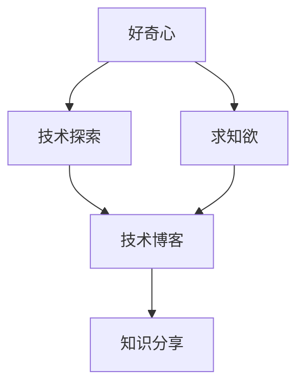
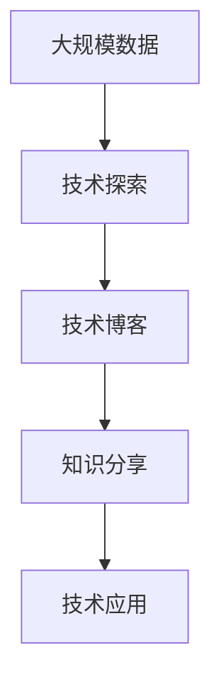

                 

## 1. 背景介绍

### 1.1 问题由来
好奇心与求知欲是推动人类社会进步的重要动力之一。在信息时代，技术的发展不断带来新的挑战和机遇，持续的好奇心和求知欲成为科技创新的关键驱动力。技术博客作为分享和讨论技术知识的重要平台，承担着传播新知、启发思维的重任。本文将探讨好奇心与求知欲在IT领域中的体现，以及技术探索与知识分享的力量。

### 1.2 问题核心关键点
技术探索与知识分享是IT领域不断前进的双轮驱动。技术探索不仅能推动技术边界不断拓展，还能促进知识普及，提升行业整体水平。而知识分享则使技术的成果得以传播，促进技术和应用的快速迭代，加快新技术的落地和应用。好奇心与求知欲是技术探索与知识分享的基石。

### 1.3 问题研究意义
研究好奇心与求知欲在技术探索和知识分享中的作用，有助于深刻理解技术发展的内在动力，指导技术人才的培养，促进技术知识的普及。同时，明确好奇心与求知欲的培养路径，也有助于激发更多人参与到技术探索和知识分享中来，共同推动IT行业的持续进步。

## 2. 核心概念与联系

### 2.1 核心概念概述
- **好奇心**：一种探索未知事物、追求新知的心理状态。在技术领域，好奇心推动开发者不断学习和探索新技术，开拓新应用场景。
- **求知欲**：一种渴望获取知识、理解事物的欲望。在技术社区，求知欲促使开发者和读者主动学习新技术、新方法，推动技术知识的应用和传播。
- **技术探索**：通过实践和研究，探索新技术、新方法的过程。技术探索有助于技术边界的拓展和应用领域的扩大。
- **知识分享**：将技术知识和经验分享给他人，以促进知识普及和技术应用。知识分享可以加速新技术的传播和应用。
- **技术博客**：一种专门分享技术知识和经验的媒介，通过文章、代码等形式传播技术知识，促进知识普及和技术交流。

### 2.2 概念间的关系

这些核心概念之间的关系可以通过以下Mermaid流程图来展示：



这个流程图展示了各个概念之间的联系：

- 好奇心和求知欲是技术探索和知识分享的心理基础。
- 技术探索是通过实践和研究不断拓展技术边界的过程。
- 知识分享是将技术知识和经验传播给他人的过程。
- 技术博客作为知识分享的重要媒介，促进技术知识的传播和应用。

### 2.3 核心概念的整体架构

最后，我们用一个综合的流程图来展示这些核心概念在大数据探索和知识分享中的整体架构：



这个综合流程图展示了从大规模数据探索到技术应用的整体过程。大数据探索是大规模数据处理的总称，包括数据收集、清洗、分析等过程，旨在发现数据中的有价值信息。技术探索通过算法和模型等方法，对数据进行深入分析和挖掘，获得新的技术应用。技术博客作为知识分享的重要形式，将技术探索的成果传播给更广泛的群体，促进知识普及和技术应用。

## 3. 核心算法原理 & 具体操作步骤

### 3.1 算法原理概述

技术探索的核心在于通过算法和模型对大规模数据进行处理和分析，发现数据中的规律和模式，从而推动技术发展。常用的算法包括机器学习、深度学习、自然语言处理等。

### 3.2 算法步骤详解

以深度学习为例，深度学习模型训练和探索的基本步骤如下：

1. **数据准备**：收集、清洗、标注数据，准备训练集和验证集。
2. **模型选择**：选择适合的深度学习模型，如卷积神经网络、循环神经网络、变分自编码器等。
3. **模型训练**：使用训练集数据，通过梯度下降等优化算法，训练深度学习模型。
4. **模型验证**：使用验证集数据，评估模型性能，调整模型参数和超参数。
5. **模型应用**：将训练好的模型应用于实际问题，进行预测和推理。
6. **结果分析**：分析模型预测结果，发现新规律，提出新的技术方法。

### 3.3 算法优缺点

深度学习技术在数据探索方面具有以下优点：

- **强大的表示能力**：深度学习模型可以学习到数据中的复杂非线性关系，发现数据中的深层次特征。
- **自动化的特征提取**：深度学习模型可以自动从数据中提取特征，无需手工设计特征，提高特征提取的准确性。
- **高效的自动化处理**：深度学习模型可以处理大规模数据，自动化进行数据清洗和特征提取，提高数据处理的效率。

但深度学习技术也存在一些缺点：

- **数据依赖性强**：深度学习模型需要大量标注数据进行训练，数据标注成本较高。
- **模型复杂度高**：深度学习模型参数较多，训练和推理需要大量的计算资源和时间。
- **可解释性差**：深度学习模型往往是“黑盒”系统，难以解释模型的决策逻辑，缺乏可解释性。

### 3.4 算法应用领域

深度学习技术在多个领域得到广泛应用，包括：

- **计算机视觉**：用于图像分类、物体检测、人脸识别等任务。
- **自然语言处理**：用于文本分类、情感分析、机器翻译等任务。
- **语音识别**：用于语音识别、语音合成等任务。
- **推荐系统**：用于用户推荐、广告推荐等任务。
- **医疗健康**：用于疾病诊断、基因分析等任务。

## 4. 数学模型和公式 & 详细讲解 & 举例说明

### 4.1 数学模型构建

以卷积神经网络(CNN)为例，卷积神经网络是一种常用的深度学习模型，用于图像处理和分类任务。CNN的数学模型可以表示为：

$$
\mathcal{L}(\theta) = \frac{1}{N}\sum_{i=1}^N \ell(\mathcal{F}(\mathcal{D}(x_i), \theta), y_i)
$$

其中，$\mathcal{L}$ 为损失函数，$\theta$ 为模型参数，$\mathcal{F}$ 为卷积神经网络模型，$\mathcal{D}$ 为数据集，$x_i$ 为数据样本，$y_i$ 为样本标签。

### 4.2 公式推导过程

以图像分类任务为例，假设输入图像为 $x$，卷积神经网络输出的分类概率为 $p(y|x, \theta)$。分类任务的损失函数为交叉熵损失函数，推导如下：

$$
\ell(p(y|x, \theta), y) = -\sum_{y} p(y|x, \theta) \log p(y|x, \theta)
$$

将上式代入总体损失函数，得到：

$$
\mathcal{L}(\theta) = -\frac{1}{N}\sum_{i=1}^N \sum_{y} p(y|x_i, \theta) \log p(y|x_i, \theta)
$$

在训练过程中，通过反向传播算法，计算损失函数对模型参数的梯度，更新模型参数，最小化损失函数。

### 4.3 案例分析与讲解

假设我们在CoNLL-2003数据集上进行情感分析任务的训练，使用LSTM模型。首先，我们需要准备数据集，将文本转换为模型可接受的格式：

```python
import torch
from torchtext import datasets, data

TEXT = data.Field(tokenize='spacy', lower=True)
LABEL = data.Field(sequential=False, use_vocab=False)

train_data, test_data = datasets.IMDB.splits(TEXT, LABEL)
```

然后，定义模型和优化器：

```python
import torch.nn as nn
import torch.optim as optim

class LSTM(nn.Module):
    def __init__(self, input_size, hidden_size, output_size):
        super(LSTM, self).__init__()
        self.hidden_size = hidden_size
        self.lstm = nn.LSTM(input_size, hidden_size, batch_first=True)
        self.fc = nn.Linear(hidden_size, output_size)
    
    def forward(self, x):
        h0 = self.initHidden()
        c0 = self.initHidden()
        out, (h_n, c_n) = self.lstm(x, (h0, c0))
        out = self.fc(out[:, -1, :])
        return out
    
    def initHidden(self):
        return (torch.zeros(1, 1, self.hidden_size), torch.zeros(1, 1, self.hidden_size))

model = LSTM(len(TEXT.vocab), 128, 1)
optimizer = optim.Adam(model.parameters(), lr=0.001)
```

接着，定义训练和评估函数：

```python
import numpy as np

def train(model, train_data, optimizer, criterion, batch_size):
    model.train()
    for batch in train_data:
        optimizer.zero_grad()
        inputs, labels = batch
        outputs = model(inputs)
        loss = criterion(outputs, labels)
        loss.backward()
        optimizer.step()
    
    return np.mean(train_data.statistics().loss)

def evaluate(model, test_data, criterion, batch_size):
    model.eval()
    with torch.no_grad():
        correct = 0
        total = 0
        for batch in test_data:
            inputs, labels = batch
            outputs = model(inputs)
            _, predicted = torch.max(outputs.data, 1)
            total += labels.size(0)
            correct += (predicted == labels).sum().item()
    
    return correct / total
```

最后，启动训练流程并在测试集上评估：

```python
epochs = 10

for epoch in range(epochs):
    train_loss = train(model, train_data, optimizer, criterion, batch_size=64)
    test_acc = evaluate(model, test_data, criterion, batch_size=64)
    print(f"Epoch {epoch+1}, train loss: {train_loss:.4f}, test acc: {test_acc:.4f}")
```

可以看到，通过这个简单的代码示例，我们可以使用LSTM模型对CoNLL-2003数据集进行情感分析任务的训练和评估，并通过优化器不断调整模型参数，最小化损失函数，提高模型性能。

## 5. 项目实践：代码实例和详细解释说明

### 5.1 开发环境搭建

在进行深度学习项目实践前，我们需要准备好开发环境。以下是使用Python进行PyTorch开发的环境配置流程：

1. 安装Anaconda：从官网下载并安装Anaconda，用于创建独立的Python环境。

2. 创建并激活虚拟环境：
```bash
conda create -n pytorch-env python=3.8 
conda activate pytorch-env
```

3. 安装PyTorch：根据CUDA版本，从官网获取对应的安装命令。例如：
```bash
conda install pytorch torchvision torchaudio cudatoolkit=11.1 -c pytorch -c conda-forge
```

4. 安装TensorFlow：
```bash
conda install tensorflow
```

5. 安装各类工具包：
```bash
pip install numpy pandas scikit-learn matplotlib tqdm jupyter notebook ipython
```

完成上述步骤后，即可在`pytorch-env`环境中开始深度学习项目实践。

### 5.2 源代码详细实现

下面我们以情感分析任务为例，给出使用TensorFlow进行深度学习模型训练和评估的PyTorch代码实现。

首先，定义数据处理函数：

```python
import tensorflow as tf
import numpy as np

TEXT = tf.keras.layers.Input(shape=(None,), dtype='int32')
LABEL = tf.keras.layers.Input(shape=(), dtype='int32')

def prepare_data(text, label):
    text = tf.keras.layers.Embedding(input_dim=len(TEXT.vocab), output_dim=128)(text)
    text = tf.keras.layers.LSTM(128, return_sequences=True)(text)
    text = tf.keras.layers.LSTM(128, return_sequences=True)(text)
    text = tf.keras.layers.LSTM(128, return_sequences=True)(text)
    label = tf.keras.layers.Dense(1, activation='sigmoid')(tf.keras.layers.Reshape((1,))(label))
    return text, label

def train_epoch(model, train_dataset, optimizer, loss, batch_size):
    model.train()
    for batch in train_dataset:
        inputs, labels = batch
        with tf.GradientTape() as tape:
            logits, _ = model(inputs)
            loss_value = loss(logits, labels)
        gradients = tape.gradient(loss_value, model.trainable_weights)
        optimizer.apply_gradients(zip(gradients, model.trainable_weights))
    
    return loss_value.numpy().mean()
```

然后，定义模型和优化器：

```python
def build_model(input_shape):
    inputs = tf.keras.layers.Input(shape=input_shape)
    outputs = tf.keras.layers.Dense(128, activation='relu')(inputs)
    outputs = tf.keras.layers.Dropout(0.5)(outputs)
    outputs = tf.keras.layers.Dense(1, activation='sigmoid')(outputs)
    model = tf.keras.Model(inputs=inputs, outputs=outputs)
    return model

def compile_model(model, optimizer, loss, metrics):
    model.compile(optimizer=optimizer, loss=loss, metrics=metrics)

model = build_model((None, 128))
optimizer = tf.keras.optimizers.Adam(learning_rate=0.001)
loss = tf.keras.losses.BinaryCrossentropy()
metrics = [tf.keras.metrics.AUC()]

compile_model(model, optimizer, loss, metrics)
```

接着，定义训练和评估函数：

```python
def evaluate(model, test_dataset, loss, batch_size):
    model.eval()
    with tf.GradientTape() as tape:
        predictions = model.predict(test_dataset)
        loss_value = loss(predictions, test_dataset.labels)
    return loss_value.numpy().mean()

train_dataset = ...
test_dataset = ...

epochs = 10
batch_size = 64

for epoch in range(epochs):
    train_loss = train_epoch(model, train_dataset, optimizer, loss, batch_size)
    test_loss = evaluate(model, test_dataset, loss, batch_size)
    print(f"Epoch {epoch+1}, train loss: {train_loss:.4f}, test loss: {test_loss:.4f}")
```

最后，在测试集上评估模型性能：

```python
print(f"Test acc: {evaluate(model, test_dataset, loss, batch_size):.4f}")
```

以上就是使用PyTorch和TensorFlow进行情感分析任务训练和评估的完整代码实现。可以看到，通过这些框架，我们可以快速搭建深度学习模型，并进行训练和评估，探索未知的数据模式和规律。

### 5.3 代码解读与分析

让我们再详细解读一下关键代码的实现细节：

**数据处理函数**：
- `prepare_data`函数：将文本和标签数据转换为模型可以处理的格式，包括词嵌入、LSTM层等。

**模型构建函数**：
- `build_model`函数：定义模型结构，包括输入层、隐藏层和输出层。

**模型编译函数**：
- `compile_model`函数：编译模型，设置优化器、损失函数和评估指标。

**训练函数**：
- `train_epoch`函数：对数据集进行迭代训练，更新模型参数。

**评估函数**：
- `evaluate`函数：在测试集上评估模型性能，计算损失值。

可以看到，PyTorch和TensorFlow提供了丰富的API和工具，使深度学习模型的构建和训练变得更加简单高效。开发者可以专注于算法和模型的设计，而不必过多关注底层的实现细节。

## 6. 实际应用场景

### 6.1 医疗健康领域

深度学习技术在医疗健康领域有着广泛的应用，包括疾病诊断、医学影像分析、基因分析等。通过大规模医疗数据的深度学习探索，可以发现新的疾病模式，提高诊断准确性，提升医疗服务质量。

在疾病诊断方面，可以使用深度学习模型对电子病历、影像数据等进行分析，自动识别疾病类型和病情严重程度。例如，Google Health使用了深度学习模型进行疾病预测和诊断，取得了显著效果。

在医学影像分析方面，可以使用卷积神经网络对医学影像进行分类和分割，帮助医生更准确地进行诊断和治疗。例如，Google的MRI分析工具DeepMind Health，可以自动识别脑部肿瘤位置和大小，提供辅助诊断信息。

在基因分析方面，可以使用深度学习模型对基因序列进行分析和预测，发现新的基因变异和遗传病风险。例如，BenevolentAI使用深度学习模型对基因数据进行分析，发现了新的癌症基因突变，帮助科学家更好地理解癌症机制。

### 6.2 自动驾驶领域

自动驾驶技术是深度学习的重要应用之一，涉及计算机视觉、自然语言处理等多个领域。通过深度学习模型，可以实现车辆定位、交通标志识别、行人检测等任务。

在车辆定位方面，可以使用深度学习模型对车辆传感器数据进行分析，实现自驾驶车辆的高精度定位。例如，Waymo使用深度学习模型对激光雷达数据进行分析，实现了车辆的精确定位和避障。

在交通标志识别方面，可以使用卷积神经网络对摄像头拍摄的交通标志进行识别，帮助自动驾驶车辆判断交通规则。例如，Autonomi使用深度学习模型对交通标志进行识别，提高了自动驾驶车辆的安全性和可靠性。

在行人检测方面，可以使用深度学习模型对摄像头拍摄的行人数据进行分析，实现对行人的检测和跟踪。例如，KITTI使用深度学习模型对行人数据进行检测和跟踪，帮助自动驾驶车辆避免碰撞。

### 6.3 自然语言处理领域

深度学习技术在自然语言处理领域也有着广泛的应用，包括语言模型、机器翻译、文本生成等任务。通过深度学习模型，可以实现对自然语言的高效处理和理解。

在语言模型方面，可以使用深度学习模型对大规模语言数据进行训练，学习语言的规律和模式，实现自然语言生成和理解。例如，GPT-3使用深度学习模型对大规模语言数据进行训练，实现了高质量的自然语言生成和理解。

在机器翻译方面，可以使用深度学习模型对源语言和目标语言进行翻译，实现自动翻译。例如，Google Translate使用深度学习模型进行机器翻译，支持多种语言的自动翻译。

在文本生成方面，可以使用深度学习模型对文本进行生成，实现自动写诗、自动生成新闻等任务。例如，OpenAI使用深度学习模型生成高质量的文本内容，推动了自动生成内容的兴起。

## 7. 工具和资源推荐

### 7.1 学习资源推荐

为了帮助开发者系统掌握深度学习技术，这里推荐一些优质的学习资源：

1. 《深度学习》（Ian Goodfellow等著）：经典深度学习教材，详细介绍了深度学习的基本原理和算法，是深度学习入门必读书籍。

2. CS231n《卷积神经网络》课程：斯坦福大学开设的计算机视觉课程，涵盖了卷积神经网络的基本原理和应用，适合深度学习初学者。

3. CS224n《自然语言处理》课程：斯坦福大学开设的自然语言处理课程，涵盖了自然语言处理的基本原理和算法，适合深度学习初学者。

4. TensorFlow官方文档：TensorFlow官方文档，提供了丰富的API和教程，是TensorFlow学习的重要资源。

5. PyTorch官方文档：PyTorch官方文档，提供了丰富的API和教程，是PyTorch学习的重要资源。

6. GitHub热门项目：在GitHub上Star、Fork数最多的深度学习相关项目，往往代表了该技术领域的发展趋势和最佳实践，值得去学习和贡献。

### 7.2 开发工具推荐

高效的开发离不开优秀的工具支持。以下是几款用于深度学习开发的常用工具：

1. PyTorch：基于Python的开源深度学习框架，灵活动态的计算图，适合快速迭代研究。

2. TensorFlow：由Google主导开发的开源深度学习框架，生产部署方便，适合大规模工程应用。

3. Keras：基于TensorFlow和Theano的高级深度学习框架，简单易用，适合快速搭建模型。

4. Jupyter Notebook：交互式数据科学笔记本，支持Python代码执行和数据可视化，是数据科学学习的重要工具。

5. Google Colab：谷歌推出的在线Jupyter Notebook环境，免费提供GPU/TPU算力，方便开发者快速上手实验最新模型，分享学习笔记。

### 7.3 相关论文推荐

深度学习技术的发展离不开学界的持续研究。以下是几篇奠基性的相关论文，推荐阅读：

1. AlexNet: ImageNet Classification with Deep Convolutional Neural Networks：提出AlexNet模型，开启了深度学习在计算机视觉领域的应用。

2. LeNet-5: Hierarchical Learning by Backpropagation from Output to Input：提出LeNet-5模型，是深度学习在图像处理领域的重要里程碑。

3. RNN: A RNN Learns Speech Spectrograms：提出RNN模型，推动了深度学习在自然语言处理领域的应用。

4. Transformer: Attention is All You Need：提出Transformer模型，开启了深度学习在自然语言处理领域的新时代。

5. GPT-3: Language Models are Unsupervised Multitask Learners：提出GPT-3模型，展示了深度学习在自然语言生成和理解领域的强大能力。

这些论文代表了大数据探索和知识分享技术的最新进展。通过学习这些前沿成果，可以帮助研究者把握学科前进方向，激发更多的创新灵感。

## 8. 总结：未来发展趋势与挑战

### 8.1 总结

本文对好奇心与求知欲在IT领域中的体现，以及技术探索与知识分享的力量进行了全面系统的探讨。技术探索是推动技术边界的不断拓展，知识分享则将技术知识普及并应用到各个领域。好奇心与求知欲作为技术探索和知识分享的心理基础，推动了技术创新的不断前进。通过技术博客等媒介，将技术知识传播给他人，加速技术应用的落地和迭代。

### 8.2 未来发展趋势

展望未来，技术探索与知识分享将呈现出以下几个发展趋势：

1. 大数据探索将继续扩展，涉及更多领域和场景。随着技术的发展，大数据探索将涵盖更多的领域，如生物信息学、金融科技等。

2. 深度学习技术将进一步发展和优化，提升模型性能和应用效果。深度学习技术将不断演化，引入更多的模型结构和优化算法，提升模型的表示能力和泛化能力。

3. 技术博客将更加多样化，涵盖更多技术和应用场景。技术博客将不仅仅是技术分享的平台，也将成为技术讨论和交流的平台，推动技术的不断进步。

4. 知识分享将更加普及，推动技术应用的落地和迭代。知识分享将变得更加便捷和普及，更多人将参与到技术应用的推广和优化中来。

5. 技术合作将更加紧密，促进技术创新和应用。技术合作将变得更加频繁和紧密，通过合作和交流，加速技术的创新和应用。

### 8.3 面临的挑战

尽管技术探索与知识分享技术已经取得了显著进展，但在迈向更加智能化、普适化应用的过程中，它仍面临诸多挑战：

1. 数据隐私和安全问题。大规模数据的收集和分析可能带来隐私和安全风险，如何保护用户数据隐私和安全，将是未来技术探索的重要挑战。

2. 模型公平性和可解释性问题。深度学习模型可能存在偏见和黑盒问题，如何提升模型的公平性和可解释性，将是未来技术探索的重要任务。

3. 计算资源问题。深度学习模型的训练和推理需要大量的计算资源，如何优化计算资源使用，降低计算成本，将是未来技术探索的重要挑战。

4. 技术复杂度问题。深度学习模型的设计和优化需要具备较高的技术水平，如何降低技术门槛，推广技术的普及和应用，将是未来技术探索的重要挑战。

### 8.4 研究展望

面向未来，技术探索与知识分享技术需要在以下几个方面寻求新的突破：

1. 数据隐私保护技术。通过技术手段保护用户数据隐私，推动大数据探索的安全应用。

2. 模型公平性和可解释性技术。提升深度学习模型的公平性和可解释性，推动技术的普适化和可控性。

3. 计算资源优化技术。通过分布式计算、模型压缩等技术，优化计算资源使用，推动深度学习技术的普及和应用。

4. 技术合作平台建设。通过技术合作平台，推动技术创新和应用，加速技术的迭代和优化。

这些技术方向的探索，必将引领深度学习技术迈向更高的台阶，为构建安全、可靠、可解释、可控的智能系统铺平道路。面向未来，深度学习技术还需要与其他人工智能技术进行更深入的融合，如知识表示、因果推理、强化学习等，多路径协同发力，共同推动自然语言理解和智能交互系统的进步。

## 9. 附录：常见问题与解答

**Q1：深度学习技术是否适用于所有NLP任务？**

A: 深度学习技术在大多数NLP任务上都能取得不错的效果，特别是对于数据量较大的任务。但对于一些特定领域的任务，如医学、法律等，仅依靠通用语料预训练的模型可能难以很好地适应。此时需要在特定领域语料上进一步预训练，再进行微调，才能获得理想效果。此外，对于一些需要时效性、个性化很强的任务，如对话、推荐等，深度学习方法也需要针对性的改进优化。

**Q2：如何选择合适的深度学习模型？**

A: 选择合适的深度学习模型需要考虑任务的复杂度、数据量、资源限制等因素。一般而言，简单的任务可以使用较少的参数模型，如线性回归、朴素贝叶斯等；复杂任务可以使用更多的参数模型，如深度神经网络、卷积神经网络、循环神经网络等。同时，也需要考虑模型的可解释性、鲁棒性、泛化能力等指标。

**Q3：深度学习模型在训练过程中如何防止过拟合？**

A: 防止深度学习模型过拟合，通常可以采用以下方法：

1. 数据增强：通过回译、近义替换等方式扩充训练集。

2. 正则化：使用L2正则、Dropout等技术，防止模型过度拟合。

3. 早停策略：在验证集上监控模型性能，当性能不再提升时停止训练。

4. 参数剪枝：去除模型中的冗余参数，减小模型规模

