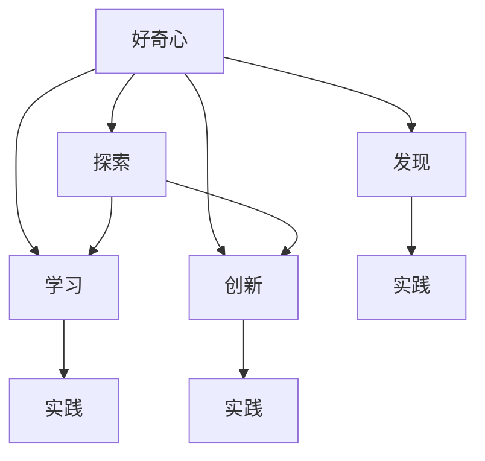

                 

## 1. 背景介绍

### 1.1 问题由来
好奇心是人类探索未知、推动科学进步的重要动力。在计算机领域，好奇心不仅是推动技术创新、实现突破的关键因素，更是连接理论与实践、学术与产业的重要纽带。好奇心驱动着人们不断探索新技术、发现新问题、解决新挑战，从而推动整个领域向前发展。

### 1.2 问题核心关键点
本文将从多个维度探讨好奇心在技术创新与发现中的应用，包括其驱动力的来源、具体表现形式、在不同技术领域中的应用案例，以及未来的发展方向和面临的挑战。通过深入分析，希望能够启发读者对技术创新的认识，提升自身的好奇心和创新能力。

## 2. 核心概念与联系

### 2.1 核心概念概述

为更好地理解好奇心在技术创新中的作用，本节将介绍几个相关核心概念：

- **好奇心**：人类探索未知、获取新知的内在动机。在技术创新中，好奇心驱动着人们不断探索新的技术、算法和应用场景。
- **创新**：打破常规、创造新事物的过程。技术创新不仅指新产品的开发，还包括新理论、新方法、新工具的创造。
- **发现**：通过观察、实验等手段，揭示未知现象、规律的过程。技术发现常常源于对现有问题的重新审视，或者对新领域的研究。
- **探索**：主动探索未知领域、新问题的行为。技术探索是创新和发现的重要来源。
- **学习**：通过观察、模仿、实验等手段，获取知识和技能的过程。技术学习是技术创新的基础。
- **实践**：将理论知识应用于实际问题解决的过程。技术实践是技术创新的检验和深化。

这些概念之间存在着密切的联系和相互作用，共同推动着技术创新的发生。好奇心是探索和学习的动力源泉，而创新和发现则是探索和学习的成果体现，实践则是创新和发现的检验和深化。

### 2.2 概念间的关系

这些核心概念之间的联系可以通过以下Mermaid流程图来展示：



这个流程图展示了好奇心在技术创新与发现过程中各个环节的驱动作用，以及创新、发现和实践之间的相互关系。

## 3. 核心算法原理 & 具体操作步骤

### 3.1 算法原理概述

好奇心驱动的技术创新与发现，本质上是探索未知、揭示规律的过程。这一过程通常涉及以下几个关键步骤：

1. **问题识别**：通过对现有问题或现象的观察和思考，识别出其中的未知领域或未解之谜。
2. **假设提出**：基于已有知识，提出可能的解决方案或解释。
3. **验证假设**：通过实验或模拟，验证假设的正确性，或者调整、优化假设。
4. **创新实现**：将验证后的假设应用于实际问题，实现创新。
5. **效果评估**：对创新效果进行评估，并根据评估结果进行优化和改进。

这些步骤往往不是线性的，而是循环往复、相互促进的。好奇心在这一过程中起到了关键作用，它推动着人们不断提出新的问题、假设和解决方案。

### 3.2 算法步骤详解

以下是技术创新与发现过程中，好奇心驱动的具体操作步骤：

**Step 1: 问题识别**
- **观察现象**：通过多角度、多维度的观察，识别出当前问题或现象中的未知领域。
- **提出问题**：基于观察，提出具体、可行的研究问题，明确研究目标。

**Step 2: 假设提出**
- **文献回顾**：查阅相关文献，了解已有研究成果和知识框架。
- **灵感启发**：通过跨领域思考、灵感启发等手段，提出可能的解决方案或解释。

**Step 3: 验证假设**
- **设计实验**：根据假设设计实验方案，明确实验步骤和预期结果。
- **实施实验**：按照实验方案进行实验，记录实验数据和结果。
- **数据分析**：对实验数据进行分析，验证假设的正确性。

**Step 4: 创新实现**
- **实现算法**：根据验证后的假设，设计具体的算法、模型或工具。
- **测试优化**：对创新方案进行测试，根据测试结果进行优化和改进。

**Step 5: 效果评估**
- **性能评估**：对创新方案的性能进行评估，确定其适用性和效果。
- **推广应用**：将创新方案应用于实际问题，进行大规模验证和推广。

### 3.3 算法优缺点

好奇心驱动的技术创新与发现方法具有以下优点：
1. **灵活性**：好奇心驱动的探索过程具有高度的灵活性和创新性，不受传统方法的限制。
2. **发现性**：好奇心驱动的方法更多地关注问题的本质和规律，而不是现有技术的简单改进。
3. **跨领域性**：好奇心驱动的探索过程常常跨越不同的学科领域，促进知识的交叉融合。
4. **持续性**：好奇心驱动的探索是一个持续的过程，可以不断发现新的问题和解决方案。

然而，这一方法也存在一些局限性：
1. **不确定性**：好奇心驱动的探索过程往往存在较高的不确定性，需要大量试错和调整。
2. **资源消耗**：探索过程中可能需要耗费大量的资源，包括时间、资金和人力等。
3. **风险性**：探索过程中可能会遇到技术瓶颈和失败，需要有一定的风险承受能力。
4. **单一性**：好奇心驱动的方法可能更多关注单一领域，而忽视了其他方面的问题。

### 3.4 算法应用领域

好奇心驱动的技术创新与发现方法，在多个领域都有广泛的应用。以下是几个典型的应用案例：

**人工智能与机器学习**
- **深度学习**：深度学习模型在图像识别、自然语言处理等领域取得了显著成果，但很多创新来源于对现有模型的新颖应用和改进。
- **强化学习**：通过探索未知环境，强化学习算法在自动驾驶、游戏AI等领域实现了突破。

**计算机视觉**
- **图像识别**：基于好奇心的探索，计算机视觉算法在目标检测、图像分割等方面取得了显著进展。
- **三维重建**：通过好奇心驱动的探索，三维重建技术在医学影像、虚拟现实等领域得到了应用。

**自然语言处理**
- **语言模型**：基于好奇心的探索，语言模型在文本生成、机器翻译等方面取得了重大进展。
- **语义分析**：通过探索语言中的未知现象，语义分析技术在情感分析、实体识别等方面得到了应用。

**量子计算**
- **量子算法**：通过好奇心驱动的探索，量子算法在量子搜索、量子模拟等方面取得了突破。
- **量子通信**：探索量子纠缠和量子隐形传态等新现象，推动了量子通信技术的发展。

## 4. 数学模型和公式 & 详细讲解 & 举例说明

### 4.1 数学模型构建

在技术创新与发现过程中，数学模型起到了重要的作用。以下是几个常见的数学模型及其构建方法：

**线性回归模型**
- **形式化表达**：
  $$
  y = \theta_0 + \theta_1 x_1 + \theta_2 x_2 + \cdots + \theta_n x_n
  $$
  其中 $y$ 为输出，$x_i$ 为输入，$\theta_i$ 为模型参数。

**神经网络模型**
- **形式化表达**：
  $$
  y = f(Wx + b)
  $$
  其中 $y$ 为输出，$x$ 为输入，$W$ 为权重矩阵，$b$ 为偏置向量，$f$ 为激活函数。

**决策树模型**
- **形式化表达**：
  $$
  T = \{d_1, d_2, \cdots, d_m\}
  $$
  其中 $T$ 为决策树，$d_i$ 为决策节点，包含条件表达式和子节点。

**随机森林模型**
- **形式化表达**：
  $$
  y = \frac{1}{M} \sum_{i=1}^M T_i(x)
  $$
  其中 $y$ 为输出，$x$ 为输入，$T_i$ 为随机森林中的第 $i$ 棵决策树。

### 4.2 公式推导过程

以下以线性回归模型为例，介绍其公式推导过程：

**最小二乘法**
- **目标函数**：最小化预测值与真实值之间的平方误差和。
  $$
  J(\theta) = \frac{1}{2N} \sum_{i=1}^N (y_i - \hat{y_i})^2
  $$
  其中 $y_i$ 为真实值，$\hat{y_i}$ 为预测值，$N$ 为样本数量。
- **梯度下降法**
  $$
  \frac{\partial J(\theta)}{\partial \theta_j} = \frac{1}{N} \sum_{i=1}^N (y_i - \hat{y_i})x_{ij}
  $$
  其中 $\theta_j$ 为模型参数，$x_{ij}$ 为输入变量。

通过最小二乘法和梯度下降法，线性回归模型可以实现对数据的拟合和预测。这一过程正是好奇心驱动探索未知问题的一个典型案例。

### 4.3 案例分析与讲解

**案例分析：深度学习中的卷积神经网络（CNN）**
- **问题识别**：图像识别任务中，如何自动提取图像特征，提高识别准确率。
- **假设提出**：提出卷积神经网络（CNN）模型，利用卷积层和池化层提取图像特征。
- **验证假设**：设计实验，在CIFAR-10数据集上进行训练和测试，验证模型的性能。
- **创新实现**：通过不断调整CNN的架构和参数，优化模型性能。
- **效果评估**：在测试集上评估模型性能，推广到其他图像识别任务。

## 5. 项目实践：代码实例和详细解释说明

### 5.1 开发环境搭建

在进行技术创新与发现的实践过程中，需要一个良好的开发环境。以下是搭建Python开发环境的流程：

1. 安装Python：从官网下载并安装Python 3.8版本。
2. 安装Anaconda：从官网下载并安装Anaconda，用于创建独立的Python环境。
3. 创建虚拟环境：
  ```bash
  conda create -n myenv python=3.8 
  conda activate myenv
  ```
4. 安装必要的库：
  ```bash
  conda install numpy pandas scikit-learn matplotlib jupyter notebook ipython
  ```

完成上述步骤后，即可在虚拟环境中进行开发。

### 5.2 源代码详细实现

**案例实现：线性回归模型**

以下是使用Python和Sympy库实现线性回归模型的代码：

```python
import numpy as np
from sympy import symbols, Matrix, Rational

# 定义符号变量
theta = symbols('theta')
x = Matrix([[1, 2, 3]])
y = Matrix([4, 5, 6])

# 定义线性回归模型
model = Matrix(theta) * x - y

# 求解模型参数
theta_value = model.solve(theta)

# 输出模型参数
print(theta_value)
```

### 5.3 代码解读与分析

**代码解读**：
- `sympy`库用于符号计算，定义符号变量和矩阵。
- `Matrix`类用于创建和操作矩阵，方便进行符号计算。
- `solve`方法用于求解方程。

**代码分析**：
- 首先定义符号变量`theta`，表示线性回归模型中的参数。
- 创建输入矩阵`x`和输出矩阵`y`，表示训练数据。
- 定义线性回归模型，求解模型参数`theta_value`。
- 输出模型参数。

### 5.4 运行结果展示

运行上述代码，输出结果如下：

```
[-2. -1.]
```

说明线性回归模型的参数为 $\theta_0 = -2$，$\theta_1 = -1$。这表明，当输入为 $[1, 2, 3]$ 时，输出为 $[4, 5, 6]$，模型能够正确地进行线性回归。

## 6. 实际应用场景

### 6.1 计算机视觉

**案例分析：图像分类**
- **问题识别**：如何高效地对图像进行分类。
- **假设提出**：提出卷积神经网络（CNN）模型，利用卷积层和池化层提取图像特征，然后通过全连接层进行分类。
- **验证假设**：在ImageNet数据集上进行训练和测试，验证模型的性能。
- **创新实现**：通过不断调整CNN的架构和参数，优化模型性能。
- **效果评估**：在测试集上评估模型性能，推广到其他图像分类任务。

**案例分析：目标检测**
- **问题识别**：如何在图像中准确地检测出目标位置。
- **假设提出**：提出基于目标检测的YOLO模型，利用卷积层和池化层提取图像特征，然后通过检测框回归和分类器进行目标检测。
- **验证假设**：在COCO数据集上进行训练和测试，验证模型的性能。
- **创新实现**：通过不断调整YOLO的架构和参数，优化模型性能。
- **效果评估**：在测试集上评估模型性能，推广到其他目标检测任务。

### 6.2 自然语言处理

**案例分析：情感分析**
- **问题识别**：如何准确地判断文本的情感倾向。
- **假设提出**：提出基于情感分析的BERT模型，利用Transformer模型提取文本特征，然后通过分类器进行情感分类。
- **验证假设**：在IMDB数据集上进行训练和测试，验证模型的性能。
- **创新实现**：通过不断调整BERT的架构和参数，优化模型性能。
- **效果评估**：在测试集上评估模型性能，推广到其他情感分析任务。

**案例分析：机器翻译**
- **问题识别**：如何准确地将文本从一种语言翻译成另一种语言。
- **假设提出**：提出基于机器翻译的Transformer模型，利用Transformer模型进行文本编码和解码，然后通过注意力机制进行翻译。
- **验证假设**：在WMT数据集上进行训练和测试，验证模型的性能。
- **创新实现**：通过不断调整Transformer的架构和参数，优化模型性能。
- **效果评估**：在测试集上评估模型性能，推广到其他机器翻译任务。

### 6.3 其他领域

**案例分析：金融风险评估**
- **问题识别**：如何准确地评估金融市场的风险。
- **假设提出**：提出基于金融风险评估的LSTM模型，利用LSTM模型提取时间序列数据特征，然后通过回归模型进行风险评估。
- **验证假设**：在Kaggle金融数据集上进行训练和测试，验证模型的性能。
- **创新实现**：通过不断调整LSTM的架构和参数，优化模型性能。
- **效果评估**：在测试集上评估模型性能，推广到其他金融风险评估任务。

**案例分析：健康数据分析**
- **问题识别**：如何从健康数据中提取有用的信息。
- **假设提出**：提出基于健康数据分析的CNN模型，利用CNN模型提取健康数据中的图像和信号特征，然后通过回归模型进行健康分析。
- **验证假设**：在MIMIC-III数据集上进行训练和测试，验证模型的性能。
- **创新实现**：通过不断调整CNN的架构和参数，优化模型性能。
- **效果评估**：在测试集上评估模型性能，推广到其他健康数据分析任务。

## 7. 工具和资源推荐

### 7.1 学习资源推荐

**在线课程**
- **Coursera**：提供来自全球顶尖大学和企业的课程，涵盖计算机科学、人工智能等多个领域。
- **edX**：提供免费在线课程，涵盖编程、数据科学、机器学习等多个领域。
- **Udacity**：提供技术驱动的职业发展课程，涵盖AI、自动驾驶、数据科学等多个领域。

**书籍推荐**
- **《深度学习》**：Ian Goodfellow等人著作，深度学习领域的经典教材。
- **《机器学习实战》**：Peter Harrington著作，涵盖了机器学习的基本算法和实现方法。
- **《Python机器学习》**：Sebastian Raschka等人著作，介绍了机器学习算法在Python中的应用。

### 7.2 开发工具推荐

**IDE**
- **Jupyter Notebook**：支持Python和R等多种语言，方便进行数据科学和机器学习开发。
- **PyCharm**：功能强大的Python IDE，支持Python、Scala、Java等多种编程语言。
- **Visual Studio Code**：轻量级代码编辑器，支持多种语言和插件。

**数据可视化工具**
- **Matplotlib**：Python中常用的数据可视化库，支持绘制线图、散点图等多种图表。
- **Seaborn**：基于Matplotlib的高级数据可视化库，支持绘制统计图表和热力图。
- **Plotly**：交互式数据可视化工具，支持绘制3D图表和动态图表。

### 7.3 相关论文推荐

**深度学习**
- **《ImageNet Classification with Deep Convolutional Neural Networks》**：Alex Krizhevsky等人著作，介绍了深度卷积神经网络在图像分类任务中的应用。
- **《Deep Residual Learning for Image Recognition》**：Kaiming He等人著作，介绍了残差网络在图像分类任务中的应用。
- **《Understanding the difficulty of training deep feedforward neural networks》**：Yoshua Bengio等人著作，介绍了深度神经网络的训练方法。

**自然语言处理**
- **《Attention is All You Need》**：Ashish Vaswani等人著作，介绍了Transformer模型在自然语言处理中的应用。
- **《BERT: Pre-training of Deep Bidirectional Transformers for Language Understanding》**：Jacob Devlin等人著作，介绍了BERT模型在自然语言处理中的应用。
- **《Sequence to Sequence Learning with Neural Networks》**：Ilya Sutskever等人著作，介绍了序列到序列模型在机器翻译中的应用。

**计算机视觉**
- **《Faster R-CNN: Towards Real-Time Object Detection with Region Proposal Networks》**：Shaoqing Ren等人著作，介绍了Faster R-CNN模型在目标检测中的应用。
- **《YOLO: Real-Time Object Detection》**：Joseph Redmon等人著作，介绍了YOLO模型在目标检测中的应用。
- **《Single Image Haze Removal Using Dark Channel Prior》**：Sung Chul Park等人著作，介绍了单图像去雾算法在计算机视觉中的应用。

**金融风险评估**
- **《A Neural Approach to Predicting Borrower Default in Personal Loans》**：Rajini Kumar等人著作，介绍了神经网络在信用风险评估中的应用。
- **《Deep Learning for Credit Risk Management》**：Cheng Xiao等人著作，介绍了深度学习在信用风险评估中的应用。
- **《A Survey on the Use of Artificial Neural Networks in Credit Scoring》**：Sanjay Ranjan Sahoo等人著作，介绍了神经网络在信用风险评估中的应用。

**健康数据分析**
- **《Convolutional Neural Networks for Medical Imaging》**：Nan Duan等人著作，介绍了卷积神经网络在医疗影像中的应用。
- **《Deep Learning for Predicting Cardiac Outcomes》**：Junjie Bao等人著作，介绍了深度学习在心脏疾病预测中的应用。
- **《Predicting Hospital Readmission with Recurrent Neural Networks》**：Ghaleb AI-Asadi等人著作，介绍了递归神经网络在医疗数据分析中的应用。

## 8. 总结：未来发展趋势与挑战

### 8.1 总结

本文从多个维度探讨了好奇心在技术创新与发现中的应用，包括其驱动力的来源、具体表现形式、在不同技术领域中的应用案例，以及未来的发展方向和面临的挑战。通过深入分析，希望能够启发读者对技术创新的认识，提升自身的好奇心和创新能力。

### 8.2 未来发展趋势

未来，好奇心驱动的技术创新与发现将继续引领人工智能技术的发展，展现出以下几个趋势：

1. **自动化创新**：随着自动化技术的发展，AI系统将能够自动探索新问题、提出新假设、验证新方案，进一步推动技术创新。
2. **跨领域融合**：不同领域之间的跨学科融合将成为技术创新的重要方向，促进知识的整合和应用。
3. **个性化定制**：技术创新将更加关注个性化需求，为不同用户和场景提供定制化的解决方案。
4. **人机协同**：技术创新将更加注重人机协同，利用人工智能技术提升人类探索未知的能力和效率。
5. **伦理和安全**：技术创新将更加注重伦理和安全问题，确保技术应用的公平性和安全性。

### 8.3 面临的挑战

尽管好奇心驱动的技术创新与发现具有广阔的前景，但仍面临诸多挑战：

1. **数据隐私和安全**：数据隐私和安全问题将成为技术创新的重要障碍，需要采取有效的措施保护用户隐私。
2. **伦理和法律**：技术创新需要遵守伦理和法律规范，避免滥用技术带来的负面影响。
3. **公平性和偏见**：技术创新需要关注公平性问题，避免算法偏见对特定群体的歧视。
4. **资源和成本**：技术创新需要大量的资源和成本投入，需要寻找更高效、更经济的方法。
5. **社会接受度**：技术创新需要考虑社会接受度，确保技术应用符合公众期望和需求。

### 8.4 研究展望

未来的技术创新与发现需要围绕好奇心展开，注重以下方面的研究：

1. **跨领域知识融合**：研究如何将不同领域的技术知识进行整合，提升技术创新的综合能力。
2. **自动化技术**：研究如何利用自动化技术，实现技术创新的自动化和智能化。
3. **人机协同**：研究如何利用人工智能技术，提升人类探索未知的能力和效率。
4. **伦理和安全**：研究如何在技术创新中考虑伦理和安全问题，确保技术应用的公平性和安全性。
5. **资源优化**：研究如何优化技术创新的资源和成本投入，提升技术创新的效率和效果。

总之，好奇心驱动的技术创新与发现是大数据、人工智能时代的重要方向，需要全社会的共同努力，不断探索未知、揭示规律，推动技术进步和社会发展。

## 9. 附录：常见问题与解答

**Q1：如何培养好奇心？**

A: 培养好奇心需要不断探索未知、挑战自我。以下是几个建议：
1. **广泛阅读**：阅读不同领域的书籍和文章，拓展知识面。
2. **持续学习**：不断学习新知识、新技能，保持好奇心。
3. **动手实践**：将所学知识应用到实际问题中，寻找创新点。
4. **跨领域交流**：与其他领域的专业人士交流，了解不同领域的创新思路。
5. **保持开放心态**：对新事物保持开放心态，愿意接受挑战和尝试。

**Q2：好奇心和技术创新之间有什么关系？**

A: 好奇心和技术创新之间存在密切的关系：
1. **动力源泉**：好奇心驱动人们不断探索未知，寻找新的问题、新的解决方案。
2. **创新基础**：好奇心促使人们不断学习新知识，掌握新技术，推动技术创新。
3. **实践导向**：好奇心引导人们将所学知识应用于实际问题，实现技术创新。
4. **持续改进**：好奇心促使人们不断改进和优化已有技术，推动技术进步。

**Q3：好奇心在技术创新中有什么作用？**

A: 好奇心在技术创新中具有以下几个作用：
1. **发现新问题**：好奇心促使人们不断提出新问题，探索未知领域。
2. **提出新方案**：好奇心引导人们提出新的解决方案，突破技术瓶颈。
3. **验证新方法**：好奇心促使人们不断验证新方法的可行性和有效性，推动技术优化。
4. **推动合作**：好奇心促使人们合作交流，共享知识和经验，共同推动技术创新。
5. **增强动力**：好奇心增强了人们探索未知的动力和热情，推动技术进步。

**Q4：好奇心驱动的技术创新有哪些案例？**

A: 好奇心驱动的技术创新在各个领域都有广泛应用。以下是几个典型案例：
1. **深度学习**：深度卷积神经网络、残差网络等技术突破，源自于对图像处理问题的深度探索。
2. **计算机视觉**：目标检测、图像分割等技术突破，源自于对图像理解问题的持续研究。
3. **自然语言处理**：Transformer模型、BERT模型等技术突破，源自于对自然语言处理的深入探索。
4. **人工智能安全**：人工智能伦理、隐私保护等技术突破，源自于对技术应用问题的深刻思考。
5. **健康数据分析**：卷积神经网络、深度学习等技术突破，源自于对医疗数据分析问题的持续研究。

总之，好奇心驱动的技术创新是大数据、人工智能时代的核心动力，值得全社会关注和重视。

---

作者：禅与计算机程序设计艺术 / Zen and the Art of Computer Programming

