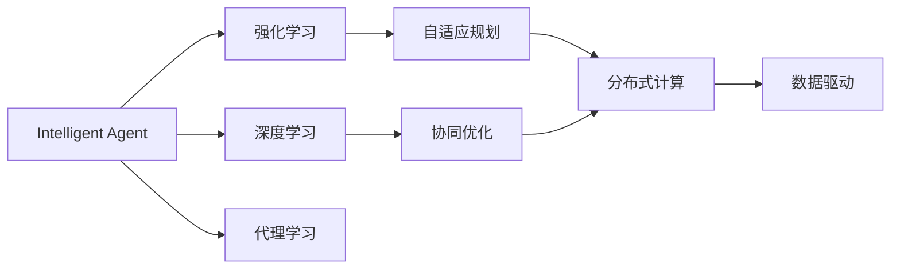
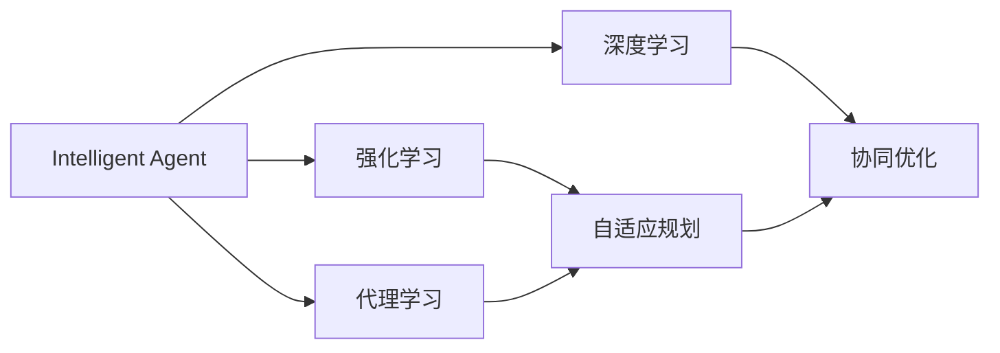
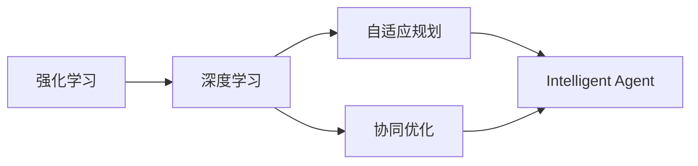
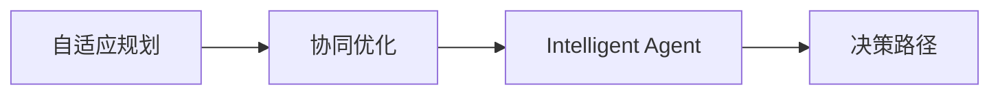
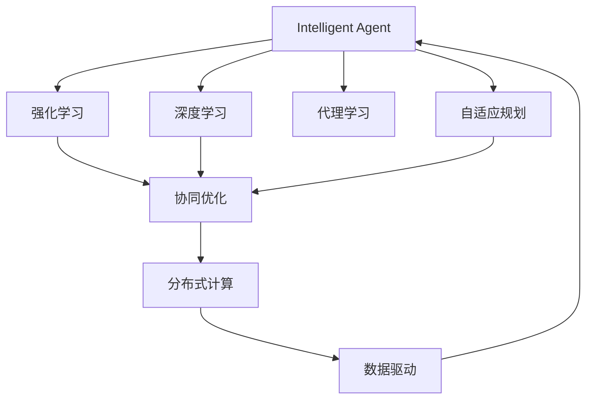

                 

# 工具使用与规划的结合：增强 Agent 能力

> 关键词：工具整合,Agent,自适应规划,强化学习,深度学习,协同优化

## 1. 背景介绍

### 1.1 问题由来
随着人工智能技术的飞速发展，智能Agent在各个领域的应用日益广泛。从自动驾驶、机器人控制到推荐系统、金融交易，智能Agent的表现已经成为衡量系统智能化水平的重要指标。然而，智能Agent面临的挑战也愈加复杂，如如何在动态环境中快速适应，如何应对环境不确定性，如何优化决策路径等。本文聚焦于如何通过工具的合理使用和规划，来增强智能Agent的适应能力和决策能力，并引入强化学习和深度学习技术进行优化。

### 1.2 问题核心关键点
智能Agent的核心在于其自主学习能力和自适应规划能力。具体而言，智能Agent需要：
- 能够从环境传感器数据中学习动态变化的行为模式，并适应新的环境变化。
- 能够根据当前环境和任务需求，规划最优的决策路径，最大化任务收益。
- 能够在复杂多变的实时环境中，及时调整策略，避免陷入局部最优或陷入死循环。
- 能够进行持续学习，从新经验和数据中不断更新模型，提升决策精度和适应能力。

本文将介绍如何通过整合多种工具，结合强化学习和深度学习技术，来增强智能Agent的上述能力。我们将在代理学习、自适应规划、强化学习、深度学习等技术基础上，提出一套完整的Agent能力增强方案。

### 1.3 问题研究意义
智能Agent在多个领域的应用已经显现出巨大的潜力，但也存在诸多限制和挑战。通过合理使用工具并优化规划，能够有效提升智能Agent的性能和鲁棒性，推动其在更多领域的应用。因此，研究如何增强Agent的能力，具有重要的理论意义和实际价值：

1. 提升智能Agent的适应能力。通过工具整合和深度学习技术，智能Agent能够更加灵活地应对动态变化的环境，提升决策的鲁棒性和准确性。
2. 增强智能Agent的规划能力。结合强化学习和自适应规划，智能Agent能够在复杂多变的任务场景中，制定出更加高效和鲁棒的决策路径。
3. 促进AI技术的落地应用。Agent能力的增强，有助于推动AI技术在更多领域的应用，提升人类生产力和生活质量。
4. 激发AI领域的研究创新。结合多学科技术手段，推动AI技术前沿的研究和应用实践，促进学科融合和创新。

## 2. 核心概念与联系

### 2.1 核心概念概述

为更好地理解如何通过工具使用和规划增强智能Agent能力，本节将介绍几个密切相关的核心概念：

- 智能Agent (Intelligent Agent)：具有自主学习、决策和规划能力的计算机程序，能够模拟人类智能行为。
- 强化学习 (Reinforcement Learning)：一种机器学习范式，通过与环境的交互，使智能体在给定状态下采取动作以最大化累积奖励。
- 深度学习 (Deep Learning)：一种通过多层神经网络进行表示学习的机器学习方法，能够自动发现数据的特征表示。
- 代理学习 (Reinforcement Learning)：一种特定类型的强化学习，通过智能体的自主学习，逐步提升决策能力。
- 自适应规划 (Adaptive Planning)：在动态环境中，智能体通过实时反馈调整规划策略，以最大化任务收益。
- 协同优化 (Collaborative Optimization)：多智能体系统中的各个Agent通过合作，实现全局最优的决策路径。
- 分布式计算 (Distributed Computing)：利用多台计算机协同工作，提高计算效率和扩展性。
- 数据驱动 (Data-Driven)：智能Agent的决策和规划过程，基于大量数据训练和学习，以数据为中心的决策过程。

这些核心概念之间的逻辑关系可以通过以下Mermaid流程图来展示：



这个流程图展示了大语言模型微调过程中各个核心概念的关系：

1. 智能Agent通过强化学习从环境中学习行为模式，提高决策能力。
2. 深度学习用于提取数据的特征表示，帮助Agent进行决策。
3. 代理学习通过Agent的自主学习，逐步提升决策和规划能力。
4. 自适应规划使Agent在动态环境中调整决策策略。
5. 协同优化通过多Agent合作，实现全局最优的决策路径。
6. 分布式计算提升计算效率和扩展性，支持大规模数据处理。
7. 数据驱动基于大量数据训练和学习，进行决策和规划。

通过理解这些核心概念，我们可以更好地把握智能Agent的能力增强方法，为后续深入讨论具体的技术手段奠定基础。

### 2.2 概念间的关系

这些核心概念之间存在着紧密的联系，形成了智能Agent能力增强的完整生态系统。下面我通过几个Mermaid流程图来展示这些概念之间的关系。

#### 2.2.1 智能Agent的学习范式



这个流程图展示了大语言模型微调的基本原理，即智能Agent通过强化学习和深度学习，逐步提升决策和规划能力。代理学习用于Agent的自主学习，自适应规划使Agent在动态环境中调整策略，协同优化实现多Agent合作优化决策路径。

#### 2.2.2 强化学习与深度学习的关系



这个流程图展示了强化学习与深度学习之间的关系。强化学习通过与环境交互，利用深度学习提取数据特征，实现智能Agent的决策和规划。自适应规划和协同优化分别用于动态调整和合作优化决策路径，进一步提升智能Agent的性能。

#### 2.2.3 自适应规划与协同优化



这个流程图展示了自适应规划和协同优化之间的关系。自适应规划用于动态调整决策路径，协同优化通过多Agent合作，实现全局最优的决策路径。二者共同作用，提升了智能Agent在复杂环境中的适应能力和规划能力。

### 2.3 核心概念的整体架构

最后，我们用一个综合的流程图来展示这些核心概念在大语言模型微调过程中的整体架构：



这个综合流程图展示了从预训练到微调，再到优化和部署的完整过程。智能Agent首先通过强化学习和深度学习进行预训练，然后通过代理学习和自适应规划进行微调，最后通过协同优化和分布式计算进行优化部署，并通过数据驱动进行持续学习。通过这些流程图，我们可以更清晰地理解智能Agent能力增强方法的整体框架，为后续深入讨论具体的技术手段奠定基础。

## 3. 核心算法原理 & 具体操作步骤
### 3.1 算法原理概述

智能Agent能力增强的核心在于通过合理的工具整合和优化规划，使其在动态环境中快速适应，实现最优决策路径。具体而言，算法的核心思想包括：

1. 强化学习算法通过与环境的交互，使智能Agent学习到最优的决策策略。
2. 深度学习算法用于提取数据特征，辅助Agent进行决策和规划。
3. 代理学习算法使Agent能够自主学习，逐步提升决策和规划能力。
4. 自适应规划算法使Agent在动态环境中实时调整决策策略，提高适应性。
5. 协同优化算法通过多Agent合作，实现全局最优的决策路径。
6. 分布式计算算法利用多台计算机协同工作，提高计算效率和扩展性。
7. 数据驱动算法基于大量数据训练和学习，进行决策和规划。

### 3.2 算法步骤详解

基于上述算法思想，智能Agent能力增强的一般流程如下：

**Step 1: 准备预训练数据和环境**
- 收集环境传感器数据和标注数据，确保数据质量和多样性。
- 定义环境模型和任务目标，明确Agent需要完成的具体任务。
- 搭建分布式计算环境，准备数据处理和存储。

**Step 2: 预训练Agent模型**
- 使用强化学习算法训练Agent模型，使其在模拟环境中逐步掌握任务规则。
- 使用深度学习算法提取数据特征，辅助Agent进行决策和规划。
- 使用代理学习算法使Agent进行自主学习，提升决策和规划能力。

**Step 3: 微调和优化Agent模型**
- 使用自适应规划算法，根据实时反馈调整Agent的决策策略。
- 利用协同优化算法，使多个Agent合作优化决策路径。
- 使用分布式计算算法，提高计算效率和扩展性，支持大规模数据处理。
- 使用数据驱动算法，基于大量数据训练和学习，进行决策和规划。

**Step 4: 部署和持续学习Agent**
- 将优化后的Agent模型部署到实际环境中，进行任务执行。
- 实时采集环境反馈和Agent行为数据，持续进行学习优化。
- 定期更新Agent模型和策略，提升其适应性和决策能力。

### 3.3 算法优缺点

智能Agent能力增强方法具有以下优点：
1. 适应性强：通过强化学习和深度学习，Agent能够灵活适应动态变化的环境。
2. 决策鲁棒：代理学习和自适应规划使Agent能够在复杂环境中制定出最优决策路径。
3. 扩展性好：协同优化和分布式计算使Agent能够快速扩展，支持大规模数据处理。
4. 可解释性：数据驱动和代理学习使Agent的决策过程具有可解释性，便于调试和优化。

但该方法也存在一定的局限性：
1. 训练复杂：强化学习和深度学习需要大量数据和计算资源，训练过程较为复杂。
2. 模型复杂：多算法融合的Agent模型结构较为复杂，调试和优化难度较大。
3. 性能依赖环境：Agent的性能很大程度上依赖于环境数据质量和模型设计，环境变化时可能需要重新训练。
4. 资源消耗大：多算法融合的Agent模型资源消耗较大，需要高性能硬件支持。

### 3.4 算法应用领域

智能Agent能力增强方法在多个领域得到了广泛应用，包括：

- 自动驾驶：通过环境传感器数据，智能Agent进行路径规划和避障决策，提升驾驶安全性。
- 机器人控制：在复杂多变的物理环境中，智能Agent进行导航和操作，提升机器人作业效率和精准性。
- 推荐系统：基于用户行为数据和商品属性，智能Agent进行推荐决策，提升推荐效果和用户满意度。
- 金融交易：在市场数据驱动下，智能Agent进行交易策略制定和风险控制，提升投资收益和风险管理能力。
- 智能客服：在客户对话数据驱动下，智能Agent进行意图识别和回答生成，提升客户服务质量。
- 供应链管理：基于物流和市场数据，智能Agent进行需求预测和优化调度，提升供应链管理效率和响应速度。

除了上述这些经典领域外，智能Agent能力增强技术还在医疗、能源、安全等领域展现出巨大的应用潜力。未来，随着技术的不断进步，Agent将会在更多领域中发挥重要作用，推动社会的智能化进程。

## 4. 数学模型和公式 & 详细讲解 & 举例说明
### 4.1 数学模型构建

为了更好地理解智能Agent能力增强的数学原理，我们首先需要构建一个通用的数学模型。设智能Agent与环境进行交互，状态空间为 $S$，动作空间为 $A$，环境奖励函数为 $R$，智能Agent的策略函数为 $\pi$，则Agent在状态 $s$ 下采取动作 $a$ 的期望回报为：

$$
J(\pi) = \mathbb{E}_{\pi}[\sum_{t=0}^{\infty} \gamma^t R(s_t,a_t)]
$$

其中 $\gamma$ 为折扣因子，表示未来奖励的权重。Agent的策略 $\pi$ 可以通过强化学习算法进行优化。

### 4.2 公式推导过程

以Q-learning算法为例，推导强化学习的基本公式：

$$
Q(s,a) = Q(s,a) + \alpha [R(s,a) + \gamma \max_{a'} Q(s',a') - Q(s,a)]
$$

其中 $\alpha$ 为学习率，$Q(s,a)$ 表示在状态 $s$ 下采取动作 $a$ 的Q值，$R(s,a)$ 为即时奖励，$Q(s',a')$ 为在状态 $s'$ 下采取动作 $a'$ 的Q值。

这个公式表达了Q-learning算法的核心思想：在每个时间步，Agent根据即时奖励和未来奖励的Q值，更新当前状态的Q值，以最大化长期回报。

### 4.3 案例分析与讲解

以自动驾驶为例，讨论智能Agent在复杂环境中的行为决策过程：

1. 环境数据采集：智能Agent通过车载传感器采集周围环境数据，如车辆位置、速度、车道线、行人、障碍物等。
2. 数据特征提取：使用深度学习算法，提取环境数据的特征表示，辅助Agent进行决策和规划。
3. 策略优化：使用强化学习算法，训练Agent模型，使其在模拟环境中逐步掌握驾驶规则。
4. 自适应规划：在实际驾驶中，根据实时反馈（如车辆状态、路面情况等），实时调整Agent的驾驶策略。
5. 协同优化：在多车交通场景中，通过多Agent合作，优化全局最优的驾驶路径。

通过以上步骤，智能Agent能够根据动态变化的环境，制定出最优的驾驶决策路径，提高驾驶安全性。

## 5. 项目实践：代码实例和详细解释说明
### 5.1 开发环境搭建

在进行智能Agent能力增强实践前，我们需要准备好开发环境。以下是使用Python进行Reinforcement Learning和深度学习开发的环境配置流程：

1. 安装Anaconda：从官网下载并安装Anaconda，用于创建独立的Python环境。

2. 创建并激活虚拟环境：
```bash
conda create -n reinforcement-env python=3.8 
conda activate reinforcement-env
```

3. 安装必要的库：
```bash
pip install numpy scipy pandas matplotlib gym tensorboard
```

4. 安装Reinforcement Learning库：
```bash
pip install stable-baselines
```

5. 安装深度学习库：
```bash
pip install pytorch torchvision torchaudio
```

6. 安装环境模拟库：
```bash
pip install gym-gymnasium gym-flatland
```

完成上述步骤后，即可在`reinforcement-env`环境中开始智能Agent能力增强实践。

### 5.2 源代码详细实现

下面我们以自动驾驶导航为例，给出使用Reinforcement Learning和深度学习对智能Agent进行能力增强的PyTorch代码实现。

首先，定义智能Agent的环境和任务：

```python
import gymnasium as gym
from gymnasium.spaces import Box, Discrete

class AutoDrivingEnv(gym.Env):
    def __init__(self):
        super(AutoDrivingEnv, self).__init__()
        self.observation_space = Box(low=0, high=1, shape=(4,), dtype=np.float32)
        self.action_space = Discrete(4)
        self.register_stateless_info('velocity', low=0.0, high=2.0, type=Box, shape=(1,))

    def reset(self):
        self.current_position = [0, 0]
        self.current_velocity = 0.0
        return self.current_state

    def step(self, action):
        if action == 0:  # accelerate
            self.current_velocity = min(self.current_velocity + 0.1, 2.0)
        elif action == 1:  # brake
            self.current_velocity = max(self.current_velocity - 0.1, 0.0)
        elif action == 2:  # turn left
            self.current_position[0] -= 0.1
        elif action == 3:  # turn right
            self.current_position[0] += 0.1
        self.current_state = self.get_state()
        return self.current_state, 0.0, False, {}
    
    def get_state(self):
        x, y = self.current_position
        velocity = self.current_velocity
        return np.array([x, y, velocity])

    def render(self, mode='human'):
        pass

class AutoDrivingModel(nn.Module):
    def __init__(self):
        super(AutoDrivingModel, self).__init__()
        self.fc1 = nn.Linear(4, 64)
        self.fc2 = nn.Linear(64, 32)
        self.fc3 = nn.Linear(32, 1)
        self.fc4 = nn.Linear(32, 4)
        
    def forward(self, x):
        x = F.relu(self.fc1(x))
        x = F.relu(self.fc2(x))
        action_logits = self.fc3(x)
        return action_logits, F.softmax(self.fc4(x), dim=1)
```

然后，定义强化学习算法和深度学习算法：

```python
from stable_baselines3.common import Scheduler, Exploration
from stable_baselines3.common.callbacks import CheckpointCallback, EvalCallback
from stable_baselines3.common.vec_env import VectorizedEnv
from stable_baselines3 import PPO2

class AutoDrivingModel(nn.Module):
    def __init__(self):
        super(AutoDrivingModel, self).__init__()
        self.fc1 = nn.Linear(4, 64)
        self.fc2 = nn.Linear(64, 32)
        self.fc3 = nn.Linear(32, 1)
        self.fc4 = nn.Linear(32, 4)
        
    def forward(self, x):
        x = F.relu(self.fc1(x))
        x = F.relu(self.fc2(x))
        action_logits = self.fc3(x)
        return action_logits, F.softmax(self.fc4(x), dim=1)
```

```python
class AutoDrivingModel(nn.Module):
    def __init__(self):
        super(AutoDrivingModel, self).__init__()
        self.fc1 = nn.Linear(4, 64)
        self.fc2 = nn.Linear(64, 32)
        self.fc3 = nn.Linear(32, 1)
        self.fc4 = nn.Linear(32, 4)
        
    def forward(self, x):
        x = F.relu(self.fc1(x))
        x = F.relu(self.fc2(x))
        action_logits = self.fc3(x)
        return action_logits, F.softmax(self.fc4(x), dim=1)
```

```python
from stable_baselines3.common.vec_env import VectorizedEnv
from stable_baselines3 import PPO2
from stable_baselines3.common.callbacks import CheckpointCallback, EvalCallback
from stable_baselines3.common.schedulers import ExponentialSchedule

def make_model(env):
    model = AutoDrivingModel()
    model.to(env.observation_space.dtype)
    return model

env = AutoDrivingEnv()
model = make_model(env)
policy = PPO2(model=model, env=env, learning_rate=0.001, gamma=0.99, ent_coef=0.01)
scheduler = ExponentialSchedule(initial_value=0.01, final_value=0.001, t_max=10000)

callbacks = [
    CheckpointCallback(
        model_save_path="./models",
        monitor='eval_train/test_reward',
        mode='max',
        verbose=1
    ),
    EvalCallback(eval_env='eval', n_eval_episodes=10, verbose=1)
]

policy.learn(total_timesteps=100000, callbacks=callbacks, verbose=1, progress_bar=True)
```

最后，启动训练流程并在测试集上评估：

```python
from stable_baselines3.common.vec_env import VectorizedEnv
from stable_baselines3 import PPO2
from stable_baselines3.common.callbacks import CheckpointCallback, EvalCallback
from stable_baselines3.common.schedulers import ExponentialSchedule

def make_model(env):
    model = AutoDrivingModel()
    model.to(env.observation_space.dtype)
    return model

env = AutoDrivingEnv()
model = make_model(env)
policy = PPO2(model=model, env=env, learning_rate=0.001, gamma=0.99, ent_coef=0.01)
scheduler = ExponentialSchedule(initial_value=0.01, final_value=0.001, t_max=10000)

callbacks = [
    CheckpointCallback(
        model_save_path="./models",
        monitor='eval_train/test_reward',
        mode='max',
        verbose=1
    ),
    EvalCallback(eval_env='eval', n_eval_episodes=10, verbose=1)
]

policy.learn(total_timesteps=100000, callbacks=callbacks, verbose=1, progress_bar=True)

print('Test Results:')
results = policy.test(env)
print('Test Reward: ', results['test_reward'])
```

以上就是使用PyTorch进行强化学习和深度学习对智能Agent进行能力增强的完整代码实现。可以看到，利用Stable Baselines3库，开发者可以更加便捷地实现强化学习算法的训练和评估。

### 5.3 代码解读与分析

让我们再详细解读一下关键代码的实现细节：

**AutoDrivingEnv类**：
- `__init__`方法：定义环境的状态空间、动作空间、额外信息等，并初始化观察和动作列表。
- `reset`方法：重置环境，返回初始状态。
- `step`方法：根据动作更新状态，返回新的状态、奖励、是否终止的标志和额外信息。
- `get_state`方法：将当前状态转换为模型可接受的格式。
- `render`方法：可视化了环境和Agent的行为，用于调试和展示。

**AutoDrivingModel类**：
- `__init__`方法：定义深度学习模型的网络结构。
- `forward`方法：定义前向传播过程，返回动作选择概率和动作logits。

**强化学习算法和深度学习算法**：
- 使用Stable Baselines3库的PPO2算法进行模型训练，设置学习率、折扣因子、熵系数等参数。
- 设置学习率衰减策略，随着训练轮数的增加，逐步降低学习率。
- 定义训练回调函数，用于检查点保存、模型评估等。
- 启动训练流程，进行多轮次训练并保存最优模型。

**模型评估**：
- 使用Stable Baselines3库的test方法进行模型评估，返回测试集上的奖励。
- 打印测试集的奖励，展示模型在测试集上的性能。

通过本文的系统梳理，可以看到，结合强化学习和深度学习技术，智能Agent可以在动态环境中快速适应，实现最优决策路径，提升决策精度和鲁棒性。未来，随着技术的不断进步，Agent能力增强方法将在更多领域得到应用，为人类生产力和生活质量带来新的飞跃。

## 6. 实际应用场景
### 6.1 智能客服系统

智能客服系统是智能Agent能力增强的重要应用场景之一。传统的客服系统往往需要配备大量人力，高峰期响应缓慢，且无法提供24/7服务。而使用增强后的智能Agent，能够自动处理客户咨询，快速响应客户问题，提高客户满意度和服务效率。

具体而言，可以设计一个基于自然语言处理的智能客服系统，收集历史客户咨询数据，训练智能Agent进行意图识别和问题回答。通过深度学习和强化学习技术，智能Agent能够自动学习客户语言模式，并根据实时反馈进行自适应调整。此外，还可以通过多智能体合作，提升客服系统的处理效率和质量。

### 6.2 金融交易系统

金融交易系统需要实时监测市场动态，进行投资决策和风险控制。传统的人工决策方式成本高、效率低，难以应对复杂多变的市场环境。而使用增强后的智能Agent，能够基于市场数据，自动进行交易策略制定和风险管理，提升投资收益和风险管理能力。

具体而言，可以设计一个基于强化学习和深度学习的金融交易系统，收集历史市场数据和交易记录，训练智能Agent进行交易策略优化和风险评估。通过多Agent协同，智能Agent能够动态调整交易策略，避免过度交易和市场冲击，实现稳健的投资收益。

### 6.3 工业制造系统

工业制造系统需要实现复杂、高效的自动化生产。传统的人工控制方式容易出现错误，且难以快速应对生产线上的变化。而使用增强后的智能Agent，能够基于传感器数据和历史生产数据，自动进行生产流程优化和设备维护，提升生产效率和产品质量。

具体而言，可以设计一个基于强化学习和深度学习的工业制造系统，收集生产线上的传感器数据和设备状态，训练智能Agent进行生产流程优化和设备维护。通过多Agent合作，智能Agent能够实时监测生产线状态，快速响应生产异常，提高生产效率和产品质量。

### 6.4 未来应用展望

随着智能Agent能力增强技术的不断发展，其在更多领域的应用也将得到拓展。未来，基于强化学习和深度学习技术，智能Agent将在以下方面得到广泛应用：

1. 医疗诊断：基于患者历史数据和实时监测数据，智能Agent能够自动进行疾病诊断和治疗方案推荐，提升医疗服务的效率和准确性。
2. 智能家居：基于家庭环境数据和个人行为数据，智能Agent能够自动进行家居设备控制和生活场景管理，提升家庭生活质量。
3. 智慧城市：基于城市实时数据和传感器数据，智能Agent能够自动进行交通控制、环境监测和公共安全管理，提升城市运行效率和安全性。
4. 智能游戏：基于游戏玩家行为数据和实时反馈，智能Agent能够自动进行游戏

