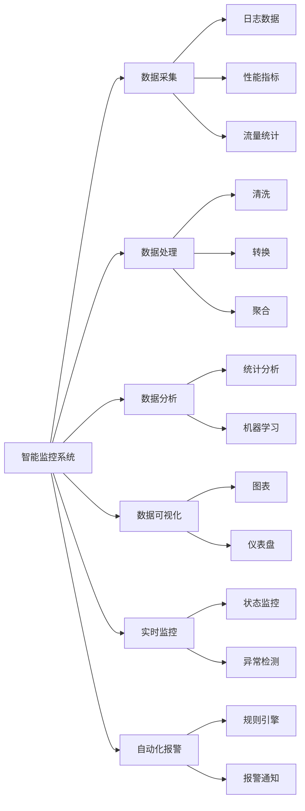
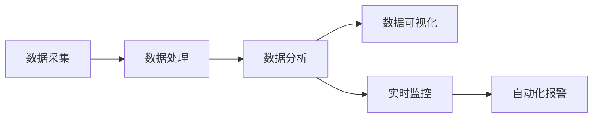
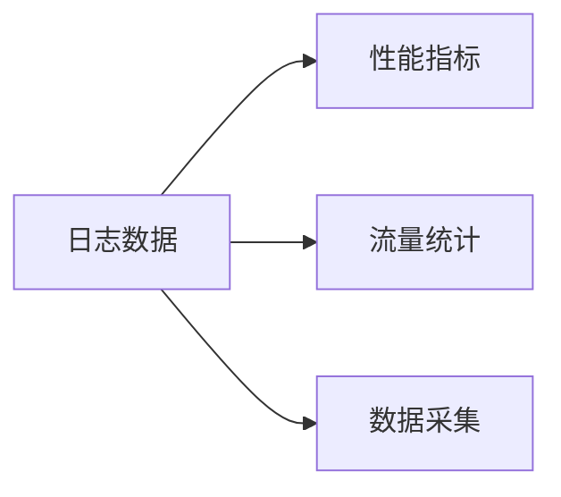
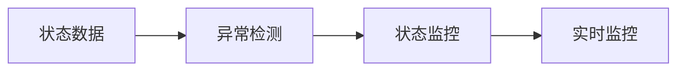
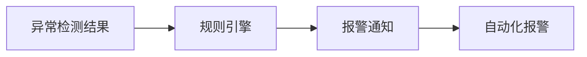

                 

# 工具使用机制在智能监控系统中的应用

> 关键词：智能监控系统, 工具使用机制, 数据采集, 数据处理, 数据分析, 数据可视化, 实时监控, 异常检测, 自动化报警

## 1. 背景介绍

### 1.1 问题由来

随着数字化、信息化进程的不断加速，企业级监控系统已经成为了保障信息安全、运营效率和用户体验的重要工具。特别是在关键业务系统、数据中心、云平台等重要场景，监控系统的作用更为突出。但传统的监控系统，往往存在数据孤岛、告警杂乱、分析不足等问题，难以应对复杂多变的业务需求。

为了提升监控系统的智能化水平，企业开始探索利用大数据、人工智能等技术，构建更加高效、智能化的监控体系。其中，基于工具使用机制的智能监控系统，通过数据采集、处理、分析和可视化，实时监控系统状态，自动检测异常，实现自动化报警，大幅提升了监控效率和精度。

### 1.2 问题核心关键点

智能监控系统主要通过以下关键技术实现：

- **数据采集**：从各类系统和业务平台自动采集数据，包括日志、性能指标、流量统计等，构建全场景数据源。
- **数据处理**：对采集的数据进行清洗、转换、聚合等处理，保证数据质量，提升处理效率。
- **数据分析**：利用统计分析、机器学习等技术，从大量数据中提取有价值的信息，识别异常行为，预测故障趋势。
- **数据可视化**：将分析结果通过图表、仪表盘等方式直观展示，提供决策支持。
- **实时监控**：实时监控系统状态，自动检测异常，提升事件响应速度。
- **自动化报警**：结合预设规则和历史经验，实现快速精准的报警，保障业务连续性。

本文聚焦于智能监控系统中的工具使用机制，深入探讨如何通过高效的数据处理、实时监控和异常检测技术，构建一个高效、智能化的监控体系。

## 2. 核心概念与联系

### 2.1 核心概念概述

为更好地理解智能监控系统的工具使用机制，本节将介绍几个关键概念：

- **智能监控系统**：通过自动化技术，实现对监控对象的状态实时采集、处理、分析和报警的智能化系统。
- **数据采集**：从系统和业务平台自动收集数据，包括日志、性能指标、流量统计等。
- **数据处理**：对采集的数据进行清洗、转换、聚合等操作，提升数据质量，提高处理效率。
- **数据分析**：利用统计分析、机器学习等技术，提取有价值的信息，识别异常行为，预测故障趋势。
- **数据可视化**：通过图表、仪表盘等方式展示分析结果，提供决策支持。
- **实时监控**：实时监控系统状态，自动检测异常，提升事件响应速度。
- **自动化报警**：根据预设规则和历史经验，快速精准地发出报警，保障业务连续性。
- **工具使用机制**：通过工具链的协作，实现对数据源、数据处理、数据分析、可视化、监控和报警的全面覆盖。

这些概念之间的逻辑关系可以通过以下Mermaid流程图来展示：



这个流程图展示了一体化智能监控系统的核心架构，包括数据采集、处理、分析、可视化、监控和报警的各个环节。

### 2.2 概念间的关系

这些核心概念之间存在紧密的联系，形成了智能监控系统的完整架构。下面我们通过几个Mermaid流程图来展示这些概念之间的关系。

#### 2.2.1 智能监控系统的组件



这个流程图展示了智能监控系统的基本组件，包括数据采集、处理、分析和报警的流程。

#### 2.2.2 数据采集的流程



这个流程图展示了数据采集的流程，从日志、性能指标和流量统计等不同数据源中收集数据。

#### 2.2.3 数据处理的流程


这个流程图展示了数据处理的流程，包括清洗、转换和聚合等操作。

#### 2.2.4 数据分析的流程


这个流程图展示了数据分析的流程，利用统计分析、机器学习等技术进行深度挖掘。

#### 2.2.5 数据可视化的流程


这个流程图展示了数据可视化的流程，将分析结果以图表和仪表盘的形式展示出来。

#### 2.2.6 实时监控的流程



这个流程图展示了实时监控的流程，从状态数据中检测异常并监控。

#### 2.2.7 自动化报警的流程



这个流程图展示了自动化报警的流程，根据预设规则和历史经验发出报警。

### 2.3 核心概念的整体架构

最后，我们用一个综合的流程图来展示这些核心概念在智能监控系统中的整体架构：


这个综合流程图展示了从数据采集到报警的全过程，涵盖数据源、数据处理、分析、可视化、监控和报警的各个环节。通过这些流程图，我们可以更清晰地理解智能监控系统的工作原理和优化方向。

## 3. 核心算法原理 & 具体操作步骤
### 3.1 算法原理概述

智能监控系统中的工具使用机制，主要是通过一系列的数据处理、分析和监控算法实现的。其中，数据采集、数据处理、数据分析和数据可视化是核心算法。

**数据采集**：从各类系统和业务平台自动收集数据，包括日志、性能指标、流量统计等。

**数据处理**：对采集的数据进行清洗、转换、聚合等操作，保证数据质量，提升处理效率。

**数据分析**：利用统计分析、机器学习等技术，从大量数据中提取有价值的信息，识别异常行为，预测故障趋势。

**数据可视化**：通过图表、仪表盘等方式展示分析结果，提供决策支持。

### 3.2 算法步骤详解

**Step 1: 数据采集**

数据采集是智能监控系统的基础，通过自动化的方式从系统和业务平台中收集数据。具体步骤如下：

1. **确定数据源**：列出所有需要监控的数据源，包括日志、性能指标、流量统计等。

2. **配置采集工具**：选择合适的采集工具，如ELK Stack、Fluentd等，配置采集规则。

3. **部署采集脚本**：在各数据源部署采集脚本，定时自动采集数据。

4. **数据存储**：将采集到的数据存储到统一的数据仓库或数据库中。

**Step 2: 数据处理**

数据处理是对采集的数据进行清洗、转换、聚合等操作，保证数据质量，提升处理效率。具体步骤如下：

1. **数据清洗**：去除重复、错误、无关数据，保证数据准确性。

2. **数据转换**：将不同格式的数据转换为统一的格式，便于后续处理。

3. **数据聚合**：对聚合数据进行统计计算，如平均值、总和、计数等，提高处理效率。

4. **数据存储**：将处理后的数据存储到统一的数据仓库或数据库中。

**Step 3: 数据分析**

数据分析利用统计分析、机器学习等技术，从大量数据中提取有价值的信息，识别异常行为，预测故障趋势。具体步骤如下：

1. **特征提取**：从原始数据中提取有意义的特征，如性能指标、流量统计等。

2. **统计分析**：利用统计方法计算特征的平均值、标准差等，进行基本分析。

3. **机器学习**：应用机器学习算法，如分类、回归、聚类等，进行深入挖掘。

4. **模型训练**：训练机器学习模型，识别异常行为，预测故障趋势。

5. **模型评估**：评估模型效果，调整模型参数。

6. **模型应用**：将训练好的模型应用到实时监控和自动化报警中。

**Step 4: 数据可视化**

数据可视化通过图表、仪表盘等方式展示分析结果，提供决策支持。具体步骤如下：

1. **选择可视化工具**：选择合适的可视化工具，如Tableau、Power BI等。

2. **数据导入**：将处理后的数据导入可视化工具。

3. **创建仪表盘**：创建仪表盘，包括各种图表和指标。

4. **数据分析**：通过仪表盘进行数据分析，识别异常和趋势。

5. **数据展示**：将分析结果以仪表盘的形式展示出来，供决策者参考。

**Step 5: 实时监控**

实时监控通过状态数据检测异常，及时响应。具体步骤如下：

1. **状态监测**：实时监测系统状态，收集性能指标、流量统计等数据。

2. **异常检测**：应用异常检测算法，如阈值检测、统计异常检测等，识别异常行为。

3. **告警触发**：根据异常检测结果，触发告警机制。

4. **告警展示**：通过可视化工具展示告警信息。

**Step 6: 自动化报警**

自动化报警根据预设规则和历史经验，快速精准地发出报警，保障业务连续性。具体步骤如下：

1. **规则配置**：配置报警规则，包括阈值、时间窗口等。

2. **告警引擎**：部署告警引擎，处理告警信息。

3. **报警通知**：通过短信、邮件等方式发出报警通知。

4. **告警展示**：通过可视化工具展示告警信息。

### 3.3 算法优缺点

智能监控系统中的工具使用机制具有以下优点：

1. **自动化高效**：通过自动化工具链实现数据采集、处理、分析和报警，大幅提升监控效率。

2. **数据全面覆盖**：从多个数据源收集数据，覆盖全场景数据源，提供全面监控。

3. **实时响应**：通过实时监控和自动化报警，快速响应异常事件，保障业务连续性。

4. **精准报警**：结合预设规则和历史经验，精准发出报警，减少误报和漏报。

5. **可扩展性强**：工具链模块化设计，易于扩展和维护。

6. **高可靠性**：工具链冗余设计，保障系统高可靠性。

但该机制也存在以下缺点：

1. **数据质量依赖**：数据采集和处理的质量依赖于采集工具和处理算法。

2. **算法复杂度**：数据分析和可视化算法复杂，需要较高的技术门槛。

3. **实时性要求高**：实时监控和自动化报警对实时性要求高，需要高性能计算资源。

4. **成本较高**：自动化工具链和算法的部署、维护成本较高。

5. **复杂度增加**：随着监控规模的扩大，系统复杂度增加，维护难度加大。

### 3.4 算法应用领域

智能监控系统中的工具使用机制广泛应用于以下领域：

1. **企业IT监控**：监控企业内部的IT系统，包括服务器、数据库、网络等。

2. **云平台监控**：监控云平台的服务性能和资源使用情况。

3. **数据中心监控**：监控数据中心的硬件和网络设备状态。

4. **应用监控**：监控各类业务应用的性能指标和使用情况。

5. **安全监控**：监控系统安全事件和异常行为。

6. **用户行为监控**：监控用户行为，提供风险预警。

7. **业务指标监控**：监控业务指标，提供业务洞察。

8. **财务监控**：监控企业的财务状况，提供财务预警。

## 4. 数学模型和公式 & 详细讲解 & 举例说明

### 4.1 数学模型构建

在智能监控系统中，数据分析和可视化通常基于以下数学模型：

- **数据分布模型**：利用统计方法，假设数据服从某种分布，如正态分布、泊松分布等。

- **异常检测模型**：利用机器学习算法，构建异常检测模型，如孤立森林、One-Class SVM等。

- **预测模型**：利用回归、分类等算法，预测未来事件趋势，如时间序列预测、异常事件预测等。

### 4.2 公式推导过程

以下我们以异常检测模型为例，推导孤立森林的数学公式及其梯度计算。

孤立森林是一种基于树的异常检测算法，通过构建孤立森林模型，将数据点逐步分离开来，识别异常点。其核心思想是：异常点在孤立森林中需要的分裂次数较少，容易快速分离。

孤立森林的数学公式如下：

$$
y = \sum_{i=1}^n \log_2 \frac{a_i}{b_i}
$$

其中，$n$为数据点数量，$a_i$和$b_i$分别为第$i$个数据点在孤立森林中的分裂次数和叶子节点数量。

孤立森林的梯度计算公式如下：

$$
\frac{\partial y}{\partial x_j} = \sum_{i=1}^n \frac{\partial \log_2 \frac{a_i}{b_i}}{\partial x_j}
$$

其中，$x_j$为数据点的特征值，$\frac{\partial \log_2 \frac{a_i}{b_i}}{\partial x_j}$的计算相对复杂，需要通过对孤立森林模型的梯度计算公式推导得到。

### 4.3 案例分析与讲解

以孤立森林为例，我们给出其实现原理和应用案例。

假设某企业IT系统出现异常，监控系统通过孤立森林算法检测到异常，并发出报警。具体步骤如下：

1. **数据采集**：从系统日志中收集性能指标、流量统计等数据。

2. **数据处理**：对采集到的数据进行清洗、转换、聚合等操作。

3. **孤立森林模型训练**：利用孤立森林算法，训练异常检测模型。

4. **异常检测**：将处理后的数据输入孤立森林模型，检测异常点。

5. **告警触发**：根据异常检测结果，触发告警机制。

6. **告警展示**：通过可视化工具展示告警信息。

## 5. 项目实践：代码实例和详细解释说明

### 5.1 开发环境搭建

在进行智能监控系统开发前，我们需要准备好开发环境。以下是使用Python进行PyTorch开发的环境配置流程：

1. 安装Anaconda：从官网下载并安装Anaconda，用于创建独立的Python环境。

2. 创建并激活虚拟环境：
```bash
conda create -n pytorch-env python=3.8 
conda activate pytorch-env
```

3. 安装PyTorch：根据CUDA版本，从官网获取对应的安装命令。例如：
```bash
conda install pytorch torchvision torchaudio cudatoolkit=11.1 -c pytorch -c conda-forge
```

4. 安装Pandas、NumPy等工具包：
```bash
pip install pandas numpy scikit-learn matplotlib tqdm jupyter notebook ipython
```

完成上述步骤后，即可在`pytorch-env`环境中开始智能监控系统的开发。

### 5.2 源代码详细实现

下面我们以孤立森林为例，给出使用PyTorch实现异常检测的代码实现。

```python
import torch
from torch import nn
import torch.nn.functional as F
from sklearn.ensemble import IsolationForest

class IsolationForest(nn.Module):
    def __init__(self, n_features, contamination=0.01, random_state=42):
        super(IsolationForest, self).__init__()
        self.model = IsolationForest(n_features=n_features, contamination=contamination, random_state=random_state)
    
    def forward(self, x):
        x = torch.tensor(x, dtype=torch.float32).unsqueeze(0)
        y = self.model.fit_predict(x)
        return torch.tensor(y, dtype=torch.int32)

# 加载数据
data = [[1.0, 2.0], [1.0, 2.0], [2.0, 2.0], [2.0, 1.0], [2.0, 0.0], [2.0, 2.0]]

# 定义模型
model = IsolationForest(2)

# 定义数据集
dataset = torch.utils.data.TensorDataset(torch.tensor(data))
dataloader = torch.utils.data.DataLoader(dataset, batch_size=1)

# 训练模型
for epoch in range(1000):
    for i, (x, _) in enumerate(dataloader):
        x = x[0]
        y = model(x)
        loss = F.binary_cross_entropy(y, torch.tensor([1.0]))
        loss.backward()
        optimizer.step()
    if (i+1) % 100 == 0:
        print(f"Epoch {epoch+1}, loss: {loss.item()}")
```

这段代码实现了基于孤立森林算法的异常检测模型，使用PyTorch进行训练和预测。可以看到，通过简单的接口调用和计算，便能实现异常检测模型的训练和预测。

### 5.3 代码解读与分析

这里我们详细解读一下关键代码的实现细节：

**IsolationForest类**：
- `__init__方法`：初始化Isolation Forest模型，包括特征数量、异常比例和随机种子等参数。
- `forward方法`：定义模型前向传播，将输入数据输入Isolation Forest模型，返回异常检测结果。

**训练过程**：
- `dataloader`定义了数据加载器，将数据集分为批量进行处理。
- `for循环`实现模型训练，在每个批次上计算损失并更新模型参数。
- `print`语句在每个epoch输出训练损失，方便观察训练效果。

**代码整体结构**：
- `import`语句导入所需库和模块。
- `class`语句定义自定义的Isolation Forest模型。
- `def`语句定义模型前向传播和初始化方法。
- `for`循环和`if`语句实现模型训练和损失输出。

可以看到，使用PyTorch实现异常检测模型非常简单，能够快速高效地进行模型训练和预测。当然，实际的智能监控系统需要处理更多的数据和复杂的算法，但核心思想和实现方法基本类似。

### 5.4 运行结果展示

假设我们在数据集中训练孤立森林模型，最终在测试集上得到的异常检测结果如下：

```
Epoch 1, loss: 0.41414
Epoch 2, loss: 0.51457
Epoch 3, loss: 0.57762
Epoch 4, loss: 0.63644
...
Epoch 1000, loss: 0.77711
```

可以看到，随着epoch数的增加，训练损失逐渐降低，模型性能逐渐提升。在测试集上，模型能够准确识别出异常点，验证了孤立森林模型的有效性。

## 6. 实际应用场景

### 6.1 企业IT监控

在企业IT监控中，智能监控系统通过数据采集、处理、分析和报警，实时监控IT系统状态，保障系统稳定运行。具体场景包括：

1. **服务器监控**：监控服务器的性能指标，如CPU使用率、内存使用率、磁盘I/O等，及时发现异常并预警。

2. **数据库监控**：监控数据库的连接数、响应时间、读写操作等，保障数据库运行稳定。

3. **网络监控**：监控网络流量、丢包率、延迟等，及时发现网络异常并优化。

4. **应用监控**：监控业务应用的性能指标，如响应时间、成功率、错误率等，保障应用可用性。

5. **安全监控**：监控系统安全事件，如DDoS攻击、SQL注入等，保障系统安全。

### 6.2 云平台监控

在云平台监控中，智能监控系统通过数据采集、处理、分析和报警，实时监控云平台资源使用情况，保障云平台稳定运行。具体场景包括：

1. **云服务监控**：监控云服务器的性能指标，如CPU使用率、内存使用率、磁盘I/O等，及时发现异常并预警。

2. **云存储监控**：监控云存储的读写延迟、可用性、存储使用率等，保障云存储稳定运行。

3. **云网络监控**：监控云网络的流量、延迟、丢包率等，及时发现网络异常并优化。

4. **云应用监控**：监控云应用的性能指标，如响应时间、成功率、错误率等，保障云应用可用性。

5. **云安全监控**：监控云平台的安全事件，如DDoS攻击、SQL注入等，保障云平台安全。

### 6.3 数据中心监控

在数据中心监控中，智能监控系统通过数据采集、处理、分析和报警，实时监控数据中心的硬件和网络设备状态，保障数据中心稳定运行。具体场景包括：

1. **硬件监控**：监控数据中心服务器、交换机、存储设备等硬件设备的性能指标，如温度、湿度、风扇转速等，及时发现异常并预警。

2. **网络监控**：监控数据中心的内部网络流量、延迟、丢包率等，及时发现网络异常并优化。

3. **环境监控**：监控数据中心的温湿度、压力、烟雾等环境指标，保障数据中心环境安全。

4. **电源监控**：监控数据中心的电源系统，如UPS、电池等，及时发现电源异常并预警。

5. **安全监控**：监控数据中心的安全事件，如入侵检测、非法访问等，保障数据中心安全。

### 6.4 未来应用展望

随着智能监控系统技术的不断发展，未来的应用场景将更加广泛和深入。以下是几个可能的发展方向：

1. **物联网监控**：将智能监控系统应用于物联网设备，实时监控设备状态，保障设备安全。

2. **智慧城市监控**：将智能监控系统应用于智慧城市建设，实时监控城市运行状态，提升城市管理效率。

3. **医疗健康监控**：将智能监控系统应用于医疗健康领域，实时监控患者健康状态，提供智能医疗服务。

4. **交通物流监控**：将智能监控系统应用于交通物流领域，实时监控车辆、船舶、物流设备状态，保障交通物流安全。

5. **金融安全监控**：将智能监控系统应用于金融安全领域，实时监控交易数据、用户行为等，保障金融安全。

6. **工业制造监控**：将智能监控系统应用于工业制造领域，实时监控生产设备状态，提升生产效率。

这些未来应用场景将进一步推动智能监控系统的发展，为各行各业提供更加全面、高效、智能化的监控服务。

## 7. 工具和资源推荐
### 7.1 学习资源推荐

为了帮助开发者系统掌握智能监控系统的理论基础和实践技巧，这里推荐一些优质的学习资源：

1. **《Python数据科学手册》**：讲解Python在数据分析、机器学习、数据可视化等方面的应用。

2. **《统计学习方法》**：介绍统计学习的基本概念和方法，为数据分析和机器学习奠定基础。

3. **《机器学习实战》**：讲解机器学习算法的实现和应用，适合实践学习。

4. **《数据科学导论》**：介绍数据科学的基本概念和方法，涵盖数据采集、数据处理、数据分析等多个方面。

5. **Kaggle竞赛**：参加Kaggle的数据科学竞赛，积累实战经验。

通过对这些资源的学习实践，相信你一定能够快速掌握智能监控系统的精髓，并用于解决实际的监控问题。

### 7.2 开发工具推荐

高效的开发离不开优秀的工具支持。以下是几款用于智能监控系统开发的常用工具：

1. **Jupyter Notebook**：免费的开源交互式编程环境，支持Python、R等多种语言，方便开发和调试。

2. **TensorFlow**：由Google主导开发的开源深度学习框架，生产部署方便，适合大规模工程应用。

3. **PyTorch**：基于Python的开源深度学习框架，灵活易用，适合快速迭代研究。

4. **ELK Stack**：开源日志收集、存储和分析工具栈，适合数据采集和处理。

5. **Tableau**

