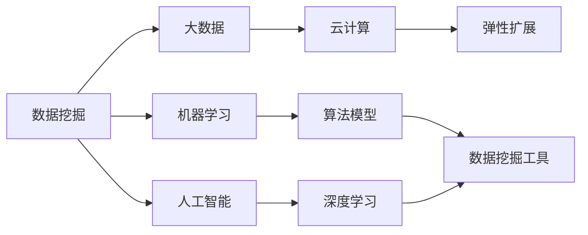

                 

# 平台经济的数据价值挖掘策略：如何挖掘数据价值？

> 关键词：平台经济、数据价值、数据挖掘策略、智能算法、机器学习、大数据技术

## 1. 背景介绍

在数字经济的浪潮下，平台经济已成为驱动全球经济增长的新引擎。平台型企业通过聚合海量用户和数据，构建起完整的生态系统，为用户提供多维度的价值创造。平台经济的关键在于，如何从海量数据中挖掘出有价值的洞见，驱动业务决策和优化。数据挖掘与分析，正是平台经济实现数据价值的桥梁和工具。本文将全面探讨平台经济的数据价值挖掘策略，从理论到实践，深入阐述如何高效、精准地挖掘数据价值，提升平台企业竞争力。

### 1.1 数据价值挖掘的重要性

数据是21世纪的“新石油”。在平台经济中，数据不仅仅是一种资源，更是业务决策、用户服务、市场拓展、风险控制等多个维度的核心资产。通过数据价值挖掘，平台企业可以实现以下几个目标：

- **洞察业务现状**：通过分析用户行为、交易数据，把握业务运营现状和痛点，优化业务流程。
- **提升用户体验**：通过个性化推荐、智能客服等应用，提供更精准、更便捷的服务体验。
- **拓展市场机会**：通过数据驱动的精准营销，挖掘新市场、新用户，提升市场占有率。
- **防范风险隐患**：通过风险数据分析，及时识别和应对潜在的金融风险、运营风险等，保障平台稳定运行。

在平台经济中，数据价值挖掘已成为企业制胜的关键，是实现数字化转型的基础。

### 1.2 数据价值挖掘的挑战

尽管数据价值挖掘对于平台企业至关重要，但在实际操作中仍面临诸多挑战：

- **数据质量问题**：平台上的数据可能存在噪音、不完整、不一致等问题，影响挖掘结果的准确性。
- **技术门槛高**：数据挖掘涉及复杂的算法和工具，需要专业的数据科学家和技术团队。
- **隐私和合规**：数据的隐私保护和合规性问题，需要严格的数据治理机制。
- **模型解释性不足**：复杂的数据挖掘模型通常缺乏可解释性，难以被非技术团队理解和接受。
- **实时响应需求**：在实时性要求高的场景下，需要高效的算法和计算架构，才能快速响应业务需求。

面对这些挑战，平台企业需要系统性构建数据价值挖掘策略，整合数据资源和技术工具，最大化数据的价值。

## 2. 核心概念与联系

### 2.1 核心概念概述

在探讨数据价值挖掘策略时，首先需要理解几个核心概念：

- **数据挖掘(Data Mining)**：从数据中提取有价值的模式、关系、洞见的过程。
- **机器学习(Machine Learning)**：通过算法让计算机从数据中学习规律，进行预测和决策。
- **人工智能(AI)**：一种使机器能够模拟、延伸人类智能能力的领域。
- **大数据(Big Data)**：体量大、速度快、种类多、价值密度低的数据集合。
- **云计算(Cloud Computing)**：利用互联网提供计算资源和存储资源，支持弹性扩展。

这些概念之间存在着紧密的联系。数据挖掘、机器学习和AI是数据价值挖掘的核心技术手段，而大数据和云计算则提供了存储和处理海量数据的基础设施。

### 2.2 概念间的关系

以下Mermaid流程图展示了数据价值挖掘中各个核心概念的关系：



这个流程图展示了数据挖掘与大数据、机器学习和AI的密切联系，以及云计算在支持数据处理方面的关键作用。数据挖掘和机器学习算法在云计算环境中运行，利用大数据技术进行数据存储和处理，从而实现高效的数据价值挖掘。

## 3. 核心算法原理 & 具体操作步骤

### 3.1 算法原理概述

平台经济的数据价值挖掘，通常遵循以下核心算法原理：

1. **数据准备**：清洗、转换、集成平台上的各类数据，形成高质量的数据集。
2. **特征工程**：从数据中提取、选择、构建有意义的特征，为模型训练做准备。
3. **模型选择与训练**：选择适合的数据挖掘算法，如回归、分类、聚类、关联规则等，并根据训练数据进行模型训练。
4. **模型评估与优化**：评估模型性能，调整参数或选择其他模型，优化模型效果。
5. **结果解释与应用**：解释模型结果，转化为可操作性的洞察，驱动业务决策和优化。

### 3.2 算法步骤详解

以下是对数据价值挖掘具体算法的详细步骤：

**Step 1: 数据收集与清洗**

数据是数据价值挖掘的起点。在平台经济中，数据来源多样，包括用户行为数据、交易数据、社交数据、市场数据等。数据收集过程中需要注意以下几点：

- **数据质量控制**：确保数据的准确性、完整性、一致性，避免噪音和冗余。
- **数据整合**：将不同来源的数据进行整合，形成一个统一的数据仓库。
- **数据安全**：确保数据传输和存储的安全性，避免数据泄露和篡改。

数据清洗包括去除缺失值、处理异常值、纠正错误等操作，确保数据质量。在平台经济中，数据清洗尤为重要，因为平台上的数据往往具有高度的不确定性和复杂性。

**Step 2: 特征工程**

特征工程是数据挖掘的核心环节，决定了模型的性能和效果。特征工程主要包括以下几个步骤：

- **特征提取**：从原始数据中提取有意义的特征，如时间戳、用户ID、行为频率等。
- **特征选择**：根据业务需求和模型效果，选择最相关的特征，减少维度灾难。
- **特征构建**：通过组合、变换等方法，构造新的特征，增强模型的表达能力。

例如，在电商平台的数据挖掘中，可以从用户行为数据中提取点击率、浏览时间、购物车添加等特征，通过时间戳和行为频率构建新的特征，如用户活跃度、消费潜力等。

**Step 3: 模型选择与训练**

选择合适的模型是数据挖掘成功的关键。常用的数据挖掘算法包括：

- **回归分析**：用于预测连续型数值，如预测用户购买概率。
- **分类算法**：用于分类任务，如预测用户是否流失。
- **聚类算法**：用于发现数据中的群体结构，如用户分群。
- **关联规则挖掘**：用于发现数据中的关联规则，如用户行为路径。

在模型训练过程中，需要选择合适的算法、设置合适的参数、使用合适的数据集，通过交叉验证等技术进行模型评估和优化。例如，在电商平台的推荐系统中，可以采用协同过滤、矩阵分解等算法，通过用户历史行为数据训练推荐模型。

**Step 4: 模型评估与优化**

模型评估是确保数据挖掘效果的重要步骤。常用的评估指标包括：

- **准确率、召回率、F1分数**：用于衡量分类模型的性能。
- **均方误差、平均绝对误差**：用于衡量回归模型的性能。
- **AUC、PR曲线**：用于衡量模型的排序能力。

模型优化包括参数调整、模型选择、特征工程改进等。例如，在电商平台的推荐系统中，可以使用A/B测试、模型融合等技术，不断优化推荐模型。

**Step 5: 结果解释与应用**

模型结果的解释与应用是数据价值挖掘的最终目标。通过对模型结果进行可视化、自然语言处理等技术，将复杂的机器学习结果转化为易于理解和操作的洞察。例如，在电商平台的广告投放优化中，可以基于用户画像和行为数据，预测用户的广告响应概率，生成精准投放策略。

### 3.3 算法优缺点

平台经济的数据价值挖掘算法具有以下优点：

- **精度高**：通过复杂的机器学习算法，可以提取复杂的模式和洞见，提高数据挖掘的准确性。
- **可扩展性强**：基于云计算平台，可以处理海量数据，支持大规模分布式计算。
- **应用广泛**：适用于各种数据类型和业务场景，如用户分析、产品推荐、风险控制等。

同时，也存在以下缺点：

- **计算成本高**：复杂算法和海量数据处理需要较高的计算资源。
- **模型复杂**：模型结构复杂，难以理解和解释，需要专业的数据科学团队。
- **数据隐私问题**：大数据处理涉及用户隐私，需要严格的数据治理和隐私保护措施。

### 3.4 算法应用领域

数据价值挖掘在平台经济中具有广泛的应用领域：

- **用户分析**：通过分析用户行为和交易数据，了解用户偏好、行为模式，提升用户体验。
- **个性化推荐**：基于用户画像和行为数据，提供个性化的商品推荐、广告推荐、内容推荐等。
- **风险控制**：通过分析交易数据、用户行为数据，识别和防范金融风险、运营风险。
- **市场拓展**：通过分析市场数据、用户数据，挖掘新市场、新用户，提升市场占有率。
- **运营优化**：通过分析运营数据、客户反馈数据，优化业务流程，提升运营效率。

## 4. 数学模型和公式 & 详细讲解 & 举例说明

### 4.1 数学模型构建

在平台经济中，数据价值挖掘涉及多种数学模型，以下以回归模型为例进行详细讲解。

假设我们有一个电商平台的数据集，包含用户ID、购买时间、购买金额、浏览次数等特征，目标是预测用户的购买概率。

构建回归模型的数学模型为：

$$
y_i = \beta_0 + \beta_1 x_{i1} + \beta_2 x_{i2} + \cdots + \beta_p x_{ip} + \epsilon_i
$$

其中，$y_i$表示用户购买概率，$x_{ij}$表示第j个特征，$\beta_j$表示特征系数，$\epsilon_i$表示随机误差。

### 4.2 公式推导过程

回归模型的最小二乘估计方法为：

$$
\hat{\beta} = (X^TX)^{-1}X^Ty
$$

其中，$\hat{\beta}$表示特征系数的估计值，$X$表示特征矩阵，$y$表示目标变量。

在实际应用中，为了提高模型性能，可以引入正则化技术，如L1正则、L2正则等，防止过拟合。例如，L2正则化的回归模型为：

$$
\hat{\beta} = (X^TX + \lambda I)^{-1}X^Ty
$$

其中，$\lambda$表示正则化系数，$I$表示单位矩阵。

### 4.3 案例分析与讲解

在电商平台的数据挖掘中，可以使用线性回归模型预测用户购买概率。例如，通过对历史交易数据进行分析，找到用户购买概率与浏览次数、购买金额、用户活跃度等特征的关系，从而构建预测模型。通过逐步引入新特征、调整正则化系数等方法，不断优化模型效果，最终生成可操作的推荐策略。

## 5. 项目实践：代码实例和详细解释说明

### 5.1 开发环境搭建

在进行数据价值挖掘实践前，需要准备好开发环境。以下是使用Python进行PyTorch和Pandas开发的环境配置流程：

1. 安装Anaconda：从官网下载并安装Anaconda，用于创建独立的Python环境。

2. 创建并激活虚拟环境：
```bash
conda create -n data-mining python=3.8 
conda activate data-mining
```

3. 安装PyTorch和Pandas：
```bash
conda install pytorch torchvision torchaudio cudatoolkit=11.1 -c pytorch -c conda-forge
conda install pandas
```

4. 安装其他常用工具包：
```bash
pip install numpy matplotlib scikit-learn jupyter notebook ipython
```

完成上述步骤后，即可在`data-mining`环境中开始数据价值挖掘实践。

### 5.2 源代码详细实现

以下是一个简单的电商推荐系统的代码实现示例，通过线性回归模型进行用户购买概率预测。

```python
import pandas as pd
import numpy as np
from sklearn.linear_model import LinearRegression
from sklearn.model_selection import train_test_split
from sklearn.metrics import mean_squared_error, r2_score

# 加载数据集
data = pd.read_csv('user_behavior.csv')

# 数据预处理
features = ['browsing_time', 'purchase_amount', 'user_id', 'user_age', 'user_gender']
target = 'purchase_probability'
X = data[features]
y = data[target]

# 划分训练集和测试集
X_train, X_test, y_train, y_test = train_test_split(X, y, test_size=0.2, random_state=42)

# 训练模型
model = LinearRegression()
model.fit(X_train, y_train)

# 模型评估
y_pred = model.predict(X_test)
mse = mean_squared_error(y_test, y_pred)
r2 = r2_score(y_test, y_pred)
print(f"Mean Squared Error: {mse:.3f}")
print(f"R^2 Score: {r2:.3f}")
```

以上代码展示了数据预处理、模型训练和评估的基本流程。在实际应用中，数据价值挖掘的代码实现将更加复杂，涉及更多的数据清洗、特征工程、模型优化等环节。

### 5.3 代码解读与分析

让我们再详细解读一下关键代码的实现细节：

**数据预处理**：
- `features`和`target`：定义特征和目标变量。
- `X`和`y`：将数据集分割为特征和目标变量，形成训练集和测试集。

**模型训练**：
- `LinearRegression`：选择合适的回归模型。
- `model.fit(X_train, y_train)`：使用训练数据训练模型。

**模型评估**：
- `y_pred`：使用训练好的模型预测测试集结果。
- `mse`和`r2`：计算均方误差和R^2分数，评估模型性能。

### 5.4 运行结果展示

在运行上述代码后，将得到模型的均方误差和R^2分数，评估模型的预测精度。例如，假设模型均方误差为0.5，R^2分数为0.8，表示模型在测试集上的预测精度较高。

## 6. 实际应用场景

### 6.1 智能客服系统

智能客服系统是平台经济中的重要应用场景。通过数据价值挖掘，可以实现以下功能：

- **用户意图识别**：通过分析用户对话内容，识别用户的咨询意图，自动分配工单。
- **自动化回复**：基于用户历史行为和问题内容，自动生成回复，提升客服效率。
- **客服行为优化**：分析客服聊天记录，优化客服工作流程，提升服务质量。

在智能客服系统中，数据价值挖掘可以显著提升用户体验和运营效率，降低人工成本。

### 6.2 个性化推荐系统

个性化推荐系统是电商平台的核心竞争力之一。通过数据价值挖掘，可以实现以下功能：

- **用户画像构建**：通过分析用户行为数据，构建用户画像，提供个性化推荐。
- **商品推荐优化**：基于用户历史购买和浏览数据，优化推荐模型，提升推荐效果。
- **新商品发现**：通过分析市场数据和用户行为，发现新商品，增加商品种类。

在个性化推荐系统中，数据价值挖掘可以显著提升用户购买转化率和平台收入。

### 6.3 金融风控系统

金融风控系统是金融平台的关键应用场景。通过数据价值挖掘，可以实现以下功能：

- **风险识别与预警**：通过分析用户交易数据，识别异常交易和风险行为。
- **信用评分优化**：基于用户历史交易和行为数据，优化信用评分模型，降低坏账率。
- **欺诈检测**：通过分析用户行为和交易数据，检测欺诈行为，保护用户财产安全。

在金融风控系统中，数据价值挖掘可以显著提升金融平台的稳定性和安全性。

### 6.4 未来应用展望

随着数据价值挖掘技术的发展，平台经济中的应用场景将不断扩展，数据驱动的决策将更加普遍。未来，数据价值挖掘将融合更多前沿技术，如大数据技术、深度学习、云计算等，推动平台经济向更加智能、高效、安全的方向发展。

## 7. 工具和资源推荐

### 7.1 学习资源推荐

为了帮助开发者系统掌握数据价值挖掘的理论基础和实践技巧，这里推荐一些优质的学习资源：

1. 《Python数据科学手册》：全面介绍Python在数据科学中的应用，包括数据预处理、特征工程、模型训练等。

2. 《机器学习实战》：通过实例演示，详细介绍机器学习算法的实现和应用。

3. 《深度学习入门》：介绍深度学习的基本原理和实践技巧，适合初学者入门。

4. 《Python数据分析与可视化》：详细介绍Python在数据分析和可视化中的应用，适合数据分析师使用。

5. 《大数据技术与应用》：介绍大数据技术的基本概念和应用，适合大数据工程师使用。

通过对这些资源的学习实践，相信你一定能够快速掌握数据价值挖掘的精髓，并用于解决实际的业务问题。

### 7.2 开发工具推荐

高效的开发离不开优秀的工具支持。以下是几款用于数据价值挖掘开发的常用工具：

1. PyTorch：基于Python的开源深度学习框架，灵活动态的计算图，适合快速迭代研究。

2. TensorFlow：由Google主导开发的开源深度学习框架，生产部署方便，适合大规模工程应用。

3. Pandas：Python中的数据处理库，支持多种数据格式，适合数据清洗、特征工程等操作。

4. Scikit-learn：Python中的机器学习库，支持多种常用算法，适合模型训练和评估。

5. Weights & Biases：模型训练的实验跟踪工具，可以记录和可视化模型训练过程中的各项指标，方便对比和调优。

6. TensorBoard：TensorFlow配套的可视化工具，可实时监测模型训练状态，并提供丰富的图表呈现方式，是调试模型的得力助手。

合理利用这些工具，可以显著提升数据价值挖掘任务的开发效率，加快创新迭代的步伐。

### 7.3 相关论文推荐

数据价值挖掘是近年来AI领域的重要研究方向，以下是几篇奠基性的相关论文，推荐阅读：

1. 《A Survey on Data Mining and Statistical Learning》：介绍数据挖掘和机器学习的主要方法、算法和应用。

2. 《Data Mining: Concepts and Techniques》：详细介绍数据挖掘的基本概念、算法和应用。

3. 《Pattern Recognition and Machine Learning》：介绍机器学习的主要方法和应用，适合深入学习。

4. 《The Elements of Statistical Learning》：介绍统计学习的主要方法和应用，适合统计学和数据科学领域的读者。

5. 《Deep Learning》：介绍深度学习的主要方法和应用，适合深度学习领域的读者。

这些论文代表了大数据、机器学习和深度学习领域的最新进展，帮助研究者把握学科前进方向，激发更多的创新灵感。

除上述资源外，还有一些值得关注的前沿资源，帮助开发者紧跟数据价值挖掘技术的最新进展，例如：

1. arXiv论文预印本：人工智能领域最新研究成果的发布平台，包括大量尚未发表的前沿工作，学习前沿技术的必读资源。

2. 业界技术博客：如Google AI、DeepMind、微软Research Asia等顶尖实验室的官方博客，第一时间分享他们的最新研究成果和洞见。

3. 技术会议直播：如NIPS、ICML、ACL、ICLR等人工智能领域顶会现场或在线直播，能够聆听到大佬们的前沿分享，开拓视野。

4. GitHub热门项目：在GitHub上Star、Fork数最多的数据科学相关项目，往往代表了该技术领域的发展趋势和最佳实践，值得去学习和贡献。

5. 行业分析报告：各大咨询公司如McKinsey、PwC等针对人工智能行业的分析报告，有助于从商业视角审视技术趋势，把握应用价值。

总之，对于数据价值挖掘技术的学习和实践，需要开发者保持开放的心态和持续学习的意愿。多关注前沿资讯，多动手实践，多思考总结，必将收获满满的成长收益。

## 8. 总结：未来发展趋势与挑战

### 8.1 研究成果总结

本文对数据价值挖掘在平台经济中的应用进行了全面系统的介绍，从理论到实践，深入阐述了数据价值挖掘的各个环节。通过系统梳理，我们可以看到数据价值挖掘在平台经济中的重要性，以及其在用户分析、个性化推荐、金融风控等多个领域的广泛应用。

### 8.2 未来发展趋势

展望未来，数据价值挖掘技术将呈现以下几个发展趋势：

1. **自动化程度提升**：数据价值挖掘将逐步走向自动化，减少人工干预，提高效率。
2. **模型可解释性增强**：通过可解释性模型和工具，增强模型的透明性，提升决策可信度。
3. **跨领域融合**：数据价值挖掘将与其他AI技术如自然语言处理、计算机视觉等融合，拓展应用场景。
4. **数据隐私保护**：数据价值挖掘将更加注重用户隐私保护，引入隐私保护技术，确保数据安全。
5. **实时数据处理**：数据价值挖掘将更加注重实时性，利用流式处理和实时计算技术，满足实时需求。

这些趋势将推动数据价值挖掘技术向更加智能、高效、安全的方向发展。

### 8.3 面临的挑战

尽管数据价值挖掘技术在平台经济中已经取得了显著成效，但在迈向更加智能化、普适化应用的过程中，仍面临诸多挑战：

1. **数据质量问题**：平台上的数据质量参差不齐，需要更高效的数据清洗和预处理技术。
2. **模型复杂度**：数据价值挖掘涉及复杂的算法和工具，需要持续的算法创新和优化。
3. **资源消耗高**：大规模数据处理和计算需要高性能的硬件和软件支持。
4. **数据隐私问题**：平台企业需要严格的数据治理和隐私保护机制，防止数据泄露和滥用。
5. **技术壁垒高**：数据价值挖掘涉及多个领域的技术，需要跨学科的人才和团队。

### 8.4 研究展望

面对数据价值挖掘面临的挑战，未来的研究需要在以下几个方面寻求新的突破：

1. **数据预处理技术**：开发更高效的数据清洗、特征工程和数据集成技术，提升数据质量。
2. **自动化工具**：开发更智能的数据价值挖掘工具，减少人工干预，提高效率。
3. **实时处理技术**：引入流式处理和实时计算技术，满足实时数据处理需求。
4. **模型可解释性**：开发更可解释的机器学习模型，增强模型的透明性和可信度。
5. **跨领域融合**：探索数据价值挖掘与其他AI技术的融合，拓展应用场景。

这些研究方向的探索，必将推动数据价值挖掘技术向更加智能化、普适化应用，提升平台企业的核心竞争力。

## 9. 附录：常见问题与解答

**Q1: 数据价值挖掘是否适用于所有平台经济场景？**

A: 数据价值挖掘在大多数平台经济场景中都能取得显著效果，但需要根据具体场景选择适合的算法和技术。例如，在电商、金融、社交等不同场景中，数据特性和业务需求不同，需要进行针对性的数据挖掘策略。

**Q2: 如何选择适合的数据挖掘算法？**

A: 选择适合的数据挖掘算法需要考虑多个因素，包括数据类型、业务需求、数据规模等。通常需要进行初步的探索性分析，确定合适的算法。例如，在电商平台的推荐系统中，可以选择协同过滤、矩阵分解等算法；在金融风控系统中，可以选择逻辑回归、决策树等算法。

**Q3: 数据价值挖掘的计算资源需求大吗？**

A: 数据价值挖掘涉及大规模数据处理和计算，通常需要高性能的硬件和软件支持。例如，在电商平台的数据挖掘中，需要处理海量用户数据，需要高性能的服务器和计算集群。因此，选择合适的硬件和软件平台是数据价值挖掘成功的重要保障。

**Q4: 数据价值挖掘对数据隐私有哪些要求？**

A: 数据价值挖掘需要严格的数据隐私保护措施，防止数据泄露和滥用。平台企业需要建立完善的数据治理机制，确保数据安全和合规性。例如，在用户行为数据挖掘中，需要确保用户隐私权，避免数据滥用和侵犯用户隐私。

**Q5: 如何提高数据价值挖掘的模型可解释性？**

A: 提高模型可解释性可以通过以下几个方法：
1. 选择可解释性强的算法，如决策树、线性回归等。
2. 使用可解释性工具，如LIME、SHAP等，对模型结果进行解释。
3. 引入因果推断等方法，增强模型的可解释性。

这些方法可以帮助平台企业更好地理解模型的决策过程，提高决策的透明性和可信度。

---

作者：禅与计算机程序设计艺术 / Zen and the Art of Computer Programming

