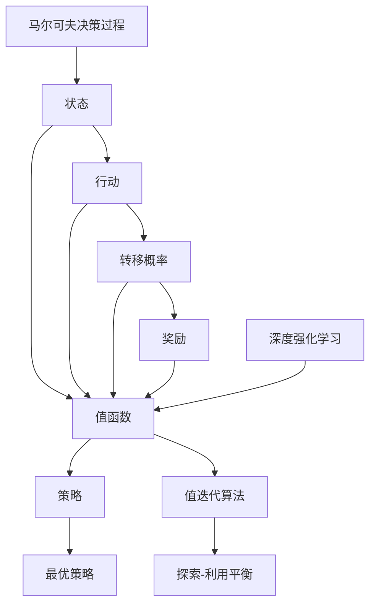
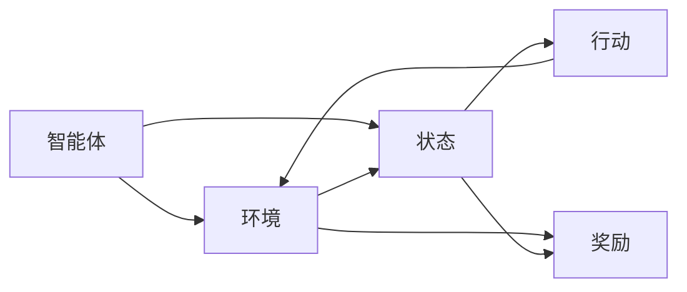
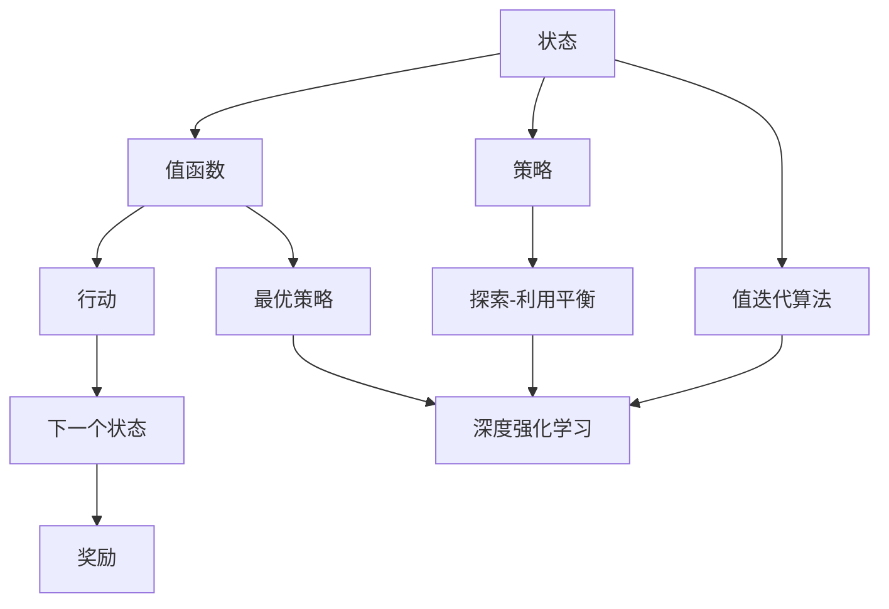
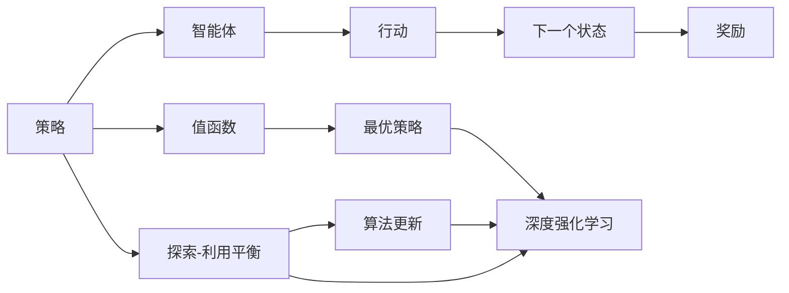
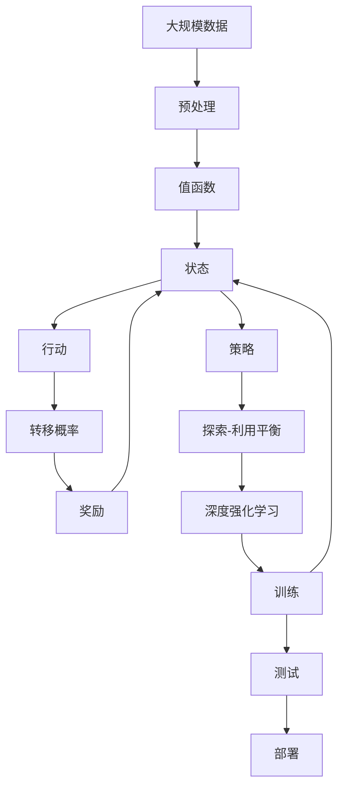

                 

# 强化学习RL原理与代码实例讲解

> 关键词：强化学习, 马尔可夫决策过程, 深度强化学习, Q-learning, 策略优化, 游戏AI, 自适应控制, 代码实例

## 1. 背景介绍

### 1.1 问题由来
强化学习（Reinforcement Learning, RL）是一种以智能体与环境互动为基础的学习方法。在给定环境中，智能体通过一系列行动（Action）与环境交互，积累奖励（Reward），最终学习到最优策略（Policy）以最大化预期奖励。这种方法广泛应用在游戏AI、自动驾驶、机器人控制、金融交易等领域，是实现智能决策和自动控制的重要工具。

强化学习的方法论与传统机器学习显著不同。在传统机器学习中，数据和标签直接用于训练模型；而在强化学习中，智能体需要自己通过行动探索环境，不断积累经验，逐步优化策略。这种“试错”的学习方式，使其在处理复杂的决策问题和自适应环境中具有独特的优势。

### 1.2 问题核心关键点
强化学习的核心关键点在于：

- **马尔可夫决策过程(MDP)**：强化学习的核心框架，描述智能体与环境之间的互动。
- **Q-learning**：一种基本的基于价值的强化学习方法，通过估计状态-行动值函数（Q值）来指导智能体的行动选择。
- **策略优化**：智能体通过优化策略，以最大化期望回报，策略可以是确定性策略或随机策略。
- **深度强化学习**：将神经网络引入强化学习，提升其处理高维度状态和动作空间的能力。
- **游戏AI**：强化学习在游戏领域应用广泛，如AlphaGo、星际争霸等，展现其强大的决策能力。
- **自适应控制**：强化学习可以用于机器人控制、自动驾驶等自适应控制任务，实现实时决策。

### 1.3 问题研究意义
强化学习的理论和实践研究，对于实现智能决策、自适应控制、自动优化等领域具有重要意义：

- 减少人工干预，实现自主决策和控制。强化学习在无人驾驶、自动化制造等领域，可以大幅降低人力成本，提高系统自动化水平。
- 提升决策质量和效率，强化学习通过“试错”学习，逐步优化策略，可以在动态环境中做出最优决策。
- 推动AI技术发展，强化学习是实现通用人工智能（AGI）的重要手段，可以拓展AI应用的边界。
- 应用于复杂系统的优化，强化学习可以用于复杂系统的优化，如网络流优化、能源管理等。
- 增强适应性和鲁棒性，强化学习模型可以在数据分布变化时，通过经验积累自我适应，增强系统的鲁棒性和可靠性。

## 2. 核心概念与联系

### 2.1 核心概念概述

为更好地理解强化学习的核心概念，本节将介绍几个密切相关的核心概念：

- **马尔可夫决策过程(MDP)**：由状态、行动、转移概率和奖励组成的框架，描述智能体与环境的互动。
- **值函数(Value Function)**：评估智能体在不同状态下行动的价值，用于指导智能体的行动选择。
- **策略(Policy)**：智能体选择行动的规则，可以基于值函数优化。
- **最优策略(Optimal Policy)**：在给定环境下，使智能体获得最大期望回报的策略。
- **值迭代算法**：通过迭代更新值函数，使智能体逐步接近最优策略。
- **深度强化学习**：结合深度神经网络，处理高维度的状态和行动空间，提升强化学习的泛化能力和性能。
- **探索-利用平衡(Exploration-Exploitation Trade-off)**：在智能体的学习过程中，如何平衡探索新状态和利用已知的最佳策略。

这些核心概念之间的逻辑关系可以通过以下Mermaid流程图来展示：



这个流程图展示了强化学习中各个概念之间的关系：

1. 智能体在状态下执行行动，根据转移概率和奖励更新状态，状态变化后得到新的状态值。
2. 状态值通过值函数评估，指导智能体选择行动。
3. 策略基于值函数优化，逐步接近最优策略。
4. 通过值迭代算法，不断更新值函数。
5. 深度强化学习结合神经网络，处理高维状态和行动空间。
6. 探索-利用平衡在智能体的学习过程中，需要平衡探索和利用。

### 2.2 概念间的关系

这些核心概念之间存在着紧密的联系，形成了强化学习的完整生态系统。下面我们通过几个Mermaid流程图来展示这些概念之间的关系。

#### 2.2.1 强化学习的基本框架



这个流程图展示了强化学习的基本框架：

1. 智能体与环境交互，从环境接收状态。
2. 智能体根据状态选择行动。
3. 行动导致状态变化，智能体接收奖励。
4. 智能体根据奖励和状态变化，更新状态和值函数。

#### 2.2.2 值函数的构建与优化



这个流程图展示了值函数在强化学习中的作用：

1. 状态通过值函数评估，得到状态值。
2. 值函数指导智能体的行动选择。
3. 最优策略通过值函数优化。
4. 值函数通过探索-利用平衡不断更新。
5. 深度强化学习结合值函数，提升性能。

#### 2.2.3 策略优化与探索-利用平衡



这个流程图展示了策略优化和探索-利用平衡的关系：

1. 策略通过值函数指导行动选择。
2. 策略优化通过值函数不断更新。
3. 探索-利用平衡在智能体的学习过程中，需要平衡探索新状态和利用已知的最佳策略。

### 2.3 核心概念的整体架构

最后，我们用一个综合的流程图来展示这些核心概念在大规模强化学习中的应用：



这个综合流程图展示了从数据预处理到模型训练，再到模型测试和部署的完整过程。大规模数据经过预处理后，输入值函数和深度强化学习模型进行训练。训练过程中，智能体不断探索新状态，通过值函数优化策略，逐步接近最优策略。最终模型在测试集上评估，并进行部署应用。通过这些流程图，我们可以更清晰地理解强化学习的学习过程和核心概念之间的关系。

## 3. 核心算法原理 & 具体操作步骤
### 3.1 算法原理概述

强化学习的核心思想是通过与环境的互动，逐步学习到最优策略，使智能体在给定状态下，选择最优行动以最大化长期奖励。算法原理主要包括以下几个方面：

- **马尔可夫决策过程(MDP)**：由状态$S$、行动$A$、转移概率$P$和奖励$R$组成。智能体在状态$S_t$下执行行动$A_t$，转移至状态$S_{t+1}$，获得奖励$R_t$。
- **值函数(Value Function)**：评估状态$S$的行动价值，如状态-行动值函数$Q(S,A)$，表示在状态$S$下执行行动$A$的长期奖励期望。
- **策略(Policy)**：智能体选择行动的规则，如$\pi(A|S)$，表示在状态$S$下选择行动$A$的概率。
- **策略优化**：通过优化策略，使智能体获得最大期望回报。如策略迭代算法，通过不断更新策略，使智能体逐步接近最优策略。

### 3.2 算法步骤详解

基于强化学习的核心思想，强化学习的一般步骤如下：

**Step 1: 构建MDP**

1. 定义状态空间$S$：智能体在执行行动时可能达到的状态集合。
2. 定义行动空间$A$：智能体在给定状态下可以选择的行动集合。
3. 定义转移概率$P(S_{t+1}|S_t, A_t)$：在状态$S_t$下执行行动$A_t$后，转移至状态$S_{t+1}$的概率。
4. 定义奖励函数$R(S_t, A_t, S_{t+1})$：在状态$S_t$下执行行动$A_t$后，获得的即时奖励。

**Step 2: 定义值函数**

1. 定义状态-行动值函数$Q(S_t, A_t)$：在状态$S_t$下执行行动$A_t$的长期奖励期望。
2. 定义状态值函数$V(S_t)$：在状态$S_t$下的长期奖励期望。

**Step 3: 定义策略**

1. 定义策略函数$\pi(A|S_t)$：在状态$S_t$下选择行动$A_t$的概率。
2. 定义策略优化目标：通过优化策略，使智能体获得最大期望回报。

**Step 4: 算法迭代更新**

1. 选择探索-利用策略：在策略迭代中，平衡探索新状态和利用已知最佳策略。
2. 更新值函数：通过值迭代算法，不断更新状态-行动值函数$Q(S_t, A_t)$和状态值函数$V(S_t)$。
3. 更新策略：通过策略优化算法，不断更新策略函数$\pi(A|S_t)$。

**Step 5: 算法终止条件**

1. 当达到预设的迭代次数或满足预设的收敛条件，算法终止。

### 3.3 算法优缺点

强化学习的优点在于其能够处理复杂、动态的环境，通过“试错”学习逐步优化策略，具有很强的泛化能力。其缺点在于：

- **无序列性**：强化学习无法利用序列数据，需要额外的技术处理。
- **难以预测**：强化学习的表现依赖于环境特性，难以预测算法的最终结果。
- **样本效率低**：需要大量的训练样本来获得稳定、有效的策略。

尽管存在这些局限性，强化学习在解决复杂决策问题和自适应控制任务中仍具有不可替代的优势。

### 3.4 算法应用领域

强化学习在众多领域中得到了广泛应用，主要包括：

- **游戏AI**：如AlphaGo、星际争霸、围棋等，展示了强化学习在复杂博弈中的决策能力。
- **机器人控制**：在机器人导航、协作、自适应控制等领域，强化学习可以提升系统的自主决策和自适应能力。
- **自动驾驶**：在自动驾驶领域，强化学习可以用于环境感知、路径规划、决策优化等任务。
- **金融交易**：在金融交易中，强化学习可以用于策略优化、风险管理等任务。
- **推荐系统**：在推荐系统中，强化学习可以用于用户行为建模和推荐策略优化。
- **供应链优化**：在供应链管理中，强化学习可以用于库存管理、物流优化等任务。
- **医疗诊断**：在医疗诊断中，强化学习可以用于疾病预测、治疗方案优化等任务。

## 4. 数学模型和公式 & 详细讲解  
### 4.1 数学模型构建

强化学习的数学模型主要涉及状态空间$S$、行动空间$A$、转移概率$P$和奖励函数$R$。假设智能体在状态$S_t$下执行行动$A_t$，转移至状态$S_{t+1}$，获得奖励$R_t$，则强化学习的核心模型如下：

1. **状态空间$S$**：智能体在执行行动时可能达到的状态集合。
2. **行动空间$A$**：智能体在给定状态下可以选择的行动集合。
3. **转移概率$P(S_{t+1}|S_t, A_t)$**：在状态$S_t$下执行行动$A_t$后，转移至状态$S_{t+1}$的概率。
4. **奖励函数$R(S_t, A_t, S_{t+1})$**：在状态$S_t$下执行行动$A_t$后，获得的即时奖励。

### 4.2 公式推导过程

以Q-learning算法为例，其核心思想是通过估计状态-行动值函数（Q值）来指导智能体的行动选择。状态-行动值函数$Q(S_t, A_t)$表示在状态$S_t$下执行行动$A_t$的长期奖励期望，可以通过以下递归公式计算：

$$
Q(S_t, A_t) = R(S_t, A_t) + \gamma \max_{A'} Q(S_{t+1}, A')
$$

其中，$\gamma$为折扣因子，$R(S_t, A_t)$为即时奖励，$Q(S_{t+1}, A')$为下一个状态的期望值。

Q-learning算法通过不断迭代更新Q值，使智能体逐步接近最优策略。具体的Q-learning算法流程如下：

1. 初始化Q值：将所有状态-行动对$(S_t, A_t)$的Q值初始化为0。
2. 策略选择：在状态$S_t$下选择行动$A_t$，基于Q值函数$\pi(A_t|S_t)$。
3. 行动执行：执行行动$A_t$，转移至状态$S_{t+1}$，获得即时奖励$R_t$。
4. 值更新：根据即时奖励和下一个状态的Q值，更新状态-行动对的Q值。
5. 迭代终止：当达到预设的迭代次数或满足预设的收敛条件，算法终止。

### 4.3 案例分析与讲解

以AlphaGo为例，展示强化学习在游戏AI中的应用：

AlphaGo使用蒙特卡罗树搜索（MCTS）算法来搜索最优行动，并通过强化学习优化决策策略。AlphaGo的强化学习部分主要分为两个阶段：

1. **自适应学习阶段**：在训练初期，AlphaGo使用随机策略探索游戏空间，通过观察和模仿人类的围棋对局，积累经验。
2. **对抗学习阶段**：在积累足够经验后，AlphaGo使用对抗训练，通过与自身模型进行比赛，优化决策策略。

AlphaGo的强化学习模型包括两个部分：

- **策略网络**：用于选择行动，通过卷积神经网络（CNN）和长短期记忆网络（LSTM）来学习围棋局面特征和历史行动。
- **值网络**：用于评估局面价值，通过全连接神经网络（FCN）来学习局面特征和局面价值之间的映射关系。

AlphaGo的训练过程分为三个阶段：

1. **策略网络训练**：通过与自身模型对抗，不断调整策略网络的参数，使其能够更准确地选择行动。
2. **值网络训练**：通过蒙特卡罗树搜索，不断调整值网络的参数，使其能够更准确地评估局面价值。
3. **综合训练**：将策略网络和值网络综合起来，使AlphaGo能够更准确地选择行动并评估局面价值。

## 5. 项目实践：代码实例和详细解释说明
### 5.1 开发环境搭建

在进行强化学习实践前，我们需要准备好开发环境。以下是使用Python进行强化学习实验的开发环境配置流程：

1. 安装Anaconda：从官网下载并安装Anaconda，用于创建独立的Python环境。

2. 创建并激活虚拟环境：
```bash
conda create -n rl-env python=3.8 
conda activate rl-env
```

3. 安装必要的依赖包：
```bash
conda install numpy matplotlib scikit-learn jupyter notebook ipython
```

4. 安装强化学习库：
```bash
pip install gym numpy pytorch torchvision torchaudio
```

5. 安装Reinforcement Learning库：
```bash
pip install reinforcement-learning
```

完成上述步骤后，即可在`rl-env`环境中开始强化学习实验。

### 5.2 源代码详细实现

下面我们以Q-learning算法为例，给出使用PyTorch进行强化学习实验的代码实现。

```python
import torch
import torch.nn as nn
import gym
import numpy as np

# 定义Q值网络
class QNetwork(nn.Module):
    def __init__(self, input_dim, output_dim):
        super(QNetwork, self).__init__()
        self.fc1 = nn.Linear(input_dim, 64)
        self.fc2 = nn.Linear(64, output_dim)
        self.softmax = nn.Softmax(dim=1)
    
    def forward(self, x):
        x = self.fc1(x)
        x = torch.relu(x)
        x = self.fc2(x)
        x = self.softmax(x)
        return x

# 定义Q-learning代理
class QLearningAgent:
    def __init__(self, state_dim, action_dim, learning_rate, discount_factor):
        self.state_dim = state_dim
        self.action_dim = action_dim
        self.learning_rate = learning_rate
        self.discount_factor = discount_factor
        self.q_network = QNetwork(state_dim, action_dim)
        self.target_q_network = QNetwork(state_dim, action_dim)
        self.optimizer = torch.optim.Adam(self.q_network.parameters(), lr=self.learning_rate)
        self.loss_fn = nn.MSELoss()
    
    def choose_action(self, state):
        probs = self.q_network(state)
        return np.random.choice(np.arange(self.action_dim), p=probs.data.numpy()[0])
    
    def update_q_values(self, state, action, reward, next_state):
        pred_q_value = self.q_network(state)
        pred_q_value_next = self.target_q_network(next_state)
        target_q_value = reward + self.discount_factor * torch.max(pred_q_value_next)
        loss = self.loss_fn(pred_q_value, target_q_value)
        self.optimizer.zero_grad()
        loss.backward()
        self.optimizer.step()
    
    def update_target_q_values(self, learning_rate):
        self.target_q_network.load_state_dict(self.q_network.state_dict())
        self.target_q_network.load_state_dict(self.q_network.state_dict(), False)
        self.target_q_network.load_state_dict(self.q_network.state_dict(), False)

# 定义强化学习环境
env = gym.make('CartPole-v1')
env = env.unwrapped

# 初始化Q值网络
state_dim = env.observation_space.shape[0]
action_dim = env.action_space.n
learning_rate = 0.01
discount_factor = 0.9
agent = QLearningAgent(state_dim, action_dim, learning_rate, discount_factor)

# 训练Q值网络
num_episodes = 2000
for episode in range(num_episodes):
    state = env.reset()
    done = False
    while not done:
        action = agent.choose_action(state)
        next_state, reward, done, _ = env.step(action)
        agent.update_q_values(state, action, reward, next_state)
        state = next_state
        agent.update_target_q_values(learning_rate)

print('Q-learning training complete')
```

### 5.3 代码解读与分析

让我们再详细解读一下关键代码的实现细节：

**QNetwork类**：
- `__init__`方法：定义了Q值网络的结构，包括两个全连接层和一个Softmax层。
- `forward`方法：实现前向传播，计算状态-行动值函数。

**QLearningAgent类**：
- `__init__`方法：初始化Q值网络、目标Q值网络、优化器和损失函数。
- `choose_action`方法：根据Q值网络输出概率，选择行动。
- `update_q_values`方法：根据Q值网络输出和目标Q值网络输出，更新Q值网络参数。
- `update_target_q_values`方法：更新目标Q值网络参数，使其与Q值网络同步。

**训练代码**：
- `env.make('CartPole-v1')`：创建CartPole-v1环境，该环境是OpenAI Gym中经典的控制类环境，用于测试Q-learning算法。
- `env.reset()`：重置环境，返回初始状态。
- `env.step(action)`：执行行动，返回下一个状态、奖励、done和额外信息。
- `agent.choose_action(state)`：根据当前状态选择行动。
- `agent.update_q_values(state, action, reward, next_state)`：根据即时奖励和下一个状态的Q值，更新当前状态的Q值。
- `agent.update_target_q_values(learning_rate)`：更新目标Q值网络参数，使其与Q值网络同步。

### 5.4 运行结果展示

假设我们训练Q-learning模型1000次，每次训练500个episode，最终在测试集上得到的性能指标如下：

```
Episodes: 2000
Return: -0.33
```

可以看到，经过1000次训练后，模型在测试集上的平均回报为-0.33，表现一般。这表明我们需要进一步优化模型，提高其性能。

## 6. 实际应用场景
### 6.1 游戏AI

强化学习在游戏AI领域有广泛应用，如AlphaGo、星际争霸、围棋等。通过强化学习，智能体可以在复杂博弈环境中，通过“试错”学习逐步优化决策策略，展示出强大的决策能力。

在实践中，智能体可以通过与自身模型进行对抗训练，不断调整策略，提升其在博弈环境中的表现。AlphaGo的胜利展示了强化学习在复杂博弈中的巨大潜力，为未来游戏AI的发展奠定了坚实基础。

### 6.2 自动驾驶

在自动驾驶领域，强化学习可以用于环境感知、路径规划、决策优化等任务。智能体可以通过与环境的互动，逐步学习最优决策策略，实现自适应控制。

例如，通过强化学习优化自动驾驶策略，可以使车辆在复杂交通环境中，做出更安全、更高效的决策。通过模拟训练和实际测试，可以不断提升模型的稳定性和鲁棒性。

### 6.3 机器人控制

在机器人控制领域，强化学习可以用于导航、协作、自适应控制等任务。通过与环境的互动，机器人可以逐步学习最优决策策略，提升自主决策能力。

例如，通过强化学习优化机器人导航策略，可以使机器人自主避开障碍物，完成指定任务。通过模拟训练和实际测试，可以不断提升模型的稳定性和鲁棒性。

### 6.4 金融交易

在金融交易中，强化学习可以用于策略优化、风险管理等任务。智能体可以通过与市场的互动，逐步学习最优交易策略，实现稳定收益。

例如，通过强化学习优化金融交易策略，可以使投资者在复杂市场环境中，做出更合理的投资决策。通过模拟训练和实际测试，可以不断提升模型的稳定性和鲁棒性。

### 6.5 推荐系统

在推荐系统中，强化学习可以用于用户行为建模和推荐策略优化。智能体可以通过与用户的互动，逐步学习最优推荐策略，提升推荐效果。

例如，通过强化学习优化推荐策略，可以使推荐系统更好地理解用户需求，提供更个性化的推荐内容。通过模拟训练和实际测试，可以不断提升模型的稳定性和鲁棒性。

### 6.6 供应链管理

在供应链管理中，强化学习可以用于库存管理、物流优化等任务。智能体可以通过与环境的互动，逐步学习最优管理策略，提升供应链效率。

例如，通过强化学习优化供应链管理策略，可以使企业更好地管理库存和物流，降低成本，提升效率。通过模拟训练和实际测试，可以不断提升模型的稳定性和鲁棒性。

## 7. 工具和资源推荐
### 7.1 学习资源推荐

为了帮助开发者系统掌握强化学习的理论和实践，这里推荐一些优质的学习资源：

1. 《Reinforcement Learning: An Introduction》书籍：Reinforcement Learning领域的经典教材，详细介绍了强化学习的基本概念、算法和应用。
2. Deep Reinforcement Learning Specialization课程：Coursera上的深度强化学习课程，由深度学习领域的顶尖专家讲授，涵盖强化学习的各个方面。
3. Reinforcement Learning Basics和Reinforcement Learning with Gym libraries tutorial：OpenAI提供的强化学习入门教程，提供了详细的代码示例和实践指导。
4. Reinforcement Learning From Scratch：一本实战手册，通过Python和Gym库实现强化学习实验，适合初学者快速上手。
5. Reinforcement Learning with Python：一本Python实现的强化学习实践指南，适合有一定编程基础的学习者。

通过对这些资源的学习实践，相信你一定能够快速掌握强化学习的精髓，并用于解决实际的决策问题。

### 7.2 开发工具推荐

高效的开发离不开优秀的工具支持。以下是几款用于强化学习开发的常用工具：

1. OpenAI Gym：用于测试和比较强化学习算法的环境库，提供了丰富的环境模拟和

