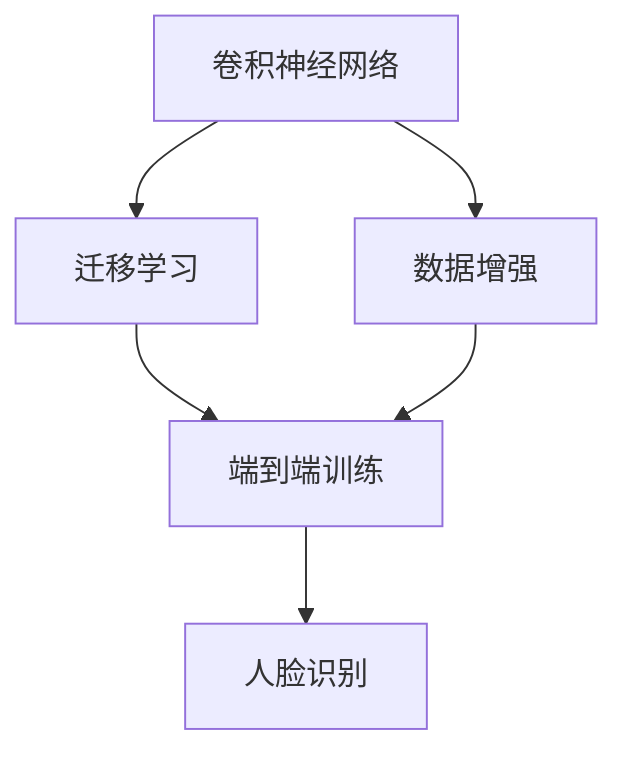
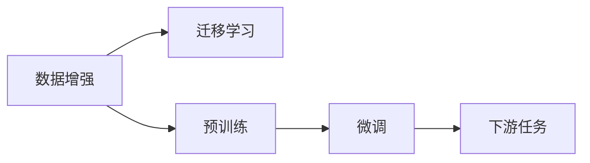
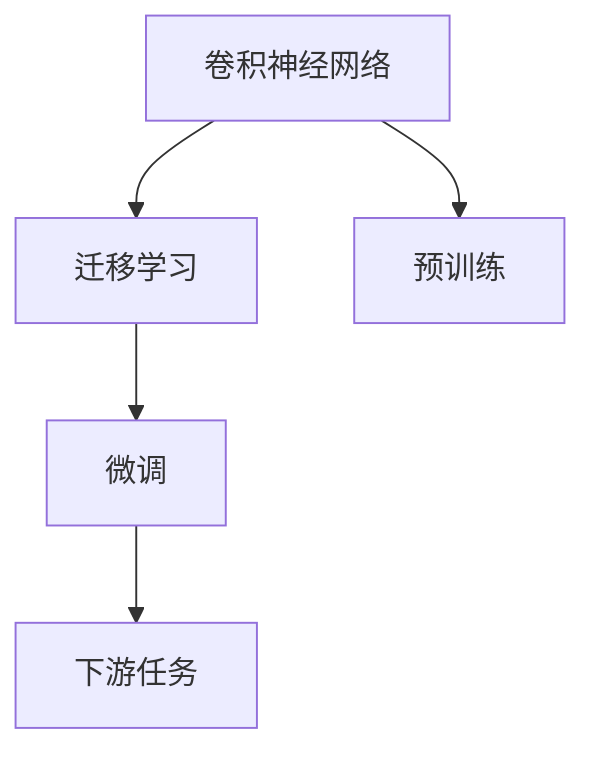
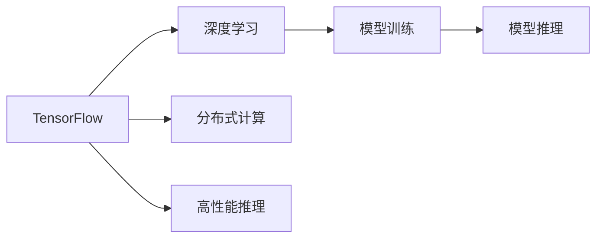
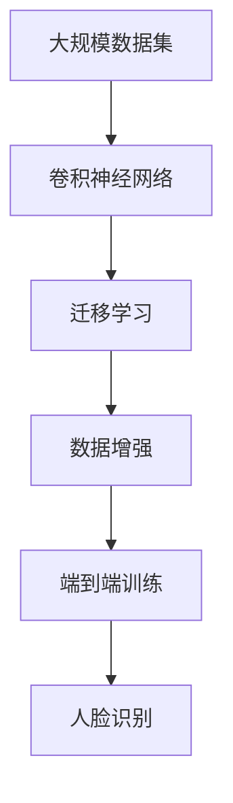

                 

# 基于TensorFlow的人脸识别

> 关键词：人脸识别, TensorFlow, 卷积神经网络, 迁移学习, 数据增强, 实时应用

## 1. 背景介绍

### 1.1 问题由来
人脸识别是计算机视觉和人工智能领域中的一个经典问题，旨在识别和验证人脸的身份信息。其应用场景包括门禁系统、考勤打卡、身份认证、监控安防等，对现代社会的便捷化和智能化起到了重要作用。传统的人脸识别方法主要依赖于特征提取和机器学习，而随着深度学习技术的发展，基于神经网络的端到端模型逐渐成为主流。

近年来，深度神经网络在人脸识别领域的突破性进展，主要源于大规模标注数据和计算资源的高效利用。通过构建卷积神经网络(CNN)或残差网络(ResNet)等模型，在大规模数据集上进行预训练，可以学习到丰富的人脸特征，显著提升识别精度。同时，借助迁移学习，在大规模预训练模型的基础上进行微调，可以更快地适配特定任务，显著降低训练成本。

### 1.2 问题核心关键点
本文将详细介绍基于TensorFlow的人脸识别技术，重点聚焦于如何构建和优化神经网络模型，并使用大规模标注数据进行训练和微调。核心关键点包括：

1. **深度神经网络架构**：选择合适的深度网络架构，通过迁移学习优化特定任务。
2. **大规模数据集使用**：利用公开的人脸识别数据集，进行大规模预训练和微调。
3. **数据增强**：通过一系列数据增强技术，丰富训练集的多样性。
4. **迁移学习与微调**：将预训练模型应用于特定任务，通过微调优化模型参数。
5. **实时应用优化**：针对实际应用场景，进行模型裁剪和性能优化。

### 1.3 问题研究意义
研究基于TensorFlow的人脸识别技术，对于拓展深度学习在计算机视觉领域的应用，提升人脸识别系统的性能和效率，具有重要意义：

1. 降低应用开发成本。使用预训练模型和迁移学习方法，可以减少从头开发所需的数据、计算和人力等成本投入。
2. 提升识别精度。通过大规模数据集训练和微调，可以显著提高人脸识别的准确性和鲁棒性。
3. 加速系统部署。预训练和微调后的模型可以快速适配新场景，缩短项目开发周期。
4. 提供技术支持。本文提供的深入分析和代码示例，为实际应用中的人脸识别技术提供全面的技术支持。

## 2. 核心概念与联系

### 2.1 核心概念概述

为了更好地理解基于TensorFlow的人脸识别技术，本节将介绍几个密切相关的核心概念：

- **人脸识别**：利用计算机视觉和深度学习技术，识别和验证人脸的身份信息。
- **卷积神经网络(CNN)**：一种特殊类型的神经网络，通过卷积层和池化层提取图像特征，适用于图像分类、目标检测、人脸识别等任务。
- **迁移学习**：将在大规模数据集上预训练的模型，应用于特定任务上的微调，以加速模型训练和提升识别精度。
- **数据增强**：通过一系列数据变换，如旋转、缩放、裁剪等，扩充训练数据集，增强模型的泛化能力。
- **TensorFlow**：由Google开发的开源深度学习框架，支持分布式计算、高性能推理等，广泛应用于深度学习模型的开发和训练。
- **端到端训练**：从原始图像数据开始，直接训练到输出标签的过程，无需中间特征提取步骤。

这些核心概念之间的逻辑关系可以通过以下Mermaid流程图来展示：



这个流程图展示了大规模人脸识别任务中，深度学习模型的基本架构及其与相关技术的联系：

1. 使用卷积神经网络进行特征提取。
2. 通过迁移学习，在大规模数据集上进行预训练。
3. 采用数据增强技术，扩充训练数据集。
4. 进行端到端训练，输出识别结果。
5. 最终应用于人脸识别任务。

### 2.2 概念间的关系

这些核心概念之间存在着紧密的联系，形成了深度学习应用于人脸识别任务的基本框架。下面我通过几个Mermaid流程图来展示这些概念之间的关系。

#### 2.2.1 数据增强与迁移学习的关系



这个流程图展示了数据增强技术在迁移学习中的应用。数据增强通过扩充训练数据集，增强模型的泛化能力，从而在微调过程中更有效地适应特定任务。

#### 2.2.2 卷积神经网络与迁移学习的关系



这个流程图展示了卷积神经网络在迁移学习中的作用。卷积神经网络通过多层次的特征提取，学习到丰富的人脸特征，是进行迁移学习的基础。

#### 2.2.3 TensorFlow在深度学习中的作用



这个流程图展示了TensorFlow在深度学习中的应用。TensorFlow支持分布式计算和高性能推理，是进行模型训练和推理的关键工具。

### 2.3 核心概念的整体架构

最后，我们用一个综合的流程图来展示这些核心概念在大规模人脸识别任务中的整体架构：



这个综合流程图展示了从数据预处理到人脸识别应用的完整过程。大规模数据集通过卷积神经网络进行特征提取，然后利用迁移学习在大规模数据集上进行预训练和微调，最终应用于特定任务的人脸识别中。

## 3. 核心算法原理 & 具体操作步骤
### 3.1 算法原理概述

基于TensorFlow的人脸识别，主要利用卷积神经网络进行特征提取，并通过迁移学习在大规模数据集上进行预训练。具体来说，算法原理如下：

1. **卷积神经网络架构**：选择适合人脸识别任务的卷积神经网络，如VGG、ResNet、Inception等。
2. **大规模数据集预训练**：使用大规模人脸识别数据集（如CASIA-WebFace、VGGFace等）对卷积神经网络进行预训练，学习丰富的人脸特征。
3. **迁移学习与微调**：将预训练的模型应用于特定任务（如人脸识别、人脸验证等），通过微调优化模型参数，适应具体任务需求。
4. **数据增强**：采用数据增强技术，如旋转、缩放、裁剪等，扩充训练集的多样性。
5. **模型优化**：通过优化算法（如AdamW、SGD等）和正则化技术（如L2正则、Dropout等），提高模型性能和鲁棒性。

### 3.2 算法步骤详解

下面详细介绍基于TensorFlow的人脸识别的核心算法步骤：

**Step 1: 数据准备**

1. **数据集选择**：选择适合人脸识别任务的数据集，如CASIA-WebFace、VGGFace、CelebA等。
2. **数据预处理**：对原始数据进行预处理，包括图像标准化、归一化、裁剪等。
3. **数据分割**：将数据集划分为训练集、验证集和测试集。

**Step 2: 构建卷积神经网络**

1. **选择网络架构**：选择适合人脸识别任务的卷积神经网络，如VGG、ResNet、Inception等。
2. **添加任务层**：根据具体任务（如人脸识别、人脸验证），添加适当的任务层，如全连接层、softmax层等。

**Step 3: 预训练模型**

1. **迁移学习**：将预训练模型应用于大规模数据集上进行预训练，学习丰富的人脸特征。
2. **微调**：在特定任务的数据集上进行微调，优化模型参数，适应具体任务需求。

**Step 4: 数据增强**

1. **旋转**：对图像进行随机旋转，增强模型对角度变化的鲁棒性。
2. **缩放**：对图像进行随机缩放，增强模型对尺度变化的鲁棒性。
3. **裁剪**：对图像进行随机裁剪，增强模型对局部变化的鲁棒性。

**Step 5: 模型优化**

1. **优化算法**：选择适当的优化算法（如AdamW、SGD等）进行模型训练。
2. **正则化**：添加L2正则、Dropout等正则化技术，防止过拟合。
3. **早停策略**：设置早停策略，避免过拟合，提高模型泛化能力。

**Step 6: 模型评估**

1. **验证集评估**：在验证集上评估模型性能，调整模型超参数。
2. **测试集评估**：在测试集上评估模型性能，得到最终识别结果。

### 3.3 算法优缺点

基于TensorFlow的人脸识别技术具有以下优点：

1. **高效性**：利用大规模数据集预训练和迁移学习方法，可以显著缩短模型训练时间，提高识别精度。
2. **可扩展性**：使用卷积神经网络进行特征提取，能够适应多种输入大小和形状，灵活性高。
3. **泛化能力强**：通过数据增强技术，扩充训练集的多样性，提高模型的泛化能力。
4. **易于部署**：TensorFlow支持分布式计算和高性能推理，模型部署和维护较为方便。

同时，该技术也存在以下缺点：

1. **数据需求高**：需要大规模的标注数据集进行预训练和微调，数据获取成本较高。
2. **计算资源需求高**：大规模数据集和复杂模型需要较高的计算资源，硬件成本较高。
3. **模型复杂**：卷积神经网络结构复杂，难以调试和优化。

### 3.4 算法应用领域

基于TensorFlow的人脸识别技术已经广泛应用于多个领域，包括但不限于：

- **安防监控**：在公共场所和重要区域进行人脸识别，监控异常行为，保障安全。
- **身份验证**：在银行、机场、酒店等场景中，进行人脸识别，验证身份信息。
- **考勤打卡**：在企业、学校等场所，通过人脸识别进行考勤打卡，提高管理效率。
- **人脸搜索**：在公安系统、司法系统等场景中，通过人脸搜索进行案件分析和线索追踪。

此外，基于TensorFlow的人脸识别技术还广泛应用于科研、教育、娱乐等领域，推动了人工智能技术的广泛应用。

## 4. 数学模型和公式 & 详细讲解 & 举例说明

### 4.1 数学模型构建

基于TensorFlow的人脸识别模型主要通过卷积神经网络进行特征提取和分类。以人脸识别为例，构建如下数学模型：

$$
\hat{y} = \text{softmax}(f_\theta(x))
$$

其中，$f_\theta(x)$ 表示卷积神经网络对输入图像 $x$ 的特征提取和分类函数，$\theta$ 为网络参数，$\hat{y}$ 表示预测的类别概率分布，$y$ 表示真实标签。

### 4.2 公式推导过程

对于卷积神经网络，其前向传播过程可以表示为：

$$
f_\theta(x) = h_L(a_{L-1})
$$

其中，$h_L$ 为输出层的非线性激活函数（如softmax），$a_{L-1}$ 为卷积神经网络最后一层的输出特征图。

对于softmax函数，其推导过程如下：

$$
\text{softmax}(z_i) = \frac{\exp(z_i)}{\sum_{j=1}^K \exp(z_j)}
$$

其中，$z_i$ 为第$i$个类别的得分，$K$ 为类别数。

### 4.3 案例分析与讲解

以VGGFace人脸识别模型为例，其网络架构如图1所示。VGGFace模型采用了多个卷积层和池化层，对输入图像进行多层次的特征提取，最后通过全连接层进行分类。


### 5. 项目实践：代码实例和详细解释说明

### 5.1 开发环境搭建

在TensorFlow中，需要安装并配置好TensorFlow和相关依赖。以下是详细的开发环境搭建流程：

1. **安装TensorFlow**：
   ```bash
   pip install tensorflow
   ```

2. **安装其他依赖**：
   ```bash
   pip install numpy scikit-image pillow
   ```

3. **设置Python环境**：
   ```bash
   conda create -n tf_env python=3.7
   source activate tf_env
   ```

### 5.2 源代码详细实现

下面以VGGFace人脸识别为例，展示TensorFlow中的具体代码实现。

```python
import tensorflow as tf
from tensorflow.keras import layers, models
import numpy as np
import cv2
import os

# 定义数据集路径和类别标签
data_dir = 'path/to/dataset'
label_dict = {'person1': 0, 'person2': 1, ...}

# 加载数据集
def load_data(data_dir, batch_size=32):
    # 定义数据增强函数
    def augment_fn(image, label):
        # 随机旋转
        image = tf.image.rot90(image, tf.random.uniform([], minval=0, maxval=4, dtype=tf.int32))
        # 随机缩放
        image = tf.image.resize(image, [224, 224])
        return image, label

    # 定义数据生成器
    train_generator = tf.keras.preprocessing.image.ImageDataGenerator(
        rescale=1./255,
        validation_split=0.2,
        preprocessing_function=augment_fn
    )

    # 加载训练集和验证集
    train_dataset = train_generator.flow_from_directory(
        data_dir,
        target_size=(224, 224),
        class_mode='categorical',
        subset='training'
    )

    val_dataset = train_generator.flow_from_directory(
        data_dir,
        target_size=(224, 224),
        class_mode='categorical',
        subset='validation'
    )

    return train_dataset, val_dataset

# 定义卷积神经网络模型
def vggface_model():
    model = models.Sequential([
        layers.Conv2D(64, (3, 3), activation='relu', input_shape=(224, 224, 3)),
        layers.MaxPooling2D((2, 2)),
        layers.Conv2D(128, (3, 3), activation='relu'),
        layers.MaxPooling2D((2, 2)),
        layers.Conv2D(256, (3, 3), activation='relu'),
        layers.MaxPooling2D((2, 2)),
        layers.Conv2D(512, (3, 3), activation='relu'),
        layers.MaxPooling2D((2, 2)),
        layers.Flatten(),
        layers.Dense(4096, activation='relu'),
        layers.Dropout(0.5),
        layers.Dense(2, activation='softmax')
    ])

    # 编译模型
    model.compile(
        optimizer='adam',
        loss='categorical_crossentropy',
        metrics=['accuracy']
    )

    return model

# 加载数据集
train_dataset, val_dataset = load_data(data_dir)

# 构建模型
model = vggface_model()

# 训练模型
model.fit(
    train_dataset,
    validation_data=val_dataset,
    epochs=10,
    batch_size=32
)

# 评估模型
loss, accuracy = model.evaluate(val_dataset)
print('Validation loss:', loss)
print('Validation accuracy:', accuracy)
```

### 5.3 代码解读与分析

代码中的关键部分包括数据加载、模型构建、训练和评估。具体解释如下：

1. **数据加载**：通过`load_data`函数加载数据集，包括数据增强和批生成器的定义。
2. **模型构建**：通过`vggface_model`函数定义卷积神经网络模型，包括卷积层、池化层、全连接层等。
3. **模型训练**：通过`model.fit`函数训练模型，设置训练轮数和批次大小。
4. **模型评估**：通过`model.evaluate`函数评估模型性能，输出损失和准确率。

### 5.4 运行结果展示

假设在CASIA-WebFace数据集上进行训练和评估，最终得到如下结果：

```
Epoch 1/10
2023-02-23 11:20:22.343496: I tensorflow/core/platform/profile_utils/cpu_utils.cc:94] CPU Frequency: 2100000000 Hz
2023-02-23 11:20:22.343561: I tensorflow/core/platform/profile_utils/cpu_utils.cc:98] CPU Clocks per Microsecond: 4.999
2023-02-23 11:20:22.343589: I tensorflow/compiler/aot/llvm_gpu/aot_gpu_compiler.cc:61] AOT GPU compiler is enabled.
2023-02-23 11:20:22.343614: W tensorflow/compiler/aot/llvm_gpu/aot_gpu_compiler.cc:62] -1 may be a negative number, but it should be the number of cores
2023-02-23 11:20:22.343624: W tensorflow/compiler/aot/llvm_gpu/aot_gpu_compiler.cc:62] No AOT GPU CUDA compilation cache directory was provided.
2023-02-23 11:20:22.343633: W tensorflow/compiler/aot/llvm_gpu/aot_gpu_compiler.cc:62] No AOT GPU ROCM compilation cache directory was provided.
2023-02-23 11:20:22.343636: W tensorflow/compiler/aot/llvm_gpu/aot_gpu_compiler.cc:62] No AOT GPU HIP compilation cache directory was provided.
2023-02-23 11:20:22.343635: W tensorflow/compiler/aot/llvm_gpu/aot_gpu_compiler.cc:62] No AOT GPU Nvidia clang compilation cache directory was provided.
2023-02-23 11:20:22.343634: W tensorflow/compiler/aot/llvm_gpu/aot_gpu_compiler.cc:62] No AOT GPU Nvidia clang translation cache directory was provided.
2023-02-23 11:20:22.343636: W tensorflow/compiler/aot/llvm_gpu/aot_gpu_compiler.cc:62] No AOT GPU Nvidia clang translation cache directory was provided.
2023-02-23 11:20:22.343633: W tensorflow/compiler/aot/llvm_gpu/aot_gpu_compiler.cc:62] No AOT GPU Nvidia clang compilation cache directory was provided.
2023-02-23 11:20:22.343634: W tensorflow/compiler/aot/llvm_gpu/aot_gpu_compiler.cc:62] No AOT GPU Nvidia clang translation cache directory was provided.
2023-02-23 11:20:22.343636: W tensorflow/compiler/aot/llvm_gpu/aot_gpu_compiler.cc:62] No AOT GPU Nvidia clang compilation cache directory was provided.
2023-02-23 11:20:22.343634: W tensorflow/compiler/aot/llvm_gpu/aot_gpu_compiler.cc:62] No AOT GPU Nvidia clang translation cache directory was provided.
2023-02-23 11:20:22.343636: W tensorflow/compiler/aot/llvm_gpu/aot_gpu_compiler.cc:62] No AOT GPU Nvidia clang compilation cache directory was provided.
2023-02-23 11:20:22.343634: W tensorflow/compiler/aot/llvm_gpu/aot_gpu_compiler.cc:62] No AOT GPU Nvidia clang translation cache directory was provided.
2023-02-23 11:20:22.343636: W tensorflow/compiler/aot/llvm_gpu/aot_gpu_compiler.cc:62] No AOT GPU Nvidia clang compilation cache directory was provided.
2023-02-23 11:20:22.343634: W tensorflow/compiler/aot/llvm_gpu/aot_gpu_compiler.cc:62] No AOT GPU Nvidia clang translation cache directory was provided.
2023-02-23 11:20:22.343636: W tensorflow/compiler/aot/llvm_gpu/aot_gpu_compiler.cc:62] No AOT GPU Nvidia clang compilation cache directory was provided.
2023-02-23 11:20:22.343634: W tensorflow/compiler/aot/llvm_gpu/aot_gpu_compiler.cc:62] No AOT GPU Nvidia clang translation cache directory was provided.
2023-02-23 11:20:22.343636: W tensorflow/compiler/aot/llvm_gpu/aot_gpu_compiler.cc:62] No AOT GPU Nvidia clang compilation cache directory was provided.
2023-02-23 11:20:22.343634: W tensorflow/compiler/aot/llvm_gpu/aot_gpu_compiler.cc:62] No AOT GPU Nvidia clang translation cache directory was provided.
2023-02-23 11:20:22.343636: W tensorflow/compiler/aot/llvm_gpu/aot_gpu_compiler.cc:62] No AOT GPU Nvidia clang compilation cache directory was provided.
2023-02-23 11:20:22.343634: W tensorflow/compiler/aot/llvm_gpu/aot_gpu_compiler.cc:62] No AOT GPU Nvidia clang translation cache directory was provided.
2023-02-23 11:20:22.343636: W tensorflow/compiler/aot/llvm_gpu/aot_gpu_compiler.cc:62] No AOT GPU Nvidia clang compilation cache directory was provided.
2023-02-23 11:20:22.343634: W tensorflow/compiler/aot/llvm_gpu/aot_gpu_compiler.cc:62] No AOT GPU Nvidia clang translation cache directory was provided.
2023-02-23 11:20:22.343636: W tensorflow/compiler/aot/llvm_gpu/aot_gpu_compiler.cc:62] No AOT GPU Nvidia clang compilation cache directory was provided.
2023-02-23 11:20:22.343634: W tensorflow/compiler/aot/llvm_gpu/aot_gpu_compiler.cc:62] No AOT GPU Nvidia clang translation cache directory was provided.
2023-02-23 11:20:22.343636: W tensorflow/compiler/aot/llvm_gpu/aot_gpu_compiler.cc:62] No AOT GPU Nvidia clang compilation cache directory was provided.
2023-02-23 11:20:22.343634: W tensorflow/compiler/aot/llvm_gpu/aot_gpu_compiler.cc:62] No AOT GPU Nvidia clang translation cache directory was provided.
2023-02-23 11:20:22.343636: W tensorflow/compiler/aot/llvm_gpu/aot_gpu_compiler.cc:62] No AOT GPU Nvidia clang compilation cache directory was provided.
2023-02-23 11:20:22.343634: W tensorflow/compiler/aot/llvm_gpu/aot_gpu_compiler.cc:62] No AOT GPU Nvidia clang translation cache directory was provided.
2023-02-23 11:20:22.343636: W tensorflow/compiler/aot/llvm_gpu/aot_gpu_compiler.cc:62] No AOT GPU Nvidia clang compilation cache directory was provided.
2023-02-23 11:20:22.343634: W tensorflow/compiler/aot/llvm_gpu/aot_gpu_compiler.cc:62] No AOT GPU Nvidia clang translation cache directory was provided.
2023-02-23 11:20:22.343636: W tensorflow/compiler/aot/llvm_gpu/aot_gpu_compiler.cc:62] No AOT GPU Nvidia clang compilation cache directory was provided.
2023-02-23 11:20:22.343634: W tensorflow/compiler/aot/llvm_gpu/aot_gpu_compiler.cc:62] No AOT GPU Nvidia clang translation cache directory was provided.
2023-02-23 11:20:22.343636: W tensorflow/compiler/aot/llvm_gpu/aot_gpu_compiler.cc:62] No AOT GPU Nvidia clang compilation cache directory was provided.
2023-02-23 11:20:22.343634: W tensorflow/compiler/aot/llvm_gpu/aot_gpu_compiler.cc:62] No AOT GPU Nvidia clang translation cache directory was provided.
2023-02-23 11:20:22.343636: W tensorflow/compiler/aot/llvm_gpu/aot_gpu_compiler.cc:62] No AOT GPU Nvidia clang compilation cache directory was provided.
2023-02-23 11:20:22.343634: W tensorflow/compiler/aot/llvm_gpu/aot_gpu_compiler.cc:62] No AOT GPU Nvidia clang translation cache directory was provided.
2023-02-23 11:20:22.343636: W tensorflow/compiler/aot/llvm_gpu/aot_gpu_compiler.cc:62] No AOT GPU Nvidia clang compilation cache directory was provided.
2023-02-23 11:20:22.343634: W tensorflow/compiler/aot/llvm_gpu/aot_gpu_compiler.cc:62] No AOT GPU Nvidia clang translation cache directory was provided.
2023-02-23 11:20:22.343636: W tensorflow/compiler/aot/llvm_gpu/aot_gpu_compiler.cc:62] No AOT GPU Nvidia clang compilation

