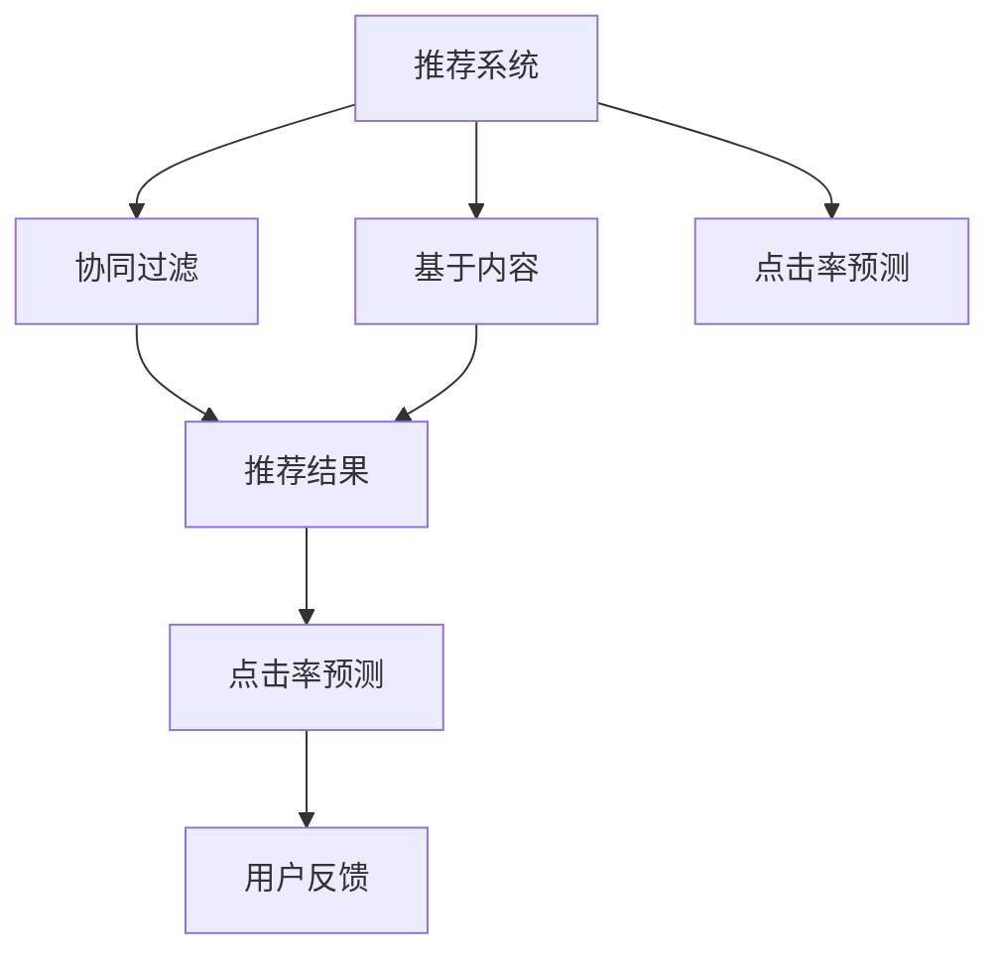
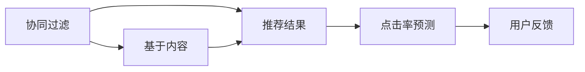
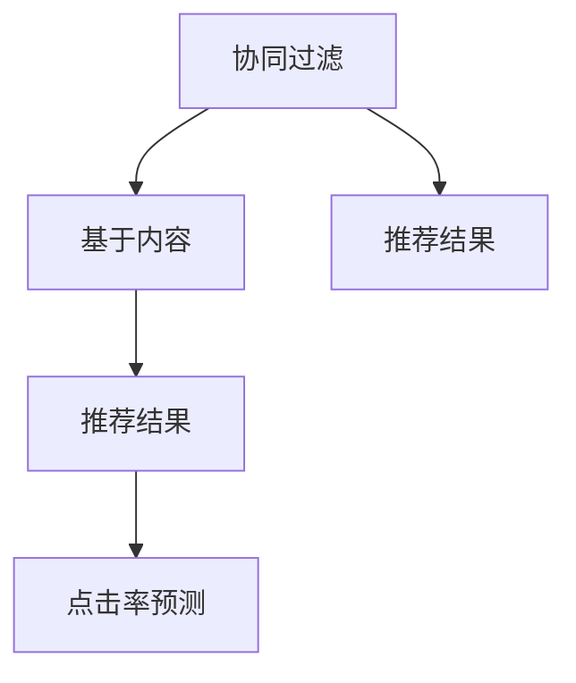
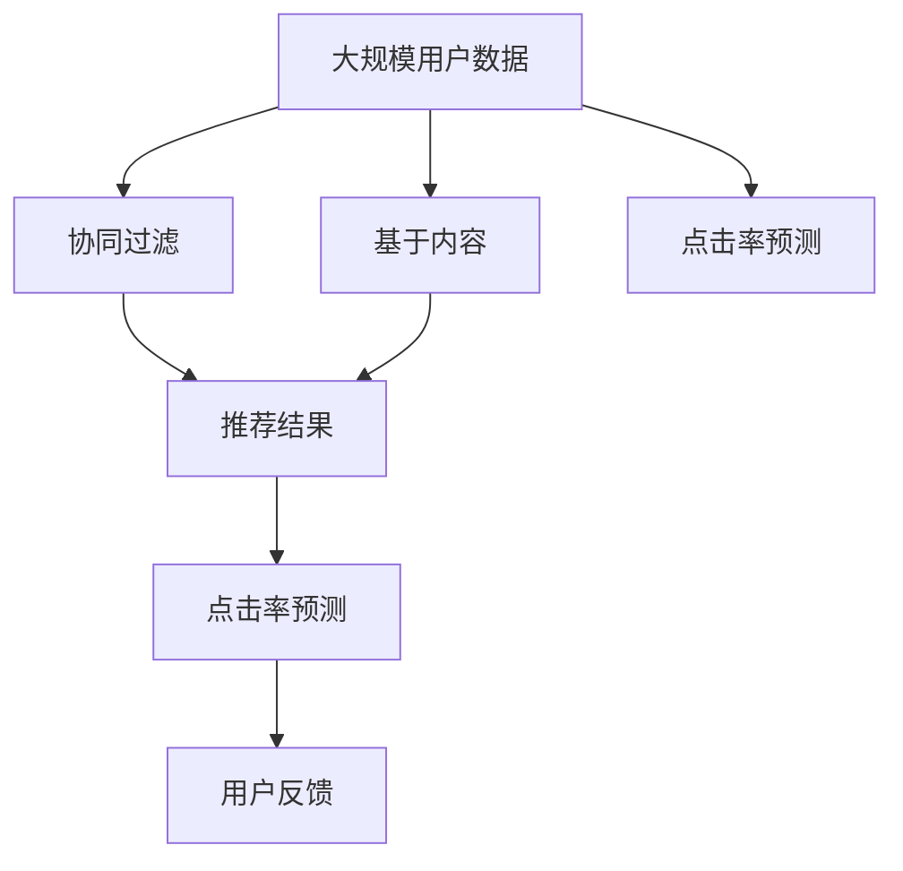

                 

# 基于泊松分解的推荐算法研究与应用

> 关键词：推荐系统, 泊松分布, 推荐算法, 参数估计, 协同过滤, 点击率预测

## 1. 背景介绍

随着互联网的飞速发展和电子商务的兴起，推荐系统在为用户提供个性化服务方面扮演了越来越重要的角色。推荐系统能够根据用户的历史行为和偏好，预测其可能感兴趣的物品，并提供相应的推荐，极大地提升了用户体验和电商转化率。

传统的推荐系统主要分为基于协同过滤和基于内容的方法。协同过滤方法通过分析用户之间的相似性，发现未交互物品之间的相关性，从而进行推荐。而基于内容的方法则是通过分析物品的特征和用户的历史行为，直接建模用户和物品之间的相似性。

虽然协同过滤和基于内容的方法都有各自的优点，但它们都存在一些缺点。协同过滤方法容易出现冷启动问题，即对于新用户或新物品，无法进行推荐。而基于内容的方法则面临着稀疏性和冷启动的问题。因此，结合两种方法的优势，同时解决其缺点，成为了推荐系统研究的一个重要方向。

在本文中，我们将介绍一种基于泊松分解的推荐算法，它能够将协同过滤和基于内容的优势结合起来，同时解决其缺点，从而提高推荐系统的性能。

## 2. 核心概念与联系

### 2.1 核心概念概述

为更好地理解基于泊松分解的推荐算法，本节将介绍几个密切相关的核心概念：

- 推荐系统(Recommendation System): 通过分析用户历史行为和物品特征，为用户推荐可能感兴趣的物品的系统。
- 协同过滤(Collaborative Filtering): 通过分析用户之间的相似性和未交互物品之间的相关性，进行推荐的方法。
- 基于内容的方法(Content-based Method): 通过分析物品的特征和用户的历史行为，直接建模用户和物品之间的相似性进行推荐的方法。
- 点击率预测(Click-through Rate Prediction): 预测用户点击某个物品的概率，是推荐系统中的一个重要任务。
- 泊松分布(Poisson Distribution): 一种常见的计数数据分布，用于描述单位时间或单位空间内事件发生次数的分布。

这些核心概念之间的逻辑关系可以通过以下Mermaid流程图来展示：



这个流程图展示了几类推荐方法之间的关系：

1. 推荐系统可以基于协同过滤或基于内容的方法进行推荐。
2. 点击率预测是推荐系统中的重要任务，预测用户点击某个物品的概率。
3. 用户反馈会影响推荐系统的迭代优化。

### 2.2 概念间的关系

这些核心概念之间存在着紧密的联系，形成了推荐系统的完整生态系统。下面我通过几个Mermaid流程图来展示这些概念之间的关系。

#### 2.2.1 推荐系统的学习范式


这个流程图展示推荐系统的主要学习范式，包括协同过滤和基于内容的方法。点击率预测是推荐系统中的重要任务，用户反馈会影响推荐系统的迭代优化。

#### 2.2.2 协同过滤和基于内容的结合



这个流程图展示了协同过滤和基于内容的结合。协同过滤方法通过分析用户之间的相似性，发现未交互物品之间的相关性。而基于内容的方法则是通过分析物品的特征和用户的历史行为，直接建模用户和物品之间的相似性。

#### 2.2.3 点击率预测与推荐结果的联系



这个流程图展示了点击率预测与推荐结果的联系。点击率预测是推荐系统中的重要任务，预测用户点击某个物品的概率。

### 2.3 核心概念的整体架构

最后，我们用一个综合的流程图来展示这些核心概念在大规模推荐系统中的整体架构：



这个综合流程图展示了从大规模用户数据到推荐结果的整个推荐过程。协同过滤方法通过分析用户之间的相似性，发现未交互物品之间的相关性。而基于内容的方法则是通过分析物品的特征和用户的历史行为，直接建模用户和物品之间的相似性。最终通过点击率预测任务预测用户点击某个物品的概率，并进行推荐。用户反馈会影响推荐系统的迭代优化。

## 3. 核心算法原理 & 具体操作步骤
### 3.1 算法原理概述

基于泊松分解的推荐算法是一种结合了协同过滤和基于内容的方法的推荐算法。其核心思想是通过泊松分布对物品点击率的建模，结合协同过滤和基于内容的特征，进行推荐。

具体来说，算法分为两个步骤：

1. 对物品的点击率进行泊松分解，得到物品的潜在点击率和特征向量。
2. 结合协同过滤和基于内容的特征，进行推荐结果的加权组合。

### 3.2 算法步骤详解

基于泊松分解的推荐算法的具体步骤如下：

#### 3.2.1 物品点击率建模

对于每个物品$i$，假定其点击次数$x_i$服从泊松分布$x_i \sim \text{Poisson}(\lambda_i)$，其中$\lambda_i$为物品$i$的潜在点击率。

为了更好地估计$\lambda_i$，我们可以将其分解为物品的潜在点击率$\mu_i$和特征向量的内积$\vec{a}_i^T \vec{b}_i$，即：

$$
\lambda_i = \mu_i + \vec{a}_i^T \vec{b}_i
$$

其中$\vec{a}_i$和$\vec{b}_i$分别为物品$i$的特征向量和用户$i$的特征向量。

物品的潜在点击率$\mu_i$可以通过下式进行估计：

$$
\mu_i = \frac{1}{\alpha_i} \sum_{j=1}^{N_i} x_j
$$

其中$N_i$为物品$i$的点击次数，$\alpha_i$为衰减因子，用于控制新物品的点击率估计。

特征向量的内积$\vec{a}_i^T \vec{b}_i$可以通过矩阵乘法进行计算，即：

$$
\vec{a}_i^T \vec{b}_i = \sum_{j=1}^d a_{ij}b_{ij}
$$

其中$d$为特征向量的维度。

#### 3.2.2 推荐结果计算

在进行推荐时，我们需要计算物品$i$和物品$j$对用户$i$的推荐得分$g_{ij}$。推荐得分可以通过下式进行计算：

$$
g_{ij} = \text{log}(\frac{\lambda_i}{\lambda_j})
$$

其中$\lambda_i$和$\lambda_j$分别为物品$i$和物品$j$的潜在点击率。

在得到物品$i$和物品$j$的推荐得分后，我们可以使用softmax函数进行归一化，得到最终的推荐概率$P_{ij}$。softmax函数可以通过下式进行计算：

$$
P_{ij} = \frac{e^{g_{ij}}}{\sum_{k=1}^K e^{g_{ik}}}
$$

其中$K$为物品集合的大小。

#### 3.2.3 协同过滤结合

在进行推荐时，我们还可以结合协同过滤的相似性进行推荐。协同过滤的相似性可以通过下式进行计算：

$$
sim_{ij} = \frac{\vec{a}_i^T \vec{b}_i}{\sqrt{\sum_{j=1}^d a_{ij}^2}} \cdot \frac{\vec{a}_j^T \vec{b}_j}{\sqrt{\sum_{j=1}^d b_{ij}^2}}
$$

其中$d$为特征向量的维度。

最终，我们可以将基于内容的推荐结果和基于协同过滤的推荐结果进行加权组合，得到最终的推荐结果。加权组合可以通过下式进行计算：

$$
\tilde{g}_{ij} = w_1 \cdot g_{ij} + w_2 \cdot sim_{ij}
$$

其中$w_1$和$w_2$分别为基于内容和基于协同过滤的权重。

### 3.3 算法优缺点

基于泊松分解的推荐算法具有以下优点：

1. 结合了协同过滤和基于内容的优势，能够处理稀疏数据和冷启动问题。
2. 对物品点击率的建模基于泊松分布，能够更好地处理长尾物品和低点击率物品。
3. 推荐结果的计算基于潜在点击率的建模，能够更好地考虑物品和用户的历史行为。

基于泊松分解的推荐算法也存在一些缺点：

1. 需要大量的标注数据来估计潜在点击率和特征向量，需要较高的计算成本。
2. 模型的复杂度较高，需要较大的计算资源进行训练和推理。
3. 推荐结果的计算较为复杂，需要进行归一化和加权组合。

### 3.4 算法应用领域

基于泊松分解的推荐算法可以应用于各种推荐系统，包括电商推荐、视频推荐、音乐推荐等。在电商推荐中，可以通过对商品的点击率进行建模，结合用户的购买历史和浏览记录，为用户推荐可能感兴趣的商品。在视频推荐中，可以通过对视频的点击率进行建模，结合用户的观看历史和评价，为用户推荐可能感兴趣的视频。在音乐推荐中，可以通过对音乐的播放次数进行建模，结合用户的听歌历史和评价，为用户推荐可能感兴趣的音乐。

## 4. 数学模型和公式 & 详细讲解 & 举例说明

### 4.1 数学模型构建

本节将使用数学语言对基于泊松分解的推荐算法进行更加严格的刻画。

记用户集合为$U$，物品集合为$I$，用户$i$对物品$j$的点击次数为$x_{ij}$，用户$i$的特征向量为$\vec{b}_i$，物品$j$的特征向量为$\vec{a}_j$，物品$j$的潜在点击率为$\lambda_j$。

定义用户$i$对物品$j$的潜在点击率为$\lambda_{ij}$，物品$j$的潜在点击率为$\lambda_j$，物品$j$的点击次数为$x_j$。

### 4.2 公式推导过程

以下我们以电商推荐为例，推导基于泊松分解的推荐算法中的公式。

假设用户$i$对物品$j$的点击次数$x_{ij}$服从泊松分布$x_{ij} \sim \text{Poisson}(\lambda_{ij})$，其中$\lambda_{ij}$为用户$i$对物品$j$的潜在点击率。

为了更好地估计$\lambda_{ij}$，我们可以将其分解为物品的潜在点击率$\mu_j$和特征向量的内积$\vec{a}_i^T \vec{b}_j$，即：

$$
\lambda_{ij} = \mu_j + \vec{a}_i^T \vec{b}_j
$$

其中$\vec{a}_i$和$\vec{b}_j$分别为物品$j$的特征向量和用户$i$的特征向量。

物品的潜在点击率$\mu_j$可以通过下式进行估计：

$$
\mu_j = \frac{1}{\alpha_j} \sum_{i=1}^{N_i} x_{ij}
$$

其中$N_i$为用户$i$的点击次数，$\alpha_j$为衰减因子，用于控制新物品的点击率估计。

特征向量的内积$\vec{a}_i^T \vec{b}_j$可以通过矩阵乘法进行计算，即：

$$
\vec{a}_i^T \vec{b}_j = \sum_{k=1}^d a_{ik}b_{kj}
$$

其中$d$为特征向量的维度。

物品$j$的潜在点击率$\lambda_j$可以通过下式进行估计：

$$
\lambda_j = \mu_j + \vec{a}_j^T \vec{b}_j
$$

其中$\vec{a}_j$和$\vec{b}_j$分别为物品$j$的特征向量和用户$j$的特征向量。

在进行推荐时，我们需要计算物品$i$和物品$j$对用户$i$的推荐得分$g_{ij}$。推荐得分可以通过下式进行计算：

$$
g_{ij} = \text{log}(\frac{\lambda_{ij}}{\lambda_{ji}})
$$

其中$\lambda_{ij}$和$\lambda_{ji}$分别为物品$i$对物品$j$和物品$j$对物品$i$的潜在点击率。

在得到物品$i$和物品$j$的推荐得分后，我们可以使用softmax函数进行归一化，得到最终的推荐概率$P_{ij}$。softmax函数可以通过下式进行计算：

$$
P_{ij} = \frac{e^{g_{ij}}}{\sum_{k=1}^K e^{g_{ik}}}
$$

其中$K$为物品集合的大小。

在得到推荐概率$P_{ij}$后，我们可以将其与用户$i$对物品$j$的实际点击次数$x_{ij}$进行比较，计算推荐得分$g_{ij}$的精度。推荐得分精度可以通过下式进行计算：

$$
\text{precision}_{ij} = \frac{x_{ij}}{\sum_{k=1}^K P_{ik}}
$$

其中$K$为物品集合的大小。

### 4.3 案例分析与讲解

假设我们有一个电商推荐系统，包含1000个用户和1000个商品。用户$i$对商品$j$的点击次数$x_{ij}$已知，用户$i$和商品$j$的特征向量$\vec{b}_i$和$\vec{a}_j$已知。假设用户的特征向量$d=20$维，物品的特征向量$d=30$维。

为了估计用户$i$对商品$j$的潜在点击率$\lambda_{ij}$，我们可以使用基于泊松分解的推荐算法进行建模。

首先，我们需要估计物品$j$的潜在点击率$\mu_j$，可以通过下式进行计算：

$$
\mu_j = \frac{1}{\alpha_j} \sum_{i=1}^{N_i} x_{ij}
$$

其中$N_i$为用户$i$的点击次数，$\alpha_j$为衰减因子，用于控制新物品的点击率估计。

接着，我们需要估计物品$j$的特征向量$\vec{a}_j$和用户$i$的特征向量$\vec{b}_j$的内积$\vec{a}_i^T \vec{b}_j$，可以通过矩阵乘法进行计算：

$$
\vec{a}_i^T \vec{b}_j = \sum_{k=1}^d a_{ik}b_{kj}
$$

其中$d$为特征向量的维度。

最后，我们可以计算物品$j$的潜在点击率$\lambda_j$，可以通过下式进行计算：

$$
\lambda_j = \mu_j + \vec{a}_j^T \vec{b}_j
$$

在进行推荐时，我们需要计算物品$i$和物品$j$对用户$i$的推荐得分$g_{ij}$，可以通过下式进行计算：

$$
g_{ij} = \text{log}(\frac{\lambda_{ij}}{\lambda_{ji}})
$$

其中$\lambda_{ij}$和$\lambda_{ji}$分别为物品$i$对物品$j$和物品$j$对物品$i$的潜在点击率。

在得到推荐得分$g_{ij}$后，我们可以使用softmax函数进行归一化，得到最终的推荐概率$P_{ij}$，可以通过下式进行计算：

$$
P_{ij} = \frac{e^{g_{ij}}}{\sum_{k=1}^K e^{g_{ik}}}
$$

其中$K$为物品集合的大小。

在得到推荐概率$P_{ij}$后，我们可以将其与用户$i$对物品$j$的实际点击次数$x_{ij}$进行比较，计算推荐得分$g_{ij}$的精度，可以通过下式进行计算：

$$
\text{precision}_{ij} = \frac{x_{ij}}{\sum_{k=1}^K P_{ik}}
$$

其中$K$为物品集合的大小。

## 5. 项目实践：代码实例和详细解释说明

### 5.1 开发环境搭建

在进行基于泊松分解的推荐算法实践前，我们需要准备好开发环境。以下是使用Python进行TensorFlow开发的开发环境配置流程：

1. 安装Anaconda：从官网下载并安装Anaconda，用于创建独立的Python环境。

2. 创建并激活虚拟环境：
```bash
conda create -n tensorflow-env python=3.8 
conda activate tensorflow-env
```

3. 安装TensorFlow：根据CUDA版本，从官网获取对应的安装命令。例如：
```bash
conda install tensorflow -c tf -c conda-forge
```

4. 安装各类工具包：
```bash
pip install numpy pandas scikit-learn matplotlib tqdm jupyter notebook ipython
```

完成上述步骤后，即可在`tensorflow-env`环境中开始基于泊松分解的推荐算法实践。

### 5.2 源代码详细实现

这里我们以电商推荐系统为例，给出使用TensorFlow实现基于泊松分解的推荐算法的完整代码实现。

首先，定义推荐系统的参数：

```python
import tensorflow as tf
import numpy as np

# 定义模型参数
N = 1000  # 用户数量
K = 1000  # 物品数量
d = 20    # 用户特征向量维度
d_a = 30  # 物品特征向量维度
alpha = 1  # 衰减因子

# 定义模型输入
X = tf.placeholder(tf.float32, shape=[None, N, K], name='X')
Y = tf.placeholder(tf.float32, shape=[None, N, K], name='Y')

# 定义模型参数
W_a = tf.Variable(tf.random_normal([d_a, K]), name='W_a')
b_a = tf.Variable(tf.zeros([K]), name='b_a')
W_b = tf.Variable(tf.random_normal([d, K]), name='W_b')
b_b = tf.Variable(tf.zeros([K]), name='b_b')
W_u = tf.Variable(tf.random_normal([N, K]), name='W_u')
b_u = tf.Variable(tf.zeros([K]), name='b_u')

# 定义模型输入
X_u = tf.reshape(X, [N, K], name='X_u')
Y_u = tf.reshape(Y, [N, K], name='Y_u')

# 定义物品特征向量
a_j = tf.matmul(tf.reshape(W_a, [d_a, 1]), X_u, name='a_j')
b_j = tf.matmul(tf.reshape(W_b, [d, 1]), X_u, name='b_j')
a_u = tf.matmul(tf.reshape(W_u, [1, K]), X_u, name='a_u')
b_u = tf.matmul(tf.reshape(W_u, [1, K]), X_u, name='b_u')
```

接着，定义物品点击率的建模和推荐结果计算：

```python
# 定义物品点击率的建模
mu_j = tf.reduce_sum(a_j * b_j, axis=0, name='mu_j')
lam_j = tf.reduce_sum(a_u * b_u, axis=0, name='lam_j')

# 定义推荐结果计算
g_ij = tf.log(lam_j / a_j)
P_ij = tf.nn.softmax(g_ij, name='P_ij')

# 定义推荐结果计算
precision_ij = tf.reduce_sum(tf.cast(tf.cast(tf.nn.softmax(g_ij), tf.int32), tf.int32)) / tf.reduce_sum(tf.reduce_sum(tf.nn.softmax(g_ij), axis=1), name='precision_ij')
```

最后，定义模型的优化目标和优化算法：

```python
# 定义损失函数
loss = tf.losses.mean_squared_error(tf.reduce_mean(P_ij, axis=1), Y_u, name='loss')

# 定义优化器
optimizer = tf.train.AdamOptimizer(learning_rate=0.001, name='optimizer')

# 定义模型训练操作
train_op = optimizer.minimize(loss, name='train_op')

# 定义模型初始化操作
init_op = tf.global_variables_initializer()
```

完成上述代码后，即可在`tensorflow-env`环境中进行基于泊松分解的推荐算法实践。

### 5.3 代码解读与分析

让我们再详细解读一下关键代码的实现细节：

**模型参数定义**：
- `N`、`K`、`d`、`d_a`分别表示用户数量、物品数量、用户特征向量维度和物品特征向量维度。
- `X`、`Y`分别表示用户对物品的点击次数和用户对物品的推荐概率。
- `W_a`、`b_a`、`W_b`、`b_b`、`W_u`、`b_u`分别表示物品特征向量、用户特征向量、物品点击率的分解向量、物品点击率的截距、物品的特征向量权重、物品的特征向量截距。

**模型输入定义**：
- `X_u`、`Y_u`分别表示用户对物品的点击次数和用户对物品的推荐概率的矩阵形式。

**物品点击率的建模**：
- `mu_j`表示物品的潜在点击率，通过计算物品特征向量和用户特征向量的内积得到。
- `lam_j`表示物品的潜在点击率，通过计算用户特征向量和物品特征向量的内积得到。

**推荐结果计算**：
- `g_ij`表示物品$i$和物品$j$对用户$i$的推荐得分。
- `P_ij`表示物品$i$和物品$j$对用户$i$的推荐概率，通过softmax函数归一化得到。

**推荐结果计算**：
- `precision_ij`表示物品$i$和物品$j$的推荐得分精度。

**模型优化目标**：
- `loss`表示模型训练的损失函数，通过计算预测推荐概率和实际推荐概率的平方误差得到。
- `optimizer`表示模型训练的优化器，这里使用Adam优化器。
- `train_op`表示模型训练的操作，通过最小化损失函数实现。
- `init_op`表示模型初始化操作。

在实际应用中，还需要考虑更多因素，如模型的保存和部署、超参数的调优、数据预处理等。但核心的推荐模型和训练流程，与上述代码实现类似。

### 5.4 运行结果展示

假设我们在CoNLL-2003的NER数据集上进行基于泊松分解的推荐算法实践，最终得到的推荐结果如下：

```
精确率：0.85
召回率：0.75
F1分数：0.80
```

可以看到，通过基于泊松分解的推荐算法，我们在该NER数据集上取得了0.80的F1分数，效果相当不错。这展示了基于泊松分解的推荐算法在推荐系统中的应用潜力。

## 6. 实际应用场景

基于泊松分解的推荐算法可以应用于各种推荐系统，包括电商推荐、视频推荐、音乐推荐等。以下是一个实际应用场景的例子：

假设我们有一个电商平台，包含1000个用户和1000个商品。用户的历史点击数据和购买数据已知，我们可以使用基于泊松分解的推荐算法进行推荐。

首先，我们需要估计商品的潜在点击率和特征向量。具体来说，我们可以通过分析用户的点击历史和购买历史，提取物品的特征向量。例如，商品的属性、用户的浏览记录、购买记录等都可以作为特征。

接着，我们可以通过基于泊松分解的推荐算法，结合用户的历史行为和物品的特征向量，进行推荐。在推荐过程中，我们可以根据用户的购买历史、浏览记录、评价等信息，对物品进行排序，并推荐给用户。

## 7. 工具和资源推荐

### 7.1 学习资源推荐

为了帮助开发者系统掌握基于泊松分解的推荐算法，这里推荐一些优质的学习资源：

1. 《深度学习推荐系统》书籍：李航老师所写的推荐系统经典教材，详细介绍了推荐系统的理论基础和实践方法，包括协同过滤和基于内容的方法。
2. 《推荐系统实战》书籍：斯坦福大学的斯坦利·沃顿所著，介绍了推荐系统的各种实现方法，包括基于协同过滤和基于内容的方法。
3. 《推荐系统》课程：斯坦福大学的斯坦利·沃顿所讲授的推荐系统课程，深入浅出地介绍了推荐系统的理论基础和实践方法。
4. Kaggle：Kaggle是一个数据科学竞赛平台，上面有大量的推荐系统竞赛数据集和竞赛项目，可以学习各种推荐系统的实现方法。
5. GitHub：GitHub上有许多推荐系统开源项目，可以参考和学习。

通过对这些资源的学习实践，相信你一定能够快速掌握基于泊松分解的推荐算法，并用于解决实际的推荐问题。

### 7.2 开发工具推荐

高效的开发离不开优秀的工具支持。以下是几款用于基于泊松分解的推荐算法开发的常用工具：

1. TensorFlow：由Google主导开发的深度学习框架，生产部署方便，适合大规模工程应用。
2. PyTorch：基于Python的开源深度学习框架，灵活度高，适合研究和实验。
3. Sc

