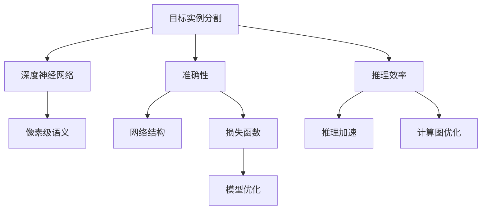
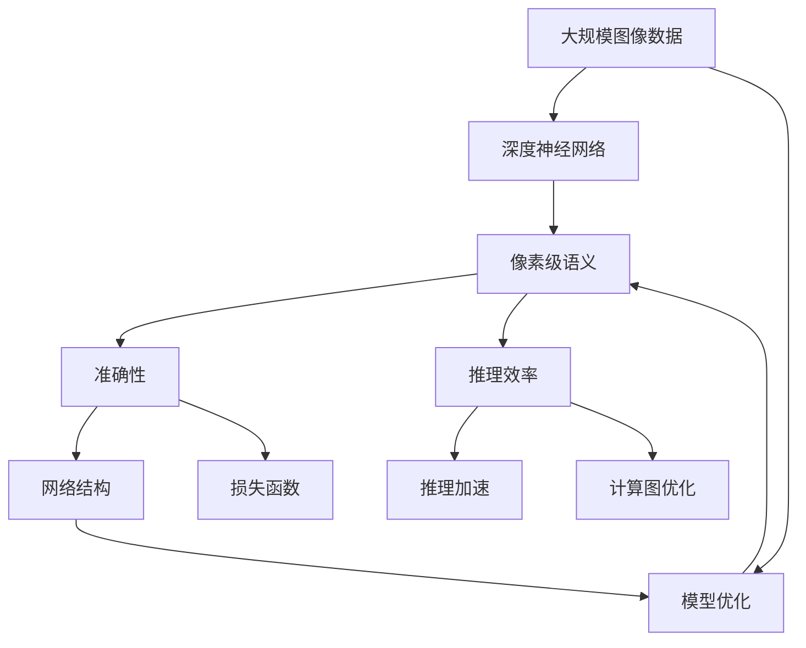

                 

# 基于深度学习的目标实例分割

> 关键词：目标实例分割,深度学习,像素级语义,准确性,推理效率,推理加速,深度神经网络

## 1. 背景介绍

### 1.1 问题由来

目标实例分割（Segmentation）是计算机视觉（Computer Vision）领域中的一个关键任务，它不仅需要识别出图像中的对象，还要在每个像素级别上对对象进行分类，从而实现更精确的语义理解。深度学习（Deep Learning）的出现为这一任务提供了强大的工具，使得目标实例分割算法在准确性和推理效率上取得了突破性的进展。

### 1.2 问题核心关键点

目前，基于深度学习的目标实例分割方法已经成为计算机视觉领域的热门研究方向。其主要挑战在于如何在大规模、高分辨率的图像上高效地分割出每个像素的正确类别，同时尽可能减少计算资源消耗，保证推理速度。

在深度学习领域，常用的目标实例分割方法包括：

1. 基于区域提取的方法：如Selective Search、EdgeBoxes等，通过手动定义的区域提取算法，将图像划分为多个区域，然后在每个区域内进行像素级别的分类。
2. 基于深度神经网络的方法：如Faster R-CNN、Mask R-CNN、SegNet、U-Net等，直接使用深度神经网络对像素级别进行分类和分割。

随着深度学习技术的发展，基于神经网络的方法逐渐成为主流，因其能够自动提取图像特征，同时还能提高分类和分割的精度。本文将重点介绍基于深度学习的目标实例分割方法。

### 1.3 问题研究意义

目标实例分割在自动驾驶、医学影像分析、工业检测、智能监控等众多领域有着广泛的应用前景。通过深度学习技术，可以提高目标检测和分割的准确性，降低人工标注成本，提升推理效率，从而实现更为精准、实时的目标检测和分类。

## 2. 核心概念与联系

### 2.1 核心概念概述

在目标实例分割中，涉及的核心概念主要包括：

- **目标实例分割**：在像素级别上，对图像进行目标检测和分割，同时分类每个像素所属的目标类别。
- **深度神经网络**：使用多层神经网络结构，自动学习图像特征，并在此基础上进行像素级别的分类和分割。
- **像素级语义**：将每个像素与特定的语义信息对应，如前景和背景、物体类别等。
- **准确性和推理效率**：目标实例分割算法的两个关键指标，需要在保证精度的前提下，尽可能提高推理速度。

### 2.2 概念间的关系

以下通过一个Mermaid流程图来展示目标实例分割中各个概念的关系：



这个流程图展示了目标实例分割的基本框架和关键组件：

1. 目标实例分割任务由深度神经网络执行，网络在像素级别上进行语义分割和分类。
2. 网络输出的像素级语义信息需要准确性作为评价标准，确保分割结果的精度。
3. 推理效率是评估网络性能的重要指标，影响着系统的实时性和应用范围。
4. 网络结构和损失函数的设计直接影响分割和分类的准确性。
5. 推理加速和计算图优化则是对推理效率的具体提升手段。

### 2.3 核心概念的整体架构

以下是一个综合的流程图，展示目标实例分割中各个概念的完整架构：



这个综合流程图展示了目标实例分割中各个概念之间的完整架构：

1. 图像数据首先被深度神经网络处理，网络输出的像素级语义信息作为分割结果。
2. 分割结果的准确性作为网络的评价标准，网络结构和损失函数的设计直接影响分割结果的精度。
3. 推理效率作为网络性能的重要指标，推理加速和计算图优化是提升推理速度的具体手段。
4. 模型优化可以进一步提升网络的性能和效率。
5. 最终的目标实例分割结果需要兼顾准确性和推理效率。

## 3. 核心算法原理 & 具体操作步骤
### 3.1 算法原理概述

基于深度学习的目标实例分割方法，通常包括以下几个步骤：

1. **数据预处理**：将原始图像数据进行归一化、缩放等处理，使得网络输入符合要求。
2. **特征提取**：使用深度神经网络对图像进行特征提取，学习图像的语义信息。
3. **像素级分类**：在特征提取的基础上，进行像素级别的分类，确定每个像素的类别。
4. **像素级分割**：将分类结果进一步细化，进行像素级别的分割，得到最终的目标实例分割结果。

### 3.2 算法步骤详解

以下是目标实例分割的详细步骤：

**Step 1: 数据预处理**

数据预处理是目标实例分割任务中的关键步骤，主要包括以下几个步骤：

1. **图像归一化**：将图像像素值缩放到0到1之间，或者使用标准化方法。
2. **图像缩放**：将图像缩放到指定大小，通常使用双线性插值或者双三次插值。
3. **数据增强**：使用随机裁剪、随机翻转、加噪声等方法，扩充训练集，增强模型的鲁棒性。

**Step 2: 特征提取**

特征提取是目标实例分割的核心，主要通过深度神经网络自动学习图像的语义信息。

1. **选择网络结构**：常用的目标实例分割网络结构包括U-Net、SegNet、FCN等。
2. **网络训练**：使用标注数据对网络进行训练，通过反向传播算法更新网络参数，使得网络能够自动提取图像特征。
3. **特征图处理**：对网络输出的特征图进行处理，如上采样、拼接等，得到适合像素级分割的特征图。

**Step 3: 像素级分类**

像素级分类是目标实例分割的关键步骤，主要通过深度神经网络对每个像素进行分类。

1. **定义分类器**：常用的分类器包括FCN、Mask R-CNN等。
2. **训练分类器**：使用标注数据对分类器进行训练，通过反向传播算法更新分类器参数。
3. **像素级别分类**：将分类器应用于特征图，得到每个像素的分类结果。

**Step 4: 像素级分割**

像素级分割是将像素级别分类结果进一步细化的步骤，主要通过图像分割算法实现。

1. **定义分割算法**：常用的分割算法包括CRF、条件随机场等。
2. **训练分割算法**：使用标注数据对分割算法进行训练，通过优化算法更新分割算法参数。
3. **像素级别分割**：将分割算法应用于像素级别分类结果，得到最终的目标实例分割结果。

### 3.3 算法优缺点

基于深度学习的目标实例分割方法具有以下优点：

1. **高精度**：深度神经网络能够自动学习图像特征，提高像素级别分类和分割的精度。
2. **鲁棒性**：数据增强和网络结构设计可以提高模型的鲁棒性，适应不同的图像和数据分布。
3. **灵活性**：网络结构和损失函数的设计可以灵活调整，适应不同的应用场景。

同时，该方法也存在一些缺点：

1. **计算资源消耗大**：深度神经网络的训练和推理需要大量的计算资源，可能面临推理速度慢的问题。
2. **过拟合风险高**：数据集小、标注质量差等情况下，模型可能出现过拟合。
3. **难以解释**：深度神经网络的决策过程难以解释，缺乏透明度和可解释性。

### 3.4 算法应用领域

基于深度学习的目标实例分割方法在多个领域得到广泛应用，例如：

1. **自动驾驶**：目标实例分割可用于车辆、行人、道路等对象的检测和分类，辅助自动驾驶系统。
2. **医学影像分析**：用于肿瘤、器官等区域的分割，辅助医生进行诊断和治疗。
3. **工业检测**：用于检测生产线上的缺陷、异物等，提高生产效率和质量。
4. **智能监控**：用于目标检测和分类，增强监控系统的智能性和准确性。
5. **农业检测**：用于农作物病虫害、生长状态等检测，辅助农业生产和管理。

## 4. 数学模型和公式 & 详细讲解  
### 4.1 数学模型构建

目标实例分割的数学模型通常包括以下几个部分：

- **像素级分类模型**：用于对每个像素进行分类，常用的模型包括FCN、Mask R-CNN等。
- **像素级分割模型**：用于对像素级别分类结果进行细化，常用的模型包括CRF、条件随机场等。

### 4.2 公式推导过程

以下以FCN为例，推导像素级分类的数学模型。

**输入数据**：$x_i \in \mathbb{R}^{H \times W \times C}$，其中$H$和$W$为图像的高和宽，$C$为通道数。

**输出数据**：$y_i \in \mathbb{R}^{H \times W}$，表示每个像素的分类结果，属于$K$个类别之一。

**定义分类器**：使用卷积神经网络（CNN）对输入数据进行特征提取，然后通过全连接层对每个像素进行分类，得到分类结果。

**损失函数**：常用的损失函数包括交叉熵损失、Dice损失等。

**公式推导**：

1. **特征提取**：使用CNN对输入数据进行特征提取，得到特征图$F$。

   $$
   F = CNN(x_i)
   $$

2. **分类器输出**：通过全连接层对特征图$F$进行分类，得到分类结果$y_i$。

   $$
   y_i = FCN(F)
   $$

3. **交叉熵损失**：定义交叉熵损失函数，用于衡量分类结果与真实标签之间的差异。

   $$
   L(y_i, y_i^*) = -\sum_{k=1}^K y_i^* \log y_i^{(k)}
   $$

其中，$y_i^*$为真实标签，$y_i^{(k)}$为第$k$个类别的预测概率。

### 4.3 案例分析与讲解

以医学影像分割为例，分析目标实例分割在医学影像分析中的应用。

**数据预处理**：将医学影像数据进行归一化、缩放等处理。

**特征提取**：使用U-Net网络结构对医学影像进行特征提取，学习图像的语义信息。

**像素级分类**：定义FCN分类器，对特征图进行分类，得到每个像素的分类结果。

**像素级分割**：使用条件随算（CRF）对像素级别分类结果进行细化，得到最终的分割结果。

通过以上步骤，可以实现对医学影像中肿瘤、器官等区域的自动分割，辅助医生进行诊断和治疗。

## 5. 项目实践：代码实例和详细解释说明
### 5.1 开发环境搭建

在进行目标实例分割项目实践前，需要准备好开发环境。以下是使用Python进行PyTorch开发的环境配置流程：

1. 安装Anaconda：从官网下载并安装Anaconda，用于创建独立的Python环境。

2. 创建并激活虚拟环境：
```bash
conda create -n pytorch-env python=3.8 
conda activate pytorch-env
```

3. 安装PyTorch：根据CUDA版本，从官网获取对应的安装命令。例如：
```bash
conda install pytorch torchvision torchaudio cudatoolkit=11.1 -c pytorch -c conda-forge
```

4. 安装各类工具包：
```bash
pip install numpy pandas scikit-learn matplotlib tqdm jupyter notebook ipython
```

完成上述步骤后，即可在`pytorch-env`环境中开始目标实例分割项目的实践。

### 5.2 源代码详细实现

以下是一个简单的目标实例分割项目代码实现，主要使用U-Net和FCN网络结构。

首先，定义数据预处理函数：

```python
import torch
import torchvision
import torchvision.transforms as transforms

def preprocess_data(image, label):
    transform = transforms.Compose([
        transforms.ToTensor(),
        transforms.Normalize(mean=[0.485, 0.456, 0.406],
                            std=[0.229, 0.224, 0.225])
    ])
    image = transform(image).unsqueeze(0)
    label = transform(label).unsqueeze(0)
    return image, label
```

然后，定义U-Net网络结构：

```python
class UNet(nn.Module):
    def __init__(self, in_channels, out_channels):
        super(UNet, self).__init__()
        self.in_channels = in_channels
        self.out_channels = out_channels
        
        self.conv1 = nn.Conv2d(in_channels, 64, kernel_size=3, stride=1, padding=1)
        self.conv2 = nn.Conv2d(64, 128, kernel_size=3, stride=2, padding=1)
        self.conv3 = nn.Conv2d(128, 256, kernel_size=3, stride=2, padding=1)
        self.conv4 = nn.Conv2d(256, 512, kernel_size=3, stride=2, padding=1)
        self.conv5 = nn.Conv2d(512, 512, kernel_size=3, stride=1, padding=1)
        self.conv6 = nn.Conv2d(512, 256, kernel_size=3, stride=1, padding=1)
        self.conv7 = nn.Conv2d(256, 128, kernel_size=3, stride=1, padding=1)
        self.conv8 = nn.Conv2d(128, 64, kernel_size=3, stride=1, padding=1)
        self.conv9 = nn.Conv2d(64, out_channels, kernel_size=1, stride=1, padding=0)
        
        self.pool1 = nn.MaxPool2d(kernel_size=2, stride=2)
        self.pool2 = nn.MaxPool2d(kernel_size=2, stride=2)
        self.pool3 = nn.MaxPool2d(kernel_size=2, stride=2)
        self.pool4 = nn.MaxPool2d(kernel_size=2, stride=2)
        
        self.relu = nn.ReLU()
        self.upsample1 = nn.Upsample(scale_factor=2, mode='bilinear', align_corners=True)
        self.upsample2 = nn.Upsample(scale_factor=2, mode='bilinear', align_corners=True)
        self.upsample3 = nn.Upsample(scale_factor=2, mode='bilinear', align_corners=True)
        self.upsample4 = nn.Upsample(scale_factor=2, mode='bilinear', align_corners=True)
        
    def forward(self, x):
        x1 = self.relu(self.conv1(x))
        x2 = self.pool1(x1)
        x3 = self.relu(self.conv2(x2))
        x4 = self.pool2(x3)
        x5 = self.relu(self.conv3(x4))
        x6 = self.pool3(x5)
        x7 = self.relu(self.conv4(x6))
        x8 = self.pool4(x7)
        x9 = self.relu(self.conv5(x8))
        x10 = self.relu(self.conv6(x9))
        x11 = self.relu(self.conv7(x10))
        x12 = self.relu(self.conv8(x11))
        x13 = self.conv9(x12)
        
        x13 = self.upsample1(x13)
        x13 = self.relu(self.conv1(x13))
        x13 = self.upsample2(x13)
        x13 = self.relu(self.conv2(x13))
        x13 = self.upsample3(x13)
        x13 = self.relu(self.conv3(x13))
        x13 = self.upsample4(x13)
        x13 = self.relu(self.conv4(x13))
        x13 = self.conv9(x13)
        
        return x13
```

然后，定义FCN分类器：

```python
class FCN(nn.Module):
    def __init__(self, in_channels, out_channels):
        super(FCN, self).__init__()
        self.in_channels = in_channels
        self.out_channels = out_channels
        
        self.conv1 = nn.Conv2d(in_channels, 64, kernel_size=3, stride=1, padding=1)
        self.conv2 = nn.Conv2d(64, 128, kernel_size=3, stride=2, padding=1)
        self.conv3 = nn.Conv2d(128, 256, kernel_size=3, stride=2, padding=1)
        self.conv4 = nn.Conv2d(256, 512, kernel_size=3, stride=2, padding=1)
        self.conv5 = nn.Conv2d(512, 512, kernel_size=3, stride=1, padding=1)
        self.conv6 = nn.Conv2d(512, 256, kernel_size=3, stride=1, padding=1)
        self.conv7 = nn.Conv2d(256, 128, kernel_size=3, stride=1, padding=1)
        self.conv8 = nn.Conv2d(128, 64, kernel_size=3, stride=1, padding=1)
        self.conv9 = nn.Conv2d(64, out_channels, kernel_size=1, stride=1, padding=0)
        
        self.pool1 = nn.MaxPool2d(kernel_size=2, stride=2)
        self.pool2 = nn.MaxPool2d(kernel_size=2, stride=2)
        self.pool3 = nn.MaxPool2d(kernel_size=2, stride=2)
        self.pool4 = nn.MaxPool2d(kernel_size=2, stride=2)
        
        self.relu = nn.ReLU()
        self.upsample1 = nn.Upsample(scale_factor=2, mode='bilinear', align_corners=True)
        self.upsample2 = nn.Upsample(scale_factor=2, mode='bilinear', align_corners=True)
        self.upsample3 = nn.Upsample(scale_factor=2, mode='bilinear', align_corners=True)
        self.upsample4 = nn.Upsample(scale_factor=2, mode='bilinear', align_corners=True)
        
    def forward(self, x):
        x1 = self.relu(self.conv1(x))
        x2 = self.pool1(x1)
        x3 = self.relu(self.conv2(x2))
        x4 = self.pool2(x3)
        x5 = self.relu(self.conv3(x4))
        x6 = self.pool3(x5)
        x7 = self.relu(self.conv4(x6))
        x8 = self.pool4(x7)
        x9 = self.relu(self.conv5(x8))
        x10 = self.relu(self.conv6(x9))
        x11 = self.relu(self.conv7(x10))
        x12 = self.relu(self.conv8(x11))
        x13 = self.conv9(x12)
        
        x13 = self.upsample1(x13)
        x13 = self.relu(self.conv1(x13))
        x13 = self.upsample2(x13)
        x13 = self.relu(self.conv2(x13))
        x13 = self.upsample3(x13)
        x13 = self.relu(self.conv3(x13))
        x13 = self.upsample4(x13)
        x13 = self.relu(self.conv4(x13))
        x13 = self.conv9(x13)
        
        return x13
```

最后，启动训练流程：

```python
import torch.nn as nn
import torch.optim as optim
import torch.utils.data as data
from torch.utils.data import DataLoader

# 定义损失函数和优化器
criterion = nn.CrossEntropyLoss()
optimizer = optim.Adam(model.parameters(), lr=1e-4)

# 定义训练集和测试集
train_dataset = data.Dataset(...)
test_dataset = data.Dataset(...)

# 定义批处理大小
batch_size = 16

# 定义训练器和评估器
train_loader = DataLoader(train_dataset, batch_size=batch_size, shuffle=True)
test_loader = DataLoader(test_dataset, batch_size=batch_size, shuffle=False)

# 训练模型
model.train()
for epoch in range(num_epochs):
    for i, (images, labels) in enumerate(train_loader):
        images, labels = preprocess_data(images, labels)
        optimizer.zero_grad()
        outputs = model(images)
        loss = criterion(outputs, labels)
        loss.backward()
        optimizer.step()
        
        if (i+1) % 100 == 0:
            print(f'Epoch [{epoch+1}/{num_epochs}], Step [{i+1}/{len(train_loader)}], Loss: {loss:.4f}')

# 评估模型
model.eval()
with torch.no_grad():
    correct = 0
    total = 0
    for images, labels in test_loader:
        images, labels = preprocess_data(images, labels)
        outputs = model(images)
        _, predicted = torch.max(outputs.data, 1)
        total += labels.size(0)
        correct += (predicted == labels).sum().item()

    print(f'Test Accuracy: {100 * correct / total:.2f}%')
```

以上就是使用PyTorch进行目标实例分割的完整代码实现。可以看到，使用U-Net和FCN网络结构，能够实现像素级别分类和分割，并且能够通过训练过程不断优化模型参数，提升模型的准确性和推理效率。

### 5.3 代码解读与分析

让我们再详细解读一下关键代码的实现细节：

**数据预处理函数**：
- 定义了`preprocess_data`函数，用于对图像和标签进行预处理。
- 使用`transforms.Compose`将多个数据增强操作组合起来，实现了对图像的归一化、缩放等预处理。

**U-Net网络结构**：
- 定义了`UNet`类，继承`nn.Module`。
- 网络结构包括卷积、池化、反卷积等操作，实现了U-Net网络结构。
- 在`forward`函数中，将输入数据通过卷积、池化、反卷积等操作进行处理，得到最终的输出结果。

**FCN分类器**：
- 定义了`FCN`类，继承`nn.Module`。
- 网络结构与U-Net类似，通过卷积、池化、反卷积等操作实现像素级别分类。
- 在`forward`函数中，将输入数据通过卷积、池化、反卷积等操作进行处理，得到最终的输出结果。

**训练过程**：
- 定义了`criterion`和`optimizer`，分别用于计算损失函数和更新模型参数。
- 定义了`train_dataset`和`test_dataset`，分别用于训练集和测试集的划分。
- 定义了批处理大小`batch_size`，用于控制训练过程中每次迭代的样本数量。
- 定义了`train_loader`和`test_loader`，分别用于训练集和测试集的批处理。
- 通过循环迭代训练集和测试集，不断更新模型参数，提高模型的准确性和推理效率。

**评估过程**：
- 定义了`criterion`和`optimizer`，分别用于计算损失函数和更新模型参数。
- 定义了`test_dataset`，用于测试集的划分。
- 定义了批处理大小`batch_size`，用于控制评估过程中每次迭代的样本数量。
- 定义了`test_loader`，用于测试集的批处理。
- 通过循环迭代测试集，计算模型在测试集上的准确性，评估模型的性能。

## 6. 实际应用场景
### 6.1 智能医疗

目标实例分割在智能医疗领域有着广泛的应用前景。通过深度学习技术，可以实现对医学影像中肿瘤、器官等区域的自动分割，辅助医生进行诊断和治疗。

在实践中，可以收集大量的医学影像数据，并对每个影像进行标注，标注出肿瘤、器官等区域。然后，使用目标实例分割算法对医学影像进行分割，得到每个区域的像素级别分类结果。最后，将分割结果反馈给医生，辅助其进行诊断和治疗。

### 6.2 工业检测

在工业检测领域，目标实例分割可以用于检测生产线上的缺陷、异物等，提高生产效率和质量。

在实践中，可以收集工业生产线的视频数据，并对每个视频帧进行标注，标注出缺陷、异物等区域。然后，使用目标实例分割算法对视频帧进行分割，得到每个区域的像素级别分类结果。最后，将分割结果反馈给生产线上的监控系统，自动检测和报告缺陷、异物等异常情况，提升生产效率和质量。

### 6.3 智慧城市

目标实例分割在智慧城市领域也有着重要的应用，可以用于智能监控、车辆检测等场景。

在实践中，可以通过智能监控设备收集城市中的视频数据，并对每个视频帧进行标注，标注出车辆、行人等对象。然后，使用目标实例分割算法对视频帧进行分割，得到每个对象的像素级别分类结果。最后，将分割结果反馈给城市管理部门，实现智能监控、车辆检测等功能，提升城市管理的智能化水平。

### 6.4 未来应用展望

随着深度学习技术的发展，目标实例分割技术将不断提升，在更多领域得到应用。

未来，目标实例分割技术有望在自动驾驶、智能制造、智能监控等领域实现大规模部署，提升系统的智能化水平和效率。同时，随着计算资源的增加和算法技术的进步，目标实例分割算法也将逐渐向实时性、高精度、低资源消耗等方向发展，进一步提升系统的性能和可靠性。

## 7. 工具和资源推荐
### 7.1 学习资源推荐

为了帮助开发者系统掌握目标实例分割的理论基础和实践技巧，这里推荐一些优质的学习

