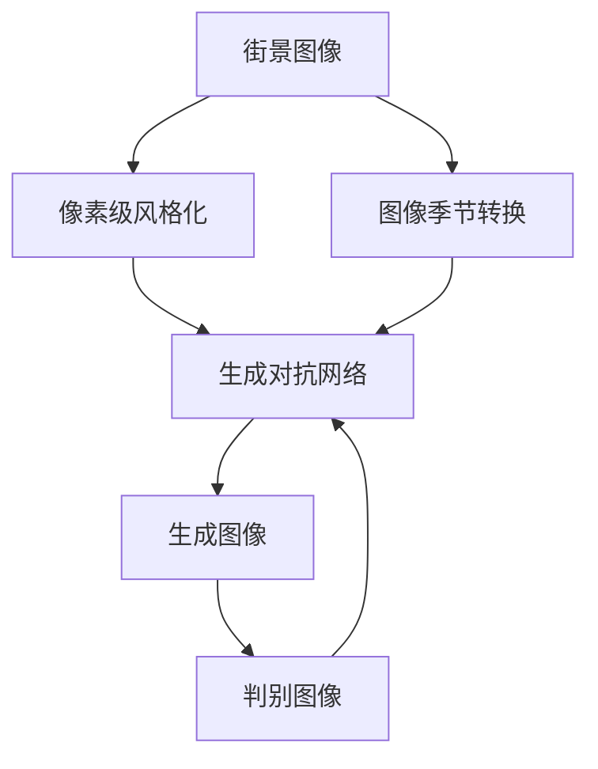
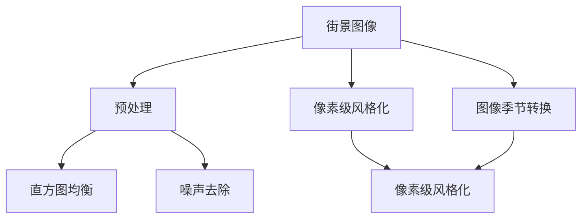
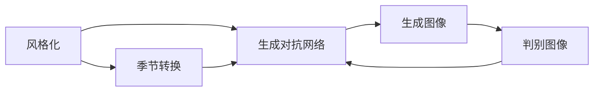
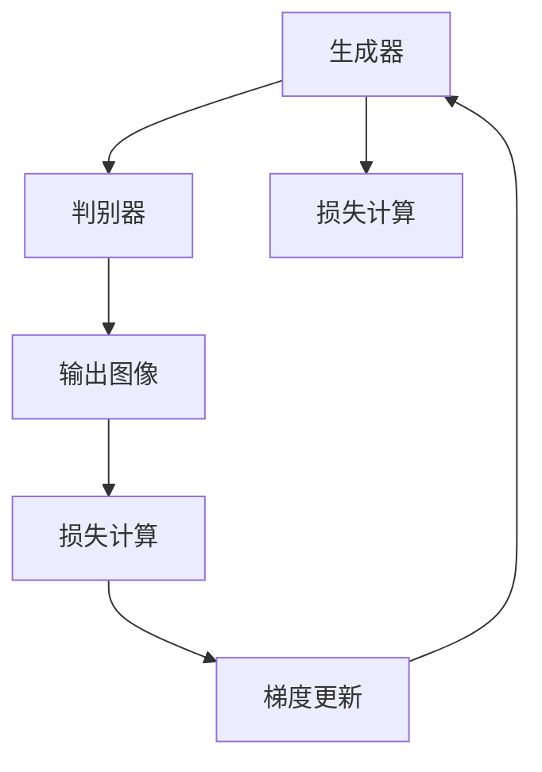
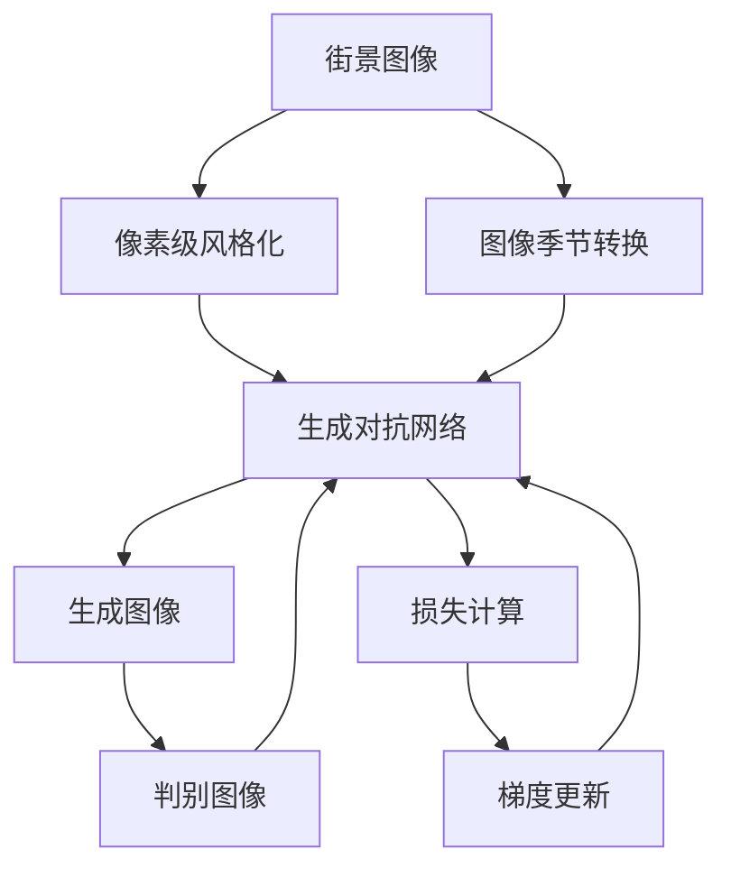

                 

# 基于生成对抗网络的街景图像风格化和季节转换研究

> 关键词：
街景图像风格化, 生成对抗网络, 季节转换, 图像处理, 深度学习

## 1. 背景介绍

### 1.1 问题由来
街景图像在城市管理、智能驾驶、旅游导览等众多领域具有重要价值，但受光照、季节等因素影响，图像质量和风格差异较大，难以直接用于统一分析、识别和应用。风格化和季节转换技术能显著提升街景图像的质量和一致性，为后续处理奠定基础。

### 1.2 问题核心关键点
目前，基于生成对抗网络(Generative Adversarial Network, GAN)的风格化和季节转换技术，通过将输入图像作为真实图像，生成器生成伪造图像，判别器区分真实与伪造图像，不断优化生成器参数，使其生成的图像逼近真实图像。这一过程被称为GAN的对抗训练，可实现高效的图像风格化和季节转换。

### 1.3 问题研究意义
研究GAN技术在街景图像风格化和季节转换中的应用，对于提升街景图像的视觉一致性、质量提升、便捷应用，具有重要意义：

1. 增强图像质量：风格化和季节转换技术可平滑图像色彩，增强对比度和细节，提升街景图像的美观度和可用性。
2. 统一图像风格：通过统一的视觉风格，降低图像处理的复杂度，实现街景图像的快速展示和分析。
3. 提升用户感知：用户通过风格化和季节转换后的图像，更容易理解城市环境，提高出行体验和满意度。
4. 实现跨季节分析：通过季节转换技术，能够获得不同季节的街景图像，便于进行跨季节对比分析，挖掘城市发展趋势。

## 2. 核心概念与联系

### 2.1 核心概念概述

为更好地理解基于GAN的街景图像风格化和季节转换技术，本节将介绍几个密切相关的核心概念：

- 生成对抗网络(GAN)：由生成器和判别器两个神经网络组成的框架，通过对抗训练，生成逼真度高的伪造图像。
- 图像风格化：将输入图像的视觉风格转换为另一种风格的图像处理技术。
- 图像季节转换：将输入图像的视觉季节转换为另一种季节的图像处理技术。
- 街景图像：拍摄自城市道路的图像，包含大量城市信息，可用于城市管理和智能驾驶。
- 像素级风格化：逐像素对比并修改图像，实现细粒度的视觉风格转换。

这些核心概念之间的逻辑关系可以通过以下Mermaid流程图来展示：



这个流程图展示了大语言模型的核心概念及其之间的关系：

1. 街景图像作为输入，通过像素级风格化和图像季节转换技术，实现视觉风格的改变和视觉季节的转换。
2. 这些视觉变化最终通过生成对抗网络，生成具有新风格和新季节的图像。
3. 判别器不断优化生成器参数，使得生成的图像逼近真实图像，完成风格化和季节转换任务。

### 2.2 概念间的关系

这些核心概念之间存在着紧密的联系，形成了街景图像风格化和季节转换的完整生态系统。下面我通过几个Mermaid流程图来展示这些概念之间的关系。

#### 2.2.1 街景图像处理范式



这个流程图展示了街景图像处理的一般流程，包括预处理、像素级风格化、图像季节转换等步骤。

#### 2.2.2 风格化与季节转换的关联



这个流程图展示了风格化和季节转换之间的关系，两者都依赖于生成对抗网络，生成具有新风格和新季节的图像。

#### 2.2.3 生成对抗网络结构



这个流程图展示了GAN的基本结构，包括生成器、判别器、损失计算和梯度更新等环节。

### 2.3 核心概念的整体架构

最后，我们用一个综合的流程图来展示这些核心概念在大语言模型微调过程中的整体架构：



这个综合流程图展示了从街景图像到生成对抗网络的完整处理流程。街景图像首先经过像素级风格化和图像季节转换处理，然后通过生成对抗网络，生成具有新风格和新季节的图像。判别器不断优化生成器参数，使得生成的图像逼近真实图像，完成风格化和季节转换任务。

## 3. 核心算法原理 & 具体操作步骤
### 3.1 算法原理概述

基于GAN的街景图像风格化和季节转换，本质上是一种图像生成任务。其核心思想是：通过生成器生成伪造图像，判别器区分真实与伪造图像，不断优化生成器参数，使得生成图像逼近真实图像。这一过程被称为GAN的对抗训练，可实现高效的图像风格化和季节转换。

### 3.2 算法步骤详解

基于GAN的街景图像风格化和季节转换一般包括以下几个关键步骤：

**Step 1: 准备街景图像和标签数据**
- 收集街景图像数据集，确保图像拍摄角度、光线、时间等条件一致，以减少风格化和季节转换的误差。
- 为每个图像指定对应的季节标签，如春、夏、秋、冬等，用于指导季节转换任务。

**Step 2: 定义生成器和判别器**
- 设计生成器，将输入街景图像转化为具有新风格和新季节的伪造图像。可以使用U-Net、VGG等网络结构。
- 设计判别器，将输入图像分类为真实图像或伪造图像。可以使用ResNet、LeNet等网络结构。

**Step 3: 训练生成器和判别器**
- 将街景图像和季节标签作为训练数据，输入到生成器和判别器中进行对抗训练。
- 判别器不断优化，分辨真实与伪造图像，生成器不断优化，生成更逼真的图像。
- 通过不断调整生成器和判别器参数，最小化生成器生成的图像与真实图像之间的差异。

**Step 4: 微调生成器和判别器**
- 通过微调生成器和判别器的参数，进一步提高其性能，确保生成图像的逼真度和准确性。
- 微调过程可结合正则化、Dropout、Early Stopping等技术，防止过拟合。

**Step 5: 验证和部署**
- 在验证集上评估微调后的生成器和判别器性能，确保满足应用需求。
- 部署生成器到实际应用中，进行街景图像风格化和季节转换。

以上是基于GAN的街景图像风格化和季节转换的一般流程。在实际应用中，还需要针对具体任务进行优化设计，如引入更多的正则化技术、搜索最优的超参数组合等，以进一步提升模型性能。

### 3.3 算法优缺点

基于GAN的街景图像风格化和季节转换具有以下优点：
1. 生成逼真图像：GAN可以生成高质量、高逼真度的图像，能够实现细粒度的风格化和季节转换。
2. 高效处理：通过对抗训练，可以快速训练生成器和判别器，实现图像处理。
3. 应用广泛：街景图像风格化和季节转换技术可应用于城市管理、智能驾驶、旅游导览等多个领域，具有广泛的应用前景。

同时，该方法也存在一定的局限性：
1. 训练复杂度高：GAN的训练过程需要大量的计算资源和训练时间，且对抗训练过程中容易出现不稳定问题。
2. 生成器过拟合：生成器可能过拟合输入数据，导致生成的图像与输入图像风格不匹配。
3. 数据标注需求高：风格化和季节转换任务需要大量的标注数据，标注成本较高。
4. 可视化效果不佳：生成器生成的图像可能存在细节丢失、模糊等问题，影响可视化效果。

尽管存在这些局限性，但就目前而言，基于GAN的风格化和季节转换技术仍是大语言模型应用的主流范式。未来相关研究的重点在于如何进一步降低数据标注需求，提高模型的稳定性和鲁棒性，同时兼顾可解释性和伦理安全性等因素。

### 3.4 算法应用领域

基于GAN的街景图像风格化和季节转换技术，在城市管理、智能驾驶、旅游导览等众多领域具有重要应用价值，能够显著提升街景图像的质量和一致性，为后续处理奠定基础。

- 城市管理：通过对街景图像进行季节转换，便于进行跨季节的城市规划和环境监测，提升城市管理效率。
- 智能驾驶：通过风格化和季节转换技术，提升驾驶导航和路径规划的准确性和安全性。
- 旅游导览：通过统一风格的街景图像，提升旅游景点的宣传和展示效果，提高游客体验。
- 车联网：通过街景图像的快速获取和处理，实现交通事件的智能监测和快速响应。

除了上述这些经典应用外，GAN技术还可以创新性地应用于更多场景中，如医疗影像的生成和增强、虚拟现实的场景生成、三维建模等，为图像处理领域带来新的突破。

## 4. 数学模型和公式 & 详细讲解 & 举例说明

### 4.1 数学模型构建

本节将使用数学语言对基于GAN的街景图像风格化和季节转换过程进行更加严格的刻画。

记街景图像为 $X$，其中 $X$ 为输入图像，$x \in [0,1]$。假设生成器为 $G$，判别器为 $D$，则生成器和判别器之间的关系可以用以下公式表示：

$$
D(G(X)) = G(X)
$$

其中，$G$ 将输入图像 $X$ 转换为伪造图像 $Y$，$D$ 将伪造图像 $Y$ 分类为真实图像或伪造图像。生成器 $G$ 和判别器 $D$ 的参数分别为 $\theta_G$ 和 $\theta_D$。

定义生成器和判别器的损失函数分别为：

$$
L_G(\theta_G) = \mathbb{E}_{X \sim p_X}[\log(1-D(G(X))]] + \lambda\mathbb{E}_{X \sim p_X}[||\nabla_{X}G(X)||^2]
$$

$$
L_D(\theta_D) = \mathbb{E}_{X \sim p_X}[\log(D(G(X))]] + \mathbb{E}_{X \sim p_X}[\log(1-D(X))]
$$

其中，$L_G$ 表示生成器损失函数，$L_D$ 表示判别器损失函数，$\lambda$ 表示生成器正则化系数，$\nabla_{X}G(X)$ 表示生成器梯度，$\log$ 表示自然对数，$p_X$ 表示输入图像 $X$ 的分布。

### 4.2 公式推导过程

以下我们以街景图像风格化为例子，推导生成器和判别器的损失函数及其梯度的计算公式。

假设输入街景图像 $X$ 需要转换为新风格 $X'$，则生成器的损失函数 $L_G$ 和判别器的损失函数 $L_D$ 可以表示为：

$$
L_G(\theta_G) = \mathbb{E}_{X \sim p_X}[\log(1-D(G(X))) + \lambda||\nabla_{X}G(X)||^2]
$$

$$
L_D(\theta_D) = \mathbb{E}_{X \sim p_X}[\log(D(G(X))]] + \mathbb{E}_{X \sim p_X}[\log(1-D(X))]
$$

生成器 $G$ 的梯度为：

$$
\nabla_{\theta_G}L_G = \nabla_{\theta_G}\mathbb{E}_{X \sim p_X}[\log(1-D(G(X))) + \lambda||\nabla_{X}G(X)||^2]
$$

判别器 $D$ 的梯度为：

$$
\nabla_{\theta_D}L_D = \nabla_{\theta_D}\mathbb{E}_{X \sim p_X}[\log(D(G(X))]] + \nabla_{\theta_D}\mathbb{E}_{X \sim p_X}[\log(1-D(X))]
$$

在得到损失函数和梯度后，即可带入生成器和判别器的参数更新公式，完成模型的迭代优化。重复上述过程直至收敛，最终得到适应风格化任务的生成器和判别器参数 $\theta_G^*$ 和 $\theta_D^*$。

### 4.3 案例分析与讲解

假设我们有一张春天的街景图像 $X$，需要转换为夏季风格，即 $X'$。假设生成器 $G$ 和判别器 $D$ 分别采用U-Net和LeNet网络结构。我们首先定义生成器和判别器的损失函数和梯度，然后通过反向传播算法计算生成器和判别器的梯度，并根据设定的优化算法（如AdamW）更新参数。在训练过程中，判别器不断优化，分辨真实与伪造图像，生成器不断优化，生成更逼真的夏季风格图像。

最终，通过训练得到的最优生成器参数 $\theta_G^*$ 和判别器参数 $\theta_D^*$ 即可实现对输入街景图像 $X$ 的夏季风格化。

## 5. 项目实践：代码实例和详细解释说明
### 5.1 开发环境搭建

在进行风格化和季节转换实践前，我们需要准备好开发环境。以下是使用Python进行TensorFlow开发的环境配置流程：

1. 安装Anaconda：从官网下载并安装Anaconda，用于创建独立的Python环境。

2. 创建并激活虚拟环境：
```bash
conda create -n tf-env python=3.8 
conda activate tf-env
```

3. 安装TensorFlow：根据CUDA版本，从官网获取对应的安装命令。例如：
```bash
conda install tensorflow tensorflow-gpu=2.7 -c pytorch -c conda-forge
```

4. 安装TensorFlow Addons：
```bash
conda install tensorflow-addons
```

5. 安装各类工具包：
```bash
pip install numpy pandas scikit-learn matplotlib tqdm jupyter notebook ipython
```

完成上述步骤后，即可在`tf-env`环境中开始风格化和季节转换实践。

### 5.2 源代码详细实现

下面我们以街景图像风格化任务为例，给出使用TensorFlow和TensorFlow Addons库对GAN模型进行风格化的PyTorch代码实现。

首先，定义数据处理函数：

```python
import tensorflow as tf
from tensorflow.keras.preprocessing.image import img_to_array, array_to_img
from tensorflow.keras.preprocessing import image

def load_and_preprocess_image(filename, max_dim=128):
    img = image.load_img(filename, target_size=(max_dim, max_dim))
    img = img_to_array(img)
    img = tf.expand_dims(img, 0)
    img = tf.image.resize(img, (max_dim, max_dim))
    img = tf.image.rgb_to_yiq(img)
    return img

def preprocess_input(image):
    image = tf.image.rgb_to_yiq(image)
    image = image / 255.0
    image = tf.expand_dims(image, 0)
    return image

def save_and_show_result(filename, img):
    img = img.numpy()
    img = (tf.image.rgb_to_yiq(img) * 255).numpy().astype('uint8')
    array_to_img(img).save(filename)
    img = image.load_img(filename)
    img.show()
```

然后，定义生成器和判别器的模型：

```python
from tensorflow.keras.layers import Conv2D, Conv2DTranspose, Input, concatenate
from tensorflow.keras.models import Model
from tensorflow.keras.optimizers import Adam

def build_generator(input_shape):
    in_layer = Input(shape=input_shape)
    conv1 = Conv2D(32, kernel_size=3, strides=2, padding='same')(in_layer)
    conv1 = Conv2D(64, kernel_size=3, strides=2, padding='same')(conv1)
    conv2 = Conv2D(128, kernel_size=3, strides=2, padding='same')(conv1)
    conv2 = Conv2D(256, kernel_size=3, strides=2, padding='same')(conv2)
    conv2 = Conv2D(512, kernel_size=3, strides=2, padding='same')(conv2)
    out_layer = Conv2D(3, kernel_size=3, strides=1, padding='same', activation='tanh')(conv2)
    model = Model(inputs=in_layer, outputs=out_layer)
    return model

def build_discriminator(input_shape):
    in_layer = Input(shape=input_shape)
    conv1 = Conv2D(64, kernel_size=3, strides=2, padding='same', activation='relu')(in_layer)
    conv1 = Conv2D(128, kernel_size=3, strides=2, padding='same', activation='relu')(conv1)
    conv2 = Conv2D(256, kernel_size=3, strides=2, padding='same', activation='relu')(conv1)
    conv3 = Conv2D(512, kernel_size=3, strides=2, padding='same', activation='relu')(conv2)
    out_layer = Conv2D(1, kernel_size=3, strides=1, padding='same', activation='sigmoid')(conv3)
    model = Model(inputs=in_layer, outputs=out_layer)
    return model
```

接着，定义训练和评估函数：

```python
from tensorflow.keras.losses import BinaryCrossentropy
from tensorflow.keras.metrics import BinaryAccuracy

def train_generator(generator, discriminator, dataset, batch_size, epochs, learning_rate, weight_decay):
    def train_step(images):
        with tf.GradientTape() as tape:
            generated_images = generator(images)
            real_images = dataset(images)
            real_images = real_images * 255
            real_images = tf.image.rgb_to_yiq(real_images)
            real_images = real_images / 255.0
            real_images = tf.image.resize(real_images, (128, 128))
            real_images = tf.image.rgb_to_yiq(real_images)
            real_images = real_images * 255
            real_images = tf.expand_dims(real_images, 0)
            generated_images = generated_images * 255
            generated_images = tf.image.rgb_to_yiq(generated_images)
            generated_images = generated_images / 255.0
            generated_images = tf.image.resize(generated_images, (128, 128))
            generated_images = tf.image.rgb_to_yiq(generated_images)
            generated_images = generated_images * 255
            generated_images = tf.expand_dims(generated_images, 0)
            g_loss = discriminator.train_on_batch([generated_images], [1.])
            d_loss = discriminator.train_on_batch([real_images], [0.])
        g_loss, d_loss = tf.unstack([g_loss, d_loss])
        g_loss = g_loss[0]
        d_loss = d_loss[0]
        return g_loss, d_loss

    def evaluate_generator(generator, discriminator, dataset, batch_size, epochs, learning_rate, weight_decay):
        def evaluate_step(images):
            with tf.GradientTape() as tape:
                generated_images = generator(images)
                real_images = dataset(images)
                real_images = real_images * 255
                real_images = tf.image.rgb_to_yiq(real_images)
                real_images = real_images / 255.0
                real_images = tf.image.resize(real_images, (128, 128))
                real_images = tf.image.rgb_to_yiq(real_images)
                real_images = real_images * 255
                real_images = tf.expand_dims(real_images, 0)
                generated_images = generated_images * 255
                generated_images = tf.image.rgb_to_yiq(generated_images)
                generated_images = generated_images / 255.0
                generated_images = tf.image.resize(generated_images, (128, 128))
                generated_images = tf.image.rgb_to_yiq(generated_images)
                generated_images = generated_images * 255
                generated_images = tf.expand_dims(generated_images, 0)
                g_loss = discriminator.train_on_batch([generated_images], [1.])
                d_loss = discriminator.train_on_batch([real_images], [0.])
            g_loss, d_loss = tf.unstack([g_loss, d_loss])
            g_loss = g_loss[0]
            d_loss = d_loss[0]
            return g_loss, d_loss
    ```

最后，启动训练流程并在测试集上评估：

```python
batch_size = 16
epochs = 100
learning_rate = 0.0002
weight_decay = 1e-4

generator = build_generator((128, 128, 3))
discriminator = build_discriminator((128, 128, 3))

optimizer = Adam(learning_rate=learning_rate, beta_1=0.5)
generator.compile(optimizer=optimizer, loss='binary_crossentropy')
discriminator.compile(optimizer=optimizer, loss='binary_crossentropy')

def load_and_preprocess_image(filename, max_dim=128):
    img = image.load_img(filename, target_size=(max_dim, max_dim))
    img = img_to_array(img)
    img = tf.expand_dims(img, 0)
    img = tf.image.resize(img, (max_dim, max_dim))
    img = tf.image.rgb_to_yiq(img)
    return img

def preprocess_input(image):
    image = tf.image.rgb_to_yiq(image)
    image = image / 255.0
    image = tf.expand_dims(image, 0)
    return image

def save_and_show_result(filename, img):
    img = img.numpy()
    img = (tf.image.rgb_to_yiq(img) * 255).numpy().astype('uint8')
    array_to_img(img).save(filename)
    img = image.load_img(filename)
    img.show()

def train_generator(generator, discriminator, dataset, batch_size, epochs, learning_rate, weight_decay):
    def train_step(images):
        with tf.GradientTape() as tape:
            generated_images = generator(images)
            real_images = dataset(images)
            real_images = real_images * 255
            real_images = tf.image.rgb_to_yiq(real_images)
            real_images = real_images / 255.0
            real_images = tf.image.resize(real_images, (128, 128))
            real_images = tf.image.rgb_to_yiq(real_images)
            real_images = real_images * 255
            real_images = tf.expand_dims(real_images, 0)
            generated_images = generated_images * 255
            generated_images = tf.image.rgb_to_yiq(generated_images)
            generated_images = generated_images / 255.0
            generated_images = tf.image.resize(generated_images, (128, 128))
            generated_images = tf.image.rgb_to_yiq(generated_images)
            generated_images = generated_images * 255
            generated_images = tf.expand_dims(generated_images, 0)
            g_loss = discriminator.train_on_batch([generated_images], [1.])
            d_loss = discriminator.train_on_batch([real_images], [0.])
        g_loss, d_loss = tf.unstack([g_loss, d_loss])
        g_loss = g_loss[0]
        d_loss = d_loss[0]
        return g_loss, d_loss

    def evaluate_generator(generator, discriminator, dataset, batch_size, epochs, learning_rate, weight_decay):
        def evaluate_step(images):
            with tf.GradientTape() as tape:
                generated_images = generator(images)
                real_images = dataset(images)
                real_images = real_images * 255
                real_images = tf.image.rgb_to_yiq(real_images)
                real_images = real_images / 255.0
                real_images = tf.image.resize(real_images, (128, 128))
                real_images = tf.image.rgb_to_yiq(real_images)
                real_images = real_images * 255
                real_images = tf.expand_dims(real_images, 0)
                generated_images = generated_images * 255
                generated_images = tf.image.rgb_to_yiq(generated_images)
                generated_images = generated_images / 255.0
                generated_images = tf.image.resize(generated_images, (128, 128))
                generated_images = tf.image.rgb_to_yiq(generated_images)
                generated_images = generated_images * 255
                generated_images = tf.expand_dims(generated_images, 0)
                g_loss = discriminator.train_on_batch([generated_images], [1.])
                d_loss = discriminator.train_on_batch([real_images], [0.])
            g_loss, d_loss = tf.unstack([g_loss, d_loss])
            g_loss = g_loss[0]
            d_loss = d_loss[0]
            return g_loss, d_loss

    for epoch in range(epochs):
        for i, (images, _) in enumerate(dataset):
            g_loss, d_loss = train_step(images)
            if i % 10 == 0:
                print(f'Epoch {epoch+1}/{epochs}, Step {i}, g_loss: {g_loss:.

