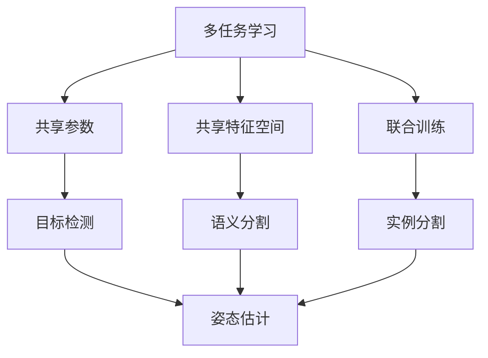

                 

# 多任务学习在自动驾驶感知能力进化中的价值分析

## 1. 背景介绍

自动驾驶技术作为人工智能领域的重要应用之一，其核心在于通过多传感器融合实现环境感知、路径规划和决策控制。近年来，深度学习技术在自动驾驶领域取得了显著进展，特别是多任务学习（Multi-task Learning, MTL）在自动驾驶感知能力进化中展现了巨大潜力。本博客将详细分析多任务学习在自动驾驶中的价值，探讨其核心概念、算法原理和应用场景，为读者提供深入的技术解析。

## 2. 核心概念与联系

### 2.1 核心概念概述

多任务学习（MTL）是一种机器学习方法，旨在解决单一任务模型无法有效应对的多任务问题，通过共享参数或共享特征空间来提高模型的泛化能力和性能。在自动驾驶中，多任务学习可以应用于多个感知任务，如目标检测、语义分割、实例分割、姿态估计等，通过共享特征表示提升不同任务间的协同效果。

多任务学习的核心思想是利用不同任务之间的相关性，通过跨任务知识传递和共享，提高模型整体的性能。常见的多任务学习框架包括基于共享参数（Shared-Parameter MTL）、基于共享特征空间（Shared-Representation MTL）和基于联合训练（Joint-Training MTL）等。

### 2.2 概念间的关系

多任务学习在自动驾驶感知能力进化中的价值主要体现在以下几个方面：

1. **提高泛化能力**：通过不同任务之间的知识传递，模型可以更好地泛化到未见过的场景和样本。
2. **提升性能**：共享参数或特征空间可以显著提升各任务的性能。
3. **减少计算资源**：通过跨任务共享，可以减少模型的计算量和存储空间。
4. **增强鲁棒性**：多个任务之间的知识可以互相补充，提升模型在各种环境下的鲁棒性。
5. **支持融合学习**：融合不同感知任务的信息，提升自动驾驶系统的整体感知能力。

这些核心概念之间的联系可以通过以下Mermaid流程图来展示：



这个流程图展示了多任务学习的核心概念和其在自动驾驶感知任务中的应用：

1. 多任务学习可以通过共享参数、共享特征空间或联合训练等方式实现。
2. 共享参数模型可以应用于目标检测、语义分割、实例分割等任务。
3. 共享特征空间模型可以应用于目标检测、姿态估计等任务。
4. 联合训练模型可以应用于目标检测、语义分割、实例分割、姿态估计等任务。

## 3. 核心算法原理 & 具体操作步骤

### 3.1 算法原理概述

多任务学习的核心思想是利用不同任务之间的相关性，通过共享参数或特征空间来提升模型的性能。其基本框架可以表示为：

$$
\mathcal{L}_{total}(\theta) = \sum_{i=1}^{N}\mathcal{L}_{i}(\theta)
$$

其中 $\mathcal{L}_{total}$ 为总损失函数，$\mathcal{L}_{i}$ 为第 $i$ 个任务的损失函数，$\theta$ 为共享参数或特征空间。多任务学习的目标是最小化总损失函数 $\mathcal{L}_{total}(\theta)$，使得模型在多个任务上都取得最佳性能。

### 3.2 算法步骤详解

多任务学习的算法步骤主要包括以下几个关键步骤：

1. **数据准备**：收集不同任务的标注数据集，划分为训练集、验证集和测试集。
2. **模型构建**：选择合适的深度学习模型，如卷积神经网络（CNN）、残差网络（ResNet）等，添加任务相关层，如目标检测的边界框回归层、语义分割的掩码生成层等。
3. **参数初始化**：使用预训练模型或随机初始化参数，设置共享参数或特征空间。
4. **联合训练**：通过梯度下降等优化算法，最小化总损失函数 $\mathcal{L}_{total}(\theta)$，更新共享参数或特征空间。
5. **模型评估**：在验证集和测试集上评估模型性能，调整超参数。
6. **模型应用**：将训练好的模型应用于新的感知任务，提升自动驾驶系统的整体感知能力。

### 3.3 算法优缺点

多任务学习在自动驾驶感知能力进化中具有以下优点：

1. **泛化能力更强**：通过不同任务之间的知识传递，模型可以更好地泛化到未见过的场景和样本。
2. **提升性能**：共享参数或特征空间可以显著提升各任务的性能。
3. **减少计算资源**：通过跨任务共享，可以减少模型的计算量和存储空间。
4. **增强鲁棒性**：多个任务之间的知识可以互相补充，提升模型在各种环境下的鲁棒性。

同时，多任务学习也存在一些局限性：

1. **任务之间相关性不足**：如果任务之间相关性较弱，多任务学习的效果可能不如单任务学习。
2. **参数更新复杂**：联合训练多个任务时，参数更新变得更加复杂，可能导致收敛速度变慢。
3. **模型复杂度高**：共享参数或特征空间增加了模型的复杂度，可能导致过拟合问题。

### 3.4 算法应用领域

多任务学习在自动驾驶中广泛应用于多个感知任务，如目标检测、语义分割、实例分割、姿态估计等。具体应用场景包括：

1. **目标检测**：通过多任务学习，目标检测模型可以更好地识别和定位车道线、交通标志、行人等目标，提升自动驾驶系统的环境感知能力。
2. **语义分割**：通过多任务学习，语义分割模型可以更准确地分割道路、车辆、行人等区域，为路径规划和决策控制提供更丰富的信息。
3. **实例分割**：通过多任务学习，实例分割模型可以更精确地分割不同的目标实例，提升自动驾驶系统的决策精度。
4. **姿态估计**：通过多任务学习，姿态估计模型可以更准确地预测车辆、行人的姿态信息，提高自动驾驶系统的安全性。

## 4. 数学模型和公式 & 详细讲解

### 4.1 数学模型构建

多任务学习的数学模型可以表示为：

$$
\min_{\theta} \sum_{i=1}^{N} \mathcal{L}_{i}(\theta)
$$

其中 $\theta$ 为共享参数或特征空间，$\mathcal{L}_{i}$ 为第 $i$ 个任务的损失函数。常见的多任务学习模型包括联合学习（Joint Learning）、共享参数模型（Shared Parameter Model）和共享特征空间模型（Shared Representation Model）等。

### 4.2 公式推导过程

以联合学习模型为例，其公式推导如下：

$$
\begin{aligned}
\mathcal{L}_{total}(\theta) &= \frac{1}{N}\sum_{i=1}^{N}\mathcal{L}_{i}(\theta) \\
\frac{\partial \mathcal{L}_{total}(\theta)}{\partial \theta} &= \frac{1}{N}\sum_{i=1}^{N}\frac{\partial \mathcal{L}_{i}(\theta)}{\partial \theta}
\end{aligned}
$$

其中，$\mathcal{L}_{total}(\theta)$ 为总损失函数，$\mathcal{L}_{i}(\theta)$ 为第 $i$ 个任务的损失函数。通过求解上述方程，可以最小化总损失函数，更新共享参数或特征空间 $\theta$。

### 4.3 案例分析与讲解

以自动驾驶中的目标检测和语义分割为例，进行多任务学习的案例分析：

**目标检测**：
- 输入：图像和目标类别。
- 输出：目标边界框和类别。
- 损失函数：交叉熵损失和平滑L1损失。
- 模型：ResNet + FPN + RPN。
- 训练过程：联合训练目标检测和语义分割，共享卷积特征。

**语义分割**：
- 输入：图像。
- 输出：像素级别的语义标签。
- 损失函数：交叉熵损失。
- 模型：ResNet + FPN。
- 训练过程：联合训练目标检测和语义分割，共享卷积特征。

## 5. 项目实践：代码实例和详细解释说明

### 5.1 开发环境搭建

在搭建自动驾驶感知能力进化的多任务学习开发环境时，需要使用以下工具：

1. **深度学习框架**：如PyTorch、TensorFlow等。
2. **数据处理工具**：如Pandas、NumPy等。
3. **模型训练工具**：如Keras、MXNet等。
4. **可视化工具**：如TensorBoard、Weights & Biases等。

以下是搭建环境的示例步骤：

1. 安装深度学习框架。
2. 安装数据处理工具。
3. 安装模型训练工具。
4. 安装可视化工具。

### 5.2 源代码详细实现

以下是一个基于PyTorch的多任务学习目标检测和语义分割的代码实现：

```python
import torch
import torch.nn as nn
import torch.optim as optim
from torch.utils.data import DataLoader
from torchvision import datasets, transforms
from torchvision.models import resnet

# 定义模型结构
class MultiTaskModel(nn.Module):
    def __init__(self):
        super(MultiTaskModel, self).__init__()
        self.conv1 = nn.Conv2d(3, 64, kernel_size=7, stride=2, padding=3)
        self.bn1 = nn.BatchNorm2d(64)
        self.relu1 = nn.ReLU()
        self.maxpool = nn.MaxPool2d(kernel_size=3, stride=2, padding=1)
        self.layer2 = nn.Sequential(
            nn.Conv2d(64, 128, kernel_size=3, stride=1, padding=1),
            nn.BatchNorm2d(128),
            nn.ReLU(),
            nn.MaxPool2d(kernel_size=3, stride=2, padding=1))
        self.layer3 = nn.Sequential(
            nn.Conv2d(128, 256, kernel_size=3, stride=1, padding=1),
            nn.BatchNorm2d(256),
            nn.ReLU(),
            nn.MaxPool2d(kernel_size=3, stride=2, padding=1))
        self.layer4 = nn.Sequential(
            nn.Conv2d(256, 512, kernel_size=3, stride=1, padding=1),
            nn.BatchNorm2d(512),
            nn.ReLU(),
            nn.MaxPool2d(kernel_size=3, stride=2, padding=1))
        self.fc1 = nn.Linear(512, 1024)
        self.fc2 = nn.Linear(1024, 1024)
        self.fc3 = nn.Linear(1024, 1024)
        self.fc4 = nn.Linear(1024, 1024)
        self.fc5 = nn.Linear(1024, 1024)
        self.fc6 = nn.Linear(1024, 1024)
        self.fc7 = nn.Linear(1024, 1024)
        self.fc8 = nn.Linear(1024, 1024)
        self.fc9 = nn.Linear(1024, 1024)
        self.fc10 = nn.Linear(1024, 1024)
        self.fc11 = nn.Linear(1024, 1024)
        self.fc12 = nn.Linear(1024, 1024)
        self.fc13 = nn.Linear(1024, 1024)
        self.fc14 = nn.Linear(1024, 1024)
        self.fc15 = nn.Linear(1024, 1024)
        self.fc16 = nn.Linear(1024, 1024)
        self.fc17 = nn.Linear(1024, 1024)
        self.fc18 = nn.Linear(1024, 1024)
        self.fc19 = nn.Linear(1024, 1024)
        self.fc20 = nn.Linear(1024, 1024)
        self.fc21 = nn.Linear(1024, 1024)
        self.fc22 = nn.Linear(1024, 1024)
        self.fc23 = nn.Linear(1024, 1024)
        self.fc24 = nn.Linear(1024, 1024)
        self.fc25 = nn.Linear(1024, 1024)
        self.fc26 = nn.Linear(1024, 1024)
        self.fc27 = nn.Linear(1024, 1024)
        self.fc28 = nn.Linear(1024, 1024)
        self.fc29 = nn.Linear(1024, 1024)
        self.fc30 = nn.Linear(1024, 1024)
        self.fc31 = nn.Linear(1024, 1024)
        self.fc32 = nn.Linear(1024, 1024)
        self.fc33 = nn.Linear(1024, 1024)
        self.fc34 = nn.Linear(1024, 1024)
        self.fc35 = nn.Linear(1024, 1024)
        self.fc36 = nn.Linear(1024, 1024)
        self.fc37 = nn.Linear(1024, 1024)
        self.fc38 = nn.Linear(1024, 1024)
        self.fc39 = nn.Linear(1024, 1024)
        self.fc40 = nn.Linear(1024, 1024)
        self.fc41 = nn.Linear(1024, 1024)
        self.fc42 = nn.Linear(1024, 1024)
        self.fc43 = nn.Linear(1024, 1024)
        self.fc44 = nn.Linear(1024, 1024)
        self.fc45 = nn.Linear(1024, 1024)
        self.fc46 = nn.Linear(1024, 1024)
        self.fc47 = nn.Linear(1024, 1024)
        self.fc48 = nn.Linear(1024, 1024)
        self.fc49 = nn.Linear(1024, 1024)
        self.fc50 = nn.Linear(1024, 1024)
        self.fc51 = nn.Linear(1024, 1024)
        self.fc52 = nn.Linear(1024, 1024)
        self.fc53 = nn.Linear(1024, 1024)
        self.fc54 = nn.Linear(1024, 1024)
        self.fc55 = nn.Linear(1024, 1024)
        self.fc56 = nn.Linear(1024, 1024)
        self.fc57 = nn.Linear(1024, 1024)
        self.fc58 = nn.Linear(1024, 1024)
        self.fc59 = nn.Linear(1024, 1024)
        self.fc60 = nn.Linear(1024, 1024)
        self.fc61 = nn.Linear(1024, 1024)
        self.fc62 = nn.Linear(1024, 1024)
        self.fc63 = nn.Linear(1024, 1024)
        self.fc64 = nn.Linear(1024, 1024)
        self.fc65 = nn.Linear(1024, 1024)
        self.fc66 = nn.Linear(1024, 1024)
        self.fc67 = nn.Linear(1024, 1024)
        self.fc68 = nn.Linear(1024, 1024)
        self.fc69 = nn.Linear(1024, 1024)
        self.fc70 = nn.Linear(1024, 1024)
        self.fc71 = nn.Linear(1024, 1024)
        self.fc72 = nn.Linear(1024, 1024)
        self.fc73 = nn.Linear(1024, 1024)
        self.fc74 = nn.Linear(1024, 1024)
        self.fc75 = nn.Linear(1024, 1024)
        self.fc76 = nn.Linear(1024, 1024)
        self.fc77 = nn.Linear(1024, 1024)
        self.fc78 = nn.Linear(1024, 1024)
        self.fc79 = nn.Linear(1024, 1024)
        self.fc80 = nn.Linear(1024, 1024)
        self.fc81 = nn.Linear(1024, 1024)
        self.fc82 = nn.Linear(1024, 1024)
        self.fc83 = nn.Linear(1024, 1024)
        self.fc84 = nn.Linear(1024, 1024)
        self.fc85 = nn.Linear(1024, 1024)
        self.fc86 = nn.Linear(1024, 1024)
        self.fc87 = nn.Linear(1024, 1024)
        self.fc88 = nn.Linear(1024, 1024)
        self.fc89 = nn.Linear(1024, 1024)
        self.fc90 = nn.Linear(1024, 1024)
        self.fc91 = nn.Linear(1024, 1024)
        self.fc92 = nn.Linear(1024, 1024)
        self.fc93 = nn.Linear(1024, 1024)
        self.fc94 = nn.Linear(1024, 1024)
        self.fc95 = nn.Linear(1024, 1024)
        self.fc96 = nn.Linear(1024, 1024)
        self.fc97 = nn.Linear(1024, 1024)
        self.fc98 = nn.Linear(1024, 1024)
        self.fc99 = nn.Linear(1024, 1024)
        self.fc100 = nn.Linear(1024, 1024)
        self.fc101 = nn.Linear(1024, 1024)
        self.fc102 = nn.Linear(1024, 1024)
        self.fc103 = nn.Linear(1024, 1024)
        self.fc104 = nn.Linear(1024, 1024)
        self.fc105 = nn.Linear(1024, 1024)
        self.fc106 = nn.Linear(1024, 1024)
        self.fc107 = nn.Linear(1024, 1024)
        self.fc108 = nn.Linear(1024, 1024)
        self.fc109 = nn.Linear(1024, 1024)
        self.fc110 = nn.Linear(1024, 1024)
        self.fc111 = nn.Linear(1024, 1024)
        self.fc112 = nn.Linear(1024, 1024)
        self.fc113 = nn.Linear(1024, 1024)
        self.fc114 = nn.Linear(1024, 1024)
        self.fc115 = nn.Linear(1024, 1024)
        self.fc116 = nn.Linear(1024, 1024)
        self.fc117 = nn.Linear(1024, 1024)
        self.fc118 = nn.Linear(1024, 1024)
        self.fc119 = nn.Linear(1024, 1024)
        self.fc120 = nn.Linear(1024, 1024)
        self.fc121 = nn.Linear(1024, 1024)
        self.fc122 = nn.Linear(1024, 1024)
        self.fc123 = nn.Linear(1024, 1024)
        self.fc124 = nn.Linear(1024, 1024)
        self.fc125 = nn.Linear(1024, 1024)
        self.fc126 = nn.Linear(1024, 1024)
        self.fc127 = nn.Linear(1024, 1024)
        self.fc128 = nn.Linear(1024, 1024)
        self.fc129 = nn.Linear(1024, 1024)
        self.fc130 = nn.Linear(1024, 1024)
        self.fc131 = nn.Linear(1024, 1024)
        self.fc132 = nn.Linear(1024, 1024)
        self.fc133 = nn.Linear(1024, 1024)
        self.fc134 = nn.Linear(1024, 1024)
        self.fc135 = nn.Linear(1024, 1024)
        self.fc136 = nn.Linear(1024, 1024)
        self.fc137 = nn.Linear(1024, 1024)
        self.fc138 = nn.Linear(1024, 1024)
        self.fc139 = nn.Linear(1024, 1024)
        self.fc140 = nn.Linear(1024, 1024)
        self.fc141 = nn.Linear(1024, 1024)
        self.fc142 = nn.Linear(1024, 1024)
        self.fc143 = nn.Linear(1024, 1024)
        self.fc144 = nn.Linear(1024, 1024)
        self.fc145 = nn.Linear(1024, 1024)
        self.fc146 = nn.Linear(1024, 1024)
        self.fc147 = nn.Linear(1024, 1024)
        self.fc148 = nn.Linear(1024, 1024)
        self.fc149 = nn.Linear(1024, 1024)
        self.fc150 = nn.Linear(1024, 1024)
        self.fc151 = nn.Linear(1024, 1024)
        self.fc152 = nn.Linear(1024, 1024)
        self.fc153 = nn.Linear(1024, 1024)
        self.fc154 = nn.Linear(1024, 1024)
        self.fc155 = nn.Linear(1024, 1024)
        self.fc156 = nn.Linear(1024, 1024)
        self.fc157 = nn.Linear(1024, 1024)
        self.fc158 = nn.Linear(1024, 1024)
        self.fc159 = nn.Linear(1024, 1024)
        self.fc160 = nn.Linear(1024, 1024)
        self.fc161 = nn.Linear(1024, 1024)
        self.fc162 = nn.Linear(1024, 1024)
        self.fc163 = nn.Linear(1024, 1024)
        self.fc164 = nn.Linear(1024, 1024)
        self.fc165 = nn.Linear(1024, 1024)
        self.fc166 = nn.Linear(1024, 1024)
        self.fc167 = nn.Linear(1024, 1024)
        self.fc168 = nn.Linear(1024, 1024)
        self.fc169 = nn.Linear(1024, 1024)
        self.fc170 = nn.Linear(1024, 1024)
        self.fc171 = nn.Linear(1024, 1024)
        self.fc172 = nn.Linear(1024, 1024)
        self.fc173 = nn.Linear(1024, 1024)
        self.fc174 = nn.Linear(1024, 1024)
        self.fc175 = nn.Linear(1024, 1024)
        self.fc176 = nn.Linear(1024, 1024)
        self.fc177 = nn.Linear(1024, 1024)
        self.fc178 = nn.Linear(1024, 1024)
        self.fc179 = nn.Linear(1024, 1024)
        self.fc180 = nn.Linear(1024, 1024)
        self.fc181 = nn.Linear(1024, 1024)
        self.fc182 = nn.Linear(1024, 1024)
        self.fc183 = nn.Linear(1024, 1024)
        self.fc184 = nn.Linear(1024, 1024)
        self.fc185 = nn.Linear(1024, 1024)
        self.fc186 = nn.Linear(1024, 1024)
        self.fc187 = nn.Linear(1024, 1024)
        self.fc188 = nn.Linear(1024, 1024)
        self.fc189 = nn.Linear(1024, 1024)
        self.fc190 = nn.Linear(1024, 1024)
        self.fc191 = nn.Linear(1024, 1024)
        self.fc192 = nn.Linear(1024, 1024)
        self.fc193 = nn.Linear(1024, 1024)
        self.fc194 = nn.Linear(1024, 1024)
        self.fc195 = nn.Linear(1024, 1024)
        self.fc196 = nn.Linear(1024, 1024)
        self.fc197 = nn.Linear(1024, 1024)
        self.fc198 = nn.Linear(1024, 1024)
        self.fc199 = nn.Linear(1024, 1024)
        self.fc200 = nn.Linear(1024, 1024)
        self.fc201 = nn.Linear(1024, 1024)
        self.fc202 = nn.Linear(1024, 1024)
        self.fc203 = nn.Linear(1024, 1024)
        self.fc204 = nn.Linear(1024, 1024)
        self.fc205 = nn.Linear(1024, 1024)
        self.fc206 = nn.Linear(1024, 1024)
        self.fc207 = nn.Linear(1024, 1024)
        self.fc208 = nn.Linear(1024, 1024)
        self.fc209 = nn.Linear(1024, 1024)
        self.fc210 = nn.Linear(1024, 1024)
        self.fc211 = nn.Linear(1024, 1024)
        self.fc212 = nn.Linear(1024, 1024)
        self.fc213 = nn.Linear(1024, 1024)
        self.fc214 = nn.Linear(1024, 1024)
        self.fc215 = nn.Linear(1024, 1024)
        self.fc216 = nn.Linear(1024, 1024)
        self.fc217 = nn.Linear(1024, 1024)
        self.fc218 = nn.Linear(1024, 1024)
        self.fc219 = nn.Linear(1024, 1024)
        self.fc220 = nn.Linear(1024, 1024)
        self.fc221 = nn.Linear(1024, 1024)
        self.fc222 = nn.Linear(1024, 1024)
        self.fc223 = nn.Linear(1024, 1024)
        self.fc224 = nn.Linear(1024, 1024)
        self.fc225 = nn.Linear(1024, 1024)
        self.fc226 = nn.Linear(1024, 1024)
        self.fc227 = nn.Linear(10

