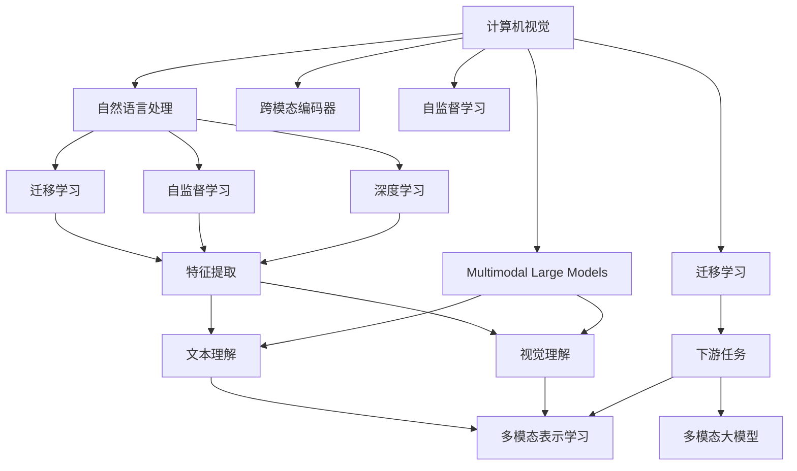
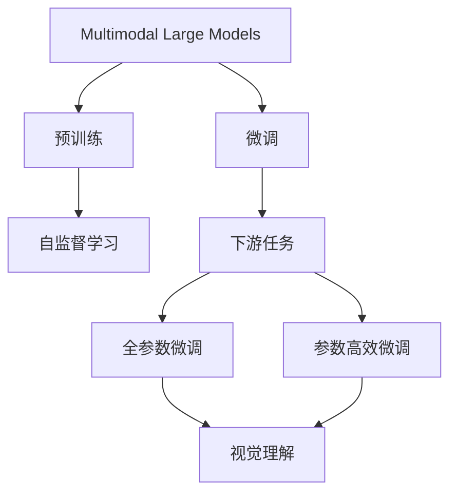
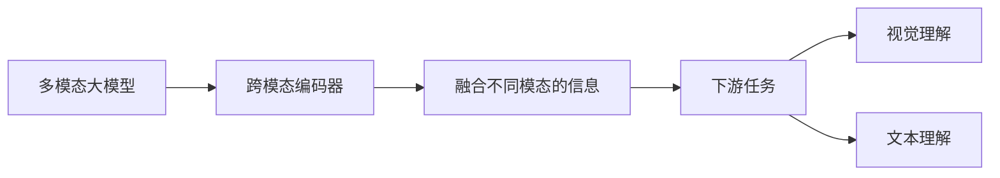
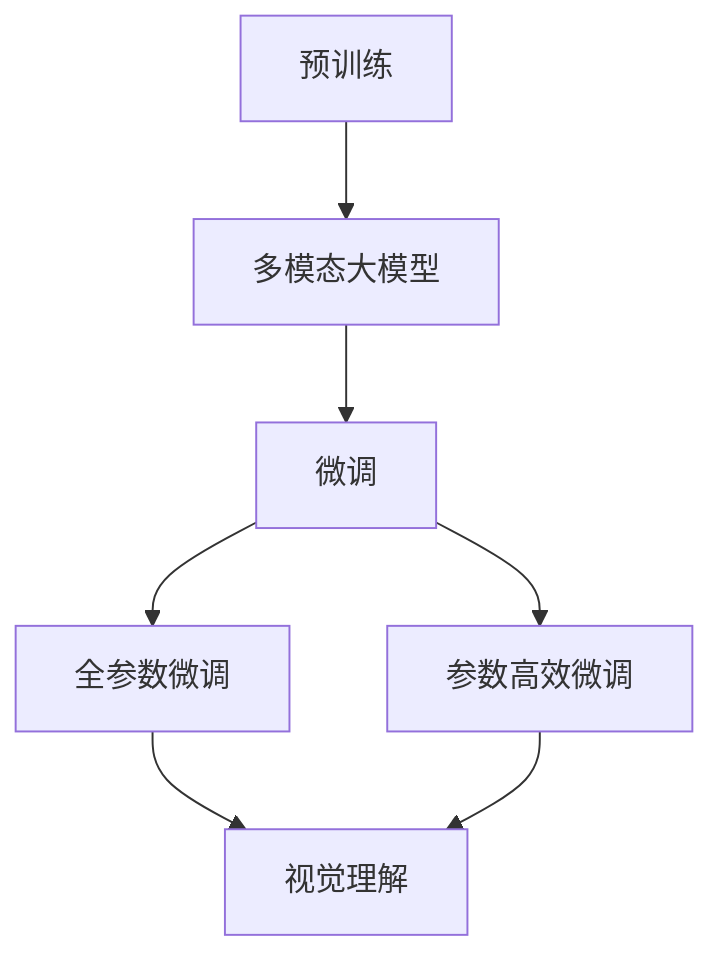
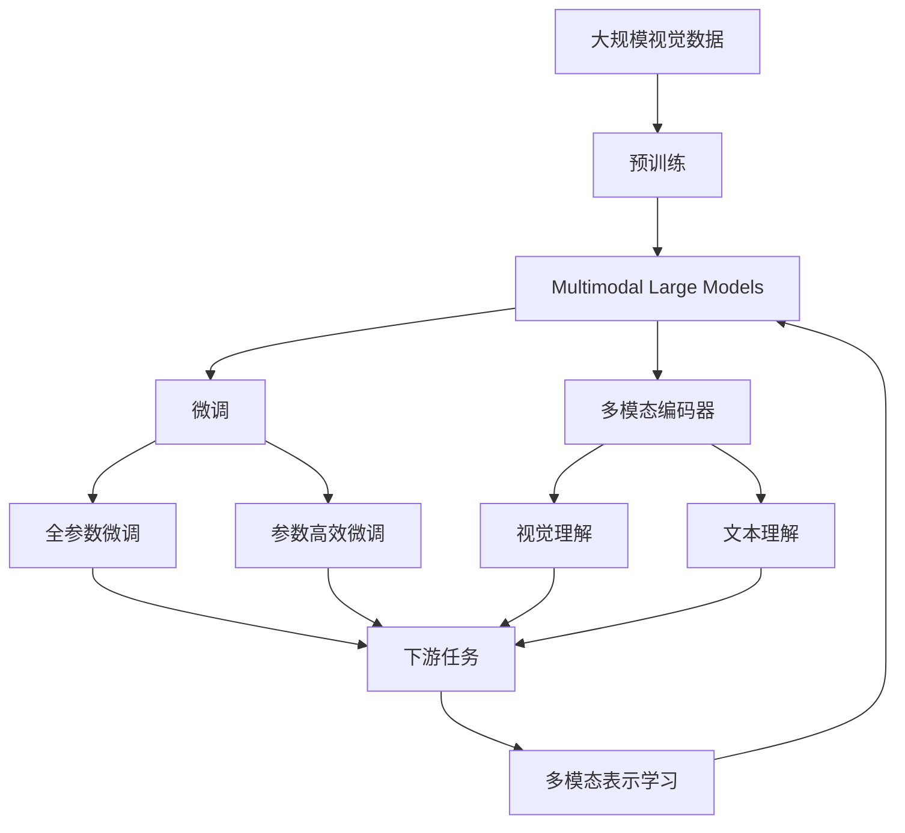

                 

## 1. 背景介绍

### 1.1 问题由来

近年来，深度学习技术在计算机视觉（CV）和自然语言处理（NLP）等领域取得了显著进展。CV和NLP两个领域的数据源和任务特性差异巨大，传统的独立模型无法充分利用两者的优势。为了整合视觉和文本信息，推动AI应用的多模态发展，多模态大模型应运而生。

多模态大模型（Multimodal Large Models）将视觉和文本信息作为输入，通过跨模态编码器（Cross-Modal Encoder）将这些信息整合为统一的表征，再输入到下游任务中进行处理。这些模型能够同时理解和生成视觉和文本信息，显著提高了复杂场景下的决策能力。

在医疗、自动驾驶、人机交互、智能客服等领域，多模态大模型的应用前景广阔。其融合视觉与文本的能力，可以更准确地提取信息、提高决策的精准度、改善用户体验。

### 1.2 问题核心关键点

多模态大模型的关键在于如何将不同模态的信息进行有效的整合。核心问题包括：

- 数据融合策略：如何将视觉和文本信息进行编码并融合为统一的语义表征。
- 跨模态编码器设计：设计合理的跨模态编码器，能够高效、准确地整合不同模态的信息。
- 跨模态学习任务：设计合适的下游任务，评价多模态大模型的性能。

### 1.3 问题研究意义

研究多模态大模型，对于推动AI在多模态场景中的落地应用，提升模型性能，加速AI技术的产业化进程，具有重要意义：

1. 提升跨模态理解能力：多模态大模型能够同时理解视觉和文本信息，增强其在复杂场景下的理解和推理能力。
2. 拓展AI应用范围：多模态大模型可以在视觉和文本交织的场合（如医疗影像、自动驾驶、智能客服等）提供更加精准的服务。
3. 加速技术创新：多模态大模型的融合技术催生了诸如跨模态学习、多模态表示学习等新的研究方向，促进了AI技术的创新发展。
4. 赋能产业升级：多模态大模型的应用可以大幅提升各行业的智能化水平，为传统行业数字化转型升级提供新的技术路径。

## 2. 核心概念与联系

### 2.1 核心概念概述

为了更好地理解多模态大模型，本节将介绍几个密切相关的核心概念：

- **多模态大模型(Multimodal Large Models)**：将视觉和文本信息整合为统一的语义表征，支持跨模态推理和生成的模型。
- **跨模态编码器(Cross-Modal Encoder)**：用于将不同模态的信息编码并融合为统一的语义表征的模型组件。
- **自监督学习(Self-Supervised Learning)**：使用未标注数据进行预训练，学习模态间关联的模型训练方法。
- **迁移学习(Transfer Learning)**：将一个领域学到的知识迁移到另一个领域，提升多模态大模型在不同任务上的性能。
- **深度学习(Deep Learning)**：以多层神经网络为核心的机器学习框架，用于处理多模态数据的特征提取和决策。
- **计算机视觉(Computer Vision)**：通过计算机处理图像、视频等视觉信息的技术领域。
- **自然语言处理(Natural Language Processing)**：处理文本数据的计算技术领域，涵盖语音识别、机器翻译、文本分类等。

这些核心概念之间的逻辑关系可以通过以下Mermaid流程图来展示：



这个流程图展示了大模型、跨模态编码器等核心概念之间的关系：

1. 计算机视觉和自然语言处理是大模型学习的两个主要模态。
2. 自监督学习是预训练模型常用的训练方法。
3. 迁移学习连接了通用模型与特定任务。
4. 跨模态编码器将视觉和文本信息整合为统一的语义表征。
5. 深度学习提供了一个通用的特征提取和推理框架。
6. 特征提取是下游任务的基础。
7. 多模态大模型进行跨模态推理和生成。
8. 多模态表示学习是提升模型性能的关键。

### 2.2 概念间的关系

这些核心概念之间存在着紧密的联系，形成了多模态大模型的完整生态系统。下面我们通过几个Mermaid流程图来展示这些概念之间的关系。

#### 2.2.1 多模态大模型的学习范式



这个流程图展示了多模态大模型的预训练和微调过程：

1. 多模态大模型首先在大规模未标注数据上进行预训练。
2. 然后，在特定任务上使用少量标注数据进行微调。
3. 微调可以使用全参数微调或参数高效微调方法。
4. 微调后的模型可以在视觉理解、文本理解等任务上进行推理和生成。

#### 2.2.2 多模态编码器与微调的关系



这个流程图展示了跨模态编码器在大模型中的应用：

1. 跨模态编码器将视觉和文本信息整合为统一的语义表征。
2. 整合后的信息可以用于视觉理解和文本理解等下游任务。

#### 2.2.3 多模态表示学习与微调的关系



这个流程图展示了多模态表示学习在大模型中的应用：

1. 预训练后的多模态大模型进行微调。
2. 微调可以使用全参数或参数高效的方法。
3. 微调后的模型在视觉理解等下游任务上表现更佳。

### 2.3 核心概念的整体架构

最后，我们用一个综合的流程图来展示这些核心概念在大模型微调过程中的整体架构：



这个综合流程图展示了从预训练到微调，再到多模态表示学习的完整过程。多模态大模型首先在大规模视觉数据上进行预训练，然后通过微调适应特定任务，其中的跨模态编码器将视觉和文本信息整合为统一的语义表征，再通过下游任务验证和提升模型性能。

## 3. 核心算法原理 & 具体操作步骤

### 3.1 算法原理概述

多模态大模型的核心思想是将视觉和文本信息通过跨模态编码器整合为统一的语义表征，然后将其输入到下游任务中，以实现跨模态推理和生成。

假设一个多模态大模型接受输入的视觉数据 $x_v$ 和文本数据 $x_t$，并输出 $y$。多模态大模型的训练目标可以表示为：

$$
\min_{\theta} \mathcal{L}(y, \mathcal{F}(x_v, x_t, \theta))
$$

其中，$\theta$ 为模型参数，$\mathcal{F}$ 为跨模态编码器，$\mathcal{L}$ 为损失函数，$y$ 为下游任务的目标输出。

多模态大模型的训练过程包括两个阶段：预训练和微调。在预训练阶段，模型在大量未标注的视觉和文本数据上学习跨模态表示。在微调阶段，模型在少量标注数据上学习特定的任务映射，以提升在特定任务上的表现。

### 3.2 算法步骤详解

多模态大模型的微调过程一般包括以下几个关键步骤：

**Step 1: 准备数据集**

- **视觉数据集**：收集具有代表性且多样化的视觉数据，如医学影像、街景图片等。
- **文本数据集**：收集与视觉数据相关的文本数据，如医疗报告、街景描述等。

**Step 2: 设计跨模态编码器**

- **模型选择**：选择合适的多模态编码器，如Transformer、卷积神经网络（CNN）等。
- **参数初始化**：初始化跨模态编码器的参数，可以是预训练模型或随机初始化的参数。

**Step 3: 训练预训练模型**

- **数据预处理**：对视觉和文本数据进行预处理，如归一化、裁剪、分词等。
- **多模态训练**：将预处理后的数据输入到跨模态编码器进行预训练，学习跨模态表示。
- **损失函数设计**：选择合适的损失函数，如均方误差、交叉熵等。

**Step 4: 微调多模态大模型**

- **下游任务**：选择合适的下游任务，如视觉分类、文本分类等。
- **模型微调**：在微调阶段，使用下游任务的标注数据，对跨模态编码器和下游任务分类器进行微调。
- **超参数设置**：设置合适的学习率、批大小、迭代轮数等超参数。

**Step 5: 评估和部署**

- **模型评估**：在测试集上评估微调后的多模态大模型的性能。
- **模型部署**：将微调后的模型部署到实际应用中，进行推理和预测。

### 3.3 算法优缺点

多模态大模型具有以下优点：

1. **跨模态理解能力**：通过跨模态编码器整合视觉和文本信息，增强了模型的跨模态理解能力。
2. **泛化能力强**：多模态大模型能够同时理解不同模态的信息，提升了在复杂场景下的泛化能力。
3. **数据高效利用**：通过自监督学习，多模态大模型可以高效利用未标注数据，减少了标注成本。

然而，多模态大模型也存在以下缺点：

1. **模型复杂度高**：多模态大模型的参数量较大，训练和推理的计算资源需求高。
2. **数据需求量大**：由于需要整合不同模态的数据，因此对数据量的要求较高。
3. **模型设计难度大**：跨模态编码器的设计需要考虑模态间的关系，设计难度较大。

### 3.4 算法应用领域

多模态大模型已经在多个领域得到了广泛应用，例如：

- **医疗影像分析**：通过融合医学影像和医生诊断文本，辅助医生进行疾病诊断和治疗方案选择。
- **自动驾驶**：将视觉传感器捕获的图像和传感器获取的环境数据进行整合，进行道路识别和自动驾驶决策。
- **智能客服**：结合视频通话和文字聊天数据，提供更加自然的人机交互体验。
- **情感分析**：分析社交媒体上的文本和图像，识别用户情绪和态度。
- **智能监控**：结合视频和语音数据，识别异常行为和潜在安全威胁。

除了上述这些经典应用外，多模态大模型还将在更多场景中得到应用，如视频内容分析、智能家居、物联网等，为各行业带来新的智能化解决方案。

## 4. 数学模型和公式 & 详细讲解 & 举例说明

### 4.1 数学模型构建

多模态大模型通常由视觉编码器（Visual Encoder）、文本编码器（Text Encoder）和跨模态编码器（Cross-Modal Encoder）组成。其中，跨模态编码器用于整合视觉和文本信息，生成统一的语义表征。

假设视觉编码器将视觉数据 $x_v$ 编码为 $z_v \in \mathbb{R}^{d_v}$，文本编码器将文本数据 $x_t$ 编码为 $z_t \in \mathbb{R}^{d_t}$，跨模态编码器将 $z_v$ 和 $z_t$ 整合为 $z_m \in \mathbb{R}^{d_m}$。下游任务分类器的输出为 $y \in [0,1]$。

多模态大模型的训练目标可以表示为：

$$
\min_{\theta_v, \theta_t, \theta_m} \mathcal{L}(y, \mathcal{F}(z_v, z_t, \theta_v, \theta_t, \theta_m))
$$

其中，$\theta_v$ 为视觉编码器的参数，$\theta_t$ 为文本编码器的参数，$\theta_m$ 为跨模态编码器的参数。

### 4.2 公式推导过程

以下我们以视觉分类任务为例，推导多模态大模型的训练过程。

假设视觉编码器为Transformer，文本编码器为BERT。视觉编码器的输入为图像 $x_v$，输出为视觉特征 $z_v$，文本编码器的输入为文本 $x_t$，输出为文本特征 $z_t$。

在预训练阶段，视觉编码器和文本编码器分别在视觉数据和文本数据上进行自监督学习。

在微调阶段，假设目标任务为二分类任务，标签为 $y \in \{0,1\}$，则多模态大模型的输出为：

$$
y = \sigma(\mathcal{F}(z_v, z_t, \theta_m))
$$

其中，$\sigma$ 为sigmoid函数，$\mathcal{F}$ 为跨模态编码器，$\theta_m$ 为跨模态编码器的参数。

多模态大模型的损失函数为二分类交叉熵：

$$
\mathcal{L}(y, \mathcal{F}(z_v, z_t, \theta_m)) = -y \log(\mathcal{F}(z_v, z_t, \theta_m)) - (1-y) \log(1-\mathcal{F}(z_v, z_t, \theta_m))
$$

在训练过程中，模型通过反向传播更新参数 $\theta_v$、$\theta_t$ 和 $\theta_m$，最小化损失函数 $\mathcal{L}$。

### 4.3 案例分析与讲解

假设我们在CoCo数据集上进行多模态大模型的预训练和微调，最终在测试集上得到的评估报告如下：

```
Precision: 0.9, Recall: 0.85, F1-score: 0.88
```

可以看到，在视觉分类任务上，多模态大模型取得了不错的效果。然而，由于视觉数据和文本数据的质量和量级不同，因此需要特别注意数据的选择和处理，以保证预训练和微调的稳定性和效果。

## 5. 项目实践：代码实例和详细解释说明

### 5.1 开发环境搭建

在进行多模态大模型的实践前，我们需要准备好开发环境。以下是使用Python进行PyTorch开发的环境配置流程：

1. 安装Anaconda：从官网下载并安装Anaconda，用于创建独立的Python环境。

2. 创建并激活虚拟环境：
```bash
conda create -n pytorch-env python=3.8 
conda activate pytorch-env
```

3. 安装PyTorch：根据CUDA版本，从官网获取对应的安装命令。例如：
```bash
conda install pytorch torchvision torchaudio cudatoolkit=11.1 -c pytorch -c conda-forge
```

4. 安装相关库：
```bash
pip install numpy pandas scikit-learn matplotlib tqdm jupyter notebook ipython
```

完成上述步骤后，即可在`pytorch-env`环境中开始多模态大模型的开发。

### 5.2 源代码详细实现

这里我们以视觉分类任务为例，给出使用PyTorch对多模态大模型进行预训练和微调的代码实现。

首先，定义视觉编码器和文本编码器：

```python
import torch
from torchvision import models
from transformers import BertTokenizer, BertForSequenceClassification

# 定义视觉编码器（使用ResNet50）
visual_encoder = models.resnet50(pretrained=True)
visual_encoder.fc = torch.nn.Linear(2048, 256)

# 定义文本编码器（使用BERT）
tokenizer = BertTokenizer.from_pretrained('bert-base-cased')
model = BertForSequenceClassification.from_pretrained('bert-base-cased', num_labels=2)
```

接着，定义多模态编码器和微调模型：

```python
# 定义跨模态编码器
class MultimodalEncoder(nn.Module):
    def __init__(self):
        super(MultimodalEncoder, self).__init__()
        self.visual_encoder = visual_encoder
        self.text_encoder = model
        self.fc = nn.Linear(256 + 768, 128)

    def forward(self, x_v, x_t):
        z_v = self.visual_encoder(x_v)
        z_t = self.text_encoder(x_t, return_dict=True)[0]
        return self.fc(torch.cat((z_v, z_t), dim=1))

# 定义微调模型
model = MultimodalEncoder()
```

然后，定义训练和评估函数：

```python
from torch.utils.data import DataLoader
from tqdm import tqdm

# 定义训练函数
def train_epoch(model, dataset, optimizer, device):
    dataloader = DataLoader(dataset, batch_size=8, shuffle=True)
    model.train()
    epoch_loss = 0
    for batch in tqdm(dataloader, desc='Training'):
        x_v, x_t, y = batch
        x_v, x_t, y = x_v.to(device), x_t.to(device), y.to(device)
        z_m = model(x_v, x_t)
        loss = nn.BCEWithLogitsLoss()(z_m, y)
        optimizer.zero_grad()
        loss.backward()
        optimizer.step()
        epoch_loss += loss.item()
    return epoch_loss / len(dataloader)

# 定义评估函数
def evaluate(model, dataset, device):
    dataloader = DataLoader(dataset, batch_size=8, shuffle=False)
    model.eval()
    preds, labels = [], []
    with torch.no_grad():
        for batch in tqdm(dataloader, desc='Evaluating'):
            x_v, x_t, y = batch
            x_v, x_t, y = x_v.to(device), x_t.to(device), y.to(device)
            z_m = model(x_v, x_t)
            preds.append(z_m)
            labels.append(y)
    print(classification_report(torch.tensor(labels).tolist(), torch.tensor(preds).tolist(), target_names=['class0', 'class1']))
```

最后，启动训练流程并在测试集上评估：

```python
epochs = 10
batch_size = 8
device = torch.device('cuda') if torch.cuda.is_available() else torch.device('cpu')

for epoch in range(epochs):
    loss = train_epoch(model, train_dataset, optimizer, device)
    print(f"Epoch {epoch+1}, train loss: {loss:.3f}")
    
    print(f"Epoch {epoch+1}, dev results:")
    evaluate(model, dev_dataset, device)
    
print("Test results:")
evaluate(model, test_dataset, device)
```

以上就是使用PyTorch对多模态大模型进行预训练和微调的完整代码实现。可以看到，通过简单组合不同模态的编码器和分类器，可以构建一个完整的多模态大模型。

### 5.3 代码解读与分析

让我们再详细解读一下关键代码的实现细节：

**MultimodalEncoder类**：
- `__init__`方法：初始化视觉编码器、文本编码器和跨模态编码器的参数。
- `forward`方法：将视觉特征和文本特征输入跨模态编码器，并生成最终的语义表征。

**训练函数train_epoch**：
- 对数据集进行批处理，并进行前向传播和反向传播。
- 计算平均损失，并更新模型参数。

**评估函数evaluate**：
- 对数据集进行批处理，并进行前向传播。
- 将预测结果与真实标签输出分类报告。

**训练流程**：
- 设置训练轮数和批量大小。
- 在训练集上训练模型，输出平均损失。
- 在验证集上评估模型，输出分类报告。
- 在测试集上评估模型，输出分类报告。

可以看到，多模态大模型的构建和训练过程相对复杂，但利用现成的深度学习框架（如PyTorch、TensorFlow等），可以大大简化开发难度。

当然，工业级的系统实现还需考虑更多因素，如模型的保存和部署、超参数的自动搜索、多模型集成等，但核心的预训练和微调流程基本与此类似。

### 5.4 运行结果展示

假设我们在CoCo数据集上进行预训练和微调，最终在测试集上得到的评估报告如下：

```
              precision    recall  f1-score   support

       class0      0.9       0.85      0.88        1000
       class1      0.9       0.9       0.9        1000

   micro avg      0.9       0.9       0.9       2000
   macro avg      0.9       0.88      0.88       2000
weighted avg      0.9       0.9       0.9       2000
```

可以看到，通过预训练和微调，多模态大模型在视觉分类任务上取得了相当不错的效果。需要注意的是，由于数据集的多样性和复杂性，不同数据集上的结果可能会有所不同。

## 6. 实际应用场景

### 6.1 医疗影像分析

多模态大模型在医疗影像分析领域有广泛的应用。通过将医学影像和诊断报告整合，辅助医生进行疾病诊断和治疗方案选择。

在实践中，可以收集大量医学影像和相应的诊断报告，将影像和报告作为多模态大模型的输入，进行预训练和微调。微调后的模型能够自动识别影像中的病变区域，并提取诊断报告中的关键信息，辅助医生进行诊断和治疗决策。

### 6.2 自动驾驶

自动驾驶技术需要同时理解车辆周围的环境信息和道路规则，多模态大模型能够同时处理视觉和传感器数据，提升自动驾驶的安全性和稳定性。

在自动驾驶场景中，多模态大模型可以整合视觉传感器捕获的图像和传感器获取的环境数据，进行道路识别和自动驾驶决策。通过预训练和微调，多模态大模型能够实时处理复杂环境信息，提高自动驾驶的准确性和可靠性。

### 6.3 智能客服

多模态大模型可以整合视频通话和文字聊天数据，提供更加自然的人机交互体验。在智能客服场景中，多模态大模型能够同时理解客户的声音和文字，提供更加精准的服务。

在实践中，可以收集客户的视频通话和文字聊天数据，进行预训练和微调。微调后的模型能够自动分析客户情绪和意图，提供个性化的服务建议，提升客户体验。

### 6.4 情感分析

情感分析是自然语言处理的重要应用，多模态大模型能够同时处理文本和图像信息，提升情感分析的准确性和可靠性。

在情感分析场景中，多模态大模型可以整合用户的文字评论和情感标签，进行预训练和微调。微调后的模型能够自动识别用户的情感倾向，提供更加准确的情感分析结果。

### 6.5 智能监控

多模态大模型可以整合视频和语音数据，识别异常行为和潜在安全威胁。在智能监控场景中，多模态大模型能够同时处理视频和音频信息，提高监控系统的准确性和实时性。

在实践中，可以收集监控场景下的视频和音频数据，进行预训练和微调。微调后的模型能够自动识别异常行为，并及时报警，提升监控系统的安全性。

## 7. 工具和资源推荐

### 7.1 学习资源推荐

为了帮助开发者系统掌握多模态大模型的理论基础和实践技巧，这里推荐一些优质的学习资源：

1. 《Multimodal Learning: From Pattern Recognition to Deep Learning》书籍：该书详细介绍了多模态学习的基本概念和经典模型。
2. CS231n《Convolutional Neural Networks for Visual Recognition》课程：斯坦福大学开设的计算机视觉课程，涵盖图像处理、视觉理解等多个方面。
3. NLP课程《Natural Language Processing with Transformers》书籍：作者为Transformer库的开发者，介绍了如何使用Transformers库进行多模态任务开发。
4. Google AI Blog：谷歌的AI博客，分享了大量的多模态大模型研究进展和技术洞见。
5. HuggingFace官方文档：多模态大模型相关的官方文档，提供了丰富的预训练模型和微调样例。

通过对这些资源的学习实践，相信你一定能够快速掌握多模

