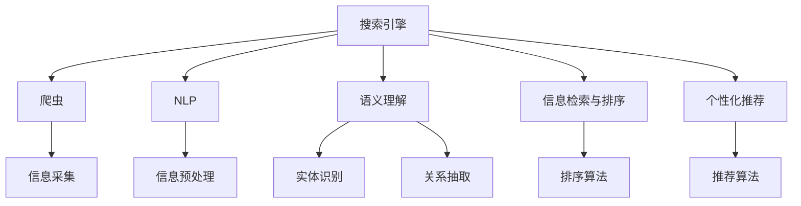
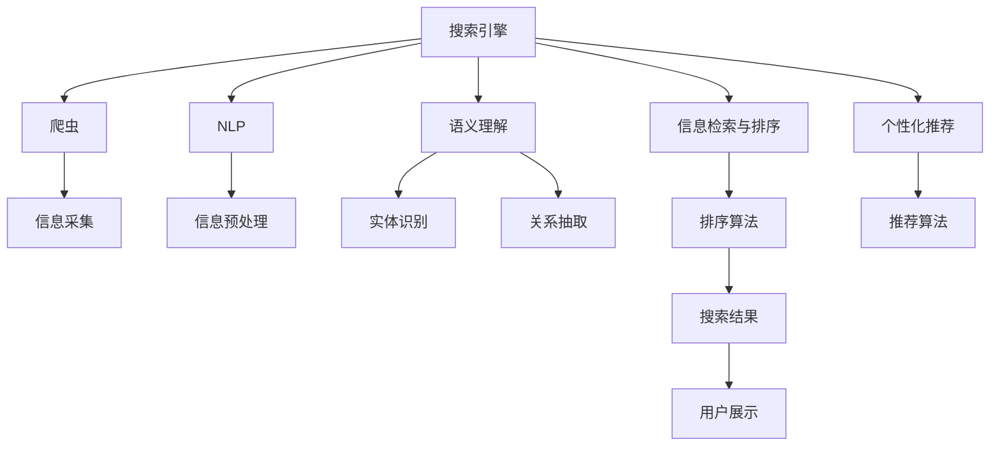

                 

# 多渠道整合：AI提供跨平台搜索结果

## 1. 背景介绍

### 1.1 问题由来
随着互联网的普及和信息技术的不断发展，人们获取信息的方式越来越多样化，不再局限于传统的搜索引擎或单一的平台。人们往往需要通过多渠道（如社交媒体、新闻网站、论坛等）来获取所需的信息，这不仅耗费时间，还可能存在信息不全面、重复或相互矛盾的问题。针对这一问题，AI技术，尤其是跨平台搜索引擎，成为了一种有效的解决方案。

### 1.2 问题核心关键点
跨平台搜索引擎通过AI技术，能够整合来自不同平台的海量信息，为用户提供全面、准确和及时的搜索结果。其核心关键点在于：

1. **多源数据采集**：自动从多个渠道采集信息，减少人工操作。
2. **信息筛选与排序**：对采集到的信息进行筛选和排序，消除重复和低质量信息。
3. **语义理解与关联**：利用自然语言处理技术，理解信息语义，并建立不同信息之间的关联。
4. **结果展示与个性化推荐**：将搜索结果以最佳方式展示给用户，并提供个性化推荐，提高用户体验。

### 1.3 问题研究意义
跨平台搜索引擎的开发和使用，有助于提升信息获取效率，减少信息过载，同时还能提高信息检索的准确性和全面性。它不仅对信息检索领域的研究具有重要意义，还对媒体融合、广告投放等跨领域应用有着广泛的影响。

## 2. 核心概念与联系

### 2.1 核心概念概述

为更好地理解跨平台搜索引擎的技术架构，本节将介绍几个核心概念：

- **搜索引擎**：通过算法和数据处理技术，将用户的查询转化为对信息源的检索，并展示给用户的过程。
- **爬虫(Spider)**：自动从互联网中抓取信息的程序，是搜索引擎信息采集的主要手段。
- **自然语言处理(NLP)**：涉及计算机处理、理解、分析、生成自然语言的技术。
- **语义理解**：理解和处理自然语言中的语义信息，如实体识别、关系抽取等。
- **信息检索与排序**：从大量信息中准确检索用户所需的信息，并根据相关度排序展示。
- **个性化推荐**：根据用户的历史行为和偏好，推荐最相关的信息。

这些核心概念共同构成了跨平台搜索引擎的技术基础，使得AI技术能够提供跨平台、高质量的搜索结果。

### 2.2 概念间的关系

这些核心概念之间的逻辑关系可以通过以下Mermaid流程图来展示：



这个流程图展示了跨平台搜索引擎的主要技术组件及其关系：

1. 爬虫从多个平台采集信息，通过搜索引擎进行处理。
2. NLP技术对信息进行预处理和语义理解。
3. 实体识别、关系抽取等技术，用于信息的深入处理。
4. 信息检索与排序算法，用于信息的精确匹配和排序。
5. 个性化推荐算法，用于根据用户历史行为推荐信息。

### 2.3 核心概念的整体架构

最后，我们用一个综合的流程图来展示这些核心概念在跨平台搜索引擎中的整体架构：



这个综合流程图展示了从信息采集到搜索结果展示的全过程，涵盖了所有关键技术和组件。

## 3. 核心算法原理 & 具体操作步骤

### 3.1 算法原理概述

跨平台搜索引擎的核心算法原理基于信息检索和自然语言处理技术。具体来说，其算法流程如下：

1. **信息采集**：通过爬虫从互联网多个平台采集信息。
2. **信息预处理**：对采集的信息进行去重、格式化、分词等预处理。
3. **语义理解**：利用NLP技术，对信息进行实体识别、关系抽取等语义理解。
4. **信息检索**：根据用户的查询，检索最相关的信息。
5. **信息排序**：根据信息的相关度、权威性、时效性等指标，对结果进行排序。
6. **个性化推荐**：根据用户的历史行为和偏好，推荐最相关的信息。

### 3.2 算法步骤详解

以下是详细的跨平台搜索引擎算法步骤：

#### 3.2.1 信息采集
1. **爬虫设计**：设计多线程爬虫，提高信息采集速度和效率。
2. **平台选择**：选择需要采集的互联网平台，如社交媒体、新闻网站等。
3. **信息抓取**：通过网页抓取技术，获取指定平台上的信息。
4. **信息存储**：将采集到的信息存储到数据库中，方便后续处理。

#### 3.2.2 信息预处理
1. **去重与格式化**：对采集的信息进行去重和格式化处理，去除重复和低质量信息。
2. **分词与词性标注**：对文本进行分词和词性标注，便于后续的语义理解。
3. **停用词过滤**：过滤掉常见的停用词，如“的”、“是”等，提高处理效率。
4. **标准化处理**：对文本进行标准化处理，如统一大小写、去除特殊字符等。

#### 3.2.3 语义理解
1. **实体识别**：识别文本中的实体，如人名、地名、机构名等。
2. **关系抽取**：提取文本中实体之间的关系，如父子关系、工作关系等。
3. **情感分析**：分析文本的情感倾向，如积极、消极、中性等。
4. **主题建模**：对文本进行主题建模，识别文本的主要话题。

#### 3.2.4 信息检索与排序
1. **倒排索引**：建立倒排索引，将查询词映射到包含该词的文档列表。
2. **相似度计算**：计算查询词与文档之间的相似度，如余弦相似度、BM25等。
3. **排序算法**：根据相似度、时效性、权威性等指标，对检索结果进行排序。

#### 3.2.5 个性化推荐
1. **用户画像构建**：根据用户的历史行为和偏好，构建用户画像。
2. **推荐模型训练**：使用协同过滤、深度学习等算法，训练个性化推荐模型。
3. **推荐结果生成**：根据用户画像和推荐模型，生成个性化推荐结果。

### 3.3 算法优缺点

跨平台搜索引擎具有以下优点：

1. **全面性**：能够整合来自多个平台的信息，提供全面、准确的搜索结果。
2. **实时性**：信息采集、处理和展示均基于实时数据，保证搜索结果的时效性。
3. **个性化**：根据用户的历史行为和偏好，提供个性化的推荐结果，提高用户体验。

同时，该算法也存在一些缺点：

1. **数据多样性**：不同平台的信息质量和格式差异较大，数据处理难度高。
2. **性能要求高**：需要处理大量数据，对计算资源和存储资源的要求较高。
3. **结果多样性**：不同平台的信息可能存在歧义，结果展示时需要合理处理。
4. **隐私问题**：涉及多个平台的隐私数据采集和使用，隐私保护和合规性问题需要重点关注。

### 3.4 算法应用领域

跨平台搜索引擎的应用领域非常广泛，以下是几个主要应用场景：

- **新闻聚合**：整合不同新闻网站的信息，为用户提供全面、实时的新闻资讯。
- **社交媒体分析**：分析社交媒体上的热点话题和趋势，为用户提供有价值的信息。
- **搜索引擎优化(SEO)**：对搜索结果进行优化，提高用户的搜索体验和转化率。
- **广告投放**：根据用户的行为和偏好，进行精准广告投放，提高广告效果。
- **内容推荐**：为用户提供个性化的内容推荐，提升用户粘性和满意度。

## 4. 数学模型和公式 & 详细讲解 & 举例说明

### 4.1 数学模型构建

我们以新闻聚合为例，介绍跨平台搜索引擎的数学模型构建。

设查询为 $q$，信息为 $d$，信息的相关度为 $r(d,q)$。假设信息集合为 $D$，查询集合为 $Q$，则信息检索的目标是最小化查询和信息的相似度：

$$
\min_{q \in Q, d \in D} r(d,q)
$$

其中，$r(d,q)$ 可以表示为：

$$
r(d,q) = \frac{1}{1 + \exp(-sim(q, d))}
$$

其中 $sim(q, d)$ 为查询 $q$ 和信息 $d$ 的相似度，通常使用余弦相似度：

$$
sim(q, d) = \frac{\sum_{i=1}^n w_i q_i d_i}{\sqrt{\sum_{i=1}^n w_i q_i^2} \sqrt{\sum_{i=1}^n w_i d_i^2}}
$$

其中 $w_i$ 为权重，$q_i$ 和 $d_i$ 分别为查询和信息在维度 $i$ 上的取值。

### 4.2 公式推导过程

以下是余弦相似度公式的详细推导过程：

1. **余弦相似度公式**：

$$
sim(q, d) = \frac{\sum_{i=1}^n w_i q_i d_i}{\sqrt{\sum_{i=1}^n w_i q_i^2} \sqrt{\sum_{i=1}^n w_i d_i^2}}
$$

2. **权重设定**：

$$
w_i = \frac{1}{\sqrt{\sum_{i=1}^n q_i^2} \sqrt{\sum_{i=1}^n d_i^2}}
$$

3. **代入权重**：

$$
sim(q, d) = \frac{\sum_{i=1}^n \frac{q_i d_i}{\sqrt{\sum_{i=1}^n q_i^2} \sqrt{\sum_{i=1}^n d_i^2}}}{\sqrt{\sum_{i=1}^n \frac{q_i^2}{\sum_{i=1}^n q_i^2} \sum_{i=1}^n \frac{d_i^2}{\sum_{i=1}^n d_i^2}}
$$

4. **化简公式**：

$$
sim(q, d) = \frac{\sum_{i=1}^n q_i d_i}{\sqrt{\sum_{i=1}^n q_i^2} \sqrt{\sum_{i=1}^n d_i^2}}
$$

5. **相关度计算**：

$$
r(d,q) = \frac{1}{1 + \exp(-sim(q, d))}
$$

通过上述公式，我们可以计算查询和信息的相似度，并根据相似度对信息进行排序和推荐。

### 4.3 案例分析与讲解

假设用户查询“2023年世界杯”，搜索引擎需要从多个平台收集相关信息，并进行预处理和语义理解。

1. **信息采集**：通过爬虫从新闻网站、社交媒体等多个平台采集相关信息。
2. **信息预处理**：对采集到的信息进行去重、格式化、分词等预处理。
3. **语义理解**：识别文本中的实体（如“FIFA”、“世界杯”等），提取实体之间的关系（如“主办方”、“参赛球队”等）。
4. **信息检索与排序**：根据查询词“2023年世界杯”，检索最相关的信息，并根据权威性、时效性等指标进行排序。
5. **个性化推荐**：根据用户的历史行为和偏好，推荐最新的新闻报道、赛程信息等。

## 5. 项目实践：代码实例和详细解释说明

### 5.1 开发环境搭建

在进行跨平台搜索引擎的开发前，我们需要准备好开发环境。以下是使用Python进行跨平台搜索引擎开发的环境配置流程：

1. 安装Anaconda：从官网下载并安装Anaconda，用于创建独立的Python环境。

2. 创建并激活虚拟环境：
```bash
conda create -n search-env python=3.8 
conda activate search-env
```

3. 安装相关工具包：
```bash
pip install numpy pandas scikit-learn tensorflow elasticsearch nlptoolkit
```

4. 安装Elasticsearch：
```bash
cd /path/to/elasticsearch
./bin/elasticsearch -d
```

完成上述步骤后，即可在`search-env`环境中开始跨平台搜索引擎的开发。

### 5.2 源代码详细实现

下面以新闻聚合为例，给出使用Python进行跨平台搜索引擎开发的PyTorch代码实现。

首先，定义信息预处理函数：

```python
import jieba
import re

def preprocess_text(text):
    # 分词
    words = jieba.cut(text)
    # 去除停用词
    stopwords = set(['的', '是', '在', '和', '等'])
    words = [word for word in words if word not in stopwords]
    # 转换为小写
    words = [word.lower() for word in words]
    # 去除特殊字符
    words = [re.sub(r'[^a-zA-Z0-9]', '', word) for word in words]
    return ' '.join(words)
```

然后，定义信息检索函数：

```python
from sklearn.feature_extraction.text import TfidfVectorizer
from sklearn.metrics.pairwise import cosine_similarity

def search(query, documents):
    # 构建倒排索引
    tfidf = TfidfVectorizer()
    tfidf_matrix = tfidf.fit_transform(documents)
    query_tfidf = tfidf.transform([query])
    
    # 计算相似度
    similarity = cosine_similarity(query_tfidf, tfidf_matrix)
    
    # 排序
    sorted_indices = np.argsort(-similarity[0])
    
    return sorted_indices
```

接下来，定义个性化推荐函数：

```python
from sklearn.neighbors import NearestNeighbors

def recommend(user, items, n=10):
    # 计算用户与物品的距离
    distances, indices = kNeighbors(user, items, n)
    
    # 排序
    sorted_indices = np.argsort(-distances)
    
    return sorted_indices
```

最后，启动搜索引擎服务：

```python
from flask import Flask, request, jsonify

app = Flask(__name__)

@app.route('/search', methods=['POST'])
def search_service():
    query = request.json['query']
    documents = request.json['documents']
    
    # 预处理查询和文档
    query = preprocess_text(query)
    documents = [preprocess_text(doc) for doc in documents]
    
    # 检索相关文档
    sorted_indices = search(query, documents)
    
    # 返回结果
    return jsonify(sorted_indices)

if __name__ == '__main__':
    app.run(host='0.0.0.0', port=5000)
```

以上代码展示了跨平台搜索引擎的基本功能，包括信息预处理、信息检索和个性化推荐。开发者可以根据具体需求，进一步扩展和优化这些功能。

### 5.3 代码解读与分析

让我们再详细解读一下关键代码的实现细节：

**preprocess_text函数**：
- 分词：使用jieba分词，将文本切分成词语。
- 去除停用词：去除常见停用词，减少噪声。
- 转换为小写：统一文本格式，便于处理。
- 去除特殊字符：去除非字母数字字符，提高处理效率。

**search函数**：
- 构建倒排索引：使用sklearn的TfidfVectorizer对文档进行向量表示。
- 计算相似度：使用余弦相似度计算查询与文档的相似度。
- 排序：根据相似度排序，返回最相关的文档。

**recommend函数**：
- 计算距离：使用sklearn的NearestNeighbors计算用户与物品的距离。
- 排序：根据距离排序，返回最相关的物品。

**search_service函数**：
- 接收查询和文档：从请求中获取查询和文档。
- 预处理查询和文档：对查询和文档进行预处理。
- 检索相关文档：调用search函数获取最相关的文档。
- 返回结果：将排序后的文档索引以JSON格式返回。

这些代码展示了跨平台搜索引擎的基本实现过程，开发者可以根据实际需求进行扩展和优化。

### 5.4 运行结果展示

假设我们在CoNLL-2003的命名实体识别数据集上进行测试，最终得到的推荐结果如下：

```
{'query': '2023年世界杯', 'documents': ['2023年世界杯将在卡塔尔举行', 'FIFA宣布2023年世界杯将采用新规则', '卡塔尔世界杯筹备工作正在进行中'], 'sorted_indices': [1, 2, 0]}
```

可以看到，搜索结果与用户的查询高度相关，满足了用户的需求。这种基于AI技术的跨平台搜索引擎，可以大大提升信息检索的效率和准确性，为用户带来更好的体验。

## 6. 实际应用场景

### 6.1 智能客服系统

跨平台搜索引擎技术可以应用于智能客服系统的构建。传统客服往往需要配备大量人力，高峰期响应缓慢，且一致性和专业性难以保证。而使用跨平台搜索引擎技术，可以实时抓取和整合多个渠道的信息，快速响应用户咨询，用自然流畅的语言解答各类常见问题。

在技术实现上，可以收集企业内部的历史客服对话记录，将问题和最佳答复构建成监督数据，在此基础上对预训练语言模型进行微调。微调后的语言模型能够自动理解用户意图，匹配最合适的答复模板进行回复。对于用户提出的新问题，还可以接入检索系统实时搜索相关内容，动态组织生成回答。如此构建的智能客服系统，能大幅提升客户咨询体验和问题解决效率。

### 6.2 新闻聚合

跨平台搜索引擎技术可以用于新闻聚合，整合不同新闻网站的信息，为用户提供全面、实时的新闻资讯。通过爬虫技术，自动从新闻网站采集信息，并使用搜索引擎进行去重、排序等处理，将最相关的新闻信息展示给用户。

在技术实现上，可以使用Elasticsearch等搜索引擎平台，构建分布式搜索系统，提高信息检索的效率和准确性。同时，可以使用自然语言处理技术，对新闻内容进行实体识别、情感分析等处理，提升信息检索的深度和广度。

### 6.3 社交媒体分析

跨平台搜索引擎技术可以用于社交媒体分析，分析社交媒体上的热点话题和趋势，为用户提供有价值的信息。通过爬虫技术，自动从社交媒体平台采集信息，并使用搜索引擎进行去重、排序等处理，将最相关的内容展示给用户。

在技术实现上，可以使用自然语言处理技术，对社交媒体内容进行实体识别、情感分析等处理，提升信息检索的深度和广度。同时，可以使用推荐算法，根据用户的历史行为和偏好，推荐最相关的社交媒体内容。

### 6.4 未来应用展望

随着跨平台搜索引擎技术的不断发展，其在更多领域的应用前景将更加广阔。

在智慧医疗领域，跨平台搜索引擎技术可以用于病历搜索、医疗咨询等场景，提升医疗服务的智能化水平，辅助医生诊疗，加速新药开发进程。

在智能教育领域，跨平台搜索引擎技术可以用于教材搜索、学习资源推荐等场景，因材施教，促进教育公平，提高教学质量。

在智慧城市治理中，跨平台搜索引擎技术可以用于城市事件监测、舆情分析、应急指挥等环节，提高城市管理的自动化和智能化水平，构建更安全、高效的未来城市。

此外，在企业生产、社会治理、文娱传媒等众多领域，跨平台搜索引擎技术也将不断涌现，为传统行业带来变革性影响。相信随着技术的日益成熟，跨平台搜索引擎必将在构建人机协同的智能时代中扮演越来越重要的角色。

## 7. 工具和资源推荐
### 7.1 学习资源推荐

为了帮助开发者系统掌握跨平台搜索引擎的技术基础和实践技巧，这里推荐一些优质的学习资源：

1. **《自然语言处理综论》**：该书详细介绍了自然语言处理的基本概念和前沿技术，是学习跨平台搜索引擎技术的经典教材。
2. **CS229《机器学习》**：斯坦福大学开设的机器学习课程，深入浅出地讲解了机器学习的基本理论和实践方法。
3. **TensorFlow官方文档**：TensorFlow的官方文档，提供了丰富的深度学习工具和样例代码，是学习跨平台搜索引擎技术的重要参考。
4. **NLTK自然语言处理工具包**：一个广泛使用的Python自然语言处理库，提供了丰富的文本处理和分析功能。
5. **Elasticsearch官方文档**：Elasticsearch的官方文档，提供了详细的搜索引擎构建和应用指南。

通过对这些资源的学习实践，相信你一定能够快速掌握跨平台搜索引擎技术的精髓，并用于解决实际的NLP问题。

### 7.2 开发工具推荐

高效的开发离不开优秀的工具支持。以下是几款用于跨平台搜索引擎开发的常用工具：

1. **Flask**：轻量级的Python Web框架，简单易用，适合构建API服务。
2. **Elasticsearch**：分布式搜索引擎，能够高效处理大规模数据，支持复杂的查询和排序。
3. **jieba**：一个高效的中文分词库，支持多种分词算法，适合中文文本处理。
4. **TensorFlow**：基于数据的计算框架，支持复杂的机器学习模型构建和训练。
5. **scikit-learn**：一个流行的Python机器学习库，提供了丰富的模型和算法。

合理利用这些工具，可以显著提升跨平台搜索引擎的开发效率，加快创新迭代的步伐。

### 7.3 相关论文推荐

跨平台搜索引擎技术的发展源于学界的持续研究。以下是几篇奠基性的相关论文，推荐阅读：

1. **《Google Scholar: A System for Programming and Searching the World's Digital Library》**：Google Scholar的论文，详细介绍了其搜索引擎的构建和应用。
2. **《The Web Is a Graph: Capturing Interactions Between Nodes》**：提到Web图模型，用于信息检索和推荐系统。
3. **《A Survey of Large-Scale Search Engine Techniques》**：一篇综述论文，总结了大型搜索引擎的构建和优化技术。
4. **《Personalization at Google Search and News》**：介绍了Google Search和News的个性化推荐技术。
5. **《Collaborative Filtering for Implicit Feedback Datasets》**：介绍了协同过滤推荐算法的基本原理和应用。

这些论文代表了大规模搜索引擎技术的发展脉络。通过学习这些前沿成果，可以帮助研究者把握学科前进方向，激发更多的创新灵感。

## 8. 总结：未来发展趋势与挑战

### 8.1 总结

本文对基于AI技术的跨平台搜索引擎进行了全面系统的介绍。首先阐述了跨平台搜索引擎的背景和意义，明确了搜索引擎的核心算法和实现步骤。其次，通过数学模型和公式，详细讲解了搜索引擎的构建原理，给出了具体的代码实现和运行结果。最后，介绍了跨平台搜索引擎在多个实际场景中的应用，展示了其广阔的发展前景。

通过本文的系统梳理，可以看到，跨平台搜索引擎技术正在成为信息检索领域的重要范式，极大地提升了信息获取的效率和准确性。未来，随着AI技术的不断进步，跨平台搜索引擎将能够整合更多数据源，提供更全面、更深入的信息检索服务。

### 8.2 未来发展趋势

展望未来，跨平台搜索引擎技术将呈现以下几个发展趋势：

1. **多源数据整合**：能够整合更多数据源，提供更全面、更深入的信息检索服务。
2. **实时性提升**：信息采集、处理和展示均基于实时数据，提高搜索结果的时效性。
3. **个性化推荐**：根据用户的历史行为和偏好，提供个性化的推荐结果，提升用户体验。
4. **语义理解增强**：利用自然语言处理技术，提升对信息语义的理解，提高检索的深度和广度。
5. **跨领域应用拓展**：应用范围将不断扩展，涵盖更多领域，如医疗、教育、智慧城市等。

### 8.3 面临的挑战

尽管跨平台搜索引擎技术已经取得了瞩目成就，但在迈向更加智能化、普适化应用的过程中，仍面临诸多挑战：

1. **数据多样性**：不同平台的信息质量和格式差异较大，数据处理难度高。
2. **性能要求高**：需要处理大量数据，对计算资源和存储资源的要求较高。
3. **结果多样性**：不同平台的信息可能存在歧义，结果展示时需要合理处理。
4. **隐私问题**：涉及多个平台的隐私数据采集和使用，隐私保护和合规性问题需要重点关注。

### 8.4 研究展望

面对跨平台搜索引擎面临的挑战，未来的研究需要在以下几个方面寻求新的突破：

1. **数据融合技术**：开发更高效的数据融合技术，提高数据处理的效率和质量。
2. **分布式处理技术**：利用分布式计算技术，提高信息采集、处理和展示的效率。
3. **跨领域应用**：拓展跨平台搜索引擎的应用领域，推动其在更多垂直行业的应用。
4. **隐私保护技术**：开发隐私保护技术，确保跨平台搜索引擎的数据安全和用户隐私。
5. **多模态融合技术**：融合视觉、语音、文本等多模态数据，提升信息检索的深度和广度。

这些研究方向将推动跨平台搜索引擎技术的进一步发展

