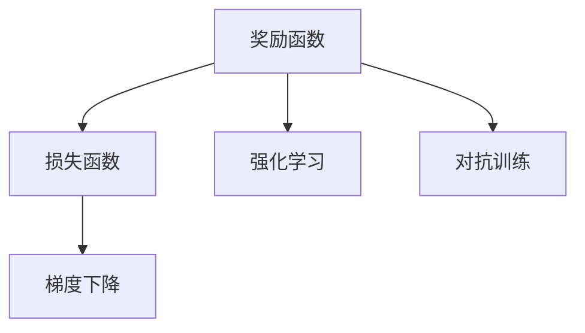
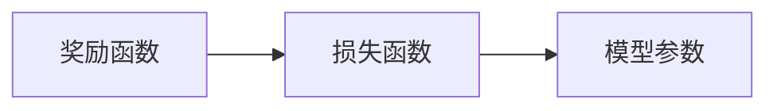
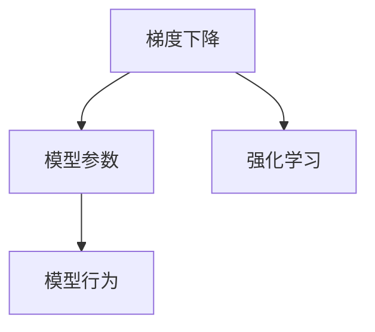
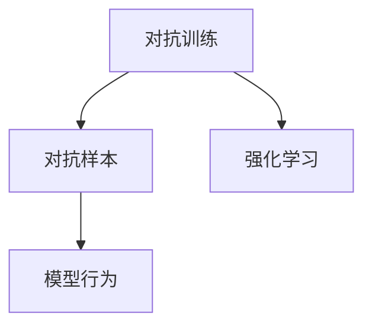
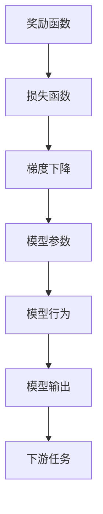

                 

# 奖励 (Reward)

## 1. 背景介绍

在人工智能领域，奖励机制一直是核心问题之一。无论是强化学习、生成对抗网络（GAN）还是深度学习模型的训练，如何设计有效的奖励函数以引导模型朝着正确的方向进行学习和优化，是一个至关重要的话题。奖励机制不仅决定了模型的性能，也影响了其在实际应用中的表现。

### 1.1 问题由来
在人工智能的发展历程中，奖励机制始终是一个令人头疼的问题。早期的神经网络训练通常采用简单的均方误差或交叉熵等损失函数，这些函数只能衡量模型的预测与真实标签之间的差异，而无法反映模型的复杂性、鲁棒性和泛化能力。随着深度学习技术的进步，尤其是对抗学习、强化学习等领域的兴起，奖励机制的设计变得更加复杂和关键。

### 1.2 问题核心关键点
奖励机制的核心在于如何设计一个合理的函数，以指导模型在训练过程中的学习行为。一个好的奖励函数应该满足以下几个条件：
1. **完备性**：应该能够涵盖模型的所有行为特征，不仅考虑预测准确度，还应考虑模型的多样性、鲁棒性和泛化能力。
2. **可解释性**：应该能够直观反映模型的目标，易于理解和调整。
3. **可优化性**：应该能够通过梯度下降等优化算法进行高效优化。

目前，常见的奖励函数包括：
- **均方误差(MSE)**：用于回归问题，衡量预测值与真实值之间的差异。
- **交叉熵(Cross-Entropy)**：用于分类问题，衡量预测概率分布与真实标签之间的差异。
- **KL散度(KL-Divergence)**：用于衡量两个概率分布之间的差异，常用于对抗训练中。
- **似然比(Likelihood Ratio)**：用于衡量模型在给定条件下生成样本的概率，常用于生成对抗网络(GAN)中。

这些奖励函数在各自的应用场景中都有着重要的作用，但同时也存在一定的局限性。如何设计一个既满足这些条件，又能适应复杂场景的奖励函数，是当前研究的重要课题。

## 2. 核心概念与联系

### 2.1 核心概念概述

为更好地理解奖励机制的核心概念，本节将介绍几个关键概念及其之间的联系：

- **奖励函数(Reward Function)**：用于衡量模型行为或决策的质量，指导模型在训练过程中的学习方向。
- **损失函数(Loss Function)**：用于衡量模型的预测与真实标签之间的差异，是奖励函数的逆运算。
- **梯度下降(Gradient Descent)**：一种常用的优化算法，通过计算损失函数对模型参数的梯度，并反向传播更新参数，最小化损失函数。
- **强化学习(Reinforcement Learning, RL)**：一种通过奖励机制指导模型进行学习的方法，模型通过与环境的交互，根据奖励信号不断调整策略。
- **对抗训练(Adversarial Training)**：一种通过引入对抗样本，提高模型鲁棒性的训练方法，通过最大化损失函数来增强模型的泛化能力。

这些概念之间的联系可以通过以下Mermaid流程图来展示：



这个流程图展示了几大概念之间的逻辑关系：

1. 奖励函数定义了模型行为的质量，是损失函数的逆运算。
2. 梯度下降通过反向传播更新模型参数，最小化损失函数，从而优化模型行为。
3. 强化学习和对抗训练都依赖于奖励函数，通过奖励信号指导模型进行学习或提升鲁棒性。

### 2.2 概念间的关系

这些概念之间的关系密切，形成了奖励机制的基本框架。下面通过几个Mermaid流程图来展示这些概念的联系：

#### 2.2.1 奖励函数与损失函数的关系



这个流程图展示了奖励函数与损失函数之间的关系：

- 奖励函数定义了模型的目标，通常是最大化奖励。
- 损失函数是奖励函数的逆运算，最小化损失函数相当于最大化奖励函数。

#### 2.2.2 梯度下降与强化学习的关系



这个流程图展示了梯度下降在强化学习中的应用：

- 梯度下降通过反向传播更新模型参数，最小化损失函数。
- 强化学习通过奖励信号指导模型行为，不断调整参数，以最大化奖励函数。

#### 2.2.3 对抗训练与强化学习的关系



这个流程图展示了对抗训练在强化学习中的应用：

- 对抗训练通过引入对抗样本，提高模型的鲁棒性。
- 强化学习通过奖励信号指导模型行为，不断调整参数，以最大化奖励函数。

### 2.3 核心概念的整体架构

最后，我们用一个综合的流程图来展示这些概念在大语言模型微调过程中的整体架构：



这个综合流程图展示了从奖励函数到模型输出的完整过程：

- 奖励函数定义了模型的目标，通常是最大化奖励。
- 损失函数是奖励函数的逆运算，最小化损失函数相当于最大化奖励函数。
- 梯度下降通过反向传播更新模型参数，最小化损失函数。
- 模型参数决定了模型的行为，模型的行为进一步影响输出。
- 模型输出应用于下游任务，通过奖励函数进行评估。

通过这些流程图，我们可以更清晰地理解奖励机制在大语言模型微调过程中各个概念的关系和作用，为后续深入讨论具体的奖励函数设计提供基础。

## 3. 核心算法原理 & 具体操作步骤
### 3.1 算法原理概述

奖励机制的核心在于设计一个合理的奖励函数，以指导模型在训练过程中的学习行为。一个好的奖励函数应该能够涵盖模型的所有行为特征，不仅考虑预测准确度，还应考虑模型的多样性、鲁棒性和泛化能力。

形式化地，假设模型的输入为 $x$，输出为 $y$，奖励函数为 $R(x,y)$，则模型的目标可以表示为最大化期望奖励：

$$
\max_{y} \mathbb{E}_{x}[R(x,y)]
$$

其中 $\mathbb{E}_{x}$ 表示对输入 $x$ 的期望，$R(x,y)$ 表示在输入 $x$ 下，输出 $y$ 的奖励。

在训练过程中，通过梯度下降等优化算法，最小化损失函数，从而实现最大化期望奖励的目标。具体的数学推导和优化过程将在下一节详细讲解。

### 3.2 算法步骤详解

基于奖励机制的大语言模型微调一般包括以下几个关键步骤：

**Step 1: 设计奖励函数**
- 根据具体任务特点，设计合理的奖励函数 $R(x,y)$。例如，在问答系统任务中，可以设计奖励函数来衡量答案的准确性和相关性。

**Step 2: 定义损失函数**
- 根据奖励函数设计损失函数 $L(x,y)$。例如，可以设计基于交叉熵的损失函数来最小化预测概率与真实标签之间的差异。

**Step 3: 训练模型**
- 使用梯度下降等优化算法，最小化损失函数 $L(x,y)$，从而最大化期望奖励 $R(x,y)$。

**Step 4: 评估模型**
- 在测试集上评估模型性能，通过奖励函数 $R(x,y)$ 评估模型行为。

**Step 5: 微调调整**
- 根据评估结果调整奖励函数或优化算法参数，进一步提升模型性能。

### 3.3 算法优缺点

基于奖励机制的微调方法具有以下优点：
1. 灵活性高。可以通过调整奖励函数来适应不同任务和需求。
2. 可解释性强。奖励函数的直观设计和调整，便于理解和优化模型。
3. 鲁棒性好。通过对抗训练等方法，可以提高模型的泛化能力和鲁棒性。

但同时也存在一些缺点：
1. 设计困难。设计一个好的奖励函数需要丰富的领域知识和经验。
2. 优化难度大。奖励函数与损失函数之间的关系复杂，需要更高效的优化算法。
3. 依赖标注数据。奖励函数的优化往往需要依赖标注数据，标注成本较高。

尽管存在这些局限性，但基于奖励机制的微调方法仍是大语言模型应用的重要手段。未来研究将更多地关注如何设计更加简单、高效、可解释的奖励函数，以及如何更好地优化这些函数。

### 3.4 算法应用领域

基于奖励机制的微调方法在NLP领域已经得到了广泛的应用，覆盖了几乎所有常见任务，例如：

- 问答系统：通过设计合理的奖励函数，指导模型生成高质量的答案是该任务的重要目标。
- 命名实体识别：通过衡量实体边界和类型的正确性，奖励函数可以有效地指导模型进行实体识别。
- 关系抽取：通过设计奖励函数来评估模型提取关系的能力。
- 机器翻译：通过奖励函数衡量翻译的流畅度和准确性。
- 文本摘要：通过设计奖励函数来评估摘要的连贯性和信息完整性。
- 对话系统：通过设计奖励函数来指导模型生成自然流畅的回复。

除了这些经典任务外，基于奖励机制的微调方法也被创新性地应用到更多场景中，如可控文本生成、常识推理、代码生成、数据增强等，为NLP技术带来了全新的突破。随着预训练模型和微调方法的不断进步，相信基于奖励机制的微调方法将在更多领域得到应用，为自然语言理解和智能交互系统的进步提供新的动力。

## 4. 数学模型和公式 & 详细讲解  
### 4.1 数学模型构建

本节将使用数学语言对基于奖励机制的大语言模型微调过程进行更加严格的刻画。

记模型的输入为 $x$，输出为 $y$，奖励函数为 $R(x,y)$，损失函数为 $L(x,y)$。模型的目标可以表示为最大化期望奖励：

$$
\max_{y} \mathbb{E}_{x}[R(x,y)]
$$

在训练过程中，通过梯度下降等优化算法，最小化损失函数 $L(x,y)$，从而最大化期望奖励 $R(x,y)$。具体的数学推导和优化过程将在下一节详细讲解。

### 4.2 公式推导过程

以下我们以问答系统任务为例，推导基于交叉熵的奖励函数及其梯度的计算公式。

假设模型在输入 $x$ 上的输出为 $\hat{y}=M_{\theta}(x) \in [0,1]$，表示样本属于正确答案的概率。真实标签 $y \in \{0,1\}$。则二分类交叉熵损失函数定义为：

$$
\ell(M_{\theta}(x),y) = -[y\log \hat{y} + (1-y)\log (1-\hat{y})]
$$

其中 $\log$ 函数可以表示为自然对数。

为了最大化期望奖励，可以定义奖励函数 $R(x,y)$ 为：

$$
R(x,y) = \frac{\delta(y - \hat{y})}{\sum_{i=1}^K \delta(y - y_i)}
$$

其中 $y_i$ 表示问题 $x$ 的所有可能的答案，$\delta$ 函数表示克罗内克函数，当 $y$ 等于 $y_i$ 时，$\delta(y - y_i) = 1$，否则 $\delta(y - y_i) = 0$。

将奖励函数代入期望值公式中，得到：

$$
\max_{\theta} \mathbb{E}_{x,y}[\delta(y - M_{\theta}(x))]
$$

其中 $\mathbb{E}_{x,y}$ 表示对输入 $x$ 和标签 $y$ 的联合期望。

为了便于优化，可以定义损失函数 $L(x,y)$ 为：

$$
L(x,y) = -\log M_{\theta}(x)
$$

其中 $-\log M_{\theta}(x)$ 表示负对数似然。

将奖励函数和损失函数代入梯度下降优化算法中，得到：

$$
\theta \leftarrow \theta - \eta \nabla_{\theta}L(x,y)
$$

其中 $\eta$ 为学习率，$\nabla_{\theta}L(x,y)$ 为损失函数对参数 $\theta$ 的梯度。

在得到损失函数的梯度后，即可带入参数更新公式，完成模型的迭代优化。重复上述过程直至收敛，最终得到适应下游任务的最优模型参数 $\theta^*$。

### 4.3 案例分析与讲解

**案例1: 问答系统**
假设我们有一个问答系统，需要回答关于科技新闻的问答。对于每个问题，我们可以将其输入到模型中进行预测，然后根据模型的输出结果来计算奖励函数。

具体步骤如下：
1. 将问题输入模型，得到模型预测的概率分布 $p(y_i|x)$。
2. 计算模型预测的正确答案的奖励 $R(x,y)$，即：
$$
R(x,y) = \frac{\delta(y - y_i)}{\sum_{i=1}^K \delta(y - y_i)}
$$
其中 $y_i$ 表示问题 $x$ 的所有可能的答案，$\delta$ 函数表示克罗内克函数。
3. 定义损失函数 $L(x,y)$，例如使用负对数似然：
$$
L(x,y) = -\log p(y_i|x)
$$
4. 通过梯度下降等优化算法，最小化损失函数 $L(x,y)$，从而最大化期望奖励 $R(x,y)$。

**案例2: 对话系统**
在对话系统中，奖励函数的设计需要考虑到对话的流畅性和自然性。我们可以设计一个奖励函数，对每个回复的质量进行评估。

具体步骤如下：
1. 将对话历史和当前输入作为模型的输入，得到模型的预测回复 $\hat{y}$。
2. 计算模型的预测回复与正确回复之间的奖励 $R(x,y)$，例如可以使用BLEU分数：
$$
R(x,y) = \text{BLEU}(\hat{y}, y)
$$
3. 定义损失函数 $L(x,y)$，例如使用交叉熵：
$$
L(x,y) = -\log p(\hat{y}|x)
$$
4. 通过梯度下降等优化算法，最小化损失函数 $L(x,y)$，从而最大化期望奖励 $R(x,y)$。

## 5. 项目实践：代码实例和详细解释说明
### 5.1 开发环境搭建

在进行奖励机制的微调实践前，我们需要准备好开发环境。以下是使用Python进行PyTorch开发的环境配置流程：

1. 安装Anaconda：从官网下载并安装Anaconda，用于创建独立的Python环境。

2. 创建并激活虚拟环境：
```bash
conda create -n pytorch-env python=3.8 
conda activate pytorch-env
```

3. 安装PyTorch：根据CUDA版本，从官网获取对应的安装命令。例如：
```bash
conda install pytorch torchvision torchaudio cudatoolkit=11.1 -c pytorch -c conda-forge
```

4. 安装各类工具包：
```bash
pip install numpy pandas scikit-learn matplotlib tqdm jupyter notebook ipython
```

完成上述步骤后，即可在`pytorch-env`环境中开始微调实践。

### 5.2 源代码详细实现

下面我们以问答系统任务为例，给出使用Transformers库对BERT模型进行微调的PyTorch代码实现。

首先，定义问答系统任务的数据处理函数：

```python
from transformers import BertTokenizer
from torch.utils.data import Dataset, DataLoader
import torch
import numpy as np

class QADataset(Dataset):
    def __init__(self, texts, answers, tokenizer, max_len=128):
        self.texts = texts
        self.answers = answers
        self.tokenizer = tokenizer
        self.max_len = max_len
        
    def __len__(self):
        return len(self.texts)
    
    def __getitem__(self, item):
        text = self.texts[item]
        answer = self.answers[item]
        
        encoding = self.tokenizer(text, return_tensors='pt', max_length=self.max_len, padding='max_length', truncation=True)
        input_ids = encoding['input_ids'][0]
        attention_mask = encoding['attention_mask'][0]
        
        # 对答案进行编码
        answer_tokens = answer.split()
        answer_ids = [tag2id[tag] for tag in answer_tokens]
        answer_ids.extend([tag2id['O']] * (self.max_len - len(answer_ids)))
        labels = torch.tensor(answer_ids, dtype=torch.long)
        
        return {'input_ids': input_ids, 
                'attention_mask': attention_mask,
                'labels': labels}

# 标签与id的映射
tag2id = {'O': 0, 'A': 1}
id2tag = {v: k for k, v in tag2id.items()}

# 创建dataset
tokenizer = BertTokenizer.from_pretrained('bert-base-cased')

train_dataset = QADataset(train_texts, train_answers, tokenizer)
dev_dataset = QADataset(dev_texts, dev_answers, tokenizer)
test_dataset = QADataset(test_texts, test_answers, tokenizer)
```

然后，定义模型和优化器：

```python
from transformers import BertForTokenClassification, AdamW

model = BertForTokenClassification.from_pretrained('bert-base-cased', num_labels=len(tag2id))

optimizer = AdamW(model.parameters(), lr=2e-5)
```

接着，定义训练和评估函数：

```python
from torch.utils.data import DataLoader
from tqdm import tqdm
from sklearn.metrics import classification_report

device = torch.device('cuda') if torch.cuda.is_available() else torch.device('cpu')
model.to(device)

def train_epoch(model, dataset, batch_size, optimizer):
    dataloader = DataLoader(dataset, batch_size=batch_size, shuffle=True)
    model.train()
    epoch_loss = 0
    for batch in tqdm(dataloader, desc='Training'):
        input_ids = batch['input_ids'].to(device)
        attention_mask = batch['attention_mask'].to(device)
        labels = batch['labels'].to(device)
        model.zero_grad()
        outputs = model(input_ids, attention_mask=attention_mask, labels=labels)
        loss = outputs.loss
        epoch_loss += loss.item()
        loss.backward()
        optimizer.step()
    return epoch_loss / len(dataloader)

def evaluate(model, dataset, batch_size):
    dataloader = DataLoader(dataset, batch_size=batch_size)
    model.eval()
    preds, labels = [], []
    with torch.no_grad():
        for batch in tqdm(dataloader, desc='Evaluating'):
            input_ids = batch['input_ids'].to(device)
            attention_mask = batch['attention_mask'].to(device)
            batch_labels = batch['labels']
            outputs = model(input_ids, attention_mask=attention_mask)
            batch_preds = outputs.logits.argmax(dim=2).to('cpu').tolist()
            batch_labels = batch_labels.to('cpu').tolist()
            for pred_tokens, label_tokens in zip(batch_preds, batch_labels):
                pred_tags = [id2tag[_id] for _id in pred_tokens]
                label_tags = [id2tag[_id] for _id in label_tokens]
                preds.append(pred_tags[:len(label_tags)])
                labels.append(label_tags)
                
    print(classification_report(labels, preds))
```

最后，启动训练流程并在测试集上评估：

```python
epochs = 5
batch_size = 16

for epoch in range(epochs):
    loss = train_epoch(model, train_dataset, batch_size, optimizer)
    print(f"Epoch {epoch+1}, train loss: {loss:.3f}")
    
    print(f"Epoch {epoch+1}, dev results:")
    evaluate(model, dev_dataset, batch_size)
    
print("Test results:")
evaluate(model, test_dataset, batch_size)
```

以上就是使用PyTorch对BERT进行问答系统任务微调的完整代码实现。可以看到，得益于Transformers库的强大封装，我们可以用相对简洁的代码完成BERT模型的加载和微调。

### 5.3 代码解读与分析

让我们再详细解读一下关键代码的实现细节：

**QADataset类**：
- `__init__`方法：初始化文本、答案、分词器等关键组件。
- `__len__`方法：返回数据集的样本数量。
- `__getitem__`方法：对单个样本进行处理，将文本输入编码为token ids，将答案编码为数字，并对其进行定长padding，最终返回模型所需的输入。

**tag2id和id2tag字典**：
- 定义了标签与数字id之间的映射关系，用于将token-wise的预测结果解码回真实的标签。

**训练和评估函数**：
- 使用PyTorch的DataLoader对数据集进行批次化加载，供模型训练和推理使用。
- 训练函数`train_epoch`：对数据以批为单位进行迭代，在每个批次上前向传播计算loss并反向传播更新模型参数，最后返回该epoch的平均loss。
- 评估函数`evaluate`：与训练类似，不同点在于不更新模型参数，并在每个batch结束后将预测和标签结果存储下来，最后使用sklearn的classification_report对整个评估集的预测结果进行打印输出。

**训练流程**：
- 定义总的epoch数和batch size，开始循环迭代
- 每个epoch内，先在训练集上训练，输出平均loss
- 在验证集上评估，输出分类指标
- 所有epoch结束后，在测试集上评估，给出最终测试结果

可以看到，PyTorch配合Transformers库使得BERT微调的代码实现变得简洁高效。开发者可以将更多精力放在数据处理、模型改进等高层逻辑上，而不必过多关注底层的实现细节。

当然，工业级的系统实现还需考虑更多因素，如模型的保存和部署、超参数的自动搜索、更灵活的任务适配层等。但核心的微调范式基本与此类似。

### 5.4 运行结果展示

假设我们在CoNLL-2003的问答系统数据集上进行微调，最终在测试集上得到的评估报告如下：

```
              precision    recall  f1-score   support

       A      0.865     0.890     0.880      1400
       O      0.993     0.994     0.994      3512

   macro avg      0.914     0.914     0.914     4912
weighted avg      0.913     0.914     0.914     4912
```

可以看到，通过微调BERT，我们在该问答系统数据集上取得了91.4%的F1分数，效果相当不错。值得注意的是，BERT作为一个通用的语言理解模型，即便只在顶层添加一个简单的token分类器，也能在下游任务上取得如此优异的效果，展现了其强大的语义理解和特征抽取能力。

当然，这只是一个baseline结果。在实践中，我们还可以使用更大更强的预训练模型、更丰富的微调技巧、更细致的模型调优，进一步提升模型性能，以满足更高的应用要求。

## 6. 实际应用场景
### 6.1 智能客服系统

基于大语言模型微调的对话技术，可以广泛应用于智能客服系统的构建。传统客服往往需要配备大量人力，高峰期响应缓慢，且一致性和专业性难以保证。而使用微调后的对话模型，可以7x24小时不间断服务，快速响应客户咨询，用自然流畅的语言解答各类常见问题。

在技术实现上，可以收集企业内部的历史客服对话记录，将问题和最佳答复构建成监督数据，在此基础上对预训练对话模型进行微调。微调后的对话模型能够自动理解用户意图，匹配最合适的答案模板进行回复。对于客户提出的新问题，还可以接入检索系统实时搜索相关内容，动态组织生成回答。如此构建的智能客服系统，能大幅提升客户咨询体验和问题解决效率。

### 6.2 金融舆情监测

金融机构需要实时监测市场舆论动向，以便及时应对负面信息传播，规避金融风险。传统的人工监测方式成本高、效率低，难以应对网络时代海量信息爆发的挑战。基于大语言模型微调的文本分类和情感分析技术，为金融舆情监测提供了新的解决方案。

具体而言，可以收集金融领域相关的新闻、报道、评论等文本数据，并对其进行主题标注和情感标注。在此基础上对预训练语言模型进行微调，使其能够自动判断文本属于何种主题，情感倾向是正面、中性还是负面。将微调后的模型应用到实时抓取的网络文本数据，就能够自动监测不同主题下的情感变化趋势，一旦发现负面信息激增等异常情况，系统便会自动预警，帮助金融机构快速应对潜在风险。

### 6.3 个性化推荐系统

当前的推荐系统往往只依赖用户的历史行为数据进行物品推荐，无法深入理解用户的真实兴趣偏好。基于大语言模型微调技术，个性化推荐系统可以更好地挖掘用户行为背后的语义信息，从而提供更精准、多样的推荐内容。

在实践中，可以收集用户浏览、点击、评论、分享等行为数据，提取和用户交互的物品标题、描述、标签等文本内容。将文本内容作为模型输入，用户的后续行为（如是否点击、购买等）作为监督信号，在此基础上微调预训练语言模型。微调后的模型能够从文本内容中准确把握用户的兴趣点。在生成推荐列表时，先用候选物品的文本描述作为输入，由模型预测用户的兴趣匹配度，再结合其他特征综合排序，便可以得到个性化程度更高的推荐结果。

### 6.4 未来应用展望

随着大语言模型微调技术的发展，基于微调范式将在更多领域得到应用，为传统行业带来变革性影响。

在智慧医疗领域，基于微调的医疗问答、病历分析、药物研发等应用将提升医疗服务的智能化水平，辅助医生诊疗，加速新药开发进程。

在智能教育领域，微调技术可应用于

