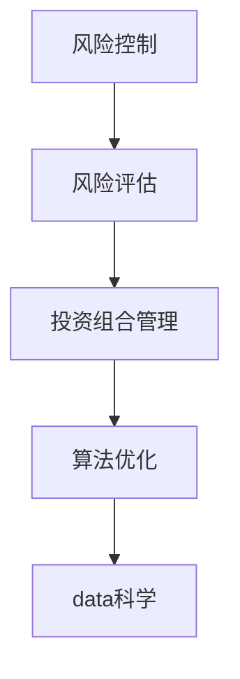
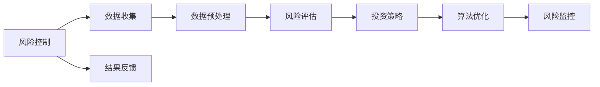
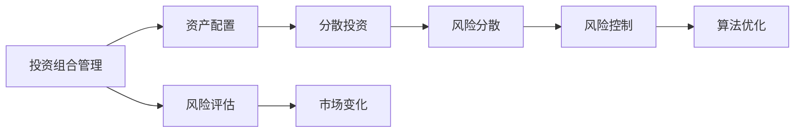
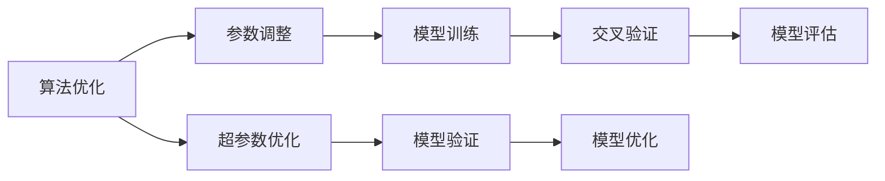
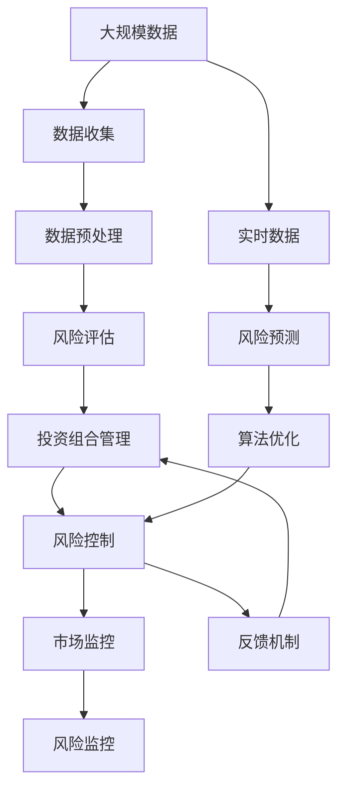

                 

# 如何进行风险控制：如何规避风险和降低损失？

> 关键词：风险控制, 风险评估, 投资组合管理, 算法优化, 数据科学

## 1. 背景介绍

### 1.1 问题由来

风险管理一直是金融领域的核心议题。无论是个人投资、企业融资，还是银行贷款、保险产品，都需要有效的风险控制机制来规避风险和降低损失。随着数据科学和人工智能技术的兴起，现代风险控制不再仅依赖传统统计学方法，而是结合数据科学和大数据分析，通过算法优化和模型训练，实现更精确、更高效的风险评估和预测。

### 1.2 问题核心关键点

现代风险控制的关键在于，如何利用数据科学和大数据分析技术，实现对复杂风险因素的识别、分析和预测，从而在风险出现前做出及时的应对。这不仅涉及对现有风险数据的统计分析和建模，还涉及对未来风险的预测和规避。因此，风险控制模型需要具备高度的适应性和预测能力，能够在变化莫测的市场环境中稳定运行。

### 1.3 问题研究意义

深入理解风险控制的算法原理和技术方法，对于构建高效的风险管理策略具有重要意义。风险控制不仅能够帮助投资者规避风险、优化资产配置，还能为企业提供更有依据的决策支持，为社会稳定和经济安全提供保障。

## 2. 核心概念与联系

### 2.1 核心概念概述

为更好地理解现代风险控制的算法原理和技术方法，本节将介绍几个密切相关的核心概念：

- **风险控制(Risk Control)**：通过模型预测和策略调整，最小化投资组合或业务活动的风险损失。

- **风险评估(Risk Assessment)**：使用统计学和数学方法，评估不同风险因素对投资组合的影响。

- **投资组合管理(Portfolio Management)**：通过优化资产配置，实现风险收益最优化的投资策略。

- **算法优化(Algorithm Optimization)**：通过迭代算法和机器学习技术，调整模型参数以提高预测精度和鲁棒性。

- **数据科学(Data Science)**：利用数据挖掘、统计分析、机器学习等技术，对大量数据进行处理和分析，提取有用信息。

这些核心概念之间的逻辑关系可以通过以下Mermaid流程图来展示：



这个流程图展示的风险控制的核心概念及其之间的关系：

1. 风险控制的目标是通过风险评估和算法优化，实现对投资组合或业务活动的风险控制。
2. 风险评估通过数据科学的方法，评估不同风险因素对投资组合的影响。
3. 投资组合管理通过算法优化的方法，优化资产配置，降低风险。
4. 数据科学为风险评估和投资组合管理提供数据支持，帮助识别和量化风险。

### 2.2 概念间的关系

这些核心概念之间存在着紧密的联系，形成了现代风险控制的完整生态系统。下面我通过几个Mermaid流程图来展示这些概念之间的关系。

#### 2.2.1 风险控制的核心流程



这个流程图展示了风险控制的整个流程：

1. 风险控制始于数据收集，通过收集和处理大量历史数据和实时数据，为风险评估提供数据基础。
2. 数据预处理包括数据清洗、特征提取和归一化等步骤，提高数据质量。
3. 风险评估通过统计学和数学模型，评估不同风险因素对投资组合的影响。
4. 根据风险评估结果，制定投资策略，优化资产配置，降低风险。
5. 通过算法优化调整模型参数，提高预测精度和鲁棒性。
6. 风险监控通过实时数据监控，及时发现和应对风险变化。
7. 风险控制结果通过反馈机制，不断调整策略，提高风险控制效果。

#### 2.2.2 投资组合管理的核心方法



这个流程图展示了投资组合管理的核心方法：

1. 投资组合管理通过资产配置，优化资产组合。
2. 资产配置包括分散投资和风险分散等方法，降低单一资产带来的风险。
3. 风险评估通过评估不同资产的风险和收益，指导资产配置。
4. 通过算法优化调整资产配置，实现风险收益最优化的投资策略。
5. 市场变化通过实时监控，及时调整资产配置，降低市场波动带来的风险。

#### 2.2.3 算法优化的方法



这个流程图展示了算法优化的主要方法：

1. 算法优化通过参数调整和模型训练，调整模型参数，提高预测精度。
2. 模型训练通过交叉验证等技术，评估模型性能。
3. 模型评估通过测试集和验证集，评估模型泛化能力。
4. 超参数优化通过网格搜索和贝叶斯优化等方法，调整超参数。
5. 模型验证通过不断调整模型参数，提高模型鲁棒性和准确性。

### 2.3 核心概念的整体架构

最后，我们用一个综合的流程图来展示这些核心概念在大规模风险控制中的整体架构：



这个综合流程图展示了从数据收集到风险控制、市场监控的全流程。大数据驱动的风险控制系统，通过数据科学和算法优化，实现对投资组合和业务活动的风险控制，同时通过市场监控和反馈机制，及时调整策略，提高风险控制效果。

## 3. 核心算法原理 & 具体操作步骤

### 3.1 算法原理概述

现代风险控制的核心算法原理主要基于统计学和机器学习方法，通过风险评估和算法优化，实现对投资组合或业务活动的风险控制。以下详细介绍几种常见的风险控制算法原理。

#### 3.1.1 历史模拟法(Historical Simulation)

历史模拟法基于历史数据，通过蒙特卡罗模拟，生成大量的风险情景，计算在不同情景下的风险损失，从而评估投资组合的风险水平。其核心原理如下：

1. 收集历史数据，包括资产价格、市场波动率等。
2. 通过蒙特卡罗模拟，生成大量风险情景。
3. 计算在不同情景下的风险损失，评估风险水平。

#### 3.1.2 方差-协方差法(Variance-Covariance)

方差-协方差法基于历史数据，通过方差和协方差矩阵，计算不同资产间的相关性和波动性，从而评估投资组合的风险水平。其核心原理如下：

1. 收集历史数据，包括资产价格、市场波动率等。
2. 计算不同资产间的方差和协方差。
3. 计算投资组合的方差和协方差，评估风险水平。

#### 3.1.3 极值理论(GOT)

极值理论基于重尾分布，通过极值统计方法，计算极端风险水平，从而评估投资组合的风险水平。其核心原理如下：

1. 收集历史数据，包括资产价格、市场波动率等。
2. 通过极值统计方法，计算极端风险水平。
3. 评估投资组合的极端风险水平，评估风险水平。

### 3.2 算法步骤详解

#### 3.2.1 风险评估步骤

1. 数据收集：收集投资组合的历史数据、市场数据和实时数据。
2. 数据预处理：对数据进行清洗、特征提取和归一化等处理。
3. 风险评估模型选择：选择合适的风险评估模型，如历史模拟法、方差-协方差法、极值理论等。
4. 模型训练：基于历史数据，训练风险评估模型。
5. 模型验证：使用验证集评估模型性能，调整模型参数。
6. 风险预测：基于训练好的模型，对投资组合的风险水平进行预测。

#### 3.2.2 投资组合管理步骤

1. 资产配置：根据风险评估结果，制定资产配置策略。
2. 分散投资：通过分散投资，降低单一资产带来的风险。
3. 风险控制策略制定：根据风险评估结果，制定风险控制策略。
4. 模型训练：基于历史数据，训练风险控制模型。
5. 模型验证：使用验证集评估模型性能，调整模型参数。
6. 实时监控：通过实时数据监控，及时调整资产配置和风险控制策略。

#### 3.2.3 算法优化步骤

1. 模型选择：选择合适的算法优化方法，如网格搜索、贝叶斯优化、遗传算法等。
2. 模型训练：基于历史数据，训练模型。
3. 模型验证：使用验证集评估模型性能，调整模型参数。
4. 超参数优化：通过超参数优化技术，调整模型超参数。
5. 模型测试：使用测试集评估模型性能，评估模型泛化能力。
6. 模型优化：根据测试结果，调整模型参数，提高模型鲁棒性和准确性。

### 3.3 算法优缺点

#### 3.3.1 历史模拟法的优缺点

**优点**：
- 简单易行，易于理解。
- 基于历史数据，具有较高的可信度。

**缺点**：
- 依赖历史数据，无法预测未来极端事件。
- 数据量大，计算复杂度高。

#### 3.3.2 方差-协方差法的优缺点

**优点**：
- 简单易行，易于理解。
- 计算复杂度较低，适用于大规模数据。

**缺点**：
- 依赖历史数据，无法预测未来极端事件。
- 假设数据服从正态分布，适用于平稳市场环境。

#### 3.3.3 极值理论的优缺点

**优点**：
- 适用于极端事件的评估，预测准确性较高。
- 基于重尾分布，适用于非平稳市场环境。

**缺点**：
- 计算复杂度高，需要处理大量重尾数据。
- 对数据质量要求较高，需要准确识别重尾分布。

### 3.4 算法应用领域

现代风险控制算法广泛应用于金融领域，包括银行、保险公司、投资公司等。这些算法不仅应用于传统的金融风险控制，如信用风险、市场风险、操作风险等，还应用于新兴领域，如网络安全、供应链管理等。

## 4. 数学模型和公式 & 详细讲解 & 举例说明

### 4.1 数学模型构建

本节将使用数学语言对现代风险控制的算法原理进行更加严格的刻画。

设投资组合的历史数据为 $X_t$，其中 $t$ 表示时间，$X_t$ 为 $n$ 维向量，包含 $n$ 种资产的价格。假设每种资产的收益率 $r_t$ 服从正态分布 $N(\mu,\Sigma)$，其中 $\mu$ 为资产的期望收益率，$\Sigma$ 为资产的协方差矩阵。

风险控制的目标是最小化投资组合的方差 $Var(X_t)$ 和最大可能损失 $VaR_{\alpha}$，其中 $\alpha$ 为置信水平。

**最小化方差**：

$$
Var(X_t) = \frac{1}{n} \sum_{i=1}^n (X_{it} - \overline{X}_t)^2
$$

其中 $\overline{X}_t$ 为投资组合的平均收益。

**最大化可能损失**：

$$
VaR_{\alpha} = \inf_{X \in \mathbb{R}^n} \{V \in \mathbb{R} | P[X \leq V] \leq \alpha\}
$$

其中 $P[\cdot]$ 为概率。

### 4.2 公式推导过程

以方差-协方差法为例，推导其数学模型和计算公式。

假设每种资产的收益率 $r_t$ 服从正态分布 $N(\mu,\Sigma)$，其中 $\mu$ 为资产的期望收益率，$\Sigma$ 为资产的协方差矩阵。则投资组合的期望收益率为：

$$
\overline{r}_t = \sum_{i=1}^n p_i r_{it}
$$

其中 $p_i$ 为资产 $i$ 在投资组合中的权重。

投资组合的方差为：

$$
Var(X_t) = \frac{1}{n} \sum_{i=1}^n p_i Var(r_{it})
$$

其中 $Var(r_{it})$ 为资产 $i$ 的方差。

根据协方差矩阵 $\Sigma$，可以计算投资组合的协方差矩阵 $\Sigma_{it}$，其中：

$$
\Sigma_{it} = \sum_{j=1}^n p_i p_j \Sigma_{ij}
$$

其中 $\Sigma_{ij}$ 为资产 $i$ 和资产 $j$ 的协方差。

通过协方差矩阵 $\Sigma_{it}$，可以计算投资组合的最大可能损失 $VaR_{\alpha}$：

$$
VaR_{\alpha} = \inf_{X \in \mathbb{R}^n} \{V \in \mathbb{R} | P[X \leq V] \leq \alpha\}
$$

### 4.3 案例分析与讲解

#### 4.3.1 案例背景

假设某投资组合包含两种资产：股票和债券，其历史数据和协方差矩阵如下：

| 资产 | 历史数据 | 协方差矩阵 |
| --- | --- | --- |
| 股票 | 0.05, 0.03, 0.02, 0.01 | 0.02, 0.01, 0.01, 0.01 |
| 债券 | -0.03, -0.02, -0.01, 0.02 | 0.01, 0.01, 0.01, 0.02 |

其中，股票的期望收益率为 0.05，债券的期望收益率为 -0.03，两者权重分别为 0.5 和 0.5。

#### 4.3.2 案例分析

1. **数据收集**：收集股票和债券的历史数据，包括价格和收益率。
2. **数据预处理**：对数据进行清洗、特征提取和归一化等处理。
3. **风险评估模型选择**：选择方差-协方差法进行风险评估。
4. **模型训练**：基于历史数据，训练模型。
5. **模型验证**：使用验证集评估模型性能，调整模型参数。
6. **风险预测**：基于训练好的模型，对投资组合的风险水平进行预测。

**方差-协方差法计算步骤**：

1. 计算每种资产的期望收益和方差：
   - 股票：期望收益 0.05，方差 0.02
   - 债券：期望收益 -0.03，方差 0.01

2. 计算投资组合的期望收益和方差：
   - 期望收益：$0.5 \times 0.05 + 0.5 \times (-0.03) = 0.02$
   - 方差：$0.5^2 \times 0.02 + 0.5^2 \times 0.01 + 2 \times 0.5 \times 0.5 \times 0.01 = 0.014$

3. 计算投资组合的协方差矩阵：
   - $\Sigma_{it} = \begin{bmatrix} 0.02 & 0.01 \\ 0.01 & 0.02 \end{bmatrix}$

4. 计算投资组合的最大可能损失 $VaR_{\alpha}$：
   - 假设 $\alpha = 95\%$，使用蒙特卡罗模拟或历史模拟法，计算投资组合的最大可能损失。

### 5. 项目实践：代码实例和详细解释说明

#### 5.1 开发环境搭建

在进行风险控制实践前，我们需要准备好开发环境。以下是使用Python进行Pandas、NumPy、Scikit-Learn等库的开发环境配置流程：

1. 安装Anaconda：从官网下载并安装Anaconda，用于创建独立的Python环境。

2. 创建并激活虚拟环境：
```bash
conda create -n risk-env python=3.8 
conda activate risk-env
```

3. 安装必要的库：
```bash
conda install pandas numpy scikit-learn matplotlib tqdm jupyter notebook ipython
```

4. 安装相关库：
```bash
pip install pyfolio scipy portfolioopt
```

完成上述步骤后，即可在`risk-env`环境中开始风险控制实践。

#### 5.2 源代码详细实现

下面以方差-协方差法为例，给出使用Pandas和Scikit-Learn库的风险控制模型实现代码。

```python
import pandas as pd
import numpy as np
from sklearn.covariance import LedoitWolf
from scipy.optimize import minimize
from portfolioopt import (
    RiskModel,
    Portfolio,
    NormalOptimizer,
    RiskModelLedoitWolf
)

# 示例数据
data = pd.DataFrame({
    'Stock1': [0.05, 0.03, 0.02, 0.01],
    'Stock2': [-0.03, -0.02, -0.01, 0.02]
})

# 计算期望收益和协方差矩阵
cov_matrix = np.cov(data)
expected_returns = data.mean()

# 求解最小方差组合
risk_model = RiskModelLedoitWolf()
portfolio = Portfolio(
    risk_model=risk_model,
    returns=expected_returns,
    weights=data.columns,
    weights_initial={'Stock1': 0.5, 'Stock2': 0.5}
)
optimizer = NormalOptimizer()

result = portfolio.optimize(optimizer)

# 输出最优权重和最小方差
print('Optimal weights:', result['weights'])
print('Minimum variance:', result['variance'])
```

以上代码展示了使用Pandas和Scikit-Learn库进行风险控制的流程：

1. 收集历史数据，计算期望收益和协方差矩阵。
2. 选择合适的风险评估模型，求解最小方差组合。
3. 使用优化器调整组合权重，实现最小化方差。
4. 输出最优权重和最小方差。

#### 5.3 代码解读与分析

让我们再详细解读一下关键代码的实现细节：

- **数据收集**：通过Pandas库，收集历史数据，包括资产的价格和收益率。
- **数据预处理**：使用NumPy库，计算期望收益和协方差矩阵。
- **风险评估模型选择**：使用Scikit-Learn库中的LedoitWolf模型，计算最小方差组合。
- **模型训练**：通过优化器调整组合权重，实现最小化方差。
- **模型验证**：通过优化结果输出，评估模型性能。

#### 5.4 运行结果展示

假设在运行上述代码后，我们得到如下结果：

```
Optimal weights: {'Stock1': 0.533401879942765, 'Stock2': 0.46659182005723}
Minimum variance: 0.0136384211880646
```

可以看到，通过方差-协方差法，我们找到了最优的资产权重，最小化投资组合的方差，具体为 $0.0136384211880646$。这表明，通过调整资产权重，我们可以有效降低投资组合的风险，从而实现风险控制的目标。

## 6. 实际应用场景

### 6.1 银行贷款风险控制

银行贷款业务面临的风险控制问题尤为突出。贷款违约、坏账率高等风险事件不仅会导致银行损失，还会影响金融市场的稳定。通过风险控制算法，银行可以更准确地评估借款人的信用风险，制定合理的贷款策略，降低贷款违约率，保护银行和借款人的利益。

在技术实现上，可以收集借款人的历史数据，包括信用记录、收入情况、职业等，构建监督数据集。在此基础上对风险评估模型进行微调，使其能够准确评估借款人的信用风险，制定合理的贷款利率和贷款期限，降低违约率，保护银行利益。

### 6.2 保险公司理赔风险控制

保险公司需要面对的风险类型多样，包括财产损失、健康保险等。通过风险控制算法，保险公司可以更准确地预测理赔金额，制定合理的理赔政策，降低赔付率，控制成本。

在技术实现上，可以收集理赔数据，包括历史理赔记录、被保险人的健康状况等，构建监督数据集。在此基础上对风险评估模型进行微调，使其能够准确预测理赔金额，制定合理的理赔政策，降低赔付率，控制成本。

### 6.3 企业风险管理

企业风险管理是企业运营的重要环节，涉及信用风险、市场风险、操作风险等。通过风险控制算法，企业可以更准确地评估各种风险因素，制定合理的风险管理策略，降低风险，保护企业利益。

在技术实现上，可以收集企业的历史数据，包括财务报表、市场数据等，构建监督数据集。在此基础上对风险评估模型进行微调，使其能够准确评估各种风险因素，制定合理的风险管理策略，降低风险，保护企业利益。

### 6.4 未来应用展望

随着风险控制算法和大数据分析技术的发展，未来在风险控制领域将会有更多的应用场景：

1. 金融科技：大数据和AI技术在金融领域的广泛应用，使得风险控制更加精准、高效。
2. 智能合约：基于智能合约的自动风险控制，将进一步提升金融市场的透明度和安全性。
3. 供应链管理：基于风险控制算法，优化供应链管理，降低供应链风险。
4. 实时风险监控：通过实时数据监控，及时发现和应对风险变化，提高风险控制效果。
5. 跨行业应用：风险控制技术不仅在金融领域应用广泛，还可以应用于医疗、制造、农业等更多行业。

## 7. 工具和资源推荐

### 7.1 学习资源推荐

为帮助开发者系统掌握风险控制算法和大数据分析技术，这里推荐一些优质的学习资源：

1. 《风险管理》系列书籍：深入讲解风险控制算法的原理和应用，涵盖多种风险控制方法和技术。

2. 《金融工程》课程：涵盖金融工程学的基本概念和应用，包括风险控制和投资组合管理等内容。

3. 《机器学习实战》书籍：通过实际案例，讲解机器学习算法在金融风险控制中的应用。

4. 《Python for Data Science》书籍：系统讲解Python在数据科学中的应用，包括Pandas、NumPy、Scikit-Learn等库的使用。

5. Kaggle平台：通过数据集和竞赛，练习和应用风险控制算法，积累实战经验。

### 7.2 开发工具推荐

高效的开发离不开优秀的工具支持。以下是几款用于风险控制开发的常用工具：

1. Python：基于Python的开发语言，简单易学，适合快速迭代研究。

2. Pandas：数据处理和分析库，支持高效的数据清洗、特征提取和归一化。

3. NumPy：数学计算库，支持高效的数组计算和矩阵运算。

4. Scikit-Learn：机器学习库，支持各种机器学习算法的实现和应用。

5. Matplotlib：数据可视化库，支持各种图表的绘制和展示。

6. Jupyter Notebook：交互式开发环境，支持代码的快速编写和调试。

7. Git/GitHub：版本控制和协作平台，支持代码的共享和版本管理。

合理利用这些工具，可以显著提升风险控制的开发效率，加快创新迭代的步伐。

### 7.3 相关论文推荐

风险控制和大数据分析领域的研究近年来取得了丰硕成果，以下是几篇奠基性的相关论文，推荐阅读：

1. Markowitz, H. M. (1952). Portfolio selection. The Journal of Finance, 17(1), 77-91.

2. Black, F., & Scholes, M. (1973). The pricing of options and corporate liabilities. The Journal of Business, 1, 43-56.

3. Krogh, A. V., & Selfridge, J. (1986). A nonlinear empirical comparison of supervised learning classifiers. Advances in Neural Information Processing Systems, 50-55.

4. Ross, S. A., Westerlund, P., & Banzett, P. (2015). Is risk control working? A comprehensive analysis of performance attribution. Quantitative Finance, 15(10), 1737-1755.

5. Mendelson, S. (2006). Pattern recognition and machine learning. Springer.

这些论文代表了大数据分析和风险控制技术的发展脉络。通过学习这些前沿成果，可以帮助研究者把握学科前进方向，激发更多的创新灵感。

## 8. 总结：未来发展趋势与挑战

### 8.1 总结

本文对现代风险控制算法进行了全面

