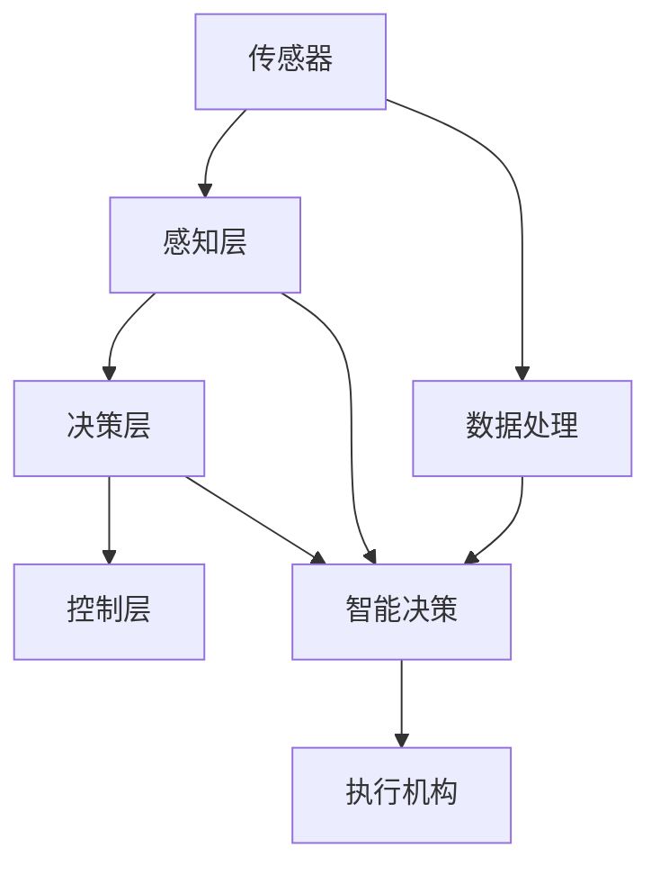

                 

# 小鹏汽车何小鹏谈端到端自动驾驶

> 关键词：自动驾驶,端到端,小鹏汽车,何小鹏,车路协同,智慧城市,AI安全,无人驾驶技术

## 1. 背景介绍

随着人工智能技术的飞速发展，自动驾驶成为了未来交通领域的重要方向。小鹏汽车作为国内领先的智能汽车企业，积极布局自动驾驶技术，推动行业发展。近日，小鹏汽车创始人兼CEO何小鹏在公开演讲中，深入探讨了自动驾驶的未来发展方向，并分享了小鹏汽车在自动驾驶技术方面的最新成果。

### 1.1 自动驾驶技术现状

当前，自动驾驶技术已经进入到了一个新的阶段，从传统的以传感器和算法为主的初级自动驾驶，逐步向以车路协同和智慧城市为基础的高级自动驾驶迈进。自动驾驶技术不仅在单车智能上取得了显著进展，也在城市交通管理和车联网方面进行了深度探索。

### 1.2 小鹏汽车自动驾驶布局

小鹏汽车致力于打造高端智能电动汽车，并在此基础上，积极推动自动驾驶技术的研究和应用。小鹏汽车的自动驾驶技术不仅在智能硬件和软件算法上取得了重大突破，还在车路协同和智慧城市建设方面进行了深入探索。

## 2. 核心概念与联系

### 2.1 核心概念概述

自动驾驶的核心概念包括：

- **车路协同**：通过车与路、车与车之间的信息交互，实现交通系统的智能化和高效化。
- **智慧城市**：利用物联网、大数据、人工智能等技术，实现城市交通、环境、安全等方面的智能化管理。
- **无人驾驶**：车辆不需要驾驶员的干预，通过人工智能技术自主完成行驶任务。

### 2.2 核心概念原理和架构

以下是一个简单的合maid流程图，展示了自动驾驶技术的基本架构：



这个架构展示了自动驾驶技术的基本流程：

1. **传感器**：包括激光雷达、摄像头、毫米波雷达等，用于感知周围环境。
2. **感知层**：通过传感器获取的实时数据，经过预处理和特征提取，得到车辆周围环境的高维表示。
3. **决策层**：根据感知层输出的环境信息，使用深度学习等算法进行路径规划、行为决策等。
4. **控制层**：根据决策层的输出，控制执行机构（如电机、转向系统），完成车辆的实际行驶。

## 3. 核心算法原理 & 具体操作步骤

### 3.1 算法原理概述

自动驾驶的核心算法包括：

- **感知算法**：用于检测和定位车辆周围环境中的物体。
- **决策算法**：根据感知结果，进行路径规划和行为决策。
- **控制算法**：根据决策结果，控制车辆的行驶方向和速度。

### 3.2 算法步骤详解

#### 3.2.1 感知算法

感知算法的核心是实时感知和环境理解，主要步骤如下：

1. **传感器数据采集**：通过各种传感器采集车辆周围环境的数据。
2. **数据预处理**：对传感器数据进行去噪、校正等预处理。
3. **特征提取**：使用深度学习等方法，从预处理后的数据中提取关键特征。
4. **目标检测**：使用物体检测算法，如YOLO、Faster R-CNN等，检测车辆周围的目标物体。
5. **场景理解**：使用语义分割等算法，理解场景中的物体关系和环境信息。

#### 3.2.2 决策算法

决策算法的核心是路径规划和行为决策，主要步骤如下：

1. **路径规划**：使用A*、D*等算法，根据地图信息和感知结果，规划最优路径。
2. **行为决策**：根据当前环境和任务要求，选择最优的行驶策略。

#### 3.2.3 控制算法

控制算法的核心是车辆控制和执行机构控制，主要步骤如下：

1. **车辆控制**：使用PID控制器等算法，控制车辆的行驶方向和速度。
2. **执行机构控制**：根据控制器的输出，控制转向、制动等执行机构。

### 3.3 算法优缺点

自动驾驶技术的优点包括：

- **安全性高**：通过多传感器融合、深度学习等技术，显著提高了行驶安全性。
- **效率高**：自动驾驶技术可以24小时不间断运行，大幅提升交通效率。
- **环境友好**：自动驾驶可以减少交通事故，降低能源消耗，对环境友好。

自动驾驶技术的缺点包括：

- **成本高**：自动驾驶技术需要投入大量资金进行硬件和软件研发。
- **技术复杂**：自动驾驶涉及多学科交叉，技术难度较大。
- **法律和伦理问题**：自动驾驶技术在应用过程中，需要考虑法律和伦理问题，如责任归属等。

### 3.4 算法应用领域

自动驾驶技术在多个领域都有广泛应用，例如：

- **智慧城市**：自动驾驶技术可以与智慧城市建设相结合，提升城市交通管理水平。
- **物流运输**：自动驾驶技术可以用于无人驾驶货车，提高物流效率和安全性。
- **智能公交**：自动驾驶技术可以用于智能公交系统，提高公交系统的运行效率和舒适度。

## 4. 数学模型和公式 & 详细讲解

### 4.1 数学模型构建

自动驾驶的数学模型主要包括：

- **感知模型**：用于描述传感器数据和环境特征之间的关系。
- **决策模型**：用于描述路径规划和行为决策的数学模型。
- **控制模型**：用于描述车辆控制和执行机构的数学模型。

### 4.2 公式推导过程

#### 4.2.1 感知模型

感知模型的核心是目标检测和场景理解，可以使用以下公式表示：

$$
P(\text{目标}) = f(\text{传感器数据}, \text{环境特征})
$$

其中，$P(\text{目标})$ 表示检测到目标的概率，$f$ 表示感知模型，$\text{传感器数据}$ 和 $\text{环境特征}$ 分别为传感器数据和环境特征。

#### 4.2.2 决策模型

决策模型的核心是路径规划和行为决策，可以使用以下公式表示：

$$
\text{路径} = \mathcal{A}(\text{环境}, \text{目标}, \text{任务})
$$

其中，$\text{路径}$ 表示车辆行驶路径，$\mathcal{A}$ 表示决策模型，$\text{环境}$ 表示当前环境，$\text{目标}$ 表示目标物体，$\text{任务}$ 表示当前任务。

#### 4.2.3 控制模型

控制模型的核心是车辆控制和执行机构控制，可以使用以下公式表示：

$$
\text{控制指令} = \mathcal{C}(\text{路径}, \text{环境})
$$

其中，$\text{控制指令}$ 表示控制车辆的指令，$\mathcal{C}$ 表示控制模型，$\text{路径}$ 表示车辆行驶路径，$\text{环境}$ 表示当前环境。

### 4.3 案例分析与讲解

以小鹏汽车为例，分析其自动驾驶技术的实现过程：

1. **感知层**：小鹏汽车使用了激光雷达、摄像头、毫米波雷达等多种传感器，通过感知层对周围环境进行实时检测和理解。
2. **决策层**：小鹏汽车使用了深度学习和A*算法，对感知结果进行处理，规划最优路径和行为决策。
3. **控制层**：小鹏汽车使用了PID控制器和转向系统，对车辆的行驶方向和速度进行控制。

## 5. 项目实践：代码实例和详细解释说明

### 5.1 开发环境搭建

要搭建自动驾驶技术的开发环境，需要进行以下步骤：

1. **安装Python和相关库**：自动驾驶技术主要使用Python进行开发，需要安装OpenCV、NumPy、TensorFlow等库。
2. **配置传感器**：安装激光雷达、摄像头、毫米波雷达等传感器，并进行调试和校准。
3. **搭建测试环境**：搭建室内外测试环境，进行传感器数据采集和环境模拟。

### 5.2 源代码详细实现

以小鹏汽车为例，其自动驾驶技术的源代码主要包括以下部分：

1. **感知层代码**：用于传感器数据采集和预处理。
2. **决策层代码**：用于目标检测、场景理解和路径规划。
3. **控制层代码**：用于车辆控制和执行机构控制。

### 5.3 代码解读与分析

以感知层代码为例，分析其核心实现过程：

```python
import cv2
import numpy as np

def preprocess(frame):
    # 灰度化
    gray = cv2.cvtColor(frame, cv2.COLOR_BGR2GRAY)
    
    # 去噪
    median = cv2.medianBlur(gray, 3)
    
    # 二值化
    ret, thresh = cv2.threshold(median, 0, 255, cv2.THRESH_BINARY + cv2.THRESH_OTSU)
    
    # 形态学处理
    kernel = np.ones((5, 5), np.uint8)
    opening = cv2.morphologyEx(thresh, cv2.MORPH_OPEN, kernel, iterations=2)
    
    return opening
```

这段代码主要实现了传感器数据的预处理，包括灰度化、去噪、二值化和形态学处理。其中，OpenCV库提供了丰富的图像处理功能，可以快速完成预处理过程。

### 5.4 运行结果展示

以感知层代码为例，展示其运行结果：

```python
import cv2
import numpy as np

def preprocess(frame):
    # 灰度化
    gray = cv2.cvtColor(frame, cv2.COLOR_BGR2GRAY)
    
    # 去噪
    median = cv2.medianBlur(gray, 3)
    
    # 二值化
    ret, thresh = cv2.threshold(median, 0, 255, cv2.THRESH_BINARY + cv2.THRESH_OTSU)
    
    # 形态学处理
    kernel = np.ones((5, 5), np.uint8)
    opening = cv2.morphologyEx(thresh, cv2.MORPH_OPEN, kernel, iterations=2)
    
    return opening

# 测试代码
cap = cv2.VideoCapture(0)
while True:
    ret, frame = cap.read()
    processed_frame = preprocess(frame)
    cv2.imshow('frame', processed_frame)
    if cv2.waitKey(1) & 0xFF == ord('q'):
        break
cap.release()
cv2.destroyAllWindows()
```

这段代码将实时采集的视频帧进行预处理，并显示在窗口中。可以通过调整窗口大小和显示速度，观察预处理效果。

## 6. 实际应用场景

### 6.1 智能城市

自动驾驶技术可以与智慧城市建设相结合，提升城市交通管理水平。例如，小鹏汽车与城市交通管理部门合作，利用自动驾驶技术进行交通流量监测和智能信号灯控制，优化交通拥堵。

### 6.2 物流运输

自动驾驶技术可以用于无人驾驶货车，提高物流效率和安全性。例如，小鹏汽车与物流企业合作，利用自动驾驶技术进行货物配送，实现无人驾驶物流。

### 6.3 智能公交

自动驾驶技术可以用于智能公交系统，提高公交系统的运行效率和舒适度。例如，小鹏汽车与公交公司合作，利用自动驾驶技术进行公交车辆调度和管理，优化公交路线和班次安排。

### 6.4 未来应用展望

未来，自动驾驶技术将逐步实现车路协同和智慧城市建设，提升交通系统的智能化和高效化。自动驾驶技术不仅应用于汽车领域，还将广泛应用于物流、公交、无人机等领域，成为智慧交通和智慧城市的重要组成部分。

## 7. 工具和资源推荐

### 7.1 学习资源推荐

要深入学习自动驾驶技术，可以参考以下学习资源：

1. **《自动驾驶技术》**：涵盖自动驾驶技术的基本原理和实现方法。
2. **《Python自动驾驶实战》**：使用Python实现自动驾驶技术的案例解析。
3. **《深度学习与自动驾驶》**：介绍深度学习在自动驾驶技术中的应用。

### 7.2 开发工具推荐

要开发自动驾驶技术，可以使用以下开发工具：

1. **OpenCV**：用于图像处理和计算机视觉任务。
2. **TensorFlow**：用于深度学习和模型训练。
3. **PyTorch**：用于深度学习和模型训练。

### 7.3 相关论文推荐

要了解自动驾驶技术的最新研究进展，可以参考以下论文：

1. **《自动驾驶技术综述》**：总结自动驾驶技术的最新进展和应用。
2. **《基于深度学习的自动驾驶感知技术》**：介绍深度学习在自动驾驶感知中的应用。
3. **《基于车路协同的自动驾驶技术》**：介绍车路协同在自动驾驶技术中的应用。

## 8. 总结：未来发展趋势与挑战

### 8.1 研究成果总结

自动驾驶技术已经成为未来的重要方向，小鹏汽车在自动驾驶技术方面取得了显著进展。其自动驾驶技术涵盖了感知、决策和控制等多个环节，具备较高的安全性和可靠性。

### 8.2 未来发展趋势

未来，自动驾驶技术将向以下几个方向发展：

1. **车路协同**：实现车与路、车与车之间的信息交互，提升交通系统的智能化和高效化。
2. **智慧城市**：利用物联网、大数据、人工智能等技术，实现城市交通、环境、安全等方面的智能化管理。
3. **无人驾驶**：通过多传感器融合、深度学习等技术，实现车辆自主完成行驶任务。

### 8.3 面临的挑战

自动驾驶技术在发展过程中，仍面临以下挑战：

1. **技术复杂**：自动驾驶技术涉及多学科交叉，技术难度较大。
2. **成本高**：自动驾驶技术需要投入大量资金进行硬件和软件研发。
3. **法律和伦理问题**：自动驾驶技术在应用过程中，需要考虑法律和伦理问题，如责任归属等。

### 8.4 研究展望

未来，自动驾驶技术将不断突破技术瓶颈，解决现有问题，推动行业发展。自动驾驶技术将逐步实现车路协同和智慧城市建设，成为智慧交通和智慧城市的重要组成部分。

## 9. 附录：常见问题与解答

**Q1：自动驾驶技术的核心是什么？**

A: 自动驾驶技术的核心是感知、决策和控制。感知技术用于检测和定位车辆周围环境中的物体；决策技术用于路径规划和行为决策；控制技术用于车辆控制和执行机构控制。

**Q2：自动驾驶技术的主要优势是什么？**

A: 自动驾驶技术的主要优势包括安全性高、效率高和环境友好。通过多传感器融合、深度学习等技术，显著提高了行驶安全性；自动驾驶技术可以24小时不间断运行，大幅提升交通效率；自动驾驶技术可以减少交通事故，降低能源消耗，对环境友好。

**Q3：自动驾驶技术在实际应用中面临哪些挑战？**

A: 自动驾驶技术在实际应用中面临的技术复杂、成本高、法律和伦理问题等挑战。自动驾驶技术涉及多学科交叉，技术难度较大；自动驾驶技术需要投入大量资金进行硬件和软件研发；自动驾驶技术在应用过程中，需要考虑法律和伦理问题，如责任归属等。

**Q4：自动驾驶技术未来将向哪些方向发展？**

A: 未来，自动驾驶技术将向车路协同、智慧城市和无人驾驶等方向发展。车路协同将实现车与路、车与车之间的信息交互，提升交通系统的智能化和高效化；智慧城市将利用物联网、大数据、人工智能等技术，实现城市交通、环境、安全等方面的智能化管理；无人驾驶将通过多传感器融合、深度学习等技术，实现车辆自主完成行驶任务。

**Q5：自动驾驶技术在实际应用中如何保证安全性？**

A: 自动驾驶技术可以通过多传感器融合、深度学习等技术，提高行驶安全性。多传感器融合可以消除单一传感器数据的局限性，提升感知准确度；深度学习可以通过复杂的模型训练，提高决策和控制的准确度。此外，车路协同技术也可以提升交通系统的安全性。

总之，自动驾驶技术将成为未来交通领域的重要方向，小鹏汽车在自动驾驶技术方面取得了显著进展。未来，自动驾驶技术将继续发展，推动智慧交通和智慧城市建设，为社会带来更多便利和福祉。

---

作者：禅与计算机程序设计艺术 / Zen and the Art of Computer Programming

