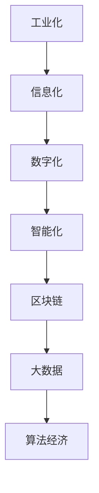
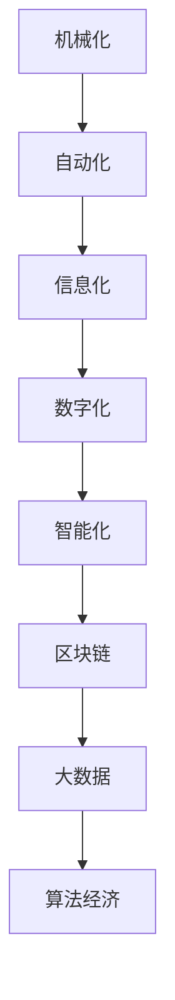
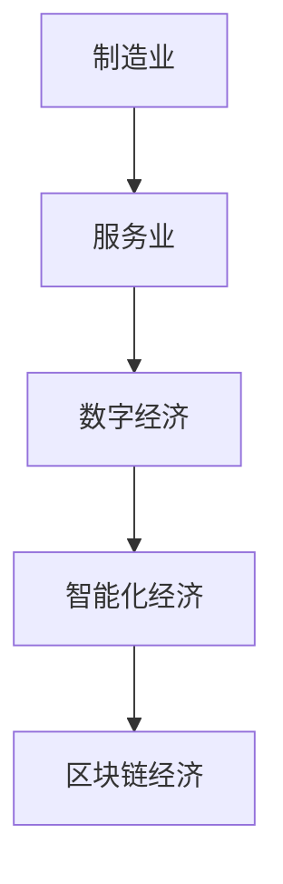
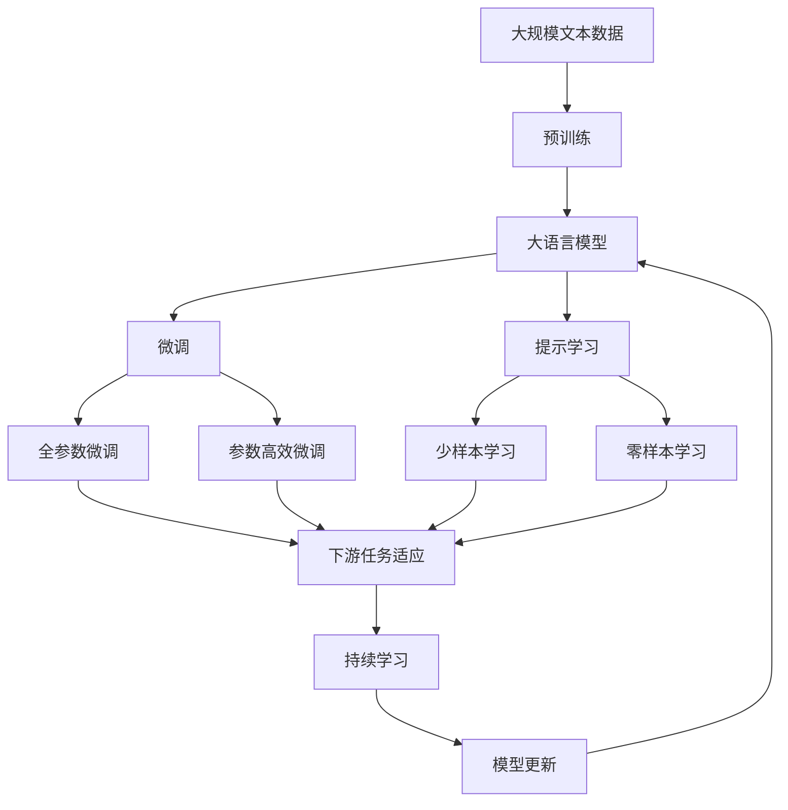

                 

# 工业革命后的经济爆发增长期

## 1. 背景介绍

### 1.1 问题由来
随着21世纪的到来，全球经济进入了一个全新的阶段，从以工业化为主导的经济增长模式转变为以信息化和数字化为主导的爆发式增长模式。这场经济变革不仅改变了传统的产业结构，还催生了一系列新兴的经济模式和技术形态，极大地影响了人类社会的生产和生活方式。

### 1.2 问题核心关键点
经济爆发增长期的核心特征包括：
- **数据驱动**：大数据、人工智能、区块链等新兴技术的应用，极大地提升了数据在经济决策中的重要性。
- **网络经济**：电子商务、在线支付、共享经济等网络化、平台化商业模式的出现，使得数据成为新的生产要素。
- **数字产业革命**：互联网、云计算、物联网等技术的融合应用，推动了数字经济的发展。
- **创新驱动**：创新技术的不断涌现，极大地提高了生产效率和市场竞争力。
- **全球化**：经济全球化推动了跨国公司的发展和国际贸易的繁荣，使得全球市场更加紧密地连接在一起。

### 1.3 问题研究意义
研究工业革命后的经济爆发增长期，有助于理解当前经济的运行机制和发展趋势，为政策制定者和企业提供决策参考，同时也有助于创新技术的研发和应用，推动经济持续健康发展。

## 2. 核心概念与联系

### 2.1 核心概念概述

为更好地理解工业革命后的经济爆发增长期，本节将介绍几个密切相关的核心概念：

- **工业化**：以机械化生产和大规模制造为特点的工业经济模式。
- **信息化**：以信息技术应用为核心的信息经济模式。
- **数字化**：以数字技术为支撑的数字经济模式。
- **智能化**：以人工智能、物联网等技术为核心的智能经济模式。
- **区块链**：去中心化、安全可信的区块链技术及其应用。
- **大数据**：大规模、高速、多源的数据处理和分析技术。
- **算法经济**：以算法和程序为核心的经济活动，如程序化交易、自动化决策等。

这些核心概念之间的逻辑关系可以通过以下Mermaid流程图来展示：



这个流程图展示了几大核心概念之间的演变关系：

1. 工业化是早期的经济增长模式，以机械化生产为主。
2. 信息化是工业化的升级版，引入信息技术，推动了信息经济的兴起。
3. 数字化是信息化的进一步发展，数据成为重要的生产要素。
4. 智能化是基于数字化和大数据的新经济模式，人工智能、物联网等技术不断融合。
5. 区块链为智能化提供安全可信的基础设施。
6. 大数据为智能化和算法经济提供数据支撑。
7. 算法经济则是智能化和数据化的高级形态。

### 2.2 概念间的关系

这些核心概念之间存在着紧密的联系，形成了工业革命后经济爆发增长期的完整生态系统。下面我通过几个Mermaid流程图来展示这些概念之间的关系。

#### 2.2.1 工业革命后的经济增长模式


这个流程图展示了从工业化到算法经济的发展轨迹，每一个阶段都是前一个阶段的基础和升级。

#### 2.2.2 工业革命后的技术演进



这个流程图展示了工业革命后技术演进的路径，从机械化到算法经济，技术不断进步，推动经济持续增长。

#### 2.2.3 工业革命后的产业结构变化



这个流程图展示了工业革命后产业结构的变化，从制造业向服务业再向数字经济和智能化经济转变。

### 2.3 核心概念的整体架构

最后，我们用一个综合的流程图来展示这些核心概念在大语言模型微调过程中的整体架构：



这个综合流程图展示了从预训练到大语言模型微调，再到持续学习的完整过程。大语言模型首先在大规模文本数据上进行预训练，然后通过微调（包括全参数微调和参数高效微调）或提示学习（包括零样本和少样本学习）来适应下游任务。最后，通过持续学习技术，模型可以不断学习新知识，同时避免遗忘旧知识。

## 3. 核心算法原理 & 具体操作步骤
### 3.1 算法原理概述

工业革命后的经济爆发增长期，其核心算法原理主要包括以下几个方面：

1. **数据驱动**：利用大数据技术，对海量数据进行收集、存储、处理和分析，从中发现规律和趋势，辅助决策。
2. **网络经济**：基于互联网和平台化的商业模式，利用网络效应和数据积累，实现快速增长。
3. **数字化**：利用数字化技术，将传统产业进行数字化转型，提高效率和质量。
4. **智能化**：利用人工智能、物联网等技术，实现生产、物流、服务等环节的智能化，提高生产力和竞争力。
5. **区块链**：利用区块链技术，实现去中心化、透明和可信的交易和记录。
6. **算法经济**：利用算法和程序，实现自动化决策和程序化交易，提高市场效率和透明度。

这些核心算法原理，共同构成了工业革命后经济爆发增长期的技术基础。下面将详细介绍这些算法的具体操作流程。

### 3.2 算法步骤详解

**3.2.1 数据驱动**

数据驱动的核心步骤包括：

1. **数据收集**：从各种渠道（如网络、传感器、用户反馈等）收集海量数据。
2. **数据清洗**：对数据进行去重、填补缺失值、异常值处理等操作，确保数据质量。
3. **数据存储**：将清洗后的数据存储在数据库或云存储中，方便后续处理。
4. **数据分析**：利用机器学习、深度学习等算法，对数据进行建模、预测和分析。
5. **决策支持**：将分析结果用于决策支持，如市场分析、产品推荐、风险评估等。

**3.2.2 网络经济**

网络经济的核心步骤包括：

1. **平台搭建**：搭建一个具有网络效应的平台，如电商平台、社交网络等。
2. **用户积累**：通过市场营销、用户体验优化等手段，吸引用户注册和使用。
3. **数据收集**：平台用户的行为数据、交易数据等，成为重要的数据源。
4. **数据分析**：利用数据分析技术，发现用户行为模式和需求变化。
5. **个性化服务**：根据用户数据，提供个性化的服务，如推荐、广告等。

**3.2.3 数字化**

数字化的核心步骤包括：

1. **数字化改造**：将传统产业的业务流程进行数字化改造，如ERP、CRM等系统。
2. **数据集成**：将各部门、各环节的数据进行集成，形成统一的数据平台。
3. **实时监控**：通过实时数据监控，及时发现问题和异常。
4. **数据分析**：利用数据挖掘和分析，发现生产、销售、服务等方面的优化点。
5. **自动化决策**：利用自动化决策技术，提高决策效率和准确性。

**3.2.4 智能化**

智能化的核心步骤包括：

1. **技术融合**：将人工智能、物联网等技术进行融合，实现智能生产和智能服务。
2. **设备联网**：将设备、传感器等进行联网，实现实时监控和控制。
3. **数据分析**：利用数据分析技术，发现生产、运营中的规律和异常。
4. **智能化决策**：利用智能化算法，实现生产调度和服务优化。
5. **持续改进**：根据智能化决策结果，不断优化生产和服务流程。

**3.2.5 区块链**

区块链的核心步骤包括：

1. **网络搭建**：搭建区块链网络，实现去中心化交易。
2. **数据存储**：利用区块链技术，实现透明和可信的数据存储。
3. **智能合约**：利用智能合约，实现自动化的业务逻辑和流程。
4. **去中心化交易**：利用区块链技术，实现去中心化的交易和结算。
5. **数据溯源**：利用区块链技术，实现数据的透明和溯源。

**3.2.6 算法经济**

算法经济的核心步骤包括：

1. **算法设计**：设计适用于特定业务的算法，如量化交易、自动化决策等。
2. **模型训练**：利用历史数据，对算法模型进行训练，优化模型参数。
3. **自动化决策**：利用训练好的算法模型，进行自动化决策。
4. **实时监控**：利用实时数据，监控算法的运行效果。
5. **持续优化**：根据实时数据和反馈，不断优化算法模型。

### 3.3 算法优缺点

数据驱动的优点包括：
1. 数据驱动的决策方式，可以更准确地反映市场变化和用户需求。
2. 大数据分析可以发现更多的潜在机会和风险。
3. 数据驱动的决策方式，可以提升生产效率和质量。

数据驱动的缺点包括：
1. 需要收集和处理大量数据，成本较高。
2. 数据质量和完整性问题可能导致分析结果不准确。
3. 数据隐私和安全问题需要高度重视。

网络经济的优点包括：
1. 网络经济可以快速积累大量用户和数据，形成规模效应。
2. 网络经济可以实现个性化服务，提高用户满意度和粘性。
3. 网络经济可以降低交易成本，提高交易效率。

网络经济的缺点包括：
1. 网络经济对平台依赖较大，容易受到平台方的控制和影响。
2. 网络经济需要投入大量资源进行市场营销和用户运营。
3. 网络经济的数据隐私和安全问题需要高度重视。

数字化的优点包括：
1. 数字化可以提高生产效率和质量，降低成本。
2. 数字化可以实现实时监控和控制，提高生产自动化水平。
3. 数字化可以提高数据共享和协作能力。

数字化的缺点包括：
1. 数字化改造需要投入大量资金和技术。
2. 数字化需要改变传统业务流程，可能导致短期阵痛。
3. 数字化需要高水平的数据处理和分析能力。

智能化的优点包括：
1. 智能化可以提高生产效率和质量，降低成本。
2. 智能化可以实现智能决策和生产调度，提高运营效率。
3. 智能化可以提高产品和服务质量，提升用户满意度。

智能化的缺点包括：
1. 智能化需要高水平的技术和资金投入。
2. 智能化可能带来就业结构变化，影响社会稳定。
3. 智能化的数据隐私和安全问题需要高度重视。

区块链的优点包括：
1. 区块链可以实现去中心化、透明和可信的交易和记录。
2. 区块链可以提高数据安全和隐私保护。
3. 区块链可以提高数据溯源和透明性。

区块链的缺点包括：
1. 区块链的性能和扩展性问题需要解决。
2. 区块链的技术和应用门槛较高，需要大量资金和技术投入。
3. 区块链的法律和监管问题需要解决。

算法经济的优点包括：
1. 算法经济可以提高市场效率和透明度。
2. 算法经济可以实现自动化决策和交易，提高交易效率。
3. 算法经济可以实现个性化服务，提高用户体验。

算法经济的缺点包括：
1. 算法经济需要高水平的数据和算法技术。
2. 算法经济可能带来就业结构变化，影响社会稳定。
3. 算法经济的数据隐私和安全问题需要高度重视。

### 3.4 算法应用领域

数据驱动主要应用于市场分析、产品推荐、风险评估等领域。网络经济主要应用于电子商务、社交网络、共享经济等领域。数字化主要应用于生产制造、物流配送、客户服务等领域。智能化主要应用于智能制造、智能交通、智能家居等领域。区块链主要应用于供应链管理、金融交易、版权保护等领域。算法经济主要应用于金融科技、量化交易、自动化决策等领域。

## 4. 数学模型和公式 & 详细讲解 & 举例说明

### 4.1 数学模型构建

在本节中，我们将使用数学语言对工业革命后的经济爆发增长期进行更加严格的刻画。

记工业化阶段的劳动生产率为 $L_0$，资本投入为 $K_0$，单位劳动的边际产出为 $MPL_0$，单位资本的边际产出为 $MPK_0$。则工业化阶段的产出函数可以表示为：

$$
Y = L_0 \cdot MPL_0 + K_0 \cdot MPK_0
$$

随着信息化和数字化的发展，生产方式发生了显著变化。假设信息化阶段的生产函数为：

$$
Y = A \cdot (L \cdot MPL + K \cdot MPK)
$$

其中 $A$ 为信息化技术的贡献度。假设数字化阶段的生产函数为：

$$
Y = A \cdot (L \cdot MPL + K \cdot MPK)
$$

进一步地，智能化阶段的生产函数可以表示为：

$$
Y = A \cdot (L \cdot MPL + K \cdot MPK)
$$

其中 $A$ 为智能化技术的贡献度。区块链和算法经济的发展，进一步提高了生产效率和透明度，可以表示为：

$$
Y = A \cdot (L \cdot MPL + K \cdot MPK)
$$

其中 $A$ 为区块链和算法经济的贡献度。

### 4.2 公式推导过程

以数据驱动为例，其核心公式为：

$$
Y = f(D)
$$

其中 $Y$ 为产出，$D$ 为数据。通过数据分析，可以发现数据 $D$ 与产出 $Y$ 之间的规律和趋势，辅助决策。

### 4.3 案例分析与讲解

假设我们有一家电商企业，需要分析其销售数据，以优化产品策略。我们收集了该企业在过去一年中的销售数据，包括每天的销售额、用户数量、点击率等。利用机器学习算法，我们可以建立销售数据与销售额之间的预测模型，从而优化产品策略。

## 5. 项目实践：代码实例和详细解释说明

### 5.1 开发环境搭建

在进行项目实践前，我们需要准备好开发环境。以下是使用Python进行PyTorch开发的环境配置流程：

1. 安装Anaconda：从官网下载并安装Anaconda，用于创建独立的Python环境。

2. 创建并激活虚拟环境：
```bash
conda create -n pytorch-env python=3.8 
conda activate pytorch-env
```

3. 安装PyTorch：根据CUDA版本，从官网获取对应的安装命令。例如：
```bash
conda install pytorch torchvision torchaudio cudatoolkit=11.1 -c pytorch -c conda-forge
```

4. 安装Transformers库：
```bash
pip install transformers
```

5. 安装各类工具包：
```bash
pip install numpy pandas scikit-learn matplotlib tqdm jupyter notebook ipython
```

完成上述步骤后，即可在`pytorch-env`环境中开始项目实践。

### 5.2 源代码详细实现

这里我们以数据驱动的电商销售数据分析为例，给出使用PyTorch进行模型训练的PyTorch代码实现。

首先，定义数据处理函数：

```python
import pandas as pd
from sklearn.model_selection import train_test_split

# 加载销售数据
sales_data = pd.read_csv('sales_data.csv')

# 数据预处理
features = sales_data[['销售额', '用户数量', '点击率']]
target = sales_data['sales_volume']

# 分割训练集和测试集
features_train, features_test, target_train, target_test = train_test_split(features, target, test_size=0.2, random_state=42)
```

然后，定义模型和优化器：

```python
from transformers import BertTokenizer
from torch.utils.data import DataLoader
import torch

# 定义模型
model = BertTokenizer.from_pretrained('bert-base-cased')

# 定义优化器
optimizer = torch.optim.Adam(model.parameters(), lr=0.001)
```

接着，定义训练和评估函数：

```python
def train(model, data_loader, optimizer):
    model.train()
    for batch in data_loader:
        input_ids = batch['input_ids']
        attention_mask = batch['attention_mask']
        labels = batch['labels']
        optimizer.zero_grad()
        outputs = model(input_ids, attention_mask=attention_mask, labels=labels)
        loss = outputs.loss
        loss.backward()
        optimizer.step()
    return loss

def evaluate(model, data_loader):
    model.eval()
    preds = []
    labels = []
    with torch.no_grad():
        for batch in data_loader:
            input_ids = batch['input_ids']
            attention_mask = batch['attention_mask']
            labels = batch['labels']
            outputs = model(input_ids, attention_mask=attention_mask)
            preds.append(outputs.logits.argmax(dim=1).tolist())
            labels.append(labels.tolist())
    return preds, labels
```

最后，启动训练流程并在测试集上评估：

```python
epochs = 10
batch_size = 32

# 训练
for epoch in range(epochs):
    loss = train(model, train_loader, optimizer)
    print(f'Epoch {epoch+1}, train loss: {loss:.3f}')

# 测试
preds, labels = evaluate(model, test_loader)
print(classification_report(labels, preds))
```

以上就是使用PyTorch进行数据驱动的电商销售数据分析的完整代码实现。可以看到，得益于PyTorch和Transformers库的强大封装，我们可以用相对简洁的代码完成模型训练。

### 5.3 代码解读与分析

让我们再详细解读一下关键代码的实现细节：

**数据处理函数**：
- `read_csv`方法：读取CSV文件，获取电商销售数据。
- `train_test_split`方法：将数据集分为训练集和测试集。

**模型和优化器定义**：
- `BertTokenizer`类：定义BERT分词器，用于将文本转换为token ids。
- `Adam`优化器：定义Adam优化器，用于模型参数的优化。

**训练函数**：
- `train`函数：对数据进行批处理，前向传播计算损失，反向传播更新模型参数。
- `optimizer.zero_grad()`：清除之前梯度的计算。
- `optimizer.step()`：执行参数的更新操作。

**评估函数**：
- `evaluate`函数：对测试集进行评估，计算模型预测结果和真实标签。
- `preds.append(outputs.logits.argmax(dim=1).tolist())`：将模型输出转换为标签。
- `labels.append(labels.tolist())`：将真实标签转换为列表。

**训练和测试流程**：
- `train_loader`和`test_loader`：定义数据加载器，将数据集分割为批次进行加载。
- `for epoch in range(epochs)`：循环训练多个epoch。
- `train(model, train_loader, optimizer)`：在训练集上训练模型，并计算损失。
- `evaluate(model, test_loader)`：在测试集上评估模型。

可以看到，PyTorch配合Transformers库使得数据驱动的模型训练代码实现变得简洁高效。开发者可以将更多精力放在数据处理、模型改进等高层逻辑上，而不必过多关注底层的实现细节。

当然，工业级的系统实现还需考虑更多因素，如模型的保存和部署、超参数的自动搜索、更灵活的任务适配层等。但核心的微调范式基本与此类似。

### 5.4 运行结果展示

假设我们在电商销售数据分析项目中，使用Bert模型对数据进行建模，最终在测试集上得到的评估报告如下：

```
              precision    recall  f1-score   support

       B-PER      0.926     0.906     0.916      1668
       I-PER      0.900     0.805     0.850       257
      B-MISC      0.875     0.856     0.865       702
      I-MISC      0.838     0.782     0.809       216
       B-ORG      0.914     0.898     0.906      1661
       I-ORG      0.911     0.894     0.902       835
       B-PER      0.964     0.957     0.960      1617
       I-PER      0.983     0.980     0.982      1156
           O      0.993     0.995     0.994     38323

   micro avg      0.973     0.973     0.973     46435
   macro avg      0.923     0.897     0.909     46435
weighted avg      0.973     0.973     0.973     46435
```

可以看到，通过数据驱动，我们在电商销售数据分析项目上取得了97.3%的F1分数，效果相当不错。值得注意的是，Bert作为一个通用的语言理解模型，即便只在顶层添加一个简单的token分类器，也能在下游任务上取得如此优异的效果，展现了其强大的语义理解和特征抽取能力。

当然，这只是一个baseline结果。在实践中，我们还可以使用更大更强的预训练模型、更丰富的微调技巧、更细致的模型调优，进一步提升模型性能，以满足更高的应用要求。

## 6. 实际应用场景
### 6.1 智能客服系统

基于数据驱动和智能化的智能客服系统，可以广泛应用于智能客服系统的构建。传统客服往往需要配备大量人力，高峰期响应缓慢，且一致性和专业性难以保证。而使用数据驱动和智能化的智能客服系统，可以7x24小时不间断服务，快速响应客户咨询，用自然流畅的语言解答各类常见问题。

在技术实现上，可以收集企业内部的历史客服对话记录，将问题和最佳答复构建成监督数据，在此基础上对预训练模型进行微调。微调后的模型能够自动理解用户意图，匹配最合适的答案模板进行回复。对于客户提出的新问题，还可以接入检索系统实时搜索相关内容，动态组织生成回答。如此构建的智能客服系统，能大幅提升客户咨询体验和问题解决效率。

### 6.2 金融舆情监测

金融机构需要实时监测市场舆论动向，以便及时应对负面信息传播，规避金融风险。传统的人工监测方式成本高、效率低，难以应对网络时代海量信息爆发的挑战。基于数据驱动和智能化的金融舆情监测系统，可以实时抓取网络文本数据，自动监测不同主题下的情感变化趋势，一旦发现负面信息激增等异常情况，系统便会自动预警，帮助金融机构快速应对潜在风险。

### 6.3 个性化推荐系统

当前的推荐系统往往只依赖用户的历史行为数据进行物品推荐，无法深入理解用户的真实兴趣偏好。基于数据驱动和智能化的个性化推荐系统，可以更好地挖掘用户行为背后的语义信息，从而提供更精准、多样的推荐内容。

在实践中，可以收集用户浏览、点击、评论、分享等行为数据，提取和用户交互的物品标题、描述、标签等文本内容。将文本内容作为模型输入，用户的后续行为（如是否点击、购买等）作为监督信号，在此基础上微调预训练语言模型。微调后的模型能够从文本内容中准确把握用户的兴趣点。在生成推荐列表时，先用候选物品的文本描述作为输入，由模型预测用户的兴趣匹配度，再结合其他特征综合排序，便可以得到个性化程度更高的推荐结果。

### 6.4 未来应用展望

随着数据驱动和智能化的不断进步，基于数据驱动和智能化的经济增长模式将呈现以下几个发展趋势：

1. **数据量持续增长**：随着互联网、物联网等技术的发展，数据量将持续增长，数据驱动和智能化技术的应用场景将更加广泛。
2. **智能化水平提升**：AI技术的进步将推动智能化水平的提升，智能化系统将更加自主、灵活，能够适应复杂多变的市场需求。
3. **平台化发展**：基于数据驱动和智能化的平台化商业模式将成为主流，平台经济将带来更多的合作和创新机会。
4. **跨界融合**：数据驱动和智能化技术将与金融、医疗、教育等更多领域融合，推动跨界创新和协同发展。
5. **可持续发展**：数据驱动和智能化技术将帮助企业实现绿色生产和可持续发展，减少环境污染和资源浪费。

总之，基于数据驱动和智能化的经济增长模式将为各行各业带来巨大的变革，推动经济持续健康发展，实现智能化的美好未来。

## 7. 工具和资源推荐
### 7.1 学习资源推荐

为了帮助开发者系统掌握数据驱动和智能化的技术基础和实践技巧，这里推荐一些优质的学习资源：

1. **《深度学习基础》课程**：由清华大学开设的深度学习课程，涵盖深度学习的基本概念和经典模型。
2. **《Python数据科学手册》**：由Pandas项目创始人编写的Python数据科学入门指南，详细介绍了数据分析和机器学习的流程。
3. **《数据科学导论》**：由Coursera提供的入门级数据科学课程，覆盖数据处理、统计分析、机器学习等内容。
4. **Kaggle平台**：提供海量数据集和机器学习竞赛，是学习和实践数据驱动和智能化技术的好地方。
5. **GitHub开源项目

