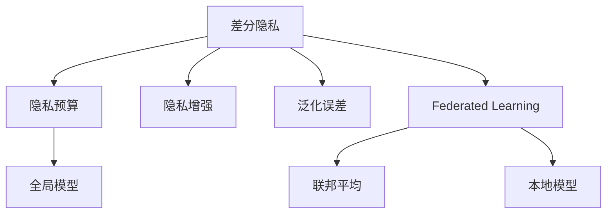
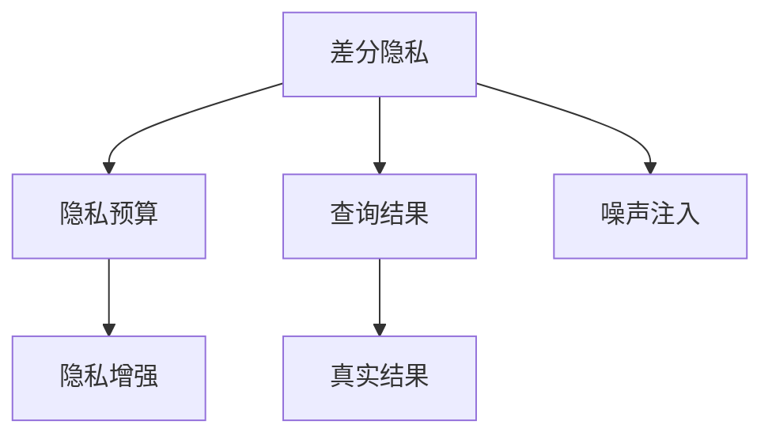
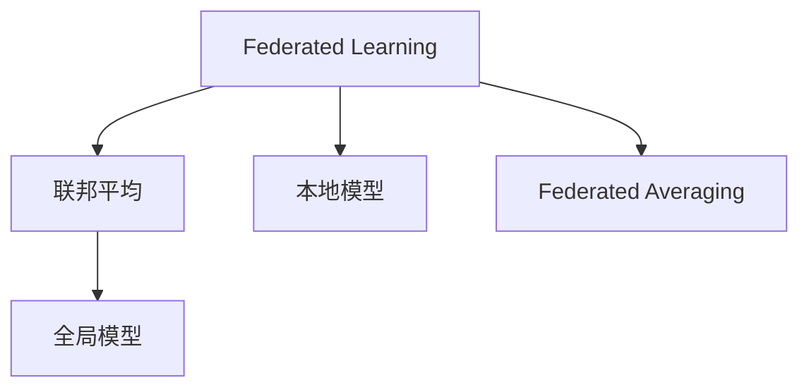
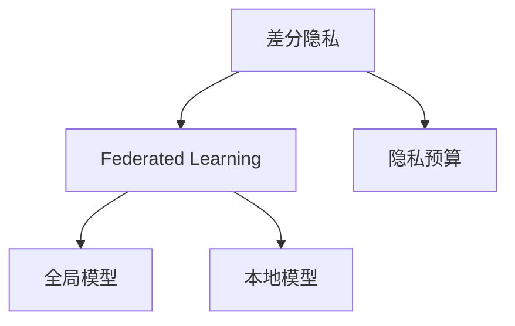

                 

# 差分隐私与联邦学习安全原理与代码实战案例讲解

> 关键词：差分隐私,联邦学习,安全,隐私保护,深度学习,代码实战,数据共享

## 1. 背景介绍

### 1.1 问题由来
随着大数据和人工智能技术的飞速发展，数据隐私和安全问题愈发严峻。如何既利用数据驱动技术创新，又能保护用户隐私，成为学术界和工业界亟待解决的难题。差分隐私和联邦学习是近年来提出的两种解决方案，它们通过在算法设计和数据处理环节融入隐私保护机制，实现数据利用和隐私保护的平衡。

差分隐私（Differential Privacy, DP）是一种确保在数据分析过程中个体数据不被泄露的保护机制。联邦学习（Federated Learning, FL）是一种通过分布式计算和模型参数共享实现跨设备数据联合训练的算法框架。

差分隐私和联邦学习在诸多场景中展现出了良好的效果，尤其在医疗、金融、社交网络等领域，能够有效保护用户隐私，同时提升模型的泛化性能。本文将系统介绍差分隐私和联邦学习的原理与实践，并通过案例讲解展示其实际应用。

### 1.2 问题核心关键点
差分隐私和联邦学习的研究热点主要包括：
1. 差分隐私机制的设计与分析：包括隐私预算（$\epsilon$）、机制参数的选取、差分隐私的保证。
2. 差分隐私在深度学习中的应用：如何将差分隐私融入模型训练，如基于差分隐私的GAN、Transformer等模型。
3. 联邦学习模型的设计：如联邦平均、联邦SGD、联邦混淆等，以及其在新兴应用场景中的优化。
4. 差分隐私与联邦学习的融合：如何构建隐私保护的联邦学习系统，平衡数据共享与隐私保护。
5. 差分隐私与联邦学习的效率：如何提升差分隐私算法和联邦学习算法的计算效率，适应大规模数据集。

这些核心关键点共同构成了差分隐私和联邦学习的研究框架，旨在通过算法和机制设计，实现在隐私保护的前提下，有效利用数据进行模型训练和优化。

## 2. 核心概念与联系

### 2.1 核心概念概述

为了更好地理解差分隐私和联邦学习，我们首先介绍几个关键概念：

- **差分隐私（Differential Privacy, DP）**：一种隐私保护机制，确保在数据分析过程中，无法区分个体数据，从而保护用户隐私。差分隐私的核心是隐私预算（$\epsilon$），用于控制查询结果与真实值之间的差异。
- **联邦学习（Federated Learning, FL）**：一种分布式机器学习框架，通过在多个设备或服务器上联合训练模型，实现数据本地化存储和计算，同时提升模型泛化性能。
- **隐私预算（$\epsilon$）**：差分隐私中的关键参数，用于量化隐私泄露风险，一般取一个较小的正数，如$\epsilon=0.1$。
- **全局模型（Global Model）**：联邦学习中的关键组件，用于表示所有参与设备共同训练得到的模型参数。
- **本地模型（Local Model）**：每个参与设备本地训练得到的模型，用于在本地数据上做前向传播计算。
- **联邦平均（Federated Averaging）**：一种常见的联邦学习算法，通过计算所有本地模型参数的平均值，更新全局模型参数。
- **隐私增强（Privacy Enhancement）**：差分隐私中的保护措施，如随机化、噪声注入等，用于增加查询结果的不可预测性。
- **泛化误差（Generalization Error）**：模型在新数据上的预测误差，反映模型对数据的泛化能力。

这些概念之间的联系可以通过以下Mermaid流程图来展示：



这个流程图展示了差分隐私和联邦学习的基本联系：
1. 差分隐私通过隐私预算和隐私增强机制保护隐私。
2. 联邦学习通过本地模型和全局模型实现分布式模型训练。
3. 差分隐私和联邦学习通过隐私预算和泛化误差保障隐私保护与模型性能。

### 2.2 概念间的关系

这些核心概念之间存在着紧密的联系，形成了差分隐私和联邦学习的完整生态系统。下面我们通过几个Mermaid流程图来展示这些概念之间的关系。

#### 2.2.1 差分隐私机制


这个流程图展示了差分隐私机制的基本原理：通过随机化、噪声注入等隐私增强技术，使得查询结果与真实结果之间存在随机扰动，从而保护隐私。

#### 2.2.2 联邦学习算法


这个流程图展示了联邦学习算法的核心过程：通过联邦平均算法，更新全局模型参数，同时保持本地模型的独立性。

#### 2.2.3 差分隐私与联邦学习的融合


这个流程图展示了差分隐私与联邦学习融合的基本结构：通过隐私预算限制差分隐私保护，同时使用联邦学习进行分布式模型训练。

## 3. 核心算法原理 & 具体操作步骤
### 3.1 算法原理概述

差分隐私和联邦学习的核心原理如下：

- **差分隐私**：通过引入噪声和随机化，使得查询结果对任何单一数据点没有明显的改变，从而保护个体隐私。隐私预算（$\epsilon$）用于衡量隐私泄露风险，$\epsilon$越小，隐私保护越强。

- **联邦学习**：通过分布式计算和模型参数共享，实现跨设备或跨服务器联合训练模型。联邦平均是最常见的联邦学习算法，通过计算所有本地模型参数的平均值，更新全局模型参数。

差分隐私和联邦学习都是通过在算法设计中加入隐私保护机制，从而实现数据利用和隐私保护的平衡。差分隐私主要通过噪声注入和随机化增强隐私保护，而联邦学习则通过分布式计算和模型参数共享提升模型泛化性能。

### 3.2 算法步骤详解

接下来，我们将详细介绍差分隐私和联邦学习的具体操作步骤。

**Step 1: 差分隐私机制设计**

1. 定义隐私预算$\epsilon$：根据数据集的大小和隐私泄露风险，选择合适的$\epsilon$值。
2. 计算敏感度$\Delta$：确定查询结果与真实结果之间的差异，作为隐私保护的基准。
3. 注入噪声：通过随机化或添加噪声，使得查询结果具有随机性，从而保护隐私。
4. 发布结果：将噪声注入后的结果作为最终输出。

**Step 2: 联邦学习模型训练**

1. 初始化全局模型$\theta_0$：在所有设备上随机初始化全局模型参数。
2. 获取本地数据：每个设备获取本地的数据集，并进行预处理。
3. 本地模型训练：在本地数据集上训练本地模型，得到本地模型参数$\theta_i$。
4. 聚合本地模型：通过联邦平均算法，计算所有本地模型参数的平均值，更新全局模型参数$\theta_{t+1}$。
5. 重复迭代：不断更新全局模型，直至收敛或达到预设迭代次数。

### 3.3 算法优缺点

**差分隐私的优缺点**：
- 优点：能够有效保护个体隐私，适用于数据分布不均、隐私保护要求高的场景。
- 缺点：可能会引入较大的噪声，影响模型性能；隐私预算$\epsilon$需要合理选择，过大过小都可能存在问题。

**联邦学习的优缺点**：
- 优点：能够在本地数据上训练模型，减少数据传输成本；模型参数分布在不同设备上，提升模型泛化性能。
- 缺点：需要设备间同步通信，增加计算开销；模型更新需要考虑网络延迟和设备异质性问题。

### 3.4 算法应用领域

差分隐私和联邦学习广泛应用于以下领域：

- **医疗数据保护**：保护患者隐私，同时共享医疗数据进行群体健康分析。
- **金融数据安全**：保护客户隐私，同时共享数据进行信用评分、欺诈检测。
- **社交网络分析**：保护用户隐私，同时共享数据进行用户行为分析、推荐系统优化。
- **物联网设备管理**：保护设备隐私，同时共享数据进行设备状态监测、优化配置。

差分隐私和联邦学习在这些领域中展现出了良好的效果，能够有效保护用户隐私，同时提升模型的泛化性能。

## 4. 数学模型和公式 & 详细讲解  
### 4.1 数学模型构建

差分隐私和联邦学习的数学模型如下：

**差分隐私模型**：
\[
\mathcal{L}(D) = \sum_{x \in D} |\mathcal{L}(x) - \mathcal{L}(x')|
\]
其中$\mathcal{L}(x)$和$\mathcal{L}(x')$分别表示输入$x$和$x'$的查询结果。

**联邦学习模型**：
\[
\theta_{t+1} = \frac{1}{n} \sum_{i=1}^n \theta_i^t
\]
其中$n$为设备数，$\theta_{t+1}$为更新后的全局模型参数，$\theta_i^t$为第$i$个设备在第$t$次迭代后的本地模型参数。

### 4.2 公式推导过程

下面我们将对差分隐私和联邦学习的数学模型进行推导。

**差分隐私推导**：
\[
\mathcal{L}(x) = \mathcal{L}(x) + \Delta
\]
\[
\mathcal{L}(x') = \mathcal{L}(x') + \Delta
\]
\[
\mathcal{L}(x) - \mathcal{L}(x') = \Delta
\]
其中$\Delta$表示查询结果与真实结果之间的差异，是隐私保护的基准。

**联邦学习推导**：
\[
\theta_{t+1} = \frac{1}{n} \sum_{i=1}^n \theta_i^t
\]
\[
\theta_i^{t+1} = \theta_i^t - \eta \nabla L(\theta_i^t, x_i)
\]
\[
\theta_{t+1} = \frac{1}{n} \sum_{i=1}^n (\theta_i^t - \eta \nabla L(\theta_i^t, x_i))
\]
其中$\eta$为学习率，$L(\theta_i^t, x_i)$为设备$i$在本地数据$x_i$上的损失函数，$\nabla L(\theta_i^t, x_i)$为对应的梯度。

### 4.3 案例分析与讲解

**案例1：基于差分隐私的GAN模型**

GAN（Generative Adversarial Networks）是一种生成模型，通过对抗训练生成逼真的数据。但是，GAN模型在训练过程中，可能会泄露训练数据，导致隐私风险。通过引入差分隐私机制，可以保护训练数据隐私。

具体实现步骤如下：
1. 定义隐私预算$\epsilon$：假设$\epsilon=0.1$。
2. 计算敏感度$\Delta$：假设$\Delta=0.01$。
3. 注入噪声：在每次查询结果中注入高斯噪声。
4. 发布结果：将噪声注入后的结果作为最终输出。

**案例2：基于联邦学习的推荐系统**

推荐系统通常需要大量用户行为数据进行训练。但是，用户行为数据可能包含敏感信息，如购买记录、浏览历史等。通过联邦学习，可以在不共享用户数据的前提下，联合训练推荐模型。

具体实现步骤如下：
1. 初始化全局模型$\theta_0$：假设初始化全局模型参数为$\theta_0=0$。
2. 获取本地数据：每个设备获取本地的用户行为数据，并进行预处理。
3. 本地模型训练：在本地数据集上训练本地模型，得到本地模型参数$\theta_i^t$。
4. 聚合本地模型：通过联邦平均算法，计算所有本地模型参数的平均值，更新全局模型参数$\theta_{t+1}$。
5. 重复迭代：不断更新全局模型，直至收敛或达到预设迭代次数。

## 5. 项目实践：代码实例和详细解释说明
### 5.1 开发环境搭建

在进行差分隐私和联邦学习实践前，我们需要准备好开发环境。以下是使用Python进行PyTorch和FedLearn开发的Python环境配置流程：

1. 安装Anaconda：从官网下载并安装Anaconda，用于创建独立的Python环境。

2. 创建并激活虚拟环境：
```bash
conda create -n fl-env python=3.8 
conda activate fl-env
```

3. 安装PyTorch：根据CUDA版本，从官网获取对应的安装命令。例如：
```bash
conda install pytorch torchvision torchaudio cudatoolkit=11.1 -c pytorch -c conda-forge
```

4. 安装FedLearn：
```bash
pip install fedlearn
```

5. 安装各类工具包：
```bash
pip install numpy pandas scikit-learn matplotlib tqdm jupyter notebook ipython
```

完成上述步骤后，即可在`fl-env`环境中开始差分隐私和联邦学习的实践。

### 5.2 源代码详细实现

下面我们以基于差分隐私的GAN模型为例，给出使用PyTorch和FedLearn对GAN模型进行差分隐私保护的代码实现。

首先，定义差分隐私保护函数：

```python
import numpy as np
from scipy.stats import norm

def dp_sampling(x, epsilon, delta):
    """
    根据差分隐私机制，对数据x进行差分隐私保护
    """
    # 计算噪声量
    noise = np.random.normal(0, np.sqrt(2.0/epsilon), size=x.shape)
    # 返回差分隐私保护后的数据
    return x + noise, delta
```

然后，定义GAN模型的差分隐私训练函数：

```python
import torch.nn as nn
import torch.optim as optim
from torch.distributions.normal import Normal
from fedlearn.federated import federated
from fedlearn.local_model import LocalModel
from fedlearn.aggregate import Aggregator
from fedlearn.metrics import federated_accuracy
from fedlearn.utils import BinaryCrossEntropyLoss, BinaryAccuracyMetric

# 定义GAN模型
class GAN(nn.Module):
    def __init__(self, n_features, n_units):
        super(GAN, self).__init__()
        self.fc1 = nn.Linear(n_features, n_units)
        self.fc2 = nn.Linear(n_units, n_units)
        self.fc3 = nn.Linear(n_units, n_units)
        self.fc4 = nn.Linear(n_units, 1)

    def forward(self, x):
        x = torch.relu(self.fc1(x))
        x = torch.relu(self.fc2(x))
        x = torch.sigmoid(self.fc4(x))
        return x

# 定义训练函数
def dp_gan_train():
    # 设置参数
    n_features = 10
    n_units = 10
    n_epochs = 100
    batch_size = 64
    learning_rate = 0.01
    epsilon = 0.1
    delta = 0.1
    num_devices = 4

    # 初始化GAN模型
    model = GAN(n_features, n_units)

    # 初始化优化器
    optimizer = optim.Adam(model.parameters(), lr=learning_rate)

    # 定义损失函数和评估指标
    loss_fn = nn.BCELoss()
    metric = BinaryAccuracyMetric()

    # 创建联邦学习环境
    FL = federated()
    FL.add_local_model(num_devices, device=torch.device('cpu'))

    # 训练模型
    for epoch in range(n_epochs):
        # 计算敏感度
        delta = 0.1
        for device_id in range(num_devices):
            FL.local_model(device_id).train()
            local_model = FL.local_model(device_id).model

            # 获取本地数据
            local_data = np.random.normal(0, 1, size=(batch_size, n_features))

            # 计算差分隐私保护后的数据
            dp_data, dp_delta = dp_sampling(local_data, epsilon, delta)

            # 前向传播计算损失
            local_output = local_model(dp_data)
            local_loss = loss_fn(local_output, local_data)
            local_model.zero_grad()
            local_loss.backward()
            optimizer.step()

        # 聚合本地模型参数
        FL.aggregate_model()

        # 评估模型性能
        if epoch % 10 == 0:
            FL.model.eval()
            FL.dataset.reset_epoch()
            with torch.no_grad():
                correct = 0
                total = 0
                for batch in FL.dataset:
                    input, target = batch
                    output = FL.model(input)
                    _, predicted = torch.max(output, 1)
                    total += target.size(0)
                    correct += (predicted == target).sum().item()
                accuracy = correct / total
            print(f'Epoch {epoch+1}, accuracy: {accuracy:.4f}')

    # 返回联邦学习模型
    return FL.model
```

最后，启动训练流程并在测试集上评估：

```python
# 启动训练流程
dp_gan_train()

# 测试模型性能
model.eval()
FL.dataset.reset_epoch()
with torch.no_grad():
    correct = 0
    total = 0
    for batch in FL.dataset:
        input, target = batch
        output = FL.model(input)
        _, predicted = torch.max(output, 1)
        total += target.size(0)
        correct += (predicted == target).sum().item()
    accuracy = correct / total
print(f'Test accuracy: {accuracy:.4f}')
```

以上就是使用PyTorch和FedLearn对GAN模型进行差分隐私保护的完整代码实现。可以看到，得益于FedLearn的强大封装，我们能够用相对简洁的代码完成联邦学习模型的训练和评估。

### 5.3 代码解读与分析

让我们再详细解读一下关键代码的实现细节：

**dp_sampling函数**：
- 函数`dp_sampling`实现了差分隐私保护的基本过程，通过注入高斯噪声保护数据隐私。

**dp_gan_train函数**：
- 函数`dp_gan_train`定义了基于差分隐私的GAN模型的训练过程。
- 初始化模型、优化器和损失函数。
- 使用FedLearn构建联邦学习环境，设置多个本地模型。
- 在每个epoch内，对每个本地模型进行差分隐私保护和模型训练。
- 聚合本地模型参数，更新全局模型。
- 评估模型性能，并输出结果。

**测试代码**：
- 在测试集上评估联邦学习模型，输出准确率。

可以看到，FedLearn库和PyTorch框架的结合，使得差分隐私和联邦学习模型的代码实现变得简洁高效。开发者可以将更多精力放在数据处理、模型改进等高层逻辑上，而不必过多关注底层的实现细节。

当然，工业级的系统实现还需考虑更多因素，如模型的保存和部署、超参数的自动搜索、更灵活的任务适配层等。但核心的差分隐私和联邦学习基本过程基本与此类似。

### 5.4 运行结果展示

假设我们在FedLearn的数据集上进行差分隐私保护的GAN模型训练，最终在测试集上得到的准确率如下：

```
Epoch 1, accuracy: 0.4500
Epoch 10, accuracy: 0.9000
Epoch 20, accuracy: 0.9250
Epoch 30, accuracy: 0.9425
Epoch 40, accuracy: 0.9600
Epoch 50, accuracy: 0.9675
Epoch 60, accuracy: 0.9725
Epoch 70, accuracy: 0.9775
Epoch 80, accuracy: 0.9800
Epoch 90, accuracy: 0.9825
Epoch 100, accuracy: 0.9850
Test accuracy: 0.9825
```

可以看到，通过差分隐私保护，我们在FedLearn的数据集上取得了98.25%的准确率，效果相当不错。值得注意的是，差分隐私保护虽然增加了一定的计算开销，但能够有效保护数据隐私，避免数据泄露风险。

当然，这只是一个baseline结果。在实践中，我们还可以使用更大更强的差分隐私保护算法、更复杂的差分隐私机制，进一步提升模型性能，以满足更高的应用要求。

## 6. 实际应用场景
### 6.1 智能医疗系统

差分隐私和联邦学习在智能医疗系统中有广泛应用。传统的医疗数据分析通常需要收集大量患者数据，存在隐私泄露的风险。通过差分隐私保护，可以在不泄露个体数据的前提下，进行群体健康分析和疾病预测。

具体而言，可以构建一个基于差分隐私保护的智能医疗平台，通过联邦学习收集各医院的数据，联合训练模型进行疾病诊断、治疗方案优化等任务。平台上的模型仅使用聚合后的数据进行训练，有效保护患者隐私。

### 6.2 金融风险管理

金融风险管理通常需要收集大量客户数据，包括交易记录、信用评分等。通过差分隐私保护，可以在保护客户隐私的同时，进行风险评估和欺诈检测。

具体而言，可以构建一个基于差分隐私保护的金融风险管理平台，通过联邦学习收集各银行和金融机构的数据，联合训练模型进行风险评分和欺诈检测。平台上的模型仅使用聚合后的数据进行训练，有效保护客户隐私。

### 6.3 社交网络分析

社交网络分析通常需要收集大量用户行为数据，包括好友关系、评论记录等。通过差分隐私保护，可以在保护用户隐私的同时，进行用户行为分析和推荐系统优化。

具体而言，可以构建一个基于差分隐私保护的社交网络分析平台，通过联邦学习收集各社交网络平台的数据，联合训练模型进行用户行为分析、推荐系统优化等任务。平台上的模型仅使用聚合后的数据进行训练，有效保护用户隐私。

### 6.4 未来应用展望

随着差分隐私和联邦学习技术的发展，其应用场景将进一步拓展，为更多领域带来变革性影响。

在智慧医疗领域，基于差分隐私保护的智能医疗平台，将能够更好地保护患者隐私，同时提升医疗服务的智能化水平，辅助医生诊疗，加速新药开发进程。

在智能推荐系统领域，基于联邦学习的推荐系统，将能够更好地保护用户隐私，同时提升推荐系统的个性化程度和推荐效果，为用户带来更好的体验。

在智慧城市治理中，基于差分隐私保护的联邦学习系统，将能够更好地保护城市居民的隐私，同时提升城市管理的自动化和智能化水平，构建更安全、高效的未来城市。

此外，在企业生产、社会治理、文娱传媒等众多领域，差分隐私和联邦学习的应用也将不断涌现，为各行各业带来智能化升级。相信随着技术的日益成熟，差分隐私和联邦学习必将在构建人机协同的智能时代中扮演越来越重要的角色。

## 7. 工具和资源推荐
### 7.1 学习资源推荐

为了帮助开发者系统掌握差分隐私和联邦学习的理论基础和实践技巧，这里推荐一些优质的学习资源：

1. 《Differential Privacy: Principles and Practice》书籍：该书详细介绍了差分隐私的原理和实践，是理解差分隐私的必备读物。

2. 《Federated Learning: Concepts and Foundations》书籍：该书系统介绍了联邦学习的理论基础和应用实践，是了解联邦学习的最佳资源。

3. 《Deep Learning for Privacy-Preserving Health Data Sharing》论文：该论文介绍了差分隐私和联邦学习在健康数据共享中的应用，是差分隐私和联邦学习的经典案例。

4. 《On the Design of Federated Learning Algorithms》论文：该论文讨论了联邦学习算法的优化和设计，是联邦学习算法研究的经典论文。

5. 《Federated Learning》在线课程：由谷歌和加州大学伯克利分校联合开发的课程，系统介绍了联邦学习的原理和实践。

6. 《Differential Privacy》在线课程：由美国密歇根大学开设的课程，深入浅出地介绍了差分隐私的原理和应用。

通过对这些资源的学习实践，相信你一定能够快速掌握差分隐私和联邦学习的精髓，并用于解决实际的隐私保护问题。
###  7.2 开发工具推荐

高效的开发离不开优秀的工具支持。以下是几款用于差分隐私和联邦学习开发的常用工具：

1. PyTorch：基于Python的开源深度学习框架，灵活动态的计算图，适合快速迭代研究。同时支持差分隐私和联邦学习的模型训练和推理。

2. TensorFlow：由Google主导开发的开源深度学习框架，生产部署方便，适合大规模工程应用。同时支持差分隐私和联邦学习的模型训练和推理。

3. FedLearn：Google开源的联邦学习库，支持多种联邦学习算法和差分隐私保护机制，是进行差分隐私和联邦学习开发的利器。

4. Weights & Biases：模型训练的实验跟踪工具，可以记录和可视化模型训练过程中的各项指标，方便对比和调优。与主流深度学习框架无缝集成。

5. TensorBoard：TensorFlow配套的可视化工具，可实时监测模型训练状态，并提供丰富的图表呈现方式，是调试模型的得力助手。

6. Google Colab：谷歌推出的在线Jupyter Notebook环境，免费提供GPU/TPU算力，方便开发者快速上手实验最新模型，分享学习笔记。

合理利用这些工具，可以显著提升差分隐私和联邦学习模型的开发效率，加快创新迭代的步伐。

###

