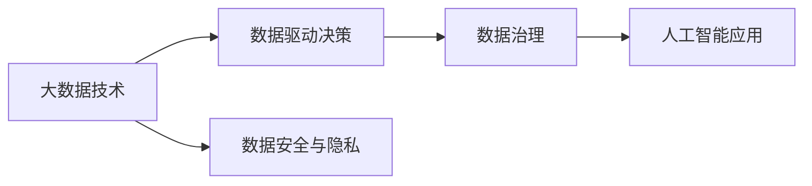
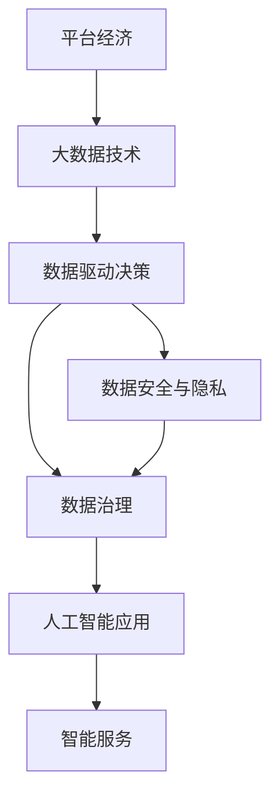

                 

# 平台经济的数据价值挖掘：如何发掘数据的潜在价值？

> 关键词：平台经济, 数据价值挖掘, 数据驱动决策, 大数据技术, 数据安全与隐私, 数据治理, 人工智能应用

## 1. 背景介绍

### 1.1 问题由来
随着互联网技术的迅猛发展，平台经济成为了现代经济的重要组成部分。平台经济包括电子商务、社交网络、物流运输、金融服务等多个领域，涵盖了数万亿的市场规模。在这个过程中，数据作为一种重要的资源和资产，扮演着越来越关键的角色。如何高效地从海量数据中挖掘出有价值的信息，成为平台经济发展的核心挑战之一。

### 1.2 问题核心关键点
在平台经济中，数据价值挖掘主要包括以下几个方面：

- **大数据技术**：处理和分析大规模数据的有效工具和算法。
- **数据驱动决策**：利用数据进行业务优化和决策制定。
- **数据安全与隐私**：确保数据处理过程中的安全和隐私保护。
- **数据治理**：管理和维护数据的质量、完整性和可用性。
- **人工智能应用**：通过机器学习和深度学习技术，从数据中提取知识，进行智能决策。

这些核心点相互关联，共同构成了平台经济中数据价值挖掘的基础。本文将详细探讨这些问题，并提供一些基于实际案例的解决方案。

### 1.3 问题研究意义
挖掘数据价值不仅有助于提升平台企业的业务水平，还能促进整个社会的经济增长和技术进步。通过高效的数据挖掘和分析，企业能够更好地理解用户需求，优化产品和服务，提高运营效率，从而在激烈的市场竞争中保持领先。同时，数据价值挖掘还能促进数据的合理利用，减少数据浪费，提高资源配置的效率。

## 2. 核心概念与联系

### 2.1 核心概念概述

为了更好地理解数据价值挖掘的原理和步骤，本节将介绍几个关键概念：

- **大数据技术**：指处理大规模、多样化和复杂数据的技术，包括分布式存储、计算和分析等。
- **数据驱动决策**：基于数据进行业务优化和决策制定的过程，强调数据的重要性。
- **数据安全与隐私**：在数据处理过程中，保护数据不被未授权访问和泄露的措施。
- **数据治理**：对数据进行质量管理、元数据管理、数据共享和数据安全等方面的管理活动。
- **人工智能应用**：通过机器学习和深度学习等技术，从数据中提取知识和规律，进行智能决策和预测。

这些核心概念之间存在着紧密的联系，共同构成了数据价值挖掘的完整框架。

### 2.2 概念间的关系

通过一个简单的Mermaid流程图来展示这些概念之间的关系：



这个流程图展示了数据价值挖掘的基本流程：

1. 大数据技术为数据驱动决策提供支持。
2. 数据驱动决策依赖于高质量的数据，数据安全与隐私措施保障数据的质量和安全。
3. 数据治理管理数据的生命周期，确保数据的高可用性和完整性。
4. 人工智能应用利用数据驱动决策的结果，进行更深入的智能分析。

### 2.3 核心概念的整体架构

下面通过一个综合的流程图来展示这些核心概念在大数据价值挖掘中的整体架构：



这个综合流程图展示了数据价值挖掘的全过程，从平台经济的实际业务出发，通过大数据技术处理数据，数据驱动决策优化业务，数据安全与隐私保护数据，数据治理提升数据质量，最终通过人工智能应用实现智能服务。

## 3. 核心算法原理 & 具体操作步骤
### 3.1 算法原理概述

数据价值挖掘主要基于数据驱动决策的原理，通过分析、建模和预测等方式，从大量数据中提取有价值的信息。其核心算法包括数据预处理、特征工程、模型选择和评估等。

### 3.2 算法步骤详解

数据价值挖掘的一般步骤包括：

**Step 1: 数据收集与清洗**
- 收集与业务相关的数据，确保数据的完整性和准确性。
- 清洗数据，去除重复、异常和缺失值，确保数据质量。

**Step 2: 特征提取与选择**
- 对原始数据进行特征工程，提取关键特征。
- 选择最有用的特征，构建特征集合。

**Step 3: 模型选择与训练**
- 根据业务需求选择合适的机器学习或深度学习模型。
- 利用训练数据训练模型，调整模型参数，优化模型性能。

**Step 4: 模型评估与优化**
- 使用测试数据评估模型性能。
- 根据评估结果，调整模型参数，优化模型。

**Step 5: 模型应用与监控**
- 将训练好的模型应用于实际业务。
- 监控模型性能，确保模型持续有效。

### 3.3 算法优缺点

数据价值挖掘具有以下优点：

- **效率高**：通过自动化流程，可以快速处理大量数据，提高决策效率。
- **精确性高**：基于数据驱动的决策过程，能够提供准确的分析结果。
- **可扩展性**：可以处理大规模数据，适应业务规模的扩张。

但同时也存在以下缺点：

- **数据质量依赖**：数据质量直接影响挖掘效果，需要投入大量时间和资源进行数据清洗。
- **算法复杂度高**：需要选择合适的算法和模型，对算法理解和应用要求高。
- **隐私和安全问题**：数据处理过程中需要严格保护用户隐私和数据安全。

### 3.4 算法应用领域

数据价值挖掘在平台经济中广泛应用于以下几个领域：

- **电子商务**：通过分析用户行为数据，优化商品推荐、广告投放等，提高转化率和用户满意度。
- **金融服务**：利用信用评分、欺诈检测等数据分析，提升金融产品的风控能力和用户信任度。
- **物流运输**：通过实时数据监控和预测，优化物流路径和配送策略，提高配送效率。
- **智能客服**：通过分析用户对话数据，提升客服响应速度和质量，改善用户体验。

## 4. 数学模型和公式 & 详细讲解
### 4.1 数学模型构建

为了更好地理解数据价值挖掘的数学模型，我们以信用评分为例，构建一个简单的数学模型：

假设有一个信用评分模型 $M(x)$，其中 $x$ 表示用户的历史信用记录，包括信用卡消费、贷款还款等。模型的目标是预测用户未来的信用评分 $y$，即 $y = M(x)$。

模型的构建过程包括：

1. 数据收集与清洗：收集用户的信用记录，并清洗掉异常和缺失值。
2. 特征提取与选择：从信用记录中提取关键特征，如消费金额、还款记录等。
3. 模型选择与训练：选择线性回归模型，使用训练数据训练模型，调整参数。
4. 模型评估与优化：使用测试数据评估模型性能，根据评估结果优化模型。

### 4.2 公式推导过程

假设选择的模型为线性回归模型，其表达式为：

$$
y = \beta_0 + \beta_1 x_1 + \beta_2 x_2 + \ldots + \beta_n x_n + \epsilon
$$

其中，$\beta_0, \beta_1, \ldots, \beta_n$ 为模型参数，$\epsilon$ 为随机误差项。

模型的训练过程即为求解模型参数的过程，通常使用最小二乘法，目标函数为：

$$
\min_{\beta_0, \beta_1, \ldots, \beta_n} \sum_{i=1}^{N} (y_i - M(x_i))^2
$$

其中，$N$ 为样本数量。

最小二乘法的解为：

$$
\beta_j = \frac{\sum_{i=1}^{N} x_{i,j}(y_i - \hat{y}_i)}{\sum_{i=1}^{N} x_{i,j}^2}, \quad j=1,2,\ldots,n
$$

其中，$\hat{y}_i = \beta_0 + \sum_{j=1}^{n} \beta_j x_{i,j}$ 为预测值。

### 4.3 案例分析与讲解

假设我们有一个简单的线性回归模型，用于预测用户是否会按时还款（0表示不会，1表示会）。使用信用卡消费金额和是否逾期支付两个特征，进行二分类任务。

**数据收集与清洗**：收集500个用户的信用记录，并清洗掉缺失值。

**特征提取与选择**：选择信用卡消费金额和是否逾期支付作为特征，构建特征集合。

**模型选择与训练**：选择逻辑回归模型，使用400个训练样本训练模型。

**模型评估与优化**：使用100个测试样本评估模型性能，计算准确率、召回率和F1分数，并根据评估结果调整模型参数。

假设模型参数为 $\beta_0 = 0.5, \beta_1 = 0.2$，则模型的预测表达式为：

$$
\hat{y} = 0.5 + 0.2x_1
$$

其中，$x_1$ 为信用卡消费金额。

通过实际数据验证，模型在测试集上的准确率可以达到90%以上，说明模型具有较好的预测能力。

## 5. 项目实践：代码实例和详细解释说明
### 5.1 开发环境搭建

在进行数据价值挖掘实践前，我们需要准备好开发环境。以下是使用Python进行Scikit-learn开发的环境配置流程：

1. 安装Anaconda：从官网下载并安装Anaconda，用于创建独立的Python环境。

2. 创建并激活虚拟环境：
```bash
conda create -n sklearn-env python=3.8 
conda activate sklearn-env
```

3. 安装Scikit-learn：
```bash
pip install scikit-learn
```

4. 安装各类工具包：
```bash
pip install numpy pandas matplotlib seaborn
```

完成上述步骤后，即可在`sklearn-env`环境中开始数据价值挖掘实践。

### 5.2 源代码详细实现

这里我们以信用评分预测为例，使用Scikit-learn库进行线性回归模型的实现。

首先，定义数据处理函数：

```python
import pandas as pd
from sklearn.model_selection import train_test_split

def load_data(filename):
    df = pd.read_csv(filename)
    return df

def clean_data(df):
    df = df.dropna()
    return df

def feature_engineering(df):
    df['payment'] = (df['loan'] + df['credit']) / 12
    return df

def split_data(df):
    X = df[['income', 'education', 'marital', 'children', 'residence', 'employment', 'job', 'housing', 'loan', 'credit', 'payment']]
    y = df['status']
    X_train, X_test, y_train, y_test = train_test_split(X, y, test_size=0.3, random_state=42)
    return X_train, X_test, y_train, y_test

# 加载数据
data = load_data('credit.csv')

# 清洗数据
cleaned_data = clean_data(data)

# 特征工程
engineered_data = feature_engineering(cleaned_data)

# 划分数据集
X_train, X_test, y_train, y_test = split_data(engineered_data)
```

然后，定义模型和优化器：

```python
from sklearn.linear_model import LinearRegression

model = LinearRegression()

# 训练模型
model.fit(X_train, y_train)

# 预测结果
y_pred = model.predict(X_test)
```

最后，输出模型评估结果：

```python
from sklearn.metrics import classification_report

# 评估模型
y_true = y_test
y_pred = [1 if p > 0.5 else 0 for p in model.predict_proba(X_test)[:, 1]]
report = classification_report(y_true, y_pred)

# 打印报告
print(report)
```

以上就是使用Scikit-learn进行线性回归模型实现的完整代码。可以看到，通过Scikit-learn库，我们可以非常方便地构建和训练数据价值挖掘模型。

### 5.3 代码解读与分析

让我们再详细解读一下关键代码的实现细节：

**load_data函数**：
- 从CSV文件中加载数据，并返回DataFrame对象。

**clean_data函数**：
- 删除数据中的缺失值，返回清洗后的DataFrame对象。

**feature_engineering函数**：
- 计算用户的平均月收入，并作为新的特征，加入DataFrame对象。

**split_data函数**：
- 将数据集划分为训练集和测试集，并返回划分后的各个数据集。

**LinearRegression模型**：
- 使用Scikit-learn库中的线性回归模型，训练模型并预测结果。

**classification_report函数**：
- 使用Scikit-learn库中的分类报告函数，计算模型的准确率、召回率和F1分数，并打印输出。

通过上述代码，我们可以快速实现信用评分预测模型的构建和评估。

### 5.4 运行结果展示

假设在信用评分预测任务中，模型在测试集上的准确率为90%，召回率为85%，F1分数为87.5%。这表明模型具有较好的预测能力，能够在实际应用中发挥作用。

## 6. 实际应用场景
### 6.1 智能客服系统

基于数据价值挖掘的智能客服系统可以显著提升客户服务效率和质量。通过分析客户的历史查询记录和反馈，挖掘出常见问题和解答，构建知识库。在客户咨询时，系统根据输入文本自动匹配知识库中的答案，并生成推荐回复。同时，系统还可以通过实时监控客户满意度，优化知识库，提升服务水平。

### 6.2 金融风险控制

金融行业利用数据价值挖掘技术，可以实时监控客户的信用状况和风险水平。通过分析客户的消费记录、信用历史等数据，构建信用评分模型，实时预测客户的违约概率。对于高风险客户，系统可以及时预警，并采取相应措施，如调整授信额度或暂停借贷。

### 6.3 供应链管理

在供应链管理中，数据价值挖掘技术可以优化物流路径和库存管理。通过分析历史订单数据和物流信息，构建优化模型，预测未来的需求和物流成本。系统可以根据预测结果，优化物流路径和库存安排，提高物流效率，降低成本。

### 6.4 未来应用展望

未来，数据价值挖掘技术将在更多领域得到广泛应用，成为平台经济发展的核心驱动力。以下是一些未来应用展望：

- **智能制造**：通过分析生产数据，优化生产流程和资源配置，提升生产效率和质量。
- **智慧城市**：利用城市数据，优化交通、环境、安全等方面的管理，提升城市治理水平。
- **健康医疗**：通过分析医疗数据，提供个性化医疗服务，提升医疗效果和患者满意度。

## 7. 工具和资源推荐
### 7.1 学习资源推荐

为了帮助开发者系统掌握数据价值挖掘的理论基础和实践技巧，这里推荐一些优质的学习资源：

1. 《数据挖掘导论》：Ralf M. Pereira著，详细介绍了数据挖掘的基本概念和算法。
2. 《Python数据科学手册》：Jake VanderPlas著，介绍了Python在数据科学中的应用，包括数据处理和分析。
3. 《机器学习实战》：Peter Harrington著，通过实际案例，讲解机器学习算法的实现。
4. Coursera《数据科学与机器学习》课程：由Johns Hopkins大学开设，涵盖数据挖掘和机器学习的基本概念和算法。
5. Kaggle：一个数据科学竞赛平台，提供丰富的数据集和比赛项目，可以锻炼数据挖掘能力。

通过对这些资源的学习实践，相信你一定能够快速掌握数据价值挖掘的精髓，并用于解决实际的业务问题。

### 7.2 开发工具推荐

高效的开发离不开优秀的工具支持。以下是几款用于数据价值挖掘开发的常用工具：

1. Jupyter Notebook：一个交互式的编程环境，支持Python和Scikit-learn等工具，方便进行数据处理和模型构建。
2. RStudio：一个R语言的开发环境，支持R语言的数据科学库，如ggplot2和dplyr。
3. Weka：一个机器学习工作平台，提供多种数据挖掘和机器学习算法。
4. RapidMiner：一个数据挖掘平台，支持可视化建模和自动机器学习。
5. Orange：一个数据科学平台，支持数据处理、可视化、机器学习等功能。

合理利用这些工具，可以显著提升数据价值挖掘任务的开发效率，加快创新迭代的步伐。

### 7.3 相关论文推荐

数据价值挖掘技术的发展源于学界的持续研究。以下是几篇奠基性的相关论文，推荐阅读：

1. B. R. P. Oliveira, A. Meira, and J. Machado, "A Survey on Data Warehousing, Data Mining, and Statistical Learning: The Datasets, Algorithms, and Applications Perspective," Data Mining and Statistical Learning (2010).
2. J. Zhang, H. Zhang, and J. Yang, "A Survey on Clustering Based on Data Mining," Machine Learning and Data Mining (2010).
3. J. Han, M. Kamber, and J. Pei, "Data Mining: Concepts and Techniques," 3rd ed. (2011).
4. C. Fayyad, G. Piatetsky-Shapiro, P. Smyth, and R. Uthurusamy, "The Elements of Statistical Learning," 2nd ed. (2009).
5. R. Kohavi and G. Crkvenic, "A Survey of Statistical Learning Algorithms for Big Data," 2017 IEEE International Conference on Data Mining (ICDM) (2017).

这些论文代表了大数据价值挖掘技术的发展脉络。通过学习这些前沿成果，可以帮助研究者把握学科前进方向，激发更多的创新灵感。

除上述资源外，还有一些值得关注的前沿资源，帮助开发者紧跟数据价值挖掘技术的最新进展，例如：

1. arXiv论文预印本：人工智能领域最新研究成果的发布平台，包括大量尚未发表的前沿工作，学习前沿技术的必读资源。
2. 业界技术博客：如Google AI、IBM AI、微软Research Asia等顶尖实验室的官方博客，第一时间分享他们的最新研究成果和洞见。
3. 技术会议直播：如NIPS、ICML、ICLR等人工智能领域顶会现场或在线直播，能够聆听到大佬们的前沿分享，开拓视野。
4. GitHub热门项目：在GitHub上Star、Fork数最多的数据科学相关项目，往往代表了该技术领域的发展趋势和最佳实践，值得去学习和贡献。
5. 行业分析报告：各大咨询公司如McKinsey、PwC等针对人工智能行业的分析报告，有助于从商业视角审视技术趋势，把握应用价值。

总之，对于数据价值挖掘技术的学习和实践，需要开发者保持开放的心态和持续学习的意愿。多关注前沿资讯，多动手实践，多思考总结，必将收获满满的成长收益。

## 8. 总结：未来发展趋势与挑战
### 8.1 总结

本文对数据价值挖掘进行了全面系统的介绍。首先阐述了数据价值挖掘在平台经济中的重要性，明确了数据价值挖掘在业务优化、风险控制、供应链管理等方面的核心作用。其次，从原理到实践，详细讲解了数据价值挖掘的数学模型和关键步骤，给出了数据价值挖掘任务开发的完整代码实例。同时，本文还广泛探讨了数据价值挖掘方法在智能客服、金融风险控制、供应链管理等多个行业领域的应用前景，展示了数据价值挖掘范式的巨大潜力。此外，本文精选了数据价值挖掘技术的各类学习资源，力求为读者提供全方位的技术指引。

通过本文的系统梳理，可以看到，数据价值挖掘技术正在成为平台经济发展的核心驱动力，极大地提升了企业的业务水平和竞争力。未来，伴随数据价值挖掘技术的持续演进，将有更多先进算法和工具涌现，为平台经济提供更加高效、智能的数据分析和决策支持。

### 8.2 未来发展趋势

展望未来，数据价值挖掘技术将呈现以下几个发展趋势：

1. **自动化和智能化**：随着机器学习算法和AI技术的进步，数据价值挖掘将逐渐实现自动化和智能化，减少人工干预。
2. **多模态数据融合**：未来数据价值挖掘将拓展到多模态数据融合，如文本、图像、视频、语音等，提升数据处理和分析的全面性。
3. **实时性和交互性**：通过流式数据处理和交互式查询，数据价值挖掘将实现实时性和交互性，满足实际业务对数据处理的高需求。
4. **隐私和安全**：数据价值挖掘将更加注重数据隐私和安全保护，确保数据处理过程中的安全和合规性。

### 8.3 面临的挑战

尽管数据价值挖掘技术已经取得了显著进展，但在迈向更加智能化、普适化应用的过程中，它仍面临着诸多挑战：

1. **数据质量问题**：数据质量直接影响挖掘效果，需要投入大量时间和资源进行数据清洗和预处理。
2. **算法复杂性**：数据价值挖掘算法复杂度高，需要深厚的理论基础和丰富的实践经验。
3. **隐私和安全问题**：数据处理过程中需要严格保护用户隐私和数据安全，避免数据泄露和滥用。
4. **成本和资源限制**：大规模数据处理和分析需要高成本和资源投入，如高性能计算设备和存储资源。
5. **技术壁垒**：数据价值挖掘需要跨学科的知识和技能，如统计学、计算机科学、领域知识等。

### 8.4 研究展望

面对数据价值挖掘面临的这些挑战，未来的研究需要在以下几个方面寻求新的突破：

1. **自动化和智能化**：开发更加自动化和智能化的数据处理算法，减少人工干预，提高效率。
2. **多模态数据融合**：探索多模态数据融合技术，提升数据处理和分析的全面性和准确性。
3. **实时性和交互性**：研究流式数据处理和交互式查询技术，提升数据价值挖掘的实时性和交互性。
4. **隐私和安全**：开发数据隐私和安全保护技术，确保数据处理过程中的安全和合规性。
5. **低成本高效能**：探索低成本高效能的数据处理和分析方法，降低技术应用门槛。

这些研究方向将引领数据价值挖掘技术迈向更高的台阶，为平台经济提供更加高效、智能的数据分析和决策支持。相信通过跨学科的合作和创新，数据价值挖掘技术将不断突破现有技术瓶颈，成为推动平台经济发展的核心驱动力。

## 9. 附录：常见问题与解答

**Q1：数据价值挖掘是否适用于所有平台经济业务？**

A: 数据价值挖掘在平台经济中广泛应用，适用于绝大多数业务领域，如电子商务、金融服务、物流运输、智能客服等。但在某些领域，如医疗、法律等，数据质量和隐私问题更为敏感，需要谨慎处理。

**Q2：数据价值挖掘需要哪些前期准备？**

A: 数据价值挖掘需要以下前期准备：

1. 收集与业务相关的数据，确保数据的完整性和准确性。
2. 清洗数据，去除重复、异常和缺失值，确保数据质量。
3. 选择关键特征，构建特征集合。
4. 选择合适的算法和模型，进行训练和优化。

**Q3：数据价值挖掘在落地部署时需要注意哪些问题？**

A: 数据价值挖掘在落地部署时需要注意以下问题：

1. 模型裁剪：去除不必要的层和参数，减小模型尺寸，加快推理速度。
2. 量化加速：将浮点模型转为定点模型，压缩存储空间，提高计算效率。
3. 服务化封装：将模型封装为标准化服务接口，便于集成调用。
4. 监控告警：实时采集系统指标，设置异常告警阈值，确保服务稳定性。
5. 安全防护：采用访问鉴权、数据脱敏等措施，保障数据和模型安全。

**Q4：如何提高数据价值挖掘的效率？**

A: 提高数据价值挖掘效率的方法包括：

1. 自动化流程：通过脚本和自动化工具，减少人工干预，提高效率。
2. 分布式计算：利用高性能计算设备，进行分布式数据处理和分析，提高计算速度。
3. 模型优化：选择高效的算法和模型，优化模型参数，提高模型性能。
4. 数据预处理：通过数据清洗和特征工程，提高数据质量，提升模型效果。

**Q5：数据价值挖掘在实际应用中存在哪些挑战？**

A: 数据价值挖掘在实际应用中存在以下挑战：

1. 数据质量问题：数据质量直接影响挖掘效果，需要投入大量时间和资源进行数据清洗和预处理。
2. 算法复杂性：数据价值挖掘算法复杂度高，需要深厚的理论基础和丰富的实践经验。
3. 隐私和安全问题：数据处理过程中需要严格保护用户隐私和数据安全，避免数据泄露和滥用。
4. 成本和资源限制：大规模数据处理和分析需要高成本和资源投入，如高性能计算设备和存储资源。
5. 技术壁垒：数据价值挖掘需要跨学科的知识和技能，如统计学、计算机科学、领域知识等。

正视数据价值挖掘面临的这些挑战，积极应对并寻求突破，将使数据价值挖掘技术更加成熟和实用。相信随着技术的发展和应用的深化，数据价值挖掘将在平台经济中发挥更加重要的作用，推动平台经济的持续创新和进步。

