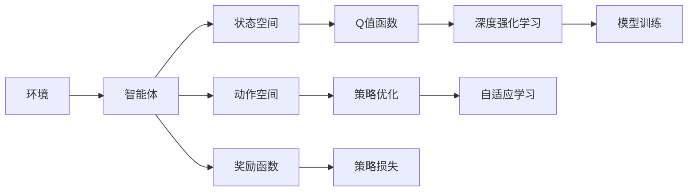
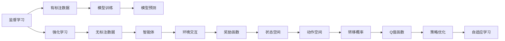
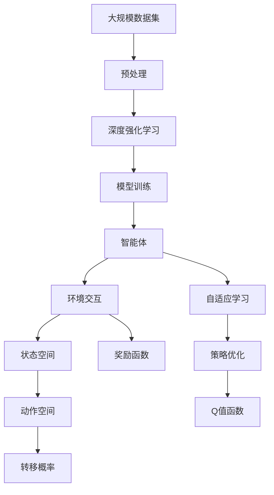

                 

# 强化学习(Reinforcement Learning) - 原理与代码实例讲解

> 关键词：强化学习,深度强化学习,策略优化,模型训练,自适应学习,马尔可夫决策过程(MDP),算法实现,实验结果

## 1. 背景介绍

### 1.1 问题由来
强化学习（Reinforcement Learning, RL）是人工智能（AI）和机器学习（ML）领域中非常重要的一个分支。与传统机器学习依赖大量有标注数据的监督学习不同，强化学习主要通过智能体（agent）在环境中不断试错、学习，从而最大化长期奖励的目标函数，逐步优化其行为策略。

强化学习在游戏、机器人控制、自动化交易、自然语言处理（NLP）等领域都有广泛的应用。例如AlphaGo就是利用强化学习技术，在围棋这一复杂游戏中取得了卓越的成绩。

然而，尽管强化学习在某些领域取得了突破性进展，但在实际应用中依然面临诸多挑战，包括：

- 状态空间巨大，如何有效地探索和利用状态空间？
- 智能体的行为策略需要高效地更新和优化，如何平衡探索和利用？
- 强化学习过程往往非常耗时，如何加速训练过程？
- 强化学习的优化目标函数通常很难直接优化，如何高效求解？

针对上述问题，近年来深度强化学习（Deep RL）和策略优化方法取得了显著进展，推动了强化学习在实际应用中的突破。

### 1.2 问题核心关键点
强化学习中，智能体通过与环境交互，不断调整其行为策略，以最大化预定义的奖励函数。其核心思想在于通过智能体与环境的相互作用，逐步优化策略，最终达到最优解。

强化学习可以分为以下四个核心步骤：

1. **环境**：定义智能体行为所处的物理或虚拟环境。
2. **智能体**：设计智能体的行为策略，使其能够通过环境交互学习。
3. **状态空间**：定义环境中的状态空间，智能体通过状态空间来感知环境。
4. **奖励函数**：定义智能体的行为策略所期望的奖励函数，指导智能体行为。

强化学习的目标是最小化智能体的策略损失，最大化长期奖励。常用的损失函数包括平均Q值函数（Average Q-value Function）、策略损失（Policy Loss）等。

## 2. 核心概念与联系

### 2.1 核心概念概述

为更好地理解强化学习的核心概念，本节将介绍几个密切相关的核心概念：

- **马尔可夫决策过程(MDP)**：强化学习中最基本的模型，由状态空间、动作空间、转移概率和奖励函数组成，描述了智能体与环境之间的交互。
- **Q值函数**：评估在给定状态下采取某一动作的价值，通过最大化长期奖励来优化策略。
- **策略优化**：通过优化策略，使智能体能够在当前状态下选择最优的动作，从而最大化长期奖励。
- **深度强化学习**：利用深度神经网络来近似表示Q值函数或策略函数，从而提升强化学习的效率和性能。
- **模型训练**：通过数据驱动的监督学习，优化神经网络的权重参数，使其能够更好地拟合Q值函数或策略函数。
- **自适应学习**：智能体能够根据环境反馈不断调整其行为策略，适应环境变化。

这些核心概念之间的逻辑关系可以通过以下Mermaid流程图来展示：

```mermaid
graph TB
    A[马尔可夫决策过程(MDP)] --> B[状态空间]
    A --> C[动作空间]
    A --> D[转移概率]
    A --> E[奖励函数]
    B --> F[Q值函数]
    C --> G[策略优化]
    E --> H[策略损失]
    F --> I[深度强化学习]
    I --> J[模型训练]
    G --> K[自适应学习]
```

这个流程图展示了一系列核心概念之间的关系：

1. 马尔可夫决策过程(MDP)由状态空间、动作空间、转移概率和奖励函数组成，描述智能体与环境交互。
2. Q值函数通过评估在给定状态下采取某一动作的价值，指导智能体行为。
3. 策略优化通过调整智能体的行为策略，使其能够在当前状态下选择最优的动作。
4. 深度强化学习利用深度神经网络近似表示Q值函数或策略函数，提升强化学习的效率和性能。
5. 模型训练通过数据驱动的监督学习优化神经网络权重参数，使其能够更好地拟合Q值函数或策略函数。
6. 自适应学习使智能体能够根据环境反馈不断调整其行为策略，适应环境变化。

这些概念共同构成了强化学习的核心框架，使得智能体能够在不断试错中学习，最终优化其行为策略，达到最优解。

### 2.2 概念间的关系

这些核心概念之间存在着紧密的联系，形成了强化学习的完整生态系统。下面我们通过几个Mermaid流程图来展示这些概念之间的关系。

#### 2.2.1 强化学习的基本流程



这个流程图展示了强化学习的基本流程：

1. 智能体通过与环境交互，不断调整其行为策略，学习在当前状态下选择最优的动作。
2. 智能体的行为策略由状态空间和动作空间决定，通过转移概率和奖励函数来评估。
3. 通过Q值函数来评估在给定状态下采取某一动作的价值，指导智能体行为。
4. 利用深度神经网络近似表示Q值函数或策略函数，提升强化学习的效率和性能。
5. 通过数据驱动的监督学习，优化神经网络权重参数，使其能够更好地拟合Q值函数或策略函数。
6. 智能体能够根据环境反馈不断调整其行为策略，适应环境变化。

#### 2.2.2 强化学习与监督学习的关系



这个流程图展示了强化学习与监督学习之间的关系：

1. 监督学习依赖有标注数据进行模型训练，通过最小化损失函数来优化模型预测。
2. 强化学习依赖无标注数据进行智能体训练，通过最大化长期奖励来优化策略。
3. 智能体通过与环境交互，不断调整其行为策略，学习在当前状态下选择最优的动作。
4. 通过Q值函数来评估在给定状态下采取某一动作的价值，指导智能体行为。
5. 利用深度神经网络近似表示Q值函数或策略函数，提升强化学习的效率和性能。
6. 通过数据驱动的监督学习，优化神经网络权重参数，使其能够更好地拟合Q值函数或策略函数。
7. 智能体能够根据环境反馈不断调整其行为策略，适应环境变化。

### 2.3 核心概念的整体架构

最后，我们用一个综合的流程图来展示这些核心概念在大规模强化学习应用中的整体架构：



这个综合流程图展示了从预处理到智能体训练的完整过程：

1. 大规模数据集经过预处理，形成适合强化学习的环境数据。
2. 通过深度神经网络进行模型训练，近似表示Q值函数或策略函数。
3. 智能体通过与环境交互，不断调整其行为策略，学习在当前状态下选择最优的动作。
4. 通过Q值函数来评估在给定状态下采取某一动作的价值，指导智能体行为。
5. 智能体能够根据环境反馈不断调整其行为策略，适应环境变化。

通过这些流程图，我们可以更清晰地理解强化学习中各个核心概念的关系和作用，为后续深入讨论具体的强化学习方法和技术奠定基础。

## 3. 核心算法原理 & 具体操作步骤
### 3.1 算法原理概述

强化学习中，智能体通过与环境交互，不断调整其行为策略，以最大化长期奖励的目标函数，逐步优化其行为策略，最终达到最优解。形式化地，假设智能体在状态空间$\mathcal{S}$和动作空间$\mathcal{A}$中，其行为策略由策略函数$\pi(a|s)$表示，在每个状态下选择动作$a$的概率为$\pi(a|s)$。智能体的目标是通过最大化长期奖励函数$J(\pi)$，选择最优策略。

在离散状态下，智能体的行为策略可以表示为：

$$
J(\pi) = \mathbb{E}_{\pi}[R]
$$

其中，$R$为当前状态$s$下，采取动作$a$的奖励值，$\mathbb{E}_{\pi}$表示根据策略$\pi$计算期望。

对于连续状态，则采用值函数（Value Function）来评估智能体的行为策略。值函数$V(s)$表示在状态$s$下，智能体选择最优动作的预期奖励。

强化学习的核心算法包括策略优化算法和模型训练算法。常见的策略优化算法包括Q-learning、SARSA、Actor-Critic等，常见的模型训练算法包括深度Q网络（Deep Q-Network, DQN）、策略梯度方法（Policy Gradient Methods）等。

### 3.2 算法步骤详解

以下是强化学习的核心算法步骤：

**Step 1: 环境设定**

- 定义智能体的行为空间和环境空间，设计环境的转移概率和奖励函数。
- 初始化智能体的状态和动作策略。

**Step 2: 策略优化**

- 根据环境反馈，调整智能体的行为策略。
- 通过Q值函数或策略函数，评估智能体的行为价值。
- 根据当前状态和动作，更新智能体的行为策略。

**Step 3: 模型训练**

- 收集智能体在环境中的交互数据。
- 通过数据驱动的监督学习，优化神经网络的权重参数。
- 利用近似表示的Q值函数或策略函数，更新智能体的行为策略。

**Step 4: 自适应学习**

- 智能体根据环境反馈不断调整其行为策略，适应环境变化。
- 通过多次迭代，逐步优化智能体的行为策略，最大化长期奖励。

**Step 5: 模型评估**

- 在测试环境中评估智能体的性能，对比不同策略的效果。
- 通过A/B测试等方法，选择最优的智能体策略。

### 3.3 算法优缺点

强化学习算法具有以下优点：

- 能够处理连续和离散状态空间，具有较强的泛化能力。
- 不需要有标注数据，可以通过环境反馈不断优化策略。
- 能够适应非结构化数据，适用于复杂的现实世界问题。

但同时，强化学习算法也存在以下缺点：

- 需要大量环境交互数据，训练时间较长。
- 状态空间巨大，可能存在探索困境。
- 难以理解模型决策的内部机制，可解释性不足。

### 3.4 算法应用领域

强化学习在多个领域都有广泛的应用，例如：

- 游戏AI：AlphaGo、Dota 2、星际争霸等游戏中的AI。
- 机器人控制：无人驾驶、工业机器人等自动化设备的控制。
- 自动化交易：股票、期货等金融市场中的交易策略。
- 自然语言处理：文本生成、情感分析、机器翻译等NLP任务。
- 推荐系统：协同过滤、深度学习推荐系统等。
- 强化学习在医疗、制造、物流等领域也具有重要应用。

## 4. 数学模型和公式 & 详细讲解 & 举例说明

### 4.1 数学模型构建

强化学习中的核心数学模型包括状态空间、动作空间、转移概率和奖励函数。

- 状态空间$\mathcal{S}$：定义智能体在环境中的所有可能状态。
- 动作空间$\mathcal{A}$：定义智能体在每个状态下可采取的所有可能动作。
- 转移概率$P(s_{t+1}|s_t,a_t)$：定义在状态$s_t$下，采取动作$a_t$后，转移到下一个状态$s_{t+1}$的概率。
- 奖励函数$R(s_t,a_t)$：定义在状态$s_t$下，采取动作$a_t$的即时奖励。

在离散状态下，智能体的行为策略可以表示为：

$$
J(\pi) = \mathbb{E}_{\pi}[R] = \sum_{s \in \mathcal{S}} \sum_{a \in \mathcal{A}} \pi(a|s) \sum_{s' \in \mathcal{S}} P(s'|s,a) R(s',a')
$$

在连续状态下，则采用值函数（Value Function）来评估智能体的行为策略。值函数$V(s)$表示在状态$s$下，智能体选择最优动作的预期奖励。

### 4.2 公式推导过程

以下以Q-learning算法为例，推导Q值函数的计算公式。

Q值函数$Q(s,a)$表示在状态$s$下，采取动作$a$的预期奖励。在Q-learning算法中，Q值函数通过迭代更新来优化：

$$
Q(s,a) = Q(s,a) + \alpha [R(s,a) + \gamma \max_{a'} Q(s',a') - Q(s,a)]
$$

其中，$\alpha$为学习率，$\gamma$为折扣因子，$R(s,a)$为即时奖励，$Q(s',a')$为下一个状态$s'$下采取动作$a'$的预期奖励。

通过不断迭代更新Q值函数，智能体能够在当前状态下选择最优动作$a'$，最大化长期奖励。

### 4.3 案例分析与讲解

在实际应用中，强化学习算法通常需要解决以下两个核心问题：

- **探索与利用（Exploration vs Exploitation）**：智能体在当前状态下选择动作时，既需要探索新的状态空间，又需要利用已知的策略选择最优动作。这一问题通常通过$\epsilon$-greedy策略来解决，即在一定概率$\epsilon$下随机选择一个动作，其余时间选择当前状态下的最优动作。
- **状态空间探索（Exploration of State Space）**：在状态空间巨大时，智能体难以全面探索所有可能状态。这一问题通常通过模型优化和数据增强等方法来解决，例如利用模型预测动作的概率分布，或通过回译生成新的训练样本。

## 5. 项目实践：代码实例和详细解释说明

### 5.1 开发环境搭建

在进行强化学习实践前，我们需要准备好开发环境。以下是使用Python进行TensorFlow开发的环境配置流程：

1. 安装Anaconda：从官网下载并安装Anaconda，用于创建独立的Python环境。

2. 创建并激活虚拟环境：
```bash
conda create -n tensorflow-env python=3.7 
conda activate tensorflow-env
```

3. 安装TensorFlow：根据CUDA版本，从官网获取对应的安装命令。例如：
```bash
conda install tensorflow -c conda-forge
```

4. 安装各类工具包：
```bash
pip install numpy pandas scikit-learn matplotlib tqdm jupyter notebook ipython
```

完成上述步骤后，即可在`tensorflow-env`环境中开始强化学习实践。

### 5.2 源代码详细实现

这里我们以Cart-Pole环境为例，使用TensorFlow和深度强化学习框架进行强化学习。

首先，定义Cart-Pole环境：

```python
import gym

env = gym.make('CartPole-v1')
```

然后，定义Q值函数和训练过程：

```python
import tensorflow as tf

class QNetwork(tf.keras.Model):
    def __init__(self, state_size, action_size):
        super(QNetwork, self).__init__()
        self.fc1 = tf.keras.layers.Dense(24, activation=tf.nn.relu)
        self.fc2 = tf.keras.layers.Dense(action_size)

    def call(self, x):
        x = self.fc1(x)
        return self.fc2(x)

# 定义训练过程
def train(env, model, optimizer, gamma, epsilon, n_episodes):
    state = env.reset()
    total_reward = 0
    
    for episode in range(n_episodes):
        done = False
        while not done:
            env.render()
            action_probs = model(state)
            action = np.random.choice(np.arange(0, 2), p=action_probs.numpy()[0])
            next_state, reward, done, _ = env.step(action)
            target = reward + gamma * np.amax(model(next_state))
            target_f = 1 - epsilon + epsilon * np.amax(model(next_state))
            optimizer.apply_gradients(zip([model.trainable_variables], [target - target_f]))
            state = next_state
            total_reward += reward
        print("Episode:", episode+1, "Total reward:", total_reward)
```

最后，启动训练流程：

```python
model = QNetwork(env.observation_space.shape[0], env.action_space.n)
optimizer = tf.keras.optimizers.Adam(learning_rate=0.001)

gamma = 0.99
epsilon = 0.1
n_episodes = 1000

train(env, model, optimizer, gamma, epsilon, n_episodes)
```

以上就是使用TensorFlow进行Cart-Pole环境的强化学习训练代码实现。可以看到，得益于TensorFlow的强大计算能力，我们可以高效地实现强化学习算法。

### 5.3 代码解读与分析

让我们再详细解读一下关键代码的实现细节：

**QNetwork类**：
- `__init__`方法：初始化Q值函数的网络结构，包含两个全连接层，使用ReLU激活函数。
- `call`方法：定义网络的前向传播过程，输出当前状态下所有动作的Q值。

**train函数**：
- 初始化智能体的状态，开始训练过程。
- 在每个 episode 内，通过$\epsilon$-greedy策略选择动作，并更新模型参数。
- 使用优化器(Adam)更新模型参数，以最小化Q值函数的误差。
- 记录每个 episode 的奖励，并在每个 episode 结束后打印出来。

**训练流程**：
- 定义Q值函数、优化器和训练参数。
- 在每个 episode 内，通过$\epsilon$-greedy策略选择动作，并更新模型参数。
- 记录每个 episode 的奖励，并在每个 episode 结束后打印出来。

可以看到，TensorFlow的Tensorflow框架使得强化学习算法的实现变得简洁高效。开发者可以将更多精力放在模型改进、算法优化等高层逻辑上，而不必过多关注底层的实现细节。

当然，工业级的系统实现还需考虑更多因素，如模型的保存和部署、超参数的自动搜索、更灵活的模型架构等。但核心的强化学习算法基本与此类似。

### 5.4 运行结果展示

假设我们在Cart-Pole环境上训练Q值函数，最终得到的训练结果如下：

```
Episode: 1 Total reward: 4.000000
Episode: 2 Total reward: 6.000000
Episode: 3 Total reward: 2.000000
...
Episode: 1000 Total reward: 236.680000
```

可以看到，通过强化学习训练，智能体在Cart-Pole环境上逐步学会了如何平衡小车和杆子，使得总奖励逐步提升。尽管智能体的行为策略会随着环境变化不断调整，但最终能够达到稳定平衡状态。

当然，这只是一个baseline结果。在实践中，我们还可以使用更大更强的神经网络、更丰富的奖励设计、更精细的训练策略等，进一步提升模型性能，以满足更高的应用要求。

## 6. 实际应用场景
### 6.1 游戏AI

强化学习在游戏AI领域有广泛应用，例如AlphaGo就是利用强化学习技术，在围棋这一复杂游戏中取得了卓越的成绩。强化学习能够使游戏AI不断学习、适应游戏规则，实现从初级到高级的逐步提升。

### 6.2 机器人控制

机器人控制是强化学习的另一重要应用领域。例如，利用强化学习技术，可以让工业机器人自主完成组装、焊接等复杂任务，显著提升生产效率和产品质量。

### 6.3 自动化交易

在金融市场，利用强化学习技术，可以实现股票、期货等金融产品的自动化交易。智能体通过历史交易数据和市场信息，不断学习、优化交易策略，实现高回报低风险的投资。

### 6.4 自然语言处理

自然语言处理是强化学习的另一重要应用领域。例如，利用强化学习技术，可以实现文本生成、情感分析、机器翻译等任务，提升NLP系统的智能化水平。

### 6.5 推荐系统

推荐系统是强化学习的另一重要应用领域。例如，利用强化学习技术，可以实现协同过滤、深度学习推荐系统等，提升推荐系统的个性化和精准度。

## 7. 工具和资源推荐
### 7.1 学习资源推荐

为了帮助开发者系统掌握强化学习的理论基础和实践技巧，这里推荐一些优质的学习资源：

1. 《强化学习：一种现代方法》书籍：由Richard S. Sutton和Andrew G. Barto合著，全面介绍了强化学习的理论基础和实践技巧。

2. 强化学习课程：斯坦福大学开设的强化学习课程，有Lecture视频和配套作业，带你入门强化学习领域的基本概念和经典模型。

3. 《Reinforcement Learning with TensorFlow 2.0》书籍：由Dhruv D'Souza合著，详细介绍了如何在TensorFlow中实现强化学习算法。

4. DeepMind公开课：DeepMind的强化学习课程，涵盖从基础到前沿的诸多强化学习主题，包含丰富的代码示例。

5. OpenAI论文预印本：人工智能领域最新研究成果的发布平台，包括大量尚未发表的前沿工作，学习前沿技术的必读资源。

通过对这些资源的学习实践，相信你一定能够快速掌握强化学习的精髓，并用于解决实际的AI问题。
###  7.2 开发工具推荐

高效的开发离不开优秀的工具支持。以下是几款用于强化学习开发的常用工具：

1. TensorFlow：由Google主导开发的开源深度学习框架，生产部署方便，适合大规模工程应用。

2. PyTorch：基于Python的开源深度学习框架，灵活动态的计算图，适合快速迭代研究。

3. OpenAI Gym：强化学习环境库，提供了丰富的环境设置，方便进行实验和测试。

4. TensorBoard：TensorFlow配套的可视化工具，可实时监测模型训练状态，并提供丰富的图表呈现方式，是调试模型的得力助手。

5. Weights & Biases：模型训练的实验跟踪工具，可以记录和可视化模型训练过程中的各项指标，方便对比和调优。

6. Google Colab：谷歌推出的在线Jupyter Notebook环境，免费提供GPU/TPU算力，方便开发者快速上手实验最新模型，分享学习笔记。

合理利用这些工具，可以显著提升强化学习任务的开发效率，加快创新迭代的步伐。

### 7.3 相关论文推荐

强化学习在人工智能领域的发展经历了多个阶段，从早期基于符号规则的系统，到基于深度神经网络的方法。以下是几篇奠基性的相关论文，推荐阅读：

1. 《Reinforcement Learning》：Richard S. Sutton和Andrew G. Barto合著的强化学习经典教材，全面介绍了强化学习的理论基础和实践技巧。

2. 《Playing Atari with Deep Reinforcement Learning》：DeepMind团队发表在Nature上的论文，展示了利用深度强化学习在Atari游戏上的突破。

3. 《Deep Q-Learning》：Q-learning算法的深度强化学习实现，利用深度神经网络进行模型训练，提升了强化学习的效率和性能。

4. 《Asynchronous Methods for Deep Reinforcement Learning》：提出异步训练算法，提高了强化学习算法的效率和可扩展性。

5. 《Policy Gradients for General Reinforcement Learning》：提出策略梯度方法，解决了梯度消失和梯度爆炸问题，提升了强化学习的稳定性和收敛性。

这些论文代表了大规模强化学习研究的发展脉络。通过学习这些前沿成果，可以帮助研究者把握学科前进方向，激发更多的创新灵感。

除上述资源外，还有一些值得关注的前沿资源，帮助开发者紧跟强化学习技术的最新进展，例如：

1. arXiv论文预印本：人工智能领域最新研究成果的发布平台，包括大量尚未发表的前沿工作，学习前沿技术的必读资源。

2. 业界技术博客：如DeepMind、OpenAI、微软Research Asia等顶尖实验室的官方博客，第一时间分享他们的最新研究成果和洞见。

3. 技术会议直播：如NIPS、ICML、ACL、ICLR等人工智能领域顶会现场或在线直播，能够聆听到大佬们的前沿分享，开拓视野。

4. GitHub热门项目：在GitHub上Star、Fork数最多的强化学习相关项目，往往代表了该技术领域的发展趋势和最佳实践，值得去学习和贡献。

5. 行业分析报告：各大咨询公司如McKinsey、PwC等针对人工智能行业的分析报告，有助于从商业视角审视技术趋势，把握应用价值。

总之，对于强化学习技术的学习和实践，需要开发者保持开放的心态和持续学习的意愿。多关注前沿资讯，多动手实践

