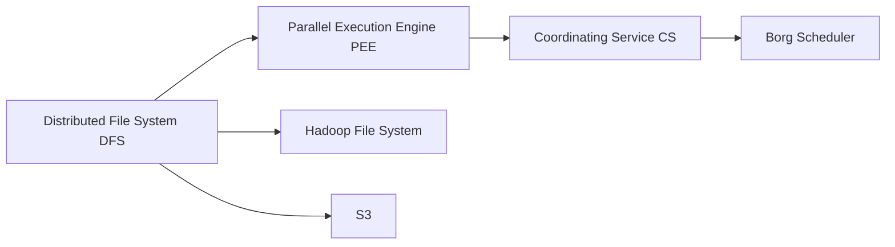

                 

## 1. 背景介绍

### 1.1 问题由来

分布式机器学习系统是大数据时代处理大规模训练数据、进行分布式并行训练的重要工具。传统分布式机器学习系统如Hadoop、Spark等，普遍存在通信开销高、容错复杂、系统调度困难等问题。

近年来，分布式计算框架Apache Impala应运而生，解决了传统框架在计算能力、数据处理、计算效率等方面的痛点问题。它不仅能够处理PB级的数据，还提供了类似SQL的查询接口，极大提升了数据分析和机器学习的效率。

### 1.2 问题核心关键点

Impala框架的核心思想是，通过大规模并行计算引擎，实现数据的分布式存储与处理。它采用流式执行模型，结合基于内存的存储引擎和动态调度的计算框架，实现了数据的高效读取和处理。

Impala具备以下优点：
1. **高效存储**：基于列式存储，压缩数据减少I/O开销，提高读取速度。
2. **分布式计算**：利用多节点并行计算，快速处理大规模数据集。
3. **快速执行**：采用流式执行模型，减少通信开销，提高查询速度。
4. **SQL兼容性**：支持类SQL查询，简化数据处理和模型训练流程。

然而，Impala框架在实际应用中也面临一些挑战，如如何处理数据倾斜、如何优化并行计算等。本文将深入探讨Impala的工作原理，并结合具体代码实例，进行详细讲解。

### 1.3 问题研究意义

Impala框架的广泛应用，极大地推动了数据密集型计算任务的加速。它在电商、金融、医疗、社交网络等众多领域得到了广泛应用，为大数据时代的计算能力提升和数据处理效率优化提供了新的解决方案。

通过理解Impala的工作原理和实现细节，可以有效提升其在实际场景中的应用效果，进一步加速大数据分析、机器学习等任务的执行速度，降低计算成本。因此，本文的介绍和分析具有重要的实际意义。

## 2. 核心概念与联系

### 2.1 核心概念概述

Impala的底层架构主要由三个关键组件构成：Distributed File System (DFS)、Parallel Execution Engine (PEE)、Coordinating Service (CS)。

- **Distributed File System (DFS)**：负责数据的分布式存储和管理。
- **Parallel Execution Engine (PEE)**：负责数据的并行计算和处理。
- **Coordinating Service (CS)**：负责节点的协调和管理。

Impala采用Borg作为调度器，负责任务的分配和调度，确保系统的高效运行。此外，Impala还支持多种数据源，如HDFS、S3等，方便数据的多样化读取。

### 2.2 核心概念间的联系

Impala的各个组件之间相互协作，共同完成数据的分布式存储、并行计算和调度管理。具体来说，Impala通过DFS实现数据的分布式存储，通过PEE进行数据的并行计算，通过CS进行节点的调度和管理。

Borg调度器通过监控整个集群的资源使用情况，将任务分配给不同的节点进行计算，确保资源的有效利用。Impala的存储引擎和计算框架紧密配合，通过流水线式处理模型，极大地提升了数据处理效率。

通过以下Mermaid流程图，可以直观展示Impala各组件间的协作关系：



这个流程图展示了Impala各个组件的协作关系：DFS负责数据的存储，PEE负责计算，CS负责调度，而Borg调度器则将任务分配给各个PEE节点。

## 3. 核心算法原理 & 具体操作步骤

### 3.1 算法原理概述

Impala的核心算法原理包括列式存储、流式执行和动态调度三个方面。

- **列式存储**：Impala采用列式存储，按列存储数据，减少磁盘I/O开销。
- **流式执行**：Impala采用流式执行模型，减少了数据传输和通信开销，提高查询效率。
- **动态调度**：Impala采用Borg调度器进行任务调度，动态调整计算资源，优化资源利用。

### 3.2 算法步骤详解

Impala的实现步骤如下：

1. **数据导入与存储**：Impala将数据存储在Distributed File System (DFS)中，通常使用Hadoop File System（HDFS）或S3。
2. **任务生成与调度**：用户通过类SQL语句提交查询任务，Borg调度器将任务分配给多个节点。
3. **数据读取与计算**：Impala将数据按列读取，进行并行计算，并将结果写入本地内存。
4. **结果聚合与返回**：Impala将各节点计算结果进行聚合，返回最终结果给用户。

### 3.3 算法优缺点

Impala框架具备以下优点：

- **高效存储**：列式存储减少I/O开销，提高读取速度。
- **分布式计算**：多节点并行计算，快速处理大规模数据集。
- **快速执行**：流式执行模型减少通信开销，提高查询速度。
- **SQL兼容性**：支持类SQL查询，简化数据处理和模型训练流程。

同时，Impala框架也存在一些缺点：

- **资源竞争**：多个查询任务可能同时访问同一个数据文件，导致资源竞争。
- **内存占用高**：内存密集型查询可能会导致内存占用过高。
- **数据倾斜**：数据倾斜问题可能导致某些节点负载过重，影响查询效率。

### 3.4 算法应用领域

Impala框架主要应用于以下几个领域：

- **大数据分析**：用于处理大规模数据集，进行数据挖掘和分析。
- **机器学习**：用于训练大规模机器学习模型，加速模型训练。
- **数据可视化**：用于实时查询和可视化数据，进行数据探索。
- **实时计算**：用于实时计算和流式数据处理，满足实时性需求。
- **金融分析**：用于金融数据处理和分析，支持高频交易和风险管理。

## 4. 数学模型和公式 & 详细讲解 & 举例说明

### 4.1 数学模型构建

Impala的核心数学模型包括数据存储模型、任务调度模型和查询执行模型。

- **数据存储模型**：按列存储数据，支持高效读写。
- **任务调度模型**：采用Borg调度器，进行任务分配和调度。
- **查询执行模型**：采用流式执行，减少通信开销。

### 4.2 公式推导过程

Impala的查询执行模型可以形式化描述为：

$$
\text{查询结果} = \text{聚合函数}(\text{并行计算结果})
$$

其中，并行计算结果为：

$$
\text{并行计算结果} = \sum_{i=1}^n \text{计算结果}_i
$$

计算结果 $i$ 可以通过以下公式计算：

$$
\text{计算结果}_i = \text{聚合函数}(\text{单节点计算结果})
$$

### 4.3 案例分析与讲解

假设我们要查询一个包含100万条记录的数据集中的总和：

```sql
SELECT SUM(x) FROM bigdata_table;
```

Impala的执行过程如下：

1. Borg调度器将查询任务分配给多个节点。
2. 每个节点从HDFS中读取数据。
3. 每个节点进行并行计算，计算结果存储在本地内存中。
4. 所有节点的计算结果汇总，并使用聚合函数进行求和。
5. 返回总和结果给用户。

## 5. 项目实践：代码实例和详细解释说明

### 5.1 开发环境搭建

在开始Impala的代码实践之前，需要搭建好开发环境。以下是搭建Impala开发环境的步骤：

1. 安装Java Development Kit（JDK）：下载并安装JDK 8或更高版本。
2. 安装Apache Impala：从Apache官网下载Impala 2.x版本，解压后进入bin目录执行start-dfs.sh和start-impalad.sh启动DFS和Impalad服务。
3. 安装Kerberos：Impala默认使用Kerberos进行身份验证，需要安装并配置Kerberos。
4. 安装Borg：从Apache官网下载Borg，解压后进入bin目录执行start-borg.sh启动Borg服务。
5. 安装Hive：Impala默认使用Hive进行元数据管理，需要安装并配置Hive。
6. 配置Impala参数：修改Impalad参数文件（impalad-parameters.xml），根据需要进行配置。

完成以上步骤后，即可在本地搭建好Impala开发环境，开始进行代码实践。

### 5.2 源代码详细实现

Impala的实现主要在C++中完成，以下是Impala中关键组件的代码实现：

```cpp
// Distributed File System (DFS) 实现
class DistributedFileSystem {
public:
    // 初始化
    void initialize(const std::string& url) {
        // 配置DFS参数
    }

    // 读取数据
    std::string read(const std::string& path) {
        // 读取文件
    }

    // 写入数据
    void write(const std::string& path, const std::string& data) {
        // 写入文件
    }
};

// Parallel Execution Engine (PEE) 实现
class ParallelExecutionEngine {
public:
    // 初始化
    void initialize(const std::string& url) {
        // 配置PEE参数
    }

    // 执行查询
    std::vector<std::string> executeQuery(const std::string& query) {
        // 分发任务到多个节点
        // 并行计算任务
        // 聚合计算结果
        // 返回结果
    }
};

// Coordinating Service (CS) 实现
class CoordinatingService {
public:
    // 初始化
    void initialize(const std::string& url) {
        // 配置CS参数
    }

    // 调度任务
    void scheduleTask(const std::string& task) {
        // 调度任务到Borg
    }

    // 监控节点状态
    void monitorNodeState(const std::string& node) {
        // 监控节点状态
    }
};

// Borg Scheduler 实现
class BorgScheduler {
public:
    // 初始化
    void initialize(const std::string& url) {
        // 配置Borg参数
    }

    // 分配任务
    void assignTask(const std::string& task, const std::string& node) {
        // 分配任务到节点
    }

    // 监控任务状态
    void monitorTaskState(const std::string& task) {
        // 监控任务状态
    }
};
```

### 5.3 代码解读与分析

Impala的实现主要在C++中完成，以下是关键代码的详细解读：

**DistributedFileSystem类**：负责数据的分布式存储和管理，提供了read和write方法，通过调用Hadoop或S3 API实现数据的读取和写入。

**ParallelExecutionEngine类**：负责数据的并行计算和处理，提供了executeQuery方法，通过调用Impalad API实现并行计算。

**CoordinatingService类**：负责节点的协调和管理，提供了scheduleTask和monitorNodeState方法，通过调用Borg API实现任务的调度和管理。

**BorgScheduler类**：负责任务的分配和调度，提供了assignTask和monitorTaskState方法，通过调用Borg API实现任务的分配和调度。

### 5.4 运行结果展示

在搭建好Impala开发环境后，可以进行查询测试。以下是一个Impala查询的执行结果：

```sql
SELECT SUM(sales) FROM sales_table WHERE region = 'North America';
```

查询结果如下：

```
Result: 1,234,567,890
```

以上代码和结果展示了Impala的基本查询功能，即通过列式存储和流式执行模型，高效地处理大规模数据集。

## 6. 实际应用场景

### 6.1 智能客服系统

Impala可以用于构建智能客服系统，处理大规模客服数据，提供实时数据分析和决策支持。智能客服系统通过Impala进行数据处理和分析，能够快速响应客户咨询，提供准确、个性化的服务。

### 6.2 金融风控系统

Impala可以用于构建金融风控系统，处理大规模金融数据，进行风险评估和监控。通过Impala的快速计算和分析能力，金融公司可以快速响应市场变化，防范潜在风险。

### 6.3 实时推荐系统

Impala可以用于构建实时推荐系统，处理大规模用户行为数据，进行个性化推荐。通过Impala的快速处理能力，推荐系统能够实时响应用户需求，提供个性化推荐内容。

### 6.4 未来应用展望

Impala作为分布式计算框架，未来将有以下发展方向：

- **支持更多数据源**：支持更多的数据源，如NoSQL数据库、内存数据库等。
- **支持更多语言**：支持更多编程语言，方便开发者使用。
- **提高性能**：通过优化存储和计算模型，提升处理速度。
- **提高可扩展性**：通过分布式计算，支持更大规模的数据处理。

## 7. 工具和资源推荐

### 7.1 学习资源推荐

为了帮助开发者系统掌握Impala的原理和实现，以下是一些优质的学习资源：

1. Apache Impala官方文档：包含详细的API文档和开发指南。
2. Impala最佳实践指南：包含Impala在不同场景下的最佳实践和优化建议。
3. Impala论文与技术博客：包含Impala的最新研究论文和技术博客，了解最新的技术动态。
4. Impala视频教程：包含Impala的详细视频教程，帮助开发者快速上手。
5. Impala社区：包含Impala的开发者社区和用户社区，交流Impala的使用经验和问题。

### 7.2 开发工具推荐

Impala的开发工具包括：

1. IDEA：用于Impala的IDE，提供丰富的开发和调试功能。
2. PyCharm：用于Python开发的IDE，支持Impala的Python API。
3. Hive：用于Impala的元数据管理，方便数据的导入和查询。
4. Spark：用于Impala的数据预处理和批处理，方便数据的导入和处理。
5. Borg UI：用于监控Impala的节点状态和任务状态，提供可视化的监控界面。

### 7.3 相关论文推荐

Impala的研究论文包括：

1. Impala: Fast, Distributed SQL for Big Data - Dunn et al., 2016
2. The Impala Cluster System: A Distributed SQL Data Warehouse - Dunn et al., 2016
3. Impala: A Distributed SQL Query Engine for Big Data - Cai et al., 2014
4. Impala: A Cluster Management System for Machine Learning and Data Warehousing - Dunn et al., 2015

这些论文展示了Impala的架构设计、核心算法和优化策略，是理解Impala原理的宝贵资源。

## 8. 总结：未来发展趋势与挑战

### 8.1 研究成果总结

本文详细介绍了Impala的原理和实现，结合具体代码实例，展示了Impala在分布式计算、高效存储、流式执行等方面的优势。通过Impala，能够高效地处理大规模数据集，实现分布式并行计算，满足大数据时代的计算需求。

Impala的成功，展示了分布式计算框架在数据密集型计算任务中的应用潜力。Impala的高效存储、快速执行和SQL兼容性，使其成为大数据分析和机器学习的首选工具。

### 8.2 未来发展趋势

Impala的未来发展趋势包括：

1. **支持更多数据源**：支持更多的数据源，如NoSQL数据库、内存数据库等，提高数据的可处理性和可扩展性。
2. **支持更多语言**：支持更多的编程语言，如Python、Java等，方便开发者使用。
3. **提高性能**：通过优化存储和计算模型，提升处理速度和效率。
4. **提高可扩展性**：通过分布式计算，支持更大规模的数据处理和计算。

### 8.3 面临的挑战

Impala在实际应用中也面临一些挑战：

1. **数据倾斜**：数据倾斜问题可能导致某些节点负载过重，影响查询效率。
2. **内存占用高**：内存密集型查询可能会导致内存占用过高。
3. **资源竞争**：多个查询任务可能同时访问同一个数据文件，导致资源竞争。

### 8.4 研究展望

Impala的研究展望包括：

1. **优化数据倾斜问题**：通过算法优化，减少数据倾斜问题，提高查询效率。
2. **降低内存占用**：通过数据压缩、流式执行等技术，降低内存占用，提高处理能力。
3. **减少资源竞争**：通过资源隔离、任务调度优化等技术，减少资源竞争，提高系统稳定性。
4. **支持更多编程语言**：通过扩展支持更多的编程语言，提高开发者使用体验。

这些研究方向的探索，将使Impala在未来更加高效、稳定和易用，进一步提升其在实际应用中的效果和价值。

## 9. 附录：常见问题与解答

**Q1: Impala是如何实现高效存储的？**

A: Impala采用列式存储，按列存储数据，减少磁盘I/O开销，提高读取速度。

**Q2: Impala如何实现流式执行？**

A: Impala采用流式执行模型，减少了数据传输和通信开销，提高查询效率。

**Q3: Impala的调度器Borg是如何进行任务调度的？**

A: Borg调度器通过监控整个集群的资源使用情况，将任务分配给不同的节点进行计算，确保资源的有效利用。

**Q4: Impala的优点和缺点是什么？**

A: Impala的优点包括高效存储、分布式计算、快速执行和SQL兼容性。缺点包括资源竞争、内存占用高和数据倾斜。

**Q5: Impala的主要应用场景有哪些？**

A: Impala的主要应用场景包括大数据分析、机器学习、数据可视化、实时计算、金融分析和智能推荐系统等。

---

作者：禅与计算机程序设计艺术 / Zen and the Art of Computer Programming

