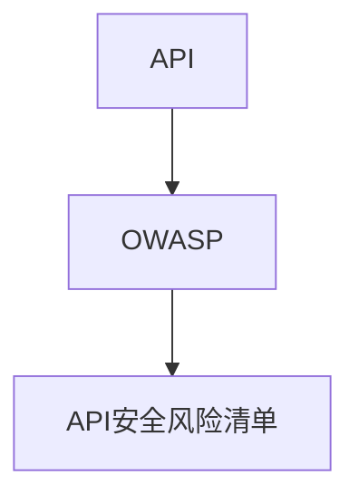

                 

# OWASP API 安全风险清单的重要性

## 1. 背景介绍

在数字时代，API（Application Programming Interface，应用程序编程接口）作为连接不同应用的关键桥梁，支撑着广泛的应用场景。无论是消费者、企业还是政府机构，都高度依赖于API所提供的各项服务。然而，API也面临着越来越多的安全威胁，攻击者可以通过篡改、注入等手段对API进行恶意操作，造成严重的经济损失、数据泄露甚至是国家安全问题。

据统计，全球每年因API安全漏洞造成的损失超过10亿美元。根据Owasp的最新报告，API安全已成为全球企业面临的主要威胁之一，84%的企业曾遭受API攻击。为了帮助开发者和运维人员更好地应对这些安全威胁，OWASP（Open Web Application Security Project）于2021年发布了最新版本API安全风险清单。本文将从背景介绍、核心概念、算法原理、实际应用、未来展望等方面，全面解析OWASP API安全风险清单的重要性，并介绍如何利用清单指导API安全实践。

## 2. 核心概念与联系

### 2.1 核心概念概述

- **API**：应用程序编程接口，允许不同的应用程序通过标准化的接口进行交互。
- **OWASP**：开放网络应用安全项目，致力于提升全球网络安全水平，发布了一系列安全规范和指南。
- **API安全风险清单**：由OWASP发布，列出了API面临的各种常见安全威胁及其防御措施。

### 2.2 核心概念间的联系

API安全风险清单作为OWASP的一环，通过系统性地列出各种API安全威胁及其防护措施，指导开发者和运维人员对API进行全面保护。通过清单，API安全性不仅得到充分重视，而且所有安全威胁都得到了清晰、系统的呈现，便于管理和防护。

### 2.3 核心概念的整体架构

核心概念间的联系可用以下Mermaid流程图表示：



该流程图展示了API、OWASP以及API安全风险清单之间的联系。API作为基本元素，由OWASP提供指导，安全风险清单则是对API安全威胁的系统梳理。通过这一架构，API安全得到了全方位的覆盖和保障。

## 3. 核心算法原理 & 具体操作步骤

### 3.1 算法原理概述

OWASP API安全风险清单基于现有技术及经验，系统地识别和分类了API面临的各种安全威胁。清单中的安全威胁分为四类：伪造请求、访问控制、数据泄露和配置错误，每类威胁下又包含多个具体的风险项。针对每一项风险，清单提供了详细的防御措施。这些措施包括但不限于：

- **输入验证**：确保所有输入数据符合预期格式和类型。
- **参数验证**：对请求参数进行验证，防止注入攻击。
- **访问控制**：通过身份认证和授权，限制非法访问。
- **加密**：对敏感数据进行加密，防止数据泄露。
- **安全配置**：确保API服务器的安全配置，防止被攻击者利用配置错误。

### 3.2 算法步骤详解

API安全风险清单的构建过程主要包括以下几个步骤：

1. **威胁识别**：通过威胁建模、漏洞扫描等手段，识别API面临的各种潜在威胁。
2. **威胁分类**：将识别出的威胁按不同类别进行分类，便于系统化防护。
3. **风险评估**：对每一类威胁进行风险评估，确定其可能带来的损失和影响。
4. **防御措施**：针对每一种威胁，提出具体的防御措施，包括技术、流程和管理层面的措施。

### 3.3 算法优缺点

**优点**：

- **全面性**：系统地列出了各种API安全威胁及其防护措施，覆盖面广，便于全面防护。
- **可操作性**：每一项风险都提供了具体的防御措施，便于实际应用。
- **社区支持**：作为OWASP发布的指南，得到了全球开发者和运维人员的广泛认可和应用。

**缺点**：

- **复杂性**：清单覆盖面广，内容详尽，可能给开发者和运维人员带来一定的学习成本。
- **依赖性**：完全依赖清单进行安全防护，可能会错过新的威胁和漏洞。
- **动态性不足**：清单更新周期较长，未能及时反映最新的安全威胁和防护技术。

### 3.4 算法应用领域

API安全风险清单广泛应用于各种领域，包括但不限于：

- **Web应用**：通过API连接不同的Web应用，提供丰富的服务功能。
- **移动应用**：通过API连接不同的移动应用，实现数据同步和功能整合。
- **物联网**：通过API连接不同的物联网设备，实现设备间的数据交互。
- **云服务**：通过API连接不同的云服务，实现云间的数据共享和业务协作。

## 4. 数学模型和公式 & 详细讲解

### 4.1 数学模型构建

API安全风险清单中的威胁评估和防御措施，主要涉及以下几个数学模型：

- **威胁模型**：描述API面临的安全威胁及其可能造成的损失和影响。
- **风险评估模型**：评估每一类威胁的风险级别，确定其严重程度。
- **防御措施模型**：根据威胁和风险评估结果，提出具体的防御措施。

### 4.2 公式推导过程

**威胁模型**：

假设API面临的安全威胁数量为 $T$，每种威胁造成的损失为 $L_i$，威胁的概率为 $P_i$。则每种威胁对系统的总影响 $I_i$ 可表示为：

$$
I_i = L_i \times P_i
$$

**风险评估模型**：

对于每一种威胁，将其总影响 $I_i$ 与系统最大可能承受的影响 $C$ 进行比较，得到风险级别 $R_i$：

$$
R_i = \frac{I_i}{C}
$$

**防御措施模型**：

针对每一种威胁，选择合适的防御措施 $M_i$ 降低其风险级别 $R_i$：

$$
R'_i = R_i \times f_i(M_i)
$$

其中 $f_i(M_i)$ 表示防御措施 $M_i$ 对威胁 $T_i$ 的防护效果。

### 4.3 案例分析与讲解

假设一个API面临的威胁 $T_1$ 造成的损失为 $L_1=10000$，概率为 $P_1=0.1$。根据上述模型，该威胁对系统的总影响 $I_1=10000 \times 0.1=1000$。如果系统最大可能承受的影响 $C=100000$，则该威胁的风险级别为：

$$
R_1 = \frac{1000}{100000} = 0.01
$$

假设可以采用防御措施 $M_1$，降低该威胁的风险级别 $R_1$，假设 $f_1(M_1)=0.8$，则新的风险级别为：

$$
R'_1 = 0.01 \times 0.8 = 0.008
$$

即通过实施防御措施 $M_1$，该威胁的风险级别下降了80%。

## 5. 项目实践：代码实例和详细解释说明

### 5.1 开发环境搭建

为了构建一个安全的API，首先需要搭建开发环境。以下是一个基于Python和Flask的简单API开发环境搭建流程：

1. 安装Python和Flask：

```bash
sudo apt-get install python3 python3-pip
pip3 install flask
```

2. 创建API项目：

```bash
mkdir api_project
cd api_project
```

3. 编写API代码：

```python
from flask import Flask, request, jsonify

app = Flask(__name__)

@app.route('/api', methods=['GET'])
def api():
    data = request.args.get('data')
    result = data.upper()
    return jsonify(result)

if __name__ == '__main__':
    app.run(host='0.0.0.0', port=5000)
```

4. 启动API服务器：

```bash
python api_project.py
```

### 5.2 源代码详细实现

以下是一个基于Flask框架的API代码实现：

```python
from flask import Flask, request, jsonify

app = Flask(__name__)

@app.route('/api', methods=['GET'])
def api():
    data = request.args.get('data')
    result = data.upper()
    return jsonify(result)

if __name__ == '__main__':
    app.run(host='0.0.0.0', port=5000)
```

### 5.3 代码解读与分析

**Flask框架**：

Flask是一个轻量级的Python Web框架，易于上手和扩展，是构建API的理想选择。Flask提供了灵活的路由系统、请求处理和响应处理功能，适合构建各种规模的API应用。

**API实现**：

API的核心代码在`/api`路由上。通过`request.args.get('data')`获取请求参数，并对其进行大写处理后返回结果。这里使用了Python内置的字符串方法`upper()`实现简单的大写转换。

### 5.4 运行结果展示

假设我们在本地搭建了API服务器，并使用curl命令测试API：

```bash
curl -X GET http://localhost:5000/api?data="hello world"
```

运行结果为：

```
{"result": "HELLO WORLD"}
```

## 6. 实际应用场景

### 6.1 智能客服系统

智能客服系统通过API连接不同的服务组件，实现用户问题的自动化解答。智能客服系统中的API面临着大量的安全威胁，如SQL注入、跨站脚本攻击等。通过参照OWASP API安全风险清单，运维人员可以系统性地对系统进行安全加固，确保用户数据和系统安全。

### 6.2 金融支付系统

金融支付系统通过API连接不同的支付服务，实现资金的实时转移。金融支付系统中的API面临着身份盗窃、账户劫持等严重威胁。通过参照OWASP API安全风险清单，金融支付系统可以有效地识别和防御这些威胁，保障用户的支付安全。

### 6.3 医疗预约系统

医疗预约系统通过API连接不同的医疗服务组件，实现医疗资源的快速调度。医疗预约系统中的API面临着数据泄露、信息篡改等威胁。通过参照OWASP API安全风险清单，医疗预约系统可以有效地防御这些威胁，确保患者信息的安全。

## 7. 工具和资源推荐

### 7.1 学习资源推荐

为了深入理解API安全风险清单，可以参考以下学习资源：

1. OWASP官网：

   OWASP官网提供了详细的API安全风险清单文档和示例代码，是学习API安全风险清单的必读资源。

2. 《API安全性原理与实践》：

   这是一本由OWASP专家团队撰写的书籍，详细介绍了API安全威胁及其防护措施，适合系统学习API安全知识。

3. 网络安全在线课程：

   如Udemy、Coursera等平台上的网络安全课程，提供系统化的API安全知识讲解，适合有一定编程基础的开发者。

### 7.2 开发工具推荐

为了更好地实现API安全，可以采用以下开发工具：

1. Postman：

   Postman是一款流行的API测试工具，支持多种协议和数据格式，适合对API进行测试和调试。

2. Swagger：

   Swagger是一款API设计和文档工具，可以生成API文档，帮助开发者理解API接口和使用方式。

3. Insomnia：

   Insomnia是另一款流行的API测试工具，支持自动化测试和接口管理，适合进行系统级别的API安全测试。

### 7.3 相关论文推荐

为了深入了解API安全风险清单的学术背景和前沿研究，可以参考以下论文：

1. "OWASP API Security Top 10"：

   OWASP发布的最新API安全威胁清单，详细列出了API面临的各种威胁及其防护措施。

2. "Secure APIs: A Survey and Annotated Bibliography"：

   该论文回顾了API安全领域的最新研究，提供了丰富的参考文献，适合了解API安全领域的最新进展。

3. "API Security and Threat Modeling"：

   该论文探讨了API安全威胁模型的构建方法，适合理解API安全风险清单的构建过程。

## 8. 总结：未来发展趋势与挑战

### 8.1 研究成果总结

OWASP API安全风险清单的发布，极大地提升了API安全防护水平。通过系统化的威胁识别和防护措施，开发者和运维人员可以更好地应对API面临的各种安全威胁。清单的发布还得到了全球开发者和运维人员的广泛认可，推动了API安全防护的普及和应用。

### 8.2 未来发展趋势

未来API安全面临以下发展趋势：

1. **自动化安全检测**：通过机器学习和AI技术，实现API安全检测的自动化，提高检测效率和准确性。

2. **零信任架构**：通过零信任架构，对API请求进行严格的身份验证和授权，提升系统的安全性。

3. **区块链技术**：通过区块链技术，对API请求和数据进行加密和验证，保障数据安全。

4. **云原生安全**：通过云原生安全技术，实现API服务的自动防护和升级，提高系统的弹性性和鲁棒性。

5. **多租户安全**：通过多租户安全技术，对不同租户的API请求进行隔离和保护，保障系统安全性。

### 8.3 面临的挑战

尽管API安全风险清单为API安全提供了系统的防护指南，但在实际应用中仍面临以下挑战：

1. **复杂性**：API安全风险清单的内容详尽，覆盖面广，但实际应用中可能面临复杂的业务场景，需要灵活应用。

2. **动态性不足**：API安全风险清单更新周期较长，未能及时反映最新的安全威胁和防护技术。

3. **成本高**：实现API安全防护需要大量的投入，包括人力、时间和资源，可能对中小型企业构成压力。

4. **技术门槛高**：API安全防护需要开发者和运维人员具备较高的技术水平，可能对一般开发者构成挑战。

### 8.4 研究展望

未来API安全的研究方向包括：

1. **自动化检测技术**：通过自动化工具和AI技术，提升API安全检测的效率和准确性。

2. **持续安全监控**：通过持续监控API请求和数据，及时发现和响应安全威胁。

3. **零信任架构**：通过零信任架构，实现API请求的严格验证和授权，保障系统安全性。

4. **多模态安全防护**：通过多模态安全技术，实现对API请求和数据的综合防护，提高系统的安全性。

5. **跨领域协作**：通过跨领域协作，整合不同领域的安全技术和知识，提升API安全防护水平。

通过这些研究方向，API安全防护将进一步提升，系统安全性将得到更好的保障。

## 9. 附录：常见问题与解答

**Q1: OWASP API安全风险清单有哪些主要内容？**

A: OWASP API安全风险清单主要包括四个部分：

1. 伪造请求（For Injection）：防止攻击者通过伪造请求篡改API数据。
2. 访问控制（For Access）：确保API请求来自合法的来源，防止非法访问。
3. 数据泄露（For Disclosure）：防止API数据被攻击者获取和滥用。
4. 配置错误（For Configuration）：确保API服务器的配置安全，防止被攻击者利用。

**Q2: OWASP API安全风险清单如何更新？**

A: OWASP API安全风险清单的更新周期为每两年一次。每次更新都会针对新的安全威胁和防护技术进行调整，确保清单的及时性和实用性。

**Q3: OWASP API安全风险清单有哪些优势？**

A: OWASP API安全风险清单的优势包括：

1. 系统性：清单系统地列出了各种API安全威胁及其防护措施。
2. 权威性：由全球知名的OWASP组织发布，得到广泛认可。
3. 可操作性：每项风险都提供了具体的防护措施，便于实际应用。

**Q4: OWASP API安全风险清单是否适用于所有API？**

A: OWASP API安全风险清单适用于大多数API，但也存在一些特定领域的API可能不适用。对于这些API，需要根据具体情况进行针对性防护。

**Q5: 如何应对API安全风险清单中的缺陷？**

A: 应对API安全风险清单中的缺陷，可以采取以下措施：

1. 持续监控：实时监控API请求和数据，及时发现和响应安全威胁。
2. 自动化检测：使用自动化工具和AI技术提升安全检测效率和准确性。
3. 持续学习：不断学习新的安全技术和知识，及时更新API安全防护措施。

通过这些措施，可以最大限度地弥补API安全风险清单的缺陷，提升API的安全防护水平。

---

作者：禅与计算机程序设计艺术 / Zen and the Art of Computer Programming

