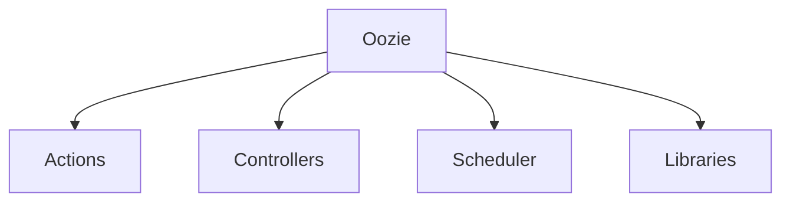

                 

# Oozie原理与代码实例讲解

## 1. 背景介绍

在当今的大数据时代，企业的业务日益依赖于数据分析和处理。传统的ETL（Extract, Transform, Load）流程需要人工编写和调试，效率低下且容易出错。Oozie作为一种工作流调度工具，能够自动执行ETL流程，大大提高了数据处理的效率和可靠性。本文将系统讲解Oozie的基本原理、核心概念以及代码实例，帮助读者掌握使用Oozie进行数据处理的方法。

## 2. 核心概念与联系

### 2.1 核心概念概述

Oozie是一个由Apache Hadoop社区开发的开源工作流调度系统。其核心思想是通过定义一个由一系列动作（Action）组成的工作流（Workflow），将这些动作按照一定顺序和逻辑连接起来，自动执行数据处理任务。Oozie支持多种数据处理工具，如Hadoop、Pig、Sqoop等，能够灵活应对各种数据处理需求。

### 2.2 核心概念之间的关系

Oozie的核心概念主要包括以下几个方面：

- **工作流（Workflow）**：指由一系列动作按照一定顺序和逻辑连接而成的工作流。
- **动作（Action）**：指执行数据处理任务的具体操作，如数据提取、转换、加载等。
- **控制器（Controller）**：指控制整个工作流的运行逻辑和状态，包括定义工作流的起始和结束条件。
- **调度器（Scheduler）**：指负责根据工作流的定义自动调度动作的执行，支持定时、触发器等多种调度方式。
- **库（Libraries）**：指预定义的一组常用动作和控制器，方便快速构建工作流。

这些核心概念通过组合和连接，构成了Oozie的完整功能框架，使Oozie能够灵活、高效地执行数据处理任务。

### 2.3 核心概念的整体架构

以下是一个简单的Oozie工作流架构图，展示了各个核心概念之间的关系：



## 3. 核心算法原理 & 具体操作步骤

### 3.1 算法原理概述

Oozie的核心算法原理可以简单归纳为：通过定义一个由一系列动作组成的工作流，根据工作流的定义自动调度动作的执行，从而实现数据处理任务的自动化。具体来说，Oozie通过XML语言定义工作流，并将其转换为流式计算图，然后由调度器按照定义顺序和逻辑执行各个动作，完成数据处理任务。

### 3.2 算法步骤详解

使用Oozie进行数据处理的一般步骤如下：

1. **定义工作流**：使用XML语言定义工作流，包括动作、控制器、触发器等组件。
2. **创建动作**：创建具体的数据处理动作，如数据提取、转换、加载等。
3. **连接动作**：将各个动作按照逻辑连接起来，形成完整的工作流。
4. **定义控制器**：定义工作流的起始和结束条件，包括触发器、条件判断等。
5. **配置调度器**：配置调度器的执行策略，如定时、触发器等。
6. **执行工作流**：启动工作流的执行，自动调度各个动作，完成数据处理任务。

### 3.3 算法优缺点

Oozie作为一种工作流调度工具，具有以下优点：

- **高效可靠**：自动执行数据处理任务，避免了人工操作带来的错误和延时。
- **灵活易用**：支持多种数据处理工具和调度方式，能够灵活应对各种数据处理需求。
- **易于扩展**：通过扩展XML语言和库，可以方便地增加新的动作和控制器。

同时，Oozie也存在一些缺点：

- **学习成本高**：需要学习XML语言和Oozie的工作流语法。
- **性能问题**：在大规模数据处理时，可能出现性能瓶颈。
- **依赖环境复杂**：需要配置多种环境变量和依赖库，增加了配置和部署的复杂性。

### 3.4 算法应用领域

Oozie主要应用于企业内部的数据处理和分析，可以用于以下几个方面：

- **ETL流程自动化**：自动执行数据提取、转换、加载等ETL任务。
- **数据调度**：定期执行数据处理任务，保证数据的时效性和一致性。
- **数据清洗**：自动清洗数据中的噪声和错误，提高数据质量。
- **数据备份**：自动备份数据，确保数据的安全性和可靠性。
- **数据监控**：实时监控数据处理过程，及时发现和解决异常问题。

## 4. 数学模型和公式 & 详细讲解

### 4.1 数学模型构建

Oozie的数学模型基于流式计算图（Flow Graph），每个动作都可以表示为一个节点，不同的动作节点通过数据流（Data Flow）连接起来，形成整个计算图。每个节点的输入和输出都是数据的集合，表示数据在处理过程中需要传递的信息。

### 4.2 公式推导过程

以一个简单的数据转换动作为例，其数学模型可以表示为：

```
X_in -> Trans -> X_out
```

其中 $X_{in}$ 表示输入数据的集合，$X_{out}$ 表示输出数据的集合，$Trans$ 表示数据转换动作。

通过这种方式，Oozie可以将多个动作连接起来，形成一个完整的数据处理工作流，并自动执行各个动作。

### 4.3 案例分析与讲解

假设我们需要将一个CSV文件转换为另一个格式，可以使用以下Oozie工作流：

```xml
<workflow xmlns="http://www.apache.org/oozie/core-schema">
    <action name="read">
        <action py="com.mycompany.actions.CSVReader"
               outputLabel="data"
               xml:id="read"/>
    </action>
    <action name="transform">
        <action py="com.mycompany.actions.DataTransformer"
               inputLabel="data"
               outputLabel="transformed"
               xml:id="transform"/>
    </action>
    <action name="write">
        <action py="com.mycompany.actions.CSVWriter"
               inputLabel="transformed"
               xml:id="write"/>
    </action>
    <start to="read"/>
    <end from="write"/>
</workflow>
```

上述XML代码定义了一个包含三个动作的工作流：

- 第一个动作 `read` 表示从CSV文件中读取数据。
- 第二个动作 `transform` 表示将读取到的数据进行转换。
- 第三个动作 `write` 表示将转换后的数据写入新的CSV文件中。

## 5. 项目实践：代码实例和详细解释说明

### 5.1 开发环境搭建

要使用Oozie，需要先搭建好Apache Hadoop环境。具体步骤如下：

1. 安装Java开发环境。
2. 安装Hadoop核心组件，如HDFS、MapReduce等。
3. 安装Oozie和相关依赖。

### 5.2 源代码详细实现

下面是一个简单的Oozie工作流代码示例，用于从一个CSV文件中读取数据，并写入另一个CSV文件中：

```xml
<workflow xmlns="http://www.apache.org/oozie/core-schema">
    <action name="read">
        <action py="com.mycompany.actions.CSVReader"
               outputLabel="data"
               xml:id="read"/>
    </action>
    <action name="transform">
        <action py="com.mycompany.actions.DataTransformer"
               inputLabel="data"
               outputLabel="transformed"
               xml:id="transform"/>
    </action>
    <action name="write">
        <action py="com.mycompany.actions.CSVWriter"
               inputLabel="transformed"
               xml:id="write"/>
    </action>
    <start to="read"/>
    <end from="write"/>
</workflow>
```

### 5.3 代码解读与分析

上述代码定义了一个包含三个动作的工作流，每个动作的具体实现可以通过编写Python脚本来完成：

- `CSVReader` 类用于读取CSV文件，并将数据存储在内存中。
- `DataTransformer` 类用于对读取到的数据进行转换操作。
- `CSVWriter` 类用于将转换后的数据写入新的CSV文件中。

### 5.4 运行结果展示

执行上述工作流后，将会从原始CSV文件中读取数据，并进行转换和写入操作，生成新的CSV文件。具体结果可以通过查看日志和输出文件来验证。

## 6. 实际应用场景

### 6.1 企业内部数据处理

在企业内部，Oozie可以用于自动化ETL流程，快速高效地处理和分析数据。例如，可以通过Oozie实现以下任务：

- 定期从数据库中导出数据，进行数据清洗和转换，生成报表。
- 自动化数据备份和恢复，确保数据的安全性。
- 实时监控数据处理过程，及时发现和解决异常问题。

### 6.2 数据清洗和预处理

数据清洗和预处理是数据处理的第一步，Oozie可以用于自动化数据清洗任务，提高数据质量。例如，可以通过Oozie实现以下任务：

- 自动识别和删除数据中的异常值和噪声。
- 自动进行数据去重和标准化操作。
- 自动处理缺失值和重复值。

### 6.3 数据采集和监控

数据采集和监控是数据处理的第二个环节，Oozie可以用于自动化数据采集和监控任务，确保数据的时效性和完整性。例如，可以通过Oozie实现以下任务：

- 自动采集网络数据，进行实时分析。
- 自动监控数据处理过程，及时发现和解决异常问题。
- 自动生成数据报告，提供数据处理结果。

### 6.4 未来应用展望

随着技术的不断发展，Oozie在未来还将有以下新的应用场景：

- 大数据分析：与Hadoop、Spark等大数据处理工具结合，实现复杂的数据分析和建模。
- 机器学习：与机器学习工具结合，实现自动化的数据预处理和特征工程。
- 云计算：与云计算平台结合，实现弹性伸缩和资源管理。
- 人工智能：与人工智能技术结合，实现自动化的数据处理和智能分析。

## 7. 工具和资源推荐

### 7.1 学习资源推荐

- **Oozie官方文档**：Oozie的官方文档详细介绍了Oozie的各个组件和工作流语法，是学习Oozie的必备资源。
- **《Oozie实战》**：这是一本介绍Oozie实战应用的书籍，通过大量实例讲解了Oozie的各个组件和工作流，适合初学者和实战开发者。
- **Hadoop社区**：Apache Hadoop社区提供了大量的开源工具和框架，可以与Oozie结合使用，满足各种数据处理需求。

### 7.2 开发工具推荐

- **IntelliJ IDEA**：IntelliJ IDEA是一款强大的Java开发工具，支持Oozie的XML语言编辑和调试。
- **Oozie Shell**：Oozie Shell是一个基于Web的可视化工具，可以帮助用户快速构建和管理Oozie工作流。
- **Hadoop CLI**：Hadoop CLI是一个命令行工具，可以用于管理和监控Hadoop集群，方便Oozie的部署和调试。

### 7.3 相关论文推荐

- **《Oozie: A Workflow Scheduler for Hadoop》**：该论文是Oozie的官方文档，详细介绍了Oozie的工作流调度原理和实现方法。
- **《Hadoop and Oozie: The Workflow Engine》**：该论文介绍了Hadoop和Oozie的结合使用，讲解了Oozie在Hadoop环境下的应用场景。
- **《Using Oozie to Schedule Apache Spark Jobs》**：该论文介绍了Oozie和Apache Spark的结合使用，讲解了Oozie在Spark环境下的应用场景。

## 8. 总结：未来发展趋势与挑战

### 8.1 研究成果总结

Oozie作为一种工作流调度工具，已经广泛应用于企业内部数据处理和分析。其主要优点在于自动化数据处理任务，提高了数据处理的效率和可靠性，同时支持多种数据处理工具和调度方式，能够灵活应对各种数据处理需求。

### 8.2 未来发展趋势

未来，Oozie将有以下几个发展趋势：

- **智能化**：与人工智能技术结合，实现自动化的数据处理和智能分析。
- **云化**：与云计算平台结合，实现弹性伸缩和资源管理。
- **数据可视化**：通过可视化工具，实时监控数据处理过程，提供更直观的数据展示。
- **自动化**：通过自动化工具，自动生成和优化数据处理流程，提高数据处理的效率和精度。

### 8.3 面临的挑战

尽管Oozie在数据处理和分析方面表现出色，但仍面临一些挑战：

- **学习成本高**：需要学习XML语言和Oozie的工作流语法，初学者可能需要一段时间适应。
- **性能问题**：在大规模数据处理时，可能出现性能瓶颈。
- **依赖环境复杂**：需要配置多种环境变量和依赖库，增加了配置和部署的复杂性。

### 8.4 研究展望

未来的研究重点在于以下几个方面：

- **简化Oozie语法**：通过简化XML语言和Oozie的工作流语法，降低学习成本，提高使用便捷性。
- **优化性能**：通过优化Oozie的计算图和调度器，提升处理大规模数据的能力。
- **扩展功能**：通过扩展Oozie的库和组件，增加新的数据处理和分析功能。
- **与其他工具结合**：与大数据、机器学习、云计算等工具结合，实现更全面的数据处理和分析能力。

总之，Oozie作为一种工作流调度工具，已经在大数据处理和分析领域发挥了重要作用。未来，随着技术的不断发展和完善，Oozie将在更多的领域和场景中得到应用，为数据处理和分析带来新的突破和创新。

## 9. 附录：常见问题与解答

**Q1：Oozie是否可以跨平台使用？**

A: 是的，Oozie可以在多种平台上运行，包括Linux、Windows等。但需要注意的是，Oozie依赖于Hadoop环境，需要配置好Hadoop环境后才能使用。

**Q2：Oozie支持哪些数据处理工具？**

A: Oozie支持多种数据处理工具，包括Hadoop、Pig、Sqoop等。可以通过编写Python脚本，实现与多种数据处理工具的集成。

**Q3：Oozie如何处理大规模数据？**

A: 在处理大规模数据时，Oozie可能会出现性能瓶颈。可以通过优化计算图和调度器，使用分布式计算等方法来提高处理能力。

**Q4：Oozie的可靠性如何？**

A: Oozie的可靠性较高，但需要在配置和部署时注意各种细节，确保各个组件之间的协调运行。

**Q5：如何监控Oozie的工作流执行情况？**

A: 可以通过Oozie的日志和监控工具，实时监控工作流的执行情况，及时发现和解决异常问题。

---

作者：禅与计算机程序设计艺术 / Zen and the Art of Computer Programming

