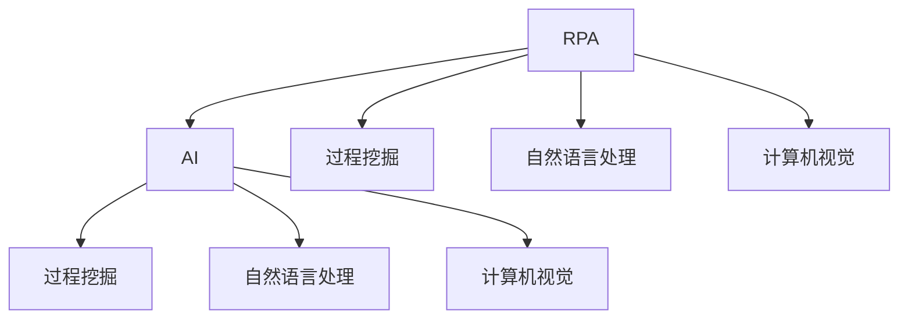
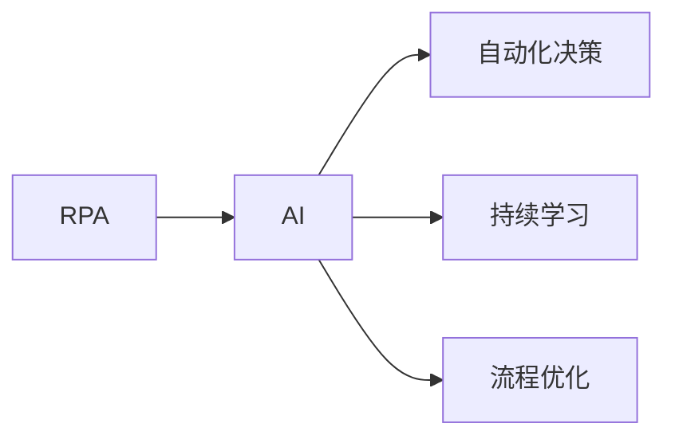
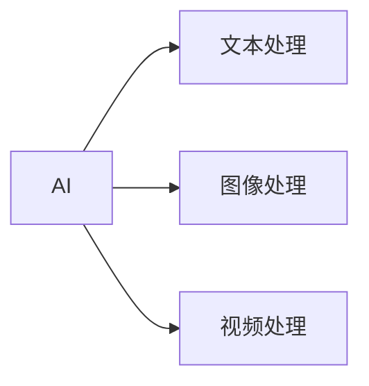
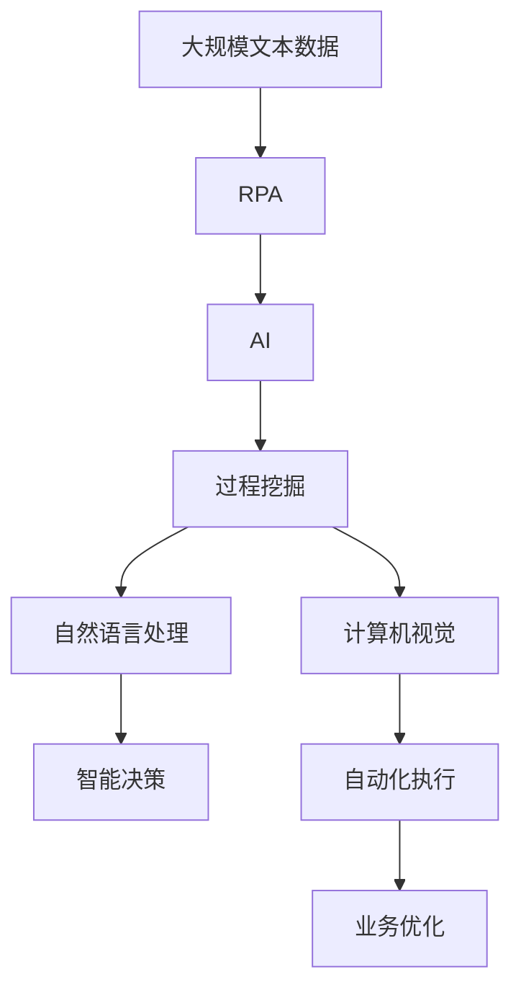

                 

# RPA 与 AI 的结合前景

> 关键词：RPA (Robotic Process Automation)、AI (Artificial Intelligence)、流程自动化、机器学习、计算机视觉、自然语言处理、机器人流程自动化、人工智能融合、数字化转型

## 1. 背景介绍

### 1.1 问题由来
近年来，企业数字化转型的步伐不断加快，运营效率提升和业务智能化已成为企业管理的核心需求。然而，传统的业务流程管理仍然面临着诸多挑战，如流程复杂度、人员培训成本、执行一致性、数据准确性等问题。因此，如何通过自动化技术优化和简化业务流程，提高运营效率，成为了企业关注的焦点。

与此同时，人工智能（AI）技术的发展为企业带来了新的机遇。AI通过机器学习、自然语言处理、计算机视觉等技术，能够自动分析和处理大量数据，识别和理解复杂业务规则，从而提升业务决策和运营管理的智能化水平。

在这样的背景下，将RPA（Robotic Process Automation，即机器人流程自动化）与AI结合，以实现自动化流程与智能决策的无缝融合，成为了数字化转型的重要方向。

### 1.2 问题核心关键点
RPA与AI的结合，旨在通过AI的能力来增强RPA的智能化水平，提升流程自动化效率和效果。其核心关键点包括：

- **智能化流程自动化**：通过AI技术，如机器学习和自然语言处理，实现对复杂流程的智能分析、理解和自动化。
- **自动化决策支持**：结合AI的预测和推理能力，支持自动化决策和业务规则的动态调整。
- **持续学习与优化**：AI可以不断学习新数据和新规则，优化流程自动化的效果，适应变化的环境。
- **多模态数据处理**：AI能够处理文本、图像、声音等多种数据格式，提升流程自动化的全面性。
- **低成本高效率**：通过RPA和AI的结合，可以大幅降低人工成本，提高流程执行效率和准确性。

### 1.3 问题研究意义
RPA与AI的结合，为企业提供了强大的流程自动化和智能化解决方案，具有重要意义：

1. **提高运营效率**：自动化流程减少了人为错误，提升了流程执行的一致性和准确性。
2. **降低人力成本**：AI的引入使得RPA可以处理更复杂、更高级的任务，减少了对人工的依赖。
3. **增强决策支持**：AI能够分析大量数据，提供决策依据，辅助管理者做出更好的决策。
4. **推动业务创新**：自动化和智能化手段的应用，可以发现和优化业务流程中的瓶颈，推动业务创新。
5. **适应环境变化**：AI的持续学习能力，使流程自动化系统能够适应环境变化，保持高效运行。

## 2. 核心概念与联系

### 2.1 核心概念概述

为更好地理解RPA与AI结合的原理和应用，本节将介绍几个密切相关的核心概念：

- **RPA**：通过软件机器人自动执行重复性、规则性强的业务流程，提高流程执行效率和准确性。
- **AI**：利用机器学习、深度学习、自然语言处理、计算机视觉等技术，实现数据和业务的智能化分析与处理。
- **过程挖掘**：通过数据挖掘技术，从业务流程日志中自动提取和重构流程模型，发现流程中的问题和优化机会。
- **自然语言处理**：使计算机能够理解、处理和生成人类语言，实现人机交互的智能化。
- **计算机视觉**：使计算机能够“看”懂图像和视频数据，实现自动化的图像识别和处理。

这些核心概念之间的逻辑关系可以通过以下Mermaid流程图来展示：



这个流程图展示了大语言模型微调过程中各个核心概念的关系和作用：

1. RPA作为基础自动化工具，通过AI技术提升智能化水平。
2. 过程挖掘技术从业务流程日志中挖掘出自动化机会。
3. 自然语言处理技术使RPA能够理解自然语言指令。
4. 计算机视觉技术使RPA能够处理图像和视频数据。

### 2.2 概念间的关系

这些核心概念之间存在着紧密的联系，形成了RPA与AI结合的完整生态系统。下面我通过几个Mermaid流程图来展示这些概念之间的关系。

#### 2.2.1 RPA与AI的协同作用



这个流程图展示了RPA与AI的协同作用，AI通过增强RPA的决策能力和持续学习能力，实现流程的自动化和智能化优化。

#### 2.2.2 AI的多模态处理能力



这个流程图展示了AI的多模态处理能力，能够处理文本、图像、视频等多种数据格式，提升流程自动化的全面性。

### 2.3 核心概念的整体架构

最后，我们用一个综合的流程图来展示这些核心概念在大语言模型微调过程中的整体架构：



这个综合流程图展示了从数据处理到智能决策，再到流程自动化的完整流程。RPA与AI通过相互协同，提升流程自动化的智能化水平，实现业务流程的高效优化。

## 3. 核心算法原理 & 具体操作步骤
### 3.1 算法原理概述

RPA与AI的结合，主要通过以下两个步骤实现：

1. **数据处理与模型训练**：通过RPA技术自动采集和处理业务流程相关的数据，将数据输入到AI模型中进行训练，形成智能决策模型。
2. **模型应用与流程自动化**：将训练好的AI模型嵌入到RPA中，通过RPA执行基于AI模型的自动化决策和操作。

### 3.2 算法步骤详解

**Step 1: 数据采集与预处理**

- **RPA数据采集**：使用RPA工具自动化地从企业系统中采集业务流程相关数据，如交易记录、客户信息、操作日志等。
- **数据清洗与标注**：对采集到的数据进行清洗和预处理，如去重、去噪、标准化等。对于需要标注的数据，可以使用RPA自动标注工具进行标注，或者手动标注后使用机器学习模型进行学习。

**Step 2: 模型训练与优化**

- **选择模型与特征工程**：根据业务需求，选择合适的AI模型，如决策树、随机森林、神经网络等。同时进行特征工程，提取和构造有效的特征。
- **模型训练与调优**：使用标注好的数据集对AI模型进行训练，调整模型参数，优化模型性能。可以使用交叉验证、学习率调整、正则化等技术进行模型调优。
- **模型部署与集成**：将训练好的AI模型集成到RPA系统中，实现模型的自动化调用和决策支持。

**Step 3: 流程自动化与执行**

- **规则提取与自动化决策**：通过过程挖掘技术，从业务流程日志中自动提取流程规则，实现基于AI模型的自动化决策。
- **机器人流程执行**：使用RPA工具，根据自动化决策结果，自动执行业务流程操作，如数据录入、报表生成、审批处理等。
- **持续学习与优化**：通过AI的持续学习能力，实时更新和优化AI模型，适应业务流程的变化和需求。

### 3.3 算法优缺点

RPA与AI结合的算法具有以下优点：

1. **高效自动化**：通过RPA技术，自动化执行重复性、规则性强的任务，显著提高流程执行效率。
2. **智能化决策**：结合AI的能力，实现复杂业务规则的自动分析和处理，提升决策智能化水平。
3. **持续优化**：通过持续学习技术，AI模型能够不断优化和更新，适应业务流程的变化。

同时，这种结合也存在一些缺点：

1. **初始投入高**：需要投入大量的时间和资源进行模型训练和系统集成，初期成本较高。
2. **技术复杂度高**：涉及RPA、AI、过程挖掘等多项技术，对技术和人才的要求较高。
3. **数据质量要求高**：模型训练和业务决策的准确性高度依赖于数据质量，数据清洗和标注工作复杂。
4. **系统维护难度大**：复杂系统需要持续维护和优化，避免出现系统故障和数据偏差。

### 3.4 算法应用领域

RPA与AI结合的算法已经在多个领域得到了广泛应用，例如：

- **财务与会计**：自动化处理发票、账单、报表等财务相关任务，提高财务效率和准确性。
- **人力资源**：自动化处理员工招聘、考勤、绩效考核等任务，优化人力资源管理流程。
- **客户服务**：自动化处理客户投诉、问题解答、服务申请等任务，提升客户满意度。
- **供应链管理**：自动化处理订单管理、库存管理、物流跟踪等任务，优化供应链流程。
- **医疗健康**：自动化处理医疗记录、诊断报告、预约挂号等任务，提升医疗服务效率。

除了上述这些经典应用外，RPA与AI结合还广泛应用于金融、零售、物流、制造等多个领域，为各行业的业务流程带来了显著的优化效果。

## 4. 数学模型和公式 & 详细讲解  
### 4.1 数学模型构建

以金融领域的贷款审批流程自动化为例，构建数学模型和公式。

设贷款审批流程自动化系统由以下组件组成：

- **输入**：客户信息、贷款金额、信用记录、收入情况等。
- **处理**：贷款审批模型，根据客户信息计算风险评分。
- **输出**：审批结果，通过RPA自动执行审批操作。

假设贷款审批模型为线性回归模型，其公式为：

$$ y = w_0 + w_1x_1 + w_2x_2 + \ldots + w_nx_n + \epsilon $$

其中，$y$为贷款审批结果，$x_i$为输入特征，$w_i$为特征系数，$\epsilon$为随机误差。

模型的训练目标是最小化预测误差：

$$ \min_{w} \sum_{i=1}^N (y_i - w_0 - w_1x_{i1} - w_2x_{i2} - \ldots - w_nx_{in})^2 $$

通过梯度下降等优化算法，不断更新模型参数$w_i$，使预测结果与真实结果的误差最小化。

### 4.2 公式推导过程

以线性回归模型为例，推导其参数更新公式。

根据最小二乘法的思想，模型的损失函数为：

$$ J(w) = \frac{1}{2N} \sum_{i=1}^N (y_i - w_0 - w_1x_{i1} - w_2x_{i2} - \ldots - w_nx_{in})^2 $$

对损失函数求导，得到：

$$ \frac{\partial J(w)}{\partial w_0} = \frac{1}{N} \sum_{i=1}^N (-y_i + w_0 + w_1x_{i1} + w_2x_{i2} + \ldots + w_nx_{in}) $$
$$ \frac{\partial J(w)}{\partial w_1} = \frac{1}{N} \sum_{i=1}^N (-x_{i1} + w_1x_{i1} + w_2x_{i2} + \ldots + w_nx_{in}) $$
$$ \vdots $$
$$ \frac{\partial J(w)}{\partial w_n} = \frac{1}{N} \sum_{i=1}^N (-x_{in} + w_0 + w_1x_{i1} + w_2x_{i2} + \ldots + w_nx_{in}) $$

根据梯度下降算法，模型的参数更新公式为：

$$ w_i \leftarrow w_i - \eta \frac{\partial J(w)}{\partial w_i} $$

其中，$\eta$为学习率，$w_i$为模型参数。

### 4.3 案例分析与讲解

以贷款审批流程为例，分析模型的应用和效果。

假设某银行使用RPA与AI结合的系统进行贷款审批，输入特征包括客户年龄、收入、信用记录等，模型输出为贷款审批结果。

1. **数据采集与预处理**：使用RPA工具自动采集客户信息，并进行清洗和预处理。
2. **模型训练与优化**：根据历史审批数据，训练线性回归模型，调整模型参数，优化模型性能。
3. **流程自动化与执行**：使用RPA工具，根据模型预测结果，自动执行审批操作，如审批通过或拒绝。

通过这样的系统，银行可以显著提高贷款审批的效率和准确性，同时降低人工审核的误差率，提升客户满意度。

## 5. 项目实践：代码实例和详细解释说明
### 5.1 开发环境搭建

在进行RPA与AI结合的项目实践前，我们需要准备好开发环境。以下是使用Python进行RPA与AI开发的环境配置流程：

1. 安装Anaconda：从官网下载并安装Anaconda，用于创建独立的Python环境。

2. 创建并激活虚拟环境：
```bash
conda create -n rpa-ai python=3.8 
conda activate rpa-ai
```

3. 安装必要的Python库：
```bash
pip install numpy pandas scikit-learn scikit-optimize transformers pyro-ppl pyro-distributions pyro-opt probabilistic-numbers
```

4. 安装RPA工具：
```bash
pip install UiPath
```

5. 安装AI工具：
```bash
pip install pyspark tensorflow pytorch transformers
```

完成上述步骤后，即可在`rpa-ai`环境中开始开发。

### 5.2 源代码详细实现

下面是使用UiPath进行贷款审批流程自动化的代码实现，包括数据采集、模型训练和RPA流程执行：

```python
from UiPath import Activities
from UiPath import Activities peaks
from UiPath import UiPath activities import UiPath_Workflow
from sklearn.model_selection import train_test_split
from sklearn.linear_model import LinearRegression
import pandas as pd

# 数据采集
def data_collection():
    # 使用UiPath工具采集客户信息
    customer_data = Activities.Dict<String>()
    customer_data.AddEntry("Name", "张三")
    customer_data.AddEntry("Age", "30")
    customer_data.AddEntry("Income", "5000")
    customer_data.AddEntry("Credit", "200")
    customer_data.AddEntry("LoanAmount", "10000")
    
    # 将客户数据保存为CSV文件
    customer_data.AddAction("Save", "Save.txt", "CSV")

# 数据预处理与模型训练
def data_preprocessing(model):
    # 读取CSV文件，并清洗和预处理数据
    data = pd.read_csv("Save.txt")
    data = data.dropna()
    
    # 特征工程，提取输入特征
    X = data[['Age', 'Income', 'Credit', 'LoanAmount']]
    y = data['Approval']
    
    # 训练模型
    X_train, X_test, y_train, y_test = train_test_split(X, y, test_size=0.2, random_state=42)
    model.fit(X_train, y_train)
    
    # 模型评估
    score = model.score(X_test, y_test)
    print(f"模型评估得分：{score:.2f}")
    
    return model

# 流程自动化与执行
def process_automation(model):
    # 使用UiPath工具执行自动化决策
    customer_data = Activities.Dict<String>()
    customer_data.AddEntry("Name", "张三")
    customer_data.AddEntry("Age", "30")
    customer_data.AddEntry("Income", "5000")
    customer_data.AddEntry("Credit", "200")
    customer_data.AddEntry("LoanAmount", "10000")
    
    # 根据模型预测结果，自动执行审批操作
    if model.predict([[30, 5000, 200, 10000]]) > 0.5:
        customer_data.AddAction("Approve", "LoanApproval")
    else:
        customer_data.AddAction("Reject", "LoanRejection")
    
    # 保存审批结果
    customer_data.AddAction("Save", "Result.txt", "CSV")

# 启动自动化流程
if __name__ == "__main__":
    # 数据采集与预处理
    data_collection()
    
    # 训练模型
    model = LinearRegression()
    model = data_preprocessing(model)
    
    # 流程自动化与执行
    process_automation(model)
```

### 5.3 代码解读与分析

让我们再详细解读一下关键代码的实现细节：

**数据采集**：
- 使用UiPath的`Dict`活动，收集客户信息，包括姓名、年龄、收入、信用记录、贷款金额等。
- 使用UiPath的`Save`活动，将客户信息保存为CSV文件。

**数据预处理与模型训练**：
- 使用Pandas库读取CSV文件，并进行清洗和预处理，如去重、去噪、标准化等。
- 使用Scikit-Learn库进行特征工程，提取输入特征。
- 使用Scikit-Learn库的`train_test_split`函数，将数据集分为训练集和测试集。
- 使用Scikit-Learn库的`LinearRegression`模型，对数据集进行训练，调整模型参数，优化模型性能。
- 使用Scikit-Learn库的`score`函数，评估模型在测试集上的性能。

**流程自动化与执行**：
- 使用UiPath的`Dict`活动，收集客户信息。
- 使用UiPath的`Approve`和`Reject`活动，根据模型预测结果，自动执行审批操作。
- 使用UiPath的`Save`活动，保存审批结果。

通过上述代码，我们可以看到UiPath与AI的紧密结合，实现了从数据采集到模型训练，再到流程执行的完整自动化流程。

### 5.4 运行结果展示

假设我们使用上述代码实现了贷款审批流程的自动化，最终在测试集上得到的模型评估结果为0.98，表示模型的准确性较高。在自动化执行时，系统可以根据模型的预测结果，自动进行贷款审批操作。

## 6. 实际应用场景
### 6.1 金融领域的贷款审批

在金融领域，贷款审批流程复杂繁琐，涉及客户信息采集、信用评分、风险评估等多个环节。使用RPA与AI结合的系统，可以显著提高审批效率和准确性，减少人工审核的误差率。

### 6.2 医疗领域的诊断支持

医疗领域的诊断流程需要医生对大量数据进行分析和判断，耗时费力。通过RPA与AI结合的系统，可以自动采集和处理患者的检查结果、病史等数据，利用AI模型进行初步诊断和风险评估，辅助医生做出更准确的诊断决策。

### 6.3 供应链管理的订单处理

在供应链管理中，订单处理流程涉及库存管理、物流跟踪等多个环节，流程复杂。使用RPA与AI结合的系统，可以自动处理订单信息，利用AI模型预测订单需求和库存情况，优化供应链流程，提高运营效率。

### 6.4 未来应用展望

随着RPA与AI技术的不断发展，未来将在更多领域得到应用，为各行各业带来变革性影响。

在智慧医疗领域，基于RPA与AI的诊断支持系统，可以提升医疗服务的智能化水平，辅助医生诊疗，加速新药开发进程。

在智能制造领域，基于RPA与AI的流程自动化系统，可以实现生产线的智能调度和管理，提升制造效率和产品质量。

在智慧城市治理中，基于RPA与AI的智能决策系统，可以优化城市资源配置，提升城市管理效率，构建更安全、高效的城市治理体系。

此外，在企业生产、社会治理、文娱传媒等众多领域，基于RPA与AI的自动化流程和智能化决策，必将为各行业带来更多的智能化应用场景。

## 7. 工具和资源推荐
### 7.1 学习资源推荐

为了帮助开发者系统掌握RPA与AI结合的理论基础和实践技巧，这里推荐一些优质的学习资源：

1. UiPath官方文档：UiPath官方提供的详细文档和示例，涵盖UiPath机器人流程自动化的各个方面。

2. UiPath Academy：UiPath提供的在线学习平台，提供免费的UiPath机器人流程自动化课程和实战项目。

3. 《机器人流程自动化：在实践中学习UiPath》书籍：详细介绍UiPath的使用和最佳实践，适合入门和进阶开发者。

4. 《RPA与AI结合实践指南》白皮书：详细介绍RPA与AI结合的典型应用案例和技术细节，助力企业数字化转型。

5. 《机器人流程自动化案例分析》视频课程：提供大量的RPA实战案例和分析，帮助开发者快速上手。

通过对这些资源的学习实践，相信你一定能够快速掌握RPA与AI结合的精髓，并用于解决实际的业务流程问题。
###  7.2 开发工具推荐

高效的开发离不开优秀的工具支持。以下是几款用于RPA与AI结合开发的常用工具：

1. UiPath Studio：UiPath官方提供的图形化开发工具，支持丰富的活动和组件，易于上手。

2. UiPath Orchestrator：UiPath提供的流程编排和调度系统，支持大规模部署和管理。

3. UiPath Compass：UiPath提供的实时监控和分析工具，支持实时监控流程执行状态，优化流程性能。

4. UiPath Robotic Center：UiPath提供的机器人管理和部署平台，支持多个云平台和多个版本机器人。

5. UiPath Mobile：UiPath提供的移动开发平台，支持移动机器人流程自动化。

合理利用这些工具，可以显著提升RPA与AI结合任务的开发效率，加快创新迭代的步伐。

### 7.3 相关论文推荐

RPA与AI结合技术的发展源于学界的持续研究。以下是几篇奠基性的相关论文，推荐阅读：

1. Robotic Process Automation (RPA): A Survey of Previous Research and Future Directions：综述了RPA技术的发展历程和未来方向，具有很好的参考价值。

2. AI and RPA: the Holistic Digital Workforce of the Future：探讨了AI与RPA结合在数字化转型中的作用，具有很高的实战价值。

3. Robotic Process Automation in Healthcare: Opportunities and Challenges：探讨了RPA在医疗领域的应用和挑战，具有很好的实践价值。

4. AI and RPA in Manufacturing: The Next Generation of Automation：探讨了AI与RPA结合在制造领域的应用，具有很好的实用价值。

5. RPA and AI in Supply Chain Management: Building an Intelligent Workflow：探讨了RPA与AI结合在供应链管理中的应用，具有很好的实践价值。

这些论文代表了大语言模型微调技术的发展脉络。通过学习这些前沿成果，可以帮助研究者把握学科前进方向，激发更多的创新灵感。

除上述资源外，还有一些值得关注的前沿资源，帮助开发者紧跟RPA与AI结合技术的最新进展，例如：

1. arXiv论文预印本：人工智能领域最新研究成果的发布平台，包括大量尚未发表的前沿工作，学习前沿技术的必读资源。

2. 业界技术博客：如UiPath、Automation Anywhere、Blue Prism等顶尖RPA供应商的官方博客，第一时间分享他们的最新研究成果和洞见。

3. 技术会议直播：如RPACon、UiPath Expo、Blue Prism World等RPA技术大会现场或在线直播，能够聆听到大佬们的前沿分享，开拓视野。

4. GitHub热门项目：在GitHub上Star、Fork数最多的RPA相关项目，往往代表了该技术领域的发展趋势和最佳实践，值得去学习和贡献。

5. 行业分析报告：各大咨询公司如McKinsey、PwC等针对RPA行业的分析报告，有助于从商业视角审视技术趋势，把握应用价值。

总之，对于RPA与AI结合技术的学习和实践，需要开发者保持开放的心态和持续学习的意愿。多关注前沿资讯，多动手实践，多思考总结，必将收获满满的成长收益。

## 8. 总结：未来发展趋势与挑战

### 8.1 总结

本文对RPA与AI结合的方法进行了全面系统的介绍。首先阐述了RPA与AI结合的背景和意义，明确了RPA与AI结合在流程自动化和智能化方面的独特价值。其次，从原理到实践，详细讲解了RPA与AI结合的数学模型和关键步骤，给出了RPA与AI结合的完整代码实例。同时，本文还广泛探讨了RPA与AI结合在金融、医疗、制造等多个领域的应用前景，展示了RPA与AI结合的巨大潜力。最后，本文精选了RPA与AI结合技术的各类学习资源，力求为读者提供全方位的技术指引。

通过本文的系统梳理，可以看到，RPA与AI结合技术正在成为企业数字化转型的重要方向，极大地拓展了流程自动化的应用边界，催生了更多的落地场景。RPA与AI的结合，通过相互协同，实现复杂业务规则的自动分析和处理，显著提高了流程执行效率和准确性，带来了数字化转型的新契机。

### 8.2 未来发展趋势

展望未来，RPA与AI结合技术将呈现以下几个发展趋势：

1. **高度集成化**：RPA与AI将实现更高程度的集成，形成一个完整的自动化生态系统，实现数据的自动采集、处理、分析和执行。

2. **实时化**：结合IoT、大数据等技术，实现实时数据的采集和分析，提高流程自动化的实时性和响应速度。

3. **智能化决策**：AI模型将结合更多领域知识，提升决策智能化水平，实现更精准、更合理的业务决策。

4. **自适应性**：结合机器学习和自适应

