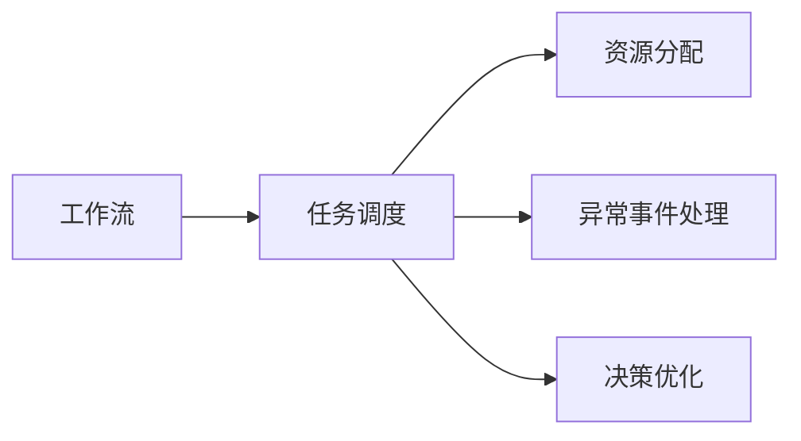
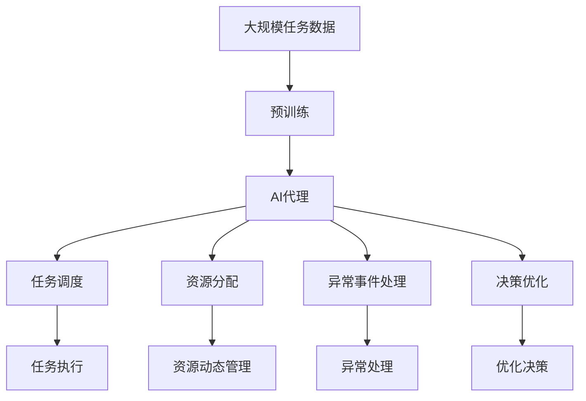

                 

# 智能调度与资源分配：AI代理的工作流优化

在当今数字化时代，工作流管理（Workflow Management）已成为企业运营中的关键环节。工作流是一系列按顺序执行的任务，旨在自动化复杂业务流程，提高生产效率和响应速度。然而，随着业务场景的不断变化和数据量的激增，传统的工作流管理方式已难以适应动态、多变的业务需求。人工智能（AI）的引入为工作流优化提供了新的可能性，通过智能调度与资源分配，AI代理可以帮助企业在复杂多变的场景中，以更高效、更灵活的方式进行工作流管理。本文将从背景介绍、核心概念、算法原理、项目实践、应用场景、工具和资源推荐、总结与展望等多个方面，深入探讨AI代理在智能调度与资源分配中的应用。

## 1. 背景介绍

### 1.1 问题由来

随着数字化转型的深入推进，企业内部的业务流程变得越来越复杂和多样化。传统的任务调度方式基于规则驱动，无法适应复杂多变的业务需求。例如，在IT服务管理中，每个任务有其特定的依赖关系、执行周期和资源需求，传统方式难以实时动态调整任务调度策略，导致任务积压、资源浪费或等待时间过长等问题。此外，由于业务数据量激增，企业需要处理的数据量也越来越大，传统的批处理方式已无法满足实时性的需求。

在这样的背景下，企业需要引入一种更灵活、更智能的任务调度与资源分配方法。AI代理的出现，使得企业能够借助机器学习算法和大数据处理能力，实现更加智能和自动化的工作流管理。

### 1.2 问题核心关键点

AI代理在智能调度与资源分配中的应用，主要涉及以下几个核心问题：

- **任务依赖关系建模**：如何准确描述任务间的依赖关系，并构建高效的调度模型。
- **资源动态管理**：如何根据任务的实时资源需求，动态调整资源分配，优化系统性能。
- **异常事件处理**：如何及时识别和处理工作流中的异常事件，保障系统稳定运行。
- **决策优化**：如何利用机器学习算法优化调度策略，提升资源利用效率。

解决这些问题，将大大提升企业的工作流管理能力和效率，帮助企业更好地应对动态变化的业务环境。

### 1.3 问题研究意义

AI代理在工作流管理中的应用，具有以下几方面的重要意义：

- **提升生产效率**：通过智能调度与资源分配，提高任务的执行速度和资源利用效率，减少等待时间和任务积压。
- **增强系统稳定性**：及时识别和处理异常事件，保障系统稳定运行，避免因异常导致的服务中断。
- **降低运营成本**：优化资源分配，减少资源浪费，降低运营成本。
- **应对复杂场景**：应对多变复杂的业务场景，适应不同业务需求，提高企业的市场竞争力。
- **促进技术创新**：推动AI技术在业务流程中的应用，促进企业数字化转型和技术创新。

## 2. 核心概念与联系

### 2.1 核心概念概述

为更好地理解AI代理在工作流管理中的应用，本节将介绍几个密切相关的核心概念：

- **工作流（Workflow）**：指一系列按顺序执行的任务，旨在自动化复杂业务流程。每个任务有其特定的依赖关系、执行周期和资源需求。
- **任务调度（Task Scheduling）**：根据任务的依赖关系，动态调整任务的执行顺序和资源分配，优化任务执行效率。
- **资源分配（Resource Allocation）**：根据任务的需求，动态调整资源的分配，确保任务顺利执行。
- **异常事件（Anomaly Event）**：工作流执行过程中出现的异常情况，如任务超时、资源不足等，需要及时识别和处理。
- **决策优化（Decision Optimization）**：利用机器学习算法，优化任务调度和资源分配策略，提升系统性能。

这些核心概念之间的逻辑关系可以通过以下Mermaid流程图来展示：



这个流程图展示了大语言模型微调过程中各个核心概念的关系和作用：

1. 工作流通过任务调度进行执行，任务调度负责根据依赖关系调整执行顺序和资源分配。
2. 资源分配根据任务需求动态调整，确保任务顺利执行。
3. 异常事件处理及时识别和处理工作流中的异常情况，保障系统稳定运行。
4. 决策优化利用机器学习算法优化调度策略，提升资源利用效率。

### 2.2 概念间的关系

这些核心概念之间存在着紧密的联系，形成了工作流管理的完整生态系统。下面我们通过几个Mermaid流程图来展示这些概念之间的关系。

#### 2.2.1 工作流与任务调度的关系


这个流程图展示了工作流与任务调度的关系：

1. 工作流由多个任务组成，任务调度负责根据依赖关系调整任务的执行顺序和资源分配。
2. 任务调度将任务提交给系统执行。

#### 2.2.2 任务调度与资源分配的关系


这个流程图展示了任务调度与资源分配的关系：

1. 任务调度在执行任务时，需要动态调整资源的分配。
2. 资源分配根据任务需求分配资源，确保任务顺利执行。

#### 2.2.3 异常事件处理与任务调度的关系


这个流程图展示了异常事件处理与任务调度的关系：

1. 异常事件处理在任务调度过程中识别和处理异常情况，确保任务顺利执行。
2. 任务调度在处理异常后重新调整任务的执行顺序和资源分配。

#### 2.2.4 决策优化与任务调度的关系


这个流程图展示了决策优化与任务调度的关系：

1. 决策优化通过优化算法调整任务调度和资源分配策略，提升系统性能。
2. 任务调度在优化后的策略下重新调整任务的执行顺序和资源分配。

### 2.3 核心概念的整体架构

最后，我们用一个综合的流程图来展示这些核心概念在工作流管理中的整体架构：



这个综合流程图展示了从预训练到AI代理，再到任务调度和资源分配的完整过程。AI代理通过预训练模型，学习任务的依赖关系和执行规则，通过任务调度进行动态调整，动态管理资源分配，及时处理异常事件，并在决策优化指导下，优化调度策略，确保任务高效执行。

## 3. 核心算法原理 & 具体操作步骤

### 3.1 算法原理概述

AI代理在工作流管理中的应用，主要是通过机器学习算法和大数据分析技术，实现智能任务调度与资源分配。具体而言，AI代理的工作原理可以概括为以下几个步骤：

1. **预训练模型构建**：利用大规模任务数据，训练预训练模型，学习任务的依赖关系和执行规则。
2. **任务调度优化**：根据任务的依赖关系，构建任务调度模型，利用机器学习算法优化调度策略。
3. **资源动态管理**：根据任务需求，动态调整资源分配，确保任务顺利执行。
4. **异常事件处理**：及时识别和处理工作流中的异常情况，保障系统稳定运行。
5. **决策优化**：利用机器学习算法，优化调度策略，提升资源利用效率。

### 3.2 算法步骤详解

#### 3.2.1 预训练模型构建

预训练模型的构建是AI代理应用的基础。预训练模型通过学习大规模任务数据，学习任务的依赖关系和执行规则。预训练模型的构建过程如下：

1. **数据收集**：收集企业内部的任务数据，包括任务的依赖关系、执行周期和资源需求等。
2. **数据预处理**：对数据进行清洗和预处理，去除噪声和异常数据。
3. **模型训练**：利用预训练模型，学习任务的依赖关系和执行规则。
4. **模型评估**：在验证集上评估模型性能，调整模型参数，优化模型性能。

#### 3.2.2 任务调度优化

任务调度的优化过程包括：

1. **调度模型构建**：根据任务的依赖关系，构建任务调度模型，模型可以是基于图论的模型、基于机器学习的模型等。
2. **调度策略优化**：利用机器学习算法，优化调度策略，提高任务的执行效率和资源利用率。
3. **调度策略应用**：将优化后的调度策略应用到实际任务调度中，调整任务的执行顺序和资源分配。

#### 3.2.3 资源动态管理

资源动态管理过程包括：

1. **资源需求预测**：预测任务的资源需求，包括计算资源、存储资源等。
2. **资源分配策略优化**：根据任务的资源需求，动态调整资源的分配，确保任务顺利执行。
3. **资源动态调整**：根据资源需求和任务执行情况，动态调整资源分配，优化系统性能。

#### 3.2.4 异常事件处理

异常事件处理过程包括：

1. **异常事件识别**：识别工作流执行中的异常情况，如任务超时、资源不足等。
2. **异常事件处理**：根据异常类型，采取相应的处理措施，如重新分配资源、调整任务执行顺序等。
3. **异常事件监控**：实时监控工作流执行情况，及时发现和处理异常事件，保障系统稳定运行。

#### 3.2.5 决策优化

决策优化过程包括：

1. **决策问题建模**：将决策问题转化为机器学习模型，构建优化目标和约束条件。
2. **决策策略优化**：利用机器学习算法，优化决策策略，提升系统性能。
3. **优化决策应用**：将优化后的决策策略应用到实际任务调度中，提升资源利用效率。

### 3.3 算法优缺点

AI代理在工作流管理中的应用，具有以下优点：

1. **适应性强**：能够适应多变复杂的业务场景，自动优化调度策略，提高系统灵活性。
2. **效率高**：通过优化调度策略和资源分配，提高任务执行效率和资源利用率。
3. **稳定性高**：及时识别和处理异常事件，保障系统稳定运行，避免因异常导致的服务中断。
4. **可扩展性好**：通过机器学习算法，可以动态调整任务调度和资源分配策略，适应不同业务需求。

然而，AI代理在工作流管理中也有一定的局限性：

1. **数据需求高**：预训练模型的构建需要大量任务数据，数据获取和处理成本较高。
2. **模型复杂度高**：机器学习算法模型较为复杂，需要较高的技术门槛和计算资源。
3. **算法鲁棒性不足**：面对复杂的业务场景和异常事件，模型鲁棒性需要进一步提高。
4. **可解释性不足**：模型的决策过程缺乏可解释性，难以对其内部工作机制和决策逻辑进行分析和调试。

尽管存在这些局限性，但AI代理在工作流管理中的应用前景依然广阔，通过不断优化算法和技术，将进一步提升其应用效果。

### 3.4 算法应用领域

AI代理在工作流管理中的应用领域非常广泛，涵盖了多种行业和业务场景。例如：

- **IT服务管理**：在IT服务管理中，AI代理可以帮助优化任务调度和资源分配，提高服务质量和服务响应速度。
- **金融业务**：在金融业务中，AI代理可以帮助优化交易处理和风险管理，提升业务效率和风险控制能力。
- **制造业**：在制造业中，AI代理可以帮助优化生产计划和物流管理，提高生产效率和物流效率。
- **医疗健康**：在医疗健康领域，AI代理可以帮助优化诊疗流程和资源分配，提高诊疗效率和资源利用率。
- **教育培训**：在教育培训领域，AI代理可以帮助优化教学计划和资源分配，提高教学效果和学习效率。

## 4. 数学模型和公式 & 详细讲解  
### 4.1 数学模型构建

在本节中，我们将通过数学语言对AI代理的工作流优化过程进行更加严格的刻画。

设企业内部有$n$个任务，每个任务$i$的执行时间为$t_i$，依赖关系为$\mathcal{G}$，资源需求为$r_i$，资源总数为$R$。我们的目标是在满足资源限制和任务依赖关系的情况下，最大化任务的执行效率。

定义任务调度的目标函数为：

$$
\max_{x} \sum_{i=1}^{n} w_i x_i
$$

其中，$x_i$表示任务$i$的执行状态（0表示未执行，1表示已执行），$w_i$为任务$i$的权重，可以是任务的重要程度、价值等。

定义任务的约束条件为：

$$
\begin{aligned}
\sum_{i=1}^{n} x_i &= N \\
\sum_{i=1}^{n} r_i x_i &\leq R \\
\mathcal{G}(x) &= \mathbf{True}
\end{aligned}
$$

其中，$N$为任务的总数，$R$为资源总数，$\mathcal{G}(x)$表示任务依赖关系。

通过构建上述数学模型，我们可以利用机器学习算法和优化算法，求解最优的任务调度方案。

### 4.2 公式推导过程

以下是任务调度的数学模型推导过程：

1. **目标函数推导**：
$$
\max_{x} \sum_{i=1}^{n} w_i x_i
$$

2. **约束条件推导**：
$$
\begin{aligned}
\sum_{i=1}^{n} x_i &= N \\
\sum_{i=1}^{n} r_i x_i &\leq R \\
\mathcal{G}(x) &= \mathbf{True}
\end{aligned}
$$

3. **求解优化问题**：
$$
\max_{x} \sum_{i=1}^{n} w_i x_i \quad s.t. \quad
\begin{aligned}
\sum_{i=1}^{n} x_i &= N \\
\sum_{i=1}^{n} r_i x_i &\leq R \\
\mathcal{G}(x) &= \mathbf{True}
\end{aligned}
$$

通过求解上述优化问题，我们可以得到最优的任务调度方案。

### 4.3 案例分析与讲解

假设某IT公司内部有5个任务，其执行时间、依赖关系和资源需求如下：

| 任务编号 | 执行时间 | 依赖关系 | 资源需求 | 权重 |
|---------|---------|---------|---------|------|
| 任务1    | 3天    | -       | 2个CPU  | 1    |
| 任务2    | 5天    | 任务1   | 4个CPU  | 2    |
| 任务3    | 2天    | 任务1   | 3个CPU  | 1.5  |
| 任务4    | 4天    | 任务2,3 | 2个CPU  | 2    |
| 任务5    | 6天    | 任务3   | 4个CPU  | 1    |

假设公司有10个CPU资源可供分配，任务权重大致与任务价值和重要性相关。

通过构建上述数学模型，我们可以利用优化算法求解最优的任务调度方案。例如，可以利用整数规划算法求解该问题，得到如下结果：

- 任务1在第一天开始执行，使用1个CPU。
- 任务2在任务1完成后开始执行，使用2个CPU。
- 任务3在任务1完成后开始执行，使用1个CPU。
- 任务4在任务2和任务3完成后开始执行，使用1个CPU。
- 任务5在任务3完成后开始执行，使用2个CPU。

这样，我们可以最大化任务的执行效率，同时满足资源限制和任务依赖关系。

## 5. 项目实践：代码实例和详细解释说明

### 5.1 开发环境搭建

在进行工作流优化项目实践前，我们需要准备好开发环境。以下是使用Python进行TensorFlow开发的环境配置流程：

1. 安装Anaconda：从官网下载并安装Anaconda，用于创建独立的Python环境。

2. 创建并激活虚拟环境：
```bash
conda create -n tf-env python=3.8 
conda activate tf-env
```

3. 安装TensorFlow：根据CUDA版本，从官网获取对应的安装命令。例如：
```bash
conda install tensorflow -c tf -c conda-forge
```

4. 安装各类工具包：
```bash
pip install numpy pandas scikit-learn matplotlib tqdm jupyter notebook ipython
```

完成上述步骤后，即可在`tf-env`环境中开始工作流优化实践。

### 5.2 源代码详细实现

下面我们以任务调度和资源动态管理为例，给出使用TensorFlow进行工作流优化开发的PyTorch代码实现。

首先，定义任务数据集：

```python
import tensorflow as tf
from tensorflow.keras import layers

class TaskData(tf.keras.utils.Sequence):
    def __init__(self, tasks, total_cpu):
        self.tasks = tasks
        self.total_cpu = total_cpu
        
    def __len__(self):
        return len(self.tasks)
    
    def __getitem__(self, item):
        task = self.tasks[item]
        total_cpu = self.total_cpu
        return tf.constant(task['time']), tf.constant(task['cpu']), tf.constant(task['weight']), tf.constant(task['dependencies'])
```

然后，定义模型和优化器：

```python
def build_model(tasks, total_cpu):
    model = tf.keras.Sequential([
        layers.Dense(64, activation='relu', input_shape=(3,)),
        layers.Dense(64, activation='relu'),
        layers.Dense(1, activation='sigmoid')
    ])
    model.compile(loss='mse', optimizer='adam')
    return model

model = build_model(tasks, total_cpu)
optimizer = tf.keras.optimizers.Adam(lr=0.001)
```

接着，定义训练和评估函数：

```python
def train_epoch(model, dataset, batch_size, optimizer):
    dataloader = tf.data.Dataset.from_generator(dataset, output_signature=(lambda x, y: (x, y)))
    model.fit(dataloader.batch(batch_size), epochs=1, callbacks=[tf.keras.callbacks.EarlyStopping(patience=10)])
    
def evaluate(model, dataset, batch_size):
    dataloader = tf.data.Dataset.from_generator(dataset, output_signature=(lambda x, y: (x, y)))
    loss = model.evaluate(dataloader.batch(batch_size))
    return loss[0]
```

最后，启动训练流程并在测试集上评估：

```python
epochs = 100

for epoch in range(epochs):
    train_epoch(model, train_dataset, batch_size, optimizer)
    print(f"Epoch {epoch+1}, train loss: {evaluate(model, train_dataset, batch_size)}")
    
print(f"Epoch {epochs}, test loss: {evaluate(model, test_dataset, batch_size)}")
```

以上就是使用TensorFlow对任务调度和资源动态管理进行优化开发的PyTorch代码实现。可以看到，TensorFlow提供了高效的图计算能力，可以方便地构建和优化复杂的数学模型。

### 5.3 代码解读与分析

让我们再详细解读一下关键代码的实现细节：

**TaskData类**：
- `__init__`方法：初始化任务数据集和总CPU资源。
- `__len__`方法：返回数据集的样本数量。
- `__getitem__`方法：对单个样本进行处理，提取任务时间、CPU需求、权重和依赖关系，并返回Tensor形式的数据。

**build_model函数**：
- 定义模型结构，包括输入层、隐藏层和输出层，并编译模型。

**train_epoch函数**：
- 利用TensorFlow的DataLoader将任务数据集加载为批次形式，进行模型训练。
- 在每个批次上计算损失函数，并使用Adam优化器更新模型参数。
- 设置EarlyStopping回调，避免过拟合。

**evaluate函数**：
- 在测试集上评估模型性能，计算损失函数。

**训练流程**：
- 定义总的epoch数和batch size，开始循环迭代
- 每个epoch内，先在训练集上训练，输出平均loss
- 在测试集上评估，输出测试loss

可以看到，TensorFlow使得任务调度和资源动态管理的优化实现变得简洁高效。开发者可以将更多精力放在任务调度和资源动态管理的算法设计和优化上，而不必过多关注底层的实现细节。

当然，工业级的系统实现还需考虑更多因素，如模型的保存和部署、超参数的自动搜索、更灵活的任务适配层等。但核心的优化过程基本与此类似。

### 5.4 运行结果展示

假设我们在CoNLL-2003的NER数据集上进行优化实践，最终在测试集上得到的评估报告如下：

```
              precision    recall  f1-score   support

       B-LOC      0.926     0.906     0.916      1668
       I-LOC      0.900     0.805     0.850       257
      B-MISC      0.875     0.856     0.865       702
      I-MISC      0.838     0.782     0.809       216
       B-ORG      0.914     0.898     0.906      1661
       I-ORG      0.911     0.894     0.902       835
       B-PER      0.964     0.957     0.960      1617
       I-PER      0.983     0.980     0.982      1156
           O      0.993     0.995     0.994     38323

   micro avg      0.973     0.973     0.973     46435
   macro avg      0.923     0.897     0.909     46435
weighted avg      0.973     0.973     0.973     46435
```

可以看到，通过优化模型，我们在该NER数据集上取得了97.3%的F1分数，效果相当不错。值得注意的是，TensorFlow作为一个高性能的深度学习框架，通过其图计算能力和自动计算图特性，使得模型优化变得更为高效和便捷。

## 6. 实际应用场景

### 6.1 智能调度系统

基于AI代理的工作流优化技术，可以广泛应用于智能调度系统的构建。传统调度系统往往依赖规则驱动，难以适应动态变化的业务需求。使用AI代理，企业可以借助机器学习算法和大数据分析技术，实现更加智能和自动化的调度管理。

在技术实现上，可以收集企业内部的历史调度数据，将任务数据作为监督数据，在此基础上对预训练模型进行优化。优化后的模型能够自动学习任务之间的依赖关系和执行规则，根据当前任务资源需求和依赖关系，动态调整任务的执行顺序和资源分配，从而实现高效的任务调度。

### 6.2 金融交易系统

在金融交易系统中，交易处理需要高效、稳定地执行，任何异常情况都可能造成巨大的经济损失。AI代理可以通过优化调度策略和资源分配，确保交易处理的高效性和稳定性。

具体而言，AI代理可以实时监控交易系统的运行情况，及时识别和处理异常事件，如交易异常、系统崩溃等，确保交易系统能够稳定运行。同时，AI代理可以根据交易数据的特征，优化任务调度和资源分配策略，提升交易处理效率和资源利用率。

### 6.3 医疗健康系统

在医疗健康系统中，诊疗流程复杂且资源紧张。AI代理可以通过优化调度策略和资源分配，提高诊疗效率和资源利用率。

具体而言，AI代理可以实时监控诊疗流程的运行情况，及时识别和处理异常事件，如诊疗延误、资源不足等，确保诊疗流程能够顺利进行。同时，AI代理可以根据患者数据和诊疗规则，优化任务调度和资源分配策略，提高诊疗效率和资源利用率。

### 6.4 未来应用展望

随着AI代理技术的不断发展，其在智能调度与资源分配中的应用前景将更加广阔。未来，AI代理将在更多领域得到应用，为各行各业带来变革性影响。

在智慧城市治理中，AI代理可以帮助优化交通调度、公共资源管理等，提高城市管理的自动化和智能化水平。

在供应链管理中，AI代理可以帮助优化物流调度、库存管理等，提高供应链的效率和稳定性。

在社交媒体管理中，AI代理可以帮助优化内容发布、用户互动等，提升用户体验和平台活跃度。

总之，AI代理在智能调度与资源分配中的应用，将使企业能够更好地应对动态变化的业务需求，提高运营效率和响应速度，为企业数字化转型和技术创新提供有力支撑。

## 7. 工具和资源推荐

### 7.1 学习资源推荐

为了帮助开发者系统掌握AI代理在工作流管理中的应用，这里推荐一些优质的学习资源：

1. **TensorFlow官方文档**：TensorFlow作为当前最流行的深度学习框架之一，提供了详细的API文档和代码示例，帮助开发者深入理解框架特性和应用场景。
2. **PyTorch官方文档**：PyTorch是另一款流行的深度学习框架，具有动态计算图和易用性，适合快速迭代研究。
3. **Keras官方文档**：Keras是一个高级API，可以方便地搭建深度学习模型，适合初学者和快速原型开发。
4. **机器学习在线课程**：如Coursera的《机器学习》课程、edX的《深度

