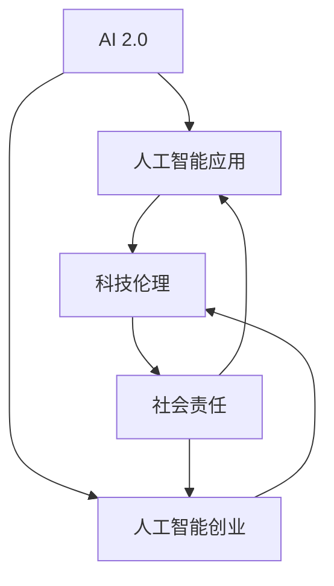

                 

# 李开复：AI 2.0 时代的科技价值

> 关键词：人工智能, AI 2.0, 科技伦理, 人工智能应用, 人工智能创业

## 1. 背景介绍

### 1.1 问题由来
人工智能（AI）作为21世纪最具变革性的技术之一，正在重塑各行各业。自1956年提出以来，AI技术经历了多次起伏，从20世纪80年代的“AI冬天”到21世纪初的再次热潮，再到现在的“AI 2.0”时代。

当前，AI技术正处于一个前所未有的发展阶段，从深度学习到强化学习，从计算机视觉到自然语言处理，从机器人到自动驾驶，AI在各个领域展现出了强大的应用潜力。然而，随着AI技术的普及和深入应用，一系列新的问题和挑战也随之出现，如何确保AI技术的可持续发展、如何平衡技术进步与社会伦理的关系，成为摆在人类面前的重大课题。

## 2. 核心概念与联系

### 2.1 核心概念概述

李开复博士在演讲中强调了AI 2.0时代的科技价值，并详细阐述了以下几个核心概念：

- **AI 2.0**：指代新一轮人工智能革命，标志着AI技术从传统的基于规则的专家系统，到基于数据驱动的深度学习和强化学习。AI 2.0时代强调数据驱动、自监督学习、多模态融合等技术特点，并积极应用于实际应用中。
- **科技伦理**：涉及AI技术的道德、法律、社会责任等方面的问题，强调在AI应用过程中需平衡技术发展与社会伦理的关系，确保AI技术的安全、透明和可解释性。
- **人工智能应用**：涵盖了从自然语言处理、计算机视觉到机器人技术等多个领域，AI技术在这些领域的应用极大地推动了各行各业的发展。
- **人工智能创业**：聚焦于AI技术的商业化应用，探讨如何将AI技术转化为商业价值，以及如何应对AI创业过程中面临的挑战。

### 2.2 概念间的关系

这些核心概念之间存在着紧密的联系，构成了AI 2.0时代的科技价值体系：

- AI 2.0技术为人工智能应用提供了强大的技术支持，推动了各行各业的创新和发展。
- 科技伦理为AI 2.0技术的应用提供了规范和指导，确保技术应用的社会责任和可持续发展。
- 人工智能创业将AI 2.0技术商业化，推动技术转化和产业升级。

通过以下Mermaid流程图，我们可以更直观地理解这些概念之间的关系：



## 3. 核心算法原理 & 具体操作步骤

### 3.1 算法原理概述

李开复博士指出，AI 2.0时代的核心算法原理主要包括以下几个方面：

- **深度学习**：通过多层次的神经网络结构，利用大量标注数据进行训练，学习复杂的非线性关系，从而实现图像识别、语音识别、自然语言处理等任务。
- **强化学习**：通过与环境的交互，学习最优策略，应用广泛于游戏、机器人控制等领域。
- **自监督学习**：利用无标注数据，通过自我监督的方式学习数据的分布和特征，适用于大规模数据集上的预训练。
- **迁移学习**：将一个领域的知识迁移到另一个领域，通过小规模标注数据实现高效的模型训练。
- **多模态融合**：将视觉、听觉、文本等多种模态的信息进行融合，提升AI系统的综合能力。

### 3.2 算法步骤详解

AI 2.0技术的应用通常包括以下几个关键步骤：

1. **数据准备**：收集和预处理数据，包括数据的标注、清洗、归一化等。
2. **模型构建**：选择合适的算法模型，并根据数据特点进行调整。
3. **训练优化**：利用训练数据对模型进行训练，调整模型参数以最小化损失函数。
4. **评估验证**：在验证数据集上对模型进行评估，优化模型性能。
5. **应用部署**：将训练好的模型部署到实际应用中，实现AI技术的具体应用。

### 3.3 算法优缺点

AI 2.0技术具有以下优点：

- **高效性**：利用深度学习、强化学习等技术，可以处理大规模数据集，实现高效的模型训练。
- **普适性**：AI 2.0技术可以应用于各种领域，推动各行各业的创新和发展。
- **可扩展性**：AI 2.0技术可以通过迁移学习、多模态融合等方式进行扩展，适应不同应用场景。

然而，AI 2.0技术也存在一些缺点：

- **依赖数据**：AI 2.0技术依赖大量的标注数据，数据获取成本高，标注工作量大。
- **模型复杂**：深度学习模型通常结构复杂，训练和推理速度较慢，对计算资源要求高。
- **可解释性**：AI 2.0技术往往被视为"黑箱"模型，难以解释其内部工作机制和决策逻辑。
- **安全风险**：AI 2.0技术在应用过程中可能存在安全风险，如模型攻击、数据泄露等。

### 3.4 算法应用领域

AI 2.0技术在多个领域得到了广泛应用，包括但不限于：

- **自然语言处理**：利用深度学习、语言模型等技术，实现机器翻译、情感分析、文本生成等任务。
- **计算机视觉**：通过卷积神经网络等技术，实现图像识别、目标检测、图像生成等任务。
- **机器人技术**：利用强化学习、控制理论等技术，实现机器人导航、操作、互动等任务。
- **自动驾驶**：结合计算机视觉、深度学习等技术，实现无人驾驶、自动导航等任务。
- **医疗健康**：利用AI技术进行疾病诊断、图像识别、基因分析等任务，提升医疗服务的智能化水平。

## 4. 数学模型和公式 & 详细讲解 & 举例说明

### 4.1 数学模型构建

以自然语言处理为例，构建基于深度学习的文本分类模型。假设训练数据集为 $\mathcal{D}=\{(x_i,y_i)\}_{i=1}^N$，其中 $x_i$ 为文本，$y_i \in \{0,1\}$ 为分类标签。模型的目标是学习一个函数 $f$，将输入文本 $x_i$ 映射到分类标签 $y_i$。

设模型 $f$ 为 $n$ 层的神经网络，每一层的输出为前一层的加权和加上偏置项。假设第一层输入为 $x$，输出为 $a^{(1)}$，则第二层输入为 $a^{(1)}W^{(2)}+b^{(2)}$，输出为 $a^{(2)}$，以此类推，直到输出层。

### 4.2 公式推导过程

设输出层输出的概率分布为 $\hat{y}=\text{softmax}(z)$，其中 $z$ 为线性变换后的输出，$\text{softmax}$ 函数将 $z$ 转化为概率分布。模型的损失函数为交叉熵损失：

$$
\mathcal{L}(y,\hat{y})=-\sum_{i=1}^N y_i \log \hat{y}_i
$$

在反向传播过程中，利用链式法则计算每一层的梯度：

$$
\frac{\partial \mathcal{L}}{\partial z^{(L)}} = -\frac{\partial \mathcal{L}}{\partial \hat{y}} \frac{\partial \hat{y}}{\partial z^{(L)}}
$$

其中 $\frac{\partial \hat{y}}{\partial z^{(L)}}$ 为 $\text{softmax}$ 函数的导数。

### 4.3 案例分析与讲解

假设我们利用BERT模型进行文本分类任务，首先对文本进行编码，然后利用得到的表示进行分类。在训练过程中，使用交叉熵损失函数，利用Adam优化器进行模型优化。在验证集上调整超参数，最终在测试集上评估模型性能。

## 5. 项目实践：代码实例和详细解释说明

### 5.1 开发环境搭建

开发环境搭建主要包括以下步骤：

1. 安装Python和必要的依赖库，如TensorFlow、Keras等。
2. 搭建虚拟环境，使用Anaconda等工具创建虚拟环境，安装所需库。
3. 设置GPU加速，确保训练和推理过程能够充分利用GPU资源。

### 5.2 源代码详细实现

以利用BERT进行文本分类为例，代码实现如下：

```python
import tensorflow as tf
from transformers import BertTokenizer, BertForSequenceClassification
from keras.preprocessing.sequence import pad_sequences

# 加载BERT模型和分词器
tokenizer = BertTokenizer.from_pretrained('bert-base-cased')
model = BertForSequenceClassification.from_pretrained('bert-base-cased', num_labels=2)

# 数据准备
train_data = ... # 训练数据
dev_data = ... # 验证数据
test_data = ... # 测试数据

# 数据预处理
tokenized_train_data = [tokenizer.encode(text, add_special_tokens=True, return_tensors='tf') for text in train_data]
tokenized_dev_data = [tokenizer.encode(text, add_special_tokens=True, return_tensors='tf') for text in dev_data]
tokenized_test_data = [tokenizer.encode(text, add_special_tokens=True, return_tensors='tf') for text in test_data]

# 数据填充
max_len = 128
tokenized_train_data = pad_sequences(tokenized_train_data, maxlen=max_len, padding='post', truncating='post')
tokenized_dev_data = pad_sequences(tokenized_dev_data, maxlen=max_len, padding='post', truncating='post')
tokenized_test_data = pad_sequences(tokenized_test_data, maxlen=max_len, padding='post', truncating='post')

# 模型训练
model.compile(loss='binary_crossentropy', optimizer=tf.keras.optimizers.Adam(learning_rate=2e-5), metrics=['accuracy'])
model.fit(tokenized_train_data, labels_train, validation_data=(tokenized_dev_data, labels_dev), epochs=10, batch_size=32)

# 模型评估
_, accuracy = model.evaluate(tokenized_test_data, labels_test, batch_size=32)
print("Test accuracy:", accuracy)
```

### 5.3 代码解读与分析

在代码中，我们首先加载了预训练的BERT模型和分词器，然后对数据进行编码和填充。在模型训练过程中，使用了Adam优化器和交叉熵损失函数。在模型评估时，使用了测试集数据进行评估。

## 6. 实际应用场景

### 6.1 医疗健康

AI 2.0技术在医疗健康领域具有广泛的应用前景，包括疾病诊断、基因分析、药物研发等。例如，利用深度学习模型对医学影像进行自动标注和分类，显著提高了医生的诊断效率和准确率。同时，利用自然语言处理技术，可以对电子病历进行自动化分析，帮助医生制定个性化治疗方案。

### 6.2 自动驾驶

自动驾驶技术是AI 2.0技术的典型应用之一，利用计算机视觉、深度学习等技术，实现无人驾驶、自动导航等任务。例如，利用多模态融合技术，结合视觉、激光雷达等信息，进行环境感知和决策规划，提升了驾驶的安全性和可靠性。

### 6.3 金融科技

金融科技领域利用AI 2.0技术进行风险评估、客户服务、欺诈检测等任务。例如，利用深度学习模型进行信用评分，通过分析客户的交易行为、信用记录等信息，预测客户的还款能力。同时，利用自然语言处理技术，实现智能客服，提升客户服务的效率和质量。

### 6.4 未来应用展望

未来，AI 2.0技术将在更多领域得到广泛应用，推动各行各业的智能化发展。例如，在教育领域，利用AI技术进行个性化教育、智能辅导等任务，提升教育质量和公平性。在环保领域，利用AI技术进行环境监测、资源优化等任务，推动可持续发展。

## 7. 工具和资源推荐

### 7.1 学习资源推荐

- **书籍**：《深度学习》、《动手学深度学习》、《Python机器学习》等，提供深度学习、机器学习、数据分析等方面的基础知识。
- **在线课程**：Coursera、edX等平台提供大量AI相关课程，涵盖深度学习、自然语言处理、计算机视觉等方向。
- **博客和社区**：如Medium、Kaggle、GitHub等平台，提供丰富的学习资源和实践案例，方便开发者学习和交流。

### 7.2 开发工具推荐

- **Python**：主流的编程语言之一，拥有丰富的AI相关库和框架，如TensorFlow、PyTorch、Keras等。
- **Jupyter Notebook**：交互式编程环境，方便开发者进行代码调试和数据分析。
- **Anaconda**：数据科学和机器学习环境的集成工具，支持Python、R等语言的开发环境。

### 7.3 相关论文推荐

- **《深度学习》**：Goodfellow等著，介绍深度学习的基本原理和应用。
- **《自然语言处理综论》**：Jurafsky等著，全面介绍自然语言处理的基础知识和技术。
- **《机器人与自动化：从概念到控制》**：Kanawattanachai等著，涵盖机器人技术的基础知识和应用案例。

## 8. 总结：未来发展趋势与挑战

### 8.1 研究成果总结

李开复博士在演讲中总结了当前AI 2.0技术的研究进展和应用成果，强调了AI技术在各个领域的重要应用。他指出，AI 2.0技术在推动各行各业的创新和发展方面具有巨大潜力，但也面临着数据依赖、模型复杂、安全风险等挑战。

### 8.2 未来发展趋势

未来，AI 2.0技术的发展将呈现以下几个趋势：

- **多模态融合**：结合视觉、听觉、文本等多种模态的信息，提升AI系统的综合能力。
- **跨领域迁移**：利用迁移学习技术，将一个领域的知识迁移到另一个领域，实现高效的模型训练。
- **自监督学习**：利用无标注数据进行自我监督学习，降低对标注数据的依赖。
- **可解释性**：提升AI模型的可解释性，增强模型的透明性和可审计性。
- **伦理与安全**：在AI技术应用过程中，注重科技伦理和安全性的问题，确保技术的可持续发展。

### 8.3 面临的挑战

AI 2.0技术在发展过程中仍面临一些挑战：

- **数据获取**：AI 2.0技术依赖大量的标注数据，数据获取成本高，标注工作量大。
- **模型复杂**：深度学习模型通常结构复杂，训练和推理速度较慢，对计算资源要求高。
- **安全风险**：AI 2.0技术在应用过程中可能存在安全风险，如模型攻击、数据泄露等。
- **伦理问题**：AI 2.0技术在应用过程中可能存在伦理问题，如隐私保护、算法偏见等。

### 8.4 研究展望

未来的研究将围绕以下几个方向展开：

- **多模态融合技术**：结合视觉、听觉、文本等多种模态的信息，提升AI系统的综合能力。
- **跨领域迁移学习**：利用迁移学习技术，将一个领域的知识迁移到另一个领域，实现高效的模型训练。
- **可解释性**：提升AI模型的可解释性，增强模型的透明性和可审计性。
- **伦理与安全**：在AI技术应用过程中，注重科技伦理和安全性的问题，确保技术的可持续发展。

## 9. 附录：常见问题与解答

**Q1：AI 2.0技术在实际应用中面临的主要挑战是什么？**

A: AI 2.0技术在实际应用中面临的主要挑战包括数据依赖、模型复杂、安全风险、伦理问题等。数据获取成本高，标注工作量大；深度学习模型结构复杂，训练和推理速度较慢；存在模型攻击、数据泄露等安全风险；可能存在伦理问题，如隐私保护、算法偏见等。

**Q2：AI 2.0技术在各个领域的应用前景如何？**

A: AI 2.0技术在自然语言处理、计算机视觉、机器人技术、自动驾驶、医疗健康、金融科技等多个领域具有广泛的应用前景。例如，在自然语言处理领域，利用深度学习模型进行机器翻译、情感分析、文本生成等任务；在计算机视觉领域，利用卷积神经网络进行图像识别、目标检测、图像生成等任务；在机器人技术领域，利用强化学习进行机器人导航、操作、互动等任务；在自动驾驶领域，利用计算机视觉、深度学习进行无人驾驶、自动导航等任务；在医疗健康领域，利用AI技术进行疾病诊断、基因分析、药物研发等任务；在金融科技领域，利用AI技术进行风险评估、客户服务、欺诈检测等任务。

**Q3：如何提高AI 2.0技术的可解释性？**

A: 提高AI 2.0技术的可解释性，可以通过以下方法：
- 使用可解释性较高的模型，如决策树、逻辑回归等。
- 引入可解释性技术，如LIME、SHAP等，对模型的决策过程进行解释。
- 对模型进行可视化，如使用t-SNE、UMAP等技术进行特征降维和可视化，直观展示模型的决策过程。
- 在模型训练过程中，加入可解释性约束，如公平性、透明性等，提升模型的可解释性。

**Q4：AI 2.0技术如何应用于金融科技领域？**

A: AI 2.0技术在金融科技领域的应用主要包括：
- 利用深度学习模型进行信用评分，通过分析客户的交易行为、信用记录等信息，预测客户的还款能力。
- 利用自然语言处理技术，实现智能客服，提升客户服务的效率和质量。
- 利用计算机视觉技术，进行金融市场分析和预测。
- 利用强化学习技术，优化金融交易策略，提升投资收益。
- 利用AI技术进行风险评估和欺诈检测，提升金融系统的安全性。

**Q5：AI 2.0技术如何应用于自动驾驶领域？**

A: AI 2.0技术在自动驾驶领域的应用主要包括：
- 利用计算机视觉技术，进行环境感知和物体检测，实时获取道路信息。
- 利用深度学习模型，进行路径规划和决策制定，选择最优行驶路线。
- 利用强化学习技术，训练自动驾驶模型，提高驾驶的稳定性和可靠性。
- 利用多模态融合技术，结合视觉、激光雷达等信息，提升驾驶的安全性和准确性。
- 利用AI技术进行实时交通分析和优化，提升交通系统的效率和安全性。

---

作者：禅与计算机程序设计艺术 / Zen and the Art of Computer Programming

