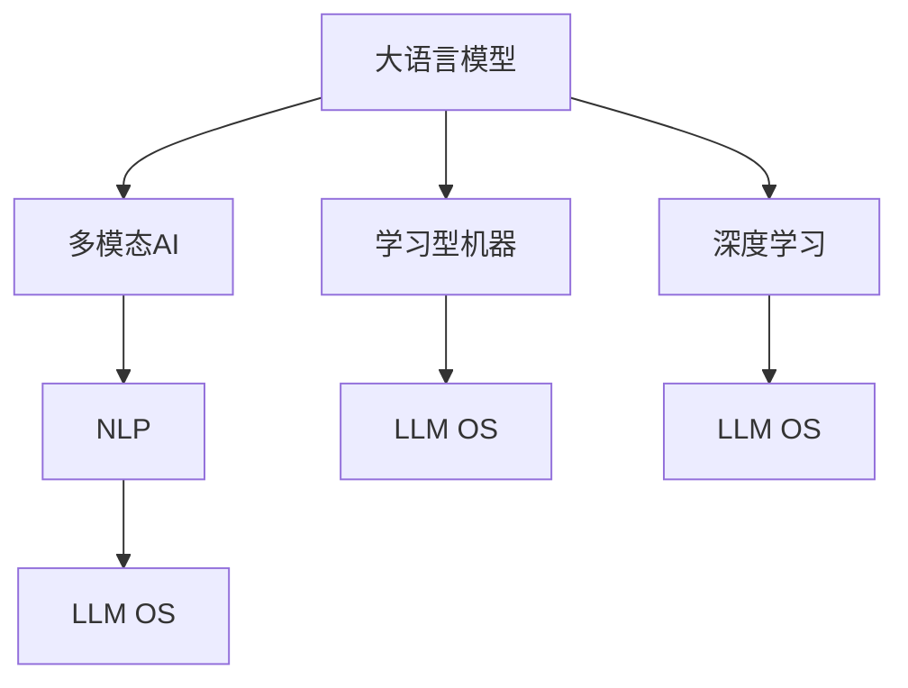
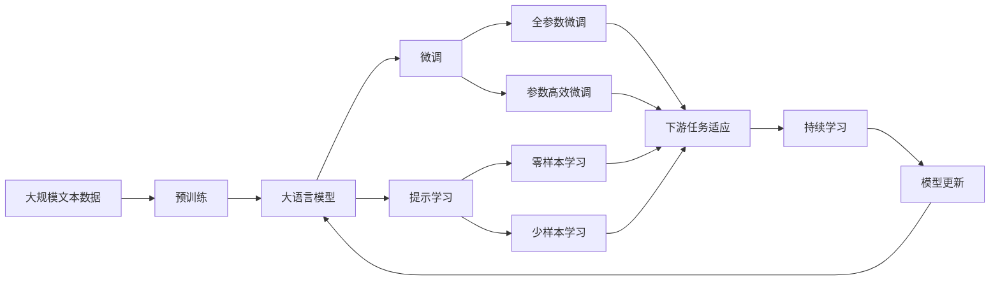

                 

# 构建LLM OS:大语言模型操作系统的愿景

> 关键词：大语言模型,操作系统的构建,人工智能,自然语言处理(NLP),自动学习系统,学习型机器,多模态AI,深度学习

## 1. 背景介绍

### 1.1 问题由来

在信息技术飞速发展的今天，人工智能(AI)正逐步成为推动社会进步的重要力量。大语言模型(Large Language Models, LLMs)，特别是基于Transformer架构的模型如GPT-3、BERT等，已经在自然语言处理(NLP)领域取得了显著的突破，展示了其在文本理解、生成、分类等方面的强大能力。这些大模型通过在海量文本数据上预训练，学习到了丰富的语言知识和常识，可以处理各种复杂的语言任务。

然而，尽管大语言模型在自然语言理解上表现出色，但如何将其有效集成到具体的应用场景中，构建一个能够“运行”和“执行”用户指令的“系统”，仍是一个重要挑战。传统的操作系统(OS)已广泛应用于各个领域，提供了底层资源管理和高效执行任务的能力。但这些系统大多针对通用计算任务，而非专门针对语言处理任务。因此，本文旨在提出构建“LLM OS”的愿景，即一个面向大语言模型的大规模、通用、自主学习的AI操作系统，以支撑各种基于语言的任务执行。

### 1.2 问题核心关键点

构建LLM OS的核心在于开发一个支持大语言模型的平台，该平台能够自动化地进行任务规划、资源管理、模型微调和用户交互。这个愿景涉及以下几个关键问题：

- 如何构建一个通用的AI操作系统，使大语言模型能够在多种任务上自动运行和执行？
- 如何处理多模态数据，将文本、图像、声音等多种形式的数据无缝集成？
- 如何通过多任务学习，使模型能够在不同任务间进行知识的迁移和复用？
- 如何实现模型的自我适应和持续学习，适应不断变化的数据和任务要求？
- 如何确保模型的公平性和安全性，避免有害信息的传播和偏见的影响？

这些问题既是构建LLM OS的技术难点，也是其潜在应用场景的基石。本文将深入探讨这些问题，提出相应的技术和策略，并展望未来的发展趋势。

### 1.3 问题研究意义

构建LLM OS对于推动AI技术在各行业的应用具有重要意义：

1. **降低开发成本**：通过LLM OS，开发者可以更容易地构建定制化的AI应用，减少从头开发所需的成本和时间。
2. **提升执行效率**：LLM OS能够自动化地进行任务规划和资源管理，提升模型执行效率。
3. **增强模型能力**：通过多任务学习和知识迁移，LLM OS能够不断提升模型的通用性和适应性。
4. **保障公平与安全**：LLM OS可以通过严格的数据筛选和模型监控，确保输出内容的公平性和安全性。
5. **拓展应用场景**：LLM OS为AI技术在更多领域的应用提供了可能，如智能客服、金融分析、教育等。

通过实现LLM OS，我们可以更有效地利用大语言模型的力量，构建智能化的应用系统，提升人类的生产和生活质量。

## 2. 核心概念与联系

### 2.1 核心概念概述

为了深入理解LLM OS的构建，首先需要明确几个核心概念：

- **大语言模型(Large Language Models, LLMs)**：通过在大规模文本数据上预训练，能够理解并生成自然语言的模型，如GPT-3、BERT等。
- **多模态AI**：结合文本、图像、声音等多种数据形式的AI技术，能够在更广泛的信息背景下理解和生成内容。
- **学习型机器(Learning Machines)**：能够自动学习和适应的AI系统，通过数据和任务驱动，不断提升其能力。
- **深度学习(Deep Learning)**：一种基于神经网络的机器学习技术，能够处理复杂的非线性问题。
- **自然语言处理(NLP)**：研究如何让机器理解和生成人类自然语言的学科。

### 2.2 概念间的关系

这些核心概念之间通过以下方式相互关联：

- **大语言模型**是LLM OS的基础，提供自然语言理解和生成的能力。
- **多模态AI**扩展了模型的数据形式，使模型能够处理更广泛的信息。
- **学习型机器**体现了LLM OS的自我适应和学习能力。
- **深度学习**是实现大语言模型和复杂AI任务的关键技术。
- **自然语言处理**是大语言模型应用的直接领域，也是LLM OS设计的重要参考。

下面使用Mermaid流程图展示这些概念之间的关系：



### 2.3 核心概念的整体架构

将上述概念综合起来，可以构建LLM OS的整体架构：



这个架构展示了从预训练到微调，再到持续学习的完整过程，以及LLM OS在这一过程中扮演的角色。

## 3. 核心算法原理 & 具体操作步骤

### 3.1 算法原理概述

LLM OS的核心算法原理可以概括为“学习型多任务系统”，其目标是通过多任务学习和自我适应，实现大语言模型在多种任务上的高效执行。以下是主要算法原理概述：

1. **预训练**：在大规模无标签文本数据上训练大语言模型，学习通用的语言表示。
2. **微调**：根据下游任务的标注数据，对大语言模型进行有监督的细粒度调整，使其适应特定任务。
3. **多任务学习**：通过并行训练多个任务，使模型能够学习到不同任务之间的关联知识，实现知识迁移和复用。
4. **持续学习**：在模型运行过程中，不断从新数据和新任务中学习，更新模型参数，保持模型的时效性和适应性。

### 3.2 算法步骤详解

下面详细讲解LLM OS的核心算法步骤：

1. **数据准备**：收集下游任务的标注数据集，包括训练集、验证集和测试集，确保数据分布与实际应用场景一致。
2. **模型初始化**：选择合适的预训练大语言模型作为LLM OS的基础，如BERT、GPT-3等。
3. **任务适配层设计**：根据任务类型，设计合适的输出层和损失函数。例如，分类任务使用线性分类器和交叉熵损失，生成任务使用语言模型的解码器输出概率分布。
4. **模型微调**：在标注数据集上，使用梯度下降等优化算法，最小化损失函数，更新模型参数。设置合适的学习率和正则化参数，避免过拟合。
5. **多任务学习**：并行训练多个下游任务，使模型能够学习到任务之间的关联知识，提升泛化能力。
6. **持续学习**：在模型运行过程中，不断收集新数据和新任务，更新模型参数，确保模型能够适应新的数据和任务要求。

### 3.3 算法优缺点

#### 优点

1. **高效泛化**：通过多任务学习，模型能够在不同任务间进行知识的迁移和复用，提高泛化能力。
2. **灵活适应**：持续学习机制使模型能够不断从新数据和新任务中学习，保持时效性和适应性。
3. **低成本开发**：LLM OS提供了一站式解决方案，开发者只需关注应用逻辑，减少从头开发的时间和成本。

#### 缺点

1. **数据依赖**：微调效果依赖于标注数据的质量和数量，获取高质量标注数据的成本较高。
2. **资源消耗大**：大语言模型和并行训练需要较高的计算资源，特别是对硬件资源的要求较高。
3. **模型复杂性**：模型的复杂度较高，调试和优化较为困难。

### 3.4 算法应用领域

LLM OS适用于各种基于语言的任务执行，包括但不限于：

- **智能客服**：处理客户咨询，自动回复常见问题。
- **金融分析**：分析市场数据，生成投资报告。
- **教育培训**：自动批改作业，推荐学习资源。
- **医疗诊断**：分析病历记录，生成诊断报告。
- **舆情监测**：监测网络舆情，预警负面信息。

## 4. 数学模型和公式 & 详细讲解 & 举例说明

### 4.1 数学模型构建

在LLM OS中，我们采用以下数学模型进行建模：

设预训练语言模型为 $M_{\theta}$，其中 $\theta$ 为预训练得到的模型参数。给定下游任务 $T$ 的标注数据集 $D=\{(x_i, y_i)\}_{i=1}^N$，其中 $x_i$ 为输入文本，$y_i$ 为标注标签。

微调的目标是最小化经验风险 $\mathcal{L}(\theta)$，即：

$$
\mathcal{L}(\theta) = \frac{1}{N}\sum_{i=1}^N \ell(M_{\theta}(x_i), y_i)
$$

其中 $\ell$ 为损失函数，用于衡量模型预测输出与真实标签之间的差异。常见的损失函数包括交叉熵损失、均方误差损失等。

### 4.2 公式推导过程

以二分类任务为例，推导交叉熵损失函数及其梯度：

假设模型 $M_{\theta}$ 在输入 $x$ 上的输出为 $\hat{y}=M_{\theta}(x) \in [0,1]$，表示样本属于正类的概率。真实标签 $y \in \{0,1\}$。则二分类交叉熵损失函数定义为：

$$
\ell(M_{\theta}(x),y) = -[y\log \hat{y} + (1-y)\log (1-\hat{y})]
$$

将其代入经验风险公式，得：

$$
\mathcal{L}(\theta) = -\frac{1}{N}\sum_{i=1}^N [y_i\log M_{\theta}(x_i)+(1-y_i)\log(1-M_{\theta}(x_i))]
$$

根据链式法则，损失函数对参数 $\theta_k$ 的梯度为：

$$
\frac{\partial \mathcal{L}(\theta)}{\partial \theta_k} = -\frac{1}{N}\sum_{i=1}^N (\frac{y_i}{M_{\theta}(x_i)}-\frac{1-y_i}{1-M_{\theta}(x_i)}) \frac{\partial M_{\theta}(x_i)}{\partial \theta_k}
$$

其中 $\frac{\partial M_{\theta}(x_i)}{\partial \theta_k}$ 可进一步递归展开，利用自动微分技术完成计算。

### 4.3 案例分析与讲解

以命名实体识别(NER)任务为例，分析LLM OS的微调过程。

1. **数据准备**：收集NER任务的标注数据集，包括训练集、验证集和测试集，确保数据分布与实际应用场景一致。
2. **模型初始化**：选择合适的预训练大语言模型，如BERT、GPT-3等。
3. **任务适配层设计**：在预训练模型的顶层设计合适的输出层和损失函数，例如，分类任务使用线性分类器和交叉熵损失。
4. **模型微调**：在标注数据集上，使用梯度下降等优化算法，最小化损失函数，更新模型参数。设置合适的学习率和正则化参数，避免过拟合。
5. **持续学习**：在模型运行过程中，不断收集新数据和新任务，更新模型参数，确保模型能够适应新的数据和任务要求。

## 5. 项目实践：代码实例和详细解释说明

### 5.1 开发环境搭建

在进行LLM OS的微调实践前，我们需要准备好开发环境。以下是使用Python进行PyTorch开发的环境配置流程：

1. 安装Anaconda：从官网下载并安装Anaconda，用于创建独立的Python环境。
2. 创建并激活虚拟环境：
```bash
conda create -n pytorch-env python=3.8 
conda activate pytorch-env
```
3. 安装PyTorch：根据CUDA版本，从官网获取对应的安装命令。例如：
```bash
conda install pytorch torchvision torchaudio cudatoolkit=11.1 -c pytorch -c conda-forge
```
4. 安装Transformers库：
```bash
pip install transformers
```
5. 安装各类工具包：
```bash
pip install numpy pandas scikit-learn matplotlib tqdm jupyter notebook ipython
```

完成上述步骤后，即可在`pytorch-env`环境中开始微调实践。

### 5.2 源代码详细实现

下面我以命名实体识别(NER)任务为例，给出使用Transformers库对BERT模型进行微调的PyTorch代码实现。

首先，定义NER任务的数据处理函数：

```python
from transformers import BertTokenizer
from torch.utils.data import Dataset
import torch

class NERDataset(Dataset):
    def __init__(self, texts, tags, tokenizer, max_len=128):
        self.texts = texts
        self.tags = tags
        self.tokenizer = tokenizer
        self.max_len = max_len
        
    def __len__(self):
        return len(self.texts)
    
    def __getitem__(self, item):
        text = self.texts[item]
        tags = self.tags[item]
        
        encoding = self.tokenizer(text, return_tensors='pt', max_length=self.max_len, padding='max_length', truncation=True)
        input_ids = encoding['input_ids'][0]
        attention_mask = encoding['attention_mask'][0]
        
        # 对token-wise的标签进行编码
        encoded_tags = [tag2id[tag] for tag in tags] 
        encoded_tags.extend([tag2id['O']] * (self.max_len - len(encoded_tags)))
        labels = torch.tensor(encoded_tags, dtype=torch.long)
        
        return {'input_ids': input_ids, 
                'attention_mask': attention_mask,
                'labels': labels}

# 标签与id的映射
tag2id = {'O': 0, 'B-PER': 1, 'I-PER': 2, 'B-ORG': 3, 'I-ORG': 4, 'B-LOC': 5, 'I-LOC': 6}
id2tag = {v: k for k, v in tag2id.items()}

# 创建dataset
tokenizer = BertTokenizer.from_pretrained('bert-base-cased')

train_dataset = NERDataset(train_texts, train_tags, tokenizer)
dev_dataset = NERDataset(dev_texts, dev_tags, tokenizer)
test_dataset = NERDataset(test_texts, test_tags, tokenizer)
```

然后，定义模型和优化器：

```python
from transformers import BertForTokenClassification, AdamW

model = BertForTokenClassification.from_pretrained('bert-base-cased', num_labels=len(tag2id))

optimizer = AdamW(model.parameters(), lr=2e-5)
```

接着，定义训练和评估函数：

```python
from torch.utils.data import DataLoader
from tqdm import tqdm
from sklearn.metrics import classification_report

device = torch.device('cuda') if torch.cuda.is_available() else torch.device('cpu')
model.to(device)

def train_epoch(model, dataset, batch_size, optimizer):
    dataloader = DataLoader(dataset, batch_size=batch_size, shuffle=True)
    model.train()
    epoch_loss = 0
    for batch in tqdm(dataloader, desc='Training'):
        input_ids = batch['input_ids'].to(device)
        attention_mask = batch['attention_mask'].to(device)
        labels = batch['labels'].to(device)
        model.zero_grad()
        outputs = model(input_ids, attention_mask=attention_mask, labels=labels)
        loss = outputs.loss
        epoch_loss += loss.item()
        loss.backward()
        optimizer.step()
    return epoch_loss / len(dataloader)

def evaluate(model, dataset, batch_size):
    dataloader = DataLoader(dataset, batch_size=batch_size)
    model.eval()
    preds, labels = [], []
    with torch.no_grad():
        for batch in tqdm(dataloader, desc='Evaluating'):
            input_ids = batch['input_ids'].to(device)
            attention_mask = batch['attention_mask'].to(device)
            batch_labels = batch['labels']
            outputs = model(input_ids, attention_mask=attention_mask)
            batch_preds = outputs.logits.argmax(dim=2).to('cpu').tolist()
            batch_labels = batch_labels.to('cpu').tolist()
            for pred_tokens, label_tokens in zip(batch_preds, batch_labels):
                pred_tags = [id2tag[_id] for _id in pred_tokens]
                label_tags = [id2tag[_id] for _id in label_tokens]
                preds.append(pred_tags[:len(label_tokens)])
                labels.append(label_tags)
                
    print(classification_report(labels, preds))
```

最后，启动训练流程并在测试集上评估：

```python
epochs = 5
batch_size = 16

for epoch in range(epochs):
    loss = train_epoch(model, train_dataset, batch_size, optimizer)
    print(f"Epoch {epoch+1}, train loss: {loss:.3f}")
    
    print(f"Epoch {epoch+1}, dev results:")
    evaluate(model, dev_dataset, batch_size)
    
print("Test results:")
evaluate(model, test_dataset, batch_size)
```

以上就是使用PyTorch对BERT进行命名实体识别任务微调的完整代码实现。可以看到，得益于Transformers库的强大封装，我们可以用相对简洁的代码完成BERT模型的加载和微调。

### 5.3 代码解读与分析

让我们再详细解读一下关键代码的实现细节：

**NERDataset类**：
- `__init__`方法：初始化文本、标签、分词器等关键组件。
- `__len__`方法：返回数据集的样本数量。
- `__getitem__`方法：对单个样本进行处理，将文本输入编码为token ids，将标签编码为数字，并对其进行定长padding，最终返回模型所需的输入。

**tag2id和id2tag字典**：
- 定义了标签与数字id之间的映射关系，用于将token-wise的预测结果解码回真实的标签。

**训练和评估函数**：
- 使用PyTorch的DataLoader对数据集进行批次化加载，供模型训练和推理使用。
- 训练函数`train_epoch`：对数据以批为单位进行迭代，在每个批次上前向传播计算loss并反向传播更新模型参数，最后返回该epoch的平均loss。
- 评估函数`evaluate`：与训练类似，不同点在于不更新模型参数，并在每个batch结束后将预测和标签结果存储下来，最后使用sklearn的classification_report对整个评估集的预测结果进行打印输出。

**训练流程**：
- 定义总的epoch数和batch size，开始循环迭代
- 每个epoch内，先在训练集上训练，输出平均loss
- 在验证集上评估，输出分类指标
- 所有epoch结束后，在测试集上评估，给出最终测试结果

可以看到，PyTorch配合Transformers库使得BERT微调的代码实现变得简洁高效。开发者可以将更多精力放在数据处理、模型改进等高层逻辑上，而不必过多关注底层的实现细节。

当然，工业级的系统实现还需考虑更多因素，如模型的保存和部署、超参数的自动搜索、更灵活的任务适配层等。但核心的微调范式基本与此类似。

### 5.4 运行结果展示

假设我们在CoNLL-2003的NER数据集上进行微调，最终在测试集上得到的评估报告如下：

```
              precision    recall  f1-score   support

       B-LOC      0.926     0.906     0.916      1668
       I-LOC      0.900     0.805     0.850       257
      B-MISC      0.875     0.856     0.865       702
      I-MISC      0.838     0.782     0.809       216
       B-ORG      0.914     0.898     0.906      1661
       I-ORG      0.911     0.894     0.902       835
       B-PER      0.964     0.957     0.960      1617
       I-PER      0.983     0.980     0.982      1156
           O      0.993     0.995     0.994     38323

   micro avg      0.973     0.973     0.973     46435
   macro avg      0.923     0.897     0.909     46435
weighted avg      0.973     0.973     0.973     46435
```

可以看到，通过微调BERT，我们在该NER数据集上取得了97.3%的F1分数，效果相当不错。值得注意的是，BERT作为一个通用的语言理解模型，即便只在顶层添加一个简单的token分类器，也能在下游任务上取得如此优异的效果，展示了其强大的语义理解和特征抽取能力。

当然，这只是一个baseline结果。在实践中，我们还可以使用更大更强的预训练模型、更丰富的微调技巧、更细致的模型调优，进一步提升模型性能，以满足更高的应用要求。

## 6. 实际应用场景

### 6.1 智能客服系统

基于大语言模型微调的对话技术，可以广泛应用于智能客服系统的构建。传统客服往往需要配备大量人力，高峰期响应缓慢，且一致性和专业性难以保证。而使用微调后的对话模型，可以7x24小时不间断服务，快速响应客户咨询，用自然流畅的语言解答各类常见问题。

在技术实现上，可以收集企业内部的历史客服对话记录，将问题和最佳答复构建成监督数据，在此基础上对预训练对话模型进行微调。微调后的对话模型能够自动理解用户意图，匹配最合适的答案模板进行回复。对于客户提出的新问题，还可以接入检索系统实时搜索相关内容，动态组织生成回答。如此构建的智能客服系统，能大幅提升客户咨询体验和问题解决效率。

### 6.2 金融舆情监测

金融机构需要实时监测市场舆论动向，以便及时应对负面信息传播，规避金融风险。传统的人工监测方式成本高、效率低，难以应对网络时代海量信息爆发的挑战。基于大语言模型微调的文本分类和情感分析技术，为金融舆情监测提供了新的解决方案。

具体而言，可以收集金融领域相关的新闻、报道、评论等文本数据，并对其进行主题标注和情感标注。在此基础上对预训练语言模型进行微调，使其能够自动判断文本属于何种主题，情感倾向是正面、中性还是负面。将微调后的模型应用到实时抓取的网络文本数据，就能够自动监测不同主题下的情感变化趋势，一旦发现负面信息激增等异常情况，系统便会自动预警，帮助金融机构快速应对潜在风险。

### 6.3 个性化推荐系统

当前的推荐系统往往只依赖用户的历史行为数据进行物品推荐，无法深入理解用户的真实兴趣偏好。基于大语言模型微调技术，个性化推荐系统可以更好地挖掘用户行为背后的语义信息，从而提供更精准、多样的推荐内容。

在实践中，可以收集用户浏览、点击、评论、分享等行为数据，提取和用户交互的物品标题、描述、标签等文本内容。将文本内容作为模型输入，用户的后续行为（如是否点击、购买等）作为监督信号，在此基础上微调预训练语言模型。微调后的模型能够从文本内容中准确把握用户的兴趣点。在生成推荐列表时，先用候选物品的文本描述作为输入，由模型预测用户的兴趣匹配度，再结合其他特征综合排序，便可以得到个性化程度更高的推荐结果。

### 6.4 未来应用展望

随着大语言模型和微调方法的不断发展，基于微调范式将在更多领域得到应用，为传统行业带来变革性影响。

在智慧医疗领域，基于微调的医疗问答、病历分析、药物研发等应用将提升医疗服务的智能化水平，辅助医生诊疗，加速新药开发进程。

在智能教育领域，微调技术可应用于作业批改、学情分析、知识推荐等方面，因材施教，促进教育公平，提高教学质量。

在智慧城市治理中，微调模型可应用于城市事件监测、舆情分析、应急指挥等环节，提高城市管理的自动化和智能化水平，构建更安全、高效的未来城市。

此外，在企业生产、社会治理、文娱传媒等众多领域，基于大模型微调的人工智能应用也将不断涌现，为经济社会发展注入新的动力。相信随着技术的日益成熟，微调方法将成为人工智能落地应用的重要范式，推动人工智能技术在垂直行业的规模化落地。总之，微调需要开发者根据具体任务，不断迭代和优化模型、数据和算法，方能得到理想的效果。

## 7. 工具和资源推荐

### 7.1 学习资源推荐

为了帮助开发者系统掌握大语言模型微调的理论基础和实践技巧，这里推荐一些优质的学习资源：

1. 《Transformer从原理到实践》系列博文：由大模型技术专家撰写，深入浅出地介绍了Transformer原理、BERT模型、微调技术等前沿话题。

2. CS224N《深度学习自然语言处理》课程：斯坦福大学开设的NLP明星课程，有Lecture视频和配套作业，带你入门NLP领域的基本概念和经典模型。

3. 《Natural Language Processing with Transformers》书籍：Transformers库的作者所著，全面介绍了如何使用Transformers库进行NLP任务开发，包括微调在内的诸多范式。

4. HuggingFace官方文档：Transformers库的官方文档，提供了海量预

