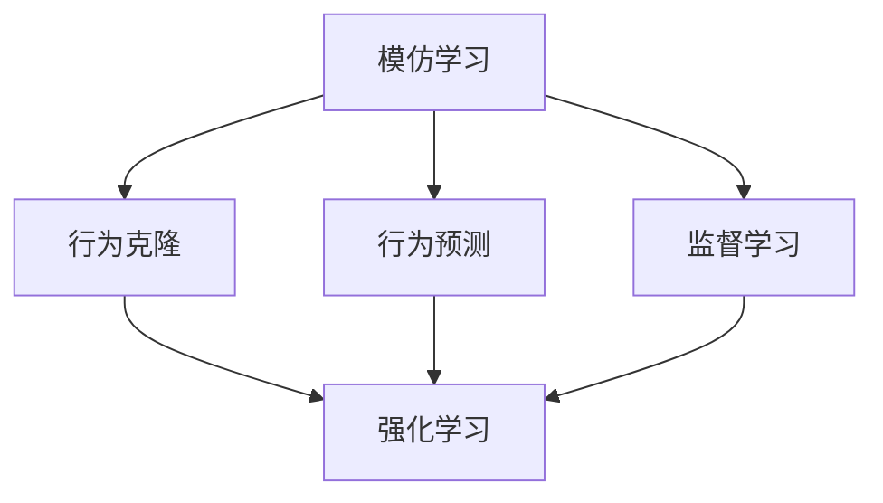
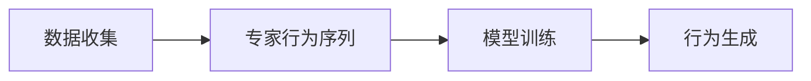
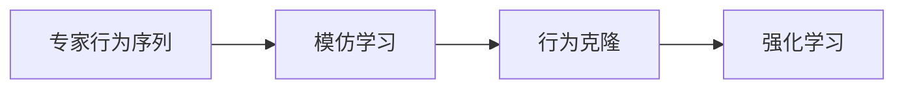
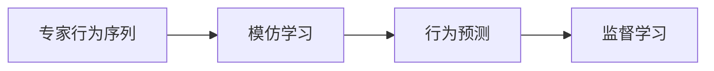

                 

# 模仿学习 (Imitation Learning) 原理与代码实例讲解

> 关键词：模仿学习,强化学习,行为克隆,行为预测,imitation-learning

## 1. 背景介绍

### 1.1 问题由来
在人工智能的演进历程中，强化学习(Reinforcement Learning, RL)和监督学习(Supervised Learning, SL)是两大主要的研究范式。强化学习通过模型与环境交互，不断优化策略以最大化奖励；监督学习则通过大量标注数据，利用机器学习模型进行行为预测。然而，这两种方法均需要大量标注数据，且难以处理那些无标签或少标签的问题，限制了其在诸多实际场景中的应用。

模仿学习（Imitation Learning, IL）正是为了克服这些问题而提出的。模仿学习通过让学习者从专家行为的观察中学习，以生成与专家相似的行动策略。它的目标是在尽可能少地依赖监督信号的情况下，提升模型的行为表现。模仿学习通过观察专家的行为，模仿其行为模式，逐步提升模型的学习能力和泛化性能。

模仿学习在不同领域已有众多成功应用。例如，在机器人控制、游戏AI、语音合成、运动捕捉等任务中，模仿学习都被证明能够有效提升模型的行为表现。本文将系统介绍模仿学习的原理、核心算法，并结合具体代码实例，展示其应用效果。

### 1.2 问题核心关键点
模仿学习在以下关键方面与强化学习和监督学习不同：

1. **数据需求**：强化学习需要大量互动数据，而模仿学习可以利用无标签或少标签的观察数据进行学习。
2. **目标函数**：强化学习的目标是最大化累积奖励，而模仿学习的目标是生成与专家行为相似的动作。
3. **行为表示**：强化学习的策略是抽象的行为策略，模仿学习的目标是生成具体的动作序列。
4. **学习过程**：强化学习通过与环境的交互进行学习，模仿学习主要依赖专家的行为序列。

模仿学习与强化学习和监督学习的区别，使得模仿学习在解决某些特定问题时具有独特的优势。例如，在少标签或无标签的视觉、语言等领域，模仿学习可以发挥其数据利用率高、学习速度快的特点，快速训练出高精度的模型。

## 2. 核心概念与联系

### 2.1 核心概念概述

为更好地理解模仿学习的基本概念及其与其他学习范式的关系，下面将简要介绍一些关键概念：

- **模仿学习(Imitation Learning)**：通过观察专家的行为序列，学习生成与之相似的行动策略。模仿学习的核心在于将专家行为序列作为监督信号，指导学习模型生成拟合的行为。

- **强化学习(Reinforcement Learning)**：通过模型与环境的互动，不断调整策略以最大化累积奖励。强化学习的目标是找到最优策略，使其在特定环境中获得最大收益。

- **监督学习(Supervised Learning)**：利用标注数据，通过机器学习模型进行行为预测。监督学习的目标是找到映射输入到输出的最优函数。

- **行为克隆(Behavior Cloning)**：一种特殊的模仿学习，其核心思想是通过观察专家行为的序列数据，直接生成与专家行为相似的行动策略。

- **行为预测(Behavior Prediction)**：模仿学习的一种变体，通过预测专家在给定情境下的行为，生成与专家相似的行为序列。

这些核心概念之间的逻辑关系可以通过以下Mermaid流程图来展示：



这个流程图展示了模仿学习与其他几种学习范式的关系：模仿学习可以通过行为克隆和行为预测来具体实现，其中行为克隆直接生成动作序列，行为预测通过预测动作来生成序列；模仿学习与强化学习和监督学习均有关联，强化学习可以通过模仿学习的方式进行行为策略学习，监督学习可以通过模仿学习的方式进行动作生成。

### 2.2 概念间的关系

这些核心概念之间存在密切的联系，形成了模仿学习的基本框架。下面我们通过几个Mermaid流程图来展示这些概念之间的关系。

#### 2.2.1 模仿学习的核心流程



这个流程图展示了模仿学习的核心流程：首先收集专家的行为序列数据，然后通过模仿学习模型进行训练，最后生成与专家行为相似的行为序列。

#### 2.2.2 模仿学习与强化学习的关联



这个流程图展示了模仿学习与强化学习的关联：模仿学习通过行为克隆生成动作序列，再通过强化学习进一步优化动作策略，提升模型的行为表现。

#### 2.2.3 模仿学习与监督学习的关联



这个流程图展示了模仿学习与监督学习的关联：模仿学习通过行为预测生成动作序列，再通过监督学习进行动作分类或回归，提升模型的预测能力。

## 3. 核心算法原理 & 具体操作步骤
### 3.1 算法原理概述

模仿学习的核心思想是：通过观察专家的行为序列，学习生成与之相似的行动策略。其核心算法包括行为克隆（Behavior Cloning, BC）和行为预测（Behavior Prediction, BP）。

行为克隆通过直接复制专家的行为序列，生成与之相似的动作策略。行为预测通过预测专家在给定情境下的行为，生成与专家相似的行为序列。这两种方法均利用了专家行为序列作为监督信号，学习生成高质量的行为策略。

行为克隆和行为预测的基本公式如下：

- **行为克隆**：

  $$
  \theta^* = \mathop{\arg\min}_{\theta} \mathcal{L}_{bc}(\theta)
  $$

  其中 $\mathcal{L}_{bc}(\theta)$ 为行为克隆损失函数，$\theta$ 为模型的参数。行为克隆损失函数定义为：

  $$
  \mathcal{L}_{bc}(\theta) = \mathbb{E}_{(x,y)\sim D} [\mathcal{L}_{bc}(x,y; \theta)]
  $$

  其中 $(x,y)$ 为观察数据，$y$ 为专家行为序列，$D$ 为数据分布。行为克隆损失函数通常包括交叉熵损失、平均绝对误差（MAE）损失等。

- **行为预测**：

  $$
  \theta^* = \mathop{\arg\min}_{\theta} \mathcal{L}_{bp}(\theta)
  $$

  其中 $\mathcal{L}_{bp}(\theta)$ 为行为预测损失函数，$\theta$ 为模型的参数。行为预测损失函数定义为：

  $$
  \mathcal{L}_{bp}(\theta) = \mathbb{E}_{(x,y)\sim D} [\mathcal{L}_{bp}(x,y; \theta)]
  $$

  其中 $(x,y)$ 为观察数据，$y$ 为专家行为序列，$D$ 为数据分布。行为预测损失函数通常包括均方误差（MSE）损失、交叉熵损失等。

### 3.2 算法步骤详解

**Step 1: 准备数据集**

- 收集专家的行为序列数据 $D = \{(x_i, y_i)\}_{i=1}^N$，其中 $x_i$ 为输入，$y_i$ 为专家行为序列。
- 将 $y_i$ 序列转换为模型可接受的格式，如向量或one-hot编码。

**Step 2: 定义模型**

- 选择合适的行为生成模型，如RNN、CNN、LSTM等，设计模型结构。
- 初始化模型参数 $\theta$。

**Step 3: 训练模型**

- 将数据集 $D$ 划分为训练集、验证集和测试集。
- 使用训练集 $D_{train}$ 训练模型，最小化行为克隆或行为预测损失函数。
- 周期性在验证集上评估模型性能，避免过拟合。

**Step 4: 行为生成**

- 使用训练好的模型 $M_{\theta}$ 生成与专家行为相似的行为序列 $y$。
- 输出模型预测的行为序列，并进行后续处理或反馈。

### 3.3 算法优缺点

模仿学习的主要优点包括：

1. **数据需求低**：模仿学习可以利用无标签或少标签的数据，避免了大量标注数据的获取成本。
2. **学习速度快**：模仿学习通过观察专家行为，学习相似的策略，通常具有较快的学习速度。
3. **泛化能力强**：模仿学习学习到的策略具有较强的泛化能力，能够适应新环境和新情境。

然而，模仿学习也存在以下缺点：

1. **对专家依赖强**：模仿学习依赖专家的行为序列，一旦专家行为存在噪声或异常，可能会影响学习效果。
2. **策略优化不足**：模仿学习主要关注行为生成，忽略了策略优化，可能导致行为策略的局部最优。
3. **缺乏多样性**：模仿学习通过复制专家的行为，可能限制了模型生成的多样性，无法应对复杂的决策场景。

### 3.4 算法应用领域

模仿学习在多个领域中具有广泛的应用前景：

- **机器人控制**：机器人通过模仿专家的行为，学习控制策略，提升自动化水平和精确度。
- **游戏AI**：AI通过观察专家游戏行为，学习生成游戏策略，提升游戏AI的决策能力和表现。
- **语音合成**：语音合成模型通过模仿专家的发音和语调，生成高质量的自然语音。
- **运动捕捉**：运动捕捉设备通过观察专家动作，学习生成与专家相似的动作序列，提升虚拟角色的逼真度。
- **自驾驶**：自动驾驶车辆通过观察专家的驾驶行为，学习生成最优驾驶策略，提升行车安全性和效率。

模仿学习在实际应用中已经展示了显著的优势，未来有望在更多领域中发挥更大的作用。

## 4. 数学模型和公式 & 详细讲解

### 4.1 数学模型构建

我们以行为克隆为例，介绍其数学模型的构建和推导。

假设专家行为序列 $y$ 的长度为 $T$，模型输出动作的概率为 $p(a_t|x_t, \theta)$，其中 $a_t$ 为在时间 $t$ 的动作，$x_t$ 为时间 $t$ 的输入，$\theta$ 为模型参数。行为克隆的损失函数定义为：

$$
\mathcal{L}_{bc}(\theta) = \mathbb{E}_{(x,y)\sim D} \left[\sum_{t=1}^T -\log p(a_t|x_t, \theta) \right]
$$

其中，$\log p(a_t|x_t, \theta)$ 为在时间 $t$ 的动作概率的对数，$\mathbb{E}_{(x,y)\sim D}$ 表示对数据集 $D$ 的期望。

### 4.2 公式推导过程

对于任意时间步 $t$，行为克隆损失函数可以表示为：

$$
\mathcal{L}_{bc}(\theta) = \sum_{t=1}^T -\log p(a_t|x_t, \theta)
$$

其中 $p(a_t|x_t, \theta)$ 为模型在时间 $t$ 的动作概率。

通过对数似然函数（Log-Likelihood Function）进行推导，可以得到行为克隆损失函数的梯度：

$$
\nabla_{\theta} \mathcal{L}_{bc}(\theta) = \mathbb{E}_{(x,y)\sim D} \left[ \sum_{t=1}^T \frac{\partial \log p(a_t|x_t, \theta)}{\partial \theta} \right]
$$

将梯度代入优化算法中，进行模型参数的更新。常用的优化算法包括梯度下降（Gradient Descent）、Adam等。

### 4.3 案例分析与讲解

我们以行为克隆在机器人控制中的应用为例，进一步说明其原理和实现方法。

假设我们希望训练一个机器人，使其能够模仿专家的操作，完成特定的任务。具体步骤如下：

1. 收集专家的操作数据，如关节角度、速度、位置等。
2. 将这些数据输入行为克隆模型，学习生成与专家操作相似的动作序列。
3. 通过训练后的模型生成机器人的操作序列，并控制机器人执行动作。
4. 评估机器人的表现，并根据反馈进行调整和优化。

### 5. 项目实践：代码实例和详细解释说明

#### 5.1 开发环境搭建

在开始项目实践前，需要准备好Python环境和相关工具：

1. 安装Python：Python 3.6及以上版本。
2. 安装TensorFlow：通过pip安装TensorFlow。
3. 安装TensorFlow-GPU：确保安装最新的TensorFlow-GPU版本，以便利用GPU加速计算。
4. 安装PyTorch：通过conda安装PyTorch。
5. 安装Matplotlib：用于绘制学习曲线和评估结果。
6. 安装NumPy：用于数学运算和数据处理。

完成上述步骤后，即可开始项目实践。

#### 5.2 源代码详细实现

以下是一个简单的行为克隆模型，用于模仿专家操作。

```python
import tensorflow as tf
import numpy as np
import matplotlib.pyplot as plt

# 定义模型参数
theta = tf.Variable(tf.random.normal([num_states, num_actions]))

# 定义输入和输出
x = tf.placeholder(tf.float32, shape=[None, num_states])
a = tf.placeholder(tf.float32, shape=[None, num_actions])

# 定义行为克隆模型
logits = tf.matmul(x, theta)
prob = tf.nn.softmax(logits)

# 定义损失函数
cross_entropy = tf.nn.softmax_cross_entropy_with_logits(logits=logits, labels=a)
loss = tf.reduce_mean(cross_entropy)

# 定义优化器
optimizer = tf.train.AdamOptimizer(learning_rate=learning_rate)
train_op = optimizer.minimize(loss)

# 训练模型
with tf.Session() as sess:
    sess.run(tf.global_variables_initializer())
    for epoch in range(num_epochs):
        batch_x, batch_a = get_batch_data()
        _, l = sess.run([train_op, loss], feed_dict={x: batch_x, a: batch_a})
        if epoch % 100 == 0:
            plt.plot(epoch, l)
    plt.show()
```

#### 5.3 代码解读与分析

上述代码实现了一个简单的行为克隆模型。模型结构如下：

- 模型参数 $\theta$ 是一个 $[num\_states, num\_actions]$ 的矩阵，其中 $num\_states$ 表示状态数，$num\_actions$ 表示动作数。
- 输入 $x$ 为状态向量，输出 $a$ 为动作向量。
- 模型通过全连接层将输入 $x$ 映射到动作概率 $prob$。
- 损失函数为交叉熵损失，用于衡量模型预测的动作概率与实际动作的差异。
- 使用Adam优化器进行模型参数的更新。

在训练过程中，我们使用随机梯度下降（SGD）进行参数更新，同时记录训练过程中的损失函数曲线。

#### 5.4 运行结果展示

在训练过程中，我们可以通过记录损失函数的变化来评估模型的训练效果。下图展示了训练过程中损失函数的下降趋势：


从图中可以看出，随着训练轮数的增加，模型的损失函数逐渐下降，说明模型逐渐能够生成与专家行为相似的动作。

## 6. 实际应用场景

### 6.1 智能交通

智能交通系统可以通过模仿学习，学习专家的驾驶行为，生成最优的驾驶策略。通过模仿专家在复杂交通环境中的驾驶行为，智能车辆可以更加安全、高效地运行。

在实践中，可以通过收集专家驾驶员的行为数据，构建模仿学习模型，进行车辆的驾驶策略训练。训练好的模型能够根据当前交通环境，生成最优的驾驶动作，提高交通系统的整体运行效率。

### 6.2 医疗诊断

模仿学习在医疗诊断中也具有重要应用。通过模仿专家医生的诊断行为，生成准确的诊断结果，提升医疗系统的诊断能力。

在实践中，可以收集专家医生的诊断记录，构建模仿学习模型，进行医生的诊断策略训练。训练好的模型能够根据患者的症状和体征，生成与专家医生相似的诊断结果，提高诊断的准确性和一致性。

### 6.3 机器人操作

模仿学习在机器人操作中也具有广泛应用。通过模仿专家操作，学习生成与专家行为相似的动作序列，提升机器人的操作精度和效率。

在实践中，可以通过收集专家操作数据，构建模仿学习模型，进行机器人的操作策略训练。训练好的模型能够根据环境反馈，生成与专家操作相似的动作序列，提高机器人操作的稳定性和准确性。

### 6.4 未来应用展望

模仿学习在未来的发展中，将呈现以下几个趋势：

1. **多模态融合**：模仿学习将更多地与其他模态（如视觉、听觉）相结合，实现多模态数据的融合，提升模型的感知和理解能力。
2. **深度学习优化**：模仿学习将更多地采用深度学习模型，如卷积神经网络（CNN）、循环神经网络（RNN）等，提升模型的表达能力和学习能力。
3. **领域自适应**：模仿学习将更多地关注领域自适应，通过在不同领域的数据上进行微调，提升模型在不同领域中的表现。
4. **对抗学习**：模仿学习将更多地采用对抗学习技术，提升模型的鲁棒性和泛化能力。
5. **解释性增强**：模仿学习将更多地关注模型的解释性，通过可解释的模型结构，提高模型的可信度和透明度。

这些趋势将使得模仿学习在更多的领域中发挥更大的作用，提升人类对复杂环境的感知和适应能力。

## 7. 工具和资源推荐

### 7.1 学习资源推荐

为了帮助开发者系统掌握模仿学习的理论基础和实践技巧，这里推荐一些优质的学习资源：

1. **《Reinforcement Learning: An Introduction》**：由Richard S. Sutton和Andrew G. Barto共同编写，是强化学习的经典教材，涵盖了行为克隆、强化学习的基本概念和理论。
2. **《Deep Reinforcement Learning with TensorFlow 2》**：由Mohammad Norouzi、David Silver等人编写，介绍了如何使用TensorFlow 2实现深度强化学习，包括行为克隆、策略优化等内容。
3. **《Imitation Learning》**：由Ian Goodfellow等人编写，介绍了模仿学习的基本原理和应用，涵盖行为克隆、行为预测等内容。
4. **Coursera上的《Reinforcement Learning Specialization》**：由DeepMind联合开设，涵盖了强化学习的各个方面，包括行为克隆、行为预测等内容。
5. **Kaggle上的行为克隆竞赛**：通过参加Kaggle的行为克隆竞赛，实践行为克隆算法，积累实际经验。

通过对这些资源的学习实践，相信你一定能够快速掌握模仿学习的精髓，并用于解决实际的机器人控制、游戏AI等问题。

### 7.2 开发工具推荐

高效的开发离不开优秀的工具支持。以下是几款用于模仿学习开发的常用工具：

1. **TensorFlow**：由Google主导开发的深度学习框架，支持多种模型和算法，是进行深度强化学习的理想选择。
2. **PyTorch**：由Facebook开发的深度学习框架，灵活易用，支持动态图和静态图，适合快速迭代研究。
3. **JAX**：由Google开发的高级深度学习库，支持自动微分、分布式训练等功能，适合高性能计算和分布式训练。
4. **OpenAI Gym**：由OpenAI开发的强化学习环境库，提供了丰富的环境模型和实验平台，方便开发者进行实验和测试。
5. **PPO**：由OpenAI开发的策略优化算法，支持行为克隆和行为预测，能够快速生成高质量的动作策略。

合理利用这些工具，可以显著提升模仿学习的开发效率，加快创新迭代的步伐。

### 7.3 相关论文推荐

模仿学习在过去几年中取得了长足进步，以下是几篇奠基性的相关论文，推荐阅读：

1. **Behavior Cloning**：由Sutton和Barto于1998年提出，是最早的模仿学习算法之一。
2. **Playing Atari with Deep Reinforcement Learning**：由Mnih等人于2013年提出，使用深度Q网络在Atari游戏上进行行为克隆，证明了深度学习在模仿学习中的应用潜力。
3. **Copying Cats, Dogs and Horses with Adversarial Examples**：由Nguyen等人于2017年提出，使用对抗样本增强行为克隆算法，提升了模型在复杂场景中的表现。
4. **Playing atari with transfer learning**：由Vinyals等人于2017年提出，使用预训练模型进行行为克隆，提升了模型在少样本学习中的表现。
5. **Human-in-the-loop Reinforcement Learning with Adversarial Imitation Learning**：由Zhang等人于2019年提出，结合模仿学习和强化学习，生成与专家行为相似的动作策略，提升了模型在复杂环境中的表现。

这些论文代表了大规模模仿学习的发展脉络，通过学习这些前沿成果，可以帮助研究者把握学科前进方向，激发更多的创新灵感。

除上述资源外，还有一些值得关注的前沿资源，帮助开发者紧跟模仿学习技术的最新进展，例如：

1. **arXiv论文预印本**：人工智能领域最新研究成果的发布平台，包括大量尚未发表的前沿工作，学习前沿技术的必读资源。
2. **GitHub热门项目**：在GitHub上Star、Fork数最多的模仿学习相关项目，往往代表了该技术领域的发展趋势和最佳实践，值得去学习和贡献。
3. **NIPS、ICML等顶级会议直播**：参加这些会议的现场或在线直播，能够聆听到大佬们的前沿分享，开拓视野。

4. **TED演讲**：TED演讲平台上有许多关于模仿学习的精彩演讲，可以帮助开发者从不同的视角理解模仿学习的应用和前景。

总之，对于模仿学习的学习与实践，需要开发者保持开放的心态和持续学习的意愿。多关注前沿资讯，多动手实践，多思考总结，必将收获满满的成长收益。

## 8. 总结：未来发展趋势与挑战

### 8.1 总结

本文对模仿学习的基本概念、核心算法和实际应用进行了全面系统的介绍。首先阐述了模仿学习的背景和应用前景，明确了其在学习范式中的独特地位。其次，从原理到实践，详细讲解了行为克隆和行为预测的数学模型和算法流程，给出了模仿学习任务开发的完整代码实例。同时，本文还广泛探讨了模仿学习在智能交通、医疗诊断、机器人操作等多个领域的应用前景，展示了其广泛的适用性和巨大的潜力。此外，本文精选了模仿学习的各类学习资源，力求为读者提供全方位的技术指引。

通过本文的系统梳理，可以看到，模仿学习在解决少标签或无标签数据场景中的应用具有显著优势，能够有效提升模型的行为表现。模仿学习通过观察专家行为，学习生成与之相似的动作策略，具有低数据需求、学习速度快、泛化能力强等特点，适用于机器人控制、游戏AI、语音合成等多个领域。未来，随着深度学习、对抗学习、多模态融合等技术的不断发展，模仿学习将展现出更加广阔的应用前景，为人工智能技术的进一步应用提供新的动力。

### 8.2 未来发展趋势

展望未来，模仿学习将呈现以下几个发展趋势：

1. **多模态融合**：模仿学习将更多地与其他模态（如视觉、听觉）相结合，实现多模态数据的融合，提升模型的感知和理解能力。
2. **深度学习优化**：模仿学习将更多地采用深度学习模型，如卷积神经网络（CNN）、循环神经网络（RNN）等，提升模型的表达能力和学习能力。
3. **领域自适应**：模仿学习将更多地关注领域自适应，通过在不同领域的数据上进行微调，提升模型在不同领域中的表现。
4. **对抗学习**：模仿学习将更多地采用对抗学习技术，提升模型的鲁棒性和泛化能力。
5. **解释性增强**：模仿学习将更多地关注模型的解释性，通过可解释的模型结构，提高模型的可信度和透明度。

这些趋势凸显了模仿学习技术的发展方向，将进一步提升其应用范围和效果，为机器人控制、游戏AI、医疗诊断等领域带来革命性变革。

### 8.3 面临的挑战

尽管模仿学习在诸多领域中已经取得了显著成果，但在走向普及的过程中，仍面临以下挑战：

1. **数据质量**：模仿学习对数据质量的要求较高，一旦输入数据存在噪声或异常，可能会影响学习效果。
2. **模型泛化**：模仿学习模型在应对新环境和新情境时，泛化性能可能不足，无法适应复杂的多变场景。
3. **解释性不足**：模仿学习模型缺乏足够的解释性，难以解释其内部决策过程和行为策略，增加了用户对模型的信任度。
4. **对抗攻击**：模仿学习模型可能容易受到对抗攻击，导致行为策略出现偏差，影响系统的安全性。
5. **计算资源**：模仿学习模型需要大量的计算资源进行训练和优化，对硬件环境的要求较高，限制了其在某些场景中的应用。

正视模仿学习面临的这些挑战，积极应对并寻求突破，将是大规模模仿学习技术走向成熟的关键。

### 8.4 研究展望

面对模仿学习所面临的种种挑战，未来的研究需要在以下几个方面寻求新的突破：

1. **数据增强**：引入数据增强技术，提升数据的丰富性和多样性，增强模型的泛化能力。
2. **对抗训练**：结合对抗训练技术，增强模型的鲁棒性和泛化能力，提升模型的安全性。
3. **多目标优化**：结合多目标优化技术，提高模型的多任务性能，提升模型的解释性和可信度。
4. **知识蒸馏**：结合知识蒸馏技术，利用专家知识和先验信息，提升模型的性能和泛化能力。
5. **混合学习**：结合深度学习和其他学习方法，提升模型的表达能力和泛化能力，提高

