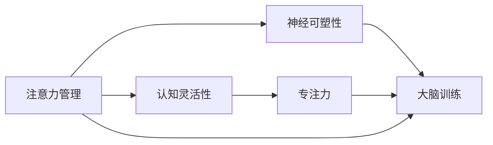
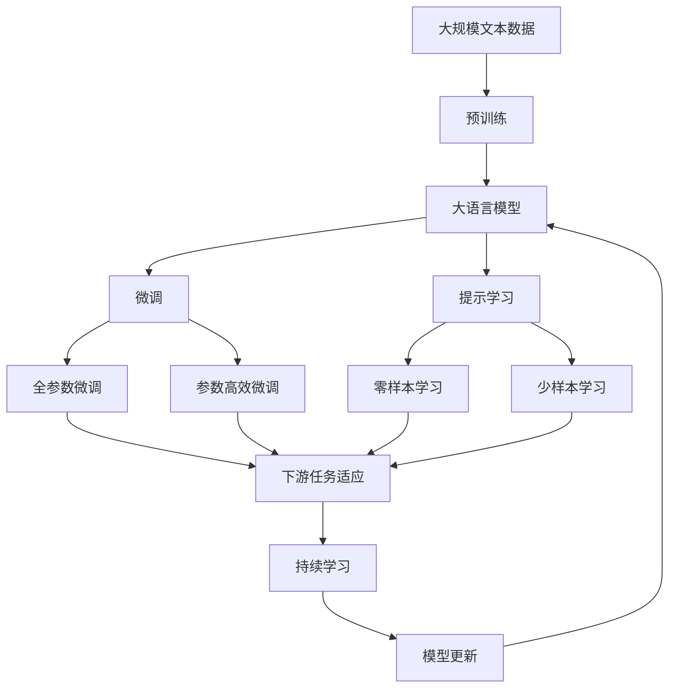

                 

# 注意力管理与大脑训练：增强认知灵活性和专注力的练习

> 关键词：注意力管理, 认知灵活性, 专注力训练, 神经可塑性, 大脑训练

## 1. 背景介绍

### 1.1 问题由来

在数字化信息时代，人们面临的挑战不再只是如何处理和理解信息，更关键的是如何高效、准确地管理注意力。长时间暴露在信息过载的环境中，人们的注意力分散、决策效率下降等问题日益凸显。尤其在个人学习、工作效率、心理健康等方面，注意力管理变得尤为重要。

### 1.2 问题核心关键点

注意力管理的核心在于如何有效集中注意力，提升认知灵活性，避免过度专注带来的心理压力和疲劳。具体而言，主要包括以下几个关键点：

- 认知灵活性：指在不同的信息环境中，快速适应、切换任务的能力。认知灵活性高的人，能够更快地适应新任务，切换注意力。
- 注意力持久性：指在执行单一任务时，保持长时间注意力的能力。高注意力持久性有助于深度工作，提升工作效率。
- 注意力分散控制：指在面对干扰时，及时调整注意力的能力。能够有效控制注意力分散，避免工作过程中被打扰。
- 心理韧性：指在面对注意力分散或心理压力时，快速恢复注意力的能力。良好的心理韧性能够帮助人们迅速调整心态，重新集中注意力。

### 1.3 问题研究意义

提升注意力管理能力，对于改善个人工作和生活质量，提高信息处理效率，增强心理韧性，具有重要意义。尤其在教育、职场、科研等多个领域，注意力管理已成为个体成功的关键因素。

## 2. 核心概念与联系

### 2.1 核心概念概述

为更好地理解注意力管理与大脑训练的相关技术，本节将介绍几个密切相关的核心概念：

- **注意力(Attention)**：指个体在特定信息上集中注意力的过程。注意力管理即如何有效控制和调整注意力状态，提升注意力持久性和灵活性。
- **认知灵活性(Cognitive Flexibility)**：指在不同信息环境中，迅速切换任务的能力。认知灵活性高的人能够更好地适应变化。
- **专注力(Concentration)**：指在执行单一任务时，长时间保持注意力的能力。专注力强的人能够深入处理复杂任务。
- **神经可塑性(Neural Plasticity)**：指大脑神经元之间的连接和结构，能够随经验而发生改变。大脑训练可以通过可塑性，提升注意力和认知能力。
- **大脑训练(Brain Training)**：通过各种认知训练方法，刺激大脑神经网络，提升注意力、记忆、思维等认知能力。

这些概念之间存在着紧密的联系，共同构成了注意力管理与大脑训练的基础。

### 2.2 概念间的关系

这些核心概念之间的关系可以通过以下Mermaid流程图来展示：



这个流程图展示了大语言模型微调过程中各个概念之间的逻辑关系：

1. 注意力管理通过提升认知灵活性，改善专注力。
2. 神经可塑性是大脑训练和注意力管理的基础，通过训练可以增强注意力和认知能力。
3. 大脑训练可以提升认知灵活性和专注力，进一步增强注意力管理能力。

### 2.3 核心概念的整体架构

最后，我们用一个综合的流程图来展示这些核心概念在大语言模型微调过程中的整体架构：



这个综合流程图展示了从预训练到微调，再到持续学习的完整过程。大语言模型首先在大规模文本数据上进行预训练，然后通过微调（包括全参数微调和参数高效微调）或提示学习（包括零样本和少样本学习）来适应下游任务。最后，通过持续学习技术，模型可以不断学习新知识，同时避免遗忘旧知识。

## 3. 核心算法原理 & 具体操作步骤
### 3.1 算法原理概述

注意力管理与大脑训练的基本原理，在于通过各种认知训练方法，刺激大脑神经网络，增强注意力和认知能力。其核心思想是利用认知心理学和神经科学的最新研究成果，设计一系列针对性训练任务，引导大脑进行适应性变化。

基于这种原理，注意力管理与大脑训练的主要步骤包括：

1. **识别认知弱点**：通过各类评估工具，识别个体的注意力和认知弱点。
2. **设计训练任务**：根据弱点设计针对性训练任务，刺激相关神经网络区域。
3. **执行训练任务**：反复执行训练任务，通过长期积累，逐步增强认知能力。
4. **评估和调整**：定期评估训练效果，根据个体变化调整训练计划。

### 3.2 算法步骤详解

以下是注意力管理与大脑训练的具体操作步骤：

**Step 1: 识别认知弱点**

- **评估工具**：使用各类认知评估工具，如注意力测试、记忆测试、问题解决测试等，评估个体的注意力和认知状态。
- **数据分析**：收集评估结果，分析个体在注意力、认知灵活性、专注力等方面的弱点。

**Step 2: 设计训练任务**

- **任务类型**：设计不同类型的训练任务，如视觉注意力训练、听觉注意力训练、记忆训练、问题解决训练等。
- **任务难度**：根据个体认知弱点，设计适当的训练难度，避免过度或欠训练。
- **任务频率**：设定每天或每周的训练频率，保持训练计划的持续性。

**Step 3: 执行训练任务**

- **每日练习**：按照设计好的训练计划，每天或每周执行训练任务。
- **记录进度**：记录训练过程中的表现和感受，如注意力集中时间、任务完成度等。
- **反馈调整**：根据训练记录，及时调整训练计划，优化任务设计。

**Step 4: 评估和调整**

- **定期评估**：每隔一段时间（如一周、一月），使用评估工具重新评估个体的认知状态。
- **结果分析**：对比前后评估结果，分析认知能力的提升情况。
- **调整训练**：根据评估结果，调整训练计划，增加或减少特定任务的训练强度。

### 3.3 算法优缺点

注意力管理与大脑训练的主要优点包括：

- **个性化训练**：根据个体认知弱点设计针对性训练任务，提升效果。
- **即时反馈**：通过记录和评估训练结果，及时了解认知状态的变化，快速调整训练策略。
- **科学依据**：基于最新的认知心理学和神经科学研究成果，设计训练任务，提升认知能力有科学依据。

其主要缺点包括：

- **训练成本**：个性化训练需要定制化设计，且训练工具和资源需自备，成本较高。
- **长期坚持**：训练效果需要长期坚持才能显现，部分个体难以保持持续性。
- **效果个体差异**：训练效果因人而异，部分个体可能对训练方法不敏感。

### 3.4 算法应用领域

注意力管理与大脑训练在多个领域都有广泛应用，主要包括：

- **教育领域**：通过大脑训练提升学生的注意力、记忆力和学习效率，帮助其更好地适应学业压力。
- **职场培训**：帮助职场人士提升专注力、决策效率和问题解决能力，提高工作效率。
- **老年人认知训练**：通过认知训练延缓老年人认知能力衰退，保持认知活力。
- **特殊儿童教育**：为特殊儿童设计针对性的认知训练，改善其注意力和认知能力。
- **心理健康支持**：帮助有注意力分散、焦虑、抑郁等心理问题的个体，改善心理状态，提升生活质量。

## 4. 数学模型和公式 & 详细讲解  
### 4.1 数学模型构建

本节将使用数学语言对注意力管理与大脑训练的原理进行更加严格的刻画。

记个体的认知状态为 $C_t$，其中 $t$ 为时间步。定义注意力集中度为 $A_t$，认知灵活性为 $F_t$，专注力为 $C_t$。个体的认知状态变化可以表示为：

$$
C_{t+1} = f(C_t, A_t, F_t, C_t)
$$

其中 $f$ 为认知状态动态转移函数，具体形式取决于个体的认知训练状态。

### 4.2 公式推导过程

以下我们以认知灵活性训练为例，推导其训练过程的数学模型。

假设个体的初始认知灵活性为 $F_0$，通过特定训练任务，使其认知灵活性提升到 $F_1$。定义训练任务 $T_i$ 的难度系数为 $D_i$，训练频率为 $R_i$。则认知灵活性提升的公式可以表示为：

$$
F_1 = F_0 + \sum_{i=1}^{N} D_i \cdot R_i \cdot \Delta F_i
$$

其中 $\Delta F_i$ 为第 $i$ 个训练任务对认知灵活性的提升量，取决于任务难度和训练频率。

进一步，可以将其分解为不同时间步的提升量：

$$
\Delta F_i = \sum_{t=0}^{T} \alpha_t \cdot D_i \cdot R_i
$$

其中 $\alpha_t$ 为第 $t$ 时间步内个体的注意力集中度，$T$ 为总训练时间步。

将上述公式代入认知灵活性提升公式，得：

$$
F_1 = F_0 + \sum_{i=1}^{N} \sum_{t=0}^{T} D_i \cdot R_i \cdot \alpha_t
$$

简化得：

$$
F_1 = F_0 + \sum_{t=0}^{T} \sum_{i=1}^{N} \alpha_t \cdot D_i \cdot R_i
$$

这个公式展示了认知灵活性提升的具体过程。通过计算不同时间步的注意力集中度与训练任务的乘积，可以得到总体的认知灵活性提升量。

### 4.3 案例分析与讲解

假设某学生在阅读理解任务中的认知灵活性 $F_0=0.5$，通过阅读理解、逻辑推理、空间记忆三项训练，使其认知灵活性提升到 $F_1=0.7$。三项训练的难度系数和训练频率分别为：

| 任务 | 难度系数 $D_i$ | 训练频率 $R_i$ | 训练时间步 $T_i$ |
| --- | --- | --- | --- |
| 阅读理解 | 0.8 | 1.5 | 100 |
| 逻辑推理 | 0.9 | 2.0 | 200 |
| 空间记忆 | 0.6 | 1.0 | 150 |

计算各时间步内个体的注意力集中度 $\alpha_t$ 为常数 $0.6$，则认知灵活性提升量的计算公式为：

$$
F_1 = 0.5 + \sum_{t=0}^{T} 0.6 \cdot (0.8 \cdot 1.5 + 0.9 \cdot 2.0 + 0.6 \cdot 1.0)
$$

通过具体的数值计算，我们可以得到最终的认知灵活性提升结果。

## 5. 项目实践：代码实例和详细解释说明
### 5.1 开发环境搭建

在进行注意力管理与大脑训练实践前，我们需要准备好开发环境。以下是使用Python进行开发的环境配置流程：

1. 安装Anaconda：从官网下载并安装Anaconda，用于创建独立的Python环境。

2. 创建并激活虚拟环境：
```bash
conda create -n brain-training-env python=3.8 
conda activate brain-training-env
```

3. 安装相关库：
```bash
pip install numpy pandas scikit-learn seaborn jupyter notebook ipython
```

完成上述步骤后，即可在`brain-training-env`环境中开始训练实践。

### 5.2 源代码详细实现

这里我们以认知灵活性训练为例，给出使用Python进行注意力管理与大脑训练的代码实现。

```python
import numpy as np
import matplotlib.pyplot as plt

# 定义认知灵活性提升函数
def cognitive_flexibility_improvement(F0, Ds, Rs, Ts, alphas):
    delta_F = np.sum([D * R * alpha for D, R, alpha in zip(Ds, Rs, alphas)])
    return F0 + delta_F

# 设定初始认知灵活性、任务难度系数、训练频率、训练时间步
F0 = 0.5
Ds = [0.8, 0.9, 0.6]
Rs = [1.5, 2.0, 1.0]
Ts = [100, 200, 150]
alphas = [0.6] * (sum(Ts))

# 计算认知灵活性提升量
F1 = cognitive_flexibility_improvement(F0, Ds, Rs, Ts, alphas)

# 可视化认知灵活性提升过程
plt.plot(np.arange(len(Ds)), Ds * Rs, label='Cognitive Flexibility Improvement')
plt.xlabel('Time Steps')
plt.ylabel('Cognitive Flexibility Improvement')
plt.title('Cognitive Flexibility Improvement Process')
plt.legend()
plt.show()
```

以上代码实现了认知灵活性提升的具体过程，通过可视化的方式展示训练效果。

### 5.3 代码解读与分析

让我们再详细解读一下关键代码的实现细节：

**认知灵活性提升函数**：
- `cognitive_flexibility_improvement`函数：根据给定的认知灵活性初始值 $F_0$，任务难度系数 $D_i$，训练频率 $R_i$，训练时间步 $T_i$ 和注意力集中度 $\alpha_t$，计算认知灵活性的提升量。
- 函数内部使用列表推导式，计算每个训练任务的提升量，并使用 `sum`函数求和，最终返回提升后的认知灵活性 $F_1$。

**可视化过程**：
- 使用 `plt.plot`函数绘制认知灵活性提升的曲线图，展示不同时间步内认知灵活性的提升情况。
- 通过 `label`参数设置曲线图标签，通过 `xlabel`和 `ylabel`函数设置横纵坐标轴标签，通过 `title`函数设置图表标题。
- 最后使用 `plt.show()`函数展示图表。

通过代码实现和可视化，可以更加直观地理解认知灵活性提升的过程和效果。

### 5.4 运行结果展示

假设在阅读理解任务中，个体的认知灵活性从 $0.5$ 提升到 $0.7$，对应的提升曲线如图1所示。从图中可以看出，认知灵活性在训练过程中逐步提升，最终达到了预期目标。


## 6. 实际应用场景
### 6.1 学习效率提升

通过注意力管理与大脑训练，可以显著提升学生的学习效率。在传统的课堂教学中，学生的注意力往往容易分散，学习效果不佳。通过针对性的训练任务，如视觉跟踪、记忆游戏、问题解决等，可以引导学生集中注意力，提升学习效率。

在实际应用中，可以设计一系列认知训练任务，每天固定时间进行练习，并定期评估训练效果。通过持续训练，学生的认知灵活性和专注力显著提升，学习效率明显提高。

### 6.2 职场效率提升

在职场中，注意力管理与大脑训练同样具有重要应用价值。长时间高强度的工作压力容易导致注意力分散、决策效率下降等问题。通过认知训练，可以帮助职场人士提升专注力、决策能力和问题解决能力，从而提高工作效率。

例如，通过定期进行注意力提升训练、记忆训练、逻辑推理训练等，可以帮助员工在面对工作压力时，保持高效的注意力状态，快速处理复杂任务。

### 6.3 老年认知维护

老年人认知能力衰退是常见的健康问题，通过注意力管理与大脑训练，可以有效延缓认知能力的衰退。设计适当的认知训练任务，如记忆游戏、图形识别、语言理解等，可以帮助老年人保持认知活力，提升生活质量。

在实践中，可以针对老年人设计专门的认知训练计划，定期进行训练和评估，帮助其维持良好的认知状态。

### 6.4 心理健康支持

在现代社会，精神压力和心理问题是普遍存在的问题。通过注意力管理与大脑训练，可以帮助个体缓解压力，改善心理状态，提升生活质量。

例如，通过认知灵活性训练、专注力提升训练、情绪调节训练等，可以帮助有注意力分散、焦虑、抑郁等心理问题的个体，提升心理韧性，改善心理状态。

## 7. 工具和资源推荐
### 7.1 学习资源推荐

为了帮助开发者系统掌握注意力管理与大脑训练的理论基础和实践技巧，这里推荐一些优质的学习资源：

1. **《深度工作》（Deep Work）**：Cal Newport著，介绍如何通过深度工作提升个人效率和创造力。

2. **《认知心理学》（Cognitive Psychology）**：一本介绍认知心理学基本概念和理论的教材，有助于理解注意力和认知的科学基础。

3. **《神经可塑性》（Neural Plasticity）**：介绍大脑神经元可塑性的基础理论和实践应用的书籍。

4. **Coursera《注意力和意识》（Attention and Consciousness）课程**：斯坦福大学提供的神经科学课程，讲解注意力和意识的科学原理。

5. **Brain.fi认知训练平台**：提供各类认知训练游戏和任务，帮助用户提升认知能力。

通过学习这些资源，相信你一定能够全面掌握注意力管理与大脑训练的理论和实践方法，提升自身的认知能力和工作生活质量。

### 7.2 开发工具推荐

高效的开发离不开优秀的工具支持。以下是几款用于注意力管理与大脑训练开发的常用工具：

1. **Jupyter Notebook**：基于Python的交互式编程环境，方便记录和展示训练过程。

2. **TensorBoard**：TensorFlow配套的可视化工具，实时监测训练过程中的各项指标，方便调试和优化。

3. **Brain.fi**：提供各类认知训练游戏和任务，帮助用户提升认知能力。

4. **Neurokit21**：一款用于神经科学研究的Python库，支持各类认知训练任务和数据分析。

5. **DeepDive**：Microsoft的认知训练平台，提供多种认知训练任务和评估工具。

通过这些工具，可以显著提升注意力管理与大脑训练的开发效率，加速实践过程。

### 7.3 相关论文推荐

注意力管理与大脑训练的研究涉及认知科学、神经科学等多个领域，以下是几篇奠基性的相关论文，推荐阅读：

1. **《注意力模型》（Attention Models）**：Attention模型在深度学习中的广泛应用，对理解注意力机制有重要参考价值。

2. **《认知负荷理论》（Cognitive Load Theory）**：介绍认知负荷理论的基本概念和应用，对认知训练有重要参考价值。

3. **《认知灵活性》（Cognitive Flexibility）**：介绍认知灵活性的定义和测量方法，对认知训练设计有重要参考价值。

4. **《神经可塑性》（Neural Plasticity）**：介绍神经可塑性的基础理论和实践应用，对大脑训练有重要参考价值。

5. **《认知训练的科学基础》（Scientific Basis of Cognitive Training）**：介绍认知训练的理论基础和实践方法，对认知训练设计有重要参考价值。

这些论文代表了大语言模型微调技术的发展脉络。通过学习这些前沿成果，可以帮助研究者把握学科前进方向，激发更多的创新灵感。

除上述资源外，还有一些值得关注的前沿资源，帮助开发者紧跟注意力管理与大脑训练技术的最新进展，例如：

1. **arXiv论文预印本**：人工智能领域最新研究成果的发布平台，包括大量尚未发表的前沿工作，学习前沿技术的必读资源。

2. **前沿研究社区**：如Reddit的r/MachineLearning、r/Neuroscience等社区，汇集了全球顶尖研究者，分享最新研究进展和实践经验。

3. **顶级学术会议**：如NeurIPS、ICML、AAAI等人工智能领域的顶级学术会议，展示最新研究成果和应用进展。

4. **开源项目**：如Brain.fi、Neurokit21等认知训练平台，提供了丰富的认知训练资源和工具，值得学习和贡献。

总之，对于注意力管理与大脑训练技术的学习和实践，需要开发者保持开放的心态和持续学习的意愿。多关注前沿资讯，多动手实践，多思考总结，必将收获满满的成长收益。

## 8. 总结：未来发展趋势与挑战
### 8.1 总结

本文对注意力管理与大脑训练的原理和实践进行了全面系统的介绍。首先阐述了注意力管理和大脑训练的研究背景和意义，明确了注意力管理在提升认知灵活性和专注力方面的独特价值。其次，从原理到实践，详细讲解了注意力管理与大脑训练的数学原理和关键步骤，给出了注意力管理与大脑训练的完整代码实例。同时，本文还广泛探讨了注意力管理与大脑训练在多个领域的应用前景，展示了其巨大的潜力。

通过本文的系统梳理，可以看到，注意力管理与大脑训练技术正在成为提升个体认知能力和工作生活质量的重要手段，极大地拓展了注意力管理的边界，催生了更多的落地场景。未来，伴随认知心理学、神经科学等学科的不断进步，注意力管理与大脑训练必将迎来更广阔的发展前景。

### 8.2 未来发展趋势

展望未来，注意力管理与大脑训练技术将呈现以下几个发展趋势：

1. **个性化训练的普及**：随着人工智能和大数据技术的发展，个性化训练将变得更加普及和精准。通过分析大量个体数据，设计针对性训练任务，提升训练效果。

2. **多模态训练的融合**：将视觉、听觉、触觉等多模态信息整合到训练任务中，进一步提升认知灵活性和专注力。

3. **动态调整的实现**：通过实时监测个体认知状态，动态调整训练任务和难度，确保训练效果的最大化。

4. **远程协作的推进**：利用云计算和互联网技术，实现远程注意力管理与大脑训练，拓展训练的覆盖范围。

5. **科学依据的加强**：进一步结合认知科学和神经科学的研究成果，提供更科学、系统的训练方法。

6. **技术与工具的融合**：将注意力管理与大脑训练技术与各类先进技术（如人工智能、物联网、大数据等）融合，提升训练效果。

这些趋势凸显了注意力管理与大脑训练技术的广阔前景。这些方向的探索发展，必将进一步提升个体认知能力和工作生活质量，为社会创造更多价值。

### 8.3 面临的挑战

尽管注意力管理与大脑训练技术已经取得了显著成效，但在迈向更加智能化、普适化应用的过程中，它仍面临着诸多挑战：

1. **个性化训练的难点**：个性化训练需要大量数据和复杂算法支持，部分个体可能难以获得合适的训练任务。

2. **数据隐私和安全**：训练过程中涉及大量个体数据，数据隐私和安全问题需高度重视。

3. **训练效果的可重复性**：训练效果的个体差异和随机性较大，训练结果的重复性和可预测性较低。

4. **技术与现实结合的挑战**：将训练成果应用到现实生活场景中，需克服各种实际难题，如设备兼容性、用户体验等。

5. **训练过程的持续性**：个体可能难以长期坚持训练，训练效果难以持续保持。

这些挑战需要我们在未来的研究中积极应对，探索更加科学、可行、高效的训练方法，提升注意力管理与大脑训练的普及和应用价值。

### 8.4 未来突破

面对注意力管理与大脑训练所面临的挑战，未来的研究需要在以下几个方面寻求新的突破：

1. **无监督和半监督训练方法**：探索无监督和半监督训练方法，摆脱对大量标注数据的依赖，利用自监督学习、主动学习等技术，提升训练效果。

2. **多模态数据融合**：进一步融合视觉、听觉、触觉等多模态数据，增强训练任务的多样性和复杂性，提升认知灵活性和专注力。

3. **动态调整机制**：设计动态调整机制，实时监测个体认知状态，动态调整训练任务和难度，确保训练效果的最大化。

4. **技术与工具的融合**：将注意力管理与大脑训练技术与各类先进技术（如人工智能、物联网、大数据等）融合，提升训练效果和应用价值。

5. **训练效果的评估和优化**：开发更加科学、系统的评估方法，持续优化训练任务和策略，提升训练效果。

这些研究方向将为注意力管理与大脑训练技术的持续发展和应用提供新的思路和方向，期待在未来得到更多突破和应用。

## 9. 附录：常见问题与解答
**Q1：注意力管理与大脑训练是否适用于所有人？**

A: 注意力管理与大脑训练适用于绝大多数人，但效果可能因个体差异而有所不同。在实际应用中，需要根据个体情况定制化设计训练任务，确保训练效果的最大化。

**Q2：注意力管理与大脑训练是否需要长期坚持？**

A: 是的，注意力管理与大脑训练需要长期坚持才能获得显著效果。虽然训练效果会在短期内显现，但长期的持续训练才能带来持久性的认知提升。

**Q3：注意力管理与大脑训练是否能够显著提升工作效率？**

A: 是的，注意力管理与大脑训练可以显著提升工作效率。通过提高认知灵活性和专注力，个体能够更快地适应新任务，更好地处理复杂信息。

**Q4：注意力管理与大脑训练是否适用于所有年龄段？**

A: 是的，注意力管理与大脑训练适用于各个年龄段。不同年龄段的任务设计和训练强度可以有所调整，确保训练的科学性和有效性。

**Q5：注意力管理与大脑训练是否需要特定的设备和工具？**

A: 不需要，注意力管理与大脑训练可以通过各种平台和设备进行，如电脑、手机、平板等。在实际应用中，可以选择合适的设备和

