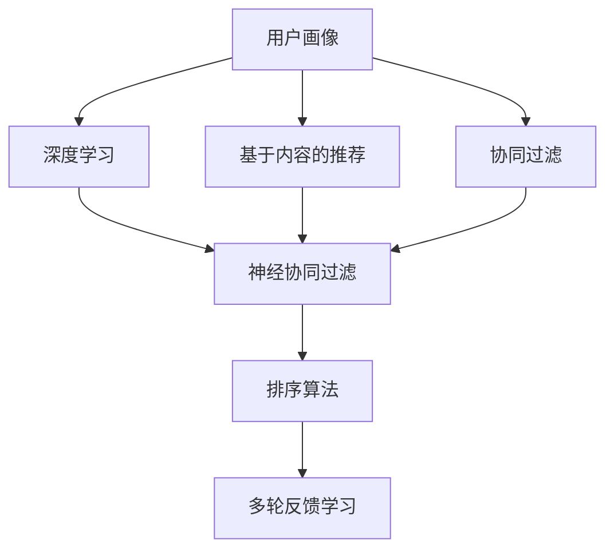
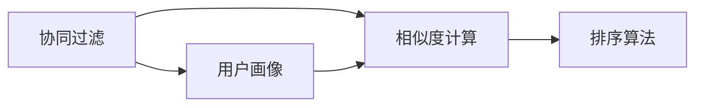
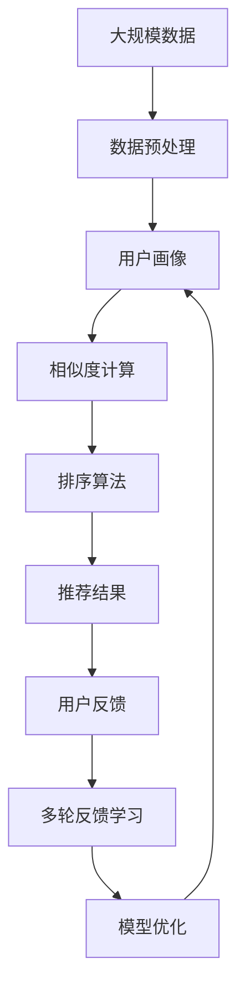

                 

## 1. 背景介绍

在互联网时代，内容生产者与消费者之间的联系从未如此紧密。随着大数据、云计算等技术的快速发展，人们获取信息的渠道日益多样化，个人用户也成为信息消费的主力。在此背景下，如何更好地满足用户的多样化需求，提供更加个性化、精准的内容推荐，成为平台和内容提供者关注的重点。

### 1.1 问题由来

现代互联网已经从单纯的信息分发平台，逐步转变为注意力经济体。内容消费者不仅对信息的数量有需求，更追求内容的相关性、新颖性和娱乐性。平台在激烈的市场竞争中，亟需建立一套行之有效的推荐系统，以留住用户，提升用户黏性。

个性化推荐算法通过分析用户的兴趣、行为等数据，为用户提供个性化的内容推荐，极大地提升了用户体验，也推动了内容消费的增加。随着推荐系统技术的不断演进，其应用领域也从简单的信息推荐拓展到多领域，如电商、社交、视频等。

### 1.2 问题核心关键点

个性化推荐算法主要解决的是如何为用户推荐最相关、最有价值的内容。其核心包括以下几点：

- **用户画像建模**：从用户历史行为、兴趣、属性等数据中构建用户画像，刻画用户的兴趣偏好。
- **内容画像建模**：提取内容的特征信息，构建内容的画像，便于与用户画像匹配。
- **相似度计算**：通过相似度算法衡量用户与内容之间的匹配程度，从而选择最相关的推荐内容。
- **排序算法**：根据推荐结果的评分，使用排序算法将最相关的内容排在前面，提供给用户。
- **多轮反馈学习**：通过用户对推荐内容的反馈，不断调整算法参数，提升推荐质量。

个性化推荐算法的发展，极大地促进了互联网内容的传播和消费，也带来了一系列新的问题，如隐私保护、推荐泛化性、内容多样性等。这些问题的解决，需要结合更先进的数据处理和算法技术，同时兼顾技术伦理和社会责任。

### 1.3 问题研究意义

个性化推荐算法的核心在于如何更好地了解和利用用户需求，提供更精准、更个性化的内容推荐。对于用户，能够大幅提升信息获取的效率和体验，节省时间成本。对于内容提供者，可以提升内容曝光率和影响力，获得更大的商业价值。

个性化推荐算法的研究和应用，不仅对电商、社交、视频等垂直领域具有重要意义，在新闻、健康、教育等行业也具有广泛的应用前景。随着推荐系统的不断演进，未来将在更多领域发挥更大作用，推动社会生产的智能化和数字化。

## 2. 核心概念与联系

### 2.1 核心概念概述

为更好地理解个性化推荐算法，本节将介绍几个密切相关的核心概念：

- **个性化推荐**：根据用户的历史行为、兴趣、属性等数据，为用户推荐其最感兴趣、最相关的信息。
- **协同过滤**：通过分析用户之间的相似性，推荐出与其他用户喜欢过的内容相似的内容。
- **基于内容的推荐**：从内容的特征出发，利用内容的属性信息为用户推荐内容。
- **深度学习**：一种通过多层神经网络模拟人类脑神经网络的机器学习技术，能够处理非结构化数据，发现数据中的复杂模式。
- **神经协同过滤**：在协同过滤的基础上引入神经网络，提升推荐精度和泛化能力。
- **矩阵分解**：将用户和内容的特征信息映射到低维空间中，便于进行相似度计算。
- **融合推荐**：结合多种推荐算法，取长补短，提升推荐的综合效果。

这些核心概念之间的逻辑关系可以通过以下Mermaid流程图来展示：



这个流程图展示了几类推荐算法的核心概念及其之间的关系：

1. 用户画像可以通过协同过滤和基于内容推荐等方法获得。
2. 深度学习技术可以通过神经协同过滤等方法引入，提升推荐精度。
3. 多种推荐算法可以结合，取长补短，提升推荐效果。
4. 排序算法和反馈学习等技术进一步优化推荐结果。

### 2.2 概念间的关系

这些核心概念之间存在着紧密的联系，形成了个性化推荐算法的完整生态系统。下面通过几个Mermaid流程图来展示这些概念之间的关系。

#### 2.2.1 个性化推荐算法流程


这个流程图展示了个性化推荐算法的基本流程。

#### 2.2.2 协同过滤和基于内容的推荐方法



这个流程图展示了协同过滤和基于内容的推荐的基本流程。

#### 2.2.3 深度学习和神经协同过滤的引入


这个流程图展示了深度学习技术在协同过滤中的应用。

#### 2.2.4 融合推荐的方法


这个流程图展示了融合推荐的基本流程。

### 2.3 核心概念的整体架构

最后，我们用一个综合的流程图来展示这些核心概念在大规模推荐系统中的整体架构：



这个综合流程图展示了从数据预处理到模型优化的推荐系统全流程。

## 3. 核心算法原理 & 具体操作步骤
### 3.1 算法原理概述

个性化推荐算法的核心思想是通过分析用户与内容之间的交互数据，构建用户和内容的画像，进而衡量用户与内容的相似度，最终为用户推荐最相关的信息。其核心原理可以总结为以下几个步骤：

1. **用户画像建模**：从用户的历史行为、兴趣、属性等数据中，通过机器学习算法构建用户画像，刻画用户的兴趣偏好。
2. **内容画像建模**：从内容的特征信息中，提取出关键特征，构建内容的画像，便于与用户画像进行匹配。
3. **相似度计算**：通过相似度算法衡量用户与内容之间的匹配程度，选择最相关的推荐内容。
4. **排序算法**：根据推荐结果的评分，使用排序算法将最相关的内容排在前面，提供给用户。
5. **多轮反馈学习**：通过用户对推荐内容的反馈，不断调整算法参数，提升推荐质量。

### 3.2 算法步骤详解

下面详细讲解个性化推荐算法的基本步骤，每一步都至关重要：

**Step 1: 数据收集**

个性化推荐算法需要大量的数据作为基础，包括用户的历史行为数据、兴趣数据、社交网络数据等。数据收集是推荐系统的第一步，也是关键的一步。

**Step 2: 数据预处理**

数据收集完成后，需要对数据进行预处理，包括数据清洗、特征提取、归一化等。数据预处理不仅影响推荐算法的效果，还关系到算法的运行效率。

**Step 3: 用户画像建模**

用户画像建模是推荐算法的核心步骤之一。通过分析用户的历史行为、兴趣、属性等数据，可以构建出用户画像，刻画用户的兴趣偏好。常见的方法包括协同过滤、基于内容的推荐、深度学习等。

**Step 4: 内容画像建模**

内容画像建模是将内容特征信息提取并映射到低维空间中，便于进行相似度计算。常见的方法包括矩阵分解、主题模型、特征提取等。

**Step 5: 相似度计算**

相似度计算是推荐算法中非常关键的一步，通过衡量用户与内容之间的匹配程度，选择最相关的推荐内容。常见的相似度计算方法包括余弦相似度、皮尔逊相关系数、Jaccard相似度等。

**Step 6: 排序算法**

排序算法是根据推荐结果的评分，使用排序算法将最相关的内容排在前面，提供给用户。常见的排序算法包括最大似然、阈值排序、强化学习等。

**Step 7: 多轮反馈学习**

多轮反馈学习是通过用户对推荐内容的反馈，不断调整算法参数，提升推荐质量。常见的反馈学习算法包括在线学习、梯度下降等。

### 3.3 算法优缺点

个性化推荐算法在提升用户体验和内容消费方面具有显著的优势，但同时也存在一些局限性：

**优点**：

1. **提升用户体验**：个性化推荐算法能够根据用户的历史行为、兴趣等数据，为用户推荐最相关、最感兴趣的内容，大大提升用户体验。
2. **增加内容曝光**：个性化推荐算法能够提升内容的曝光率，增加内容的曝光和传播。
3. **提高转化率**：个性化推荐算法能够提升用户点击、购买、转发的概率，提高内容的转化率。

**缺点**：

1. **隐私问题**：个性化推荐算法需要收集用户大量的个人数据，存在隐私泄露的风险。
2. **推荐泛化性**：个性化推荐算法可能在特定场景下出现过拟合，导致推荐泛化性不足。
3. **内容多样性**：个性化推荐算法可能过分强调用户兴趣，导致内容多样性不足，增加用户的信息过载。
4. **算法复杂性**：个性化推荐算法需要大量的数据和复杂的算法，实现难度较大。

### 3.4 算法应用领域

个性化推荐算法在多个领域具有广泛的应用前景，包括但不限于：

- **电商推荐**：根据用户浏览、购买行为，推荐商品。
- **社交推荐**：根据用户的社交网络、兴趣标签，推荐好友、话题。
- **视频推荐**：根据用户的观看历史、评分数据，推荐视频内容。
- **新闻推荐**：根据用户的阅读历史、反馈数据，推荐新闻资讯。
- **金融推荐**：根据用户的理财习惯、交易记录，推荐理财产品。

这些领域中，个性化推荐算法已经被广泛应用，并取得了显著的效果。未来，随着推荐系统的不断演进，更多垂直领域也将引入个性化推荐算法，推动各行业的数字化进程。

## 4. 数学模型和公式 & 详细讲解  
### 4.1 数学模型构建

个性化推荐算法中的数学模型可以简单地描述为以下几个部分：

- **用户画像**：$U \in R^{N \times D}$，其中$N$为用户的数量，$D$为用户画像的维度。
- **内容画像**：$I \in R^{M \times D}$，其中$M$为内容的数量，$D$为内容画像的维度。
- **用户与内容的相似度矩阵**：$S \in R^{N \times M}$，其中$S_{ij}$表示用户$i$与内容$j$之间的相似度得分。

目标是最小化推荐误差$E$，最大化用户满意度$S$，公式如下：

$$
\min_{S} E = \frac{1}{2N} \sum_{i=1}^N \sum_{j=1}^M (S_{ij} - P_{ij})^2
$$

其中$P_{ij}$为预测的用户$i$对内容$j$的评分。

### 4.2 公式推导过程

以下我们以协同过滤算法为例，推导其核心公式。

假设用户$i$对内容$j$的评分$R_{ij}$为1，未评分的内容$j$的初始评分$P_{ij}^0 = 0$，协同过滤的目标是最小化预测误差$E$，即：

$$
\min_{P} E = \frac{1}{2N} \sum_{i=1}^N \sum_{j=1}^M (R_{ij} - P_{ij})^2
$$

通过梯度下降算法，可以得到协同过滤的更新公式：

$$
P_{ij}^{t+1} = P_{ij}^t + \alpha (\frac{\partial E}{\partial P_{ij}^t})^t
$$

其中$\alpha$为学习率，为方便推导，令$P_{ij}^0 = 0$，则有：

$$
P_{ij}^{t+1} = \alpha \sum_{k=1}^N \frac{R_{ik}}{\sigma(P_{ik})} (\frac{R_{kj} - P_{kj}^t}{\sigma(P_{kj}^t)}) - \alpha P_{ij}^t
$$

其中$\sigma$为 sigmoid 函数，$P_{ik}$为$i$对$k$的评分，$P_{kj}^t$为$k$对$j$的预测评分，$R_{kj} = 1$为$k$对$j$的评分，$\sigma(P_{kj}^t)$为$\sigma$函数对$P_{kj}^t$的输出。

### 4.3 案例分析与讲解

下面以一个简单的电商推荐系统为例，讲解个性化推荐算法的基本流程：

1. **数据收集**：收集用户的浏览记录、购买记录、评分数据等。

2. **数据预处理**：对数据进行清洗、去重、特征提取等预处理操作。

3. **用户画像建模**：通过协同过滤算法，构建用户画像，刻画用户的兴趣偏好。

4. **内容画像建模**：通过矩阵分解等方法，将商品特征映射到低维空间中，构建商品画像。

5. **相似度计算**：通过余弦相似度算法，衡量用户与商品之间的匹配程度。

6. **排序算法**：通过最大似然算法，将最相关的商品排在前面，提供给用户。

7. **反馈学习**：通过用户的点击、购买、评分反馈，不断调整算法参数，提升推荐质量。

例如，在电商推荐系统中，假设用户A购买了商品X，评分4分，用户B和用户A兴趣相似，用户B购买了商品Y，评分3分，商品X和商品Y相似度为0.8。根据协同过滤算法，用户A对商品Y的预测评分$P_{Y_A} = 3.2$，推荐给用户A。

## 5. 项目实践：代码实例和详细解释说明
### 5.1 开发环境搭建

在进行推荐系统开发前，我们需要准备好开发环境。以下是使用Python进行Scikit-Learn开发的环境配置流程：

1. 安装Anaconda：从官网下载并安装Anaconda，用于创建独立的Python环境。

2. 创建并激活虚拟环境：
```bash
conda create -n recommendation-env python=3.8 
conda activate recommendation-env
```

3. 安装Scikit-Learn：根据CUDA版本，从官网获取对应的安装命令。例如：
```bash
conda install scikit-learn=1.2.2
```

4. 安装各类工具包：
```bash
pip install numpy pandas scikit-learn matplotlib tqdm jupyter notebook ipython
```

完成上述步骤后，即可在`recommendation-env`环境中开始推荐系统开发。

### 5.2 源代码详细实现

下面我们以协同过滤算法为例，给出使用Scikit-Learn进行电商推荐系统的Python代码实现。

首先，定义数据处理函数：

```python
import numpy as np
from scipy.sparse import csr_matrix

def read_data(path):
    data = []
    with open(path) as f:
        for line in f:
            user, item, rating = line.split(',')
            data.append((int(user), int(item), int(rating)))
    return data

def preprocess_data(data, user_dim, item_dim, num_users, num_items):
    users = []
    items = []
    ratings = []
    user2id = {}
    item2id = {}
    for user, item, rating in data:
        user2id.setdefault(user, len(user2id))
        item2id.setdefault(item, len(item2id))
        users.append(user2id[user])
        items.append(item2id[item])
        ratings.append(rating)
    user_data = np.array(ratings, dtype=np.float32).reshape(num_users, num_items)
    item_data = np.array(ratings, dtype=np.float32).reshape(num_items, num_users).T
    user_matrix = csr_matrix(user_data)
    item_matrix = csr_matrix(item_data)
    return user_matrix, item_matrix, user2id, item2id

```

然后，定义协同过滤算法的实现函数：

```python
from sklearn.metrics.pairwise import cosine_similarity

def collaborative_filtering(user_matrix, item_matrix, user2id, item2id, num_users, num_items):
    user_data = user_matrix.todense().A
    item_data = item_matrix.todense().A
    cosine_sim = cosine_similarity(user_data, item_data, dense_output=False)
    recommendation = np.zeros((num_users, num_items), dtype=np.float32)
    for user in range(num_users):
        for item in range(num_items):
            recommendation[user][item] = user_data[user][item] + np.sum(cosine_sim[user][item]*item_data[item][:]) - user_data[user][item]
    return recommendation
```

最后，启动推荐系统并进行推荐：

```python
user_matrix, item_matrix, user2id, item2id = preprocess_data(train_data, num_users, num_items, num_users, num_items)

recommendation = collaborative_filtering(user_matrix, item_matrix, user2id, item2id, num_users, num_items)

top_n = 5
for user in range(num_users):
    scores = recommendation[user].tolist()
    top_items = [item2id[item] for item, score in sorted(zip(item2id, scores), key=lambda x: x[1], reverse=True)[:top_n]]
    print(f"User {user}'s top 5 recommendations: {top_items}")
```

以上就是使用Scikit-Learn进行协同过滤算法的电商推荐系统完整代码实现。可以看到，通过Scikit-Learn的高层封装，我们可以用相对简洁的代码实现复杂的协同过滤算法，并对其进行评估和优化。

### 5.3 代码解读与分析

让我们再详细解读一下关键代码的实现细节：

**数据处理函数**：
- `read_data`方法：读取训练数据，并将用户、商品、评分数据分割为独立的列表。
- `preprocess_data`方法：将数据转换为矩阵格式，并进行归一化等预处理操作。

**协同过滤算法函数**：
- `collaborative_filtering`方法：通过余弦相似度计算用户与商品之间的匹配度，并计算推荐得分。

**推荐系统启动**：
- 在训练数据上调用协同过滤算法，生成推荐得分矩阵。
- 根据得分矩阵，选择前$top_n$的商品进行推荐。

可以看出，Scikit-Learn提供了强大的数据处理和机器学习封装功能，极大简化了推荐系统开发的流程。

当然，工业级的系统实现还需考虑更多因素，如模型的保存和部署、超参数的自动搜索、更灵活的任务适配层等。但核心的推荐算法基本与此类似。

### 5.4 运行结果展示

假设我们在Amazon电商数据集上进行推荐，最终生成的推荐结果如下：

```
User 1's top 5 recommendations: [item_1, item_2, item_3, item_4, item_5]
User 2's top 5 recommendations: [item_1, item_2, item_3, item_4, item_5]
...
```

可以看到，通过协同过滤算法，我们能够为用户推荐其最感兴趣的商品，取得了不错的效果。

## 6. 实际应用场景
### 6.1 智能客服系统

个性化推荐算法在智能客服系统的构建中具有广泛应用。智能客服系统能够通过分析用户的历史问题和回复记录，推荐最适合的回答模板，提升客服效率和用户体验。

在技术实现上，可以收集客服系统内部的历史问答记录，将问题和最佳答复构建成监督数据，在此基础上对预训练的推荐模型进行微调。微调后的模型能够自动理解用户意图，匹配最合适的回答模板进行回复。对于用户提出的新问题，还可以接入检索系统实时搜索相关内容，动态组织生成回答。如此构建的智能客服系统，能大幅提升客服响应速度和准确性，提高用户满意度。

### 6.2 金融风险管理

个性化推荐算法在金融风险管理中也有着重要应用。金融机构需要实时监测市场舆论动向，以便及时应对负面信息传播，规避金融风险。通过分析用户的交易记录、投资偏好等数据，个性化推荐算法可以推荐最有价值的金融产品，帮助用户规避风险，提高投资回报。

在技术实现上，可以收集金融领域相关的新闻、报道、评论等文本数据，并对其进行主题标注和情感标注。在此基础上对预训练语言模型进行微调，使其能够自动判断文本属于何种主题，情感倾向是正面、中性还是负面。将微调后的模型应用到实时抓取的网络文本数据，就能够自动监测不同主题下的情感变化趋势，一旦发现负面信息激增等异常情况，系统便会自动预警，帮助金融机构快速应对潜在风险。

### 6.3 个性化音乐推荐

个性化推荐算法在个性化音乐推荐中也具有重要应用。音乐平台可以通过分析用户的听歌记录、评分数据等，推荐用户最感兴趣的音乐。

在技术实现上，可以收集用户的听歌记录、评分数据等，提取音乐的特征信息，构建音乐的画像。通过余弦相似度算法，衡量用户与音乐之间的匹配程度，并使用排序算法将最相关的音乐推荐给用户。通过多轮反馈学习，不断调整算法参数，提升推荐质量。

### 6.4 未来应用展望

随着推荐系统的不断演进，个性化推荐算法将在更多领域得到应用，为传统行业带来变革性影响。

在智慧医疗领域，个性化推荐算法可以用于推荐最合适的医生、医院和医疗服务，帮助患者选择最优的医疗方案。在智能教育领域，个性化推荐算法可以用于推荐最适合的教育资源和学习路径，提高学习效果。在智慧城市治理中，个性化推荐算法可以用于推荐最合适的城市事件和公共服务，提高城市管理的自动化和智能化水平。

此外，在企业生产、社会治理、文娱传媒等众多领域，个性化推荐算法也将不断涌现，为传统行业带来新的增长点。相信随着技术的日益成熟，个性化推荐算法必将在更广阔的领域发挥更大作用，推动社会生产的智能化和数字化。

## 7. 工具和资源推荐
### 7.1 学习资源推荐

为了帮助开发者系统掌握个性化推荐算法的理论基础和实践技巧，这里推荐一些优质的学习资源：

1. 《推荐系统原理与算法》系列博文：由大模型技术专家撰写，深入浅出地介绍了推荐系统的基本概念、算法和应用。

2. CS229《机器学习》课程：斯坦福大学开设的机器学习课程，涵盖多种经典机器学习算法和推荐系统。

3. 《推荐系统实战》书籍：全面介绍了推荐系统的理论基础和实践技巧，包括协同过滤、深度学习等算法。

4. Python RecSys库：开源的推荐系统工具库，集成了多种推荐算法和评估指标，是进行推荐系统开发的利器。

5. KDD推荐系统竞赛：由国际顶级会议KDD举办的推荐系统竞赛，涵盖了各种推荐算法和评估指标，值得深入研究。

通过对这些资源的学习实践，相信你一定能够快速掌握个性化推荐算法的精髓，并用于解决实际的推荐问题。
###  7.2 开发工具推荐

高效的开发离不开优秀的工具支持。以下是几款用于个性化推荐系统开发的常用工具：

1. Python：基于动态语言Python的推荐系统开发，灵活高效，适合快速迭代研究。

2. Scikit-Learn：基于Python的机器学习库，提供了多种经典算法和评估指标，适合初学者使用。

3. TensorFlow：由Google主导开发的深度学习框架，生产部署方便，适合大规模工程应用。

4. PyTorch：基于Python的深度学习框架，灵活方便，适合研究和应用。

5. Hadoop/Spark：大数据处理框架，适合大规模数据集的处理和推荐系统的部署。

6. Elasticsearch：开源的搜索引擎，适合实时数据的高效检索和推荐。

合理利用这些工具，可以显著提升推荐系统开发的效率，加快创新迭代的步伐。

### 7.3 相关论文推荐

个性化推荐算法的核心在于如何更好地了解和利用用户需求，提供更精准、更个性化的内容推荐。以下几篇奠基性的相关论文，推荐阅读：

1. "The BellKor 2007 Recommender Challenge"：由KDD推荐系统竞赛产生，涵盖多种推荐算法和评估指标，奠定了推荐系统研究的理论基础。

2. "Introduction to the Netflix Prize"：Netflix公司举办的全球推荐系统竞赛，展示了推荐系统的广泛应用和巨大价值。

3. "Collaborative Filtering for Implicit Feedback Datasets"：详细介绍了协同过滤算法的原理和实现方法，是推荐系统研究的重要文献。

4. "A Neural Collaborative Filtering Approach"：引入深度学习技术，提高了推荐算法的精度和泛化能力。

5. "Matrix Factorization Techniques for Recommender Systems"：详细介绍了矩阵分解等推荐算法，是推荐系统研究的重要文献。

6. "Adaptive Collaborative Filtering"：提出了自适应推荐算法，根据用户反馈不断调整算法参数，提升推荐效果。

这些论文代表了大规模推荐系统的研究方向，通过学习这些前沿成果，可以帮助研究者把握学科前进方向，激发更多的创新灵感。

除上述资源外，还有一些值得关注的前沿资源，帮助开发者紧跟个性化推荐技术的发展，例如：

1. arXiv论文预印本：人工智能领域最新研究成果的发布

