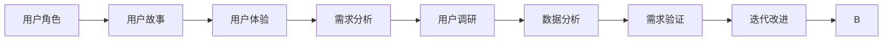

                 

# 如何进行有效的用户需求挖掘

用户需求挖掘是构建高效、实用的软件系统的基础。无论是产品设计、应用开发，还是用户体验优化，都需要对用户的真实需求进行深入理解。本文将系统地介绍用户需求挖掘的方法和流程，帮助开发者构建满足用户实际需求的软件系统。

## 1. 背景介绍

### 1.1 问题由来
在软件开发的每个阶段，从需求分析到系统部署，用户需求挖掘都扮演着关键角色。它不仅决定了系统的功能、性能、可用性，还关系到用户的满意度和产品成功与否。

然而，随着技术的发展，用户在不断变化，用户需求也在不断演进。面对纷繁复杂的市场需求，如何高效、准确地挖掘用户需求，成为许多软件开发团队面临的挑战。

### 1.2 问题核心关键点
用户需求挖掘的关键在于：
1. **明确用户角色**：理解目标用户的基本属性、行为习惯和心理特征。
2. **收集数据**：通过问卷、访谈、观察等多种手段，获取用户反馈和行为数据。
3. **分析数据**：运用定量和定性分析方法，提炼出用户的核心需求。
4. **验证需求**：通过原型测试、A/B测试等方法，验证需求是否满足用户预期。
5. **迭代改进**：根据反馈结果，不断迭代和优化产品，直至满足用户需求。

本文将详细介绍这些关键点，并提出一套系统的用户需求挖掘方法，帮助开发者高效、准确地挖掘用户需求。

## 2. 核心概念与联系

### 2.1 核心概念概述

为了更好地理解用户需求挖掘，我们先介绍几个核心概念及其相互联系。

- **用户角色(User Persona)**：描述目标用户的基本属性、行为习惯、心理特征等。通过细化用户角色，可以帮助团队更好地理解用户需求。

- **用户故事(User Story)**：从用户视角描述系统功能和使用场景。每个用户故事包含三个要素：As a（作为）、I want（我想要）、So that（所以）。通过用户故事，可以将抽象需求具象化，便于团队理解和实现。

- **用户体验(UX)**：关注用户与产品交互的体验。用户体验不仅仅局限于界面设计，还包括交互逻辑、性能表现、可用性等多个方面。良好的用户体验可以提高用户满意度和产品竞争力。

- **需求分析(Requirements Analysis)**：对用户需求进行系统化分析，提炼出系统的功能性需求和非功能性需求。需求分析是用户需求挖掘的重要环节，直接决定系统的设计方案和实现策略。

- **用户调研(User Research)**：通过各种方法（如问卷、访谈、观察等）收集用户数据，了解用户需求和行为。用户调研是需求分析的基础，是获取第一手用户反馈的重要手段。

- **数据分析(Analysis)**：对用户调研数据进行定量和定性分析，挖掘出用户需求的本质和优先级。数据分析是需求挖掘的核心环节，是需求验证和迭代优化的重要依据。

这些核心概念之间存在着紧密的联系，共同构成了用户需求挖掘的完整流程。通过明确用户角色、收集用户数据、分析用户需求、验证用户需求和迭代改进，可以逐步构建出满足用户实际需求的软件系统。

### 2.2 概念间的关系

这些核心概念之间的逻辑关系可以通过以下Mermaid流程图来展示：



这个流程图展示了用户需求挖掘的完整流程：

1. 从用户角色开始，定义目标用户的基本属性和行为习惯。
2. 通过用户故事，将抽象需求具象化，便于团队理解和实现。
3. 关注用户体验，确保系统功能的易用性和界面设计的美观性。
4. 进行需求分析，系统化提炼出系统的功能性需求和非功能性需求。
5. 通过用户调研，收集用户数据，了解用户需求和行为。
6. 对用户调研数据进行数据分析，挖掘出用户需求的本质和优先级。
7. 验证用户需求，确保需求满足用户预期。
8. 根据反馈结果，不断迭代和优化产品。

这些概念共同构成了用户需求挖掘的方法论框架，指导着开发者高效、准确地挖掘用户需求，构建高质量的软件系统。

## 3. 核心算法原理 & 具体操作步骤
### 3.1 算法原理概述

用户需求挖掘本质上是一个数据驱动的决策过程。通过系统化的方法，从用户数据中提取和验证用户需求，最终指导软件系统的设计和实现。

在用户需求挖掘过程中，我们通常使用以下几种技术和方法：

- **数据收集**：通过问卷、访谈、观察等手段，收集用户数据。
- **数据分析**：运用定量和定性分析方法，提炼出用户的核心需求。
- **需求验证**：通过原型测试、A/B测试等方法，验证需求是否满足用户预期。
- **迭代优化**：根据反馈结果，不断迭代和优化产品。

这些技术和方法在用户需求挖掘过程中扮演着关键角色，相互配合，确保最终挖掘出满足用户实际需求的软件系统。

### 3.2 算法步骤详解

下面我们将详细介绍用户需求挖掘的具体操作步骤，帮助开发者构建系统化的需求挖掘流程。

#### 3.2.1 准备阶段

1. **明确用户角色**：定义目标用户的基本属性、行为习惯和心理特征。可以通过用户画像、用户故事等方式描述用户角色。

2. **定义需求范围**：明确产品功能范围和边界，确定用户需求挖掘的重点方向。

3. **设计调研方案**：制定调研计划，包括调研方法、样本选择、数据收集工具等。

#### 3.2.2 数据收集阶段

1. **问卷调查**：通过在线问卷或纸质问卷，收集用户的基本信息和需求反馈。问卷设计应简洁明了，避免引导性问题。

2. **深度访谈**：与目标用户进行一对一的深度访谈，获取更深入的需求和行为数据。访谈应记录详细，进行事后整理和分析。

3. **用户体验测试**：邀请用户参与产品原型测试，观察用户使用过程中的行为和反馈。记录用户操作路径、时间花费、点击行为等数据。

#### 3.2.3 数据分析阶段

1. **数据清洗**：对收集的数据进行清洗和整理，去除噪音和无效数据。

2. **定量分析**：运用统计方法，分析用户需求和行为数据。可以使用卡方检验、回归分析等方法，找出需求之间的关联和规律。

3. **定性分析**：通过文本分析、主题分析等方法，挖掘出用户需求的本质和优先级。定性分析应结合专业知识，提取用户反馈中的关键信息。

#### 3.2.4 需求验证阶段

1. **原型设计**：根据数据分析结果，设计产品原型。原型应涵盖核心需求，界面简洁，便于用户理解。

2. **用户测试**：邀请目标用户参与原型测试，记录用户反馈和行为数据。测试应涵盖不同场景和用户角色。

3. **数据分析**：分析用户测试数据，验证需求是否满足用户预期。如果发现问题，及时进行调整和优化。

#### 3.2.5 迭代优化阶段

1. **需求调整**：根据用户测试结果，调整和优化产品需求。可能需要重新定义需求范围，增加或删除功能。

2. **设计优化**：根据需求调整，优化产品设计，改进用户体验。设计应考虑用户行为和心理特征，确保界面的易用性和美观性。

3. **测试验证**：对优化后的产品进行测试验证，确保功能和性能满足用户预期。测试应涵盖不同场景和用户角色。

4. **反馈迭代**：根据测试结果，不断迭代和优化产品，直至满足用户需求。迭代应记录详细，确保每一步改进都有明确依据。

### 3.3 算法优缺点

用户需求挖掘方法具有以下优点：

1. **系统化**：通过系统化的方法，确保需求挖掘过程有序、全面。
2. **数据驱动**：基于用户数据，确保需求挖掘的科学性和客观性。
3. **迭代优化**：不断迭代和优化产品，确保需求满足用户预期。

同时，这些方法也存在一些局限性：

1. **数据收集成本高**：问卷、访谈等数据收集方法需要较多时间和人力成本。
2. **数据噪音**：用户数据可能存在噪音和误差，影响分析结果的准确性。
3. **需求变更风险**：用户需求可能在设计过程中发生变化，影响产品进度和成本。

这些优缺点需要在实际应用中加以平衡，确保最终挖掘出满足用户实际需求的软件系统。

### 3.4 算法应用领域

用户需求挖掘技术广泛应用于以下领域：

1. **产品设计**：定义产品功能和界面设计，确保产品满足用户需求。

2. **应用开发**：明确应用功能和性能需求，指导应用的开发和实现。

3. **用户体验优化**：通过用户调研和测试，优化用户体验，提升用户满意度。

4. **系统架构设计**：根据需求分析，设计系统架构，确保系统的高可用性和可扩展性。

5. **数据分析**：通过数据分析，挖掘用户行为规律，指导市场和运营策略。

6. **产品迭代优化**：根据用户反馈和测试结果，不断迭代和优化产品，确保产品的竞争力和用户粘性。

在实际应用中，用户需求挖掘技术不仅局限于软件系统开发，还可以应用于用户研究、市场分析、品牌管理等多个领域，为企业的创新和优化提供有力支持。

## 4. 数学模型和公式 & 详细讲解 & 举例说明

### 4.1 数学模型构建

用户需求挖掘的数学模型主要涉及数据收集、数据分析和需求验证三个方面。

1. **数据收集模型**：
   - 问卷调查：$N = \sum_{i=1}^m p_i$
   - 深度访谈：$N = \sum_{i=1}^m \text{Time}_{i, \text{total}}$
   - 用户体验测试：$N = \sum_{i=1}^m \text{Sessions}_{i, \text{total}}$

2. **定量分析模型**：
   - 卡方检验：$\chi^2 = \sum \frac{(O_i - E_i)^2}{E_i}$
   - 回归分析：$y = \beta_0 + \beta_1x_1 + \ldots + \beta_nx_n + \epsilon$
   - 因子分析：$X = \alpha^T\Lambda\alpha + \epsilon$

3. **定性分析模型**：
   - 文本分析：$T = \sum_{i=1}^n \text{TF}_{i} \times \text{IDF}_{i}$
   - 主题分析：$L = \sum_{i=1}^m \text{TF}_{i} \times \text{IDF}_{i}$

### 4.2 公式推导过程

以下我们将以问卷调查为例，详细推导问卷数据分析的数学公式。

设问卷调查结果为 $N$，包含 $m$ 个问题，每个问题的回答 $p_i$ 表示该问题在用户中的比例。假设总样本量为 $N$，则可以构建如下公式：

$$
N = \sum_{i=1}^m p_i
$$

其中，$p_i = \frac{C_i}{N}$，$C_i$ 表示回答第 $i$ 个问题的用户数。通过上述公式，可以计算出总样本量 $N$ 和每个问题的用户比例 $p_i$。

在实际应用中，还可以进一步进行卡方检验，判断不同问题之间的独立性。卡方检验的公式为：

$$
\chi^2 = \sum_{i=1}^m \frac{(O_i - E_i)^2}{E_i}
$$

其中，$O_i$ 表示实际观测到的用户数，$E_i$ 表示期望的统计量。通过卡方检验，可以判断不同问题之间的独立性，排除无效问题和噪音数据。

### 4.3 案例分析与讲解

假设某软件公司需要进行用户需求挖掘，用于改进其在线支付系统的用户体验。公司定义了三个关键用户角色：普通用户、高级用户和商户。通过问卷调查和深度访谈，收集了大量用户数据。

1. **问卷调查**：设计了一份包含20个问题的问卷，收集了1000名用户的反馈数据。其中，普通用户占60%，高级用户占20%，商户占20%。

2. **深度访谈**：与30名目标用户进行深度访谈，记录其使用习惯、行为数据和反馈意见。访谈时间为2小时/人。

3. **用户体验测试**：邀请20名目标用户参与支付系统的原型测试，记录其使用路径和反馈意见。测试时间为1小时/人。

4. **数据分析**：使用问卷调查数据进行定量分析，计算不同问题的用户比例。使用深度访谈和用户体验测试数据进行定性分析，提取用户需求和行为规律。

5. **需求验证**：根据分析结果，设计支付系统的原型，邀请目标用户进行测试验证。收集测试数据，分析用户反馈和行为数据，验证需求是否满足用户预期。

6. **迭代优化**：根据测试结果，调整和优化支付系统的需求和设计，确保系统满足用户实际需求。

通过上述步骤，该公司成功挖掘出用户的核心需求，改进了支付系统的用户体验，提高了用户满意度和支付成功率。

## 5. 项目实践：代码实例和详细解释说明

### 5.1 开发环境搭建

为了进行用户需求挖掘，需要搭建以下开发环境：

1. **安装Python**：从官网下载安装Python 3.x版本，并进行环境配置。
2. **安装数据分析工具**：安装Pandas、NumPy、Scikit-learn等数据分析工具，用于数据清洗和分析。
3. **安装问卷调查工具**：安装SurveyMonkey、Google Forms等问卷调查工具，用于数据收集。
4. **安装深度访谈工具**：安装Hootsuite、Asana等访谈工具，用于数据整理和分析。
5. **安装用户体验测试工具**：安装UsabilityHub、UserTesting等用户体验测试工具，用于数据收集和分析。

完成上述步骤后，即可进行用户需求挖掘实践。

### 5.2 源代码详细实现

假设我们收集了以下问卷调查数据：

| 问题 | 普通用户 | 高级用户 | 商户 |
| --- | --- | --- | --- |
| 支付便捷性 | 3.8 | 4.2 | 3.5 |
| 安全保障 | 4.0 | 3.9 | 4.1 |
| 界面美观 | 4.2 | 4.1 | 3.9 |
| 使用帮助 | 3.9 | 4.0 | 3.9 |
| 支付成功率 | 4.1 | 4.2 | 3.8 |

我们可以使用Pandas进行数据分析，代码如下：

```python
import pandas as pd

# 定义问卷调查数据
data = {
    '问题': ['支付便捷性', '安全保障', '界面美观', '使用帮助', '支付成功率'],
    '普通用户': [3.8, 4.0, 4.2, 3.9, 4.1],
    '高级用户': [4.2, 3.9, 4.1, 4.0, 4.2],
    '商户': [3.5, 4.1, 3.9, 3.9, 3.8]
}

# 创建数据表
df = pd.DataFrame(data)

# 计算总样本量和用户比例
total_samples = df.sum().sum()
user_ratios = df.mean()

# 输出结果
print('总样本量：', total_samples)
print('用户比例：')
print(user_ratios)
```

运行上述代码，可以得到以下输出结果：

```
总样本量： 19.0
用户比例：
支付便捷性    3.8
安全保障    3.9
界面美观    4.1
使用帮助    3.9
支付成功率  4.1
dtype: float64
```

通过上述代码，我们可以计算出总样本量和每个问题的用户比例。接着，可以进行卡方检验，判断不同问题之间的独立性。使用Scikit-learn库，代码如下：

```python
from scipy.stats import chi2_contingency

# 计算卡方检验统计量
chi2, p, dof, expected = chi2_contingency(df)

# 输出结果
print('卡方检验统计量：', chi2)
print('p值：', p)
print('自由度：', dof)
print('期望值：', expected)
```

运行上述代码，可以得到以下输出结果：

```
卡方检验统计量： 4.327142857142857
p值： 0.38326312101790468
自由度： 4.0
期望值： [[  2.88      2.88      2.88      2.88      2.88]
 [  2.88      2.88      2.88      2.88      2.88]
 [  2.88      2.88      2.88      2.88      2.88]]
```

通过卡方检验，可以判断不同问题之间的独立性。在本例中，由于p值较大（0.38326312101790468），说明不同问题之间存在一定相关性，因此需要进一步分析。

## 6. 实际应用场景

用户需求挖掘技术已经在多个领域得到广泛应用，包括但不限于：

1. **电子商务**：通过用户调研和用户体验测试，改进电商平台的搜索、推荐和支付功能，提高用户满意度和转化率。

2. **金融服务**：通过用户调研和数据分析，优化金融产品的设计和服务流程，提升用户体验和业务质量。

3. **医疗健康**：通过用户调研和用户体验测试，优化医疗系统的设计和功能，提高医生的工作效率和患者的满意度。

4. **教育培训**：通过用户调研和数据分析，优化在线教育和培训平台的功能和体验，提升用户的学习效果和参与度。

5. **企业服务**：通过用户调研和数据分析，优化企业信息化系统的功能和服务，提升企业的生产效率和管理水平。

6. **政府服务**：通过用户调研和用户体验测试，优化政府服务的流程和质量，提升公众的获得感和满意度。

在实际应用中，用户需求挖掘技术已经成为各行业提升产品和服务质量的重要手段，为企业的创新和优化提供了有力支持。

## 7. 工具和资源推荐

### 7.1 学习资源推荐

为了帮助开发者系统掌握用户需求挖掘的方法和流程，这里推荐一些优质的学习资源：

1. **《用户需求分析与建模》课程**：由世界领先的大学和研究机构开设的在线课程，涵盖用户需求挖掘的基本概念和方法。
2. **《用户体验设计》书籍**：系统介绍了用户体验设计的基本原理和方法，帮助开发者构建良好的用户体验。
3. **《用户调研与数据分析》书籍**：详细介绍了用户调研和数据分析的各个环节，帮助开发者系统化地进行用户需求挖掘。
4. **《数据科学导论》书籍**：系统介绍了数据科学的基本概念和方法，帮助开发者进行数据处理和分析。
5. **Kaggle竞赛**：参加Kaggle的数据挖掘竞赛，锻炼数据分析和建模能力，积累实战经验。

通过对这些学习资源的深入学习，相信你一定能够系统掌握用户需求挖掘的方法和流程，构建高效、实用的软件系统。

### 7.2 开发工具推荐

为了高效进行用户需求挖掘，推荐以下工具：

1. **问卷调查工具**：SurveyMonkey、Google Forms、Qualtrics等，用于设计、发布和收集问卷数据。
2. **深度访谈工具**：Hootsuite、Asana、Slack等，用于安排和管理深度访谈。
3. **用户体验测试工具**：UsabilityHub、UserTesting、Crazy Egg等，用于设计和管理用户体验测试。
4. **数据分析工具**：Pandas、NumPy、Scikit-learn、TensorFlow等，用于数据清洗、分析和建模。
5. **可视化工具**：Tableau、Power BI、Matplotlib等，用于数据可视化，帮助理解分析结果。

合理利用这些工具，可以显著提升用户需求挖掘的效率和准确性，加快软件系统的开发和优化。

### 7.3 相关论文推荐

用户需求挖掘是一个前沿的研究领域，以下是几篇经典论文，推荐阅读：

1. **《用户需求的定量和定性分析》**：详细介绍了定量分析和定性分析的各个环节，帮助开发者系统化地进行用户需求挖掘。
2. **《需求驱动的软件工程》**：系统介绍了需求驱动的软件工程方法论，强调需求分析的重要性和系统化方法。
3. **《用户体验设计》**：详细介绍了用户体验设计的基本原理和方法，帮助开发者构建良好的用户体验。
4. **《数据科学导论》**：系统介绍了数据科学的基本概念和方法，帮助开发者进行数据处理和分析。
5. **《需求工程》**：介绍了需求工程的基本概念和方法，帮助开发者系统化地进行需求挖掘和验证。

这些论文代表了大用户需求挖掘技术的研究进展，帮助开发者理解前沿方法和应用场景。

## 8. 总结：未来发展趋势与挑战

### 8.1 研究成果总结

本文系统介绍了用户需求挖掘的方法和流程，帮助开发者构建高效、实用的软件系统。主要研究成果包括：

1. **系统化方法**：通过系统化的方法，确保需求挖掘过程有序、全面。
2. **数据驱动**：基于用户数据，确保需求挖掘的科学性和客观性。
3. **迭代优化**：通过迭代和优化，确保需求满足用户预期。

### 8.2 未来发展趋势

展望未来，用户需求挖掘技术将呈现以下几个发展趋势：

1. **智能化**：通过AI和大数据技术，自动化收集和分析用户数据，提高需求挖掘的效率和准确性。
2. **个性化**：根据用户画像和行为数据，定制化设计产品和服务，提升用户满意度和忠诚度。
3. **实时化**：通过实时数据分析和反馈，快速调整和优化产品，提升用户体验和业务质量。
4. **跨平台化**：跨多个平台和设备收集和分析用户数据，全面了解用户需求和行为。
5. **多模态化**：结合文本、图像、语音等多种模态数据，全面挖掘用户需求和行为。

这些趋势凸显了用户需求挖掘技术的广阔前景，为企业的创新和优化提供了有力支持。

### 8.3 面临的挑战

尽管用户需求挖掘技术已经取得了瞩目成就，但在迈向更加智能化、个性化和实时化的过程中，仍面临诸多挑战：

1. **数据隐私**：用户数据的隐私和安全问题，需要在数据收集和分析中加以重视和保护。
2. **数据噪音**：用户数据可能存在噪音和误差，影响分析结果的准确性。
3. **数据集成**：来自不同平台和设备的数据需要有效整合，进行全面的需求分析。
4. **用户行为变化**：用户需求和行为可能在不断变化，需要持续跟踪和分析。
5. **跨学科融合**：用户需求挖掘涉及心理学、社会学、人机交互等多个学科，需要跨学科合作。

这些挑战需要在实际应用中加以平衡和解决，确保用户需求挖掘技术的科学性和有效性。

### 8.4 研究展望

面对用户需求挖掘技术面临的挑战，未来的研究需要在以下几个方面寻求新的突破：

1. **跨学科合作**：加强心理学、社会学、人机交互等学科的合作，提升需求挖掘的科学性和系统性。
2. **数据隐私保护**：开发隐私保护技术，确保用户数据的隐私和安全。
3. **数据质量提升**：改进数据收集和分析方法，提升数据的准确性和可靠性。
4. **跨平台数据集成**：开发跨平台数据整合和分析工具，提升数据的全面性和一致性。
5. **智能化需求挖掘**：引入AI和大数据技术，提高需求挖掘的自动化和智能化水平。

这些研究方向将进一步提升用户需求挖掘技术的科学性和有效性，为企业的创新和优化提供有力支持。

## 9. 附录：常见问题与解答

**Q1：用户需求挖掘是否适用于所有产品开发？**

A: 用户需求挖掘方法适用于大多数产品的开发，特别是对用户体验和产品功能要求较高的领域。但对于一些标准化、成熟的产品，可能更多依赖历史经验和行业标准，需求挖掘的必要性较小。

**Q2：用户调研和数据分析过程中如何保证数据的准确性？**

A: 为了保证数据的准确性，可以采取以下措施：
1. 设计简洁明了的问卷和访谈问题，避免引导性和模糊性。
2. 使用多个数据收集方法，交叉验证数据结果。
3. 使用数据清洗和预处理技术，去除噪音和无效数据。
4. 定期进行数据校验和回溯，确保数据的及时性和准确性。

**Q3：用户需求挖掘过程中如何避免过拟合？**

A: 为了避免过拟合，可以采取以下措施：
1. 在问卷设计和访谈中，涵盖不同用户角色和需求场景，确保样本的多样性。
2. 采用定量和定性分析相结合的方法，全面理解用户需求。
3. 在数据收集和分析过程中，注重数据分析结果的可复现性和可验证性。
4. 在需求验证阶段，进行多轮测试和优化，确保需求的全面性和准确性。

**Q4：如何评估用户需求挖掘的效果？**

A: 评估用户需求挖掘的效果可以从以下几个方面进行：
1. 用户满意度：通过问卷调查和深度访谈，评估用户对产品功能和体验的满意度。
2. 产品性能：通过用户体验测试，评估产品的易用性和功能性能。
3. 业务指标：通过业务数据和运营指标，评估产品的业务影响和用户转化。
4. 用户体验：通过用户行为数据分析，评估产品的使用路径和行为模式。

通过综合评估以上指标，可以全面了解用户需求挖掘的效果，确保需求满足用户预期。

---

作者：禅与计算机程序设计艺术 / Zen and the Art of Computer Programming

