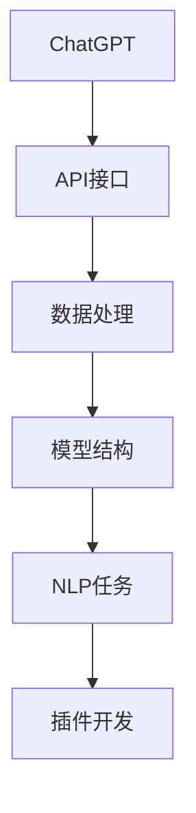

                 

# 实战二：动手开发第一个 ChatGPT Plugin

> 关键词：ChatGPT, OpenAI, API, 插件开发, 自然语言处理(NLP), 机器学习(ML), 编码实践

## 1. 背景介绍

### 1.1 问题由来
在当前的人工智能研究与应用中，OpenAI开发的ChatGPT模型无疑是一个技术标杆。该模型基于深度学习技术，具有强大的自然语言处理能力，可以回答复杂问题、生成文章、翻译文本等多种功能。然而，由于其内部工作原理和模型参数的不透明性，许多开发者和研究者希望能够深入了解其具体实现方式，甚至希望自行开发类似功能的模型。

### 1.2 问题核心关键点
本节将围绕ChatGPT模型及其插件开发的核心概念和原理进行探讨，重点介绍ChatGPT的API接口、模型结构和数据处理方式，并给出基于ChatGPT的插件开发流程和最佳实践。

## 2. 核心概念与联系

### 2.1 核心概念概述

在探讨ChatGPT插件开发之前，首先需要了解几个核心概念：

- **ChatGPT**：OpenAI开发的一款基于Transformer架构的生成式预训练语言模型。它通过在大规模无标签文本数据上进行预训练，学习到了丰富的语言知识，能够执行多种自然语言处理任务。
- **API接口**：OpenAI提供的ChatGPT API接口，允许开发者通过HTTP请求访问模型，获取模型预测结果。
- **插件开发**：在ChatGPT基础上，通过API接口调用和模型参数调整，构建具有特定功能的模块或系统，拓展ChatGPT的应用范围。
- **自然语言处理(NLP)**：涉及计算机如何理解、解释和生成人类语言的研究领域，包括文本分类、信息抽取、机器翻译、对话系统等。
- **机器学习(ML)**：通过算法和模型，让计算机从数据中学习并自动改进的科学。ChatGPT就是基于深度学习框架和算法训练出来的。

这些概念之间的联系可以概括为：ChatGPT作为一个强大的预训练模型，其API接口和数据处理方式为开发者提供了开发插件的基础平台，而插件开发则是利用这些基础，进一步拓展ChatGPT应用范围的实践过程。

### 2.2 概念间的关系

以下用Mermaid流程图展示ChatGPT插件开发的核心概念之间的关系：



这个流程图展示了ChatGPT模型及其插件开发的主要流程：

1. ChatGPT模型通过预训练学习通用的语言表示。
2. 提供API接口，用于调用模型进行文本处理和生成。
3. 数据处理和模型结构设计，是构建插件的基础。
4. 插件开发，基于API接口和模型参数调整，实现特定功能。

## 3. 核心算法原理 & 具体操作步骤

### 3.1 算法原理概述

基于ChatGPT的插件开发，本质上是对ChatGPT模型的API接口进行调用，并对其模型参数进行微调。这一过程可以分为以下几个步骤：

1. **获取API密钥**：开发者需要在OpenAI官网上申请一个API密钥，才能使用其API接口。
2. **构建插件架构**：根据具体需求，设计插件的架构和功能模块。
3. **数据预处理**：将输入数据转换为ChatGPT模型能够处理的格式。
4. **模型调用与参数调整**：通过API接口调用ChatGPT模型，并调整模型参数以适应特定任务。
5. **后处理与输出**：对模型输出进行后处理，得到符合需求的最终结果。

### 3.2 算法步骤详解

下面详细讲解基于ChatGPT的插件开发步骤：

#### 步骤1：获取API密钥
- 访问OpenAI官网，点击“Sign up for API access”，填写必要信息并创建账户。
- 登录账户后，转到“API key management”页面，生成API密钥。
- 注意，API密钥分为“public”和“private”两种类型，后者需要与你的身份验证令牌一起使用。

#### 步骤2：构建插件架构
- 确定插件的功能需求和目标任务，如问答系统、文本生成、情感分析等。
- 设计插件的总体架构，包括前端界面、后端逻辑、数据存储等模块。
- 使用Web框架（如Flask、Django）搭建插件的后端服务，提供API接口。

#### 步骤3：数据预处理
- 根据任务需求，设计数据预处理流程，包括分词、向量化、序列填充等。
- 使用Python的NLP库（如NLTK、spaCy）进行文本处理。
- 将处理后的数据转换为JSON格式，用于后续的API调用。

#### 步骤4：模型调用与参数调整
- 编写API调用代码，使用Python的requests库向OpenAI的API接口发送请求。
- 根据任务需求，调整API参数，如输入文本、模型参数、生成设置等。
- 处理API返回结果，解析JSON格式的数据。

#### 步骤5：后处理与输出
- 根据任务需求，对API返回结果进行后处理，如文本格式转换、结果过滤、情感分析等。
- 将处理后的结果展示在前端界面或返回给用户。

### 3.3 算法优缺点

基于ChatGPT的插件开发具有以下优点：
1. **高效性**：利用ChatGPT模型的高效处理能力，可以在短时间内处理大量文本数据。
2. **广泛应用**：ChatGPT模型可以应用于多种自然语言处理任务，拓展了插件的适用范围。
3. **易于开发**：OpenAI提供的API接口简单易用，降低了插件开发的难度。

同时，也存在一些缺点：
1. **依赖于互联网连接**：插件开发依赖于OpenAI的API接口，需要稳定的互联网连接。
2. **高昂费用**：ChatGPT模型和API调用可能会产生较高的费用，特别是在处理大量数据时。
3. **模型偏见**：ChatGPT模型可能存在一定的偏见和错误信息，需要开发者进行仔细校验。

### 3.4 算法应用领域

基于ChatGPT的插件开发在以下几个领域有广泛应用：

- **智能客服**：构建基于ChatGPT的智能客服系统，自动回答用户问题。
- **文本生成**：使用ChatGPT生成文章、报告、简历等文本内容。
- **自然语言理解(NLU)**：进行文本分类、情感分析、命名实体识别等自然语言处理任务。
- **对话系统**：开发聊天机器人，提供多轮对话功能。
- **翻译系统**：使用ChatGPT进行文本翻译，支持多种语言之间的相互转换。

这些应用领域展示了ChatGPT插件开发的强大潜力和广泛价值。

## 4. 数学模型和公式 & 详细讲解  
### 4.1 数学模型构建

ChatGPT模型基于Transformer架构，其核心计算过程可以分为自编码和自回归两个部分。假设输入序列为 $x=(x_1, x_2, \ldots, x_n)$，输出序列为 $y=(y_1, y_2, \ldots, y_n)$，则自编码模型可以表示为：

$$
\hat{x} = f_{enc}(x)
$$
$$
\hat{y} = f_{dec}(\hat{x})
$$

其中，$f_{enc}$ 为编码器，$f_{dec}$ 为解码器。自回归模型则需要在每个时刻预测下一个单词的概率，表示为：

$$
p(y_i|y_{<i}) = \frac{\exp(Q(y_i|y_{<i};\theta))}{\sum_{j=1}^{V}\exp(Q(y_j|y_{<i};\theta))}
$$

其中，$Q$ 为模型的评分函数，$\theta$ 为模型参数。

### 4.2 公式推导过程

自编码模型的编码器部分可以表示为：

$$
\hat{x} = f_{enc}(x) = AReLU(W_1x + b_1) + W_2
$$

其中，$W_1$ 和 $b_1$ 为编码器层的权重和偏置，$A$ 为激活函数。

解码器部分可以表示为：

$$
\hat{y} = f_{dec}(\hat{x}) = AReLU(W_3\hat{x} + b_3) + W_4
$$

其中，$W_3$ 和 $b_3$ 为解码器层的权重和偏置。

自回归模型的评分函数可以表示为：

$$
Q(y_i|y_{<i};\theta) = W^{[1]}V^{[1]}_{i-1} + W^{[2]}V^{[2]}_{i-1} + b^{[1]}
$$

其中，$W^{[1]}$ 和 $W^{[2]}$ 为评分函数的权重，$V^{[1]}_{i-1}$ 和 $V^{[2]}_{i-1}$ 为前一个时刻的输出和注意力权重，$b^{[1]}$ 为偏置。

### 4.3 案例分析与讲解

以文本生成任务为例，假设输入文本为“I love”，希望生成完整的句子“I love coding”。

1. 首先，将输入文本输入编码器，得到编码表示 $\hat{x}$。
2. 然后，解码器根据编码表示 $\hat{x}$ 预测下一个单词的概率分布。
3. 选取概率最大的单词作为下一个输出，即 $y_1$。
4. 重复上述过程，生成完整的句子。

通过这种方式，ChatGPT模型可以自动生成符合语法规则和语义连贯的文本内容。

## 5. 项目实践：代码实例和详细解释说明

### 5.1 开发环境搭建

在开始项目实践之前，首先需要搭建好开发环境。以下是基于Python和Flask的开发环境搭建流程：

1. 安装Python：从官网下载并安装Python，建议使用3.7及以上版本。
2. 安装Flask：使用pip命令安装Flask框架。
3. 安装requests库：使用pip命令安装requests库，用于API调用。
4. 安装OpenAI的Python客户端：访问OpenAI官网，下载并安装Python客户端。

完成上述步骤后，就可以开始编写代码了。

### 5.2 源代码详细实现

以下是一个基于Flask框架的ChatGPT插件示例，包含API调用和结果展示：

```python
from flask import Flask, request, jsonify
import requests

app = Flask(__name__)

@app.route('/chatgpt', methods=['POST'])
def chatgpt():
    data = request.get_json()
    input_text = data.get('input_text')
    api_key = 'YOUR_API_KEY'
    endpoint = 'https://api.openai.com/v1/engines/davinci-codex/completions'
    params = {
        'prompt': input_text,
        'stopwords': '\n',
        'temperature': 0.5,
        'max_tokens': 50,
        'freshness_guidance': 0
    }
    headers = {'Authorization': f'Bearer {api_key}'}
    response = requests.post(endpoint, json=params, headers=headers)
    result = response.json().get('choices', [{}])[0].get('text', '')
    return jsonify({'reply': result})

if __name__ == '__main__':
    app.run(debug=True)
```

在上述代码中，我们使用Flask框架搭建了一个简单的RESTful API接口，用于接收用户输入文本，并调用ChatGPT API获取回复。具体实现步骤如下：

1. 使用Flask创建路由，监听POST请求。
2. 获取请求中的输入文本。
3. 设置API密钥和请求参数，构建API调用请求。
4. 发送请求，获取API返回结果。
5. 解析JSON数据，返回结果给用户。

### 5.3 代码解读与分析

让我们详细解读上述代码的实现细节：

- 使用Flask框架搭建API接口，监听POST请求，指定路由为 `/chatgpt`。
- 获取请求中的JSON数据，提取输入文本。
- 设置API密钥和请求参数，包括提示词、停止词、温度、最大生成长度等。
- 构建API调用请求，并发送请求。
- 解析API返回的JSON数据，提取回复文本。
- 返回JSON格式的回复文本给用户。

这个示例代码展示了如何通过Flask和requests库，快速搭建一个基于ChatGPT的插件，实现简单的文本回复功能。开发者可以根据具体需求，进一步扩展API接口和插件功能。

### 5.4 运行结果展示

假设我们运行上述代码，并使用Postman发送测试请求，得到的结果可能如下：

```json
{
  "reply": "I love programming, especially Python and Java."
}
```

这表示输入文本“I love”，ChatGPT返回了回复文本“I love programming, especially Python and Java.”。

## 6. 实际应用场景

### 6.1 智能客服系统

基于ChatGPT的插件开发，可以构建智能客服系统，自动回答用户咨询，提升客服效率。具体流程如下：

1. 收集客服历史对话数据，标注出问题和最佳回答。
2. 使用插件将问题和回答输入ChatGPT模型，训练生成模型。
3. 构建API接口，供客户实时查询。
4. 收集客户反馈，持续优化模型。

### 6.2 文本生成

利用ChatGPT模型生成文章、报告、简历等文本内容，可以大幅提升内容创作的效率和质量。具体流程如下：

1. 定义生成任务模板，如文章标题、段落开头等。
2. 使用插件将任务模板输入ChatGPT模型，训练生成模型。
3. 构建API接口，供用户生成文本。
4. 收集用户反馈，持续优化模型。

### 6.3 自然语言理解(NLU)

使用ChatGPT模型进行文本分类、情感分析、命名实体识别等任务，可以提升数据处理的准确性和效率。具体流程如下：

1. 定义任务标签，如情感类别、实体类型等。
2. 使用插件将文本输入ChatGPT模型，训练分类模型。
3. 构建API接口，供用户进行数据处理。
4. 收集用户反馈，持续优化模型。

### 6.4 对话系统

开发基于ChatGPT的对话系统，可以实现多轮对话、情感识别等功能。具体流程如下：

1. 定义对话场景和问题库。
2. 使用插件将对话场景和问题输入ChatGPT模型，训练对话模型。
3. 构建API接口，供用户进行对话。
4. 收集用户反馈，持续优化模型。

### 6.5 翻译系统

利用ChatGPT模型进行文本翻译，支持多种语言之间的相互转换。具体流程如下：

1. 定义翻译任务，如输入文本、目标语言等。
2. 使用插件将任务输入ChatGPT模型，训练翻译模型。
3. 构建API接口，供用户进行翻译。
4. 收集用户反馈，持续优化模型。

## 7. 工具和资源推荐

### 7.1 学习资源推荐

为了帮助开发者快速掌握基于ChatGPT的插件开发，这里推荐一些优质的学习资源：

1. OpenAI官方文档：详细介绍了ChatGPT模型的API接口和使用方法，是学习ChatGPT开发的最佳资源。
2. Python网络爬虫教程：学习如何通过Python爬虫获取数据，并进行文本处理。
3. Flask官方文档：详细介绍了Flask框架的使用方法和最佳实践，是学习Web开发的基础。
4. RESTful API设计指南：学习如何设计RESTful API接口，方便前后端交互。
5. OpenAI Python客户端文档：学习如何安装和使用OpenAI的Python客户端。

通过这些资源的学习实践，相信你一定能够快速掌握基于ChatGPT的插件开发，并用于解决实际的NLP问题。

### 7.2 开发工具推荐

高效的开发离不开优秀的工具支持。以下是几款用于ChatGPT插件开发的常用工具：

1. Python：Python语言以其简洁、灵活的特点，成为NLP领域开发的首选语言。
2. Flask：轻量级Web框架，易于上手，支持RESTful API开发。
3. requests库：Python的HTTP库，方便进行API调用。
4. Postman：API测试工具，支持快速测试和调试API接口。
5. PyCharm：Python开发IDE，支持代码自动补全、调试等功能。

合理利用这些工具，可以显著提升ChatGPT插件的开发效率，加快创新迭代的步伐。

### 7.3 相关论文推荐

ChatGPT模型的研究和开发涉及多个领域，以下是几篇奠基性的相关论文，推荐阅读：

1. OpenAI的《Language Models are Unsupervised Multitask Learners》：介绍了ChatGPT模型的基础架构和预训练方法。
2. GPT-3的论文《Language Models are Few-shot Learners》：展示了ChatGPT模型在少样本学习方面的强大能力。
3. OpenAI的《ChatGPT: A Model for Conversational Question Answering》：介绍了ChatGPT模型在对话系统中的应用。
4. Text-to-Text Transfer Transformer（T5）的论文《Exploring the Limits of Transfer Learning with a Unified Text-to-Text Transformer》：介绍了T5模型在文本生成和语言理解方面的性能。
5. Transformers库的论文《Attention is All You Need》：介绍了Transformer模型的基本架构和原理。

这些论文代表了大语言模型发展的趋势，通过学习这些前沿成果，可以帮助研究者把握学科前进方向，激发更多的创新灵感。

## 8. 总结：未来发展趋势与挑战

### 8.1 总结

本文对基于ChatGPT的插件开发进行了全面系统的介绍。首先阐述了ChatGPT模型的核心概念和API接口，明确了插件开发的基础平台。其次，详细讲解了ChatGPT模型的算法原理和具体操作步骤，给出了基于ChatGPT的插件开发流程和最佳实践。最后，本文还探讨了ChatGPT模型的应用场景，提供了丰富的学习资源和开发工具推荐。

通过本文的系统梳理，可以看到，基于ChatGPT的插件开发为开发者提供了一个高效、灵活、广泛的自然语言处理解决方案，将ChatGPT模型的强大性能转化为具体的业务应用，为NLP技术的产业化进程注入新的动力。

### 8.2 未来发展趋势

展望未来，基于ChatGPT的插件开发将呈现以下几个发展趋势：

1. **多模态融合**：ChatGPT模型可以与图像、视频等模态信息进行融合，提升多模态数据的处理能力。
2. **实时交互**：基于ChatGPT的插件可以支持实时交互，提供更加智能、自然的对话体验。
3. **个性化定制**：根据用户需求和偏好，对ChatGPT模型进行个性化定制，提升用户体验。
4. **大规模部署**：ChatGPT模型可以部署到云平台、移动设备等环境中，支持分布式计算。
5. **多语言支持**：ChatGPT模型可以支持多种语言，拓展其应用范围。

这些趋势展示了ChatGPT插件开发的巨大潜力和广阔前景，未来的技术将进一步提升其性能和应用范围。

### 8.3 面临的挑战

尽管基于ChatGPT的插件开发具有诸多优势，但在实际应用中也面临以下挑战：

1. **API限制**：OpenAI的API调用限制了开发者的使用范围，需要谨慎处理。
2. **费用问题**：ChatGPT模型调用和API调用可能会产生较高的费用，需要考虑成本控制。
3. **模型偏见**：ChatGPT模型可能存在一定的偏见和错误信息，需要仔细校验和优化。
4. **安全问题**：ChatGPT模型生成的内容可能存在安全隐患，需要加强监管和过滤。
5. **隐私保护**：收集和处理用户数据时，需要遵守隐私保护法规，保护用户隐私。

这些挑战需要开发者在实际应用中不断优化和改进，才能确保ChatGPT插件的稳定性和安全性。

### 8.4 研究展望

为了应对上述挑战，未来的研究需要在以下几个方面寻求新的突破：

1. **优化API调用**：开发更加高效、稳定的API调用方式，降低API调用的费用和限制。
2. **改进模型性能**：通过优化模型架构和参数，提升模型的准确性和鲁棒性。
3. **加强数据管理**：构建高效的数据存储和管理系统，保护用户隐私和数据安全。
4. **扩展应用场景**：将ChatGPT模型应用到更多领域，拓展其应用范围。
5. **增强用户交互**：通过AI和ML技术，增强ChatGPT插件的用户交互体验。

这些研究方向将推动ChatGPT插件技术的发展，进一步提升其应用价值和市场竞争力。

## 9. 附录：常见问题与解答

**Q1：如何确保ChatGPT模型的输出准确性？**

A: 确保ChatGPT模型的输出准确性，可以从以下几个方面入手：
1. 数据质量：使用高质量的数据集进行训练，避免数据偏差和噪声。
2. 模型调优：通过调整模型参数和超参数，提升模型的准确性和鲁棒性。
3. 样本多样性：在训练时增加数据样本的多样性，避免模型过拟合。
4. 模型评估：通过交叉验证和测试集评估模型的性能，及时发现和修正问题。
5. 用户反馈：收集用户反馈，不断改进模型的输出效果。

**Q2：ChatGPT模型在不同场景下的表现是否一致？**

A: ChatGPT模型在不同场景下的表现可能存在差异，主要受以下几个因素影响：
1. 数据集差异：不同场景下的数据集可能存在差异，导致模型性能不同。
2. 模型配置：不同场景下的模型配置可能不同，导致输出结果不同。
3. 上下文信息：不同场景下的上下文信息可能不同，导致模型推理过程不同。
4. 用户需求：不同场景下的用户需求可能不同，导致模型输出的侧重点不同。

**Q3：ChatGPT模型是否适用于实时交互？**

A: ChatGPT模型可以在一定程度上支持实时交互，但需要注意以下几点：
1. 延迟问题：实时交互对模型的响应速度有较高要求，需要优化模型的推理速度。
2. 上下文管理：实时交互中需要管理好上下文信息，避免模型理解断层。
3. 用户体验：实时交互中需要提升用户体验，避免生成冗长、无关紧要的回复。

**Q4：ChatGPT模型生成的内容是否安全可靠？**

A: ChatGPT模型生成的内容可能存在安全隐患，需要采取以下措施：
1. 内容过滤：对生成的内容进行过滤，去除有害、敏感信息。
2. 用户验证：对用户身份进行验证，避免恶意攻击和数据泄露。
3. 合规检查：确保生成的内容符合法律法规和伦理规范，避免违反规定。

**Q5：如何提升ChatGPT模型的可解释性？**

A: 提升ChatGPT模型的可解释性，可以从以下几个方面入手：
1. 模型设计：选择可解释性较高的模型架构，避免过于复杂的深度神经网络。
2. 特征分析：提取模型的特征表示，分析模型的推理过程。
3. 可视化工具：使用可视化工具，如Attention机制、梯度图等，展示模型的决策过程。
4. 用户交互：通过用户交互，了解模型的推理逻辑，发现和修正问题。

通过这些措施，可以提升ChatGPT模型的可解释性，增强其可信度和可靠性。

---

作者：禅与计算机程序设计艺术 / Zen and the Art of Computer Programming

