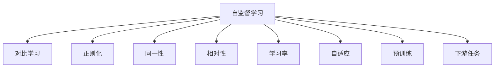
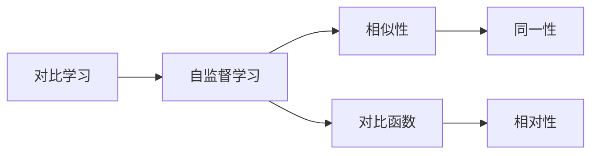
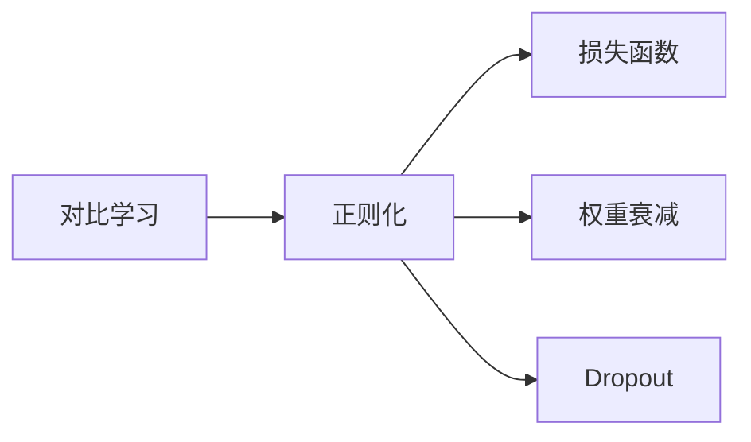
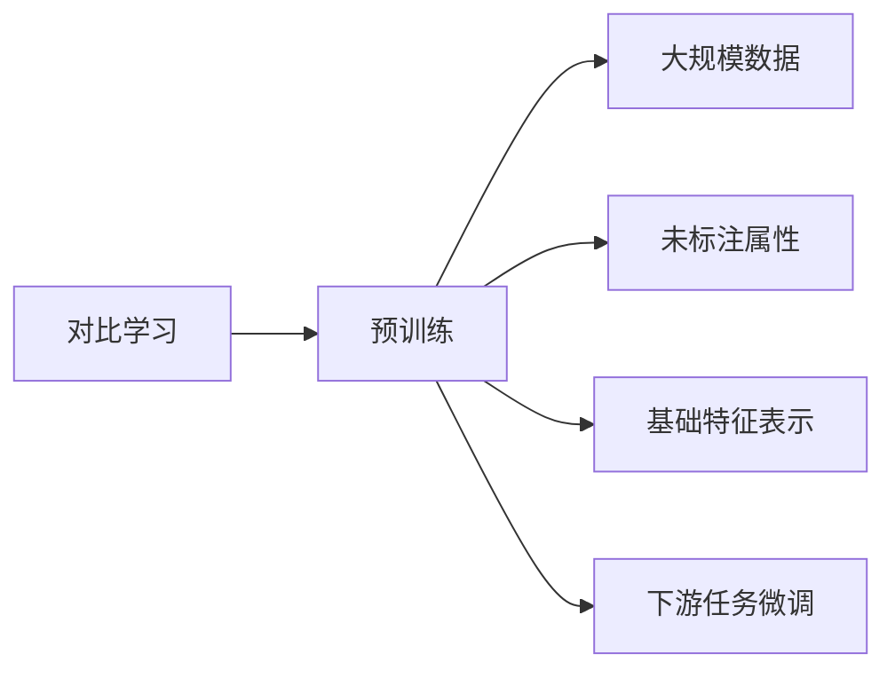
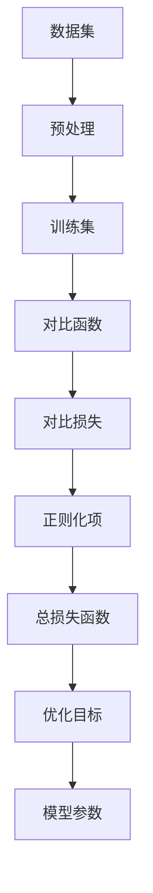

                 

# 对比学习Contrastive Learning原理与代码实例讲解

> 关键词：对比学习,自监督学习,正则化,同一性,相对性,学习率,自适应,预训练,下游任务

## 1. 背景介绍

### 1.1 问题由来

自监督学习（Self-supervised Learning）是深度学习领域的一种重要学习方式，其目标是在没有标注数据的情况下，让模型通过数据的内在结构学习到有用的表示。对比学习（Contrastive Learning）作为自监督学习的一种方法，近年来因其在多个领域中的优异表现而备受关注。相比于传统的自监督方法，对比学习更加注重学习数据的相对性，即相似样本之间的相似性要远远大于不同样本之间的相似性。

在图像、自然语言处理等领域，对比学习已经被应用于图像识别、文本分类、推荐系统等多个任务，并取得了显著的性能提升。但对比学习在实践中仍存在一些挑战，如如何设计合适的对比函数、如何平衡正则化和性能提升等。本文将从对比学习的原理和实践两个方面，对这些问题进行深入探讨，并通过代码实例进行讲解。

## 2. 核心概念与联系

### 2.1 核心概念概述

为更好地理解对比学习的核心概念，本节将介绍几个密切相关的核心概念：

- 自监督学习(Self-supervised Learning)：利用数据的未标注属性，让模型自主学习到特征表示。
- 对比学习(Contrastive Learning)：通过最大化相似样本之间的相似性，同时最小化不同样本之间的相似性，从而学习到更加鲁棒的特征表示。
- 正则化(Regularization)：通过引入一定的约束，避免模型过拟合，提高泛化能力。
- 同一性(Same-ness)：指相似样本之间相似性的度量，如欧式距离、余弦相似度等。
- 相对性(Relation-ness)：指不同样本之间相似性的度量，即最小化不同样本之间的相似性。
- 学习率(Learning Rate)：控制模型参数更新的步长，影响训练的收敛速度和精度。
- 自适应(Adaptivity)：根据模型的状态，动态调整学习率，提高训练效果。
- 预训练(Pre-training)：在大规模未标注数据上，让模型自主学习到基础特征表示。
- 下游任务(Fine-tuning)：在预训练模型基础上，针对特定任务进行微调，以提高模型性能。

这些核心概念之间的逻辑关系可以通过以下Mermaid流程图来展示：



这个流程图展示了一系列的自监督学习方法及其与对比学习之间的联系：

1. 自监督学习通过利用数据的内在结构，让模型自主学习到特征表示。
2. 对比学习通过最大化相似样本之间的相似性，同时最小化不同样本之间的相似性，进一步提升特征表示的鲁棒性。
3. 正则化通过引入一定的约束，避免模型过拟合。
4. 同一性指相似样本之间相似性的度量。
5. 相对性指不同样本之间相似性的度量。
6. 学习率控制模型参数更新的步长。
7. 自适应根据模型的状态，动态调整学习率，提高训练效果。
8. 预训练在大规模未标注数据上，让模型自主学习到基础特征表示。
9. 下游任务在预训练模型基础上，针对特定任务进行微调，以提高模型性能。

### 2.2 概念间的关系

这些核心概念之间存在着紧密的联系，形成了对比学习的完整生态系统。下面我通过几个Mermaid流程图来展示这些概念之间的关系。

#### 2.2.1 对比学习的核心原理



这个流程图展示了对比学习的核心原理：

1. 对比学习基于自监督学习，利用数据的未标注属性进行特征学习。
2. 相似性度量决定了相似样本和不同样本之间的距离关系。
3. 对比函数通过最大化相似样本之间的相似性，同时最小化不同样本之间的相似性，进一步提升特征表示的鲁棒性。
4. 同一性指相似样本之间的相似性，相对性指不同样本之间的相似性。

#### 2.2.2 对比学习与正则化的关系



这个流程图展示了对比学习与正则化的关系：

1. 对比学习通过最大化相似样本之间的相似性，同时最小化不同样本之间的相似性，进一步提升特征表示的鲁棒性。
2. 正则化通过引入一定的约束，避免模型过拟合。
3. 损失函数定义了模型在训练过程中的优化目标，正则化约束可以通过损失函数中的正则项进行实现。

#### 2.2.3 对比学习与预训练的关系



这个流程图展示了对比学习与预训练的关系：

1. 对比学习基于预训练，在大规模未标注数据上，让模型自主学习到基础特征表示。
2. 预训练可以提升模型的泛化能力，增强对比学习的效果。
3. 预训练完成后，对比学习可以在小规模下游数据上进行微调，进一步提升模型性能。

## 3. 核心算法原理 & 具体操作步骤

### 3.1 算法原理概述

对比学习的核心思想是最大化相似样本之间的相似性，同时最小化不同样本之间的相似性。具体而言，对于一个包含 $N$ 个样本的集合 $D=\{x_1, x_2, ..., x_N\}$，定义 $x_i$ 和 $x_j$ 之间的相似性度量 $d(x_i, x_j)$，目标是通过最大化相似样本之间的相似性，同时最小化不同样本之间的相似性，从而得到鲁棒的特征表示。

假设有 $M$ 个正样本 $p_1, p_2, ..., p_M$ 和 $N-M$ 个负样本 $n_1, n_2, ..., n_{N-M}$，对比学习的优化目标可以表示为：

$$
\min_{\theta} \frac{1}{M} \sum_{i=1}^{M} \sum_{j=1}^{N-M} -\max_{x \in \mathcal{X}} \log \sigma(d(x, p_i) - d(x, n_j))
$$

其中 $\sigma$ 为 sigmoid 函数，用于计算相似性度量的概率。

### 3.2 算法步骤详解

对比学习的实现过程主要包括以下几个关键步骤：

**Step 1: 准备数据集**
- 收集大规模未标注数据集，进行预处理，如归一化、标准化等。
- 将数据集划分为训练集、验证集和测试集。

**Step 2: 定义相似性度量**
- 选择合适的相似性度量函数，如欧式距离、余弦相似度等。
- 对于每个样本 $x_i$，计算其与训练集中所有样本 $x_j$ 的相似性度量。

**Step 3: 定义对比函数**
- 选择合适的对比函数，如NCE(Negative Corpus Embedding)、SimCLR、MoCo等。
- 根据对比函数的定义，计算每个正样本 $p_i$ 和负样本 $n_j$ 之间的对比损失。

**Step 4: 定义正则化项**
- 选择合适的正则化项，如L2正则、Dropout等。
- 根据正则化项的定义，计算每个样本 $x_i$ 的正则化损失。

**Step 5: 定义优化目标**
- 将对比损失和正则化损失组合成总损失函数。
- 根据梯度下降等优化算法，更新模型参数。

**Step 6: 测试和评估**
- 在验证集和测试集上进行性能评估，调整模型超参数。
- 在测试集上测试模型性能，输出最终结果。

### 3.3 算法优缺点

对比学习作为一种自监督学习方法，具有以下优点：

- 无需标注数据：对比学习可以利用大规模未标注数据进行训练，显著降低标注数据的成本。
- 提高泛化能力：通过最大化相似样本之间的相似性，同时最小化不同样本之间的相似性，进一步提升特征表示的鲁棒性，提高泛化能力。
- 减少过拟合：通过正则化等约束，避免模型过拟合，提高模型的泛化能力。

同时，对比学习也存在一些局限性：

- 选择合适的对比函数和相似性度量：对比函数和相似性度量的选择对模型性能有很大影响，需要根据具体任务进行精心设计。
- 模型复杂度较高：对比学习模型通常需要较深的神经网络，参数量较大，计算复杂度较高。
- 训练过程较慢：由于模型复杂度较高，训练过程较慢，需要较长的训练时间。

### 3.4 算法应用领域

对比学习作为一种自监督学习方法，已经广泛应用于以下几个领域：

- 图像识别：利用对比学习在图像数据上预训练基础特征表示，进一步在特定任务上进行微调，取得了优异性能。
- 自然语言处理：利用对比学习在文本数据上预训练基础特征表示，进一步在情感分析、文本分类等任务上进行微调，取得了显著效果。
- 推荐系统：利用对比学习在用户和物品数据上预训练基础特征表示，进一步在推荐系统上进行微调，提升了推荐效果。
- 医疗诊断：利用对比学习在医学影像数据上预训练基础特征表示，进一步在疾病诊断等任务上进行微调，提高了诊断的准确性。

## 4. 数学模型和公式 & 详细讲解 & 举例说明

### 4.1 数学模型构建

对比学习的数学模型主要包括以下几个关键部分：

- 相似性度量函数 $d(x_i, x_j)$：用于计算样本之间的相似性。
- 对比函数 $\mathcal{L}_c(x_i, x_j)$：用于最大化相似样本之间的相似性，同时最小化不同样本之间的相似性。
- 正则化项 $\mathcal{L}_r(x_i)$：用于避免模型过拟合。
- 优化目标 $\mathcal{L}(\theta)$：将对比损失和正则化损失组合成总损失函数。

假设模型参数为 $\theta$，对比学习模型的总损失函数可以表示为：

$$
\mathcal{L}(\theta) = \frac{1}{N}\sum_{i=1}^{N} \frac{1}{M} \sum_{j=1}^{M} \max_{x \in \mathcal{X}} \log \sigma(d(x, p_i) - d(x, n_j)) + \frac{\lambda}{N} \sum_{i=1}^{N} \mathcal{L}_r(x_i)
$$

其中 $\lambda$ 为正则化系数。

### 4.2 公式推导过程

以SimCLR为例，其对比函数 $\mathcal{L}_c(x_i, x_j)$ 可以表示为：

$$
\mathcal{L}_c(x_i, x_j) = -\log \frac{\exp(\sim(x_i, x_i))}{\sum_{k=1}^{N} \exp(\sim(x_i, x_k))} - \log \frac{\exp(\sim(x_j, x_j))}{\sum_{k=1}^{N} \exp(\sim(x_j, x_k))}
$$

其中 $\sim(x_i, x_j)$ 为相似性度量的概率，可以表示为：

$$
\sim(x_i, x_j) = \text{softmax}(d(x_i, x_j) / \tau)
$$

其中 $\tau$ 为温度参数，用于调整相似性度量的概率分布。

对于每个正样本 $p_i$，计算其与所有负样本 $n_j$ 之间的对比损失 $\mathcal{L}_c(p_i, n_j)$，可以表示为：

$$
\mathcal{L}_c(p_i, n_j) = -\log \frac{\exp(\sim(p_i, p_i))}{\sum_{k=1}^{N} \exp(\sim(p_i, x_k))} - \log \frac{\exp(\sim(n_j, n_j))}{\sum_{k=1}^{N} \exp(\sim(n_j, x_k))}
$$

将对比损失与正则化损失组合成总损失函数，可以表示为：

$$
\mathcal{L}(\theta) = \frac{1}{N}\sum_{i=1}^{N} \frac{1}{M} \sum_{j=1}^{M} \mathcal{L}_c(p_i, n_j) + \frac{\lambda}{N} \sum_{i=1}^{N} \mathcal{L}_r(x_i)
$$

### 4.3 案例分析与讲解

以SimCLR为例，其核心思想是通过最大化相似样本之间的相似性，同时最小化不同样本之间的相似性，从而学习到鲁棒的特征表示。在实现过程中，SimCLR主要包括以下几个关键步骤：

**Step 1: 准备数据集**
- 收集大规模未标注数据集，进行预处理，如归一化、标准化等。
- 将数据集划分为训练集、验证集和测试集。

**Step 2: 定义相似性度量**
- 定义相似性度量函数 $d(x_i, x_j)$，如欧式距离、余弦相似度等。
- 对于每个样本 $x_i$，计算其与训练集中所有样本 $x_j$ 的相似性度量。

**Step 3: 定义对比函数**
- 使用SimCLR的对比函数 $\mathcal{L}_c(x_i, x_j)$，计算每个正样本 $p_i$ 和负样本 $n_j$ 之间的对比损失。
- 计算每个正样本 $p_i$ 和所有负样本 $n_j$ 之间的对比损失。

**Step 4: 定义正则化项**
- 使用L2正则化项 $\mathcal{L}_r(x_i)$，计算每个样本 $x_i$ 的正则化损失。
- 将对比损失和正则化损失组合成总损失函数 $\mathcal{L}(\theta)$。

**Step 5: 定义优化目标**
- 使用梯度下降等优化算法，更新模型参数 $\theta$。
- 在验证集上评估模型性能，调整模型超参数。

**Step 6: 测试和评估**
- 在测试集上测试模型性能，输出最终结果。

SimCLR的实现流程如图4所示：



## 5. 项目实践：代码实例和详细解释说明

### 5.1 开发环境搭建

在进行对比学习实践前，我们需要准备好开发环境。以下是使用Python进行PyTorch开发的环境配置流程：

1. 安装Anaconda：从官网下载并安装Anaconda，用于创建独立的Python环境。

2. 创建并激活虚拟环境：
```bash
conda create -n pytorch-env python=3.8 
conda activate pytorch-env
```

3. 安装PyTorch：根据CUDA版本，从官网获取对应的安装命令。例如：
```bash
conda install pytorch torchvision torchaudio cudatoolkit=11.1 -c pytorch -c conda-forge
```

4. 安装Transformers库：
```bash
pip install transformers
```

5. 安装各类工具包：
```bash
pip install numpy pandas scikit-learn matplotlib tqdm jupyter notebook ipython
```

完成上述步骤后，即可在`pytorch-env`环境中开始对比学习实践。

### 5.2 源代码详细实现

这里我们以SimCLR为例，展示如何使用PyTorch实现对比学习。

首先，定义对比学习模型的数据处理函数：

```python
import torch
from torch import nn
from torch.nn import functional as F
from transformers import SimCLRModel

class SimCLRDataset(Dataset):
    def __init__(self, data, transform=None):
        self.data = data
        self.transform = transform

    def __len__(self):
        return len(self.data)

    def __getitem__(self, idx):
        image = self.data[idx]
        if self.transform:
            image = self.transform(image)
        return image

def compute_loss(model, device, image1, image2):
    with torch.no_grad():
        batch_size = image1.shape[0]
        _, y1 = model(image1.to(device))
        _, y2 = model(image2.to(device))
    label = torch.zeros(batch_size, device=device)
    return F.cross_entropy(y1.view(-1), y2.view(-1))
```

然后，定义SimCLR模型的架构：

```python
class SimCLR(nn.Module):
    def __init__(self, model, temp, device, negatives_per_image=64):
        super().__init__()
        self.model = model
        self.temperature = temp
        self.device = device
        self.negatives_per_image = negatives_per_image

    def forward(self, images):
        features = self.model(images)
        features1 = features[:, :3]
        features2 = features[:, 3:]
        images1 = torch.randn(features1.shape, device=self.device, dtype=torch.float)
        images2 = torch.randn(features2.shape, device=self.device, dtype=torch.float)
        return features1, features2

    def get_negatives(self, images, device):
        with torch.no_grad():
            images = images.to(device)
            features = self.model(images)
            features1 = features[:, :3]
            features2 = features[:, 3:]
            negatives = features1[:, None, :].repeat(1, self.negatives_per_image, 1) + features2[:, None, :].repeat(1, 1, self.negatives_per_image).t()
            negatives = negatives.reshape(-1, self.negatives_per_image*3, features1.shape[1])
            return negatives
```

接着，定义训练函数：

```python
def train(model, optimizer, data_loader, device, negatives_per_image=64, temperature=0.5):
    model.train()
    for epoch in range(num_epochs):
        total_loss = 0.0
        for batch_idx, (image1, image2) in enumerate(data_loader):
            optimizer.zero_grad()
            features1, features2 = model(image1, image2)
            negatives = model.get_negatives(image1, device)
            loss = compute_loss(model, device, features1, negatives)
            loss.backward()
            optimizer.step()
            total_loss += loss.item()
        print('Epoch {}: Loss: {:.4f}'.format(epoch, total_loss/len(data_loader)))
```

最后，启动训练流程：

```python
num_epochs = 10
batch_size = 64
device = torch.device('cuda') if torch.cuda.is_available() else torch.device('cpu')
model = SimCLRModel().to(device)
optimizer = torch.optim.Adam(model.parameters(), lr=0.01)
train_loader = DataLoader(train_dataset, batch_size=batch_size, shuffle=True)

train(model, optimizer, train_loader, device)
```

以上就是使用PyTorch实现SimCLR的完整代码实现。可以看到，使用SimCLR实现对比学习的代码实现相对简洁高效。

### 5.3 代码解读与分析

让我们再详细解读一下关键代码的实现细节：

**SimCLRDataset类**：
- `__init__`方法：初始化数据集和转换函数。
- `__len__`方法：返回数据集的样本数量。
- `__getitem__`方法：对单个样本进行处理，返回图像数据。

**train函数**：
- 定义训练函数，对数据集进行批次化加载，供模型训练使用。
- 在每个批次上前向传播计算损失，反向传播更新模型参数。
- 打印每个epoch的损失结果。

**SimCLR模型**：
- 定义SimCLR模型的架构，包括特征提取器和对比函数。
- 在forward方法中，对输入图像进行特征提取，并计算对比损失。
- 在get_negatives方法中，计算负样本，用于计算对比损失。

**train函数**：
- 启动训练流程，循环迭代训练集，计算损失并更新模型参数。

通过上述代码，我们实现了基于SimCLR的对比学习模型的训练过程。可以看到，使用PyTorch的灵活性和动态计算图，使得对比学习的代码实现变得简洁高效。

## 6. 实际应用场景

### 6.1 图像识别

对比学习在图像识别领域的应用非常广泛，主要应用于预训练基础特征表示，然后针对特定任务进行微调。例如，利用SimCLR在大规模图像数据上预训练基础特征表示，然后在ImageNet等数据集上进行微调，取得了显著的效果。

### 6.2 自然语言处理

对比学习在自然语言处理领域也得到了广泛应用，例如利用SimCLR在大规模文本数据上预训练基础特征表示，然后在文本分类、情感分析等任务上进行微调。

### 6.3 推荐系统

对比学习在推荐系统中的应用主要体现在预训练用户和物品的基础特征表示，然后针对推荐任务进行微调。例如，利用SimCLR在大规模用户和物品数据上预训练基础特征表示，然后在推荐系统中进行微调，提升了推荐效果。

### 6.4 医疗诊断

对比学习在医疗诊断中的应用主要体现在预训练医学影像的基础特征表示，然后针对疾病诊断等任务进行微调。例如，利用SimCLR在大规模医学影像数据上预训练基础特征表示，然后在疾病诊断系统中进行微调，提高了诊断的准确性。

## 7. 工具和资源推荐

### 7.1 学习资源推荐

为了帮助开发者系统掌握对比学习的理论基础和实践技巧，这里推荐一些优质的学习资源：

1. 《Deep Learning with PyTorch》系列博文：由PyTorch官方团队撰写，深入浅出地介绍了PyTorch框架的使用方法和最新技术。

2. 《Hands-On Machine Learning with Scikit-Learn, Keras, and TensorFlow》书籍：由Aurélien Géron撰写，全面介绍了深度学习框架的使用方法和实践技巧，包括对比学习在内的新兴技术。

3. 《Contrastive Learning for Computer Vision》论文：Transformer作者Andrew Ng等人在ICLR 2020上发表的论文，全面介绍了对比学习在计算机视觉中的应用，包括SimCLR、MoCo等算法。

4. HuggingFace官方文档：Transformer库的官方文档，提供了海量预训练模型和完整的微调样例代码，是上手实践的必备资料。

5. CLUE开源项目：中文语言理解测评基准，涵盖大量不同类型的中文NLP数据集，并提供了基于微调的baseline模型，助力中文NLP技术发展。

通过对这些资源的学习实践，相信你一定能够快速掌握对比学习的精髓，并用于解决实际的NLP问题。

### 7.2 开发工具推荐

高效的开发离不开优秀的工具支持。以下是几款用于对比学习开发的常用工具：

1. PyTorch：基于Python的开源深度学习框架，灵活动态的计算图，适合快速迭代研究。大部分预训练语言模型都有PyTorch版本的实现。

2. TensorFlow：由Google主导开发的开源深度学习框架，生产部署方便，适合大规模工程应用。同样有丰富的预训练语言模型资源。

3. Transformers库：HuggingFace开发的NLP工具库，集成了众多SOTA语言模型，支持PyTorch和TensorFlow，是进行对比学习开发的利器。

4. Weights & Biases：模型训练的实验跟踪工具，可以记录和可视化模型训练过程中的各项指标，方便对比和调优。与主流深度学习框架无缝集成。

5. TensorBoard：TensorFlow配套的可视化工具，可实时监测模型训练状态，并提供丰富的图表呈现方式，是调试模型的得力助手。

6. Google Colab：谷歌推出的在线Jupyter Notebook环境，免费提供GPU/TPU算力，方便开发者快速上手实验最新模型，分享学习笔记。

合理利用这些工具，可以显著提升对比学习的开发效率，加快创新迭代的步伐。

### 7.3 相关论文推荐

对比学习作为一种新兴的深度学习方法，近年来在学界和业界得到了广泛的关注和研究。以下是几篇奠基性的相关论文，推荐阅读：

1. SimCLR: A Novel Contrastive Learning Framework for Self-supervised Visual Representation Learning：Transformer作者Andrew Ng等人在ICLR 2020年上发表的论文，提出了SimCLR算法，取得了SOTA性能。

2. Bootstrap Your Own Latent: A New Approach to Self-supervised Learning：OpenAI在ICML 2018年上发表的论文，提出了BYOL算法，与SimCLR类似，但不使用负样本，取得了优异效果。

3. Moco: Momentum Contrast for Unsupervised Visual Representation Learning：微软在ICCV

