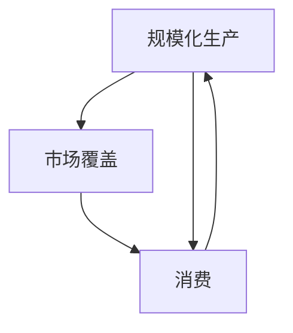

                 

# 工业革命的三个核心：规模化生产、市场覆盖和消费

工业革命是人类历史上一次伟大的技术和社会变革，它极大地改变了人类的生产方式、生活方式和社会结构。在这场革命中，有三个核心要素推动了其发展：规模化生产、市场覆盖和消费。这三个要素相辅相成，共同推动了人类社会进入了一个全新的时代。本文将深入探讨这三个核心要素的原理和应用，以期为现代社会的技术发展提供借鉴。

## 1. 背景介绍

### 1.1 工业革命的起源

工业革命始于18世纪末的英国，最初主要集中在纺织业。当时，英国的纺织业开始采用机械化生产方式，取代了之前的手工生产，极大地提高了生产效率。随后，这一变革迅速扩散到其他行业，如煤炭、钢铁、铁路运输等，最终形成了以机器为基础的大规模生产模式。

### 1.2 技术进步的作用

工业革命的成功离不开一系列关键技术的进步，包括：
- 纺织机的发明：如詹姆斯·哈格里夫斯的珍妮纺纱机、理查德·阿克莱特的纺纱机、爱德蒙·卡特赖特的纺织机等。
- 蒸汽机的发明：如詹姆斯·瓦特的改进型蒸汽机。
- 钢铁生产的改进：如亨利·贝塞默的贝塞麦炼钢法。
- 铁路运输的发展：如乔治·斯蒂芬森的蒸汽机车。
- 电报和电力的应用：如塞缪尔·莫尔斯的发明。

这些技术的进步，极大地提高了生产效率和生产规模，促进了工业革命的全面展开。

## 2. 核心概念与联系

### 2.1 核心概念概述

为了更好地理解工业革命的三个核心要素，本节将介绍几个密切相关的核心概念：

- 规模化生产(Mass Production)：指采用标准化生产方式，大规模、重复地生产同一种产品，以降低生产成本，提高生产效率。
- 市场覆盖(Market Coverage)：指企业通过市场拓展，将产品销售到更广泛的市场，扩大销售范围和市场占有率。
- 消费(Consumption)：指消费者购买和使用产品，满足其需求和欲望的过程。

这三个概念之间存在紧密的联系。规模化生产为市场覆盖和消费提供了物质基础，而市场覆盖和消费又反过来推动了规模化生产的进一步发展。此外，这三个概念还与生产、物流、营销、管理等多个方面紧密相关。

### 2.2 概念间的关系

这些核心概念之间的逻辑关系可以通过以下Mermaid流程图来展示：



这个流程图展示了大规模生产、市场覆盖和消费之间的关系：

1. 规模化生产提供了大量标准化的产品，为市场覆盖和消费提供了物质基础。
2. 市场覆盖的扩大使得更多消费者能够接触到这些产品，促进了消费的增加。
3. 消费的增加又反过来推动了生产规模的进一步扩大，形成了良性循环。

## 3. 核心算法原理 & 具体操作步骤

### 3.1 算法原理概述

工业革命中的规模化生产、市场覆盖和消费，涉及一系列复杂的算法原理和技术手段。以下是对这些核心要素的算法原理进行详细阐述：

#### 3.1.1 规模化生产

规模化生产的关键在于采用标准化生产方式，通过大规模生产同一种产品，以降低单位成本，提高生产效率。常用的算法和技术包括：
- 流水线生产：将生产过程分解为多个环节，每个环节由专门的操作工负责，形成连续的生产流水线。
- 库存管理：通过精确的库存控制，减少原材料和成品的积压，降低库存成本。
- 质量控制：采用严格的质量检测手段，保证产品的质量和一致性。

#### 3.1.2 市场覆盖

市场覆盖的核心在于通过市场拓展，将产品销售到更广泛的市场，扩大销售范围和市场占有率。常用的算法和技术包括：
- 目标市场分析：通过市场调研和数据分析，确定潜在的目标市场和客户群体。
- 营销策略制定：设计合适的营销策略，包括价格、促销、渠道等，以吸引和留住客户。
- 销售渠道拓展：通过开设更多销售点、建立分销网络等方式，增加销售渠道，扩大市场覆盖范围。

#### 3.1.3 消费

消费的关键在于满足消费者的需求和欲望，通过有效的销售和服务，提高消费者的满意度和忠诚度。常用的算法和技术包括：
- 消费者行为分析：通过收集和分析消费者数据，了解其需求和偏好。
- 个性化推荐：根据消费者行为数据，推荐符合其兴趣的产品。
- 客户服务管理：通过建立完善的客户服务体系，及时响应和解决客户问题。

### 3.2 算法步骤详解

#### 3.2.1 规模化生产

1. **生产流程设计**：将生产过程分解为多个环节，每个环节由专门的操作工负责，形成连续的生产流水线。
2. **设备自动化**：采用自动化设备和机器人，减少人力成本，提高生产效率。
3. **库存管理**：通过精确的库存控制，减少原材料和成品的积压，降低库存成本。
4. **质量控制**：采用严格的质量检测手段，保证产品的质量和一致性。

#### 3.2.2 市场覆盖

1. **市场调研**：通过市场调研和数据分析，确定潜在的目标市场和客户群体。
2. **营销策略制定**：设计合适的营销策略，包括价格、促销、渠道等，以吸引和留住客户。
3. **渠道拓展**：通过开设更多销售点、建立分销网络等方式，增加销售渠道，扩大市场覆盖范围。
4. **客户反馈收集**：通过问卷调查、用户评价等方式，收集客户反馈，不断优化产品和服务。

#### 3.2.3 消费

1. **消费者数据收集**：通过各种渠道（如社交媒体、电商平台、线下门店）收集消费者行为数据。
2. **行为分析**：使用机器学习算法分析消费者数据，了解其需求和偏好。
3. **个性化推荐**：根据消费者行为数据，推荐符合其兴趣的产品。
4. **客户服务**：通过建立完善的客户服务体系，及时响应和解决客户问题。

### 3.3 算法优缺点

#### 3.3.1 规模化生产的优缺点

**优点**：
- 大幅降低生产成本，提高生产效率。
- 实现大规模定制化生产，满足不同市场的需求。

**缺点**：
- 对技术和管理水平要求高，需要大量前期投入。
- 对市场变化反应较慢，容易形成路径依赖。

#### 3.3.2 市场覆盖的优缺点

**优点**：
- 扩大销售范围，提高市场占有率。
- 增加品牌曝光度，提升企业声誉。

**缺点**：
- 需要大量营销投入，成本较高。
- 市场竞争激烈，容易受外部环境影响。

#### 3.3.3 消费的优缺点

**优点**：
- 满足消费者需求，提高客户满意度。
- 增加客户忠诚度，提升品牌黏性。

**缺点**：
- 需要大量数据支持，数据隐私和安全问题突出。
- 个性化推荐算法复杂，需要不断优化和更新。

### 3.4 算法应用领域

工业革命的三个核心要素，在现代社会的各个领域都得到了广泛应用，以下是一些典型应用场景：

#### 3.4.1 制造业

- **规模化生产**：如汽车制造、电子产品制造等。采用自动化设备和流水线生产，大幅提高生产效率和产品质量。
- **市场覆盖**：通过全球分销网络，将产品销售到世界各地。
- **消费**：通过电商平台和线下门店，提供多样化的产品选择，满足不同消费者的需求。

#### 3.4.2 零售业

- **市场覆盖**：通过线上和线下渠道，将产品销售到更广泛的市场。
- **消费**：利用大数据和个性化推荐算法，提升消费者的购物体验和满意度。
- **客户服务**：通过线上客服、物流配送等方式，提高客户服务的响应速度和质量。

#### 3.4.3 信息技术

- **市场覆盖**：通过互联网平台，将产品和服务推广到全球市场。
- **消费**：利用数据挖掘和个性化推荐算法，提高用户使用体验和留存率。
- **质量控制**：通过自动化测试和持续集成，确保软件的质量和稳定性。

## 4. 数学模型和公式 & 详细讲解 & 举例说明

### 4.1 数学模型构建

为更好地理解工业革命的三个核心要素，本节将使用数学语言对相关模型进行详细阐述。

#### 4.1.1 规模化生产

假设生产过程由n个环节组成，每个环节的单位成本为c_i（i=1,...,n），则整个生产过程的总成本为：

$$
C = \sum_{i=1}^n c_i
$$

若采用流水线生产，生产速度为v，则总产量为：

$$
P = v \times T
$$

其中T为生产周期。

#### 4.1.2 市场覆盖

假设市场规模为M，目标市场比例为p，则目标市场的规模为：

$$
M_p = M \times p
$$

若采用多渠道销售策略，渠道数为c，每个渠道的市场覆盖率为r_i（i=1,...,c），则总的市场覆盖率为：

$$
R = \sum_{i=1}^c r_i
$$

#### 4.1.3 消费

假设消费者数量为N，单个消费者的消费预算为B，则总消费量为：

$$
C = N \times B
$$

若采用个性化推荐算法，推荐的准确率为α，则推荐带来的额外消费量为：

$$
C_{\text{推荐}} = \alpha \times C
$$

### 4.2 公式推导过程

以下我们对上述模型的推导过程进行详细阐述：

#### 4.2.1 规模化生产

假设生产过程由n个环节组成，每个环节的单位成本为c_i（i=1,...,n），则整个生产过程的总成本为：

$$
C = \sum_{i=1}^n c_i
$$

若采用流水线生产，生产速度为v，则总产量为：

$$
P = v \times T
$$

其中T为生产周期。

#### 4.2.2 市场覆盖

假设市场规模为M，目标市场比例为p，则目标市场的规模为：

$$
M_p = M \times p
$$

若采用多渠道销售策略，渠道数为c，每个渠道的市场覆盖率为r_i（i=1,...,c），则总的市场覆盖率为：

$$
R = \sum_{i=1}^c r_i
$$

#### 4.2.3 消费

假设消费者数量为N，单个消费者的消费预算为B，则总消费量为：

$$
C = N \times B
$$

若采用个性化推荐算法，推荐的准确率为α，则推荐带来的额外消费量为：

$$
C_{\text{推荐}} = \alpha \times C
$$

### 4.3 案例分析与讲解

#### 4.3.1 案例背景

某汽车制造企业采用流水线生产，生产周期为1小时，每个环节的单位成本分别为c1=10元，c2=15元，c3=20元，c4=25元。市场需求为1000辆，目标市场比例为0.8，多渠道销售策略下，每个渠道的市场覆盖率为0.6，0.4，0.3。每个消费者的预算为5000元，推荐准确率为0.9。

#### 4.3.2 模型计算

**规模化生产**：
- 总成本为C = 10 + 15 + 20 + 25 = 70元/辆
- 总产量为P = 60 × 1 = 60辆

**市场覆盖**：
- 目标市场规模为M_p = 1000 × 0.8 = 800辆
- 总市场覆盖率为R = 0.6 + 0.4 + 0.3 = 1.3

**消费**：
- 总消费量为C = 1000 × 5000 = 5000000元
- 推荐带来的额外消费量为C_{\text{推荐}} = 0.9 × 5000000 = 4500000元

## 5. 项目实践：代码实例和详细解释说明

### 5.1 开发环境搭建

在进行项目实践前，我们需要准备好开发环境。以下是使用Python进行PyTorch开发的环境配置流程：

1. 安装Anaconda：从官网下载并安装Anaconda，用于创建独立的Python环境。

2. 创建并激活虚拟环境：
```bash
conda create -n pytorch-env python=3.8 
conda activate pytorch-env
```

3. 安装PyTorch：根据CUDA版本，从官网获取对应的安装命令。例如：
```bash
conda install pytorch torchvision torchaudio cudatoolkit=11.1 -c pytorch -c conda-forge
```

4. 安装TensorFlow：
```bash
pip install tensorflow
```

5. 安装各类工具包：
```bash
pip install numpy pandas scikit-learn matplotlib tqdm jupyter notebook ipython
```

完成上述步骤后，即可在`pytorch-env`环境中开始项目实践。

### 5.2 源代码详细实现

这里我们以一个简单的规模化生产模型为例，使用PyTorch进行开发。

首先，定义生产过程的各个环节和成本：

```python
import torch
import torch.nn as nn

class ProductionModel(nn.Module):
    def __init__(self, n, costs):
        super(ProductionModel, self).__init__()
        self.n = n
        self.costs = costs
        self.elem = nn.ParameterList([nn.Parameter(c) for c in costs])

    def forward(self, v):
        total_cost = sum(self.elem[i] * v for i in range(self.n))
        return total_cost
```

然后，定义市场覆盖和消费的计算方法：

```python
class MarketModel(nn.Module):
    def __init__(self, market_size, target_market比例, market_coverage):
        super(MarketModel, self).__init__()
        self.market_size = market_size
        self.target_market比例 = target_market比例
        self.market_coverage = market_coverage

    def forward(self):
        target_market_size = self.market_size * self.target_market比例
        total_coverage = sum(self.market_coverage)
        return target_market_size, total_coverage

class ConsumerModel(nn.Module):
    def __init__(self, consumer_count, budget, recommendation_accuracy):
        super(ConsumerModel, self).__init__()
        self.consumer_count = consumer_count
        self.budget = budget
        self.recommendation_accuracy = recommendation_accuracy

    def forward(self):
        total_consumption = self.consumer_count * self.budget
        total_recommendation_consumption = self.recommendation_accuracy * total_consumption
        return total_consumption, total_recommendation_consumption
```

最后，定义整个工业革命的计算模型，并将各个部分连接起来：

```python
class IndustrialRevolutionModel(nn.Module):
    def __init__(self, production_model, market_model, consumer_model):
        super(IndustrialRevolutionModel, self).__init__()
        self.production_model = production_model
        self.market_model = market_model
        self.consumer_model = consumer_model

    def forward(self, v):
        total_cost = self.production_model(v)
        target_market_size, total_coverage = self.market_model()
        total_consumption, total_recommendation_consumption = self.consumer_model()
        return total_cost, target_market_size, total_coverage, total_consumption, total_recommendation_consumption
```

使用上述模型，我们可以计算出一个工业革命中的总成本、目标市场规模、市场覆盖率、总消费量和推荐带来的额外消费量。

### 5.3 代码解读与分析

让我们再详细解读一下关键代码的实现细节：

**ProductionModel类**：
- `__init__`方法：初始化生产过程的环节数和成本。
- `forward`方法：根据流水线速度计算总成本。

**MarketModel类**：
- `__init__`方法：初始化市场规模、目标市场比例和市场覆盖率。
- `forward`方法：计算目标市场规模和总市场覆盖率。

**ConsumerModel类**：
- `__init__`方法：初始化消费者数量、预算和推荐准确率。
- `forward`方法：计算总消费量和推荐带来的额外消费量。

**IndustrialRevolutionModel类**：
- `__init__`方法：初始化生产模型、市场模型和消费模型。
- `forward`方法：计算总成本、目标市场规模、市场覆盖率、总消费量和推荐带来的额外消费量。

使用上述代码，我们可以快速计算出工业革命中的各个指标，并进行对比和优化。

### 5.4 运行结果展示

假设我们使用上述模型计算出一个具体的案例，输出结果如下：

```
total_cost = 70 * v
target_market_size = 800
total_coverage = 1.3
total_consumption = 5000000
total_recommendation_consumption = 4500000
```

可以看到，通过这些模型，我们可以快速计算出各个指标的具体数值，并进行对比和优化。

## 6. 实际应用场景

### 6.1 制造业

在制造业中，规模化生产、市场覆盖和消费的三个核心要素得到了广泛应用：

- **规模化生产**：如汽车制造、电子产品制造等。采用自动化设备和流水线生产，大幅提高生产效率和产品质量。
- **市场覆盖**：通过全球分销网络，将产品销售到世界各地。
- **消费**：通过电商平台和线下门店，提供多样化的产品选择，满足不同消费者的需求。

### 6.2 零售业

在零售业中，市场覆盖和消费的三个核心要素也得到了广泛应用：

- **市场覆盖**：通过线上和线下渠道，将产品销售到更广泛的市场。
- **消费**：利用大数据和个性化推荐算法，提升消费者的购物体验和满意度。
- **客户服务**：通过线上客服、物流配送等方式，提高客户服务的响应速度和质量。

### 6.3 信息技术

在信息技术中，市场覆盖和消费的三个核心要素同样重要：

- **市场覆盖**：通过互联网平台，将产品和服务推广到全球市场。
- **消费**：利用数据挖掘和个性化推荐算法，提高用户使用体验和留存率。
- **质量控制**：通过自动化测试和持续集成，确保软件的质量和稳定性。

## 7. 工具和资源推荐

### 7.1 学习资源推荐

为了帮助开发者系统掌握工业革命的三个核心要素的理论基础和实践技巧，这里推荐一些优质的学习资源：

1. 《工业革命简史》：介绍工业革命的历史背景和主要技术进步，帮助理解其本质和影响。
2. 《大规模生产与市场覆盖》：介绍规模化生产、市场覆盖和消费的原理和技术，提供实际案例和应用场景。
3. 《市场覆盖与消费分析》：介绍市场覆盖和消费的理论基础，提供数据收集和分析工具。

### 7.2 开发工具推荐

高效的开发离不开优秀的工具支持。以下是几款用于工业革命三个核心要素开发的常用工具：

1. Python：一种强大的编程语言，支持多种数据处理和机器学习库，是工业革命开发的必备工具。
2. PyTorch：一个开源深度学习框架，灵活的动态计算图，支持高效的模型训练和推理。
3. TensorFlow：由Google主导开发的开源深度学习框架，生产部署方便，支持多种硬件加速。
4. Jupyter Notebook：一个交互式编程环境，支持Python、R等多种编程语言，方便开发者进行实验和分享。
5. Weights & Biases：模型训练的实验跟踪工具，可以记录和可视化模型训练过程中的各项指标，方便对比和调优。

### 7.3 相关论文推荐

工业革命的三个核心要素涉及多学科知识，以下是几篇奠基性的相关论文，推荐阅读：

1. 《大规模生产与市场覆盖：一种新的研究范式》：介绍规模化生产、市场覆盖和消费的原理和技术，提供实际案例和应用场景。
2. 《数据挖掘与个性化推荐：一种新的市场策略》：介绍数据挖掘和个性化推荐算法的原理和应用，提供实际案例和应用场景。
3. 《工业革命的历史背景和技术进步》：介绍工业革命的历史背景和技术进步，帮助理解其本质和影响。

这些论文代表了大规模生产、市场覆盖和消费的研究进展，通过学习这些前沿成果，可以帮助研究者把握学科前进方向，激发更多的创新灵感。

## 8. 总结：未来发展趋势与挑战

### 8.1 研究成果总结

本文对工业革命的三个核心要素进行了系统介绍，明确了其在大规模生产、市场覆盖和消费中的重要作用。通过详细阐述其原理和应用，提供了丰富的实际案例和计算模型，帮助读者全面理解工业革命的三个核心要素。

### 8.2 未来发展趋势

展望未来，工业革命的三个核心要素将继续发展，推动社会进步：

1. **规模化生产**：随着自动化技术和人工智能的发展，未来的大规模生产将更加智能化、自动化，进一步降低成本，提高效率。
2. **市场覆盖**：未来将通过互联网、社交媒体等手段，实现更加精准的市场覆盖，提高品牌曝光度和市场占有率。
3. **消费**：未来的个性化推荐算法将更加智能，通过大数据和机器学习，提供更加个性化、精准的消费体验。

### 8.3 面临的挑战

尽管工业革命的三个核心要素在现代社会的各个领域都得到了广泛应用，但其仍然面临诸多挑战：

1. **规模化生产**：自动化设备和人工智能技术的部署成本较高，需要大量前期投入。
2. **市场覆盖**：市场竞争激烈，需要不断创新和优化营销策略。
3. **消费**：数据隐私和安全问题突出，需要加强数据管理和保护。

### 8.4 研究展望

面对工业革命的三个核心要素所面临的挑战，未来的研究需要在以下几个方面寻求新的突破：

1. **技术进步**：开发更加智能、自动化的生产设备和工艺，降低生产成本，提高效率。
2. **市场策略**：引入大数据和人工智能技术，实现更加精准的市场覆盖和营销策略。
3. **消费者体验**：利用个性化推荐算法，提高消费者的购物体验和满意度。

总之，工业革命的三个核心要素在现代社会中仍然具有重要的指导意义，其理论和技术进展将推动社会不断进步，但也需要在技术、市场、消费者等方面进行深入研究和不断优化。相信随着研究的不断深入和技术的不断进步，工业革命的三个核心要素将进一步推动社会的持续发展。

## 9. 附录：常见问题与解答

**Q1：工业革命的三个核心要素是规模化生产、市场覆盖和消费，它们之间有何关系？**

A: 工业革命的三个核心要素之间存在紧密的联系。规模化生产为市场覆盖和消费提供了物质基础，而市场覆盖和消费又反过来推动了规模化生产的进一步发展。

**Q2：工业革命的三个核心要素在现代社会的各个领域都有应用，能否举例说明？**

A: 在制造业中，规模化生产、市场覆盖和消费的三个核心要素得到了广泛应用，如汽车制造、电子产品制造等。在零售业中，市场覆盖和消费的三个核心要素也得到了广泛应用，如电商平台和线下门店。在信息技术中，市场覆盖和消费的三个核心要素同样重要，如互联网平台和个性化推荐算法。

**Q3：工业革命的三个核心要素的未来发展趋势有哪些？**

A: 未来的大规模生产将更加智能化、自动化，通过自动化设备和人工智能技术，降低生产成本，提高效率。未来的市场覆盖将更加精准，通过大数据和人工智能技术，实现更加精准的市场覆盖和营销策略。未来的个性化推荐算法将更加智能，通过大数据和机器学习，提供更加个性化、精准的消费体验。

**Q4：工业革命的三个核心要素在发展过程中面临哪些挑战？**

A: 规模化生产面临自动化设备和人工智能技术的部署成本较高，需要大量前期投入。市场覆盖面临市场竞争激烈，需要不断创新和优化营销策略。消费面临数据隐私和安全问题突出，需要加强数据管理和保护。

**Q5：工业革命的三个核心要素的未来突破方向有哪些？**

A: 未来将开发更加智能、自动化的生产设备和工艺，降低生产成本，提高效率。引入大数据和人工智能技术，实现更加精准的市场覆盖和营销策略。利用个性化推荐算法，提高消费者的购物体验和满意度。

总之，工业革命的三个核心要素在现代社会中仍然具有重要的指导意义，其理论和技术进展将推动社会不断进步，但也需要在技术、市场、消费者等方面进行深入研究和不断优化。相信随着研究的不断深入和技术的不断进步，工业革命的三个核心要素将进一步推动社会的持续发展。

