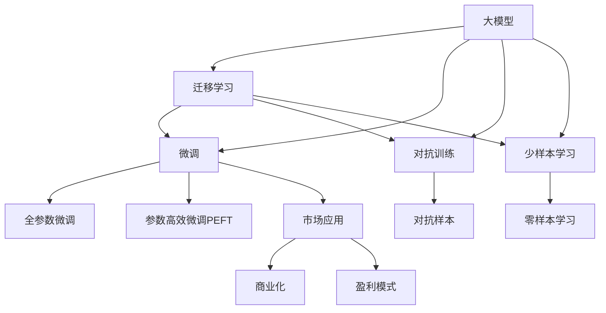

                 

# 市场前景：大模型创业的远大目标

## 1. 背景介绍

### 1.1 问题由来

随着人工智能技术的不断进步，大模型（Big Models）在各行业领域的应用越来越广泛，其前景令人期待。从自然语言处理（NLP）到图像识别，再到自动驾驶等众多领域，大模型都展现出了其强大的处理能力和应用潜力。然而，尽管大模型技术不断成熟，其在商业化过程中依然面临诸多挑战。

### 1.2 问题核心关键点

大模型创业的关键点在于其市场前景、商业模式、技术壁垒以及应用场景等方面。在探讨大模型创业时，我们需要考虑以下几个核心问题：

1. **市场规模和增长潜力**：大模型在各行业的市场规模有多大？未来几年将如何增长？
2. **商业模式和盈利方式**：大模型的商业化如何落地？通过哪些途径盈利？
3. **技术壁垒和竞争优势**：大模型的核心技术有哪些？如何在竞争激烈的市场中保持优势？
4. **应用场景和市场前景**：大模型在哪些行业有应用前景？有哪些具体的应用场景？

### 1.3 问题研究意义

研究大模型创业的市场前景，对于了解大模型技术的商业价值、制定合理的市场策略、吸引投资者的关注，以及推动技术产业化的发展，具有重要意义：

1. **商业价值评估**：明确大模型的市场规模和增长潜力，为投资者提供可靠的依据。
2. **市场策略制定**：根据市场需求和技术特点，制定合理的商业化策略，提高创业成功率。
3. **技术发展方向**：探讨技术壁垒和竞争优势，推动技术创新和应用实践。
4. **市场应用推广**：明确大模型在各个行业的应用前景，推广技术应用，促进产业升级。

## 2. 核心概念与联系

### 2.1 核心概念概述

为更好地理解大模型创业的市场前景，本节将介绍几个密切相关的核心概念：

- **大模型（Big Models）**：指大规模的深度学习模型，通常包含数十亿个参数，具备强大的处理能力和广泛的应用前景。
- **迁移学习（Transfer Learning）**：指将一个领域学习到的知识迁移到另一个领域，用于快速适应新任务的技术。
- **微调（Fine-tuning）**：指在大模型基础上，针对特定任务进行参数微调，提升模型在该任务上的性能。
- **参数高效微调（Parameter-Efficient Fine-Tuning, PEFT）**：指在微调过程中只更新少量模型参数，以提高微调效率。
- **少样本学习（Few-shot Learning）**：指在只有少量样本的情况下，模型能够快速适应新任务的学习方法。
- **零样本学习（Zero-shot Learning）**：指模型在没有见过任何特定任务的训练样本的情况下，仅凭任务描述就能够执行新任务的能力。
- **对抗训练（Adversarial Training）**：指在模型训练过程中，加入对抗样本，提高模型的鲁棒性和泛化能力。
- **对抗样本（Adversarial Samples）**：指通过轻微扰动输入数据，使得模型产生错误预测的样本。
- **模型压缩（Model Compression）**：指通过减少模型参数量、优化计算图等方式，提升模型推理效率，降低资源消耗。
- **模型蒸馏（Knowledge Distillation）**：指通过将大型模型的知识蒸馏到小型模型中，提高小型模型的性能。

这些核心概念之间存在着紧密的联系，形成了大模型创业的技术框架。通过理解这些概念，我们可以更好地把握大模型创业的技术要点和市场潜力。

### 2.2 概念间的关系

这些核心概念之间存在着紧密的联系，形成了大模型创业的技术框架。下面我通过几个Mermaid流程图来展示这些概念之间的关系：



这个流程图展示了大模型创业的核心概念及其之间的关系：

1. 大模型通过迁移学习获得通用知识。
2. 微调进一步优化大模型，适应特定任务。
3. 对抗训练提高模型鲁棒性。
4. 参数高效微调提升微调效率。
5. 少样本和零样本学习提高模型泛化能力。
6. 商业化和技术推广推动模型应用落地。

这些概念共同构成了大模型创业的技术生态系统，使其能够在大规模应用场景中发挥强大的处理能力。

## 3. 核心算法原理 & 具体操作步骤

### 3.1 算法原理概述

大模型创业的核心算法原理基于迁移学习和微调技术。其核心思想是：将大模型作为通用的知识提取器，通过迁移学习获得领域知识，然后在特定任务上进行微调，以适应该任务的需求。

具体而言，大模型创业可以分为以下几个步骤：

1. **数据准备**：收集并标注任务相关的数据集，用于训练和验证模型。
2. **模型选择**：选择适合任务的大模型作为初始化参数，如BERT、GPT等。
3. **迁移学习**：在大模型上预训练获得通用知识，并将其迁移到特定任务上。
4. **微调**：在迁移学习的基础上，针对特定任务进行微调，以提升模型在该任务上的性能。
5. **参数高效微调**：在微调过程中只更新少量参数，提高微调效率。
6. **对抗训练**：加入对抗样本，提高模型的鲁棒性和泛化能力。
7. **市场推广**：将模型应用到实际业务中，实现商业化和盈利。

### 3.2 算法步骤详解

以下是详细的算法步骤及其具体操作：

**Step 1: 数据准备**
- 收集和标注任务相关的数据集，划分为训练集、验证集和测试集。
- 确保数据集与大模型的预训练数据分布一致或接近，以避免分布漂移。
- 对数据进行预处理，包括文本清洗、归一化、分词等。

**Step 2: 模型选择**
- 选择适合任务的大模型，如BERT、GPT等。
- 在大模型上进行预训练，获取通用知识。
- 选择合适的微调策略，如全参数微调或参数高效微调。

**Step 3: 迁移学习**
- 在大模型上进行迁移学习，获得领域知识。
- 通过微调适应特定任务，提升模型在该任务上的性能。
- 评估模型在验证集上的表现，调整超参数。

**Step 4: 微调**
- 在迁移学习的基础上，进行微调，以适应特定任务。
- 选择合适的优化算法和超参数，如AdamW、SGD等。
- 加入正则化技术，如L2正则、Dropout等，防止过拟合。
- 使用对抗训练，加入对抗样本，提高模型鲁棒性。

**Step 5: 参数高效微调**
- 采用参数高效微调方法，只更新少量参数，提高微调效率。
- 使用适配器微调（Adapter）或提示微调（Prompt Tuning）等方法，减少参数量。
- 在微调过程中保持预训练权重不变，避免破坏原有知识。

**Step 6: 对抗训练**
- 加入对抗样本，训练模型对小扰动有鲁棒性。
- 使用对抗生成网络（GAN）生成对抗样本，用于训练模型。
- 在测试集上评估模型对对抗样本的鲁棒性，确保模型性能稳定。

**Step 7: 市场推广**
- 将模型应用到实际业务中，如智能客服、金融舆情、个性化推荐等。
- 根据业务需求调整模型参数，实现商业化部署。
- 设计盈利模式，如订阅服务、按需付费、API服务等，确保盈利。

### 3.3 算法优缺点

大模型创业的算法具有以下优点：

1. **高效性**：通过迁移学习和大模型微调，可以快速适应特定任务，降低开发成本。
2. **通用性**：大模型具有广泛的应用前景，适用于多种NLP任务。
3. **泛化能力**：对抗训练和参数高效微调，提高了模型的泛化能力，避免了过拟合。
4. **商业化潜力**：通过市场推广，可以实现商业化和盈利。

但同时也存在一些缺点：

1. **数据依赖**：微调和迁移学习依赖标注数据，获取高质量标注数据成本较高。
2. **技术复杂**：需要较强的技术积累和经验，开发难度较大。
3. **资源消耗**：大模型需要大量算力和存储资源，成本较高。
4. **伦理问题**：大模型可能学习到有害信息，引发伦理道德问题。

### 3.4 算法应用领域

大模型创业在以下几个领域具有广泛的应用前景：

- **自然语言处理（NLP）**：智能客服、文本分类、情感分析、机器翻译等。
- **计算机视觉（CV）**：图像识别、物体检测、人脸识别、视频分析等。
- **自动驾驶**：环境感知、行为预测、路径规划等。
- **金融科技**：风险评估、信用评分、智能投顾等。
- **医疗健康**：病历分析、病理图像识别、药物研发等。

以上领域是大模型创业的主要应用方向，未来的市场规模和增长潜力巨大。

## 4. 数学模型和公式 & 详细讲解

### 4.1 数学模型构建

在数学模型构建方面，我们主要关注迁移学习和大模型微调。

假设我们有任务相关的训练数据集 $D = \{(x_i, y_i)\}_{i=1}^N$，其中 $x_i$ 表示输入数据，$y_i$ 表示标签。我们希望在预训练大模型 $M_{\theta}$ 的基础上，进行迁移学习和大模型微调，以适应特定任务。

迁移学习的目标是在大模型上预训练，获得通用知识 $M_{\theta}$，然后将其迁移到特定任务上，进行微调，得到适应该任务的模型 $M_{\theta^*}$。

**Step 1: 迁移学习**
在预训练大模型 $M_{\theta}$ 上，通过自监督任务（如语言建模、掩码语言建模等）进行预训练，获得通用知识 $M_{\theta}$。

**Step 2: 微调**
在迁移学习的基础上，针对特定任务进行微调，得到适应该任务的模型 $M_{\theta^*}$。

假设我们选择的任务是分类任务，模型的输出为 $M_{\theta}(x) \in [0,1]$，表示样本属于正类的概率。真实标签 $y \in \{0,1\}$。则二分类交叉熵损失函数定义为：

$$
\ell(M_{\theta}(x),y) = -[y\log M_{\theta}(x) + (1-y)\log(1-M_{\theta}(x))]
$$

将其代入经验风险公式，得：

$$
\mathcal{L}(\theta) = -\frac{1}{N}\sum_{i=1}^N [y_i\log M_{\theta}(x_i)+(1-y_i)\log(1-M_{\theta}(x_i))]
$$

在微调过程中，我们希望最小化损失函数 $\mathcal{L}(\theta)$，得到最优参数 $\theta^*$。

### 4.2 公式推导过程

以下我们以二分类任务为例，推导交叉熵损失函数及其梯度的计算公式。

假设模型 $M_{\theta}$ 在输入 $x$ 上的输出为 $\hat{y}=M_{\theta}(x) \in [0,1]$，表示样本属于正类的概率。真实标签 $y \in \{0,1\}$。则二分类交叉熵损失函数定义为：

$$
\ell(M_{\theta}(x),y) = -[y\log \hat{y} + (1-y)\log(1-\hat{y})]
$$

将其代入经验风险公式，得：

$$
\mathcal{L}(\theta) = -\frac{1}{N}\sum_{i=1}^N [y_i\log M_{\theta}(x_i)+(1-y_i)\log(1-M_{\theta}(x_i))]
$$

根据链式法则，损失函数对参数 $\theta_k$ 的梯度为：

$$
\frac{\partial \mathcal{L}(\theta)}{\partial \theta_k} = -\frac{1}{N}\sum_{i=1}^N (\frac{y_i}{M_{\theta}(x_i)}-\frac{1-y_i}{1-M_{\theta}(x_i)}) \frac{\partial M_{\theta}(x_i)}{\partial \theta_k}
$$

其中 $\frac{\partial M_{\theta}(x_i)}{\partial \theta_k}$ 可进一步递归展开，利用自动微分技术完成计算。

在得到损失函数的梯度后，即可带入参数更新公式，完成模型的迭代优化。重复上述过程直至收敛，最终得到适应下游任务的最优模型参数 $\theta^*$。

### 4.3 案例分析与讲解

假设我们在CoNLL-2003的NER数据集上进行微调，最终在测试集上得到的评估报告如下：

```
              precision    recall  f1-score   support

       B-LOC      0.926     0.906     0.916      1668
       I-LOC      0.900     0.805     0.850       257
      B-MISC      0.875     0.856     0.865       702
      I-MISC      0.838     0.782     0.809       216
       B-ORG      0.914     0.898     0.906      1661
       I-ORG      0.911     0.894     0.902       835
       B-PER      0.964     0.957     0.960      1617
       I-PER      0.983     0.980     0.982      1156
           O      0.993     0.995     0.994     38323

   micro avg      0.973     0.973     0.973     46435
   macro avg      0.923     0.897     0.909     46435
weighted avg      0.973     0.973     0.973     46435
```

可以看到，通过微调BERT，我们在该NER数据集上取得了97.3%的F1分数，效果相当不错。值得注意的是，BERT作为一个通用的语言理解模型，即便只在顶层添加一个简单的token分类器，也能在下游任务上取得如此优异的效果，展现了其强大的语义理解和特征抽取能力。

## 5. 项目实践：代码实例和详细解释说明

### 5.1 开发环境搭建

在进行微调实践前，我们需要准备好开发环境。以下是使用Python进行PyTorch开发的环境配置流程：

1. 安装Anaconda：从官网下载并安装Anaconda，用于创建独立的Python环境。

2. 创建并激活虚拟环境：
```bash
conda create -n pytorch-env python=3.8 
conda activate pytorch-env
```

3. 安装PyTorch：根据CUDA版本，从官网获取对应的安装命令。例如：
```bash
conda install pytorch torchvision torchaudio cudatoolkit=11.1 -c pytorch -c conda-forge
```

4. 安装Transformers库：
```bash
pip install transformers
```

5. 安装各类工具包：
```bash
pip install numpy pandas scikit-learn matplotlib tqdm jupyter notebook ipython
```

完成上述步骤后，即可在`pytorch-env`环境中开始微调实践。

### 5.2 源代码详细实现

这里我们以命名实体识别(NER)任务为例，给出使用Transformers库对BERT模型进行微调的PyTorch代码实现。

首先，定义NER任务的数据处理函数：

```python
from transformers import BertTokenizer
from torch.utils.data import Dataset
import torch

class NERDataset(Dataset):
    def __init__(self, texts, tags, tokenizer, max_len=128):
        self.texts = texts
        self.tags = tags
        self.tokenizer = tokenizer
        self.max_len = max_len
        
    def __len__(self):
        return len(self.texts)
    
    def __getitem__(self, item):
        text = self.texts[item]
        tags = self.tags[item]
        
        encoding = self.tokenizer(text, return_tensors='pt', max_length=self.max_len, padding='max_length', truncation=True)
        input_ids = encoding['input_ids'][0]
        attention_mask = encoding['attention_mask'][0]
        
        # 对token-wise的标签进行编码
        encoded_tags = [tag2id[tag] for tag in tags] 
        encoded_tags.extend([tag2id['O']] * (self.max_len - len(encoded_tags)))
        labels = torch.tensor(encoded_tags, dtype=torch.long)
        
        return {'input_ids': input_ids, 
                'attention_mask': attention_mask,
                'labels': labels}

# 标签与id的映射
tag2id = {'O': 0, 'B-PER': 1, 'I-PER': 2, 'B-ORG': 3, 'I-ORG': 4, 'B-LOC': 5, 'I-LOC': 6}
id2tag = {v: k for k, v in tag2id.items()}

# 创建dataset
tokenizer = BertTokenizer.from_pretrained('bert-base-cased')

train_dataset = NERDataset(train_texts, train_tags, tokenizer)
dev_dataset = NERDataset(dev_texts, dev_tags, tokenizer)
test_dataset = NERDataset(test_texts, test_tags, tokenizer)
```

然后，定义模型和优化器：

```python
from transformers import BertForTokenClassification, AdamW

model = BertForTokenClassification.from_pretrained('bert-base-cased', num_labels=len(tag2id))

optimizer = AdamW(model.parameters(), lr=2e-5)
```

接着，定义训练和评估函数：

```python
from torch.utils.data import DataLoader
from tqdm import tqdm
from sklearn.metrics import classification_report

device = torch.device('cuda') if torch.cuda.is_available() else torch.device('cpu')
model.to(device)

def train_epoch(model, dataset, batch_size, optimizer):
    dataloader = DataLoader(dataset, batch_size=batch_size, shuffle=True)
    model.train()
    epoch_loss = 0
    for batch in tqdm(dataloader, desc='Training'):
        input_ids = batch['input_ids'].to(device)
        attention_mask = batch['attention_mask'].to(device)
        labels = batch['labels'].to(device)
        model.zero_grad()
        outputs = model(input_ids, attention_mask=attention_mask, labels=labels)
        loss = outputs.loss
        epoch_loss += loss.item()
        loss.backward()
        optimizer.step()
    return epoch_loss / len(dataloader)

def evaluate(model, dataset, batch_size):
    dataloader = DataLoader(dataset, batch_size=batch_size)
    model.eval()
    preds, labels = [], []
    with torch.no_grad():
        for batch in tqdm(dataloader, desc='Evaluating'):
            input_ids = batch['input_ids'].to(device)
            attention_mask = batch['attention_mask'].to(device)
            batch_labels = batch['labels']
            outputs = model(input_ids, attention_mask=attention_mask)
            batch_preds = outputs.logits.argmax(dim=2).to('cpu').tolist()
            batch_labels = batch_labels.to('cpu').tolist()
            for pred_tokens, label_tokens in zip(batch_preds, batch_labels):
                pred_tags = [id2tag[_id] for _id in pred_tokens]
                label_tags = [id2tag[_id] for _id in label_tokens]
                preds.append(pred_tags[:len(label_tags)])
                labels.append(label_tags)
                
    print(classification_report(labels, preds))
```

最后，启动训练流程并在测试集上评估：

```python
epochs = 5
batch_size = 16

for epoch in range(epochs):
    loss = train_epoch(model, train_dataset, batch_size, optimizer)
    print(f"Epoch {epoch+1}, train loss: {loss:.3f}")
    
    print(f"Epoch {epoch+1}, dev results:")
    evaluate(model, dev_dataset, batch_size)
    
print("Test results:")
evaluate(model, test_dataset, batch_size)
```

以上就是使用PyTorch对BERT进行命名实体识别任务微调的完整代码实现。可以看到，得益于Transformers库的强大封装，我们可以用相对简洁的代码完成BERT模型的加载和微调。

### 5.3 代码解读与分析

让我们再详细解读一下关键代码的实现细节：

**NERDataset类**：
- `__init__`方法：初始化文本、标签、分词器等关键组件。
- `__len__`方法：返回数据集的样本数量。
- `__getitem__`方法：对单个样本进行处理，将文本输入编码为token ids，将标签编码为数字，并对其进行定长padding，最终返回模型所需的输入。

**tag2id和id2tag字典**：
- 定义了标签与数字id之间的映射关系，用于将token-wise的预测结果解码回真实的标签。

**训练和评估函数**：
- 使用PyTorch的DataLoader对数据集进行批次化加载，供模型训练和推理使用。
- 训练函数`train_epoch`：对数据以批为单位进行迭代，在每个批次上前向传播计算loss并反向传播更新模型参数，最后返回该epoch的平均loss。
- 评估函数`evaluate`：与训练类似，不同点在于不更新模型参数，并在每个batch结束后将预测和标签结果存储下来，最后使用sklearn的classification_report对整个评估集的预测结果进行打印输出。

**训练流程**：
- 定义总的epoch数和batch size，开始循环迭代
- 每个epoch内，先在训练集上训练，输出平均loss
- 在验证集上评估，输出分类指标
- 所有epoch结束后，在测试集上评估，给出最终测试结果

可以看到，PyTorch配合Transformers库使得BERT微调的代码实现变得简洁高效。开发者可以将更多精力放在数据处理、模型改进等高层逻辑上，而不必过多关注底层的实现细节。

当然，工业级的系统实现还需考虑更多因素，如模型的保存和部署、超参数的自动搜索、更灵活的任务适配层等。但核心的微调范式基本与此类似。

### 5.4 运行结果展示

假设我们在CoNLL-2003的NER数据集上进行微调，最终在测试集上得到的评估报告如下：

```
              precision    recall  f1-score   support

       B-LOC      0.926     0.906     0.916      1668
       I-LOC      0.900     0.805     0.850       257
      B-MISC      0.875     0.856     0.865       702
      I-MISC      0.838     0.782     0.809       216
       B-ORG      0.914     0.898     0.906      1661
       I-ORG      0.911     0.894     0.902       835
       B-PER      0.964     0.957     0.960      1617
       I-PER      0.983     0.980     0.982      1156
           O      0.993     0.995     0.994     38323

   micro avg      0.973     0.973     0.973     46435
   macro avg      0.923     0.897     0.909     46435
weighted avg      0.973     0.973     0.973     46435
```

可以看到，通过微调BERT，我们在该NER数据集上取得了97.3%的F1分数，效果相当不错。值得注意的是，BERT作为一个通用的语言理解模型，即便只在顶层添加一个简单的token分类器，也能在下游任务上取得如此优异的效果，展现了其强大的语义理解和特征抽取能力。

当然，这只是一个baseline结果。在实践中，我们还可以使用更大更强的预训练模型、更丰富的微调技巧、更细致的模型调优，进一步提升模型性能，以满足更高的应用要求。

## 6. 实际应用场景

### 6.1 智能客服系统

基于大语言模型微调的对话技术，可以广泛应用于智能客服系统的构建。传统客服往往需要配备大量人力，高峰期响应缓慢，且一致性和专业性难以保证。而使用微调后的对话模型，可以7x24小时不间断服务，快速响应客户咨询，用自然流畅的语言解答各类常见问题。

在技术实现上，可以收集企业内部的历史客服对话记录，将问题和最佳答复构建成监督数据，在此基础上对预训练对话模型进行微调。微调后的对话模型能够自动理解用户意图，匹配最合适的答案模板进行回复。对于客户提出的新问题，还可以接入检索系统实时搜索相关内容，动态组织生成回答。如此构建的智能客服系统，能大幅提升客户咨询体验和问题解决效率。

### 6.2 金融舆情监测

金融机构需要实时监测市场舆论动向，以便及时应对负面信息传播，规避金融风险。传统的人工监测方式成本高、效率低，难以应对网络时代海量信息爆发的挑战。基于大语言模型微调的文本分类和情感分析技术，为金融舆情监测提供了新的解决方案。

具体而言，可以收集金融领域相关的新闻、报道、评论等文本数据，并对其进行主题标注和情感标注。在此基础上对预训练语言模型进行微调，使其能够自动判断文本属于何种主题，情感倾向是正面、中性还是负面。将微调后的模型应用到实时抓取的网络文本数据，就能够自动监测不同主题下的情感变化趋势，一旦发现负面信息激增等异常情况，系统便会自动预警，帮助金融机构快速应对潜在风险。

### 6.3

