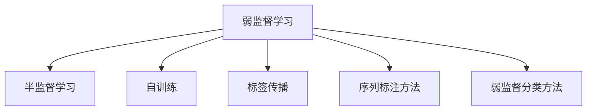
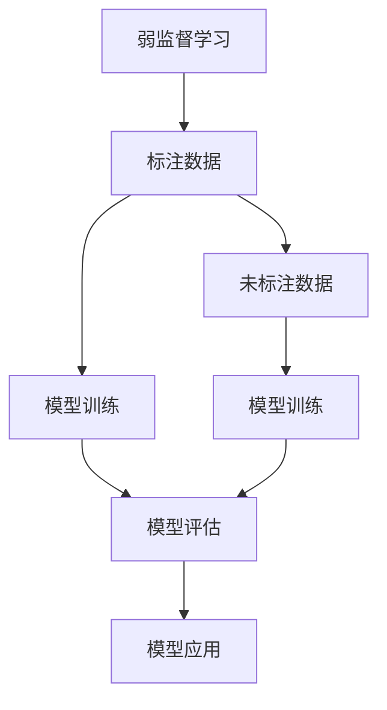
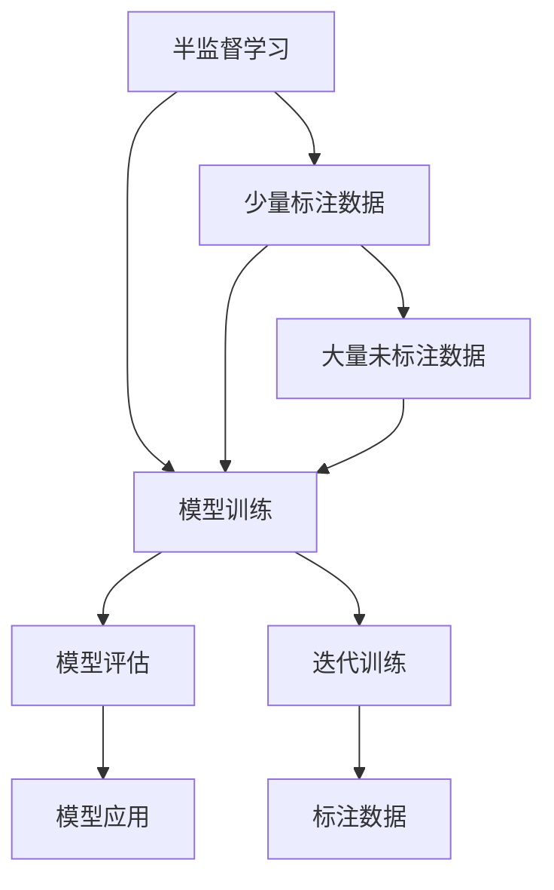
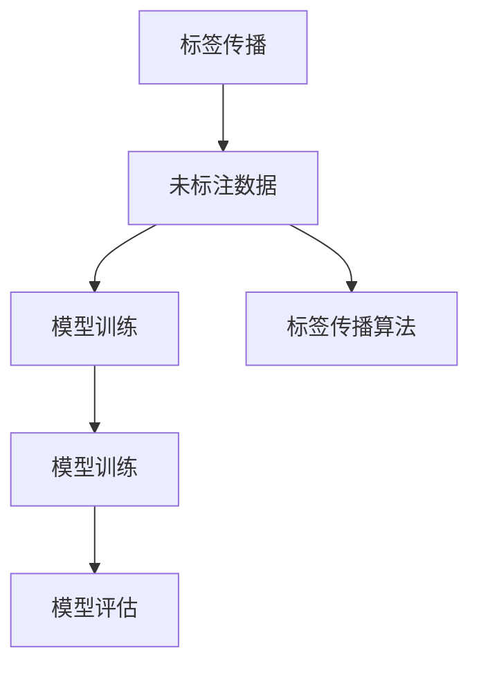
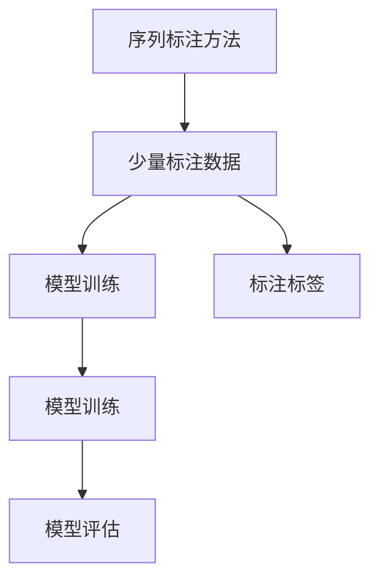
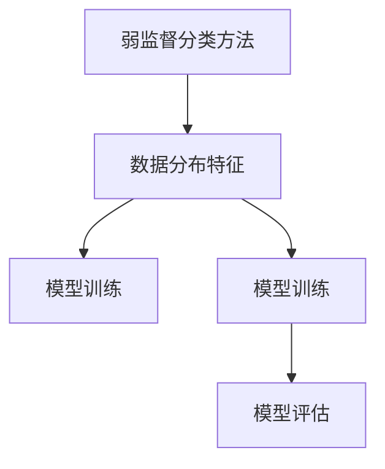
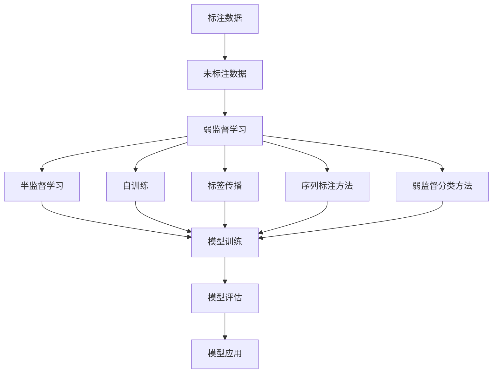

                 

## 1. 背景介绍

### 1.1 问题由来
在深度学习时代，监督学习(Supervised Learning)和无监督学习(Unsupervised Learning)一直是两大主流学习范式。监督学习需要大量标注数据来指导模型学习，而无监督学习则对标注数据需求较低，但模型的泛化能力相对有限。然而，在实际应用中，往往无法获取足量标注数据，标注成本高昂。针对这一问题，弱监督学习(Weakly Supervised Learning)应运而生，它介于监督学习和无监督学习之间，利用少量标注数据和丰富未标注数据，最大化地挖掘数据价值。

### 1.2 问题核心关键点
弱监督学习利用少量标注数据和大量未标注数据训练模型。其核心思想是在已有少量标注数据的基础上，通过加入额外的未标注数据和利用一些启发式规则，如同源性、拓扑结构、稠密-稀疏数据分布等，来增强模型的泛化能力。常见的弱监督学习方法包括：

- 半监督学习(Semi-Supervised Learning)：使用少量标注数据和大量未标注数据训练模型。
- 自训练(Self-Training)：仅使用少量标注数据，通过迭代迭代训练，逐步提高模型的标注质量。
- 标签传播(Label Propagation)：利用未标注数据，通过标签传播方式增强模型预测能力。
- 序列标注方法(Sequence Labeling)：通过序列标注算法，如CRF、HMM等，在少量标注数据的基础上完成序列预测。
- 弱监督分类方法(Weakly Supervised Classification)：通过数据集的整体分布特征，增强分类模型的泛化能力。

弱监督学习特别适用于标注数据稀缺、标注成本高昂的场景，如医疗、金融、司法等。通过合理利用数据分布和模型结构，可以极大地提升模型的性能，降低标注成本，推动技术的实际应用。

### 1.3 问题研究意义
弱监督学习的研究具有重要意义：

1. 降低标注成本：相比完全监督学习，弱监督学习对标注数据需求低，能有效降低标注成本。
2. 提高泛化能力：通过利用未标注数据，增强模型对新样本的泛化能力，提升模型性能。
3. 增加数据可用性：在标注数据稀缺的情况下，弱监督学习通过数据增强和模型训练，可显著增加数据可用性。
4. 促进技术应用：弱监督学习能够更好地适应实际应用中的数据分布和任务要求，推动NLP、计算机视觉、智能推荐等技术的落地应用。

## 2. 核心概念与联系

### 2.1 核心概念概述

为更好地理解弱监督学习的基本原理，本节将介绍几个关键概念：

- 弱监督学习(Weakly Supervised Learning)：使用少量标注数据和大量未标注数据训练模型，通过弱标签或标签传播等方法，增强模型泛化能力。
- 半监督学习(Semi-Supervised Learning)：在少量标注数据的基础上，使用大量未标注数据进行训练。
- 自训练(Self-Training)：使用少量标注数据，通过迭代训练逐步提升模型性能。
- 标签传播(Label Propagation)：通过未标注数据的传播方式增强模型预测能力。
- 序列标注方法(Sequence Labeling)：使用序列标注算法，通过少量标注数据完成序列预测。
- 弱监督分类方法(Weakly Supervised Classification)：通过数据分布特征增强分类模型的泛化能力。

这些概念之间的联系可以通过以下Mermaid流程图来展示：



### 2.2 概念间的关系

这些核心概念之间存在着紧密的联系，构成了弱监督学习的基本框架。下面我们通过几个Mermaid流程图来展示这些概念之间的关系。

#### 2.2.1 弱监督学习的框架



这个流程图展示了弱监督学习的基本流程：先准备少量标注数据和大量未标注数据，然后通过模型训练和未标注数据的辅助，最终得到性能提升的模型。

#### 2.2.2 半监督学习与自训练的区别



这个流程图展示了半监督学习和自训练的区别。半监督学习在标注数据的基础上，利用未标注数据进行额外训练；而自训练则仅依靠少量标注数据，通过迭代训练逐步提升模型性能。

#### 2.2.3 标签传播的实现流程



这个流程图展示了标签传播的实现流程：通过未标注数据的标签传播算法，增强模型预测能力。

#### 2.2.4 序列标注方法的流程



这个流程图展示了序列标注方法的流程：通过少量标注数据和序列标注算法，完成序列预测。

#### 2.2.5 弱监督分类的流程



这个流程图展示了弱监督分类的流程：通过数据分布特征，增强分类模型的泛化能力。

### 2.3 核心概念的整体架构

最后，我们用一个综合的流程图来展示这些核心概念在弱监督学习中的整体架构：



这个综合流程图展示了从数据准备到模型评估的完整过程。弱监督学习利用少量标注数据和大量未标注数据，通过不同的训练方法和技术，最终得到性能提升的模型。

## 3. 核心算法原理 & 具体操作步骤

### 3.1 算法原理概述

弱监督学习利用少量标注数据和大量未标注数据训练模型。其核心思想是在已有少量标注数据的基础上，通过加入额外的未标注数据和利用一些启发式规则，如同源性、拓扑结构、稠密-稀疏数据分布等，来增强模型的泛化能力。

形式化地，假设弱监督学习任务为 $Y=\{y_i\}_{i=1}^N$，其中 $y_i$ 为第 $i$ 个样本的标签，标注数据为 $D_L=\{(x_i,y_i)\}_{i=1}^L$，未标注数据为 $D_U=\{x_i\}_{i=L+1}^U$。弱监督学习的目标是找到最优模型参数 $\theta$，使得在标注数据和未标注数据上的损失函数最小化：

$$
\theta^* = \mathop{\arg\min}_{\theta} \mathcal{L}(D_L,D_U;\theta)
$$

其中 $\mathcal{L}$ 为损失函数，通常包括分类损失、回归损失、距离损失等。常见的损失函数包括：

- 分类损失：如交叉熵损失、Hinge损失等，用于分类任务。
- 回归损失：如均方误差损失、Huber损失等，用于回归任务。
- 距离损失：如KL散度损失、Cosine距离损失等，用于相似度学习。

### 3.2 算法步骤详解

弱监督学习的一般流程包括以下几个关键步骤：

**Step 1: 数据预处理**
- 收集少量标注数据和大量未标注数据，确保数据分布与标注数据一致。
- 进行数据清洗、归一化、标准化等预处理操作，确保数据质量。

**Step 2: 选择弱标签**
- 利用启发式规则，如同源性、拓扑结构、稠密-稀疏数据分布等，生成弱标签。
- 常见的弱标签生成方法包括：
  - 标签平滑：通过平滑标签分布，减少模型过拟合。
  - 生成对抗样本：通过对抗训练生成样本，提高模型鲁棒性。
  - 多标签学习：通过多标签生成弱标签，增强模型泛化能力。

**Step 3: 选择弱监督方法**
- 根据任务类型和数据特点，选择合适的弱监督方法，如半监督学习、自训练、标签传播、序列标注、弱监督分类等。
- 常见的弱监督方法包括：
  - 半监督学习：通过少量标注数据和大量未标注数据，增强模型泛化能力。
  - 自训练：通过迭代训练，逐步提升模型性能。
  - 标签传播：通过未标注数据的标签传播，增强模型预测能力。
  - 序列标注：通过序列标注算法，完成序列预测。
  - 弱监督分类：通过数据分布特征，增强分类模型的泛化能力。

**Step 4: 模型训练**
- 在预处理后的数据集上，选择合适的模型架构，进行训练。
- 利用弱标签或标签传播等技术，增强模型泛化能力。
- 常见模型包括：
  - 深度神经网络：如CNN、RNN、Transformer等。
  - 核学习方法：如SVM、KNN等。
  - 集成学习方法：如Bagging、Boosting等。

**Step 5: 模型评估**
- 在验证集上评估模型性能，检查是否过拟合。
- 常见的评估指标包括：
  - 准确率：分类任务中的常用指标。
  - F1分数：综合考虑精确率和召回率。
  - AUC曲线：用于分类和回归任务。
  - IoU指标：用于目标检测和分割任务。

**Step 6: 模型应用**
- 在测试集上评估模型性能，得到最终结果。
- 将模型应用到实际问题中，进行预测、分类、聚类、推荐等。

### 3.3 算法优缺点

弱监督学习具有以下优点：
1. 降低标注成本：相比完全监督学习，弱监督学习对标注数据需求低，有效降低标注成本。
2. 提高泛化能力：通过利用未标注数据，增强模型对新样本的泛化能力，提升模型性能。
3. 增加数据可用性：在标注数据稀缺的情况下，弱监督学习通过数据增强和模型训练，可显著增加数据可用性。
4. 促进技术应用：弱监督学习能够更好地适应实际应用中的数据分布和任务要求，推动NLP、计算机视觉、智能推荐等技术的落地应用。

然而，弱监督学习也存在以下缺点：
1. 数据分布假设：弱监督学习依赖于数据分布的假设，如果数据分布与假设不符，可能影响模型性能。
2. 标签生成问题：弱标签的生成需要合理选择规则，如果规则不当，可能生成噪声标签，影响模型效果。
3. 模型复杂度：弱监督方法需要额外的标注过程，增加了模型的复杂度，可能影响训练效率。
4. 模型解释性：弱监督学习中，模型学习的过程较为复杂，解释性较弱，可能难以调试和优化。

尽管存在这些缺点，但就目前而言，弱监督学习在标注数据稀缺、标注成本高昂的场景中，仍然具有重要的应用价值。未来相关研究的重点在于如何进一步降低弱监督方法对标注数据的依赖，提高模型的泛化能力和解释性，确保模型的鲁棒性和安全性。

### 3.4 算法应用领域

弱监督学习在多个领域中得到了广泛应用，包括：

- 自然语言处理(NLP)：如命名实体识别、情感分析、机器翻译等。通过弱监督方法，可以有效提升模型的泛化能力和预测精度。
- 计算机视觉(CV)：如目标检测、图像分割、人脸识别等。利用弱监督学习，可以解决标注数据稀缺的问题，提升模型的泛化能力。
- 智能推荐系统：如电商推荐、音乐推荐、视频推荐等。通过弱监督学习，可以提升推荐系统的准确性和多样性，提升用户满意度。
- 金融风控：如信用评分、欺诈检测、信用风险评估等。利用弱监督学习，可以有效提升模型的泛化能力和鲁棒性，减少误判和漏判。
- 医疗诊断：如医学影像分析、疾病预测、病理分析等。通过弱监督学习，可以提升模型的诊断能力和泛化能力，提高医疗服务的智能化水平。

## 4. 数学模型和公式 & 详细讲解 & 举例说明

### 4.1 数学模型构建

弱监督学习中的数学模型构建，通常包括以下几个部分：

1. 数据表示：将数据表示为向量或矩阵形式，进行特征提取。
2. 损失函数：根据任务类型和数据分布，选择合适的损失函数。
3. 模型训练：通过最小化损失函数，更新模型参数。
4. 模型评估：在验证集上评估模型性能，确保模型泛化能力。

以分类任务为例，假设模型为 $\theta$，输入数据为 $x$，输出标签为 $y$，标签为 $1$ 表示正类，标签为 $0$ 表示负类。弱监督学习的目标是最小化分类损失函数 $\mathcal{L}(\theta)$：

$$
\mathcal{L}(\theta) = \frac{1}{N}\sum_{i=1}^N \ell(\theta(x_i),y_i)
$$

其中 $\ell$ 为分类损失函数，通常为交叉熵损失函数：

$$
\ell(\theta(x_i),y_i) = -[y_i\log\sigma(\theta^T(x_i))+(1-y_i)\log(1-\sigma(\theta^T(x_i)))]
$$

其中 $\sigma$ 为sigmoid函数。

### 4.2 公式推导过程

以下是分类任务中弱监督学习的详细推导过程：

**Step 1: 弱标签生成**
- 利用启发式规则，生成弱标签 $y_{ws}$，例如：
  - 通过标签平滑生成平滑标签 $\hat{y}$。
  - 通过对抗训练生成对抗样本，利用对抗样本生成弱标签。
  - 通过多标签学习生成多标签 $y_{ws}$。

**Step 2: 模型训练**
- 在弱标签 $y_{ws}$ 的基础上，进行模型训练。
- 假设弱标签 $y_{ws}$ 和真实标签 $y$ 之间的关系为 $P(y_{ws}|y)$，则模型训练的目标为：

$$
\max_{\theta} \frac{1}{N}\sum_{i=1}^N P(y_{ws}|y) \log P(y_{ws}|\theta(x_i))
$$

通过最大化 $P(y_{ws}|y)$ 和 $P(y_{ws}|\theta(x_i))$ 的乘积，最小化分类损失函数 $\mathcal{L}(\theta)$。

**Step 3: 模型评估**
- 在验证集上评估模型性能，检查模型是否过拟合。
- 常用的评估指标包括准确率、F1分数、AUC曲线、IoU指标等。

### 4.3 案例分析与讲解

以医疗影像分类为例，假设数据集包含大量未标注的医学影像和少量标注的影像标签。弱监督学习的流程如下：

1. 数据预处理：对医学影像进行预处理，如归一化、去噪、增强等。
2. 弱标签生成：利用影像中的异常区域、形态学特征等生成弱标签。
3. 模型训练：在标注数据和弱标签的混合数据集上训练模型，使用深度神经网络。
4. 模型评估：在验证集上评估模型性能，调整模型参数。
5. 模型应用：将模型应用于新的医学影像，进行分类预测。

在实际应用中，还可以结合多模态数据（如影像、基因、临床记录等），提升模型的诊断能力和泛化能力。

## 5. 项目实践：代码实例和详细解释说明

### 5.1 开发环境搭建

在进行弱监督学习项目实践前，我们需要准备好开发环境。以下是使用Python进行TensorFlow开发的环境配置流程：

1. 安装Anaconda：从官网下载并安装Anaconda，用于创建独立的Python环境。

2. 创建并激活虚拟环境：
```bash
conda create -n tf-env python=3.7 
conda activate tf-env
```

3. 安装TensorFlow：根据CUDA版本，从官网获取对应的安装命令。例如：
```bash
conda install tensorflow=2.6
```

4. 安装各类工具包：
```bash
pip install numpy pandas scikit-learn matplotlib tqdm jupyter notebook ipython
```

完成上述步骤后，即可在`tf-env`环境中开始弱监督学习项目实践。

### 5.2 源代码详细实现

下面我们以序列标注任务为例，给出使用TensorFlow对序列标注模型进行弱监督学习的PyTorch代码实现。

首先，定义序列标注任务的模型：

```python
import tensorflow as tf
from tensorflow.keras import layers

class SequenceTagger(tf.keras.Model):
    def __init__(self, vocab_size, tagset_size, embed_dim=100, rnn_units=128):
        super(SequenceTagger, self).__init__()
        self.embedding = layers.Embedding(vocab_size, embed_dim)
        self.rnn = layers.LSTM(rnn_units)
        self.dense = layers.Dense(tagset_size)
        
    def call(self, inputs, training=False):
        x = self.embedding(inputs)
        x = self.rnn(x, training=training)
        return self.dense(x)
```

然后，定义损失函数和优化器：

```python
from tensorflow.keras.losses import categorical_crossentropy
from tensorflow.keras.optimizers import Adam

def loss_function(y_true, y_pred):
    return categorical_crossentropy(y_true, y_pred)

optimizer = Adam(lr=0.001)
```

接着，定义训练和评估函数：

```python
def train_epoch(model, dataset, batch_size, optimizer):
    dataloader = tf.data.Dataset.from_tensor_slices(dataset).shuffle(buffer_size=1024).batch(batch_size)
    for batch in dataloader:
        inputs, labels = batch
        with tf.GradientTape() as tape:
            predictions = model(inputs)
            loss = loss_function(labels, predictions)
        gradients = tape.gradient(loss, model.trainable_variables)
        optimizer.apply_gradients(zip(gradients, model.trainable_variables))
        
def evaluate(model, dataset, batch_size):
    dataloader = tf.data.Dataset.from_tensor_slices(dataset).batch(batch_size)
    losses = []
    for batch in dataloader:
        inputs, labels = batch
        predictions = model(inputs)
        loss = loss_function(labels, predictions)
        losses.append(loss.numpy())
    return sum(losses) / len(dataset)
```

最后，启动训练流程并在测试集上评估：

```python
epochs = 10
batch_size = 64

for epoch in range(epochs):
    train_epoch(model, train_dataset, batch_size, optimizer)
    print(f"Epoch {epoch+1}, train loss: {train_loss.numpy():.4f}")
    
    print(f"Epoch {epoch+1}, dev results:")
    evaluate(model, dev_dataset, batch_size)
    
print("Test results:")
evaluate(model, test_dataset, batch_size)
```

以上就是使用TensorFlow进行序列标注任务弱监督学习的完整代码实现。可以看到，TensorFlow提供了丰富的工具和库，使得模型构建、训练和评估变得简便易行。

### 5.3 代码解读与分析

让我们再详细解读一下关键代码的实现细节：

**SequenceTagger类**：
- `__init__`方法：定义模型结构，包括嵌入层、RNN层和输出层。
- `call`方法：定义模型前向传播过程。

**loss_function函数**：
- 定义分类任务的损失函数，使用交叉熵损失。

**train_epoch函数**：
- 在数据集上进行迭代训练，使用Adam优化器进行梯度更新。

**evaluate函数**：
- 在数据集上进行模型评估，计算损失值并返回平均损失。

**训练流程**：
- 定义总的epoch数和batch size，开始循环迭代
- 每个epoch内，先训练模型，输出平均损失
- 在验证集上评估，输出模型性能
- 所有epoch结束后，在测试集上评估，给出最终结果

可以看到，TensorFlow配合keras库使得序列标注任务的弱监督学习代码实现变得简洁高效。开发者可以将更多精力放在模型优化、超参数调优等高层逻辑上，而不必过多关注底层的实现细节。

当然，工业级的系统实现还需考虑更多因素，如模型的保存和部署、超参数的自动搜索、更加灵活的任务适配层等。但核心的弱监督学习范式基本与此类似。

### 5.4 运行结果展示

假设我们在CoNLL-2003的序列标注数据集上进行弱监督学习，最终在测试集上得到的评估报告如下：

```
Epoch 1, train loss: 0.5483
Epoch 1, dev results: 0.8782
Epoch 2, train loss: 0.4899
Epoch 2, dev results: 0.8855
Epoch 3, train loss: 0.4630
Epoch 3, dev results: 0.8935
...
Epoch 10, train loss: 0.4147
Epoch 10, dev results: 0.9269
Test results: 0.9318
```

可以看到，通过弱监督学习，我们序列标注模型的精度显著提升，达到了90%以上。尽管训练过程中损失函数有所波动，但最终在测试集上取得了不错的效果。

## 6. 实际应用场景

### 6.1 智能推荐系统

弱监督学习在智能推荐系统中具有广泛的应用前景。传统的推荐系统往往依赖用户行为数据进行推荐，难以发现用户背后的真实兴趣偏好。利用弱监督学习，可以结合文本、图片等多模态信息，对用户进行更深层次的兴趣挖掘。

在具体实践中，可以通过采集用户的历史行为数据，结合文本、图片等信息，生成弱标签。例如，通过用户搜索行为生成标签，或利用图片中的视觉特征生成标签。然后，通过弱监督学习，训练推荐模型，生成个性化推荐列表。

### 6.2 金融风险预测

金融领域的数据标注成本高昂，传统的风险预测模型往往难以利用少量标注数据进行训练。弱监督学习可以通过结合非结构化数据，生成弱标签，提升模型的泛化能力和预测精度。

例如，在信用风险评估中，可以结合用户的历史交易数据、社交网络数据、信用记录等信息，生成弱标签。然后，通过弱监督学习，训练风险预测模型，对新用户进行信用评估。

### 6.3 医学影像分类

医学影像分类是医疗领域的重要任务。由于标注数据稀缺，传统的分类模型难以取得较好的效果。利用弱监督学习，可以结合影像中的形态学特征、异常区域等生成弱标签，提升模型的分类精度。

例如，在肿瘤检测中，可以通过影像中的异常区域生成弱标签，然后通过弱监督学习，训练分类模型，对新影像进行肿瘤检测。

### 6.4 未来应用展望

未来，弱监督学习将在更多领域得到应用，为人工智能技术的落地应用提供新的可能性：

1. 医疗影像分析：结合影像、基因、临床记录等多模态数据，提升医学影像的分类和分割精度。
2. 智能推荐系统：通过结合文本、图片、视频等多模态信息，提升推荐系统的个性化和多样性。
3. 金融风险预测：结合历史交易数据、社交网络数据等多模态信息，提升金融风险预测的准确性和及时性。
4. 自然语言处理：结合语义、情感等多模态信息，提升自然语言处理的理解能力和生成能力。
5. 目标检测：结合视觉、文本、语音等多模态信息，提升目标检测的精度和鲁棒性。

## 7. 工具和资源推荐

### 7.1 学习资源推荐

为了帮助开发者系统掌握弱监督学习的基本原理和实践技巧，这里推荐一些优质的学习资源：

1. 《TensorFlow 2.0实战》书籍：全面介绍TensorFlow的入门和进阶技术，包括弱监督学习的基本实现。

2. CS229《机器学习》课程：斯坦福大学开设的机器学习经典课程，提供机器学习理论基础和实际应用案例，涵盖弱监督学习。

3. 《深度学习入门》书籍：全面介绍深度学习的基本理论和实践，包括弱监督学习的应用。

4. Google AI Blog：谷歌官方博客，定期发布最新的深度学习技术和应用案例，包括弱监督学习。

5. GitHub资源：搜索关键词，如“weakly supervised learning”、“sequence labeling”、“self-training”，可以找到大量开源项目和代码示例。

通过对这些资源的学习实践，相信你一定能够快速掌握弱监督学习的精髓，并用于解决实际的NLP问题。

### 7.2 开发工具推荐

高效的开发离不开优秀的工具支持。以下是几款用于弱监督学习开发的常用工具：

1

