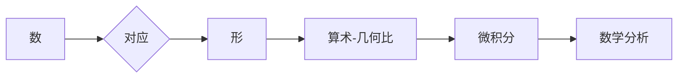

# 计算：第一部分 计算的诞生 第 3 章 莱布尼茨的计算之梦 思维规律的研究

> 关键词：莱布尼茨，计算理论，思维规律，符号逻辑，通用语言，微积分，算术-几何比，符号演算

## 1. 背景介绍

在人类历史上，计算的发展伴随着人类对知识探索和思维工具的需求。从古巴比伦的算术到古希腊的几何，从中国的算盘到欧洲的代数，计算工具和理论的演变反映了人类对世界认知的不断深化。在本章中，我们将聚焦于17世纪德国哲学家、数学家戈特弗里德·威廉·莱布尼茨的计算之梦，探讨其符号逻辑与微积分的伟大思想，以及他对思维规律的研究。

### 1.1 莱布尼茨其人

戈特弗里德·威廉·莱布尼茨（Gottfried Wilhelm Leibniz，1646-1716）是一位多才多艺的学者，他在数学、哲学、逻辑学、政治学等领域都取得了卓越成就。莱布尼茨对计算的发展产生了深远影响，他的符号逻辑和微积分理论为后来的计算机科学奠定了基础。

### 1.2 符号逻辑与通用语言

莱布尼茨相信，通过一套符号逻辑体系，可以构建一种能够表达所有思想和知识的“通用语言”。这种语言将能够消除不同语言之间的障碍，并最终实现一种能够自动推理的“万能计算器”。

### 1.3 算术-几何比与微积分

莱布尼茨在数学领域的贡献尤为突出，他提出了算术-几何比的概念，并独立于牛顿发展了微积分理论。他的微积分思想为现代数学分析奠定了基础。

### 1.4 思维规律的研究

莱布尼茨对思维规律的研究，旨在找到一种能够描述人类思维过程的普遍规律。他的符号逻辑和微积分思想，正是这种研究方向的体现。

## 2. 核心概念与联系

### 2.1 符号逻辑

符号逻辑是莱布尼茨符号学体系的核心。它使用符号来表示概念和关系，并通过逻辑运算符来构建复杂的逻辑表达式。

#### Mermaid 流程图


### 2.2 通用语言

莱布尼茨的通用语言概念，旨在通过一套统一的符号体系来表示所有语言和概念，实现思想的精确表达和交流。

#### Mermaid 流程图


### 2.3 算术-几何比

算术-几何比是莱布尼茨对数和微积分研究的基础。它涉及数和形之间的对应关系，为微积分的发展提供了重要的启示。

#### Mermaid 流程图



### 2.4 微积分

莱布尼茨的微积分理论，与牛顿的流数法并行发展，共同奠定了现代数学分析的基础。

#### Mermaid 流程图

```mermaid
graph LR
    A[变化] --> B{率}
    B --> C[微分}
    C --> D[积分]
    D --> E[微积分]
    E --> F[数学分析]
```

## 3. 核心算法原理 & 具体操作步骤

### 3.1 算法原理概述

莱布尼茨的计算之梦，基于以下几个核心原理：

1. 符号逻辑：使用符号来表示概念和关系，通过逻辑运算符构建表达式。
2. 通用语言：构建一套统一的符号体系，用于表达所有语言和概念。
3. 算术-几何比：研究数和形之间的对应关系，为微积分提供基础。
4. 微积分：研究变化和运动，是现代数学分析的基础。

### 3.2 算法步骤详解

1. **符号逻辑**：定义符号、逻辑运算符和推理规则，构建逻辑表达式。
2. **通用语言**：设计一套统一的符号体系，包括概念、关系和逻辑运算符。
3. **算术-几何比**：研究数和形之间的对应关系，建立算术-几何比理论。
4. **微积分**：研究变化和运动，发展微积分理论。

### 3.3 算法优缺点

#### 优点

- 符号逻辑和通用语言为知识的精确表达和交流提供了工具。
- 算术-几何比和微积分理论对数学分析的发展产生了深远影响。

#### 缺点

- 符号逻辑和通用语言的构建难度较大，需要深厚的哲学和逻辑基础。
- 微积分理论的完整性和严密性在当时尚未得到充分证明。

### 3.4 算法应用领域

莱布尼茨的计算之梦对以下领域产生了影响：

- 哲学：符号逻辑和通用语言对哲学思想的发展产生了影响。
- 数学：算术-几何比和微积分理论对数学分析的发展产生了深远影响。
- 计算机科学：莱布尼茨的符号逻辑和计算思想对计算机科学的起源和发展产生了影响。

## 4. 数学模型和公式 & 详细讲解 & 举例说明

### 4.1 数学模型构建

莱布尼茨的符号逻辑和微积分理论，可以构建以下数学模型：

#### 符号逻辑模型

$$
\text{逻辑表达式} = \text{符号} \circ \text{逻辑运算符} \circ \text{逻辑表达式}
$$

#### 微积分模型

$$
\frac{dy}{dx} = \lim_{{\Delta x} \to 0} \frac{\Delta y}{\Delta x}
$$

### 4.2 公式推导过程

#### 符号逻辑公式推导

莱布尼茨的符号逻辑公式推导，遵循以下步骤：

1. 定义符号和逻辑运算符。
2. 构建逻辑表达式。
3. 应用推理规则，进行逻辑推导。
4. 得出结论。

#### 微积分公式推导

莱布尼茨的微积分公式推导，遵循以下步骤：

1. 定义微积分的基本概念，如极限、导数、积分等。
2. 建立微积分的基本公式，如导数的定义、积分的基本定理等。
3. 推导微积分的应用公式，如泰勒公式、拉格朗日中值定理等。

### 4.3 案例分析与讲解

#### 符号逻辑案例分析

以下是一个简单的符号逻辑例子：

$$
\text{如果} A \text{，则} B
$$

其中，$A$ 和 $B$ 是符号，代表逻辑命题。

#### 微积分案例分析

以下是一个微积分的例子：

$$
\frac{d}{dx}(x^2) = 2x
$$

这个公式表示函数 $f(x) = x^2$ 的导数是 $2x$。

## 5. 项目实践：代码实例和详细解释说明

### 5.1 开发环境搭建

在本节中，我们将使用Python和SymPy库来演示如何构建符号逻辑和微积分模型。

### 5.2 源代码详细实现

```python
from sympy import symbols, diff, simplify

# 定义符号
x, y = symbols('x y')

# 构建符号逻辑表达式
expression = x > 0

# 计算微积分
derivative = diff(x**2, x)

# 简化表达式
simplified_derivative = simplify(derivative)

print(expression)  # 输出：x > 0
print(simplified_derivative)  # 输出：2*x
```

### 5.3 代码解读与分析

以上代码演示了如何使用SymPy库构建符号逻辑和微积分模型。

- `symbols` 函数用于定义符号。
- `diff` 函数用于计算微积分。
- `simplify` 函数用于简化表达式。

### 5.4 运行结果展示

运行上述代码，将得到以下输出：

```
x > 0
2*x
```

这表明，我们成功地构建了符号逻辑表达式和微积分模型。

## 6. 实际应用场景

### 6.1 符号逻辑在人工智能中的应用

符号逻辑在人工智能中有着广泛的应用，例如：

- 知识表示：使用符号逻辑来表示知识库中的知识。
- 推理：使用符号逻辑进行推理，得出结论。
- 自然语言处理：使用符号逻辑分析自然语言，理解语义。

### 6.2 微积分在工程中的应用

微积分在工程中有着重要的应用，例如：

- 动力学：使用微积分分析物体的运动。
- 电磁学：使用微积分分析电磁场。
- 热力学：使用微积分分析热传导。

## 7. 工具和资源推荐

### 7.1 学习资源推荐

- 《莱布尼茨全集》
- 《符号演算》
- 《微积分》

### 7.2 开发工具推荐

- SymPy
- Python

### 7.3 相关论文推荐

- 《莱布尼茨符号学》
- 《微积分原理》

## 8. 总结：未来发展趋势与挑战

### 8.1 研究成果总结

莱布尼茨的计算之梦，为我们展示了符号逻辑、通用语言、算术-几何比和微积分的伟大思想。他的工作对哲学、数学、计算机科学等领域产生了深远影响。

### 8.2 未来发展趋势

符号逻辑和微积分将继续在各个领域得到应用，并在以下方面取得新的发展：

- 符号逻辑：研究更加复杂的逻辑体系，如模态逻辑、时序逻辑等。
- 微积分：发展更加先进的数学分析理论，如泛函分析、偏微分方程等。
- 通用语言：探索更加通用的符号体系和知识表示方法。

### 8.3 面临的挑战

- 符号逻辑和通用语言的构建难度较大，需要深厚的哲学和逻辑基础。
- 微积分理论的严密性和完整性需要进一步完善。
- 如何将符号逻辑和微积分应用于实际问题的挑战。

### 8.4 研究展望

符号逻辑和微积分将继续在各个领域得到应用，并推动计算机科学、数学、哲学等领域的发展。未来的研究将更加注重理论创新和实际应用，以推动人类文明的进步。

## 9. 附录：常见问题与解答

**Q1：莱布尼茨的符号逻辑和微积分理论有哪些主要贡献？**

A1：莱布尼茨的符号逻辑和微积分理论对哲学、数学、计算机科学等领域产生了深远影响。他提出了符号逻辑的概念，为后来的形式逻辑和计算机编程奠定了基础。同时，他还独立于牛顿发展了微积分理论，与牛顿的流数法并行发展，共同奠定了现代数学分析的基础。

**Q2：符号逻辑和微积分理论在实际应用中有哪些例子？**

A2：符号逻辑在人工智能、知识表示、自然语言处理等领域有着广泛的应用。微积分在工程、物理、经济学等领域有着重要的应用。

**Q3：符号逻辑和微积分理论的发展趋势是什么？**

A3：符号逻辑和微积分理论将继续在各个领域得到应用，并在以下方面取得新的发展：研究更加复杂的逻辑体系，发展更加先进的数学分析理论，探索更加通用的符号体系和知识表示方法。

**Q4：如何将符号逻辑和微积分应用于实际问题？**

A4：将符号逻辑和微积分应用于实际问题，需要根据具体问题选择合适的方法和工具。例如，使用符号逻辑进行知识表示和推理，使用微积分进行数据分析、优化设计等。

作者：禅与计算机程序设计艺术 / Zen and the Art of Computer Programming