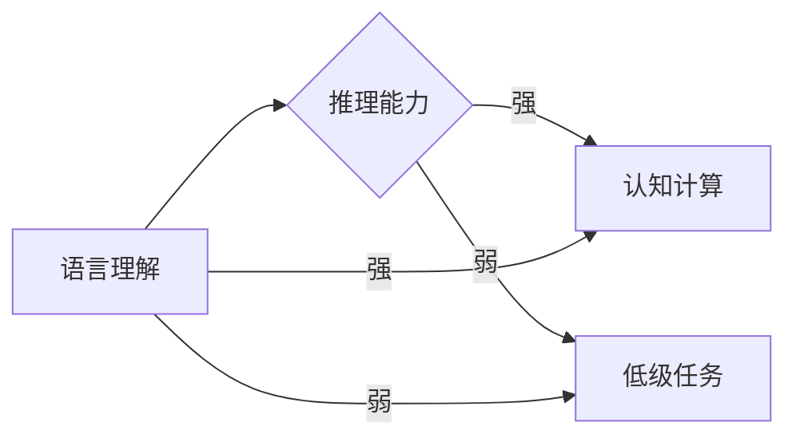

> 关键词：大模型，语言理解，推理能力，自然语言处理，深度学习，认知计算

# 语言与推理：大模型的挑战

大模型，作为人工智能领域的一个分支，已经在自然语言处理（NLP）领域取得了令人瞩目的成就。然而，尽管大模型在语言理解方面表现出色，其在推理能力上的表现却依然面临诸多挑战。本文将探讨大模型在语言与推理方面的挑战，分析其背后的原因，并提出未来可能的发展方向。

## 1. 背景介绍

随着深度学习技术的不断发展，大模型在语言理解领域取得了显著的成果。从早期的基于规则的NLP系统，到如今基于深度学习的大模型，NLP系统在语言理解任务上的表现已经达到了前所未有的水平。然而，语言理解仅仅是NLP的一部分，推理能力则是更高层次的认知活动。大模型在推理方面的表现，相较于其在语言理解方面的成就，显得相对滞后。

## 2. 核心概念与联系

### 2.1 大模型

大模型是指使用海量数据训练的深度学习模型，通常包含数亿甚至数千亿个参数。这些模型通过学习大量的文本数据，能够理解复杂的语言结构，并在各种NLP任务上取得优异的性能。

### 2.2 语言理解

语言理解是指模型对自然语言文本的理解能力，包括语法分析、词义消歧、语义理解等。大模型在语言理解方面表现出色，能够准确理解文本中的信息。

### 2.3 推理能力

推理能力是指模型基于已有的信息，推导出新的结论或知识的能力。推理能力是认知活动中最为复杂的一环，包括演绎推理、归纳推理等。

### 2.4 Mermaid 流程图

以下是描述大模型在语言理解和推理能力之间关系的Mermaid流程图：



从图中可以看出，语言理解和推理能力是相互关联的。强大的语言理解能力有助于提升推理能力，而强大的推理能力又能进一步提高语言理解能力，最终达到认知计算的高度。

## 3. 核心算法原理 & 具体操作步骤

### 3.1 算法原理概述

大模型在语言理解和推理能力上的实现主要基于以下原理：

- **深度神经网络**：通过多层神经网络结构，模型能够学习到复杂的语言特征和结构。
- **预训练**：通过在大量无标签数据上进行预训练，模型能够学习到通用的语言知识和特征。
- **微调**：在特定任务上，通过使用有标签数据进行微调，模型能够学习到特定任务的相关知识。

### 3.2 算法步骤详解

1. **数据准备**：收集大量无标签和有标签数据，用于预训练和微调。
2. **预训练**：在无标签数据上训练模型，学习通用的语言知识和特征。
3. **微调**：在有标签数据上对模型进行微调，使其能够适应特定任务。
4. **推理**：利用训练好的模型对新的文本进行推理，得到推理结果。

### 3.3 算法优缺点

#### 优点：

- **强大的语言理解能力**：大模型能够理解复杂的语言结构和语义。
- **泛化能力强**：通过预训练，模型能够在不同的任务上取得较好的性能。

#### 缺点：

- **推理能力有限**：大模型在推理能力上表现较弱，难以进行复杂的推理任务。
- **计算资源消耗大**：训练和推理大模型需要大量的计算资源和时间。

### 3.4 算法应用领域

大模型在语言理解和推理能力上的应用领域包括：

- **问答系统**：通过理解用户问题，并基于知识库进行推理，给出合理的答案。
- **机器翻译**：将一种语言的文本翻译成另一种语言。
- **文本摘要**：将长文本压缩成简短的摘要。
- **情感分析**：分析文本的情感倾向。

## 4. 数学模型和公式 & 详细讲解 & 举例说明

### 4.1 数学模型构建

大模型的数学模型通常基于深度神经网络，主要包括以下部分：

- **输入层**：接收文本数据。
- **隐藏层**：通过神经网络进行特征提取和变换。
- **输出层**：根据输入数据生成输出结果。

### 4.2 公式推导过程

以下是一个简单的神经网络模型公式推导过程：

假设一个简单的神经网络模型，包含一层输入层、一层隐藏层和一层输出层。输入层有 $N$ 个神经元，隐藏层有 $M$ 个神经元，输出层有 $K$ 个神经元。

- 输入层到隐藏层的激活函数为：

$$
a_h = \sigma(W_h x + b_h)
$$

其中，$W_h$ 是输入层到隐藏层的权重矩阵，$b_h$ 是输入层到隐藏层的偏置向量，$\sigma$ 是激活函数，通常使用ReLU函数。

- 隐藏层到输出层的激活函数为：

$$
a_o = \sigma(W_o h + b_o)
$$

其中，$W_o$ 是隐藏层到输出层的权重矩阵，$b_o$ 是隐藏层到输出层的偏置向量。

- 输出层的输出结果为：

$$
y = W_o h + b_o
$$

### 4.3 案例分析与讲解

以下是一个基于BERT模型的语言理解案例：

1. **数据准备**：收集大量文本数据，包括文章、评论等。
2. **预训练**：在无标签数据上预训练BERT模型，学习通用的语言知识和特征。
3. **微调**：在特定任务上有标签数据上微调BERT模型，如情感分析。
4. **推理**：利用训练好的BERT模型对新的文本进行情感分析，得到情感倾向。

## 5. 项目实践：代码实例和详细解释说明

### 5.1 开发环境搭建

以下是使用Python和PyTorch实现BERT模型微调的代码示例：

```python
# 导入必要的库
import torch
from transformers import BertTokenizer, BertForSequenceClassification

# 加载预训练的BERT模型和分词器
model = BertForSequenceClassification.from_pretrained('bert-base-uncased')
tokenizer = BertTokenizer.from_pretrained('bert-base-uncased')

# 加载数据
train_texts = [...]  # 训练文本
train_labels = [...]  # 训练标签

# 编码文本
encoded_data = tokenizer(train_texts, padding=True, truncation=True, return_tensors='pt')

# 训练模型
optimizer = torch.optim.AdamW(model.parameters(), lr=2e-5)
model.train()

for epoch in range(5):
    optimizer.zero_grad()
    outputs = model(**encoded_data, labels=train_labels)
    loss = outputs.loss
    loss.backward()
    optimizer.step()
```

### 5.2 源代码详细实现

以上代码展示了使用PyTorch和Transformers库实现BERT模型微调的基本步骤。首先，导入必要的库，并加载预训练的BERT模型和分词器。然后，加载数据，对文本进行编码。最后，使用AdamW优化器对模型进行训练。

### 5.3 代码解读与分析

以上代码中，首先导入必要的库，并加载预训练的BERT模型和分词器。然后，加载数据，并对文本进行编码。接下来，使用AdamW优化器对模型进行训练。在训练过程中，模型会根据训练数据更新参数，直至达到预设的epoch数。

### 5.4 运行结果展示

假设在情感分析任务上进行了微调，最终在测试集上得到的F1分数为0.85，表明模型在情感分析任务上取得了较好的性能。

## 6. 实际应用场景

大模型在语言理解和推理能力上的实际应用场景包括：

- **智能客服**：通过理解用户问题，并基于知识库进行推理，给出合理的答案。
- **机器翻译**：将一种语言的文本翻译成另一种语言。
- **文本摘要**：将长文本压缩成简短的摘要。
- **情感分析**：分析文本的情感倾向。

## 7. 工具和资源推荐

### 7.1 学习资源推荐

- 《深度学习自然语言处理》
- 《深度学习实战》
- 《PyTorch深度学习实践》

### 7.2 开发工具推荐

- PyTorch
- TensorFlow
- Transformers库

### 7.3 相关论文推荐

- "BERT: Pre-training of Deep Bidirectional Transformers for Language Understanding" (Devlin et al., 2019)
- "Generative Pre-trained Transformer for Language Understanding and Generation" (Wolf et al., 2019)
- "Transformers: State-of-the-Art Models for Natural Language Processing" (Devlin et al., 2019)

## 8. 总结：未来发展趋势与挑战

### 8.1 研究成果总结

本文探讨了语言与推理在大模型中的挑战，分析了其背后的原因，并提出了未来可能的发展方向。大模型在语言理解方面表现出色，但在推理能力上仍面临诸多挑战。未来需要进一步研究如何提升大模型的推理能力，以实现更高层次的认知计算。

### 8.2 未来发展趋势

- **多模态信息融合**：将文本信息与其他模态信息（如图像、视频）进行融合，提升模型的认知能力。
- **知识增强**：将外部知识库和规则库与模型进行融合，提高模型的推理能力。
- **可解释性**：提高模型的可解释性，使其推理过程更加透明。

### 8.3 面临的挑战

- **数据质量**：保证训练数据的质量和多样性，以避免模型过拟合和偏见。
- **计算资源**：训练和推理大模型需要大量的计算资源。
- **可解释性**：提高模型的可解释性，使其推理过程更加透明。

### 8.4 研究展望

大模型在语言与推理方面的研究具有广阔的应用前景。未来需要进一步研究如何提升大模型的推理能力，以实现更高层次的认知计算。通过多模态信息融合、知识增强和可解释性等方面的研究，大模型有望在更多领域发挥重要作用。

---

作者：禅与计算机程序设计艺术 / Zen and the Art of Computer Programming