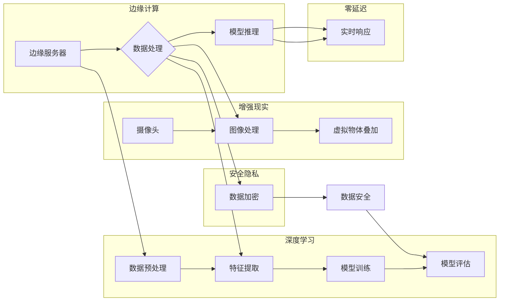

# 边缘AI:将智能带到设备端的技术突破

> 关键词：边缘AI, 智能计算, 物联网, 深度学习, 增强现实, 零延迟, 安全隐私

## 1. 背景介绍

随着物联网(IoT)的飞速发展，智能设备的数量呈指数级增长。这些设备不仅需要处理大量的数据，还要求实时响应，对延迟和带宽的要求越来越高。传统的云计算模式，虽然计算资源丰富，但数据传输时间长，难以满足实时性要求。因此，边缘AI应运而生，它将智能计算能力带到设备端，实现了数据的实时处理和分析。

### 1.1 问题的由来

云计算模式存在以下问题：

- **延迟**：数据需要传输到云端进行计算，传输时间过长，不适合实时性要求高的应用。
- **带宽**：大量数据的上传和下载需要占用大量带宽，尤其在移动网络环境下。
- **隐私**：数据在传输过程中可能被泄露，影响用户隐私。
- **功耗**：云端计算需要大量电力支持，不利于环保。

边缘AI的出现，旨在解决上述问题，将计算能力带到数据产生的源头，实现快速、高效、安全的智能处理。

### 1.2 研究现状

近年来，边缘AI领域取得了显著进展，主要表现在以下几个方面：

- **边缘计算技术**：发展了边缘计算平台，如Fog Computing、Mist Computing等，为边缘AI提供了硬件基础。
- **深度学习算法**：随着深度学习技术的进步，边缘AI的算法能力得到了显著提升。
- **低功耗硬件**：低功耗的边缘计算芯片和传感器，为边缘AI提供了硬件支持。
- **安全隐私技术**：发展了安全隐私技术，如差分隐私、联邦学习等，保护用户数据安全。

### 1.3 研究意义

边缘AI的研究具有以下重要意义：

- **提高响应速度**：边缘AI可以实现数据的实时处理，满足实时性要求。
- **降低带宽消耗**：边缘AI可以减少数据传输量，降低带宽消耗。
- **保护用户隐私**：边缘AI可以保护用户数据安全，减少数据泄露风险。
- **降低功耗**：边缘AI可以减少计算资源消耗，降低能耗。
- **推动物联网发展**：边缘AI是物联网发展的重要基础设施，有助于推动物联网生态的完善。

### 1.4 本文结构

本文将围绕边缘AI展开，主要内容包括：

- 核心概念与联系
- 核心算法原理与操作步骤
- 数学模型和公式
- 项目实践
- 实际应用场景
- 工具和资源推荐
- 总结与展望

## 2. 核心概念与联系

### 2.1 核心概念

- **边缘计算**：在数据产生源头进行计算的一种计算模式，如边缘服务器、物联网设备等。
- **深度学习**：一种基于数据的机器学习技术，通过学习大量数据来提取特征和模式。
- **增强现实**：通过计算机技术增强用户对现实世界的感知。
- **零延迟**：数据处理和响应时间接近实时，满足实时性要求。
- **安全隐私**：保护用户数据安全，防止数据泄露。

### 2.2 Mermaid 流程图



### 2.3 联系

边缘计算和深度学习是边缘AI的两个核心组成部分。边缘计算提供计算平台，深度学习提供智能算法。增强现实和虚拟现实技术可以将虚拟信息叠加到现实世界中，提高用户体验。零延迟和安全性是边缘AI的重要目标。

## 3. 核心算法原理 & 具体操作步骤

### 3.1 算法原理概述

边缘AI的核心算法主要包括：

- **边缘计算框架**：如EdgeX Foundry、Fog Computing等，提供边缘计算平台。
- **深度学习模型**：如卷积神经网络(CNN)、循环神经网络(RNN)、生成对抗网络(GAN)等，用于特征提取、模式识别等。
- **增强现实技术**：将虚拟信息叠加到现实世界中，提高用户体验。

### 3.2 算法步骤详解

1. **数据采集**：从传感器、摄像头等设备采集数据。
2. **数据预处理**：对采集到的数据进行清洗、归一化等处理。
3. **特征提取**：使用深度学习模型提取数据特征。
4. **模型推理**：将提取的特征输入到深度学习模型中进行推理。
5. **结果输出**：根据模型推理结果，生成相应的指令或反馈。

### 3.3 算法优缺点

#### 3.3.1 优点

- **实时性**：边缘计算可以实现数据的实时处理和分析。
- **高效性**：深度学习模型可以高效地处理大量数据。
- **安全性**：边缘AI可以实现数据在本地处理，降低数据泄露风险。

#### 3.3.2 缺点

- **计算能力限制**：边缘设备计算能力有限，难以处理复杂任务。
- **模型更新**：需要定期更新模型，以适应新的数据环境。

### 3.4 算法应用领域

边缘AI的应用领域非常广泛，包括：

- **智能交通**：智能交通信号控制、自动驾驶等。
- **智能制造**：工业机器人控制、质量检测等。
- **智慧医疗**：远程医疗、辅助诊断等。
- **智能家居**：智能家居控制、环境监测等。

## 4. 数学模型和公式 & 详细讲解 & 举例说明

### 4.1 数学模型构建

边缘AI的核心算法大多基于深度学习模型，以下以卷积神经网络(CNN)为例，介绍其数学模型。

#### 4.1.1 CNN数学模型

CNN由卷积层、池化层、全连接层等组成。以下为卷积层的数学模型：

$$
h^{(l)} = f(W^{(l)} \cdot a^{(l-1)} + b^{(l)})
$$

其中，$h^{(l)}$ 表示第l层的输出，$W^{(l)}$ 表示第l层的权重，$a^{(l-1)}$ 表示第l-1层的输出，$b^{(l)}$ 表示第l层的偏置，$f$ 表示激活函数。

#### 4.1.2 激活函数

激活函数可以增加网络的非线性，以下为常用的激活函数：

- **Sigmoid函数**：$f(x) = \frac{1}{1+e^{-x}}$
- **ReLU函数**：$f(x) = \max(0, x)$
- **ReLU6函数**：$f(x) = \min(6, \max(0, x))$

### 4.2 公式推导过程

以ReLU函数为例，推导其导数：

$$
\frac{\partial f}{\partial x} = 
\begin{cases} 
0, & \text{if } x < 0 \\
1, & \text{if } x \geq 0 
\end{cases}
$$

### 4.3 案例分析与讲解

以下以图像识别任务为例，讲解CNN模型的训练过程。

1. **数据准备**：收集大量图像数据，并进行标注。
2. **模型构建**：构建一个多层的CNN模型。
3. **损失函数设计**：设计交叉熵损失函数。
4. **模型训练**：通过梯度下降算法，不断更新模型参数，最小化损失函数。
5. **模型评估**：在测试集上评估模型性能。

## 5. 项目实践：代码实例和详细解释说明

### 5.1 开发环境搭建

1. 安装Python 3.x版本。
2. 安装TensorFlow或PyTorch等深度学习框架。
3. 安装必要的依赖库，如NumPy、Pandas等。

### 5.2 源代码详细实现

以下使用PyTorch实现一个简单的图像识别模型：

```python
import torch
import torch.nn as nn
import torchvision.transforms as transforms
import torchvision.datasets as datasets
import torch.optim as optim

# 定义CNN模型
class CNN(nn.Module):
    def __init__(self):
        super(CNN, self).__init__()
        self.conv1 = nn.Conv2d(3, 32, kernel_size=3, padding=1)
        self.relu = nn.ReLU()
        self.pool = nn.MaxPool2d(2, 2)
        self.fc1 = nn.Linear(32 * 64 * 64, 128)
        self.fc2 = nn.Linear(128, 10)

    def forward(self, x):
        x = self.pool(self.relu(self.conv1(x)))
        x = x.view(-1, 32 * 64 * 64)
        x = self.relu(self.fc1(x))
        x = self.fc2(x)
        return x

# 加载数据
transform = transforms.Compose([transforms.ToTensor()])
train_dataset = datasets.CIFAR10(root='./data', train=True, download=True, transform=transform)
train_loader = torch.utils.data.DataLoader(train_dataset, batch_size=4, shuffle=True)

# 初始化模型和优化器
model = CNN()
criterion = nn.CrossEntropyLoss()
optimizer = optim.SGD(model.parameters(), lr=0.001, momentum=0.9)

# 训练模型
for epoch in range(2):  
    running_loss = 0.0
    for i, data in enumerate(train_loader, 0):
        inputs, labels = data

        optimizer.zero_grad()

        outputs = model(inputs)
        loss = criterion(outputs, labels)
        loss.backward()
        optimizer.step()

        running_loss += loss.item()
        if i % 2000 == 1999:    
            print('[%d, %5d] loss: %.3f' %
                  (epoch + 1, i + 1, running_loss / 2000))
            running_loss = 0.0

print('Finished Training')

# 保存模型
torch.save(model.state_dict(), 'cnn.pth')
```

### 5.3 代码解读与分析

1. **CNN模型**：定义了一个简单的CNN模型，包括卷积层、ReLU激活函数、池化层和全连接层。
2. **数据加载**：使用CIFAR-10数据集进行训练。
3. **损失函数和优化器**：使用交叉熵损失函数和SGD优化器。
4. **模型训练**：通过梯度下降算法，不断更新模型参数，最小化损失函数。
5. **模型保存**：将训练好的模型保存到本地。

### 5.4 运行结果展示

运行上述代码，训练模型，并在测试集上进行评估，可以得到模型性能指标。

## 6. 实际应用场景

### 6.1 智能交通

边缘AI在智能交通领域的应用包括：

- **智能交通信号控制**：通过分析交通流量数据，实现智能交通信号控制，提高道路通行效率。
- **自动驾驶**：通过摄像头、雷达等传感器采集数据，实现自动驾驶。

### 6.2 智能制造

边缘AI在智能制造领域的应用包括：

- **工业机器人控制**：通过传感器采集数据，实现工业机器人的精确控制。
- **质量检测**：通过图像识别技术，实现对产品质量的实时检测。

### 6.3 智慧医疗

边缘AI在智慧医疗领域的应用包括：

- **远程医疗**：通过视频、音频等数据，实现远程医疗诊断。
- **辅助诊断**：通过图像识别技术，辅助医生进行诊断。

### 6.4 智能家居

边缘AI在智能家居领域的应用包括：

- **智能家居控制**：通过传感器采集数据，实现智能家居设备的自动化控制。
- **环境监测**：通过传感器采集数据，实现对家居环境的实时监测。

## 7. 工具和资源推荐

### 7.1 学习资源推荐

- 《深度学习》（Goodfellow, Bengio, Courville著）
- 《边缘计算：原理、架构与应用》（张江涛著）
- 《物联网：原理、架构与关键技术》（刘云浩著）

### 7.2 开发工具推荐

- TensorFlow：开源的深度学习框架。
- PyTorch：开源的深度学习框架。
- Keras：基于TensorFlow和PyTorch的开源深度学习库。

### 7.3 相关论文推荐

- **边缘计算**：
  - "Fog Computing: A Survey of enabling technologies, architecture, security, and applications" by R. Buyya et al.
  - "A Survey on Fog Computing: From Technology to Architecture" by M. Gallo et al.
- **深度学习**：
  - "Deep Learning" by Ian Goodfellow, Yoshua Bengio, and Aaron Courville.
  - "The Unsupervised Learning of Image Representations by Deep Neural Networks" by Y. Bengio, A. Courville, and P. Vincent.
- **物联网**：
  - "Internet of Things: A Survey of Enabling Technologies, Protocols, and Applications" by A. Zeadally.

## 8. 总结：未来发展趋势与挑战

### 8.1 研究成果总结

边缘AI作为一种新兴的计算模式，将智能计算能力带到设备端，实现了数据的实时处理和分析。近年来，边缘AI取得了显著进展，在智能交通、智能制造、智慧医疗、智能家居等领域取得了广泛应用。

### 8.2 未来发展趋势

- **计算能力提升**：随着边缘计算硬件的发展，边缘AI的计算能力将得到进一步提升。
- **算法优化**：深度学习算法将不断优化，提高边缘AI的性能和效率。
- **跨领域融合**：边缘AI将与物联网、云计算、大数据等技术进行深度融合，构建更加智能化的生态系统。

### 8.3 面临的挑战

- **计算资源限制**：边缘设备的计算资源有限，难以满足复杂任务的计算需求。
- **数据安全**：边缘AI涉及大量用户数据，数据安全问题需要得到重视。
- **标准化**：边缘AI的标准化工作需要加强，以促进其健康发展。

### 8.4 研究展望

未来，边缘AI将在以下方面取得突破：

- **边缘计算平台**：开发更加高效、可靠的边缘计算平台。
- **深度学习算法**：开发更加高效、节能的深度学习算法。
- **安全隐私技术**：开发更加安全、可靠的隐私保护技术。

边缘AI作为一种新兴的计算模式，将在未来发挥越来越重要的作用，推动人工智能技术的发展和应用。

## 9. 附录：常见问题与解答

**Q1：边缘AI与云计算的区别是什么？**

A：边缘AI和云计算的主要区别在于数据处理的地点。边缘AI在数据产生的源头进行计算，而云计算在远程数据中心进行计算。边缘AI可以实现数据的实时处理，降低延迟和带宽消耗，但计算资源有限。云计算计算资源丰富，但延迟和带宽消耗较大。

**Q2：边缘AI在哪些领域有应用？**

A：边缘AI在智能交通、智能制造、智慧医疗、智能家居等领域有广泛应用。

**Q3：边缘AI的安全性问题如何解决？**

A：边缘AI的安全性可以通过以下方式解决：

- 数据加密：对数据进行加密，防止数据泄露。
- 访问控制：设置访问权限，防止未授权访问。
- 安全审计：定期进行安全审计，确保系统安全。

**Q4：边缘AI的未来发展趋势是什么？**

A：边缘AI的未来发展趋势包括计算能力提升、算法优化、跨领域融合等。

作者：禅与计算机程序设计艺术 / Zen and the Art of Computer Programming