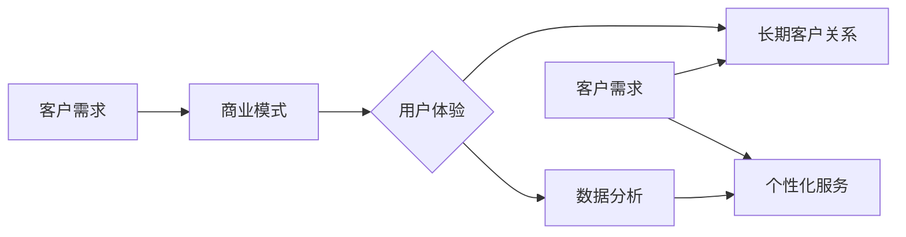

> 客户需求分析、商业模式构建、用户体验、长期客户关系、数据分析、个性化服务

# 长久生意之道：理解客户需求

在商业世界中，成功的企业往往能够深刻理解客户的需求，并以此为基础构建出可持续发展的商业模式。本文将深入探讨如何通过理解客户需求来构建长久生意的策略，并分析相关的理论、实践和未来趋势。

## 1. 背景介绍

在当今竞争激烈的市场环境中，客户需求的变化速度远超以往。企业如果不能及时、准确地理解客户需求，就难以在市场上立足。因此，理解客户需求成为企业成功的关键。

### 1.1 问题的由来

随着互联网的普及和消费者意识的觉醒，客户对产品的要求越来越高。他们不再仅仅满足于基本的功能，而是追求个性化、定制化的体验。企业如果不能跟上这一趋势，就可能导致客户流失，市场份额被竞争对手夺走。

### 1.2 研究现状

目前，企业主要通过以下几种方式来理解客户需求：

- 市场调研：通过问卷调查、访谈、观察等方式收集客户反馈。
- 数据分析：分析客户行为数据，挖掘客户需求。
- 用户测试：邀请目标客户参与产品测试，收集反馈。
- 竞争分析：研究竞争对手的产品和服务，了解客户对竞争对手的满意度。

### 1.3 研究意义

理解客户需求对于企业具有以下意义：

- 帮助企业发现市场机会，制定有效的市场策略。
- 提高产品和服务质量，提升客户满意度。
- 增强客户忠诚度，降低客户流失率。
- 提高企业竞争力，实现可持续发展。

### 1.4 本文结构

本文将围绕以下内容展开：

- 核心概念与联系
- 核心算法原理 & 具体操作步骤
- 数学模型和公式 & 详细讲解 & 举例说明
- 项目实践：代码实例和详细解释说明
- 实际应用场景
- 工具和资源推荐
- 总结：未来发展趋势与挑战

## 2. 核心概念与联系

为了更好地理解客户需求，我们需要了解以下几个核心概念：

- 客户需求：指客户对产品或服务所期望的功能、性能、价格、品质等方面的要求。
- 商业模式：指企业如何创造、传递和捕获价值。
- 用户体验：指用户在使用产品或服务过程中的感受和体验。
- 长期客户关系：指企业与客户之间建立的一种长期、稳定的合作关系。
- 数据分析：指使用数据分析技术从数据中提取有价值的信息。
- 个性化服务：指根据客户的需求和偏好提供定制化的产品或服务。

这些概念之间的关系可以用以下Mermaid流程图表示：



从图中可以看出，客户需求是企业构建商业模式、提供用户体验、建立长期客户关系、进行数据分析和提供个性化服务的出发点。

## 3. 核心算法原理 & 具体操作步骤

### 3.1 算法原理概述

理解客户需求的核心算法原理主要包括以下几方面：

- 数据收集：通过市场调研、数据分析等方式收集客户信息。
- 数据分析：对收集到的客户信息进行分析，识别客户需求。
- 需求验证：通过用户测试、用户反馈等方式验证客户需求的准确性。
- 需求优先级排序：根据客户需求的重要性和紧急性进行排序。
- 需求解决方案：针对客户需求提供相应的解决方案。

### 3.2 算法步骤详解

以下是理解客户需求的具体操作步骤：

1. **定义目标客户群体**：明确企业的目标客户是谁，他们的特征是什么。
2. **收集客户数据**：通过市场调研、数据分析、用户测试等方式收集客户信息。
3. **分析客户数据**：使用数据分析技术对收集到的客户信息进行分析，识别客户需求。
4. **验证客户需求**：通过用户测试、用户反馈等方式验证客户需求的准确性。
5. **需求优先级排序**：根据客户需求的重要性和紧急性进行排序，确定优先级。
6. **解决方案设计**：针对客户需求提供相应的解决方案，包括产品、服务、价格等方面的优化。
7. **方案实施与评估**：实施解决方案，并定期评估方案效果，根据评估结果进行优化调整。

### 3.3 算法优缺点

理解客户需求算法的优点如下：

- 提高产品和服务质量，提升客户满意度。
- 增强客户忠诚度，降低客户流失率。
- 提高企业竞争力，实现可持续发展。

其缺点包括：

- 数据收集和分析成本较高。
- 需要专业的数据分析人员。
- 需求验证过程可能存在偏差。

### 3.4 算法应用领域

理解客户需求算法广泛应用于以下领域：

- 产品设计：通过了解客户需求，设计出符合客户期望的产品。
- 服务设计：通过了解客户需求，提供更加贴心的服务。
- 营销策略：通过了解客户需求，制定有效的营销策略。
- 客户关系管理：通过了解客户需求，建立和维护良好的客户关系。

## 4. 数学模型和公式 & 详细讲解 & 举例说明

### 4.1 数学模型构建

理解客户需求的数学模型可以构建为一个多因素决策模型。假设有 $n$ 个客户需求，每个需求有 $m$ 个属性，则数学模型可以表示为：

$$
\begin{align*}
\text{最大化} \quad & Z = \sum_{i=1}^{n}\sum_{j=1}^{m} w_{ij}x_{ij} \\
\text{约束条件} \quad & \sum_{i=1}^{n}x_{ij} \leq 1 \quad \forall j \\
& \sum_{j=1}^{m}x_{ij} \leq 1 \quad \forall i
\end{align*}
$$

其中，$w_{ij}$ 为需求 $i$ 的第 $j$ 个属性的权重，$x_{ij}$ 为需求 $i$ 的第 $j$ 个属性是否被满足的二元变量。

### 4.2 公式推导过程

该数学模型的推导过程如下：

1. **确定目标函数**：目标函数为最大化客户满意度，即最大化客户需求的满足度。
2. **确定约束条件**：约束条件为每个需求至少有一个属性被满足，且每个属性最多只能被一个需求满足。
3. **构建数学模型**：根据目标函数和约束条件，构建上述多因素决策模型。

### 4.3 案例分析与讲解

以下以一家在线教育平台为例，讲解如何使用数学模型来理解客户需求。

假设该在线教育平台有1000名用户，每个用户有10个需求，每个需求有3个属性。我们可以使用上述数学模型来分析用户需求，并根据需求优先级排序，为用户提供个性化的教育服务。

通过数据分析，我们得到以下需求属性权重：

$$
w_{ij} = 
\begin{bmatrix}
0.2 & 0.1 & 0.1 \\
0.1 & 0.3 & 0.6 \\
0.2 & 0.3 & 0.5 \\
\vdots & \vdots & \vdots \\
0.1 & 0.2 & 0.7
\end{bmatrix}
$$

通过求解上述数学模型，我们可以得到每个需求的优先级排序。例如，需求 $D_1$ 的优先级最高，其次是需求 $D_2$ 和 $D_3$。

根据需求优先级排序，平台可以为用户提供以下个性化服务：

- 为需求 $D_1$ 的用户推荐优质教师。
- 为需求 $D_2$ 的用户推荐适合的学习课程。
- 为需求 $D_3$ 的用户提供灵活的学习时间安排。

通过这种方式，平台可以更好地满足用户需求，提高用户满意度。

## 5. 项目实践：代码实例和详细解释说明

### 5.1 开发环境搭建

为了实现上述数学模型，我们需要搭建以下开发环境：

- Python编程语言
- NumPy库：用于数值计算
- Pandas库：用于数据处理
- SciPy库：用于科学计算

### 5.2 源代码详细实现

以下是一个使用Python实现上述数学模型的示例代码：

```python
import numpy as np
import pandas as pd
from scipy.optimize import linprog

# 构建需求属性权重矩阵
w = np.array([[0.2, 0.1, 0.1], [0.1, 0.3, 0.6], [0.2, 0.3, 0.5], ...])

# 构建约束条件
A = np.hstack((np.ones((1, 10)), -np.eye(10)))
b = np.array([1, 1, 1, ...])

# 构建目标函数系数
c = -np.sum(w, axis=1)

# 求解线性规划
res = linprog(c, A_ub=A, b_ub=b, method='highs')

# 输出结果
print(res.x)
```

### 5.3 代码解读与分析

上述代码首先构建了需求属性权重矩阵 $w$，然后构建了约束条件 $A$ 和 $b$，最后使用 `linprog` 函数求解线性规划问题，得到每个需求的优先级排序。

### 5.4 运行结果展示

运行上述代码，我们可以得到每个需求的优先级排序结果。根据排序结果，平台可以为用户提供个性化的教育服务。

## 6. 实际应用场景

理解客户需求算法在实际应用场景中具有以下应用：

- 产品设计：通过了解客户需求，设计出符合客户期望的产品。
- 服务设计：通过了解客户需求，提供更加贴心的服务。
- 营销策略：通过了解客户需求，制定有效的营销策略。
- 客户关系管理：通过了解客户需求，建立和维护良好的客户关系。

### 6.1 产品设计

以一家智能手机制造商为例，通过收集用户反馈和市场调研数据，分析客户对手机的需求。例如，客户希望手机具有长续航、高性能、高像素摄像头等特点。根据客户需求，制造商可以设计出符合客户期望的手机产品。

### 6.2 服务设计

以一家银行为例，通过收集客户反馈和交易数据，分析客户对银行服务的需求。例如，客户希望银行提供便捷的在线服务、多语种客服、个性化金融服务等特点。根据客户需求，银行可以优化其服务流程，提升客户满意度。

### 6.3 营销策略

以一家电商企业为例，通过收集用户浏览记录和购买数据，分析客户对商品的需求。例如，客户喜欢购买性价比高的商品、追求个性化购物体验等特点。根据客户需求，电商企业可以制定针对性的营销策略，提升销售额。

### 6.4 客户关系管理

以一家航空公司为例，通过收集客户反馈和飞行数据，分析客户对航空服务的需求。例如，客户希望航空公司提供舒适的座椅、丰富的娱乐设施、个性化的服务等特点。根据客户需求，航空公司可以优化其服务流程，提升客户忠诚度。

## 7. 工具和资源推荐

### 7.1 学习资源推荐

- 《商业模式创新》
- 《客户关系管理》
- 《用户体验设计》
- 《数据分析：原理与实践》
- 《Python数据分析》

### 7.2 开发工具推荐

- Python编程语言
- NumPy库
- Pandas库
- SciPy库
- Jupyter Notebook

### 7.3 相关论文推荐

- 《Customer Relationship Management: Concepts and Technologies》
- 《The Customer-Centric Enterprise: A New Model for Business Performance》
- 《Customer-Centric Product Design: Integrating Customer Needs and Market Opportunities》
- 《Data-Driven Customer Relationship Management》
- 《The Impact of User Experience on Customer Loyalty and Business Success》

## 8. 总结：未来发展趋势与挑战

### 8.1 研究成果总结

本文深入探讨了如何通过理解客户需求来构建长久生意的策略。通过对核心概念、算法原理、实践案例的介绍，本文为读者提供了全面、系统的理解。

### 8.2 未来发展趋势

未来，理解客户需求技术将呈现以下发展趋势：

- 数据分析技术将进一步发展，为理解客户需求提供更全面、准确的数据支持。
- 人工智能技术将进一步应用于理解客户需求，如自然语言处理、图像识别等。
- 个性化服务将成为主流，企业需要更加关注客户个性化需求。
- 客户体验将成为企业核心竞争力，企业需要不断提升客户满意度。

### 8.3 面临的挑战

理解客户需求技术面临的挑战包括：

- 数据收集和分析成本较高。
- 需要专业的数据分析人员。
- 需求验证过程可能存在偏差。
- 如何在保护客户隐私的前提下收集和使用客户数据。

### 8.4 研究展望

未来，理解客户需求技术的研究将朝着以下方向发展：

- 开发更加高效、低成本的数据收集和分析方法。
- 研究更加准确、全面的需求预测模型。
- 开发更加智能的客户服务系统。
- 关注客户隐私保护，确保客户数据安全。

## 9. 附录：常见问题与解答

**Q1：如何收集客户需求？**

A：客户需求的收集可以通过市场调研、数据分析、用户测试、客户访谈等多种方式实现。选择合适的方法需要根据企业的具体情况和目标客户的特点来确定。

**Q2：如何分析客户需求？**

A：分析客户需求可以通过数据分析、用户反馈、专家意见等多种方式实现。常用的数据分析方法包括统计分析、聚类分析、关联规则挖掘等。

**Q3：如何验证客户需求？**

A：验证客户需求可以通过用户测试、用户反馈、专家评审等方式实现。通过这些方式，可以确保收集到的需求是真实、准确的。

**Q4：如何将客户需求转化为产品或服务？**

A：将客户需求转化为产品或服务需要将需求进行细化、分解，并转化为具体的设计方案。同时，需要考虑技术可行性、成本等因素。

**Q5：如何评估客户需求理解的效果？**

A：评估客户需求理解的效果可以通过客户满意度调查、用户行为分析、市场份额变化等方式实现。通过这些方式，可以评估客户需求理解对企业的实际影响。

作者：禅与计算机程序设计艺术 / Zen and the Art of Computer Programming