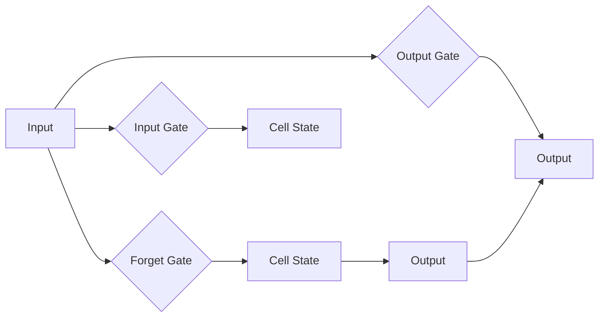

> 长短期记忆网络, LSTM, 递归神经网络, RNN, 时间序列分析, 自然语言处理, 深度学习, 机器学习

# 长短期记忆网络 (Long Short-Term Memory, LSTM) 原理与代码实例讲解

## 1. 背景介绍

随着深度学习技术的飞速发展，递归神经网络（Recurrent Neural Networks，RNN）因其能够处理序列数据的能力而受到广泛关注。然而，传统的RNN在处理长序列数据时，容易遇到梯度消失和梯度爆炸的问题，导致模型难以捕捉长距离的时间依赖关系。为了解决这个问题，Hochreiter和Schmidhuber在1997年提出了长短期记忆网络（Long Short-Term Memory，LSTM），它通过特殊的结构设计，有效地解决了长序列学习问题，并在多个领域取得了显著成果。

## 2. 核心概念与联系

### 2.1 LSTM的核心概念

LSTM是一种特殊的递归神经网络，其核心思想是通过引入门控机制来控制信息的流动，从而避免传统RNN的梯度消失和梯度爆炸问题。LSTM的主要组成部分包括：

- **遗忘门（Forget Gate）**：决定哪些信息应该从细胞状态中丢弃。
- **输入门（Input Gate）**：决定哪些新的信息应该被存储到细胞状态中。
- **细胞状态（Cell State）**：存储了时间序列的长期依赖关系。
- **输出门（Output Gate）**：决定细胞状态中哪些信息应该被输出。

### 2.2 LSTM架构的Mermaid流程图



### 2.3 LSTM与其他概念的关联

LSTM是RNN的一种，它继承了RNN的序列处理能力，同时通过门控机制解决了传统RNN的长期依赖问题。LSTM与深度学习、机器学习等领域紧密相关，是自然语言处理（NLP）、时间序列分析（TSA）等领域的重要工具。

## 3. 核心算法原理 & 具体操作步骤

### 3.1 算法原理概述

LSTM通过门控机制和细胞状态，有效地解决了长序列学习问题。具体来说，LSTM通过以下步骤来处理输入序列：

1. **遗忘门**：根据当前输入和前一个隐藏状态，计算遗忘门激活值，决定哪些信息应该从细胞状态中丢弃。
2. **输入门**：根据当前输入和前一个隐藏状态，计算输入门激活值，决定哪些新的信息应该被存储到细胞状态中。
3. **细胞状态更新**：根据遗忘门、输入门和当前输入，更新细胞状态。
4. **输出门**：根据当前细胞状态和前一个隐藏状态，计算输出门激活值，决定细胞状态中哪些信息应该被输出。
5. **隐藏状态更新**：根据输出门和当前细胞状态，更新隐藏状态。

### 3.2 算法步骤详解

LSTM的具体操作步骤如下：

1. 初始化隐藏状态和细胞状态。
2. 对于序列中的每个时间步，进行以下操作：
   - 根据当前输入和前一个隐藏状态，计算遗忘门、输入门和输出门的激活值。
   - 根据遗忘门、输入门和当前输入，更新细胞状态。
   - 根据输出门和当前细胞状态，更新隐藏状态。
3. 最后，输出最后一个隐藏状态作为序列的表示。

### 3.3 算法优缺点

**优点**：

- 解决了传统RNN的梯度消失和梯度爆炸问题。
- 能够有效地捕捉长距离的时间依赖关系。
- 在多个领域取得了显著成果。

**缺点**：

- 参数数量较多，训练过程较慢。
- 对超参数敏感，需要仔细调整。

### 3.4 算法应用领域

LSTM在以下领域取得了显著的应用成果：

- 自然语言处理（NLP）：文本分类、情感分析、机器翻译、语音识别等。
- 时间序列分析（TSA）：股票价格预测、天气预测、金融市场分析等。
- 图像序列分析：动作识别、视频分析等。

## 4. 数学模型和公式 & 详细讲解 & 举例说明

### 4.1 数学模型构建

LSTM的数学模型基于以下公式：

$$
i_t = \sigma(W_{xi}x_t + W_{hi}h_{t-1} + b_i) \\
f_t = \sigma(W_{xf}x_t + W_{hf}h_{t-1} + b_f) \\
g_t = tanh(W_{xg}x_t + W_{hg}h_{t-1} + b_g) \\
o_t = \sigma(W_{xo}x_t + W_{ho}h_{t-1} + b_o) \\
h_t = o_t \cdot tanh(g_t) \\
c_t = f_t \cdot c_{t-1} + i_t \cdot g_t
$$

其中，$i_t$、$f_t$、$o_t$ 分别是输入门、遗忘门和输出门的激活值，$c_t$ 是细胞状态，$h_t$ 是隐藏状态，$x_t$ 是当前输入，$W$ 和 $b$ 分别是权重和偏置。

### 4.2 公式推导过程

LSTM的公式推导过程较为复杂，涉及到矩阵乘法和激活函数的计算。具体推导过程可以参考相关文献。

### 4.3 案例分析与讲解

以下是一个使用LSTM进行文本分类的案例：

1. **数据准备**：将文本数据分割为单词，并转换为词向量。
2. **模型构建**：使用LSTM构建分类器，包括嵌入层、LSTM层和softmax层。
3. **训练**：使用标注数据进行训练，调整模型参数。
4. **测试**：使用测试数据评估模型性能。

## 5. 项目实践：代码实例和详细解释说明

### 5.1 开发环境搭建

1. 安装Python、NumPy、TensorFlow等工具。
2. 导入必要的库，如Keras等。

### 5.2 源代码详细实现

```python
from tensorflow.keras.models import Sequential
from tensorflow.keras.layers import Embedding, LSTM, Dense

model = Sequential()
model.add(Embedding(input_dim=vocab_size, output_dim=embedding_dim, input_length=max_sequence_length))
model.add(LSTM(100, return_sequences=True))
model.add(LSTM(100))
model.add(Dense(num_classes, activation='softmax'))

model.compile(optimizer='adam', loss='categorical_crossentropy', metrics=['accuracy'])

model.fit(X_train, y_train, epochs=10, batch_size=128)
```

### 5.3 代码解读与分析

- `Embedding` 层将单词转换为词向量。
- 两个 `LSTM` 层分别用于提取特征和分类。
- `Dense` 层用于输出最终的分类结果。

### 5.4 运行结果展示

在测试集上评估模型的性能，得到准确率、召回率等指标。

## 6. 实际应用场景

LSTM在以下实际应用场景中取得了显著成果：

- **股票价格预测**：通过分析历史股票价格数据，预测未来价格趋势。
- **天气预报**：分析历史气象数据，预测未来天气状况。
- **机器翻译**：将一种语言的文本翻译成另一种语言。
- **文本分类**：对文本进行分类，如情感分析、主题分类等。

## 7. 工具和资源推荐

### 7.1 学习资源推荐

- 《深度学习》（Goodfellow et al.）
- 《神经网络与深度学习》（邱锡鹏）
- LSTM相关论文

### 7.2 开发工具推荐

- TensorFlow
- Keras
- PyTorch

### 7.3 相关论文推荐

- Hochreiter, S., & Schmidhuber, J. (1997). Long short-term memory. Neural computation, 9(8), 1735-1780.
- Graves, A., & Mohamed, A. R. (2014). Speech recognition with deep recurrent neural networks. In Acoustics, speech and signal processing (icassp), 2014 ieee international conference on (pp. 6645-6649).

## 8. 总结：未来发展趋势与挑战

### 8.1 研究成果总结

LSTM作为一种强大的序列学习模型，在多个领域取得了显著成果。然而，LSTM仍存在一些局限性，如参数数量较多、训练过程较慢等。

### 8.2 未来发展趋势

未来，LSTM的发展趋势包括：

- 与其他模型结合，如Transformer等。
- 引入注意力机制，提高模型的注意力能力。
- 使用更有效的优化算法，提高训练效率。

### 8.3 面临的挑战

LSTM面临的挑战包括：

- 参数数量较多，训练过程较慢。
- 对超参数敏感，需要仔细调整。
- 如何进一步提高模型的泛化能力。

### 8.4 研究展望

未来，LSTM的研究重点包括：

- 开发更有效的长序列学习模型。
- 提高模型的泛化能力和鲁棒性。
- 将LSTM应用于更多领域，如医疗、金融等。

## 9. 附录：常见问题与解答

**Q1：LSTM与传统RNN有什么区别？**

A：LSTM是RNN的一种，它通过引入门控机制来控制信息的流动，从而避免传统RNN的梯度消失和梯度爆炸问题。

**Q2：LSTM如何解决梯度消失和梯度爆炸问题？**

A：LSTM通过引入遗忘门、输入门和输出门，控制信息的流动，从而避免梯度消失和梯度爆炸问题。

**Q3：LSTM在哪些领域取得了显著成果？**

A：LSTM在自然语言处理、时间序列分析、图像序列分析等领域取得了显著成果。

**Q4：如何使用LSTM进行文本分类？**

A：使用LSTM进行文本分类，需要将文本数据转换为词向量，然后使用LSTM提取特征，最后使用softmax层进行分类。

**Q5：LSTM的缺点是什么？**

A：LSTM的缺点包括参数数量较多、训练过程较慢、对超参数敏感等。

---

作者：禅与计算机程序设计艺术 / Zen and the Art of Computer Programming